<div align="center">
<br><br>


<h3>Universidad Peruana de Ciencias Aplicadas</h3>

<strong>Facultad de Ingeniería</strong><br>
<strong>Carrera de Ingeniería de Software</strong><br>

<strong>Período 202520 </strong><br>
<strong>1ASI0730</strong><br>
<strong>Aplicaciones Web</strong><br>
<strong>NRC: 7454<br>

<strong>Nombre del profesor: Ángel Augusto Velásquez Núñez</strong><br>

<br><strong>*Informe de Trabajo Final*</strong><br><br>

<strong>Nombre del startup: Edgerunners</strong><br>
<strong>Nombre del producto: SmartStay</strong><br>

    
### Relación de Integrantes

|   Código   |   Apellidos      |     Nombres     |
|:----------:|:----------------:|:---------------:|
| U20221E617 | Verona Flores    | Ítalo Sebastián |
| U20231A816 | Valverde Portuguez| Natalia Ximena |
| U202019498 | Fernández Garfias | Alexander Piero |
| U20191c464 | Saavedra Angulo   | José Jhonatan  |
| U20201F051 | Ramos Aguirre    | Aldair Joaquín |
| U202412591 | Seminario Castillo | Diego Vicente  |
| U202316878 | Vidal Malaga    | Jareth Beycker |


<strong> Diciembre, 2025</strong><br>

</div>

<div style="page-break-after: always;"></div>

## Registro de Versiones del Informe

El objetivo de esta sección es resumir las modificaciones relevantes que se realizan al informe durante el ciclo de vida del proyecto.  
Esta sección inicia en una página nueva e incluye un cuadro con la siguiente estructura:


| Versión |   Fecha    |                 Autor                 |                 Descripción de los Cambios                  |
|:-------:|:----------:|:-------------------------------------:|:-----------------------------------------------------------:|
|   1.0   | 01/09/2025 | Jose Jhonatan Saavedra Angulo (Líder) | Estructuración inicial del proyecto y coordinación del equipo |
|   1.1   | 01/09/2025 |     Italo Sebastian Verona Flores     | Creación del documento inicial del Informe de Trabajo Final |
|   1.2   | 11/09/2025 |    Natalia Ximena Valverde Portuguez  | Desarrollo de wireframes, mockups y guías de estilo visual |
|   2.0   | 20/09/2025 |   Alexander Piero Fernandez Garfias   | Implementación de landing page y desarrollo front-end |
|   2.1   | 25/09/2025 |     Aldair Joaquin Ramos Aguirre      | Elaboración de EventStorming e Impact Mapping |
|   2.2   | 5/10/2025 |  Equipo Edgerunners (Todos los miembros) | Finalización y revisión integral del Informe de Trabajo Final |
|   3.0   | 24/10/2025 |  Equipo Edgerunners (Jose, Italo, Natalia, Alexander) | Documentación del Sprint 3: Development Evidence, Deployment Evidence y Team Collaboration Insights |
|   3.1   | 25/10/2025 |   Alexander Piero Fernandez Garfias   | Corrección de terminología: actualización de referencias a "bounded contexts" en todo el documento |
|   3.2   | 31/10/2025 |  Equipo Edgerunners (Jose, Italo, Natalia, Alexander) | Mejora de User Stories y Technical Stories: eliminación de referencias a UI y reescritura con formato API REST según estándares del profesor |
|   3.3   | 31/10/2025 |  Equipo Edgerunners (Jose, Italo, Natalia, Alexander) | Mejora del Sprint Goal del Sprint 3 según formato Outcome-Impact-Event |
|   3.4   | 01/11/2025 |  Equipo Edgerunners (Jose, Italo, Natalia, Alexander) | Corrección del Sprint Backlog 3 para alinearlo con las User Stories y Technical Stories definidas |
|   3.5   | 02/11/2025 |  Equipo Edgerunners (Jose, Italo, Natalia, Alexander) | Completar sección de Evaluaciones según heurísticas (5.3.3) siguiendo formato del Anexo D |
|   3.6   | 03/11/2025 |  Equipo Edgerunners (Jose, Italo, Natalia, Alexander) | Agregar sección de Video About-the-Product (5.4) con estructura completa |
|   3.7   | 10/11/2025 |  Equipo Edgerunners (Jose, Italo, Natalia, Alexander) | Agregar secciones de Conclusiones y Bibliografía al final del documento |
|   3.8   | 15/11/2025 |  Equipo Edgerunners (Jose, Italo, Natalia, Alexander) | Limpieza de assets no utilizados y corrección de referencias de imágenes en secciones de Empathy Mapping y EventStorming |
|   4.0   | 21/11/2025 |  Equipo Edgerunners (Daniel, Jareth, Natalia, Italo) | Documentación del Sprint 4: Development Evidence, Deployment Evidence y Team Collaboration Insights |
|   4.1   | 25/11/2025 | Natalia Ximena Valverde Portuguez   | Corrección en Landing Page que permita abrir el nuevo FrontEnd y arreglos en la estructura FrontEnd para ajustarlo al Backend |
|   4.2   | 30/11/2025 | Italo Sebastian Verona Flores | Desarrollo de la integración de bounded context relacionado a los usuarios y sus perfiles, y bookings del rol guest del BackEnd junto con el FrontEnd |
|   4.3   | 01/12/2025 | Diego Vicente Seminario Castillo| Creación de vistas de método de pago en el bounded context Payments del FrontEnd|
|   4.4   | 02/12/2025 | Jareth Beycker Vidal Malaga | Integración de rol staff del BackEnd junto con FrontEnd |
|   4.5   | 03/12/2025 | Equipo Edgerunners (Daniel, Jareth, Natalia, Italo)  | Correcciones del documento del Trabajo final y videos como About The Team |
|   4.6   | 04/12/2025 |Equipo Edgerunners (Daniel, Jareth, Natalia, Italo)  | Corrección la función de traducción del FrontEnd después de correcciones de integración con el BackEnd |


<div style="page-break-after: always;"></div>

## Project Report Collaboration Insights

- **URL del repositorio para el Project Report:** https://github.com/Edgerunners-Aplicaciones-Web/report


El desarrollo del presente informe de trabajo final se realizó de manera colaborativa utilizando las herramientas de control de versiones de GitHub. A continuación se presenta la evidencia de la participación y contribuciones de cada miembro del equipo:

El trabajo en el repositorio del informe demuestra la participación activa de todos los miembros del equipo por cada entrega.

*Primer Avance*

En el Primer Avance el objetivo principal fue la construcción completa del informe base del proyecto. El equipo trabajó en:

- Estructura del documento (portada, índice, organización de capítulos).

- Desarrollo de contenido general y conceptual:

- Contexto del proyecto

- Problemática y objetivos

- Alcance del sistema

- Arquitectura conceptual

- Identificación inicial de usuarios, funcionalidades y módulos

- Definición de lineamientos de estilo y formato del documento.

- Revisión colaborativa del contenido, ajustando redacción, coherencia y estilo.


Los gráficos muestran la distribución del trabajo del equipo durante esta fase, donde todos los miembros aportaron contenido significativo al informe base.


*Segundo Avance (Trabajo Parcial)*

Durante el segundo avance, el informe se actualizó para documentar los avances técnicos realizados en los Sprint 1 y Sprint 2, los cuales se centraron en:

- Sprint 1: Implementación inicial de la Landing Page (estructura HTML/CSS).

- Sprint 2: Desarrollo del frontend con mayor detalle:

  - Beneficios, secciones informativas y navegación

  - Diseño, maquetación y primeros componentes visuales

  - Integración de estilos y estructura responsive

En el informe se añadieron:

- Capítulos de Evidencia de Desarrollo,

- Capturas del frontend,

- Avances registrados en GitHub,

- Tablas de commits y evidencias de Trello.

 


El incremento notable de commits en la documentación refleja el desarrollo técnico del frontend y las mejoras continuas al informe.


*Tercer Avance*

En el tercer avance se integró la documentación del Sprint 3:

- Sprint 3 – Backend

  - Diseño y creación de la arquitectura del backend con Spring Boot

  - Implementación de entidades, repositorios, controladores y servicios

  - Generación de endpoints y pruebas iniciales

  - Evidencias de Swagger, commits y estructura del proyecto


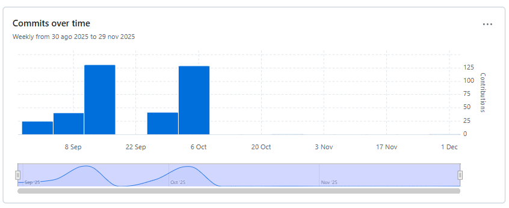

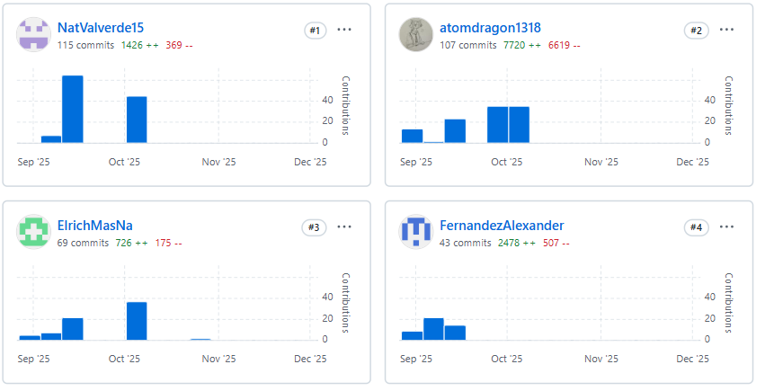
 
 Los gráficos reflejan la documentación del trabajo más técnico orientado al backend.


*Cuarto Avance (Trabajo Final)*

En el cuarto avance se integró la documentación del Sprint 4:

- Sprint 4 – Aquí nos enfocamos más en la integración de frontend con backend y API RESTful.

  Aquí se unieron dos integrantes más a nuestro equipo y a su vez dos dejaron el proyecto hasta el anterior sprint.

 Los gráficos reflejan la documentación final con medidas de participación en este trabajo final.

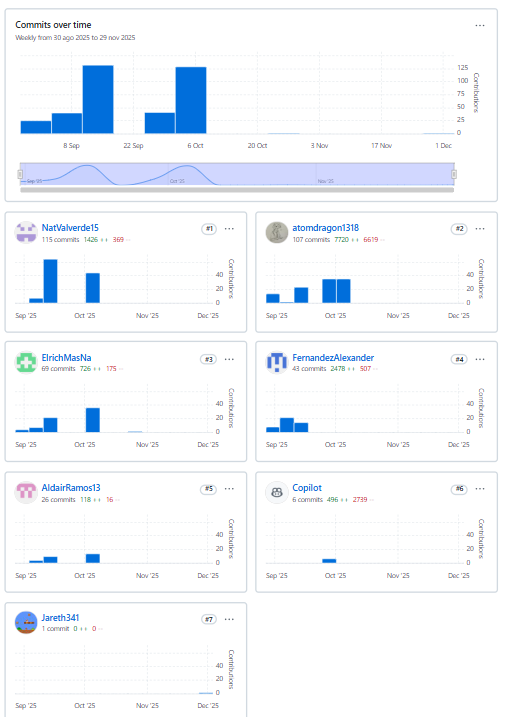

### Metodología de Trabajo Colaborativo

- **Control de versiones:** Uso de Git para el seguimiento de cambios y colaboración
- **Revisiones de contenido:** Implementación de pull requests para la validación del contenido
- **Documentación continua:** Actualización incremental del informe durante todo el ciclo del proyecto
- **Coordinación de equipo:** Reuniones regulares para alinear el progreso y resolver conflictos

<div style="page-break-after: always;"></div>

## Contenido

- [Capítulo I: Introducción](#capítulo-i-introducción)
    - [1.1. Startup Profile](#11-startup-profile)
        - [1.1.1. Descripción de la Startup](#111-descripción-de-la-startup)
        - [1.1.2. Perfiles de integrantes del equipo](#112-perfiles-de-integrantes-del-equipo)
    - [1.2. Solution Profile](#12-solution-profile)
        - [1.2.1. Antecedentes y problemática](#121-antecedentes-y-problemática)
        - [1.2.2. Lean UX Process](#122-lean-ux-process)
            - [1.2.2.1. Lean UX Problem Statements](#1221-lean-ux-problem-statements)
            - [1.2.2.2. Lean UX Assumptions](#1222-lean-ux-assumptions)
            - [1.2.2.3. Lean UX Hypothesis Statements](#1223-lean-ux-hypothesis-statements)
            - [1.2.2.4. Lean UX Canvas](#1224-lean-ux-canvas)
    - [1.3. Segmentos objetivo](#13-segmentos-objetivo)

- [Capítulo II: Requirements Elicitation & Analysis](#capítulo-ii-requirements-elicitation--analysis)
    - [2.1. Competidores](#21-competidores)
        - [2.1.1. Análisis competitivo](#211-análisis-competitivo)
        - [2.1.2. Estrategias y tácticas frente a competidores](#212-estrategias-y-tácticas-frente-a-competidores)
    - [2.2. Entrevistas](#22-entrevistas)
        - [2.2.1. Diseño de entrevistas](#221-diseño-de-entrevistas)
        - [2.2.2. Registro de entrevistas](#222-registro-de-entrevistas)
        - [2.2.3. Análisis de entrevistas](#223-análisis-de-entrevistas)
    - [2.3. Needfinding](#23-needfinding)
        - [2.3.1. User Personas](#231-user-personas)
        - [2.3.2. User Task Matrix](#232-user-task-matrix)
        - [2.3.3. User Journey Mapping](#233-user-journey-mapping)
        - [2.3.4. Empathy Mapping](#234-empathy-mapping)
    - [2.4. Big Picture EventStorming](#24-big-picture-eventstorming)
    - [2.5. Ubiquitous Language](#25-ubiquitous-language)

- [Capítulo III: Requirements Specification](#capítulo-iii-requirements-specification)
    - [3.1. User Stories](#31-user-stories)
    - [3.2. Impact Mapping](#32-impact-mapping)
    - [3.3. Product Backlog](#33-product-backlog)

- [Capítulo IV: Product Design](#capítulo-iv-product-design)
    - [4.1. Style Guidelines](#41-style-guidelines)
        - [4.1.1. General Style Guidelines](#411-general-style-guidelines)
        - [4.1.2. Web Style Guidelines](#412-web-style-guidelines)
    - [4.2. Information Architecture](#42-information-architecture)
        - [4.2.1. Organization Systems](#421-organization-systems)
        - [4.2.2. Labeling Systems](#422-labeling-systems)
        - [4.2.3. SEO Tags and Meta Tags](#423-seo-tags-and-meta-tags)
        - [4.2.4. Searching Systems](#424-searching-systems)
        - [4.2.5. Navigation Systems](#425-navigation-systems)
    - [4.3. Landing Page UI Design](#43-landing-page-ui-design)
        - [4.3.1. Landing Page Wireframe](#431-landing-page-wireframe)
        - [4.3.2. Landing Page Mock-up](#432-landing-page-mock-up)
    - [4.4. Web Applications UX/UI Design](#44-web-applications-uxui-design)
        - [4.4.1. Web Applications Wireframes](#441-web-applications-wireframes)
        - [4.4.2. Web Applications Wireflow Diagrams](#442-web-applications-wireflow-diagrams)
        - [4.4.3. Web Applications Mock-ups](#443-web-applications-mock-ups)
        - [4.4.4. Web Applications User Flow Diagrams](#444-web-applications-user-flow-diagrams)
    - [4.5. Web Applications Prototyping](#45-web-applications-prototyping)
    - [4.6. Domain-Driven Software Architecture](#46-domain-driven-software-architecture)
        - [4.6.1. Design-Level EventStorming](#461-design-level-eventstorming)
        - [4.6.2. Software Architecture Context Diagram](#462-software-architecture-context-diagram)
        - [4.6.3. Software Architecture Container Diagrams](#463-software-architecture-container-diagrams)
        - [4.6.4. Software Architecture Components Diagrams](#464-software-architecture-components-diagrams)
    - [4.7. Software Object-Oriented Design](#47-software-object-oriented-design)
        - [4.7.1. Class Diagrams](#471-class-diagrams)
    - [4.8. Database Design](#48-database-design)
        - [4.8.1. Database Diagrams](#481-database-diagrams)

- [Capítulo V: Product Implementation, Validation & Deployment](#capítulo-v-product-implementation-validation--deployment)
    - [5.1. Software Configuration Management](#51-software-configuration-management)
        - [5.1.1. Software Development Environment Configuration](#511-software-development-environment-configuration)
        - [5.1.2. Source Code Management](#512-source-code-management)
        - [5.1.3. Source Code Style Guide & Conventions](#513-source-code-style-guide--conventions)
        - [5.1.4. Software Deployment Configuration](#514-software-deployment-configuration)
    - [5.2. Landing Page, Services & Applications Implementation](#52-landing-page-services--applications-implementation)
        - [5.2.1. Sprint 1](#521-sprint-1)
            - [5.2.1. Sprint Planning 1](#5211-sprint-planning-1)
            - [5.2.1.2. Aspect Leaders and Collaborators](#5212-aspect-leaders-and-collaborators)
            - [5.2.1.3. Sprint Backlog 1](#5213-sprint-backlog-1)
            - [5.2.1.4. Development Evidence for Sprint Review](#5214-development-evidence-for-sprint-review)
            - [5.2.1.5. Execution Evidence for Sprint Review](#5215-execution-evidence-for-sprint-review)
            - [5.2.1.6. Services Documentation Evidence for Sprint Review](#5216-services-documentation-evidence-for-sprint-review)
            - [5.2.1.7. Software Deployment Evidence for Sprint Review](#5217-software-deployment-evidence-for-sprint-review)
            - [5.2.1.8. Team Collaboration Insights during Sprint](#5218-team-collaboration-insights-during-sprint)
        - [5.2.2. Sprint 2](#522-sprint-2)
            - [5.2.2.1 Sprint Planning 2](#5221-sprint-planning-2)
            - [5.2.2.2. Aspect Leaders and Collaborators](#5222-aspect-leaders-and-collaborators)
            - [5.2.2.3. Sprint Backlog 2](#5223-sprint-backlog-2)
            - [5.2.2.4. Development Evidence for Sprint Review](#5224-development-evidence-for-sprint-review)
            - [5.2.2.5. Execution Evidence for Sprint Review](#5225-execution-evidence-for-sprint-review)
            - [5.2.2.6. Services Documentation Evidence for Sprint Review](#5226-services-documentation-evidence-for-sprint-review)
            - [5.2.2.7. Software Deployment Evidence for Sprint Review](#5227-software-deployment-evidence-for-sprint-review)
            - [5.2.2.8. Team Collaboration Insights during Sprint](#5228-team-collaboration-insights-during-sprint)
        - [5.2.3. Sprint 3](#523-sprint-3)
            - [5.2.3.1 Sprint Planning 3](#5231-sprint-planning-3)
            - [5.2.3.2. Aspect Leaders and Collaborators](#5232-aspect-leaders-and-collaborators)
            - [5.2.3.3. Sprint Backlog 3](#5233-sprint-backlog-3)
            - [5.2.3.4. Development Evidence for Sprint Review](#5234-development-evidence-for-sprint-review)
            - [5.2.3.5. Execution Evidence for Sprint Review](#5235-execution-evidence-for-sprint-review)
            - [5.2.3.6. Services Documentation Evidence for Sprint Review](#5236-services-documentation-evidence-for-sprint-review)
            - [5.2.3.7. Software Deployment Evidence for Sprint Review](#5237-software-deployment-evidence-for-sprint-review)
            - [5.2.3.8. Team Collaboration Insights during Sprint](#5238-team-collaboration-insights-during-sprint)
        - [5.2.4. Sprint 4](#524-sprint-4)
            - [5.2.4.1 Sprint Planning 4](#5241-sprint-planning-4)
            - [5.2.4.2. Aspect Leaders and Collaborators](#5242-aspect-leaders-and-collaborators)
            - [5.2.4.3. Sprint Backlog 2](#5243-sprint-backlog-4)
            - [5.2.4.4. Development Evidence for Sprint Review](#5244-development-evidence-for-sprint-review)
            - [5.2.4.5. Execution Evidence for Sprint Review](#5245-execution-evidence-for-sprint-review)
            - [5.2.4.6. Services Documentation Evidence for Sprint Review](#5246-services-documentation-evidence-for-sprint-review)
            - [5.2.4.7. Software Deployment Evidence for Sprint Review](#5247-software-deployment-evidence-for-sprint-review)
            - [5.2.4.8. Team Collaboration Insights during Sprint](#5248-team-collaboration-insights-during-sprint)
    - [5.3. Validation Interviews](#53-validation-interviews)
       - [ 5.3.1. Diseño de Entrevistas](#531-diseño-de-entrevistas)
       - [5.3.2. Registro de Entrevistas](#532-registro-de-entrevistas) 
       - [5.3.3. Evaluaciones según heurísticas](#533-evaluaciones-según-heurísticas)
    - [5.4. Video About-the-Product](#54-video-about-the-product) 

- [Conclusiones](#conclusiones)
  - [Conclusiones y Recomendaciones](#conclusiones-y-recomendaciones)
  - [Video About The Team](#video-about-the-team)

- [Bibliografía y Referencias](#bibliografía-y-referencias)

<div style="page-break-after: always;"></div>


## Student Outcome

El curso contribuye al cumplimiento del Student Outcome ABET:

### ABET – EAC - Student Outcome 5

Criterio: La capacidad de funcionar efectivamente en un equipo cuyos miembros juntos proporcionan liderazgo, crean un entorno de colaboración e inclusivo, establecen objetivos, planifican tareas y cumplen objetivos.

En el siguiente cuadro se describe las acciones realizadas y enunciados de conclusiones por parte del grupo, que permiten sustentar el haber alcanzado el logro del ABET – EAC - Student Outcome 5

| Criterio específico | Acciones realizadas     | Conclusiones                                                               |
|----------------------------------------------------------------------------------------------------|----------------------------------------------------------------------------------------------------------------------------------------------------------------------------------------------------------------------------------------------------------------------------------------------------------------------------------------------------------------------------------------------------------------------------------------------------------------------------------------------------------------------------------------------------------------------------------------------------------------------------------------------------------------------------------------------------------------------------------------------------------------------------------------------------------------------------------------------------------------------------------------------------------------------------------------------------------------------------------------------------------------------------------------------------------------------------------------------------------------------------------------------------------------------------------------------------------------------------------------------------------------------------------------------------------------------------------------------------------------------------------------------------------------------------------------------------------------------------------------------------------|-----------------------------------------------------------------------------------------------------------------------------------------------------------------------------------------------------------------------------------------------------------------------------------------------------------------------------------------------------------------------------------------------------------------------------------------------------------------------------------------------------------------------------------------------------------------------------------------------------------------------------------------------------------------------------------------------------------------------------------------------------------------------------------------------------------------------------------------------------------------------------------------------------------------------------------------------------------|
| **Trabaja en equipo para proporcionar liderazgo en forma conjunta**                                |<br> **TB(Sprint1)** <br> Italo Sebastian Verona Flores TB1 <ul><li>Lideré la definición de la arquitectura de software del proyecto 'Smart Stay', utilizando el modelo C4 para establecer los diagramas de Contexto, Contenedores y Componentes.</li><li>Dirigí el diseño de la base de datos, solicitando y validando los esquemas en SQL y DBML para asegurar la correcta persistencia de los datos según los Bounded Contexts definidos.</li></ul> Natalia Ximena Valverde Portuguez TB1 <ul><li>Lideré el área de diseño de experiencia de usuario (UX), elaborando los wireframes y mockups de alta fidelidad que sirvieron como guía visual para todo el proyecto.</li><li>Dirigí la creación de la guía de estilos visuales de "Smart Stay", definiendo la paleta de colores, tipografía y branding para asegurar una identidad de marca coherente y profesional.</li></ul> Alexander Piero Fernandez Garfias TB1 <ul><li>Tomé el liderazgo en el desarrollo front-end, traduciendo los mockups y guías de estilo en un prototipo funcional utilizando HTML, Tailwind CSS y JavaScript.</li><li>Dirigí la implementación técnica de la arquitectura de página única estática (SPA), asegurando que la navegación entre vistas fuera fluida y eficiente.</li></ul> Jose Jhonatan Saavedra Angulo TB1 <ul><li>Lideré la fase de análisis de requerimientos del proyecto, siendo responsable de la creación y redacción del Product Backlog, incluyendo todas las Épicas y User Stories.</li><li>Guié la alineación del producto con las necesidades del negocio mediante la elaboración del Lean UX Canvas, asegurando que cada funcionalidad tuviera un propósito claro.</li></ul> Aldair Joaquin Ramos Aguirre TB1  <ul><li> Dirigí la definición Big Picture EventStorming para descubrir eventos de negocio y flujos principales. </li> <li>  Dirigí la definición mediante Impact Mapping para identificar objetivos, actores, impactos y entregables clave, estableciendo así una base estratégica que respaldó el diseño de la arquitectura de software del proyecto 'Smart Stay'.</li></ul> <br> **TP (Sprint 2 - Frontend)** <br> Italo Sebastian Verona Flores TP <ul><li>Lideré el diseño visual y la maquetación web del frontend funcional de Smart Stay, estableciendo la estructura y componentes principales de la aplicación web.</li><li>Dirigí la implementación de las vistas principales (Admin, Guest, Staff) siguiendo los principios de diseño establecidos y asegurando la coherencia visual.</li></ul> Natalia Ximena Valverde Portuguez TP <ul><li>Lideré la implementación técnica del cambio de idioma (multilenguaje funcional), desarrollando el sistema de internacionalización que permite alternar entre español e inglés.</li><li>Dirigí la integración del sistema de idiomas en toda la aplicación, asegurando que todos los componentes respeten la selección del usuario.</li></ul> Alexander Piero Fernandez Garfias TP <ul><li>Lideré la implementación de responsividad y pruebas en distintos dispositivos, asegurando que la aplicación funcione correctamente en móviles, tablets y escritorio.</li><li>Dirigí las pruebas de compatibilidad y ajustes de diseño responsive para garantizar una experiencia óptima en todos los tamaños de pantalla.</li></ul> Jose Jhonatan Saavedra Angulo TP <ul><li>Lideré el despliegue de la aplicación web, configurando el proceso de deployment y asegurando que la aplicación esté disponible públicamente.</li><li>Dirigí la integración con servicios de hosting y la configuración de CI/CD para automatizar el despliegue continuo.</li></ul> <br> **TB2 (Sprint 3 - Backend)** <br> Italo Sebastian Verona Flores TB2 <ul><li>Lideré la implementación de la API RESTful con endpoints principales, desarrollando los controladores y servicios para los bounded contexts core del negocio.</li><li>Dirigí la creación de los endpoints de Accommodations, Bookings y Payments, asegurando que sigan las mejores prácticas de diseño REST.</li></ul> Natalia Ximena Valverde Portuguez TB2 <ul><li>Lideré la integración de bounded contexts, coordinando la estructura y comunicación entre los diferentes contextos del dominio (Accommodations, Bookings, Payments).</li><li>Dirigí la implementación de Swagger/OpenAPI para documentación interactiva de la API, facilitando la integración con el frontend.</li></ul> Alexander Piero Fernandez Garfias TB2 <ul><li>Lideré la configuración y conexión con la base de datos, implementando Entity Framework Core y configurando la persistencia con MySQL.</li><li>Dirigí el diseño del esquema de base de datos y las migraciones necesarias para soportar los bounded contexts implementados.</li></ul> Jose Jhonatan Saavedra Angulo TB2 <ul><li>Lideré la gestión de autenticación y seguridad, implementando middleware de autenticación JWT y configurando la autorización para todas las rutas.</li><li>Dirigí la implementación de control de acceso basado en roles y la configuración de seguridad de la API.</li></ul> <br> **TF (Sprint 4 - Integración de Backend y FrontEnd)** <br> Italo Sebastian Verona Flores TF <ul><li>Lideró la integración completa entre frontend y backend y validó la comunicación adecuada entre API y vistas.</li><li>Solucionó errores de incompatibilidad entre modelos y datos y coordinó ajustes finales para garantizar consistencia técnica.</li></ul> Natalia Ximena Valverde Portuguez TF <ul><li>Validó e integró textos dinámicos y multilenguaje con datos reales.</li><li>Aseguró que la UI refleje de forma correcta la información proveniente del backend.</li></ul> Diego Vicente Seminario Castillo TF <ul><li>Implementó nuevos estados y flujos basados en datos reales.</li><li>Aseguró consistencia entre lógica de presentación y lógica de negocio.</li></ul> Jareth Beycker Vidal Malaga TF <ul><li>Establecí las metas de seguridad y autenticación, planificando las tareas de implementación de JWT y middleware de autorización para proteger todos los endpoints.</li><li>Configuró autorización por roles.</li></ul> | <br> **TB1** <br> <li>El liderazgo del equipo se manifestó de forma conjunta al distribuir responsabilidades clave (arquitectura, diseño de base de datos, UI/UX) entre los miembros, permitiendo que cada uno guiara su área de especialización y contribuyera a una visión técnica coherente y unificada del producto.</li><li>Las decisiones de diseño cruciales, como la adopción del modelo C4 para la arquitectura y la separación funcional de roles de usuario, se tomaron de manera consensuada, discutiendo y evaluando colectivamente las mejores alternativas para la robustez y escalabilidad del sistema.</li><li>El equipo demostró un liderazgo proactivo al guiar el proyecto a través de un proceso iterativo de refinamiento, transformando los conceptos iniciales en un conjunto de artefactos de diseño detallados y un prototipo funcional.</li> <br> **TP** <br> <li>El liderazgo conjunto se evidenció en la distribución de responsabilidades técnicas del frontend: diseño visual, multilenguaje, responsividad y despliegue, permitiendo que cada integrante liderara su área de especialización y contribuyera a una aplicación web funcional y completa.</li><li>Las decisiones técnicas sobre la estructura de la aplicación, el sistema de internacionalización y la estrategia de despliegue se tomaron de manera colaborativa, asegurando que todos los componentes trabajaran de forma integrada y coherente.</li><li>El equipo demostró liderazgo técnico al transformar los mockups y diseños en una aplicación web funcional, implementando características complejas como el cambio de idioma y la adaptación responsive, cumpliendo con los objetivos del Sprint 2.</li> <br> **TB2** <br> <li>El liderazgo conjunto se manifestó en la distribución de responsabilidades del backend: implementación de API, integración de bounded contexts, configuración de base de datos y seguridad, permitiendo que cada integrante liderara su área técnica y contribuyera a una API RESTful robusta y escalable.</li><li>Las decisiones arquitectónicas sobre la estructura de bounded contexts, la configuración de persistencia y la estrategia de autenticación se tomaron de manera consensuada, asegurando que todos los componentes del backend funcionaran de forma integrada y segura.</li><li>El equipo demostró liderazgo técnico al implementar los bounded contexts core del negocio (Accommodations, Bookings, Payments), estableciendo una base sólida para futuras expansiones y cumpliendo con los objetivos del Sprint 3.</li>  <br> **TF** <br> <li>El liderazgo conjunto se evidenció al integrar completamente el frontend y el backend, coordinando la alineación de modelos, endpoints, estructuras de datos y componentes visuales, lo que permitió que cada miembro liderara su área técnica y aportara a un sistema unificado y funcional.</li><li>Las decisiones técnicas sobre comunicación entre capas, manejo de estados, sincronización de datos, validación de autenticación y estandarización de respuestas de la API se tomaron de manera consensuada, asegurando una interacción fluida, segura y coherente entre todos los módulos del proyecto.</li><li>El equipo demostró liderazgo técnico al resolver problemas reales de integración, ejecutar pruebas funcionales completas y garantizar que el sistema final operara correctamente con datos reales, consolidando así el cierre del ciclo de desarrollo y cumpliendo con los objetivos del Sprint 4.</li>|
|**Crea un entorno colaborativo e inclusivo, establece metas, planifica tareas y cumple objetivos** | Italo Sebastian Verona Flores TB1 <ul><li>Establecí los objetivos para cada artefacto de diseño, planificando la secuencia de trabajo desde los diagramas de alto nivel (C4) hasta la implementación del front-end.</li><li>Fomenté un entorno de colaboración al proporcionar retroalimentación específica y constructiva sobre cada entregable, permitiendo la mejora continua del producto final.</li></ul> Natalia Ximena Valverde Portuguez TB1 <ul><li>Creé un entorno colaborativo al proporcionar los artefactos visuales (mockups) que sirvieron como un "lenguaje común" para alinear el trabajo de arquitectura y desarrollo.</li><li>Establecí las metas de diseño visual y de usabilidad, planificando las tareas de creación de componentes gráficos y asegurando el cumplimiento de los objetivos estéticos del proyecto.</li></ul> Alexander Piero Fernandez Garfias TB1 <ul><li>Colaboré estrechamente con el área de diseño para planificar las tareas de maquetación, asegurando que la implementación técnica fuera fiel a la visión UX/UI.</li><li>Cumplí el objetivo de entregar una landing page interactiva y funcional, implementando características complejas como el selector de idioma y la navegación entre vistas.</li></ul> Jose Jhonatan Saavedra Angulo TB1 <ul><li>Establecí las metas funcionales del producto a través de User Stories claras y bien definidas, lo que permitió al equipo planificar sus tareas de desarrollo de manera efectiva.</li><li>Creé un puente de colaboración entre la visión de negocio y el equipo técnico, asegurando que los entregables cumplieran con los objetivos planteados en la fase de análisis.</li></ul> Aldair Joaquin Ramos Aguirre TB1 <ul><li>Conduje una sesión de Big Picture EventStorming, mapeando eventos de negocio y flujos esenciales para obtener una visión integral de los procesos del proyecto.</li><li>Lideré el uso de Impact Mapping para definir metas, actores, resultados esperados y entregables, sentando las bases estratégicas.</li></ul> <br> **TP (Sprint 2 - Frontend)** <br> Italo Sebastian Verona Flores TP <ul><li>Establecí las metas de diseño visual y maquetación, planificando las tareas de implementación de las vistas principales (Admin, Guest, Staff) y asegurando la coherencia visual en toda la aplicación.</li><li>Fomenté un entorno colaborativo al coordinar el trabajo de diseño con el equipo, proporcionando retroalimentación sobre la implementación de componentes y asegurando que se cumplieran los objetivos de diseño establecidos.</li></ul> Natalia Ximena Valverde Portuguez TP <ul><li>Creé un entorno colaborativo al desarrollar el sistema de multilenguaje que facilitó la comunicación y alineación del equipo en la implementación de textos e interfaces.</li><li>Establecí las metas de internacionalización, planificando las tareas de traducción e integración del sistema de idiomas en todos los componentes de la aplicación.</li></ul> Alexander Piero Fernandez Garfias TP <ul><li>Colaboré estrechamente con el equipo para planificar las tareas de responsividad, asegurando que la aplicación fuera accesible y funcional en todos los dispositivos.</li><li>Cumplí el objetivo de entregar una aplicación completamente responsive, implementando pruebas exhaustivas en diferentes tamaños de pantalla y resolviendo problemas de adaptación.</li></ul> Jose Jhonatan Saavedra Angulo TP <ul><li>Establecí las metas de despliegue y disponibilidad, planificando las tareas de configuración de hosting y automatización del proceso de deployment.</li><li>Creé un entorno de colaboración al coordinar el despliegue continuo, asegurando que todos los cambios se integraran correctamente y la aplicación estuviera siempre disponible.</li></ul> <br> **TB2 (Sprint 3 - Backend)** <br> Italo Sebastian Verona Flores TB2 <ul><li>Establecí las metas de implementación de la API RESTful, planificando las tareas de desarrollo de endpoints y servicios para los bounded contexts core del negocio.</li><li>Fomenté un entorno colaborativo al coordinar el trabajo de implementación de endpoints, proporcionando retroalimentación sobre la estructura y diseño de la API.</li></ul> Natalia Ximena Valverde Portuguez TB2 <ul><li>Creé un entorno colaborativo al liderar la integración de bounded contexts, facilitando la comunicación entre los diferentes contextos y asegurando una arquitectura coherente.</li><li>Establecí las metas de documentación de la API, planificando las tareas de implementación de Swagger/OpenAPI y asegurando que la documentación fuera completa y accesible.</li></ul> Alexander Piero Fernandez Garfias TB2 <ul><li>Colaboré estrechamente con el equipo para planificar las tareas de configuración de base de datos, asegurando que la persistencia de datos fuera robusta y escalable.</li><li>Cumplí el objetivo de configurar Entity Framework Core con MySQL, implementando las migraciones necesarias y asegurando la integridad de los datos en todos los bounded contexts.</li></ul> Jose Jhonatan Saavedra Angulo TB2 <ul><li>Establecí las metas de seguridad y autenticación, planificando las tareas de implementación de JWT y middleware de autorización para proteger todos los endpoints.</li><li>Creé un entorno de colaboración al coordinar la implementación de seguridad, asegurando que todos los endpoints estuvieran protegidos y el sistema fuera seguro.</li></ul> <br> **TF (Sprint 4 - Integración de Backend y FrontEnd)** <br> Italo Sebastian Verona Flores TF <ul><li>Estableció las metas técnicas de integración entre frontend y backend.</li><li>Coordinó la resolución de errores y ajustes entre servicios mas el cumplimiento del plan de integración final del sistema.</li></ul> Natalia Ximena Valverde Portuguez TF <ul><li>Alineó interfaz y datos reales asegurando coherencia visual.</li><li>Planificó la integración del multilenguaje con contenido dinámico.</li></ul> Diego Vicente Seminario Castillo TF <ul><li>Planificó la conexión de componentes con la API.</li><li>Realizó pruebas funcionales durante la integración final.</li></ul> Jareth Beycker Vidal Malaga TB2 <ul><li>Estableció metas para pruebas de integración y seguridad.</li><li>Coordinó el despliegue final del sistema integrado.</li></ul>               | <br>**TB1**<br> <li>Se fomentó un entorno altamente colaborativo utilizando los artefactos de diseño (diagramas C4, mockups, guías de estilo) como un lenguaje común, lo que facilitó la integración del trabajo individual y aseguró que todos los miembros compartieran la misma visión del producto final.</li><li>El equipo estableció y siguió un plan de trabajo estructurado, definiendo metas claras para cada fase del proyecto: desde el análisis de requerimientos y el diseño arquitectónico de alto nivel, hasta el modelado detallado de la base de datos y la implementación del prototipo.</li><li>Se cumplió con el objetivo principal del TB1 al entregar un producto cohesivo y funcional, que incluye una arquitectura de software documentada, un esquema de base de datos normalizado y una landing page estática e interactiva, demostrando la capacidad del equipo para planificar y ejecutar tareas complejas de manera efectiva.</li> <br> **TP**<br> <li>Se fomentó un entorno colaborativo utilizando GitHub como herramienta central de coordinación, permitiendo que cada integrante trabajara en su área de especialización (diseño, multilenguaje, responsividad, despliegue) mientras se mantenía la comunicación constante y la integración ordenada del código.</li><li>El equipo estableció y siguió un plan de trabajo estructurado para el Sprint 2, definiendo metas claras: aplicación web funcional, sistema de multilenguaje operativo, diseño responsive completo y despliegue público estable, cumpliendo con todos los objetivos planteados.</li><li>Se cumplió con el objetivo principal del TP al entregar una aplicación web completamente funcional con todas las vistas implementadas (Admin, Guest, Staff), sistema de cambio de idioma operativo, diseño responsive y despliegue exitoso, demostrando la capacidad del equipo para planificar y ejecutar tareas de desarrollo frontend de manera efectiva.</li> <br> **TB2**<br> <li>Se fomentó un entorno altamente colaborativo utilizando GitHub y Trello para coordinar el trabajo del backend, permitiendo que cada integrante liderara su área técnica (API, bounded contexts, base de datos, seguridad) mientras se mantenía la comunicación constante y la integración ordenada del código.</li><li>El equipo estableció y siguió un plan de trabajo estructurado para el Sprint 3, definiendo metas claras: implementación de bounded contexts core (Accommodations, Bookings, Payments), API RESTful documentada, configuración de base de datos y sistema de autenticación, cumpliendo con todos los objetivos planteados.</li><li>Se cumplió con el objetivo principal del TB2 al entregar un backend completamente funcional con los bounded contexts implementados, API RESTful documentada con Swagger, configuración de Entity Framework Core con MySQL y sistema de autenticación JWT, demostrando la capacidad del equipo para planificar y ejecutar tareas de desarrollo backend de manera efectiva.</li> <br> **TF** <br> <li>Durante el Sprint 4, el equipo consolidó sus habilidades de colaboración y planificación al enfrentarse al desafío de integrar todos los componentes del sistema en un producto final unificado. Esta fase exigió una coordinación constante, comunicación clara y una planificación precisa de tareas, ya que involucraba decisiones técnicas con impacto directo en la experiencia del usuario y el funcionamiento interno del backend. Cada integrante asumió responsabilidades específicas que permitieron avanzar de manera ordenada y eficiente: desde establecer metas de integración y coordinar revisiones funcionales hasta asegurar la compatibilidad entre vistas, datos, roles y seguridad del sistema.</li><li>El entorno colaborativo se fortaleció gracias a la disposición del equipo para compartir conocimientos, resolver problemas en conjunto y adaptarse a los ajustes necesarios derivados de la integración real. La planificación cuidadosa de pruebas, ajustes visuales, flujos funcionales y despliegue permitió asegurar que el sistema final cumpliera con los objetivos técnicos, funcionales y de calidad del proyecto. En conjunto, el Sprint 4 no solo representó la culminación del desarrollo, sino también la demostración de la madurez del equipo para trabajar de manera inclusiva, organizada y orientada al cumplimiento de metas.</li>|

<div style="page-break-after: always;"></div>


# **Capítulo I: Introducción**

## 1.1. Startup Profile

La startup **Smart Stay** surge con el objetivo de transformar la gestión hotelera mediante el uso de tecnologías digitales e Internet of Things (IoT). Su propuesta busca integrar en una sola plataforma la administración de huéspedes, habitaciones y servicios, permitiendo al hotel optimizar recursos y, al mismo tiempo, ofrecer experiencias personalizadas a los clientes.

Entre sus principales características destacan:

- Registro automático de huéspedes mediante sistemas digitales.
- Identificación de habitaciones ocupadas, libres o en mantenimiento.
- Monitoreo de temperatura, iluminación y consumo energético.
- Integración con dispositivos IoT para controlar persianas, temperatura del agua y otros aspectos del confort del huésped.
- Personalización de servicios, como programación de limpieza, room service o entrega de comidas en horarios flexibles.


### 1.1.2. Perfiles de integrantes del equipo

|   Código   |     Apellidos      |     Nombres     |                                                                                                                                                                                                                                Perfil Académico y Profesional                                                                                                                                                                                                                                 | Perfil                                               |
|:----------:|:------------------:|:---------------:|:---------------------------------------------------------------------------------------------------------------------------------------------------------------------------------------------------------------------------------------------------------------------------------------------------------------------------------------------------------------------------------------------------------------------------------------------------------------------------------------------:|------------------------------------------------------|
| U20221E617 |   Verona Flores    | Italo Sebastian |                                                             Estudiante de Ingeniería de Software en la Universidad Peruana de Ciencias Aplicadas (UPC). Apasionado por la tecnología y el desarrollo de software, con habilidades en programación web, bases de datos y diseño de interfaces. Experiencia en proyectos académicos y personales que demuestran su capacidad para trabajar en equipo y resolver problemas técnicos.                                                             |          |
| U20231A816 | Valverde Portuguez | Natalia Ximena  |                                                         Estudiante de Ingeniería de Software en la Universidad Peruana de Ciencias Aplicadas (UPC). Cuento con conocimientos de Marketing y estoy interesada en el UX Design y base de datos con sql. Experiencia en trabajos de creación de startups en el ámbito laboral, lo que fortalece mis capacidades tanto en trabajos grupales e individuales para las bases de un proyecto.                                                         |  |  
| U20191C464 |  Saavedra Angulo   |  Jose Jhonatan  |                                                        Estudiante de Ingeniería de Software en la Universidad Peruana de Ciencias Aplicadas (UPC). Me gusta la computación y el programar se me hace divertido, tengo habilidades en programación en el lenguaje c++, python y algo de java. Tengo experiencia en proyectos académicos y personales que demuestran mi capacidad para trabajar en equipo y resolver problemas técnicos.                                                        |                  |
| U20201F051 |   Ramos Aguirre    | Aldair Joaquin  |                                                                                                                  Estudiante de Ingeniería de Software en la Universidad Peruana de Ciencias Aplicadas (UPC).  Cuento con conocimientos C++, Python me gusta resolver problemas y poder colaborar con mis compañeros, cuento con experiencia en proyectos académicos previos.                                                                                                                  |            |
| U202019498 | Fernández Garfias  | Alexander Piero |                                                                         Estudiante de Ingeniería de Software en la Universidad Peruana de Ciencias Aplicadas (UPC). Interesado en el desarrollo de aplicaciones móviles y web, con conocimientos en Java para Android, Flutter y HTML básico. Participa en proyectos académicos donde aplica sus habilidades técnicas y fortalece su capacidad de trabajo en equipo.                                                                          |     | 
| U202412591 | Seminario Castillo | Diego Vicente  |                                                                                                                                                                          Estudiante de Ingeniería de Software.Responsable y comprometido con resultados de calidad.Enfoque práctico e innovador, colaboración activa                                                                                                                                                                          |                        |             
| U202316878 | Vidal Malaga    | Jareth Beycker | Soy estudiante de Ingeniería de Software en la Universidad Peruana de Ciencias Aplicadas (UPC) y actualmente curso el quinto ciclo. Me interesa mantenerme en constante aprendizaje y el deporte forma parte de mi desarrollo integral. Tengo conocimientos en C++, HTML, CSS, JavaScript y nociones de Python. Participo en proyectos académicos donde aplico mis habilidades técnicas, demostrando adaptabilidad y responsabilidad, además de fortalecer mi capacidad de trabajo en equipo. |            |    

## 1.2. Solution Profile

### 1.2.1. Antecedentes y problemática

### **Who? (¿Quiénes?)**
El problema afecta principalmente a los administradores y personal operativo de hoteles, así como a los huéspedes que buscan una experiencia personalizada y eficiente. El personal del hotel debe gestionar manualmente múltiples aspectos como registro de huéspedes, control de habitaciones, servicios de limpieza y gestión de inventarios.

### **What? (¿Qué?)**
El problema central es la falta de automatización y digitalización en la gestión hotelera integral. Esto incluye la gestión manual de reservas, control ineficiente de habitaciones, falta de personalización en la experiencia del huésped, y monitoreo deficiente de recursos y servicios del hotel.

### **Where? (¿Dónde?)**
La problemática se presenta en todas las áreas del hotel: recepción, habitaciones, áreas de servicio, cocina, limpieza, y en la gestión administrativa. También afecta la experiencia del huésped dentro de su habitación y en su interacción con los servicios del hotel.

### **When? (¿Cuándo?)**
Ocurre durante las 24 horas del día, los 7 días de la semana, especialmente durante las horas pico de check-in/check-out, temporadas altas, y cuando hay múltiples solicitudes simultáneas de servicios por parte de los huéspedes.

### **Why? (¿Por qué?)**
El problema existe debido a la dependencia de sistemas tradicionales de gestión hotelera que no están integrados, la falta de automatización en el control de habitaciones y servicios, y la ausencia de tecnología IoT que permita el monitoreo en tiempo real y la personalización de la experiencia del huésped.

### **How? (¿Cómo?)**
El personal debe realizar múltiples tareas manuales como verificar disponibilidad de habitaciones, coordinar servicios de limpieza, gestionar pedidos de room service, controlar inventarios, y atender solicitudes de huéspedes sin un sistema centralizado. Los huéspedes no pueden personalizar su estancia de manera autónoma y deben depender del personal para ajustes básicos.

### **How Much? (¿Cuánto?)**
La ineficiencia operativa puede representar pérdidas de 15-20% en productividad del personal, incremento en costos operativos por uso ineficiente de recursos (energía, agua, suministros), y una disminución en la satisfacción del cliente que puede afectar las reseñas y la ocupación futura. El costo de oportunidad incluye la pérdida de huéspedes que buscan experiencias más modernas y personalizadas.

### 1.2.2 Lean UX Process

#### 1.2.1.1 Lean UX Problem Statements.

**Problem Statement: Gestión Manual de Habitaciones**

Nuestro servicio de gestión hotelera busca optimizar la experiencia tanto del personal del hotel como de los huéspedes a través de una plataforma integrada que conecte todos los aspectos operativos del hotel. A través de nuestro servicio, los administradores hoteleros pueden gestionar eficientemente las habitaciones, servicios y recursos del hotel mientras los huéspedes pueden personalizar su experiencia de estancia.

Hemos observado un factor crítico que afecta la eficiencia operativa: la gestión manual de habitaciones y servicios que genera ineficiencias, errores en la disponibilidad y falta de personalización en tiempo real. Actualmente, el personal debe verificar manualmente el estado de las habitaciones, coordinar servicios de limpieza y atender solicitudes de huéspedes sin un sistema centralizado que permita automatización y monitoreo en tiempo real.

¿Cómo podríamos digitalizar y automatizar la gestión de habitaciones y servicios hoteleros para reducir errores operativos, mejorar la coordinación interna y ofrecer una experiencia personalizada y en tiempo real a los huéspedes?

**Features**

*1. Gestión de Habitaciones*
- Visualización centralizada del estado de cada habitación.
- Actualización del estado (disponible, ocupada, limpieza, mantenimiento).
- Control básico para administración operativa.

*2. Asignación de Habitaciones a Huéspedes*
- Asignación de habitaciones según tipo y disponibilidad.
- Registro digital de check-in y check-out.
- Gestión simple de reservas internas.

*3. Gestión de Servicios de Limpieza*
- Programación y registro de tareas de housekeeping.
- Actualización del estado de limpieza por parte del personal.
- Notificaciones internas sobre habitaciones listas o pendientes.

*4. Coordinación de Mantenimiento*
- Registro y seguimiento de incidencias reportadas.
- Asignación de tareas al personal de mantenimiento.
- Actualización del estado de cada incidencia.

*5. Portal del Administrador*
- Panel centralizado para gestionar habitaciones, servicios y personal.
- Acceso a reportes operativos básicos.
- Control general del funcionamiento del hotel.

*6. Portal del Huésped*
- Solicitud de servicios (limpieza, amenities, asistencia).
- Consulta del estado de su habitación y servicios disponibles.
- Interacción digital para mejorar su experiencia en el hotel.

*7. Sistema de Notificaciones*
- Alertas internas para limpieza, mantenimiento o incidencias.
- Notificaciones al huésped sobre actualizaciones o servicios.
- Comunicación rápida entre áreas.

*8. Gestión de Usuarios y Roles*
- Definición de roles: administrador, limpieza, mantenimiento y huésped.
- Accesos diferenciados según función.
- Seguridad básica del sistema.

**Business Outcome:**

Objective (O): Mejorar la eficiencia operativa del hotel en el primer ciclo de 4 meses.

Key Results (KR):

- Reducir en 15% el tiempo promedio de check-in y check-out.

- Disminuir en 10% los costos de operación relacionados con procesos manuales.

- Alcanzar al menos 80% de adopción del sistema por parte del personal administrativo en tareas diarias.

**User Outcome:**

Objective (O): Brindar una experiencia de gestión más rápida y clara para huéspedes y personal.

Key Results (KR):
- Lograr que los huéspedes completen su check-in digital en menos de 3 minutos.
- Obtener una calificación de satisfacción de usuarios (NPS o encuesta) de al menos 8/10 en la nueva experiencia de registro.
- Asegurar que el 70% de los usuarios recurrentes utilicen la funcionalidad digital sin necesidad de asistencia del personal.

#### 1.2.2.2. Lean UX Assumptions

**Business Assumptions**

1. Creo que mis clientes necesitan
   Una solución integral de gestión hotelera que automatice procesos operativos, optimice el uso de recursos y proporcione una experiencia personalizada a los huéspedes mediante tecnología IoT.

2. Estas necesidades se pueden resolver con
   Una plataforma web SaaS integrada con dispositivos IoT que permita el monitoreo en tiempo real de habitaciones, automatización de servicios hoteleros y control personalizado del ambiente por parte de los huéspedes.

3. Mis clientes iniciales son (o serán)
   Hoteles boutique y de lujo (3-5 estrellas) de 50-200 habitaciones ubicados en zonas turísticas de Lima Metropolitana, seguidos por cadenas hoteleras medianas y hoteles de negocios.

4. El valor #1 que un cliente quiere de mi servicio es
   Optimización operativa que reduzca costos y mejore la eficiencia del personal, junto con una experiencia diferenciada para huéspedes que aumente la satisfacción y calificaciones del hotel.

5. El cliente también puede obtener estos beneficios adicionales
    - Reducción del 20-30% en costos de servicios públicos
    - Dashboards analíticos para toma de decisiones basada en datos
    - Integración con sistemas de gestión hotelera existentes
    - Reportes automatizados de ocupación y rendimiento
    - Marketing personalizado basado en preferencias de huéspedes

6. Voy a adquirir la mayoría de mis clientes a través de
   Marketing directo a hoteles, participación en ferias de turismo y hospitalidad, partnerships con proveedores de sistemas hoteleros existentes, y referencias de clientes satisfechos.

7. Haré dinero a través de
   Modelo de suscripción mensual escalonado según el número de habitaciones del hotel, más tarifas de instalación inicial de dispositivos IoT y servicios de consultoría para implementación.

8. Mi competencia principal en el mercado será
   Sistemas de gestión hotelera tradicionales como Oracle Hospitality, Amadeus, y startups de hoteltech como Smartpricing y RoomRaccoon, así como proveedores de soluciones IoT para hospitalidad.

9. Los venceremos debido a
   Nuestra integración completa entre gestión hotelera y tecnología IoT, enfoque específico en personalización del huésped, interface intuitiva, y capacidad de generar ROI medible a través de optimización de recursos.

10. Mi mayor riesgo de producto es
    La resistencia de los hoteles a adoptar nueva tecnología, problemas de conectividad o confiabilidad de dispositivos IoT, y los altos costos iniciales de implementación que pueden desalentar a hoteles pequeños.

11. Resolveremos esto a través de
    - Programa piloto con descuentos para early adopters
    - Soporte técnico 24/7 durante implementación
    - Garantías de tiempo de actividad y planes de contingencia
    - Modelos de financiamiento flexibles
    - Capacitación integral para personal hotelero

12. ¿Qué otras suposiciones tenemos que, si se prueba que es falso, causará que nuestro negocio/proyecto no funcione?

    - Los hoteles tienen infraestructura WiFi suficiente para soportar dispositivos IoT
    - Los huéspedes están dispuestos a interactuar con tecnología durante su estancia
    - El personal hotelero puede adaptarse a herramientas digitales sin resistencia significativa
    - Los dispositivos IoT tendrán una vida útil de al menos 3-5 años
    - Las regulaciones de privacidad y seguridad no impedirán la recolección de datos de habitaciones
    - El retorno de inversión será visible en los primeros 6-12 meses de implementación

**User Assumptions**

1. ¿Quién es el usuario?

Los usuarios de SmartStay incluyen a administradores hoteleros, personal operativo (limpieza y mantenimiento) y huéspedes.  
Los administradores buscan controlar y optimizar las operaciones del hotel; el personal requiere una herramienta para organizar tareas y actualizar estados; y los huéspedes desean una experiencia más fluida, personalizada y moderna durante su estancia.


2. ¿Dónde encaja nuestro producto en su trabajo o vida?

SmartStay se integra en las actividades diarias del hotel.  
Para los administradores, se convierte en una plataforma central para gestionar habitaciones, servicios, reservas y personal.  
Para el equipo operativo, simplifica la actualización de estados y tareas.  
Para los huéspedes, mejora la experiencia permitiendo solicitar servicios y recibir información en tiempo real.

3. ¿Qué problemas tiene nuestro producto y cómo se puede resolver?

Los hoteles enfrentan gestión manual de habitaciones, retrasos en la coordinación entre áreas, falta de información centralizada y errores en la asignación de habitaciones o en la atención de servicios.  
SmartStay resuelve esto mediante:
- Actualización automática del estado de las habitaciones.  
- Tareas organizadas para limpieza y mantenimiento.  
- Comunicación interna rápida entre áreas.  
- Información en tiempo real para mejorar decisiones operativas.  
- Herramientas para que el huésped solicite servicios de manera digital y segura.


4. ¿Cuándo y cómo es usado nuestro producto?

SmartStay es utilizado a lo largo de toda la operación hotelera:
- Al momento del check-in y asignación de habitaciones.  
- Durante la coordinación de limpieza, mantenimiento y servicios.  
- Para gestionar solicitudes del huésped durante su estancia.  
- En tareas administrativas como reportes, control de ocupación y seguimiento de incidencias.  

Se usa tanto en tiempo real (minuto a minuto) como para planificación diaria.


5. ¿Qué características son importantes?

- Panel centralizado de gestión de habitaciones.  
- Asignación automática y control de disponibilidad.  
- Módulo de limpieza y mantenimiento con actualización de estados.  
- Sistema de notificaciones internas y alertas.  
- Portal del huésped para solicitar servicios.  
- Roles diferenciados según tipo de usuario.  
- Información segura, ordenada y accesible.


6. ¿Cómo debe verse nuestro producto y cómo debe comportarse?

SmartStay debe verse moderno, intuitivo y profesional, transmitiendo eficiencia y organización.  
Debe comportarse de manera fluida y rápida, facilitando tareas diarias sin complejidad.  
La interfaz debe ser clara tanto para administradores como para personal operativo y huéspedes, asegurando un uso accesible incluso para usuarios con poca experiencia digital.

#### 1.2.2.3. Lean UX Hypothesis Statements
<div>
    <p><strong>Hypothesis 1: Digital Check-in/Check-out</strong></p>
    <p><strong>We believe that</strong> implementing an automated digital check-in and check-out system for guests and reception staff will reduce the average time for these processes by 15%.</p>
    <p><strong>We will know we are successful</strong></p>
    <p><strong>When we see</strong> that guests complete their registration in less than 3 minutes and 70% use the digital system without needing staff assistance.</p>
</div>

<div>
    <p><strong>Hypothesis 2: Administrative Staff Adoption</strong></p>
    <p><strong>We believe that</strong> providing an intuitive hotel management platform with comprehensive training for administrative staff will achieve at least 80% adoption of the system for daily tasks.</p>
    <p><strong>We will know this is true</strong></p>
    <p><strong>When we see</strong> consistent daily use of the system by staff and a 10% reduction in manual operational costs after 4 months of implementation.</p>
</div>

<div>
    <p><strong>Hypothesis 3: User Satisfaction</strong></p>
    <p><strong>We believe that</strong> offering a faster and clearer digital management experience for guests and hotel staff will significantly improve overall satisfaction.</p>
    <p><strong>We will know we are successful</strong></p>
    <p><strong>When we see</strong> a satisfaction score of at least 8/10 in NPS surveys and that 70% of returning users use the features without assistance.</p>
</div>

<div>
    <p><strong>Hypothesis 4: IoT Resource Optimization</strong></p>
    <p><strong>We believe that</strong> integrating IoT devices for monitoring temperature, light, and energy consumption for hotel administrators will optimize the hotel's resource usage.</p>
    <p><strong>We will know this is true</strong></p>
    <p><strong>When we see</strong> a 20% reduction in utility expenses and detailed consumption reports that allow for better resource control during the 4-month period.</p>
</div>

<div>
    <p><strong>Hypothesis 5: Experience Personalization</strong></p>
    <p><strong>We believe that</strong> allowing guests to directly control their room's environment and schedule services will increase their satisfaction and consumption of additional services.</p>
    <p><strong>We will know we are successful</strong></p>
    <p><strong>When we see</strong> a 25% increase in customer satisfaction in post-stay surveys and a 15% increase in room service and optional service orders.</p>
</div>

<div>
    <p><strong>Hypothesis 6: Pilot Hotel Adoption</strong></p>
    <p><strong>We believe that</strong> offering a scalable subscription model with gradual implementation for boutique and small hotels in Lima will generate interest and participation in our pilot program.</p>
    <p><strong>We will know this is true</strong></p>
    <p><strong>When we see</strong> the participation of at least 3 hotels in our university pilot with signed collaboration agreements and confirmation of post-development implementation.</p>
</div>

<div>
    <p><strong>Hypothesis 7: Competitive Advantage</strong></p>
    <p><strong>We believe that</strong> our complete integration between traditional hotel management and IoT technology for hotels that seek modernization will give us an advantage over traditional systems.</p>
    <p><strong>We will know we are successful</strong></p>
    <p><strong>When we see</strong> that the pilot hotels report specific operational improvements and express a preference for our solution versus alternatives like Oracle Hospitality or manual management.</p>
</div>

#### 1.2.2.4. Lean UX Canvas

**Evidencia:**

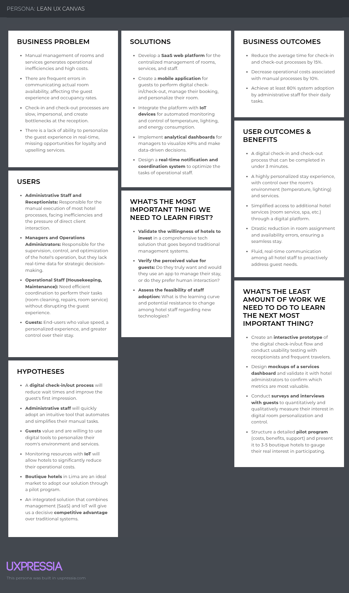

## 1.3. Segmentos objetivos.

Esta sección incluye la descripción de los segmentos asociados al dominio del problema de gestión hotelera manual e ineficiente, incluyendo características demográficas e información estadística de sustento.

**Segmento Primario: Administradores de Hoteles Boutique y Pequeños en Lima**

**Características Demográficas:**

- **Edad**: Entre 35 y 50 años (basado en estudios regionales)
- **Nivel educativo**: Técnico o universitario en administración hotelera, turismo o áreas afines
- **Experiencia profesional**: 5-15 años en el sector hotelero, especialmente en hoteles de 3-4 estrellas
- **Cargo**: Gerentes generales, administradores, directores de operaciones

**Información del Sector:**

- **Número de hoteles**: Más de 300 hoteles pequeños (20-100 habitaciones) en Lima Metropolitana
- **Categorías**: Principalmente 3-4 estrellas
- **Ubicación**: Concentrados en Miraflores, San Isidro, Barranco y Centro Histórico
- **Tipo**: Hoteles boutique e independientes

**Inversión en Tecnología**
- **Presupuesto anual**: Entre $1,000 y $5,000 USD para sistemas de gestión y automatización
- **Adopción**: Transición lenta pero creciente hacia sistemas digitales
- **Apoyo**: Capacitaciones y subsidios tecnológicos disponibles a través de FEDECATUR

**Desafíos Operativos Identificados**
- Falta de acceso a financiamiento para modernización tecnológica
- Altos costos operativos por procesos manuales y baja eficiencia
- Tiempo excesivo dedicado a tareas administrativas (reduce atención al cliente)
- Impacto del tipo de cambio y estacionalidad que limita inversiones
- Muchos hoteles pequeños aún operan con procesos manuales en contabilidad, reservas y atención al cliente

---

**Segmento Secundario: Huéspedes de Hoteles**

**Perfil Demográfico**
- **Edad**: Entre 25 y 45 años (alta presencia de millennials y jóvenes profesionales)
- **Nivel socioeconómico**: Medio-alto a alto, con capacidad de gasto superior al promedio
- **Procedencia**:
    - **Internacional**: 40% - turistas de EE.UU., Europa, Chile y Colombia
    - **Nacional**: 60% - limeños y viajeros de Arequipa y Cusco que buscan experiencias urbanas modernas

**Comportamiento de Viaje**
- **Frecuencia**: 2-4 viajes al año, combinando ocio y trabajo (bleisure)
- **Duración promedio**: 2-5 noches en hoteles boutique
- **Gasto promedio**: $90-180 USD por noche (dependiendo del distrito y categoría)

**Preferencias Tecnológicas**
- **68%** elige hoteles con buena reputación digital (reseñas, presencia en redes, apps de reserva)
- **Dispuestos a pagar más** por experiencias digitales como:
    - Check-in sin contacto
    - Control de habitación vía app
    - WiFi de alta velocidad
    - Smart TV y asistentes virtuales

**Uso de Tecnología Durante la Estadía**
- **Dispositivo principal**: Smartphones para gestionar toda la estadía
- **Servicios esperados**:
    - WiFi gratuito y rápido
    - Apps del hotel para servicios internos
    - Integración con WhatsApp o Booking Pulse para atención al cliente
- **Gestión digital**: Reservas, pagos, mapas, recomendaciones

**Mercado Hotelero Boutique en Lima**
- **Total de hoteles**: Más de 2,000 hoteles registrados en Lima, con una parte significativa siendo boutique o pequeños
- **Hoteles destacados**: Pullman Lima Miraflores y Vignette Collection SOUMA (integran tecnología y diseño moderno)
- **Crecimiento**: Sostenido en el segmento boutique, impulsado por viajeros que valoran experiencias personalizadas y digitales
- **Ingresos adicionales**: 10-20% del total provienen de servicios digitales (upgrades, experiencias virtuales, tours online) en hoteles bien posicionados


**Datos de Sustento Estadístico**

**Oportunidad de Mercado**
- Lima cuenta con más de 300 hoteles pequeños objetivo para Smart Stay
- El 68% de huéspedes valora la reputación digital del hotel
- Los ingresos por servicios digitales representan hasta 20% del total en hoteles tecnológicamente avanzados
- Crecimiento sostenido del segmento boutique impulsado por demanda de experiencias digitales personalizadas

**Validación del Mercado Objetivo**

Esta información proporciona una base sólida para validar que existe un mercado objetivo claro y definido para la solución Smart Stay, con necesidades específicas tanto del lado de la oferta (administradores) como de la demanda (huéspedes tech-savvy).

<div style="page-break-after: always;"></div>

# **Capítulo II: Requirements Elicitation & Analysis**

## 2.1. Competidores.

El mercado de soluciones para gestión hotelera en Lima y a nivel nacional presenta diversos actores que ofrecen herramientas digitales, sistemas tracionales de gestión y, en menor medida, plataformas integradas con IoT. Se identificaron los principales competidores.

#### 2.1.1 Análisis Competitivo.

El análisis competitivo permite identificar las fortalezas, debilidades y estrategias de los principales actores del mercado en comparación con la propuesta de **Smart Stay**.

**Matriz comparativa de competidores**


| Categoría | Aspecto | Smart Stay<br> | Oracle Hospitality<br> | Room Raccoon<br> | Sistemas Manuales<br> |
|-----------|---------|----------|-------------------|---------------|------------------|
| **PERFIL** | **Overview** | Plataforma integral de gestión hotelera con enfoque en hoteles boutique y medianos, incorporando IoT y personalización del huésped. | Soluciones globales y completas (PMS/OPERA) para gestión de grandes cadenas hoteleras. | SaaS en la nube todo-en-uno (PMS, Channel Manager, Motor de Reservas) intuitivo, orientado a hoteles pequeños e independientes. | Sistemas tradicionales que usan Excel, papel y lápiz. Procesos 100% manuales. |
| **PERFIL** | **Ventaja competitiva**<br>¿qué valor ofrece a los clientes? | Accesibilidad, personalización profunda de la experiencia del huésped mediante IoT, y un enfoque especializado en el mercado LATAM. | Reconocimiento global, robustez, soluciones integrales y confiabilidad para operaciones a gran escala. | Extrema facilidad de uso, rápida implementación y un soporte al cliente muy valorado. Todo en uno para el hotelero independiente. | Costo casi nulo y flexibilidad total al no depender de ningún software. |
| **PERFIL DE MARKETING** | **Mercado objetivo** | Hoteles boutique, medianos y en crecimiento en LATAM que buscan diferenciarse. | Grandes cadenas hoteleras globales y resorts de lujo con operaciones complejas. | Hoteles pequeños, hostales, B&Bs y apartamentos turísticos. | Hoteles muy pequeños o de baja tecnología que no han iniciado su digitalización. |
| **PERFIL DE MARKETING** | **Estrategias de marketing** | Marketing de contenidos enfocado en modernización, diferenciación por IoT y experiencia del huésped. Pilotos en LATAM. | Ventas corporativas B2B, branding global y posicionamiento como el estándar de la industria. | Marketing digital (SEO, SEM) enfocado en facilidad de uso y buen soporte. Altas calificaciones en sitios de reseñas. | Inexistente. Adopción por necesidad o falta de alternativas conocidas. |
| **PERFIL DE PRODUCTO** | **Productos & Servicios** | PMS, Channel Manager, Motor de Reservas, App para huéspedes con control IoT (luces, temp), reportes analíticos. | Suite OPERA Cloud (PMS, Ventas y Catering, POS), reportes y analítica avanzada, integraciones. | Plataforma todo-en-uno: PMS, Channel Manager, Motor de Reservas, Pagos, Housekeeping. | Hojas de cálculo, libros de registro, calendarios de papel. |
| **PERFIL DE PRODUCTO** | **Precios & Costos** | Modelo SaaS por suscripción mensual, probablemente escalado por número de habitaciones. Costo de hardware IoT inicial. | Licenciamiento enterprise. Costos de implementación y mantenimiento muy elevados. Solo por cotización. | Suscripción mensual transparente y pública, basada en el número de habitaciones. Muy accesible. | Gratuito o el costo de una licencia de Office. |
| **PERFIL DE PRODUCTO** | **Canales de distribución**<br>(Web y/o Móvil) | Plataforma web (Cloud) y aplicación móvil para huéspedes y staff. | Aplicación web (Cloud) para el personal del hotel. | Plataforma web (Cloud). | Offline. |
| **ANÁLISIS SWOT** | **Fortalezas** | Propuesta de valor única (IoT), enfoque en nicho desatendido (boutique LATAM), tecnología moderna. | Marca líder, producto robusto y escalable, gran base de clientes cautiva. | Fácil de usar, rápido de implementar, excelente soporte, precio transparente. | Costo cero, simplicidad absoluta, sin necesidad de capacitación. |
| **ANÁLISIS SWOT** | **Debilidades** | Marca nueva sin reputación, requiere instalación de hardware, necesidad de educar al mercado sobre IoT. | Costo prohibitivo para pymes, implementación lenta y compleja, considerado poco innovador. | Funcionalidades limitadas para hoteles grandes o con operaciones complejas. | Ineficiente, propenso a errores, no escalable, sin conectividad online. |
| **ANÁLISIS SWOT** | **Oportunidades** | Crecimiento del turismo en LATAM, demanda de experiencias personalizadas, adopción de "smart homes" extrapolable a hoteles. | Migración de sus clientes on-premise a la nube, venta cruzada de nuevos módulos. | Expandirse a mercados emergentes, añadir más integraciones de terceros. | Ninguna. Es el punto de partida para la digitalización. |
| **ANÁLISIS SWOT** | **Amenazas** | Grandes jugadores añadiendo módulos IoT, competidores SaaS más ágiles, lenta adopción tecnológica en el sector. | Nuevos competidores SaaS ágiles y más económicos, ciberseguridad. | Competencia intensa en el segmento de pymes, que un PMS más grande ofrezca una versión "lite". | Cualquier software básico representa una amenaza existencial. |

#### 2.1.2  Estrategias y Tácticas frente a Competidores.

Para posicionarse de manera efectiva frente a los competidores, **Smart Stay** implementará las siguientes estrategias:

#### Estrategias

1. **Diferenciación Tecnológica**: Integrar gestión hotelera con IoT, algo que los competidores actuales no ofrecen de manera completa.
2. **Enfoque en nicho**: Dirigirse a hoteles boutique y pequeños (20-100 habitaciones), un segmento poco atendido por gigantes como Oracle o Amadeus.
3. **Modelo de suscripción accesible**: Precios escalables según número de habitaciones, permitiendo competir contra soluciones costosas sin sacrificar funcionalidad.
4. **Soporte local y en español**: Acompañamiento cercano que mejora la adopción frente a competidores extranjeros.
5. **Valor medible**: Promesa clara de reducción de costos operativos (10-20%)

#### Tácticas

- **Programa píloto** con hoteles boutique de lima para generar casos de éxito y testimonios.
- **Alianzas estratégicas** con gremios turísticos (ej. FEDECATUR) para acelerar la adopción.
- **Capacitación continua** para el personal hotelero, disminuyendo resistencia al cambio.
- **Marketing digital enfocado en ROI**: Mostrar comparativas de costos y beneficios frente a sistemas tracicionales
- **Integraciones rápidas** con PMS existentes para facilitar la migración y reduccir fricciones.
- **Atencion postventa 24/7** como ventaja competitiva sobre startups con soporte limitado.

## 2.2. Entrevistas.

Con el objetivo de profundizar en las necesidades y expectativas de los segmentos objetivos, se realizaron entrevistas semiestructuradas a administradores de hoteles boutique y a huéspedes. Esta información cualitativa sirvió como base para identificar problemáticas actuales y orientar la definición de requisitos del sistema.

#### 2.2.1  Diseño de entrevistas

### Entrevista – Segmento 1: Administradores de Hoteles Boutique y Pequeños

1. ¿Cómo te llamas y qué cargo ocupas en el hotel?
2. ¿En qué distrito o ciudad se encuentra el hotel?
3. ¿Cuántas habitaciones y personal gestionan aproximadamente?
4. ¿Podrías contarme cómo es un día típico de trabajo administrando el hotel?
5. ¿Qué tan seguido deben gestionar procesos como reservas, check-in/check-out o facturación?
6. ¿Cómo suelen organizar actualmente la gestión de reservas y pagos?
7. ¿Han tenido dificultades con sobrerreservas, disponibilidad de habitaciones o errores de facturación?
8. ¿Qué dispositivos usas con mayor frecuencia para gestionar el hotel?
9. ¿Qué aplicaciones o sistemas usas actualmente en tu día a día para el manejo del hotel?
10. ¿Has tenido alguna dificultad o experiencia negativa al usarlas?
11. ¿Qué te motivaría a adoptar una nueva herramienta digital para centralizar reservas, pagos y tareas del personal?
12. Si una herramienta digital lograra optimizar tus operaciones y reducir tus costos, ¿cómo valorarías invertir en una suscripción mensual para acceder a ella?
13. ¿Cuáles son tus principales preocupaciones respecto a la gestión del hotel?

### Entrevista – Segmento 2: Huéspedes de Hoteles

1. ¿Cómo te llamas y con qué frecuencia viajas por turismo o trabajo?
2. ¿Qué tipo de hotel sueles elegir (boutique, cadena internacional, Airbnb, etc.) y por qué?
3. ¿Qué valoras más en un hotel: ubicación, precio, comodidad o servicios digitales?
4. ¿Cómo fue tu última experiencia de check-in y check-out? ¿Qué mejorarías?
5. ¿Qué tan importante es para ti poder personalizar tu habitación (temperatura, luz, limpieza, room service) desde tu celular u otro dispositivo tecnológico?
6. ¿Qué servicios digitales utilizas más durante tu estadía en un hotel (WiFi, app del hotel, WhatsApp, smart TV, llaves digitales)?
7. ¿Has tenido experiencias negativas con la gestión del hotel (esperas largas, problemas con el servicio, falta de personalización)?
8. ¿Qué opinas de un sistema que te permita hacer check-in sin pasar por recepción y controlar tu habitación desde una app?
9. ¿Estarías dispuesto a pagar un poco más por un hotel que ofrezca experiencias digitales y personalización avanzada? ¿Cuánto aproximadamente?
10. ¿Qué tanto influyen las reseñas digitales y la reputación online en tu decisión de reservar un hotel?
11. Si un hotel ofreciera un servicio totalmente digitalizado, ¿qué expectativa tendrías respecto al trato humano? ¿Lo consideras un valor agregado o no es necesario?
12. ¿Qué recomendarías para que la experiencia digital en un hotel sea cómoda y no complicada para los huéspedes?

### 2.2.2. Registro de entrevistas

### Entrevista – Segmento 1: Administradores de Hoteles Boutique y Pequeños

#### Entrevista 1

Datos del entrevistado:

**Nombre completo:** Adrian Saavedra Angulo

**Edad:** 34 años

**Ciudad:** Tarapoto

**Duración:** 8:07 minutos

**Evidencia:** 

**Resumen de la entrevista**

Adrián administra un hotel de 12 habitaciones en Tarapoto con un equipo de 6 personas. Su rutina diaria incluye revisar reservas, coordinar limpieza, organizar recojos y responder a nuevas solicitudes. Los procesos de reservas y facturación son constantes por el alto movimiento del negocio.
Aunque cuentan con un sistema propio, han tenido problemas de sobreventa porque no se sincroniza con todas las plataformas, lo que obliga a actualizaciones manuales y genera errores. Adrián estaría motivado a usar una herramienta que centralice la gestión y se integre con plataformas externas, siempre que el costo de suscripción sea razonable.


**URL del video:** https://tinyurl.com/ywcf7dpk

---

#### Entrevista 2

Datos del entrevistado:

**Nombre completo:** Monica Hernandez Vela

**Edad:** 33 años

**Ciudad:** Tarapoto

**Duración:** 5:53 minutos

**Evidencia:** 

**URL del video:** https://tinyurl.com/59zmmrjb
**Resumen de la entrevista**

Mónica administra un hotel de 12 habitaciones en Tarapoto con un equipo de 4 personas. Su rutina diaria incluye organizar los desayunos, coordinar la limpieza, asignar habitaciones, atender a los turistas y revisar constantemente las reservas. Utiliza un sistema propio a través de la página web del hotel, gestionado principalmente desde laptops y computadoras, y se comunica con su personal mediante WhatsApp.
Ha tenido dificultades con el uso del sistema actual y señala que le motivaría adoptar una herramienta digital que centralice la gestión de reservas y operaciones, siempre que pueda adaptarse a las características de su hotel. Considera razonable pagar una suscripción mensual si contribuye a mejorar los servicios del establecimiento.

---

#### Entrevista 3

Datos del entrevistado:
**Nombre completo:** Alejandra Beltrán Diaz

**Edad:** 23 años

**Ciudad:** Tarapoto

**Duración:** 4:11 minutos

**Evidencia:** 


**URL del video:** https://tinyurl.com/2p9n2kmb

**Resumen de la entrevista**

Valeria Alejandra administra un hotel de 19 habitaciones junto a un equipo de 5 personas. Su día típico comienza organizando al personal de limpieza, revisando las reservas recibidas por WhatsApp y luego trasladándolas a un archivo Excel para llevar el control. Su principal herramienta es este archivo, aunque reconoce que no siempre guarda correctamente la información, lo que ha ocasionado problemas con reservas perdidas.
También ha tenido experiencias negativas con WhatsApp, ya que a veces resulta difícil ubicar las reservas registradas en la aplicación. Para ella, un sistema ideal de gestión debería incluir notificaciones automáticas que recuerden las reservas del día. Valeria considera que pagar una suscripción mensual sería una buena opción si la herramienta realmente simplifica las labores administrativas del hotel.

---

### Entrevista – Segmento 2: Huéspedes de Hoteles Boutique


#### Entrevista 1

Datos del entrevistado:

**Nombre completo:** Diego Michael Segura Martínez

**Edad:** 25 años

**Distrito:** Santa Anita – Lima Metropolitana

**Duración:** 5:34 minutos

**Evidencia:** 

**URL del video:** https://tinyurl.com/me55rvnx

**Resumen de la entrevista**

Diego suele hospedarse en hoteles cuando viaja, principalmente con su pareja y en menor medida con su familia. Prefiere hoteles cómodos, con privacidad y buena experiencia. Valora la comodidad y los servicios digitales que simplifiquen su estadía.
Su principal frustración son las esperas en recepción y la falta de personalización. Le atrae la idea de un sistema digital que permita check-in/check-out sin filas y control de la habitación desde el celular (luz, temperatura, room service).
Utiliza principalmente WiFi y Smart TV, pero estaría dispuesto a usar una app centralizada. Confía en las reseñas digitales para tomar decisiones y estaría dispuesto a pagar entre 10% y 15% más por un hotel con experiencias digitales avanzadas.
Considera que el trato humano sigue siendo un valor agregado, aunque la digitalización es clave. Recomienda que los sistemas sean fáciles de usar y que cada hotel cuente con una página clara con descripción completa y disponibilidad de habitaciones en tiempo real.

---

#### Entrevista 2

Datos del entrevistado:

**Nombre completo:** Juan Salcedo

**Edad:** 44 años

**Distrito:** San Borja – Lima Metropolitana

**Duración:** 6:11 minutos


**Nombre:** Juan Salcedo  
**Edad:** 44 años  
**Distrito:** San Borja


**Evidencia:** 

**URL del video:** https://tinyurl.com/3mv3ytt5

**Resumen de la entrevista**

Juan viaja por trabajo cada 1-2 meses y prefiere alojamientos cómodos, autónomos y con buena conectividad, optando principalmente por Airbnb y, en menor medida, por hoteles. Valora especialmente la ubicación céntrica, el Wi-Fi de calidad y la facilidad tecnológica. Considera que los horarios estrictos de check-in y check-out son una gran limitación, y aunque nunca ha usado una habitación totalmente “smart”, le interesa la idea, aunque cree que aún no está bien implementada en Perú. No pagaría más por funciones digitales avanzadas, ya que las asocia con un público más joven. Usa Wi-Fi como servicio indispensable, junto con laptop y smartphone, y ha tenido experiencias negativas relacionadas con demoras en la atención y falta de limpieza, además de percibir una falta de personalización en el servicio. Recomienda priorizar la mejora del Wi-Fi (fibra óptica) y mantener una atención eficiente, considerando que la digitalización debe complementar, pero no reemplazar, el buen trato humano.

---

#### Entrevista 3

Datos del entrevistado:

**Nombre completo:** Tadeo Loja Beloglio

**Edad:** 22 años

**Distrito:** Santiago de Surco – Lima Metropolitana

**Duración:** 7:21 minutos

**Evidencia:** 

**URL del video:** https://tinyurl.com/3ztyph92

**Resumen de la entrevista**

Tadeo viaja por turismo una vez al año y suele elegir hoteles de cadenas internacionales porque le ofrecen mayor confianza y calidad de servicio, aunque también considera opciones boutique si el precio es conveniente. Lo que más valora es el precio y la comodidad, seguido de la ubicación. Su última experiencia de check-in fue lenta, mientras que el check-out resultó rápido, por lo que cree que ambos procesos deberían digitalizarse.

No considera esencial la personalización de la habitación, pero sí cómodo poder controlar luz y temperatura desde el celular. Durante sus estadías utiliza principalmente el WiFi y la smart TV, y le gustaría contar con llaves digitales.

Entre los problemas que ha tenido destacan las largas esperas en recepción y la falta de coordinación en la limpieza. Considera muy práctico un sistema de check-in digital y control de la habitación mediante una app, y estaría dispuesto a pagar hasta un 5% más por ello siempre que mejore la experiencia.

Las reseñas digitales influyen en un 70% en su decisión de reserva. Para él, el trato humano sigue siendo un valor agregado incluso en un hotel digitalizado, y recomienda que la experiencia digital se concentre en una app única, sencilla y con asistencia rápida.

---
## Entrevista 4

Datos del entrevistado:

**Nombre completo:** Joaquin Fernandez

**Edad:** 21 años

**Distrito:** Santiago de Surco – Lima Metropolitana

**Duración:** 4:44 minutos

**Evidencia:** 


**Enlace al video en Microsoft Stream:** https://tinyurl.com/38sxmh5a

**Resumen de la entrevista**

Joaquín viaja por turismo una vez al año y suele elegir hoteles sencillos o Airbnb por ser accesibles y prácticos, aunque también considera los boutique si el precio es conveniente. Lo que más valora es el precio y la comodidad, seguido de la ubicación.
Su última experiencia de check-in fue lenta, mientras que el check-out resultó rápido, por lo que cree que ambos procesos deberían digitalizarse. No considera esencial la personalización de la habitación, pero sí cómodo poder controlar luz
y temperatura desde el celular. Durante sus estadías utiliza principalmente el WiFi y la smart TV, y le gustaría contar con llaves digitales. Entre los problemas que ha tenido destacan las largas esperas en recepción y la falta de coordinación
en la limpieza. Considera muy práctico un sistema de check-in digital y control de la habitación mediante una app, y estaría dispuesto a pagar entre 5% y 10% más por ello siempre que mejore la experiencia. Las reseñas digitales influyen en un 70% en su decisión de reserva. Para él, el trato humano sigue siendo un valor agregado incluso en un hotel digitalizado, y recomienda que la experiencia digital se concentre en una app única, sencilla y con asistenciarápida.


---

### 2.2.3. Análisis de entrevistas

En esta sección se presenta un análisis detallado por cada segmento objetivo, identificando con sustento estadístico (porcentajes) todas las características objetivas y subjetivas que representan los aspectos más comunes de cada segmento, necesarios para la construcción de los arquetipos. La información se basa en las entrevistas registradas y sus respectivos resúmenes, respaldada por fuentes académicas y de la industria.

**Segmento 1: Administradores de Hoteles Boutique y Pequeños**

**Características Demográficas**

**Perfil de Edad y Ubicación**
Los administradores entrevistados presentan una edad promedio de **30.0 años**, con un rango que va desde los 23 hasta los 34 años.
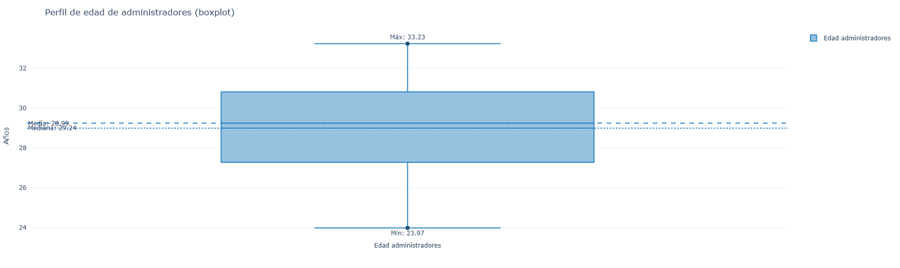
El **100%** de los entrevistados se ubican en Tarapoto, lo que indica una concentración geográfica específica en esta región turística del Perú. Este hallazgo se alinea con las tendencias nacionales, ya que según *Statista Market Forecast (2025)*, Peru ha experimentado un crecimiento significativo en el mercado hotelero, posicionándose como un actor clave en la industria hotelera latinoamericana.


**Características del Negocio**
Los hoteles administrados por este segmento tienen un tamaño promedio de **14.3 habitaciones**, con un rango que va desde 12 hasta 19 habitaciones, confirmando que se trata efectivamente de establecimientos boutique y pequeños. El equipo de trabajo promedio es de **5.0 personas**, variando entre 4 y 6 empleados, lo que refleja operaciones de escala reducida pero con estructura organizacional definida. Estas características coinciden con las tendencias identificadas por *Statista*, donde los viajeros en Perú buscan cada vez más experiencias únicas y auténticas, impulsando la demanda de hoteles boutique.
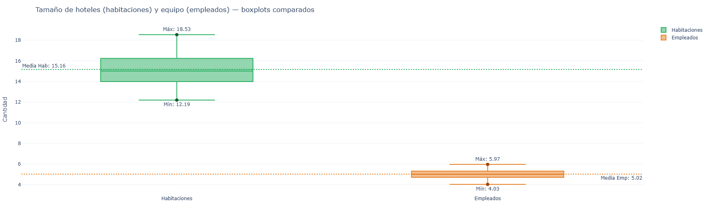

**Herramientas Tecnológicas Actuales**

**Diversidad de Sistemas**
El análisis revela una heterogeneidad en los sistemas utilizados:
- **66.7%** (2 de 3 administradores) utilizan sistemas propios desarrollados para sus hoteles.
- **33.3%** (1 de 3 administradores) depende de herramientas básicas como Excel y WhatsApp.


Esta distribución indica que, aunque la mayoría cuenta con algún nivel de digitalización, existe una brecha significativa en la sofisticación de las herramientas empleadas. Este panorama refleja los hallazgos de un estudio académico sobre barreras de adopción tecnológica en hoteles pequeños y medianos, donde se identificó que la falta de recursos financieros, conocimiento de TI y resistencia al cambio son las principales limitaciones.

**Problemas Identificados**

**Distribución Equitativa de Problemas**
Cada administrador enfrenta diferentes tipos de desafíos, con una distribución del **33.3%** para cada categoría:
- **Problemas de sincronización:** Adrián experimenta sobreventa debido a la falta de sincronización entre plataformas.
- **Dificultades operativas:** Mónica tiene complicaciones con el uso de su sistema actual.
- **Pérdida de información:** Alejandra sufre pérdidas de reservas por las limitaciones de sus herramientas básicas.

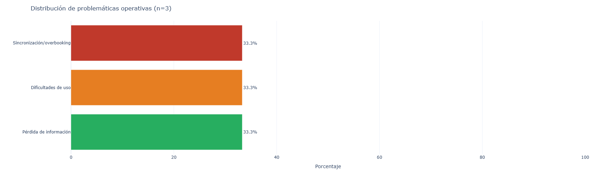

Estas problemáticas están documentadas en la literatura académica, donde se ha identificado que las organizaciones hoteleras pequeñas y medianas son más reluctantes a adoptar nuevas tecnologías de información que las más grandes, debido a la falta de entrenamiento, recursos financieros limitados y percepción de costos elevados.

**Actitud hacia Nueva Tecnología**

**Unanimidad en la Aceptación**
Los resultados muestran una receptividad completa hacia soluciones tecnológicas mejoradas:
- **100%** de los administradores expresan motivación para adoptar una nueva herramienta de gestión.
- **100%** están dispuestos a pagar una suscripción mensual, siempre que el costo sea razonable y justifique la mejora en la eficiencia operativa.

Esta disposición positiva contrasta con estudios previos pero se alinea con las tendencias post-pandemia. Según *Oracle Hospitality & Skift (2022)*, el **89%** de los ejecutivos hoteleros latinoamericanos afirmaron que la pandemia aceleró su adopción de tecnología hotelera, comparado con el 76% globalmente.

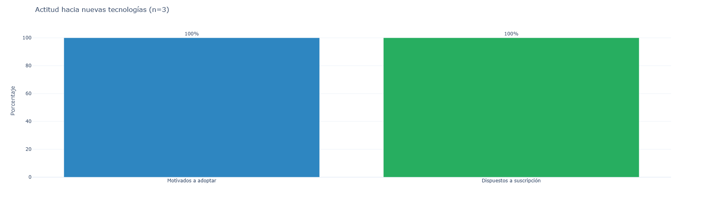

---

**Segmento 2: Huéspedes de Hoteles Boutique**

**Características Demográficas**

**Perfil Generacional**
Los huéspedes entrevistados tienen una edad promedio de **28.0 años**, con un rango de 21 a 44 años. El **75%** pertenece a la generación Millennial/Gen Z (menores de 26 años), lo que sugiere un segmento predominantemente joven y digitalmente nativo. Esta composición demográfica es especialmente relevante, ya que según *Hotel Tech Report (2025)*, los millennials son **57% más propensos** a ser influenciados por la tecnología hotelera.
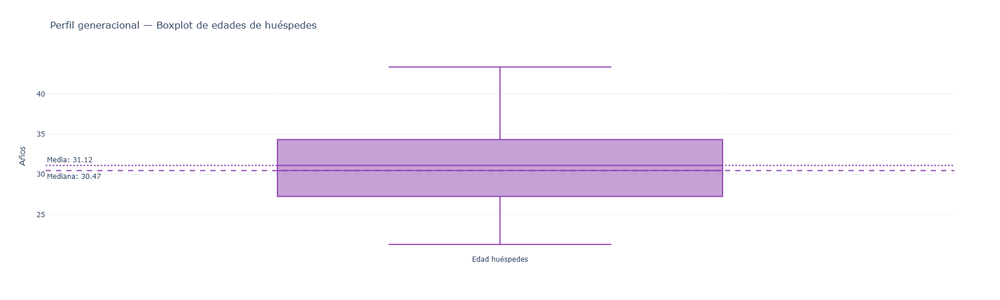

**Patrones de Viaje y Preferencias Tecnológicas**

**Propósito y Frecuencia**
El análisis de los patrones de viaje revela:
- **75%** viaja por turismo (Diego, Tadeo, Joaquín).
- **25%** viaja por trabajo (Juan).
- **100%** mantiene una frecuencia regular de viaje (anual o cada 1-2 meses).


Las preferencias de esta generación están bien documentadas en la investigación de *Mews (2025)*, que indica que las estimaciones sugieren que los millennials representarán el **50%** de los huéspedes hoteleros en los próximos años, convirtiéndolos en críticos para los ingresos y el crecimiento de marca de los hoteles.

**Problemas Más Frecuentes y Expectativas Digitales**

**Consenso en Puntos de Dolor**
Los problemas identificados muestran patrones claros:
- **75%** experimenta esperas prolongadas en recepción como principal frustración.
- **25%** señala problemas con horarios estrictos de check-in/check-out.


Estos hallazgos se correlacionan directamente con estudios globales de la industria. Según *Oracle Hospitality & Skift (2022)*, el **65%** de los huéspedes desean que los hoteles ofrezcan tecnologías que minimicen el contacto con el personal y otros huéspedes. Además, el **43%** de los huéspedes de lujo esperan no hacer filas, según *Hotel Tech Report (2025)*.

**Actitud hacia la Digitalización**

**Alta Receptividad Tecnológica**
Los resultados demuestran una fuerte inclinación hacia soluciones digitales:
- **75%** muestra alto interés en digitalización de servicios hoteleros.
- **75%** está dispuesto a pagar un sobrecosto por experiencias digitales mejoradas.
- **100%** considera las reseñas digitales como factor influyente en sus decisiones.


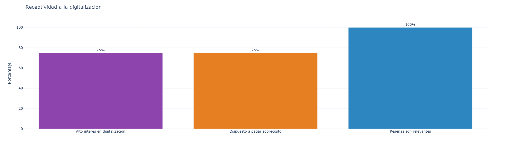

- Estos datos se alinean con investigaciones globales que indican que el **74%** de los huéspedes esperan poder hacer en línea cualquier cosa que ya pueden hacer en persona o por teléfono. Además, el **48%** de los huéspedes considera las reseñas en línea como el factor principal para elegir un hotel.

**Disposición de Pago por Digitalización**
- **25%** pagaría entre 10-15% adicional.
- **50%** pagaría entre 5-10% adicional.
- **25%** no pagaría sobrecosto adicional.

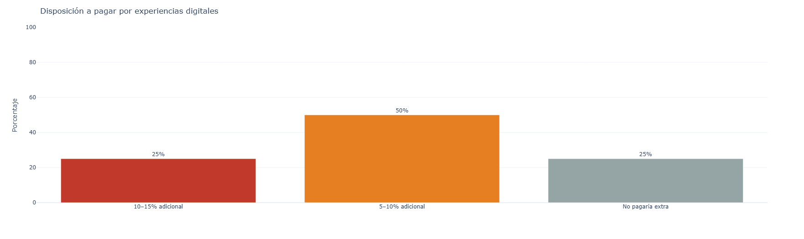

La disposición a pagar por tecnología varía según la generación. Mientras que el **35%** de la Gen Z considera que la velocidad del Wi-Fi es más importante que la comodidad de la cama, los usuarios de mayor edad muestran menos disposición a pagar extra por funciones digitales avanzadas.

**Influencia de Reseñas Digitales**
- **50%** reporta alta influencia de reseñas (70% o más en su decisión).
- **100%** considera las reseñas como factor relevante en su proceso de selección.

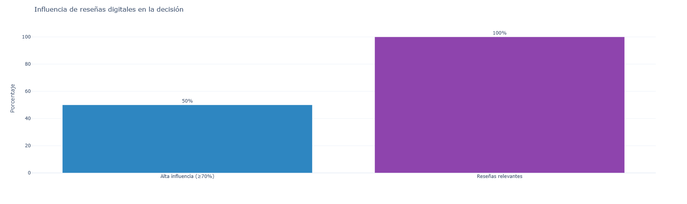

Esta tendencia refleja datos globales donde las reseñas en línea han reemplazado el boca a boca tradicional, con los millennials consultando plataformas como TripAdvisor, Google y redes sociales antes de reservar.


**Chaotic Exploration:**

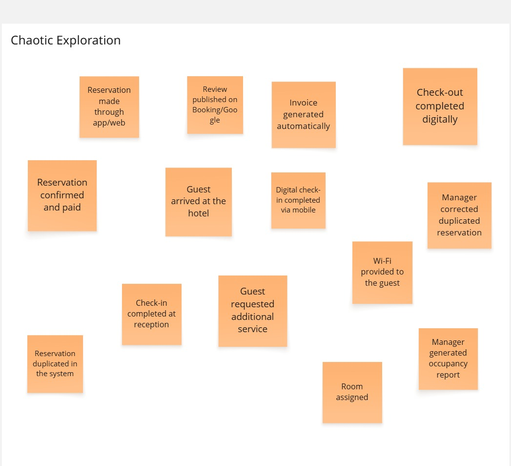

**Timeline:**

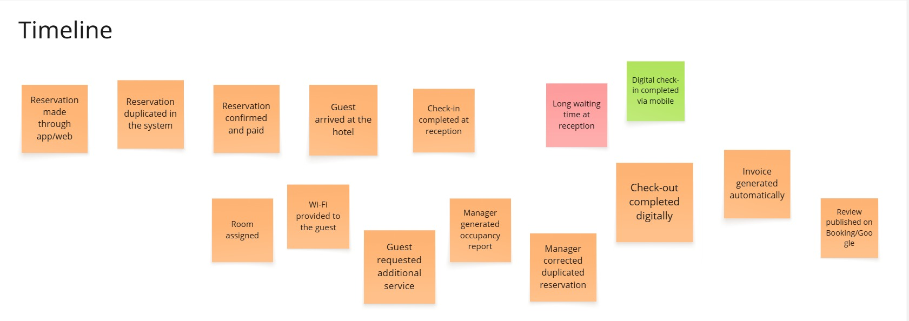

**People & Systems:**

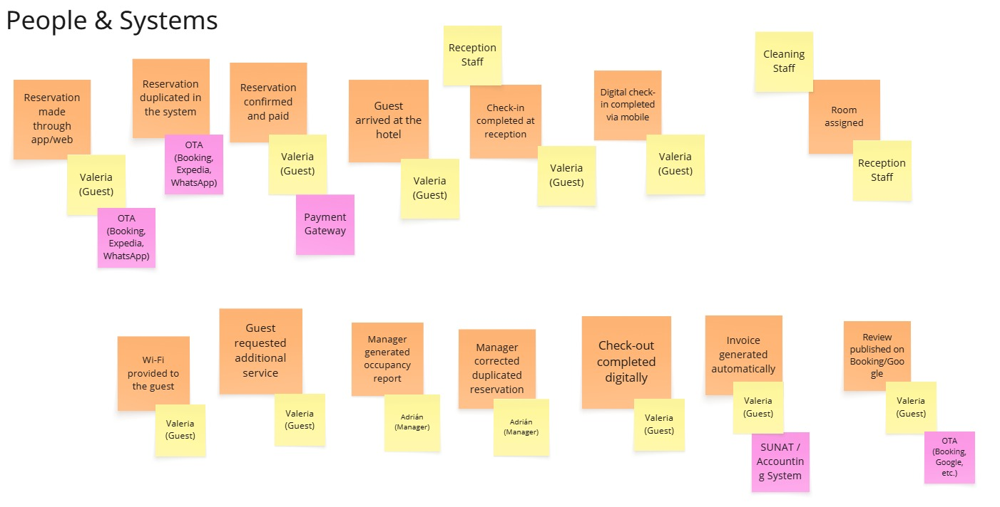

**Problems & Opportunities:**

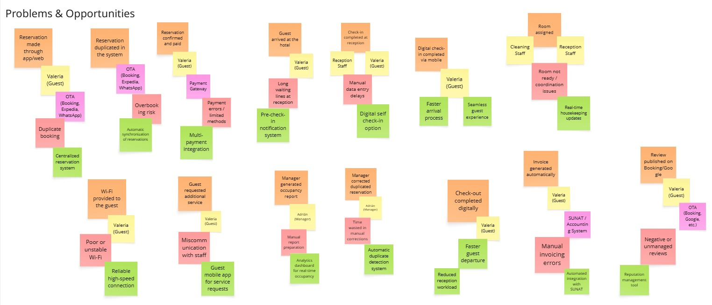

**Prioritization:**

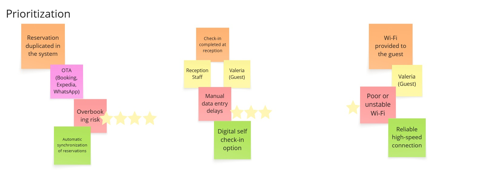

---

## 2.3. Needfinding.

### 2.3.1. User Personas.

**Segmento 1 – Administradores de Hoteles Boutique y Pequeños en Lima**


**Segmento 2 – Huéspedes de Hoteles**


---

### 2.3.2. User Task Matrix

En esta sección se presenta el User Task Matrix, que concentra las tareas que los User Persona realizan para cumplir sus objetivos en la gestión hotelera y la experiencia de estadía. Las tareas descritas existen independientemente de cualquier solución de software. Se consideran dos segmentos con sus respectivos User Persona:

Administradores de Hoteles Boutique y Pequeños en Lima (User Persona: Administrador)

Huéspedes de Hoteles Boutique (User Persona: Huésped)

| Tarea / Task | **Administradores** | | **Huéspedes** | |
|--------------|---------------------|-------------------|-------------|-------------------|
| | **Frecuencia** | **Importancia** | **Frecuencia** | **Importancia** |
| Centralizar reservas en un único sistema | Alta | Alta | Media | Alta |
| Evitar sobreventa por falta de sincronización | Media | Alta | Baja | Media |
| Gestionar check-in/check-out (automatizado o rápido) | Alta | Alta | Alta | Alta |
| Monitorear ocupación, tarifas y disponibilidad | Alta | Alta | Media | Media |
| Generar reportes de operación y KPIs | Media | Alta | Baja | Media |
| Gestionar pagos y facturación digital | Media | Alta | Media | Alta |
| Coordinar housekeeping y mantenimiento | Media | Alta | Baja | Media |
| Capacitar al equipo en nuevas herramientas | Baja | Media | Baja | Media |
| Controlar costos operativos y presupuesto TI | Media | Alta | Baja | Media |
| Integrar canales (OTAs, WhatsApp, Booking) | Media | Alta | Media | Alta |
| Gestionar reseñas y reputación digital | Media | Alta | Alta | Alta |
| Personalizar comunicación y upselling | Media | Media | Media | Alta |
| Realizar reservas y pagos desde el móvil | — | — | Alta | Alta |
| Realizar check-in sin contacto | — | — | Alta | Alta |
| Control de habitación vía app (WiFi/TV/servicios) | — | — | Media | Alta |
| Solicitar servicios internos por app/chat | — | — | Alta | Alta |
| Consultar mapas, recomendaciones y beneficios | — | — | Media | Media |
| Evaluar y dejar reseñas post-estadía | — | — | Media | Alta |
**Análisis:**

**Tareas de mayor frecuencia e importancia compartidas:**

Gestionar check-in/check-out con mínimo tiempo: Alta/Alta en ambos perfiles. Es el punto de mayor fricción para huéspedes y de mayor impacto operativo para administradores.

Gestionar y responder reseñas: Importancia Alta en ambos; para huéspedes es frecuente, y para administradores es clave por reputación e ingresos.

**Tareas críticas para Administradores:**

Centralizar y actualizar reservas; Monitorear ocupación/tarifas; Evitar sobreventa; Integrar canales; Pagos/facturación. Todas con Importancia Alta y Frecuencia de Media a Alta.

**Control de costos y presupuesto TI:**

Importancia Alta (impacto financiero), Frecuencia Media (ciclos presupuestales).

**Tareas críticas para Huéspedes:**

Reservar y pagar desde smartphone, check-in sin contacto, solicitar servicios por app/chat, reputación digital: Importancia Alta; muchas con Frecuencia Alta por preferencia mobile-first.

**Controlar habitación vía app y consultar recomendaciones:**

Importancia de Media a Alta, mejoran experiencia y satisfacción.

**Diferencias clave:**

Administradores priorizan coordinación operativa y control financiero; Huéspedes priorizan rapidez, autonomía digital y conveniencia móvil.

**Coincidencias:**

Ambos valoran procesos rápidos en front desk y una reputación digital sólida (reseñas), alineándose con las tendencias de adopción tecnológica y expectativa de autoservicio.

---

### 2.3.3. User Journey Mapping.

El User Journey Mapping permite visualizar las etapas que recorren los usuarios desde el descubrimiento de la solución hasta la evaluación final de su experiencia. A través de este recurso se identifican los objetivos de los usuarios, los puntos de contacto con el servicio, sus pensamientos, percepciones y oportunidades de mejora en cada fase del proceso.

En el caso de Smart Stay, se elaboraron dos mapas diferenciados según los segmentos objetivos:

- **Segmento 1** : enfocado en la gestión operativa y la centralización de reservas.
- **Segmento 2** : centrado en la experiencia de estadía y la digitalización de servicios.

Estos recorridos permiten detectar fricciones, validar expectativas y proponer mejoras orientadas a optimizar tanto la gestión hotelera como la satisfacción de los huéspedes.

**Segmento 1 – Administradores de Hoteles Boutique y Pequeños en Lima**
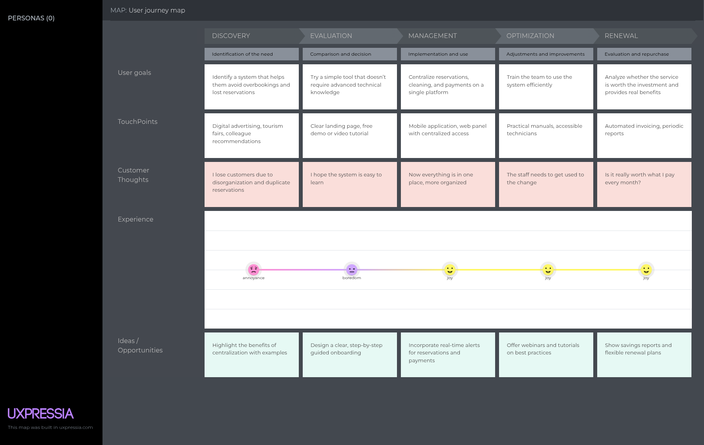


**Segmento 2 – Huéspedes de Hoteles**

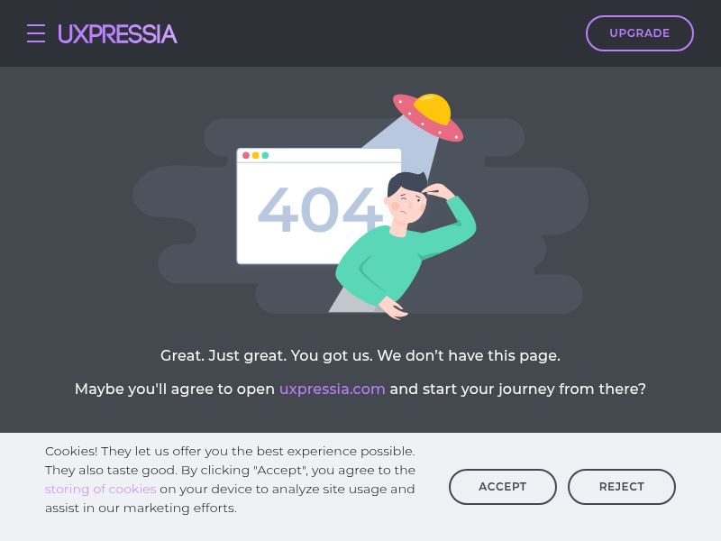

---

### 2.3.4. Empathy Mapping.

El Empathy Mapping permite comprender en profundidad las emociones, pensamientos y comportamientos de los usuarios, facilitando una conexión más humana con sus necesidades reales.
A través de esta herramienta, se identifican los dolores, motivaciones y expectativas de los distintos perfiles, lo que contribuye al diseño de soluciones más relevantes y personalizadas.

En el caso de Smart Stay, se elaboraron dos mapas de empatía diferenciados según los segmentos objetivos:

- **Segmento 1: orientado a la gestión operativa y administración hotelera, representado por el perfil del Manager (Adrián Ramírez).**

- **Segmento 2: enfocado en la experiencia de estadía y servicios digitales, representado por el perfil del Traveler (Valeria Ríos).**

Estos mapas permiten visualizar cómo cada tipo de usuario piensa, siente y actúa frente al servicio, además de reconocer los puntos de dolor (pains) y las ganancias esperadas (gains).
El análisis conjunto de ambos segmentos brinda una visión integral para mejorar la eficiencia operativa del hotel y elevar la satisfacción del huésped, alineando tecnología y experiencia humana.

**Segmento 1 – Administradores de Hoteles Boutique y Pequeños en Lima**

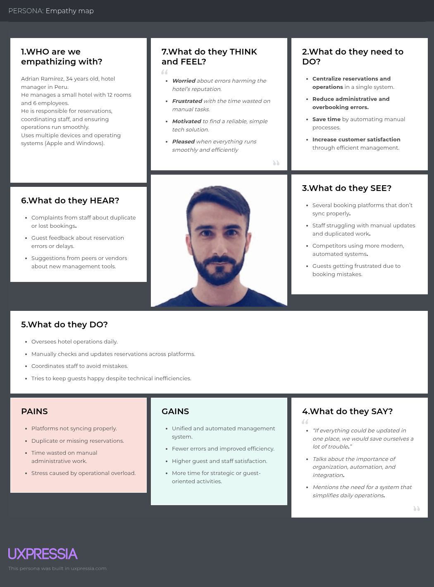

**Segmento 2 – Huéspedes de Hoteles**

.png)

---

## 2.4. Big Picture EventStorming.


**Chaotic Exploration:**


**Timeline:**


**People & Systems:**


**Problems & Opportunities:**


**Prioritization:**


---

## 2.5. Ubiquitous Language.

| **Término en Inglés**        | **Término en Español**             | **Definición**                                                                                                                                      |
|------------------------------|------------------------------------|-----------------------------------------------------------------------------------------------------------------------------------------------------|
| Hotel Administrator          | Administrador del hotel            | Usuario encargado de la gestión operativa del hotel. Supervisa reservas, limpieza, facturación y coordinación con el personal.                      |
| Reservation Management       | Gestión de reservas                | Proceso centralizado de registro, confirmación, modificación y cancelación de reservas en tiempo real.                                              |
| Overbooking                  | Sobreventa                         | Situación en la que el hotel vende más habitaciones de las disponibles debido a la falta de sincronización en los sistemas de reserva.              |
| Housekeeping Schedule        | Programación de limpieza           | Organización de tareas de limpieza y mantenimiento de habitaciones, coordinadas desde el sistema de gestión.                                        |
| Digital Check-In / Check-Out | Registro digital de entrada/salida | Funcionalidad que permite al huésped ingresar o salir del hotel sin necesidad de hacer filas en recepción, a través de una aplicación o portal web. |
| Guest Profile                | Perfil del huésped                 | Información digital del cliente que incluye preferencias, historial de estadías y solicitudes especiales.                                           |
| Smart Room Control           | Control inteligente de habitación  | Función que permite al huésped manejar servicios como iluminación, temperatura o room service desde su dispositivo móvil.                           |
| Real-Time Notification       | Notificación en tiempo real        | Alerta automática que informa sobre nuevas reservas, cambios en disponibilidad o solicitudes de huéspedes.                                          |
| Financial Report             | Reporte financiero                 | Documento digital generado por el sistema que resume ingresos, gastos y métricas clave para evaluar la rentabilidad del hotel.                      |
| Guest Feedback               | Retroalimentación del huésped      | Opiniones y calificaciones que los huéspedes comparten sobre su estadía, utilizadas para mejorar los servicios.                                     |

<div style="page-break-after: always;"></div>

# **Capítulo III: Requirements Specification**

## 3.1. User Stories.

# User Stories - Smart Stay

| Epic / Story ID | Title | Description | Acceptance Criteria | Related to (Epic ID) |
|-----------------|-------|-------------|---------------------|---------------------|
| **EP-01** | **Authentication and User Management** | Epic that groups functionalities for registration, login, profile management, and role-based access control for all user types (administrators, staff, guests). | | - |
| **EP-02** | **Central Hotel Management** | Epic that includes reservation administration, room management, digital check-in/check-out, daily operational management, and internal service coordination. | | - |
| **EP-03** | **Guest Digital Experience** | Epic focused on guest experience: IoT environmental control, personalized services, digital communication, and post-stay evaluation. | | - |
| **EP-04** | **Analytics and Reporting** | Epic covering management dashboard, occupancy reports, operational KPIs, satisfaction analysis, and financial metrics. | | - |
| **EP-05** | **Integrations and External Channels** | Epic for connections with OTAs, WhatsApp, payment systems, digital reputation, and third-party webhooks. | | - |
| **EP-06** | **Landing Page and Digital Marketing** | Epic for the static website with segment-specific information, success stories, simulators, and commercial contact channels. | | - |
| **EP-07** | **RESTful API and Technical Services** | Epic including endpoints, API authentication, technical documentation, monitoring, and external system integration. | | - |
| **EP-08** | **Notifications and Communication** | Epic for push notification system, email, SMS, automatic alerts, and staff-guest communication. | | - |
| US-01 | User registration with validation | **As** a new user, **I want** to register in Smart Stay by validating my email **to** access functionalities according to my role. | **Scenario 1: Successful registration**<br>**Given** I am a new user with valid data, **when** I complete the registration form, **then** my account is created correctly and I receive email confirmation.<br><br>**Scenario 2: Email already registered**<br>**Given** I attempt to register with an existing email, **when** I submit the form, **then** the system shows "Email already registered" message and suggests password recovery.<br><br>**Scenario 3: Incomplete data**<br>**Given** I leave mandatory fields empty, **when** I try to register, **then** the system highlights missing fields and doesn't allow continuation.<br><br>**Scenario 4: Email format validation**<br>**Given** I enter an invalid email format, **when** I submit the form, **then** the system shows format error. | EP-01 |
| US-02 | Secure login | **As** a registered user, **I want** to login securely **to** access my personalized dashboard according to my role. | **Scenario 1: Correct login**<br>**Given** I have valid credentials, **when** I login, **then** I access my corresponding dashboard (admin/guest/staff).<br><br>**Scenario 2: Incorrect credentials**<br>**Given** I enter incorrect data, **when** I try to access, **then** I receive error message without revealing whether the problem is email or password.<br><br>**Scenario 3: Blocked account**<br>**Given** login failed 5 consecutive times, **when** I try again, **then** the account is temporarily blocked and I receive notification.<br><br>**Scenario 4: Persistent session**<br>**Given** I check "remember me", **when** I close and open the browser, **then** I remain logged in until I manually logout. | EP-01 |
| US-03 | Profile and role management | **As** an administrator, **I want** to manage users, assign roles and permissions **to** control access to different functionalities. | **Scenario 1: Create staff user**<br>**Given** I am admin, **when** I create a staff user, **then** I can assign specific permissions (housekeeping, front desk, maintenance).<br><br>**Scenario 2: Modify permissions**<br>**Given** there is a staff user, **when** I change their permissions, **then** their access is updated immediately.<br><br>**Scenario 3: Deactivate user**<br>**Given** I need to deactivate a user, **when** I do so, **then** they lose access but their history is maintained.<br><br>**Scenario 4: Access audit**<br>**Given** I need to review activity, **when** I consult logs, **then** I see date, time, user and action performed. | EP-01 |
| US-04 | Password recovery | **As** a user, **I want** to recover my password via email **to** regain access to my account. | **Scenario 1: Valid request**<br>**Given** I request password recovery with registered email, **when** I send the request, **then** I receive reset link via email.<br><br>**Scenario 2: Unregistered email**<br>**Given** I request with unregistered email, **when** I send request, **then** I receive generic message without revealing if email exists.<br><br>**Scenario 3: Expired link**<br>**Given** the reset link is older than 30 minutes, **when** I try to use it, **then** it expires and I must request a new one.<br><br>**Scenario 4: Successful change**<br>**Given** I have valid link, **when** I set new password, **then** it updates and I receive confirmation. | EP-01 |
| US-05 | Administrator dashboard | **As** an administrator, **I want** a centralized panel with key information **to** manage my hotel efficiently. | **Scenario 1: General view**<br>**Given** I access the dashboard, **when** it loads, **then** I see current occupancy, daily check-ins/outs, pending tasks and important alerts.<br><br>**Scenario 2: Date filters**<br>**Given** I want to review specific period, **when** I select date range, **then** all indicators update.<br><br>**Scenario 3: Quick access**<br>**Given** I'm on the dashboard, **when** I click any metric, **then** I navigate to corresponding detailed section.<br><br>**Scenario 4: Real-time updates**<br>**Given** there are operational changes, **when** they occur, **then** the dashboard updates automatically without reloading the page. | EP-02 |
| US-06 | Room and status management | **As** an administrator, **I want** to manage all room statuses **to** optimize daily operations. | **Scenario 1: Change room status**<br>**Given** I select a room, **when** I change its status (available/occupied/cleaning/maintenance), **then** it updates immediately and notifies corresponding staff.<br><br>**Scenario 2: Room map view**<br>**Given** I access room map, **when** it loads, **then** I see all statuses with color codes and can make quick changes.<br><br>**Scenario 3: Change history**<br>**Given** I need to review changes, **when** I consult room history, **then** I see all status changes with date, time and responsible user.<br><br>**Scenario 4: Automatic alerts**<br>**Given** a room is in maintenance for more than 24 hours, **when** time passes, **then** I receive automatic alert. | EP-02 |
| US-07 | Centralized reservation management | **As** an administrator, **I want** to manage all reservations in one place **to** avoid overbooking and optimize occupancy. | **Scenario 1: Reservation calendar view**<br>**Given** I access reservations, **when** I select calendar view, **then** I see all reservations organized by date with key information (guest, room, status).<br><br>**Scenario 2: Create manual reservation**<br>**Given** I receive phone reservation, **when** I enter it manually, **then** the system validates availability and confirms reservation.<br><br>**Scenario 3: Modify existing reservation**<br>**Given** I need to change a reservation, **when** I edit it, **then** the system validates new availability and notifies the guest.<br><br>**Scenario 4: Cancellation with policies**<br>**Given** a reservation is cancelled, **when** I process cancellation, **then** the system applies cancellation policies and releases the room. | EP-02 |
| US-08 | Automated digital check-in | **As** an administrator and guest, **I want** check-in to be performed digitally in less than 3 minutes **to** improve experience. | **Scenario 1: Successful guest check-in**<br>**Given** the guest initiates digital check-in, **when** they complete their data and confirmation, **then** they receive digital access to their room and access code.<br><br>**Scenario 2: Document validation**<br>**Given** the guest uploads ID documents, **when** the system processes them, **then** it validates automatically and approves check-in.<br><br>**Scenario 3: Assisted check-in**<br>**Given** the guest has difficulties, **when** they request help, **then** staff receives notification and can assist remotely.<br><br>**Scenario 4: Automatic notification**<br>**Given** check-in is completed, **when** confirmed, **then** housekeeping receives notification of occupied room and admin sees updated status. | EP-02 |
| US-09 | Digital check-out and billing | **As** a guest, **I want** to perform digital check-out and receive my invoice automatically **to** expedite my departure. | **Scenario 1: Successful check-out**<br>**Given** I start check-out from the app, **when** I confirm departure and review charges, **then** my room is released and I receive invoice via email.<br><br>**Scenario 2: Additional charges**<br>**Given** I have pending consumption, **when** I check-out, **then** I see charge details and can approve payment.<br><br>**Scenario 3: Late check-out**<br>**Given** my check-out is after deadline, **when** I process it, **then** corresponding charge is applied and notified.<br><br>**Scenario 4: Housekeeping notification**<br>**Given** I complete check-out, **when** confirmed, **then** housekeeping receives automatic cleaning task for that room. | EP-02 |
| US-10 | Staff task assignment and tracking | **As** an administrator, **I want** to assign tasks to staff and track their progress **to** optimize operations. | **Scenario 1: Assign housekeeping task**<br>**Given** a room needs cleaning, **when** I assign the task, **then** staff receives immediate notification with details and priority.<br><br>**Scenario 2: Progress update**<br>**Given** staff starts a task, **when** they mark it as "in progress", **then** admin sees real-time update.<br><br>**Scenario 3: Complete task**<br>**Given** staff finishes a task, **when** they mark it as completed, **then** admin receives notification and can validate work.<br><br>**Scenario 4: Overdue tasks**<br>**Given** a task isn't completed within expected time, **when** deadline passes, **then** automatic alert is generated. | EP-02 |
| US-11 | IoT environmental control from mobile app | **As** a guest, **I want** to control temperature, lighting and other environmental aspects from my smartphone **to** personalize my experience. | **Scenario 1: Temperature adjustment**<br>**Given** I'm in my room, **when** I change temperature from the app, **then** the IoT system adjusts climate in less than 30 seconds.<br><br>**Scenario 2: Lighting control**<br>**Given** I want to adjust lights, **when** I use app controls, **then** I can change intensity, color and turn on/off specific lights.<br><br>**Scenario 3: Blind configuration**<br>**Given** I want to control natural light, **when** I adjust blinds from app, **then** they open/close automatically to selected percentage.<br><br>**Scenario 4: Personalized presets**<br>**Given** I want quick configurations, **when** I save a preset (e.g., "rest", "work"), **then** I can activate multiple settings with one touch. | EP-03 |
| US-12 | Service requests from app | **As** a guest, **I want** to request room service, additional cleaning and other services from my smartphone **to** access services conveniently. | **Scenario 1: Request room service**<br>**Given** I want to order food, **when** I access menu in app, **then** I can select products, customize and confirm order with estimated time.<br><br>**Scenario 2: Additional cleaning service**<br>**Given** I need extra cleaning, **when** I request it, **then** I can choose preferred time and staff receives request immediately.<br><br>**Scenario 3: Request tracking**<br>**Given** I made an order, **when** I check status, **then** I see real-time progress (received, preparing, on way, delivered).<br><br>**Scenario 4: Special services**<br>**Given** I need special services (transport, tour, reservations), **when** I request them, **then** staff receives notification for personalized coordination. | EP-03 |
| US-13 | Digital guest-staff communication | **As** a guest, **I want** to communicate with hotel staff digitally **to** resolve questions and requests quickly. | **Scenario 1: Real-time chat**<br>**Given** I have a question, **when** I start chat from app, **then** I connect with available staff and receive response in less than 5 minutes.<br><br>**Scenario 2: Specific requests**<br>**Given** I need something specific, **when** I send detailed message, **then** corresponding staff receives request and can coordinate attention.<br><br>**Scenario 3: Conversation history**<br>**Given** I've had several conversations, **when** I access history, **then** I can review all interactions from my stay.<br><br>**Scenario 4: Automatic escalation**<br>**Given** my request isn't resolved in reasonable time, **when** time limit passes, **then** it's automatically escalated to a supervisor. | EP-03 |
| US-14 | Experience personalization based on preferences | **As** a guest, **I want** the system to learn my preferences **to** offer personalized experiences and services. | **Scenario 1: Initial preference setup**<br>**Given** it's my first stay, **when** I complete preference profile, **then** the system configures room according to my tastes before arrival.<br><br>**Scenario 2: Automatic learning**<br>**Given** I've used the system several times, **when** I return, **then** the system automatically suggests services and configurations based on my history.<br><br>**Scenario 3: Personalized recommendations**<br>**Given** my taste profile, **when** I'm at the hotel, **then** I receive restaurant, activity and service recommendations aligned with my interests.<br><br>**Scenario 4: Exclusive offers**<br>**Given** I'm a recurring guest, **when** I check the app, **then** I see personalized offers and upgrades based on my history and loyalty. | EP-03 |
| US-15 | Post-stay evaluation and feedback | **As** a guest, **I want** to evaluate my experience and leave feedback **to** help the hotel improve its services. | **Scenario 1: Automatic evaluation**<br>**Given** I complete my check-out, **when** 2 hours pass, **then** I receive automatic invitation to evaluate my stay with simple form.<br><br>**Scenario 2: Detailed feedback**<br>**Given** I want to give specific opinion, **when** I access extended evaluation, **then** I can rate individual aspects and leave comments.<br><br>**Scenario 3: Negative feedback follow-up**<br>**Given** I leave low rating, **when** I send evaluation, **then** hotel receives immediate alert and can contact me to resolve the problem.<br><br>**Scenario 4: Feedback incentives**<br>**Given** I complete evaluation, **when** I send it, **then** I receive benefit for next stay (discount, upgrade, free service). | EP-03 |
| US-16 | Analytics dashboard and operational KPIs | **As** an administrator, **I want** to visualize key metrics and KPIs **to** make informed decisions about hotel operations. | **Scenario 1: Real-time metrics**<br>**Given** I access analytics dashboard, **when** it loads, **then** I see current occupancy, daily revenue, completed tasks and average satisfaction.<br><br>**Scenario 2: Historical comparisons**<br>**Given** I want to analyze trends, **when** I select compare periods, **then** I see comparative charts of occupancy, revenue and operations.<br><br>**Scenario 3: Metric drill-down**<br>**Given** I see an interesting metric, **when** I click on it, **then** I can explore detailed data and filter by room, date or service.<br><br>**Scenario 4: Intelligent alerts**<br>**Given** there are negative trends, **when** system detects them, **then** I receive automatic alerts with action suggestions. | EP-04 |
| US-17 | Financial and occupancy reports | **As** an administrator, **I want** to generate financial and occupancy reports **to** support management analysis and decision making. | **Scenario 1: Automated daily report**<br>**Given** the operational day ends, **when** midnight passes, **then** system automatically generates daily report with revenue, occupancy and incidents.<br><br>**Scenario 2: Custom report**<br>**Given** I need specific analysis, **when** I configure parameters (dates, metrics, filters), **then** I generate customized report in PDF or Excel.<br><br>**Scenario 3: Forecasting and projections**<br>**Given** historical data, **when** I access projections, **then** I see occupancy and revenue forecasting based on trends and confirmed reservations.<br><br>**Scenario 4: Competitive benchmarking**<br>**Given** I have market data, **when** I generate comparative report, **then** I see my performance versus local competition in key metrics. | EP-04 |
| US-18 | Guest satisfaction analysis | **As** an administrator, **I want** to analyze guest satisfaction **to** identify improvement areas and maintain service quality. | **Scenario 1: Satisfaction dashboard**<br>**Given** I access satisfaction analysis, **when** it loads, **then** I see average NPS, rating distribution and recent comments.<br><br>**Scenario 2: Category analysis**<br>**Given** I want to understand specific problems, **when** I filter by aspect (cleanliness, service, comfort), **then** I see detailed ratings by area.<br><br>**Scenario 3: Temporal trends**<br>**Given** I want to see evolution, **when** I select temporal view, **then** I see how satisfaction has changed over time.<br><br>**Scenario 4: Corrective actions**<br>**Given** I identify recurring problem, **when** I mark it for action, **then** automatic task is created for responsible department. | EP-04 |
| US-19 | IoT energy consumption monitoring | **As** an administrator, **I want** to monitor energy consumption of rooms and common areas **to** optimize operational costs. | **Scenario 1: Real-time consumption dashboard**<br>**Given** I access energy monitoring, **when** it loads, **then** I see current consumption by room, common area and main equipment.<br><br>**Scenario 2: Excessive consumption alerts**<br>**Given** a room exceeds normal consumption, **when** it passes threshold, **then** I receive immediate alert with option to investigate or adjust remotely.<br><br>**Scenario 3: Automatic optimization**<br>**Given** a room is unoccupied, **when** 30 minutes pass without activity, **then** system automatically adjusts temperature and lights to eco mode.<br><br>**Scenario 4: Savings reports**<br>**Given** optimizations are implemented, **when** I generate monthly report, **then** I see consumption comparison and achieved savings versus previous period. | EP-04 |
| US-20 | OTA and booking channel integration | **As** an administrator, **I want** to integrate my inventory with Booking.com, Expedia and other OTAs **to** maximize occupancy and avoid overbooking. | **Scenario 1: Automatic availability synchronization**<br>**Given** I change availability in Smart Stay, **when** I update, **then** all connected channels synchronize automatically in less than 5 minutes.<br><br>**Scenario 2: Automatic reservation import**<br>**Given** I receive OTA reservation, **when** confirmed, **then** it's automatically imported to Smart Stay with all guest information.<br><br>**Scenario 3: Centralized price management**<br>**Given** I want to change rates, **when** I update them in Smart Stay, **then** they automatically propagate to all configured channels.<br><br>**Scenario 4: Conflict resolution**<br>**Given** there's discrepancy between channels, **when** system detects it, **then** it notifies me immediately and suggests actions to resolve conflict. | EP-05 |
| US-21 | WhatsApp Business integration | **As** an administrator, **I want** to use WhatsApp Business for direct guest communication and pre/post-stay query management **to** improve customer service. | **Scenario 1: Automatic welcome messages**<br>**Given** a guest confirms reservation, **when** registered, **then** they receive automatic WhatsApp message with arrival information and contact.<br><br>**Scenario 2: Pre-arrival queries**<br>**Given** guest sends WhatsApp query, **when** message arrives, **then** staff receives Smart Stay notification and can respond from platform.<br><br>**Scenario 3: Service confirmations**<br>**Given** guest requests service via WhatsApp, **when** processed, **then** they receive automatic confirmation with details and estimated time.<br><br>**Scenario 4: Post-stay follow-up**<br>**Given** guest checks out, **when** 1 day passes, **then** they receive automatic thank you message and invitation to evaluate experience. | EP-05 |
| US-22 | Digital reputation management | **As** an administrator, **I want** to manage Google, TripAdvisor and OTA reviews from one place **to** maintain good online reputation. | **Scenario 1: Review consolidation**<br>**Given** I access reputation management, **when** it loads, **then** I see all reviews from different platforms in one dashboard.<br><br>**Scenario 2: Centralized response**<br>**Given** I want to respond to a review, **when** I write response, **then** I can publish it automatically on corresponding platform.<br><br>**Scenario 3: Negative review alerts**<br>**Given** I receive 3-star or less review, **when** published, **then** I receive immediate alert for quick response.<br><br>**Scenario 4: Sentiment analysis**<br>**Given** I have multiple reviews, **when** I access analysis, **then** I see satisfaction trends, frequent keywords and identified improvement areas. | EP-05 |
| US-23 | Digital payment processing | **As** an administrator and guest, **I want** to process payments securely and efficiently through multiple payment methods **to** ensure smooth transactions. | **Scenario 1: Card payment at check-in**<br>**Given** guest performs digital check-in, **when** they enter card data, **then** secure pre-authorization is processed and registration confirmed.<br><br>**Scenario 2: Additional service payment**<br>**Given** guest requests room service, **when** they confirm order, **then** they can pay immediately through app with saved method.<br><br>**Scenario 3: Automatic check-out billing**<br>**Given** guest checks out, **when** they confirm final charges, **then** automatic payment is processed and they receive digital invoice.<br><br>**Scenario 4: Failed payment handling**<br>**Given** a payment fails, **when** error occurs, **then** guest receives immediate notification with alternative payment options. | EP-05 |
| US-24 | Segmented landing page | **As** a visitor, **I want** to find specific information according to my profile (hotel administrator or guest) **to** understand Smart Stay's value. | **Scenario 1: Administrator information**<br>**Given** I'm a hotel administrator visiting the page, **when** I navigate the hotels section, **then** I see operational benefits, ROI, success stories and specific demo.<br><br>**Scenario 2: Guest information**<br>**Given** I'm a traveler visiting the page, **when** I navigate the guests section, **then** I see experience benefits, comfort and technology.<br><br>**Scenario 3: Intuitive navigation**<br>**Given** I arrive at landing, **when** it loads, **then** I can easily identify my profile and navigate to relevant information in less than 3 clicks.<br><br>**Scenario 4: Clear calls to action**<br>**Given** I'm interested, **when** I look for next step, **then** I find clear CTAs (request demo, contact sales, download app). | EP-06 |
| US-25 | ROI simulator for hotels | **As** a visiting hotel administrator, **I want** to use a simulator to estimate the return on investment I would get with Smart Stay **to** make informed decisions. | **Scenario 1: Basic ROI calculation**<br>**Given** I enter basic data (number of rooms, average occupancy), **when** I run simulation, **then** I see estimated annual savings and recovery time.<br><br>**Scenario 2: Hotel type personalization**<br>**Given** I select my hotel type (boutique, chain, resort), **when** I use simulator, **then** calculations adjust to my segment averages.<br><br>**Scenario 3: Current situation comparison**<br>**Given** I enter current operational costs, **when** I generate report, **then** I see clear comparison between my current operation and with Smart Stay.<br><br>**Scenario 4: Export results**<br>**Given** I complete simulation, **when** I want to save results, **then** I can export PDF report to share with my team. | EP-06 |
| US-26 | Success stories and testimonials | **As** an interested visitor, **I want** to see real success stories from hotels using Smart Stay **to** validate solution effectiveness. | **Scenario 1: Video testimonials**<br>**Given** I access success stories, **when** I navigate the section, **then** I can see videos of real administrators sharing their experience with specific metrics.<br><br>**Scenario 2: Improvement metrics**<br>**Given** I read a success story, **when** I review details, **then** I see specific improvement data (% cost reduction, % satisfaction increase, time saved).<br><br>**Scenario 3: Stories by hotel type**<br>**Given** I look for references, **when** I filter by hotel type similar to mine, **then** I see relevant cases for my specific situation.<br><br>**Scenario 4: Direct contact with cases**<br>**Given** I'm interested in a specific case, **when** I request more information, **then** I can connect directly with the hotel for references. | EP-06 |
| US-27 | Demo request and commercial contact | **As** an interested visitor, **I want** to request a demonstration and contact the sales team easily and quickly **to** explore Smart Stay solutions. | **Scenario 1: Demo request form**<br>**Given** I want to see a demo, **when** I complete the form, **then** I receive immediate confirmation and team contact within 24 hours.<br><br>**Scenario 2: Automatic scheduling**<br>**Given** I request demo, **when** I submit form, **then** I can schedule appointment directly on available sales team calendar.<br><br>**Scenario 3: Accessible contact information**<br>**Given** I prefer direct contact, **when** I look for information, **then** I easily find phone, email and WhatsApp of sales team.<br><br>**Scenario 4: Automatic follow-up**<br>**Given** I requested information, **when** time passes without response, **then** I receive automatic follow-up with contact alternatives. | EP-06 |
| US-28 | Corporate information and values | **As** a visitor, **I want** to know Smart Stay's mission, vision and values **to** understand the company's philosophy. | **Scenario 1: Complete "About us" section**<br>**Given** I look for corporate information, **when** I access "About us", **then** I find clear description of mission, vision, values and company history.<br><br>**Scenario 2: Team and leadership**<br>**Given** I want to know the team, **when** I navigate to the section, **then** I see information about founders, key leaders and their experience.<br><br>**Scenario 3: Sustainability commitment**<br>**Given** I care about environmental impact, **when** I review values, **then** I see clear commitment to sustainability and energy efficiency.<br><br>**Scenario 4: Certifications and recognitions**<br>**Given** I look for quality validation, **when** I review credentials, **then** I see certifications, awards and industry recognitions. | EP-06 |
| US-29 | RESTful API for room management | **As** a developer, **I want** to access RESTful endpoints **to** integrate Smart Stay with external hotel management systems. | **Scenario 1: Query available rooms**<br>**Given** I make GET /api/v1/rooms?date=2025-10-15, **when** API processes request, **then** I receive room list with availability and prices.<br><br>**Scenario 2: Update room status**<br>**Given** I make PUT /api/v1/rooms/101 with new status, **when** processed, **then** room is updated and I receive 200 OK confirmation.<br><br>**Scenario 3: Create new reservation**<br>**Given** I make POST /api/v1/bookings with valid data, **when** processed, **then** reservation is created and I receive unique confirmation ID.<br><br>**Scenario 4: Error handling**<br>**Given** I send invalid data, **when** API processes it, **then** I receive 400 error with clear problem description. | EP-07 |
| US-30 | API for IoT device control | **As** a developer, **I want** endpoints to control room IoT devices **to** enable integration with external applications. | **Scenario 1: Get current device status**<br>**Given** I make GET /api/v1/rooms/101/devices, **when** processed, **then** I receive current status of temperature, lights, blinds and other devices.<br><br>**Scenario 2: Control temperature**<br>**Given** I make POST /api/v1/rooms/101/climate with desired temperature, **when** processed, **then** IoT device adjusts temperature.<br><br>**Scenario 3: Lighting control**<br>**Given** I make PUT /api/v1/rooms/101/lights with configuration, **when** processed, **then** lights adjust according to sent parameters.<br><br>**Scenario 4: Change logs**<br>**Given** I make GET /api/v1/rooms/101/device-logs, **when** processed, **then** I receive history of all device changes made. | EP-07 |
| US-31 | API authentication and authorization | **As** a developer, **I want** a secure authentication system **to** access Smart Stay API endpoints safely. | **Scenario 1: Get access token**<br>**Given** I make POST /api/v1/auth with valid credentials, **when** processed, **then** I receive JWT token with expiration time.<br><br>**Scenario 2: Access with valid token**<br>**Given** I include valid Bearer token in headers, **when** I make request to protected endpoint, **then** I receive successful response.<br><br>**Scenario 3: Expired token**<br>**Given** my token expired, **when** I make request, **then** I receive 401 Unauthorized error with clear message.<br><br>**Scenario 4: Different access levels**<br>**Given** I have read-only token, **when** I try POST/PUT/DELETE, **then** I receive 403 Forbidden error. | EP-07 |
| US-32 | Interactive API documentation | **As** a developer, **I want** to access complete and interactive documentation **to** easily integrate with Smart Stay API. | **Scenario 1: Explore available endpoints**<br>**Given** I access documentation, **when** I navigate, **then** I see all endpoints organized by category with complete description.<br><br>**Scenario 2: Test live endpoints**<br>**Given** I'm in documentation, **when** I select "Try it", **then** I can test endpoint directly with my credentials.<br><br>**Scenario 3: Code examples**<br>**Given** I review an endpoint, **when** I see documentation, **then** I find code examples in multiple languages (JavaScript, Python, PHP).<br><br>**Scenario 4: Data schemas**<br>**Given** I need to understand structure, **when** I review endpoint, **then** I see complete request/response schemas with data types. | EP-07 |
| US-33 | Webhooks for real-time events | **As** a developer, **I want** to configure webhooks **to** receive automatic notifications when important Smart Stay events occur. | **Scenario 1: Configure webhook**<br>**Given** I make POST /api/v1/webhooks with URL and events, **when** configured, **then** my endpoint receives notifications for those events.<br><br>**Scenario 2: New reservation notification**<br>**Given** I have webhook configured for "booking.created", **when** new reservation is made, **then** my endpoint receives POST with reservation data.<br><br>**Scenario 3: Automatic retries**<br>**Given** my endpoint doesn't respond, **when** Smart Stay sends webhook, **then** it retries up to 3 times with exponential backoff.<br><br>**Scenario 4: Security verification**<br>**Given** I receive webhook, **when** I verify signature, **then** I can confirm it really comes from Smart Stay using shared secret. | EP-07 |
| US-34 | Mobile push notification system | **As** a guest, **I want** to receive push notifications on my smartphone about my request and service status **to** stay informed. | **Scenario 1: Reservation confirmation notification**<br>**Given** I make a reservation, **when** confirmed, **then** I receive immediate push notification with details and next steps.<br><br>**Scenario 2: Check-in reminder**<br>**Given** my arrival is in 24 hours, **when** the moment comes, **then** I receive notification with direct link for digital check-in.<br><br>**Scenario 3: Service updates**<br>**Given** I requested room service, **when** status changes, **then** I receive notification with updated progress (preparing, on way, delivered).<br><br>**Scenario 4: Preference settings**<br>**Given** I want to control notifications, **when** I access settings, **then** I can choose which types to receive and at what times. | EP-08 |
| US-35 | Automatic staff notifications | **As** hotel staff, **I want** to receive automatic notifications about assigned tasks and important operational changes **to** respond promptly. | **Scenario 1: New assigned task**<br>**Given** administrator assigns me a task, **when** created, **then** I receive immediate notification with details, priority and deadline.<br><br>**Scenario 2: Priority change**<br>**Given** a task changes to high priority, **when** updated, **then** I receive special notification requiring read confirmation.<br><br>**Scenario 3: Deadline reminders**<br>**Given** I have pending task, **when** deadline approaches, **then** I receive reminder 2 hours before due time.<br><br>**Scenario 4: Operational emergencies**<br>**Given** there's emergency (technical problem, urgent complaint), **when** reported, **then** all relevant staff receive immediate alert. | EP-08 |
| US-36 | Automated email marketing | **As** an administrator, **I want** to send automated personalized emails to guests at different stages **to** enhance customer experience. | **Scenario 1: Pre-arrival welcome email**<br>**Given** guest confirms reservation, **when** 24 hours pass, **then** they receive email with hotel information, available services and arrival guide.<br><br>**Scenario 2: During stay**<br>**Given** guest is at hotel for 2+ days, **when** it's the second day, **then** they receive email with local recommendations and special services.<br><br>**Scenario 3: Post-stay and loyalty**<br>**Given** guest checks out, **when** 1 week passes, **then** they receive thank you email with special offer for next visit.<br><br>**Scenario 4: Segmented campaigns**<br>**Given** I want to run specific campaign, **when** I select criteria (VIP guests, seasonality), **then** I can send personalized emails to that segment. | EP-08 |
| US-37 | Intelligent alerts and escalation | **As** an administrator, **I want** to receive intelligent alerts about operational problems with automatic escalation **to** ensure quick resolution. | **Scenario 1: Low satisfaction alert**<br>**Given** guest gives 2-star rating or less, **when** they send evaluation, **then** I receive immediate alert for corrective action.<br><br>**Scenario 2: Critical technical problem**<br>**Given** IoT device doesn't respond for more than 10 minutes, **when** detected, **then** I receive alert with problem information and affected room.<br><br>**Scenario 3: Automatic escalation**<br>**Given** alert isn't attended within defined time, **when** time limit passes, **then** it's automatically escalated to supervisor or general manager.<br><br>**Scenario 4: Revenue management alerts**<br>**Given** occupancy is well below forecast, **when** trend is detected, **then** I receive alert with pricing adjustment suggestions. | EP-08 |
| US-38 | Unified communication panel | **As** an administrator, **I want** a centralized panel to manage all communications **to** streamline guest interaction management. | **Scenario 1: Unified conversation view**<br>**Given** I access communication panel, **when** it loads, **then** I see all active conversations from different channels in one interface.<br><br>**Scenario 2: Response from central panel**<br>**Given** guest sends WhatsApp message, **when** I respond from panel, **then** my response is sent through original channel automatically.<br><br>**Scenario 3: Unified guest history**<br>**Given** I select a guest, **when** I access their communication profile, **then** I see complete interaction history regardless of channel used.<br><br>**Scenario 4: Conversation assignment**<br>**Given** complex query arrives, **when** I receive it, **then** I can assign it to specialized staff who will receive notification to respond. | EP-08 |
| US-39 | Native mobile app for staff | **As** hotel staff, **I want** a dedicated mobile app to manage my tasks and communication **to** work efficiently while on the move. | **Scenario 1: Mobile task list**<br>**Given** I open staff app, **when** it loads, **then** I see my pending tasks organized by priority with essential information.<br><br>**Scenario 2: Update task status**<br>**Given** I complete a task, **when** I mark it as finished from app, **then** the change syncs immediately with central system.<br><br>**Scenario 3: Communication with administration**<br>**Given** I have question or problem, **when** I use app chat, **then** I can communicate directly with administration in real time.<br><br>**Scenario 4: Incident reporting**<br>**Given** I find problem (damaged room, broken equipment), **when** I report it from app, **then** automatic ticket is created with photo and location. | EP-03 |
| US-40 | Data backup and recovery | **As** a technical administrator, **I want** the system to have automatic backup and disaster recovery **to** guarantee operational continuity. | **Scenario 1: Automatic daily backup**<br>**Given** each operational day ends, **when** midnight arrives, **then** system creates complete data backup and stores it in secure location.<br><br>**Scenario 2: Integrity verification**<br>**Given** backup is created, **when** completed, **then** system automatically verifies integrity of backed up data.<br><br>**Scenario 3: Emergency recovery**<br>**Given** there's critical system failure, **when** I start recovery process, **then** I can restore operation from most recent backup in less than 2 hours.<br><br>**Scenario 4: Problem notification**<br>**Given** backup process fails, **when** error is detected, **then** technical administrators receive immediate alert for investigation. | EP-07 |
| US-41 | System monitoring and logs | **As** a technical administrator, **I want** to monitor system performance and access detailed logs **to** support troubleshooting activities. | **Scenario 1: Performance dashboard**<br>**Given** I access monitoring, **when** it loads, **then** I see key metrics (response time, CPU/memory usage, requests per minute, errors).<br><br>**Scenario 2: Performance alerts**<br>**Given** response time exceeds 3 seconds, **when** detected, **then** I receive automatic alert with problem details.<br><br>**Scenario 3: Centralized logs**<br>**Given** I need to investigate problem, **when** I access logs, **then** I can filter by date, user, action and error level.<br><br>**Scenario 4: Trend analysis**<br>**Given** I want to optimize performance, **when** I review historical metrics, **then** I can identify patterns and bottlenecks. | EP-07 |
| US-42 | Multi-hotel configuration for chains | **As** a hotel chain administrator, **I want** to manage multiple properties from a master account **to** centralize operations with independent configurations. | **Scenario 1: Consolidated chain view**<br>**Given** I manage multiple hotels, **when** I access master panel, **then** I see consolidated KPIs for entire chain with drill-down by property.<br><br>**Scenario 2: Per-property configuration**<br>**Given** each hotel is different, **when** I configure specific one, **then** I can customize services, prices and operation without affecting others.<br><br>**Scenario 3: Shared staff between properties**<br>**Given** I have staff working at multiple hotels, **when** I assign them, **then** they can access corresponding properties with specific permissions.<br><br>**Scenario 4: Consolidated reports**<br>**Given** I need chain analysis, **when** I generate reports, **then** I can see individual and comparative metrics across all my properties. | EP-02 |
| US-43 | Integration with existing PMS systems | **As** an administrator, **I want** to integrate Smart Stay with my current PMS system **to** migrate gradually without interrupting operations. | **Scenario 1: Bidirectional synchronization**<br>**Given** I have existing PMS, **when** I configure integration, **then** reservations synchronize automatically in both directions.<br><br>**Scenario 2: Gradual functionality migration**<br>**Given** I want to adopt Smart Stay progressively, **when** I enable specific modules, **then** they can coexist with my current PMS.<br><br>**Scenario 3: Consistency validation**<br>**Given** I have data in both systems, **when** it synchronizes, **then** I receive alerts if there are discrepancies requiring manual resolution.<br><br>**Scenario 4: Transition backup**<br>**Given** I'm migrating, **when** I complete transition, **then** I can maintain read-only access to previous PMS for grace period. | EP-05 |
| US-44 | Brand customization per hotel | **As** an administrator, **I want** to customize interface and communications with my hotel's brand **to** maintain visual consistency. | **Scenario 1: Color and logo customization**<br>**Given** I want to personalize appearance, **when** I upload my logo and define colors, **then** entire interface (web and app) updates with my branding.<br><br>**Scenario 2: Personalized brand emails**<br>**Given** automatic communications are sent, **when** they reach guest, **then** they include my logo, colors and personalized hotel message.<br><br>**Scenario 3: Personalized landing page**<br>**Given** guests access digital services, **when** they reach the page, **then** they see completely branded interface with my hotel.<br><br>**Scenario 4: Message configuration**<br>**Given** I want to personalize communication, **when** I configure templates, **then** I can adapt all automatic messages to my brand's tone. | EP-03 |
| US-45 | Integrated loyalty program | **As** an administrator, **I want** to manage a loyalty program for recurring guests **to** provide automatic benefits and increase retention. | **Scenario 1: Automatic point accumulation**<br>**Given** guest completes stay, **when** they check out, **then** they automatically accumulate points based on total spend and duration.<br><br>**Scenario 2: Level benefits**<br>**Given** guest reaches VIP level, **when** they make new reservation, **then** they automatically receive benefits (upgrade, late checkout, amenities).<br><br>**Scenario 3: Personalized offers**<br>**Given** guest's history, **when** they're about to travel, **then** they receive special offers based on their preferences and typical dates.<br><br>**Scenario 4: Benefit redemption**<br>**Given** guest has sufficient points, **when** they want to redeem, **then** they can exchange for services, upgrades or free nights from app. | EP-03 |
| US-46 | Event and conference management | **As** an administrator, **I want** to manage special events and conferences **to** provide specific group functionalities. | **Scenario 1: Create group event**<br>**Given** I receive event request, **when** I create event, **then** I can define special rates, block rooms and assign specific services.<br><br>**Scenario 2: Mass check-in**<br>**Given** event participants arrive, **when** they start check-in, **then** they can use special code for accelerated process with pre-loaded data.<br><br>**Scenario 3: Group communication**<br>**Given** I have active event, **when** I need to communicate something, **then** I can send mass messages only to specific event participants.<br><br>**Scenario 4: Consolidated billing**<br>**Given** event ends, **when** I generate billing, **then** I can create master invoice for organizer or individual invoices according to configuration. | EP-02 |
| US-47 | IoT predictive maintenance | **As** an administrator, **I want** the IoT system to predict maintenance needs **to** optimize equipment performance and reduce downtime. | **Scenario 1: Continuous equipment monitoring**<br>**Given** I have IoT devices installed, **when** they operate, **then** system continuously monitors performance, consumption and usage patterns.<br><br>**Scenario 2: Predictive alerts**<br>**Given** equipment shows degradation signs, **when** anomaly is detected, **then** I receive alert with preventive maintenance recommendation.<br><br>**Scenario 3: Automatic scheduling**<br>**Given** maintenance is required, **when** I accept recommendation, **then** it's automatically scheduled with technical team and room is blocked.<br><br>**Scenario 4: Performance history**<br>**Given** I want to analyze equipment, **when** I access metrics, **then** I see complete performance history and all maintenance performed. | EP-04 |
| US-48 | Competition analysis and dynamic pricing | **As** an administrator, **I want** to analyze competitor prices and adjust my rates automatically **to** optimize revenue. | **Scenario 1: Competitor price monitoring**<br>**Given** I configure competing hotels, **when** system analyzes prices, **then** I see daily rate comparison in my geographic area.<br><br>**Scenario 2: Pricing suggestions**<br>**Given** there are changes in competition, **when** detected, **then** I receive price adjustment suggestions based on occupancy and demand forecast.<br><br>**Scenario 3: Automatic rate adjustment**<br>**Given** I enable dynamic pricing, **when** defined conditions are met, **then** system automatically adjusts prices within configured ranges.<br><br>**Scenario 4: Elasticity analysis**<br>**Given** I have price change history, **when** I generate analysis, **then** I see impact of adjustments on occupancy and total revenue. | EP-04 |
| US-49 | Automated compliance and auditing | **As** an administrator, **I want** the system to generate automatic compliance reports **to** facilitate regulatory audits. | **Scenario 1: Automatic regulatory reports**<br>**Given** I must comply with local regulations, **when** period ends, **then** system automatically generates reports required by authorities.<br><br>**Scenario 2: Complete traceability**<br>**Given** I need audit, **when** I export data, **then** I get complete traceability of all transactions and changes with timestamps.<br><br>**Scenario 3: Tax data validation**<br>**Given** I process payments, **when** registered, **then** system automatically validates they meet local tax requirements.<br><br>**Scenario 4: Organized digital archive**<br>**Given** I store documents, **when** I need them for audit, **then** they're automatically organized by period, type and guest with quick search. | EP-04 |
| US-50 | Security system integration | **As** an administrator, **I want** to integrate Smart Stay with hotel security systems **to** provide automated access management. | **Scenario 1: Automatic access code generation**<br>**Given** guest completes digital check-in, **when** confirmed, **then** system automatically generates unique code for their room with specific validity.<br><br>**Scenario 2: Automatic post-checkout revocation**<br>**Given** guest checks out, **when** completed, **then** all access codes are automatically revoked in security systems.<br><br>**Scenario 3: Temporary staff access**<br>**Given** staff needs access for cleaning/maintenance, **when** task is assigned, **then** they receive temporary code valid only during their work shift.<br><br>**Scenario 4: Access log and alerts**<br>**Given** any access code is used, **when** it occurs, **then** it's recorded in central log and alerts are generated for access outside normal hours. | EP-05 |


## 3.2. Impact Mapping.

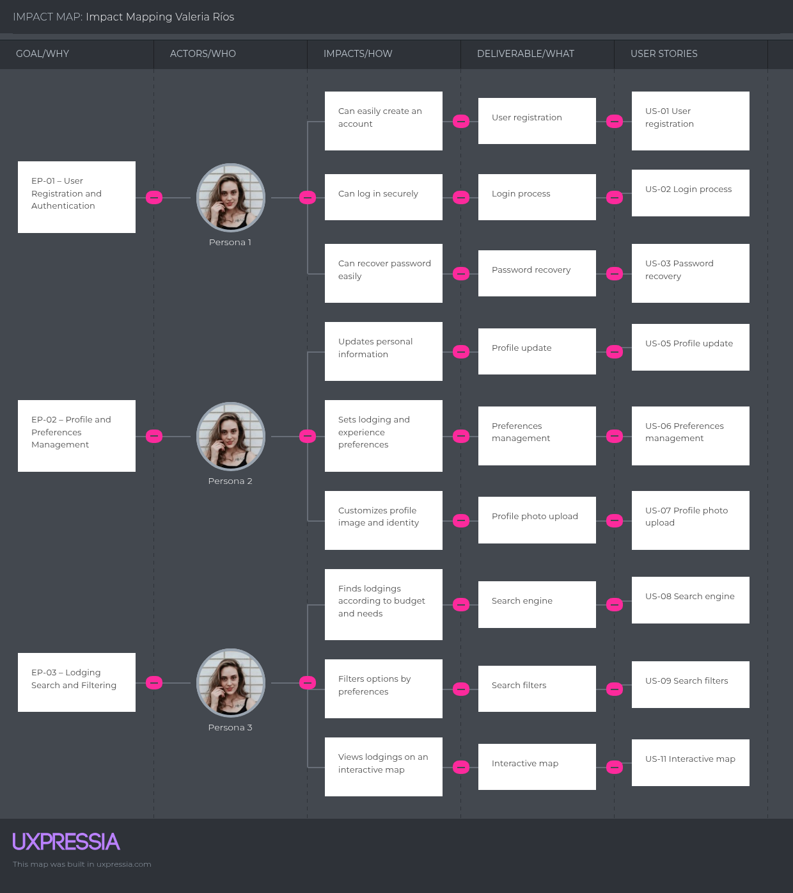


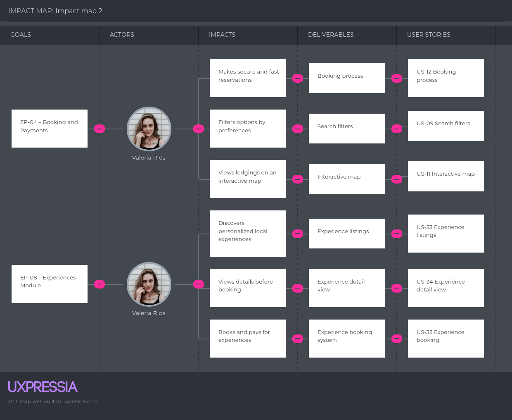


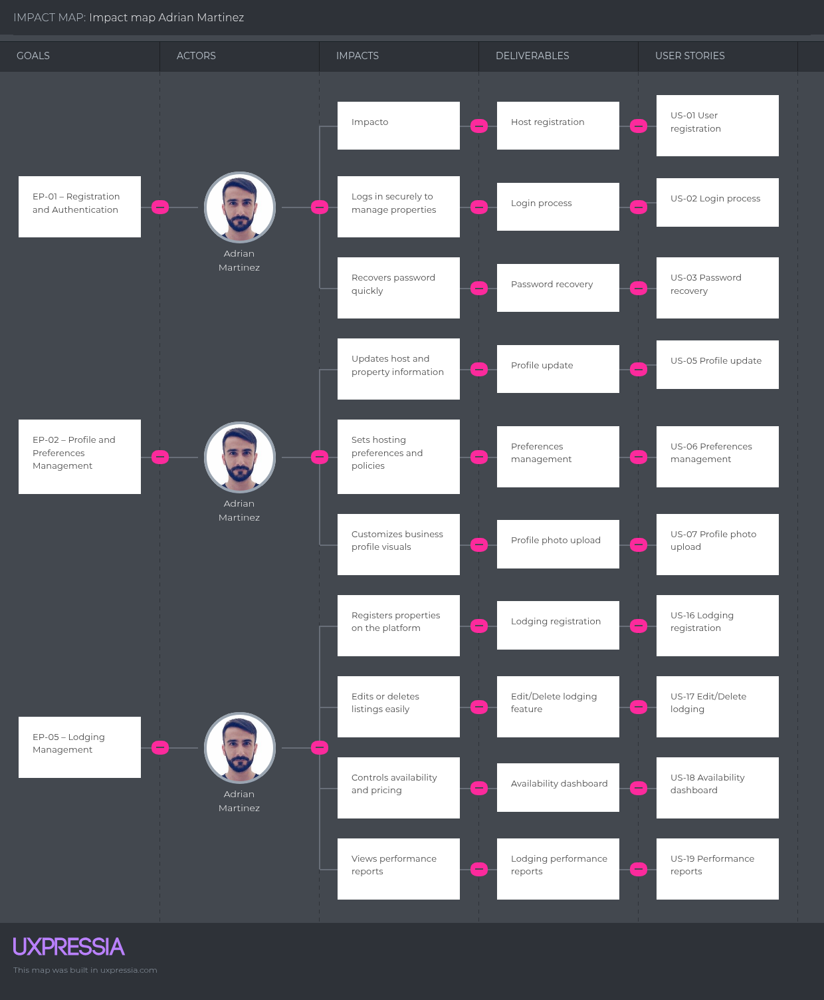


## 3.3. Product Backlog.

| # | Order | User Story Id | Title | Description | Story Points (1/2/3/5/8) |
|---|-------|---------------|-------|-------------|--------------------------|
| 1 | 1 | US-24 | Segmented landing page | **As** a visitor, **I want** to find specific information according to my profile (hotel administrator or guest) **to** understand Smart Stay's value. | 5 |
| 2 | 2 | US-25 | ROI simulator for hotels | **As** a visiting hotel administrator, **I want** to use a simulator to estimate the return on investment I would get with Smart Stay **to** make informed decisions. | 8 |
| 3 | 3 | US-27 | Demo request and commercial contact | **As** an interested visitor, **I want** to request a demonstration and contact the sales team easily and quickly **to** explore Smart Stay solutions. | 3 |
| 4 | 4 | US-26 | Success stories and testimonials | **As** an interested visitor, **I want** to see real success stories from hotels using Smart Stay **to** validate solution effectiveness. | 5 |
| 5 | 5 | US-28 | Corporate information and values | **As** a visitor, **I want** to know Smart Stay's mission, vision and values **to** understand the company's philosophy. | 2 |
| 6 | 6 | US-05 | Administrator dashboard | **As** an administrator, **I want** a centralized panel with key information **to** manage my hotel efficiently. | 8 |
| 7 | 7 | US-07 | Centralized reservation management | **As** an administrator, **I want** to manage all reservations in one place **to** avoid overbooking and optimize occupancy. | 8 |
| 8 | 8 | US-08 | Automated digital check-in | **As** an administrator and guest, **I want** check-in to be performed digitally in less than 3 minutes **to** improve experience. | 8 |
| 9 | 9 | US-09 | Digital check-out and billing | **As** a guest, **I want** to perform digital check-out and receive my invoice automatically **to** expedite my departure. | 5 |
| 10 | 10 | US-06 | Room and status management | **As** an administrator, **I want** to manage all room statuses **to** optimize daily operations. | 5 |
| 11 | 11 | US-20 | OTA and booking channel integration | **As** an administrator, **I want** to integrate my inventory with Booking.com, Expedia and other OTAs **to** maximize occupancy and avoid overbooking. | 8 |
| 12 | 12 | US-01 | User registration with validation | **As** a new user, **I want** to register in Smart Stay by validating my email **to** access functionalities according to my role. | 3 |
| 13 | 13 | US-02 | Secure login | **As** a registered user, **I want** to login securely **to** access my personalized dashboard according to my role. | 3 |
| 14 | 14 | US-11 | IoT environmental control from mobile app | **As** a guest, **I want** to control temperature, lighting and other environmental aspects from my smartphone **to** personalize my experience. | 8 |
| 15 | 15 | US-12 | Service requests from app | **As** a guest, **I want** to request room service, additional cleaning and other services from my smartphone **to** access services conveniently. | 5 |
| 16 | 16 | US-23 | Digital payment processing | **As** an administrator and guest, **I want** to process payments securely and efficiently through multiple payment methods **to** ensure smooth transactions. | 8 |
| 17 | 17 | US-10 | Staff task assignment and tracking | **As** an administrator, **I want** to assign tasks to staff and track their progress **to** optimize operations. | 5 |
| 18 | 18 | US-16 | Analytics dashboard and operational KPIs | **As** an administrator, **I want** to visualize key metrics and KPIs **to** make informed decisions about hotel operations. | 8 |
| 19 | 19 | US-34 | Mobile push notification system | **As** a guest, **I want** to receive push notifications on my smartphone about my request and service status **to** stay informed. | 5 |
| 20 | 20 | US-35 | Automatic staff notifications | **As** hotel staff, **I want** to receive automatic notifications about assigned tasks and important operational changes **to** respond promptly. | 3 |
| 21 | 21 | US-21 | WhatsApp Business integration | **As** an administrator, **I want** to use WhatsApp Business for direct guest communication and pre/post-stay query management **to** improve customer service. | 5 |
| 22 | 22 | US-13 | Digital guest-staff communication | **As** a guest, **I want** to communicate with hotel staff digitally **to** resolve questions and requests quickly. | 5 |
| 23 | 23 | US-22 | Digital reputation management | **As** an administrator, **I want** to manage Google, TripAdvisor and OTA reviews from one place **to** maintain good online reputation. | 5 |
| 24 | 24 | US-17 | Financial and occupancy reports | **As** an administrator, **I want** to generate financial and occupancy reports **to** support management analysis and decision making. | 5 |
| 25 | 25 | US-19 | IoT energy consumption monitoring | **As** an administrator, **I want** to monitor energy consumption of rooms and common areas **to** optimize operational costs. | 8 |
| 26 | 26 | US-14 | Experience personalization based on preferences | **As** a guest, **I want** the system to learn my preferences **to** offer personalized experiences and services. | 8 |
| 27 | 27 | US-15 | Post-stay evaluation and feedback | **As** a guest, **I want** to evaluate my experience and leave feedback **to** help the hotel improve its services. | 3 |
| 28 | 28 | US-18 | Guest satisfaction analysis | **As** an administrator, **I want** to analyze guest satisfaction **to** identify improvement areas and maintain service quality. | 5 |
| 29 | 29 | US-29 | RESTful API for room management | **As** a developer, **I want** to access RESTful endpoints **to** integrate Smart Stay with external hotel management systems. | 8 |
| 30 | 30 | US-30 | API for IoT device control | **As** a developer, **I want** endpoints to control room IoT devices **to** enable integration with external applications. | 8 |
| 31 | 31 | US-31 | API authentication and authorization | **As** a developer, **I want** a secure authentication system **to** access Smart Stay API endpoints safely. | 5 |
| 32 | 32 | US-32 | Interactive API documentation | **As** a developer, **I want** to access complete and interactive documentation **to** easily integrate with Smart Stay API. | 3 |
| 33 | 33 | US-33 | Webhooks for real-time events | **As** a developer, **I want** to configure webhooks **to** receive automatic notifications when important Smart Stay events occur. | 5 |
| 34 | 34 | US-03 | Profile and role management | **As** an administrator, **I want** to manage users, assign roles and permissions **to** control access to different functionalities. | 5 |
| 35 | 35 | US-04 | Password recovery | **As** a user, **I want** to recover my password via email **to** regain access to my account. | 2 |
| 36 | 36 | US-36 | Automated email marketing | **As** an administrator, **I want** to send automated personalized emails to guests at different stages **to** enhance customer experience. | 5 |
| 37 | 37 | US-37 | Intelligent alerts and escalation | **As** an administrator, **I want** to receive intelligent alerts about operational problems with automatic escalation **to** ensure quick resolution. | 5 |
| 38 | 38 | US-38 | Unified communication panel | **As** an administrator, **I want** a centralized panel to manage all communications **to** streamline guest interaction management. | 8 |
| 39 | 39 | US-39 | Native mobile app for staff | **As** hotel staff, **I want** a dedicated mobile app to manage my tasks and communication **to** work efficiently while on the move. | 8 |
| 40 | 40 | US-42 | Multi-hotel configuration for chains | **As** a hotel chain administrator, **I want** to manage multiple properties from a master account **to** centralize operations with independent configurations. | 8 |
| 41 | 41 | US-43 | Integration with existing PMS systems | **As** an administrator, **I want** to integrate Smart Stay with my current PMS system **to** migrate gradually without interrupting operations. | 8 |
| 42 | 42 | US-44 | Brand customization per hotel | **As** an administrator, **I want** to customize interface and communications with my hotel's brand **to** maintain visual consistency. | 5 |
| 43 | 43 | US-45 | Integrated loyalty program | **As** an administrator, **I want** to manage a loyalty program for recurring guests **to** provide automatic benefits and increase retention. | 8 |
| 44 | 44 | US-46 | Event and conference management | **As** an administrator, **I want** to manage special events and conferences **to** provide specific group functionalities. | 8 |
| 45 | 45 | US-47 | IoT predictive maintenance | **As** an administrator, **I want** the IoT system to predict maintenance needs **to** optimize equipment performance and reduce downtime. | 8 |
| 46 | 46 | US-48 | Competition analysis and dynamic pricing | **As** an administrator, **I want** to analyze competitor prices and adjust my rates automatically **to** optimize revenue. | 8 |
| 47 | 47 | US-49 | Automated compliance and auditing | **As** an administrator, **I want** the system to generate automatic compliance reports **to** facilitate regulatory audits. | 5 |
| 48 | 48 | US-50 | Security system integration | **As** an administrator, **I want** to integrate Smart Stay with hotel security systems **to** provide automated access management. | 8 |
| 49 | 49 | US-40 | Data backup and recovery | **As** a technical administrator, **I want** the system to have automatic backup and disaster recovery **to** guarantee operational continuity. | 5 |
| 50 | 50 | US-41 | System monitoring and logs | **As** a technical administrator, **I want** to monitor system performance and access detailed logs **to** support troubleshooting activities. | 3 |

<div style="page-break-after: always;"></div>

# Capítulo IV: Product Design


## 4.1. Style Guidelines

Nuestra base es establecer la identidad visual y de diseño de Smart Stay, asegurando coherencia, claridad y usabilidad en todos los puntos de contacto de la marca, tanto en medios digitales como en experiencias del usuario.

Objetivo:
- Alinear la comunicación visual y de producto con la misión de la startup.
-	Garantizar una experiencia de usuario clara, accesible y atractiva.
-	Facilitar la integración de diseño en web y aplicaciones móviles con un lenguaje unificado.

### 4.1.1. General Style Guidelines

**Branding**

- Logo Smart Stay: El logo principal de la startup con el que se muestra ante el público.


- Logo Modo Oscuro: Este logo es creado para contrastar en fondos oscuros, lo cual permite la protección de la vista del usuario y favorece el rendimiento de la batería de su dispositivo.


- Logo Plus: Es una versión del logo con un color que resalta más elegancia, el cual se usa para los usuarios que opten por usar la suscripción plus del servicio.


- Logo Plus Modo Oscuro: Tiene la misma función que el logo modo oscuro con la diferencia de que sirve para la suscripción plus.


- Logos Monocromáticos: Logos con paleta de colores blanco y negro, cuyo uso es exclusivo para impresiones y documentos.


**Tipografía**

- Fuente principal (Brand & Títulos):
  Cocomat Pro
  Uso: Logo, headers, títulos principales en la app/web.
  Razón: Da un aire moderno y premium, con un estilo limpio que refuerza la identidad de la marca.

- Fuente secundaria (Texto y párrafos)
  Open Sans o Lato
  Uso: Textos descriptivos, botones, menús, correos y cualquier contenido largo.
  Razón: Son altamente legibles en pantallas, versátiles y complementan la elegancia de Cocomat Pro sin competir con ella.

- Jerarquía de uso
1. Títulos (H1, H2): Cocomat Pro Bold.
2. Subtítulos / énfasis: Cocomat Pro Medium.
3. Texto general / párrafos: Open Sans Regular.
4. Botones y menús: Open Sans SemiBold.

- Sistema Tipográfico
  H1 (Títulos principales):
  Cocomat Pro Bold – 32px

H2 (Subtítulos / secciones):
Cocomat Pro Medium – 24px

H3 (Bloques / cards):
Cocomat Pro Medium – 20px

Texto cuerpo (párrafos):
Open Sans Regular – 16px

Texto secundario / notas:
Open Sans Regular – 14px

Botones primarios:
Open Sans SemiBold – 16px (MAYÚSCULAS)


**Paleta de colores**
Espaciado de líneas: 1.5x en párrafos para mayor legibilidad.
Uso de color:
- Primario: Azul Marino (#2C3E91) → solidez, profesionalismo.
- Secundario: Dorado/Naranja Suave (#E67E22) → lujo, calidez.
- Neutros: Beige (#F5F5DC), Gris medio (#BDC3C7), Blanco (#FFFFFF).
- Apoyos: Verde agua (#1ABC9C) → frescura, sostenibilidad.


**Dimensiones**
- Cercano y humano: Hablar como si fueras un amigo confiable, sin tecnicismos innecesarios.
- Claro y directo: Frases cortas, fáciles de entender, sin rodeos.
- Inspirador: Transmitir seguridad y motivación para que el usuario sienta que tomó la mejor decisión.
- Profesional pero cálido: Ni demasiado rígido ni demasiado informal.

### 4.1.2. Web Style Guidelines

**Páginas principales**

- Home: enfoque en storytelling + CTA (“Probar demo”).
- Productos: módulos claros (cards azules) con descripciones cortas.
- Soluciones: bloques con imágenes + botones de acción (descargar brochure).
- Precios:  tabla comparativa clara (Plan Normal vs Plan Plus).
  

**Encabezados Hero (Landing)**

- Imagen grande en 16:9 con overlay oscuro: refuerza contraste con texto.
- Texto principal: H1 32px, Cocomat Pro Bold en blanco.
- Botón destacado (CTA): Naranja Suave (#E67E22) en mayúsculas.
  

**Cards y Bloques de Contenido**

- Fondo azul marino (#2C3E91), texto blanco.
- Iconografía minimalista y consistente.
- Bordes redondeados 12px + sombra suave.
- Espaciado interno: 24px padding.
- Uso de grillas para mantener equilibrio visual.
  

**Tablas Comparativas (Precios)**

- Fondo alternado con colores que definen los planes para mejorar lectura.
- Encabezados fijos con H2 Medium 24px.
- Marca de “incluido” en check.
- Elementos no incluidos  sin check.
- Botón “Mejorar plan” en naranja como llamada a la acción final.
  

**Footer**

- Fondo azul marino sólido.
- Texto en blanco y gris claro.
- Columnas organizadas con links en Open Sans 14px.
- Inclusión de iconos sociales en fila inferior.
  

**Uso de Color en Web**

- Azul Marino (#2C3E91) → fondos de bloques, navegación, footer.
- Naranja Suave (#E67E22) → CTAs principales.
  -Verde Agua (#1ABC9C) → énfasis positivo (checks, beneficios, “incluido”).
- Beige (#F5F5DC) → fondos neutros para separar secciones.

**Comportamiento UX**

- Hover Cards → elevación (sombra) + cambio leve en tono de fondo.
- Hover Botones → transición 0.3s de azul → naranja.
- Scroll suave en anclas de página.
- Menú sticky superior para navegación rápida.
  

## 4.2. Information Architecture

**UX Heuristics & Principles Evaluation**

**Usability – Inclusive Design – Information Architecture**

- CARRERA: Ingeniería de Software
- CURSO: Aplicaciones Web
- SECCIÓN: 7454
- PROFESOR: Angel Augusto Velasquez Nuñez
- AUDITOR: Equipo Smart Stay
- CLIENTE(S): Administradores de Hoteles Boutique y Huéspedes de Hoteles
- SITE o APP A EVALUAR: Smart Stay

**TAREAS A EVALUAR**

**Segmento Objetivo #1: Administradores de Hoteles Boutique y Pequeños en Lima**
- Gestionar reservas: claridad en el calendario y sincronización con canales externos.
- Notificaciones automáticas: facilidad para configurar alertas de check-in/check-out y limpieza.
- Reportes: acceso rápido a reportes de ocupación y facturación.
- Seguridad: control de accesos internos para el personal.

**Segmento Objetivo #2: Huéspedes de Hoteles**
- Realizar check-in/out digital: facilidad, rapidez y disponibilidad desde la app.
- Control desde el celular: acceso a funciones de la habitación (llaves digitales, temperatura, Wi-Fi).
- Personalización de la estadía: opciones visibles de preferencias (horarios, limpieza, amenities).
- Comunicación con el hotel: claridad y rapidez en canales de contacto digital.

**No incluidas en esta versión de la evaluación:**
- Procesos de facturación avanzada.
- Integración con marketplaces globales.
- Funcionalidades de marketing interno del hotel.

**ESCALA DE SEVERIDAD**

| Nivel | Descripción                                                                                                            |
|-------|------------------------------------------------------------------------------------------------------------------------|
| **1** | Problema superficial: puede ser superado fácilmente. No requiere arreglo inmediato.                                    |
| **2** | Problema menor: afecta ocasionalmente la experiencia. Resolución de baja prioridad.                                    |
| **3** | Problema mayor: ocurre frecuentemente y afecta la experiencia de forma significativa. Requiere corrección prioritaria. |
| **4** | Problema muy grave: impide continuar con la tarea. Requiere corrección inmediata antes del lanzamiento.                |


**TABLA RESUMEN**

| # | Problema                                                                           | Escala de severidad | Heurística/Principio violado                     |
|---|------------------------------------------------------------------------------------|---------------------|--------------------------------------------------|
| 1 | Reservas no muestran disponibilidad en tiempo real (riesgo de sobreventa).         | 3                   | Usabilidad: Visibilidad del estado del sistema.  |
| 2 | Notificaciones poco configurables y sin opciones personalizadas.                   | 2                   | Flexibilidad y eficiencia de uso.                |
| 3 | Reportes de ocupación y facturación poco visibles en el dashboard.                 | 2                   | Visibilidad y reconocimiento antes que recuerdo. |
| 4 | Botón de check-in digital en la app es poco visible en la pantalla de inicio.      | 3                   | Usabilidad: Visibilidad del estado del sistema.  |
| 5 | El control desde la app (llaves digitales, limpieza) no está claramente explicado. | 2                   | Coincidencia entre el sistema y el mundo real.   |


**DESCRIPCIÓN DE PROBLEMAS**

**SEGMENTO: Administradores de Hoteles**
- **Severidad: 3 – Visibilidad del estado del sistema**
    - Problema: El calendario de reservas no refleja actualizaciones en tiempo real con plataformas externas.
    - Recomendación: Implementar sincronización inmediata con canales externos (Booking, Airbnb, etc.) y estados visuales claros de disponibilidad.

- **Severidad: 2 – Flexibilidad y eficiencia de uso**
    - Problema: Las notificaciones automáticas no permiten personalizar mensajes ni frecuencia.
    - Recomendación: Añadir un panel de configuración flexible con plantillas y horarios definidos por el administrador.

- **Severidad: 2 – Reconocimiento antes que recuerdo**
    - Problema: Los reportes se encuentran en un submenú poco visible.
    - Recomendación: Colocar accesos rápidos en el dashboard inicial y usar iconografía clara.


**SEGMENTO: Huéspedes de Hoteles**

- **Severidad: 2 – Coincidencia entre el sistema y el mundo real**
    - Problema: El control de la habitación desde la app (llaves digitales, limpieza, Wi-Fi) no cuenta con guías visuales.
    - Recomendación: Incluir íconos representativos y tutoriales cortos dentro de la app.

- **Severidad: 3 – Ayuda y documentación**
    - Problema: No existe chat directo con la recepción del hotel; solo un formulario genérico.
    - Recomendación: Incorporar mensajería en tiempo real con la recepción.

- **Severidad: 2 – Accesibilidad universal**
    - Problema: Algunos botones presentan bajo contraste en modo claro (ejemplo: naranja sobre beige).
    - Recomendación: Ajustar colores con ratio de contraste mínimo 4.5:1 siguiendo WCAG 2.1.

### 4.2.1. Organization Systems

En el diseño de interfaces digitales centradas en el usuario, el Sistema de Organización es el componente de la arquitectura de información encargado de definir cómo se   agrupan, clasifican y presentan los contenidos dentro de la plataforma. Su objetivo principal es que los usuarios puedan explorar, comprender y acceder a la información de manera rápida e intuitiva, reduciendo la carga cognitiva y mejorando la usabilidad en sus interacciones con el producto.

Para Smart Stay, se ha implementado un sistema de organización híbrido que combina estructuras jerárquicas y funcionales. En la Landing Page, el contenido se distribuye en bloques según su prioridad: primero se destacan las llamadas a la acción principales, como “Probar Demo” y seguidas de la propuesta de valor de la plataforma . El encabezado (header) y pie de página (footer) refuerzan esta jerarquía al agrupar accesos principales y secundarios, permitiendo que los usuarios comprendan rápidamente qué ofrece Smart Stay y cómo navegar por ella, incluso desde dispositivos móviles, aplicando principios de progressive disclosure y adaptabilidad responsiva.

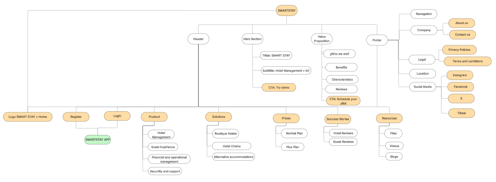

**Link para visualizar mejor:** https://tinyurl.com/3k3wxh3h

En Application Wen, el contenido se distribuye en bloques según su prioridad: primero se accede a través de Login y si aún no se tiene cuenta pasas por Register, en el Login se selecciona el modo de usuario y una vez ingresas te deriva al modo de aplicación según el modo seleccionado. En cada modo se desglosa a través del menú y los botones de herramientas ubicados en la esquina superior.


**Link para visualizar mejor:** https://tinyurl.com/2jjhkz2z

### 4.2.2. Labeling Systems

| Etiqueta           | Ubicación / Componente          | Función                                                                                              |
|--------------------|---------------------------------|------------------------------------------------------------------------------------------------------|
| Home               | Header                          | Enlace a la Landing Page. Claro y universal.                                                         |
| Services           | Header                          | Información sobre los servicios disponibles (alojamiento, limpieza, extras). Directo y comprensible. |
| Bookings           | Header                          | Acceso a la sección de reservas. Término estándar y reconocido.                                      |
| Contact            | Header                          | Formulario de contacto o enlace de correo. Directa y orientada a la acción.                          |
| Sign Up            | Header (botón)                  | Registro de nuevos usuarios. Corto, amigable y visualmente destacado.                                |
| Login              | Header (botón)                  | Inicio de sesión de usuarios. Palabra ampliamente reconocida.                                        |
| Try Demo           | Hero Section (CTA principal)    | Llamada a la acción principal para probar la demo. Imperativo que motiva la interacción.             |
| Benefits           | Hero Section / Sección de valor | Destaca las ventajas de la plataforma. Claro y enfocado al usuario.                                  |
| Testimonials       | Sección de valor                | Muestra opiniones de usuarios. Genera confianza y credibilidad.                                      |
| About              | Footer / Company                | Información institucional sobre Smart Stay. Claro y directo.                                         |
| Privacy Policy     | Footer / Legal                  | Obligatorio por normativa. Etiqueta reconocida internacionalmente.                                   |
| Terms & Conditions | Footer / Legal                  | Complementa la política de privacidad. Estándar legal indispensable.                                 |
| Social Media       | Footer / Navigation             | Agrupa enlaces a redes oficiales. Convencional y reconocible globalmente.                            |
| Smart Stay         | Marca                           | Nombre distintivo de la plataforma. Funciona como ancla visual y semántica.                          |

### 4.2.3. SEO Tags and Meta Tags

Los SEO tags y meta tags son elementos clave dentro de la Landing Page y cualquier página web, porque permiten que los motores de búsqueda comprendan el contenido, mejoren la visibilidad y aumenten la tasa de clics desde resultados de búsqueda. Además, algunas etiquetas influyen directamente en cómo se muestra la página en redes sociales y en navegadores móviles.
La landing page de SmartStay incluye los siguientes SEO/meta tags: charset, viewport, title, description, keywords y favicon. Estos permiten definir la codificación, hacer la página responsive, dar un título y descripción para los buscadores, y mostrar un ícono en la pestaña del navegador.

**Meta charset**

```html
<meta charset="UTF-8">
```

- Define la codificación de caracteres de la página.
- Importante para que los navegadores interpreten correctamente acentos y caracteres especiales.

**Meta viewport**

```html
<meta name="viewport" content="width=device-width, initial-scale=1.0">
```

- Hace que la página sea responsive, ajustando la visualización a distintos dispositivos.

**Tittle**

```html
<title>SmartStay</title>
```

**1. Meta Tags principales**

- charset: Define la codificación de caracteres de la página. UTF-8 es estándar internacional.
- viewport: Hace que la página sea responsive, adaptándose a diferentes tamaños de pantalla.
- description: Breve resumen de la página; es lo que aparece debajo del título en los resultados de búsqueda (SERPs). Muy importante para mejorar el CTR.
- keywords: Lista de palabras clave relevantes para el contenido. Aunque Google ya no las usa directamente, ayudan en SEO interno y organización.
- author: Indica el autor o equipo responsable del sitio.
- robots: Controla cómo los motores de búsqueda indexan la página (index, follow permite que la página sea indexada y los enlaces seguidos).

```html
<meta name="description" content="Smart Stay integra tecnología IoT e inteligencia artificial para optimizar la gestión hotelera. Descubre la revolución en hospitalidad inteligente.">
```

- Ayuda a los buscadores a mostrar un resumen en los resultados de búsqueda.
- Clave para mejorar CTR (click-through rate).

**Meta keywords**

```html
<meta name="keywords" content="Smart Stay, hotel management, IoT, AI, hospitality, smart hotels">
```

- Open Graph (og:): Permiten que la página se vea atractiva al compartirse en Facebook, LinkedIn, WhatsApp y otras plataformas.
- Twitter Cards: Similar a Open Graph, pero optimizado para Twitter. Muestra título, descripción e imagen.

**Author y Favicon**

```html
<meta name="author" content="Smart Stay Team">
```
```html
<link rel="icon" href="images/favicon.ico" type="image/x-icon">
```

- Title: Encabezado principal visible en resultados de búsqueda. Fundamental para atraer clics.
- H1, H2, H3: Encabezados dentro de la página que estructuran el contenido. Mejoran la lectura y el SEO on-page.
- Alt Text: Texto alternativo para imágenes, necesario para accesibilidad y SEO de imágenes.
  -Canonical URL: Indica la URL principal para evitar contenido duplicado y penalizaciones SEO.
  -Schema.org / JSON-LD: Datos estructurados que ayudan a los motores de búsqueda a mostrar rich snippets (calificaciones, eventos, precios).
  -Language: Define el idioma de la página, útil para SEO internacional.
  -Theme-color: Ajusta el color principal en navegadores móviles, mejorando la experiencia del usuario.

### 4.2.4. Searching Systems

El Searching System de Smart Stay permite a los usuarios localizar información, reservas, servicios o productos de manera rápida y eficiente.
En la Landing Page, la búsqueda está orientada a descubrir información general sobre la plataforma, con barra de búsqueda, autocompletado y enlaces directos a secciones clave como “Try Demo” o “Benefits”.
En la Web App, la búsqueda es más funcional y permite filtrar y ordenar datos concretos como huéspedes, reservas y servicios, aplicando autocompletado, filtros dinámicos y persistencia de resultados para mejorar la experiencia del usuario.
El sistema se diseña siguiendo principios de intuitividad, consistencia, visibilidad y escalabilidad, asegurando que los usuarios siempre encuentren lo que buscan de manera rápida y clara.

| Search Type                | Location / Component                  | Function                                                                                                                                               |
|----------------------------|---------------------------------------|--------------------------------------------------------------------------------------------------------------------------------------------------------|
| General Search             | Landing Page / Header                 | Permite buscar información general sobre la plataforma y sus servicios (ej. "services", "demo", "benefits"). Incluye autocompletado y filtros básicos. |
| Try Demo / Benefits Links  | Landing Page / Hero & Value Sections  | Funciona como búsqueda indirecta, guiando al usuario hacia contenido relevante sin necesidad de escribir.                                              |
| Guest / Customer Search    | Web App / Guests Section              | Permite filtrar por nombre, ID, tipo de habitación o fecha de reserva. Facilita gestión de usuarios.                                                   |
| Bookings Search            | Web App / Bookings Section            | Filtrado por fechas, estado de reserva (pendiente, confirmada, cancelada) y tipo de servicio.                                                          |
| Services & Products Search | Web App / Services & Products Section | Filtrado por categoría (limpieza, comida, amenities), disponibilidad y precios.                                                                        |
| Autocomplete               | Web App / All Search Fields           | Sugerencias dinámicas mientras se escribe para acelerar la búsqueda y mejorar experiencia de usuario.                                                  |
| Dynamic Filters            | Web App / All Search Results          | Ajusta los resultados en tiempo real según criterios seleccionados.                                                                                    |
| Sorting                    | Web App / All Search Results          | Permite ordenar resultados por fecha, nombre, prioridad o relevancia.                                                                                  |
| Search Persistence         | Web App / All Sections                | Mantiene los filtros y resultados de búsqueda mientras el usuario navega dentro de la misma sección.                                                   |

### 4.2.5. Navigation Systems

**Landing Page Navigation**

| Navigation Item    | Location / Component         | Function                                                                      |
|--------------------|------------------------------|-------------------------------------------------------------------------------|
| Home               | Header                       | Enlace a la Landing Page. Permite regresar al inicio desde cualquier sección. |
| Services           | Header                       | Acceso rápido a la sección de servicios disponibles.                          |
| Bookings           | Header                       | Permite al usuario gestionar reservas desde cualquier lugar.                  |
| Contact            | Header                       | Enlace al formulario de contacto o correo de soporte.                         |
| Sign Up            | Header (button)              | Registro de nuevos usuarios. Destacado visualmente.                           |
| Login              | Header (button)              | Acceso a la sesión del usuario. Fácil de localizar.                           |
| Try Demo           | Hero Section (CTA principal) | Llamada a la acción principal para probar la demo de Smart Stay.              |
| Benefits           | Hero Section / Value Section | Navegación indirecta hacia los beneficios de la plataforma.                   |
| About              | Footer / Company             | Información institucional sobre Smart Stay. Acceso desde cualquier sección.   |
| Privacy Policy     | Footer / Legal               | Enlace obligatorio por normativa legal.                                       |
| Terms & Conditions | Footer / Legal               | Complementa la política de privacidad.                                        |
| Social Media       | Footer / Navigation          | Acceso a redes oficiales, visibilidad global.                                 |

**Web App Navigation**

| Navigation Item | Location / Component | Function                                                             |
|-----------------|----------------------|----------------------------------------------------------------------|
| Guests          | Sidebar              | Sección principal para gestionar huéspedes o clientes.               |
| Bookings        | Sidebar              | Sección principal para gestionar reservas y su estado.               |
| Services        | Sidebar              | Sección principal para gestionar servicios disponibles.              |
| Products        | Sidebar              | Sección para visualizar y administrar productos asociados.           |
| Profile         | Top Bar              | Acceso a perfil de usuario, configuración y notificaciones.          |
| Notifications   | Top Bar              | Acceso rápido a alertas y mensajes importantes.                      |
| Breadcrumbs     | Optional             | Indica la ruta de navegación y permite regresar a secciones previas. |

## 4.3. Landing Page UI Design

**Landing Page Navigation**

| Navigation Item    | Location / Component         | Function                                                                      |
|--------------------|------------------------------|-------------------------------------------------------------------------------|
| Home               | Header                       | Enlace a la Landing Page. Permite regresar al inicio desde cualquier sección. |
| Services           | Header                       | Acceso rápido a la sección de servicios disponibles.                          |
| Bookings           | Header                       | Permite al usuario gestionar reservas desde cualquier lugar.                  |
| Contact            | Header                       | Enlace al formulario de contacto o correo de soporte.                         |
| Sign Up            | Header (button)              | Registro de nuevos usuarios. Destacado visualmente.                           |
| Login              | Header (button)              | Acceso a la sesión del usuario. Fácil de localizar.                           |
| Try Demo           | Hero Section (CTA principal) | Llamada a la acción principal para probar la demo de Smart Stay.              |
| Benefits           | Hero Section / Value Section | Navegación indirecta hacia los beneficios de la plataforma.                   |
| About              | Footer / Company             | Información institucional sobre Smart Stay. Acceso desde cualquier sección.   |
| Privacy Policy     | Footer / Legal               | Enlace obligatorio por normativa legal.                                       |
| Terms & Conditions | Footer / Legal               | Complementa la política de privacidad.                                        |
| Social Media       | Footer / Navigation          | Acceso a redes oficiales, visibilidad global.                                 |

**Web App Navigation**

| Navigation Item | Location / Component | Function                                                             |
|-----------------|----------------------|----------------------------------------------------------------------|
| Guests          | Sidebar              | Sección principal para gestionar huéspedes o clientes.               |
| Bookings        | Sidebar              | Sección principal para gestionar reservas y su estado.               |
| Services        | Sidebar              | Sección principal para gestionar servicios disponibles.              |
| Products        | Sidebar              | Sección para visualizar y administrar productos asociados.           |
| Profile         | Top Bar              | Acceso a perfil de usuario, configuración y notificaciones.          |
| Notifications   | Top Bar              | Acceso rápido a alertas y mensajes importantes.                      |
| Breadcrumbs     | Optional             | Indica la ruta de navegación y permite regresar a secciones previas. |

## 4.3. Landing Page UI Design
### 4.3.1. Landing Page Wireframe

Los wireframes representan la primera aproximación al diseño de la interfaz de Smart Stay.  
Se han desarrollado en formato blanco y negro, sin imágenes ni estilos gráficos, para enfocarse únicamente en la estructura, disposición de los elementos y flujo de navegación.

El objetivo de estos wireframes es:
- Establecer la arquitectura de información de la plataforma.
- Definir la jerarquía de contenidos en cada sección.
- Validar la navegación y experiencia de usuario antes de pasar al diseño visual (mockups).

A continuación, se presenta un resumen de cada una de las secciones.

**1. Home**
- **Propósito:** Página principal de presentación de Smart Stay.  
- **Elementos clave:**  
  - Encabezado con menú de navegación.  
  - Hero con nombre de la plataforma y botón de llamada a la acción (*CTA: Probar demo*).  
  - Sección "¿Quiénes somos?" con breve descripción.  
  - Bloques de beneficios y características principales.  
  - Footer con enlaces de contacto, políticas y redes sociales.


**2. Productos**
- **Propósito:** Mostrar los productos y módulos de la plataforma.  
- **Elementos clave:**  
  - Lista de funcionalidades divididas en áreas: gestión hotelera, experiencia del huésped, reportes, seguridad.  
  - Descripción breve de cada módulo.  
  - Botón de descarga de brochure.

  

**3. Soluciones**
- **Propósito:** Explicar cómo Smart Stay se adapta a diferentes tipos de hoteles.  
- **Elementos clave:**  
  - Sección para hoteles boutique.  
  - Sección para alojamientos alternativos.  
  - Sección para cadenas hoteleras.  
  - Botón para descargar información detallada.

  


**4. Precios**
- **Propósito:** Detallar planes y costos de la plataforma.  
- **Elementos clave:**  
  - Tabla comparativa de funcionalidades entre Plan Normal y Plan Plus.  
  - Categorías claras: gestión hotelera, experiencia huésped, seguridad, soporte.


**5. Casos de Éxito**
- **Propósito:** Mostrar testimonios y ejemplos de hoteles que ya usan Smart Stay.  
- **Elementos clave:**  
  - Bloques con testimonios de clientes.  
  - Descripción breve de resultados obtenidos (ahorro de tiempo, mejora de experiencia, reducción de costos).

    

**6. Recursos**
- **Propósito:** Repositorio de materiales de apoyo y aprendizaje.  
- **Elementos clave:**  
  - Documentos descargables (guías, whitepapers, brochures).  
  - Links de blogs.  


**7. Registro**
- **Propósito:** Permitir que un nuevo usuario cree su cuenta.  
- **Elementos clave:**  
  - Formulario de registro con campos básicos (nombre, correo, contraseña, tipo de empresa).  
  - Botón de registro.  


**8. Login**
- **Propósito:** Acceso de usuarios ya registrados.  
- **Elementos clave:**  
  - Formulario de inicio de sesión con correo y contraseña.  
  - Botón de acceso.  
  - Enlace a recuperación de contraseña y a registro.


Los wireframes definen la base de navegación de Smart Stay, asegurando que cada sección tenga un propósito claro:
- **Home:** captar atención y presentar la plataforma.
- **Productos, Soluciones, Precios:** comunicar valor y opciones.
- **Casos de Éxito, Recursos:** generar confianza y soporte.
- **Registro y Login:** habilitar el acceso a la app.


### 4.3.2. Landing Page Mock-up

Tras la validación de los wireframes, se desarrollaron los mockups de alta fidelidad de Smart Stay.  
Estos mockups ya incorporan la identidad visual definida (colores, tipografía, logotipo e imágenes), con el objetivo de reflejar la experiencia final que tendrán los usuarios en la plataforma.

Su propósito es:
- Validar la usabilidad con un diseño más realista.
- Asegurar la coherencia con la guía de estilos definida.
- Proyectar cómo se verá cada sección en un entorno final.

**1. Landing Page**
- **Cambios respecto al wireframe:**  
  - Se añadió el logotipo de Smart Stay en el header.  
  - Paleta de colores aplicada (azul corporativo + tonos complementarios).  
  - Imagen de fondo en el Hero con llamada a la acción resaltada (“Probar demo”).  
  - Iconografía personalizada para los beneficios.  


**2. Productos**
-**Cambios respecto al wireframe:**  
  - Uso de íconos y colores diferenciados por módulo (gestión, experiencia huésped, seguridad, reportes).  
  - Inclusión de imágenes ilustrativas.  
  - Botón de descarga estilizado con colores de la marca.  


**3. Soluciones**
- **Cambios respecto al wireframe:**  
  - Bloques visuales para cada tipo de cliente (hoteles boutique, alojamientos alternativos, cadenas).  
  - Uso de fotografías representativas de hoteles.  
  - CTA destacado.


**4. Precios**
- **Cambios respecto al wireframe:**  
  - Tabla de precios con colores diferenciadores por plan.  
  - Plan recomendado resaltado con un fondo destacado. 

  

**5. Casos de Éxito**
- **Cambios respecto al wireframe:**  
  - Testimonios acompañados de logos reales de hoteles.


**6. Recursos**
- **Cambios respecto al wireframe:**  
  - Secciones de miniaturas de documentos descargables.  
  - Secciones de blog con botón de visitar página externa.


**7. Registro**
- **Cambios respecto al wireframe:**  
  - Formulario minimalista con campos estilizados.  
  - Botón de “Enviar y registrar” resaltado en color primario.  
  - Fondo con imagen ligera para dar contexto al servicio.

  

**8. Login**
- **Cambios respecto al wireframe:**  
  - Formulario ubicado a lateral izquierdo en pantalla con diseño limpio.  
  - Logo al lado derecho de la pantalla.  
  - Enlaces secundarios estilizados para “¿Olvidaste tu contraseña?”. 


Los mockups consolidan el diseño visual final de Smart Stay, transformando la estructura básica de los wireframes en interfaces listas para evaluación estética y funcional.


## 4.4. Web Applications UX/UI Design

En esta sección de Web Applications UX/UI Design ya nos enfocamos en el diseño de la interfaz y la experiencia de usuario de nuestro explicativo el cual se menciona e informa en el landing page, cabe resaltar que el el aplicativo es difernte según el rol que forman parte de la solución digital: administrador, staff y huéspedpor lo que su funcionamiento es distinto. Aquí se visualizará el prototipo de cada app y a su vez se presentará en la forma más práctica según su rol, formato desktop para administrados y formato móvil para staff y huésped, aunque los tres cuentan con diseño responsive por lo que se puede usar de cualquier dispositivo móvil.

### 4.4.1. Web Applications Wireframes

**Wireframes – Modo Administrador**


Los wireframes del **modo Administrador** representan la primera aproximación al diseño de la interfaz de esta vista de la aplicación.  
Se han elaborado en formato blanco y negro, sin imágenes ni estilos gráficos, con el objetivo de centrarse en la estructura, navegación y jerarquía de la información que manejará el administrador.

A continuación, se presenta un resumen de cada una de las secciones principales del modo Administrador.

**1. Dashboard**

**Propósito:** Vista general del estado de la plataforma.  
**Elementos clave:**
- Panel con métricas principales (usuarios activos, reportes recientes, accesos).
- Gráficas de estadísticas generales.
- Acceso rápido a notificaciones.

**2. Guests**

**Propósito:** Control y administración de los perfiles que usan la plataforma.  
**Elementos clave:**
- Lista de usuarios con buscador y filtros.
- Botón para agregar, editar o eliminar usuarios.
- Tabla con información básica (nombre, correo, rol, estado).


**3. Staff**

**Propósito:** Definir los niveles de acceso de cada tipo de usuario.  
**Elementos clave:**
- Tabla de roles existentes.
- Información y datos del staff con el que trabaja.

**4. Hotels and rooms**  
**Propósito:** Gestión de la cadena hotelera administrada en la plataforma.  
**Elementos clave:**
- Lista de hoteles con buscador y filtros (ciudad, estado, categoría).
- Detalle del hotel seleccionado (información general, servicios, estadísticas).
- Campo para ingresar número de habitación y botón *Ver detalle*.
- Vista de detalle de habitación con estado, tipo, huésped actual, check-in/out y acciones rápidas.


**5. Booking**

**Propósito:** Control y gestión de todas las reservas realizadas en los hoteles.  
**Elementos clave:**
- Calendario interactivo para visualizar y administrar reservas por día, semana o mes.
- Lista de reservas con buscador y filtros (hotel, fecha, estado).
- Detalle de la reserva (huésped, habitación, fechas, monto).
- Botones para modificar, confirmar o cancelar reservas.
- Indicadores de ocupación y disponibilidad directamente desde el calendario.

**6. Payments**

**Propósito:** Administración de ingresos y egresos financieros en la plataforma.  
**Elementos clave:**
- Registro de pagos recibidos de huéspedes y clientes.
- Registro de egresos: pagos a staff, proveedores y compras de stock.
- Tablas y filtros por fecha, hotel, método de pago y categoría.
- Reportes de gastos, ingresos y ganancias.
- Gráficos comparativos y dashboard financiero.


**7. Sevices and Products**

**Propósito:** Gestión integral de servicios y dispositivos tecnológicos de Smart Stay.  
**Elementos clave:**
- Tabla general con categorías: limpieza, alimentos, tecnología, amenities.
- Columnas: nombre, categoría, estado, stock, ubicación, proveedor.
- Filtros por hotel, piso, habitación y categoría.
- Vista de detalle de cada producto con historial, estado y mantenimiento.

**8. Reviews**

**Propósito:** Seguimiento de la experiencia de los huéspedes y tickets de soporte.  
**Elementos clave:**
- Lista de comentarios y calificaciones por hotel y servicio.
- Filtros por fecha, hotel, tipo de reseña o ticket.
- Vista de detalle con respuesta del staff.
- Estadísticas de satisfacción y gráficos de tendencias.
- Panel de tickets: abiertos, en proceso, cerrados.  
  

**9. Support**

**Propósito:** Gestión de los tickets creados por los hoteles y usuarios hacia Smart Stay.  
**Elementos clave:**
- Lista de tickets recibidos desde los hoteles o usuarios.
- Clasificación por prioridad (alta, media, baja) y estado (pendiente, en proceso, resuelto).
- Filtros por hotel, tipo de problema y fecha.
- Vista de detalle del ticket con historial de comunicación.
- Historial de ticket.
  

**Wireframes – Modo Huésped**

Los wireframes del modo Huésped representan la primera aproximación al diseño de la interfaz de esta vista de la aplicación huesped, el cual ellos ingresanpor un codigo qr que el hotel les brinda para de frente acceder al app huesped.  
Se han elaborado en formato blanco y negro, sin imágenes ni estilos gráficos, con el objetivo de centrarse en la estructura, navegación y jerarquía de la información que manejará el huésped.

**1. Welcome View**

- Solo es una introducción por lo que aparece el logo y un saludo.

**2. Home**
**Propósito:** Pantalla principal con acceso a las funciones más utilizadas.  
**Elementos clave:**
- Barra superior con logo y buscador.
- Banner de bienvenida.
- Acceso rápido a habitaciones, servicios y notificaciones.
- Sección de ofertas o promociones destacadas.

**3. Rooms**
**Propósito:** Explorar y seleccionar opciones de hospedaje.  
**Elementos clave:**
- Información básica (número y estado de habitación).
- Controles de ambiente: temperatura, luces, cortinas, TV, música.
- Servicios rápidos: limpieza inmediata o programada, amenities, minibar digital.
- Botón de asistencia y emergencia.  
  

**4. Services**
**Propósito:** Acceder a servicios adicionales ofrecidos por el hotel.  
**Elementos clave:**
- Categorías de servicios (gimnasio, parking, restaurante, eventos).

**5. Map**
**Propósito:** Orientar al huésped dentro del hotel y ofrecer rutas y descubrimientos locales.  
**Elementos clave:**
- Mapa interactivo del hotel con puntos de interés (piscina, gimnasio, restaurantes, lobby, salones).
- Indicación de la ubicación de la habitación del huésped y rutas internas (wayfinding) hacia cualquier punto.
- Opciones de búsqueda y filtros (por tipo de servicio, accesibilidad, horarios).

**6. Profile**
**Propósito:** Gestionar los datos del huésped.  
**Elementos clave:**
- Información personal (nombre, correo, teléfono).
- Preferencias de pago y métodos guardados.

**7. Notifications**
**Propósito:** Informar al huésped sobre novedades y recordatorios.  
**Elementos clave:**
- Lista de notificaciones recientes (confirmaciones de reserva, promociones, mensajes del hotel).
- Botón para marcar como leídas o eliminar notificaciones.  
  

**Wireframes – Modo Staff**

Los wireframes del modo Staff representan la primera aproximación al diseño de la interfaz de esta vista de la aplicación.  
Se han elaborado en formato blanco y negro, sin imágenes ni estilos gráficos, con el objetivo de centrarse en la estructura, navegación y jerarquía de la información que manejará el personal del hotel.

**1. Introduction**
**Propósito:** Pantalla inicial de bienvenida y presentación de la app Staff.  
**Elementos clave:**
- Logo.
- Breve mensaje de bienvenida.

**2. Login**
**Propósito:** Autenticar al personal del hotel para acceder a la app.  
**Elementos clave:**
- Campos de correo electrónico y contraseña.
- Botón de Iniciar Sesión.
- Opción de Recuperar contraseña.

**3. Home / Dashboard**
**Propósito:** Pantalla principal con resumen de tareas y registro de horas.  
**Elementos clave:**
- Registro de horas: botones para marcar Entrada, Receso y Salida.
- Tabla de historial diario de horas trabajadas.
- Lista resumida de tareas del día con estado (pendiente/completado).

**4. Tasks**
**Propósito:** Gestionar todas las tareas asignadas al staff.  
**Elementos clave:**
- Lista completa de tareas diarias con habitación, tipo de tarea, piso.
- Estado de tarea con emoticonos: ✅ Completado / ❌ Pendiente.     
  

**5. Services / Products**
**Propósito:** Registrar entrega de servicios y productos a habitaciones.  
**Elementos clave:**
- Lista de servicios/productos por entregar (Room Service, Mini Bar, Amenities, etc.).
- Cantidad y habitación correspondiente.
- Estado de entrega con emoticonos: ✅ Entregado / ❌ Pendiente.

**6. Booking**
**Propósito:** Consultar y gestionar reservas asignadas al staff.  
**Elementos clave:**
- Sección de búsqueda de cliente.
- Lista de reservas con habitación, huésped, fecha, estado de check-in/check-out.
- Semáforo de estados: 🔴 Pendiente / 🟢 Completado.

**7. Profile**
**Propósito:** Gestionar la información personal del staff y las preferencias de la app.  
**Elementos clave:**
- Foto y datos personales (nombre, correo, teléfono).
- Cambiar contraseña, editar y cerrar sesión.

**8. Notifications**
**Propósito:** Informar al staff sobre novedades, cambios de tareas o alertas importantes.  
**Elementos clave:**
- Lista de notificaciones recientes (cambios de turno, emergencias, avisos de tareas).
- Botón para marcar como leído o eliminar notificaciones.  
  .

### 4.4.2. Web Applications Wireflow Diagrams

**Web Applications Wireflow Diagrams – Modo Administrador**

**Propósito:**  
Mostrar cómo cada sección del administrador se conecta a través del menú principal.


**Menú Principal (Administrador)**

Desde cualquier sección, el menú permite acceder a:

1. **Intro** - Pantalla de inicio a app Adminstrator luego de iniciar sesión.
2. **Dashboard** – Resumen general de actividad, métricas y gráficos.
3. **Guests** – Gestión de perfiles de usuarios; agregar, editar o eliminar.
4. **Staff** – Gestión del personal; roles, turnos y contacto.
5. **Hotels / Rooms** – Administración de hoteles, habitaciones y disponibilidad.
6. **Booking** – Calendario de reservas; agregar, modificar o cancelar reservas.
7. **Payments** – Visualización y gestión de transacciones y estados de pago.
8. **Services / Productos** – Gestión de servicios del hotel y productos adicionales.
9. **Reviews** – Panel de comentarios de huéspedes con gráficos de satisfacción.
10. **Support / Tickets** – Crear tickets de ayuda y consultar su estado.

**Flujo General (Wireflow)**

- **Dashboard**: centro de información y acceso rápido a secciones principales por botones. En los gráficos de ganancia y pérdidas el botón "See Reviews" te deriva **Reviews** y en los gráficos porcentual de habitaciones ocupadas el botón "check Booking" te deriva a **Booking**.
- **Menú Bar**: conecta directamente a las 9 secciones.
- Secciones interrelacionadas:
    - **Staff, Guests, Hotels** se conecta con **Reviews** ya que allí se derivan los comentarios sobre el staff huésped y el hotel.
    - **Booking** se relaciona con **Guests** para ver los clientes de cada reserva hecha.

**Web Applications Wireflow Diagrams – Modo Huésped**

**Propósito:**  
Mostrar cómo cada sección de la app para huéspedes se conecta a través del menú principal y elementos persistentes (como el icono de notificaciones).


**Secciones Principales**

1. **Intro** – Pantalla inicial, solo se conecta a **Home**.
2. **Home** – Vista principal; acceso a todas las secciones mediante el menú.
3. **Rooms** – Detalles de la habitación asignada o disponible; acceso desde el menú.
4. **Services** – Servicios del hotel disponibles para el huésped; acceso desde el menú.
5. **Map** – Ubicación del hotel, puntos de interés; acceso desde el menú.
6. **Profile** – Datos del huésped, preferencias y configuración; acceso desde el menú.
7. **Notifications** – Alertas y mensajes importantes; acceso mediante un icono persistente arriba, visible desde todas las secciones.

**Flujo General (Wireflow)**

- **Intro** → **Home**
- **Home** → conecta a **Rooms**, **Services**, **Map**, **Profile** mediante el menú principal.
- **Notifications** → accesibles desde cualquier sección a través del icono superior.

**Web Applications Wireflow Diagrams – Modo Staff**

**Propósito:**  
Mostrar cómo cada sección de la app para staff se conecta a través del menú principal y elementos persistentes (como el icono de notificaciones).


**Secciones Principales**

1. **Intro** – Pantalla inicial, conecta al **Login**.
2. **Login** – Pantalla de acceso; una vez autenticado, va a **Home**. Para ellos siempre es necesario que hagan login por el uso continuo del app a diferencia del huésped que solo tienen acceso durante su estadía.
3. **Home** – Vista principal; acceso a todas las secciones mediante el menú.
4. **Tasks** – Lista y gestión de tareas asignadas; acceso desde el menú.
5. **Services** – Gestión de servicios ofrecidos por el staff; acceso desde el menú.
6. **Booking** – Visualización de reservas relacionadas con el staff; acceso desde el menú.
7. **Profile** – Datos del staff y configuración personal; acceso desde el menú.
8. **Notifications** – Alertas y mensajes importantes; accesibles mediante un icono persistente que aparece en todas las secciones.

**Flujo General (Wireflow)**

- **Intro** → **Login** → **Home**
- Desde **Home** se puede acceder mediante el menú a: **Tasks**, **Services**, **Booking**, **Profile**
- **Notifications** → accesibles desde cualquier sección a través del icono superior.

### 4.4.3. Web Applications Mock-ups

**Mockups – Modo Administrador**

Los mockups muestran la interfaz final del administrador de SmartStay, incluyendo **colores, tipografía, iconos, imágenes y logos**, reflejando la identidad visual de la plataforma.

**1. Dashboard**
- Paleta de colores corporativa aplicada a gráficos y métricas.
- Gráficos circulares y de barras con animaciones.
- Iconos para alertas, reservas y notificaciones.
- Ilustraciones o imágenes para resaltar métricas clave.

**2. Huéspedes**
- Tarjetas visuales para cada huésped con foto, nombre y estado.
- Botones coloreados según función (agregar: verde, eliminar: rojo).
- Filtros y buscador estilizados con iconos.

**3. Staff**
- Tabla con fotos de perfil, roles y horarios.
- Indicadores de estado con colores o iconos.
- Botones consistentes con la paleta de SmartStay.

**4. Hoteles**
- Cards con imagen del hotel o miniaturas.
- Indicadores visuales de ocupación y disponibilidad.
- Botones de acción con efectos hover.

**5. Reservas**
- Calendario visual con colores según estado (confirmada, pendiente, cancelada).
- Tarjetas de reserva con foto del huésped y detalles.
- Botones destacados para aprobar, modificar o cancelar.

**6. Pagos**
- Tabla con iconos de métodos de pago (tarjeta, Yape, Plin).
- Resaltado de pagos pendientes con color.
- Botones para generar facturas con efectos visuales.

**7. Servicios y Productos**
- Cards o listas con imágenes de productos y servicios.
- Indicadores de disponibilidad con colores y símbolos.
- Botones con iconos para editar, eliminar o agregar.

**8. Reseñas**
- Panel con estrellas de puntuación y colores según valoración.
- Tarjetas de comentarios con avatar del huésped y fecha.
- Gráficos visuales de satisfacción general.

**9. Soporte**
- Tabla de tickets con colores según estado (pendiente, en proceso, finalizado).
- Formulario visual con iconos y campos destacados.
- Botones de acción consistentes con la paleta.

**Elementos generales**
- Logo de SmartStay visible en header o menú lateral.
- Paleta de colores corporativa aplicada a fondos, botones y textos.
- Tipografía uniforme que diferencia títulos, subtítulos y contenido.
- Iconografía consistente para acciones, estados y navegación.
- Feedback visual en botones e interacciones (hover, clic, activo).


**Mockups – Modo Huésped**

Los mockups muestran la interfaz final del usuario huésped en SmartStay, incluyendo **colores, tipografía, iconos, imágenes y logos**, reflejando la identidad visual y la experiencia de usuario.

**1. Introducción**
- Pantalla de bienvenida con **logo y colores corporativos**.
- **Imágenes o ilustraciones atractivas** para la experiencia inicial.
- Botón destacado para comenzar y acceder a Home.

**2. Home**
- Panel con **resumen de reservas y notificaciones recientes**.
- Cards visuales para acceder a habitaciones, servicios y mapa.
- **Botones e iconos claros** para navegación rápida.

**3. Habitación**
- Tarjetas con fotos de la habitación y detalles (tipo, servicios incluidos, disponibilidad).
- Indicadores visuales de estado de limpieza o check-in/check-out.
- Botones para solicitar servicio o hacer reservas adicionales.

**4. Servicios**
- Lista o cards de servicios disponibles (spa, lavandería, comida, etc.) con imágenes.
- Indicadores de disponibilidad y precios.
- Botones para solicitar o reservar servicios fácilmente.

**5. Mapa**
- Mapa interactivo con **ubicación del hotel, habitaciones y servicios cercanos**.
- Iconos para puntos de interés y rutas dentro del hotel.
- Colores y estilo consistente con la identidad visual.


**6. Perfil**
- Información personal del huésped con **foto y datos básicos**.
- Botones para editar información o preferencias.
- Indicadores de estado de membresía o historial de reservas.

**7. Notificaciones**
- Lista de notificaciones recientes con **iconos y colores según tipo** (alerta, mensaje, promoción).
- Botones para marcar como leído o eliminar.
- Diseño consistente con la paleta y tipografía de la app.

**Elementos generales**
- Logo de SmartStay visible en header o menú.
- Paleta de colores corporativa aplicada a fondos, botones y textos.
- Tipografía uniforme que diferencia títulos, subtítulos y contenido.
- Iconografía consistente para acciones, estados y navegación.
- Feedback visual en botones e interacciones (hover, clic, activo).


**Mockups – Modo Staff**

Los mockups muestran la interfaz final del personal de SmartStay, incluyendo **colores, tipografía, iconos, imágenes y logos**, reflejando la identidad visual y la experiencia de usuario para el staff.

**1. Introducción**
- Pantalla de bienvenida con **logo y colores corporativos**.
- **Ilustraciones o imágenes** que reflejan la experiencia inicial.
- Botón destacado para avanzar al login.

**2. Login**
- Formulario con **campos destacados** para correo y contraseña.
- Botón principal con **color corporativo** para iniciar sesión.
- Iconos de seguridad y feedback visual al ingresar datos incorrectos.

**3. Home**
- Panel con **resumen de tareas, reservas y notificaciones recientes**.
- Cards visuales para acceder a tareas, servicios, reservas y perfil.
- Botones e iconos claros para navegación rápida.

**4. Tareas**
- Lista o cards de tareas asignadas con **estado visual** (pendiente, en proceso, finalizado).
- Botones para marcar tareas completadas o reasignar.
- Indicadores de prioridad con colores y símbolos.

**5. Servicios**
- Lista de servicios a realizar o supervisar, con **imágenes o iconos representativos**.
- Indicadores de estado y disponibilidad.
- Botones para actualizar estado o registrar finalización.

**6. Reservas**
- Calendario visual mostrando reservas asignadas al staff.
- Tarjetas de reserva con detalles resumidos y foto del huésped.
- Botones para confirmar asistencia o marcar tareas relacionadas a la reserva.

**7. Perfil**
- Información personal del staff con **foto, rol y datos de contacto**.
- Botones para editar información y configurar preferencias.
- Indicadores de estado activo/inactivo.

**8. Notificaciones**
- Lista de notificaciones recientes con **iconos y colores según tipo** (alerta, mensaje, aviso).
- Botones para marcar como leído o eliminar.
- Diseño consistente con la paleta y tipografía de la app.

**Elementos generales**
- Logo de SmartStay visible en header o menú.
- Paleta de colores corporativa aplicada a fondos, botones y textos.
- Tipografía uniforme que diferencia títulos, subtítulos y contenido.
- Iconografía consistente para acciones, estados y navegación.
- Feedback visual en botones e interacciones (hover, clic, activo).


### 4.4.4. Web Applications User Flow Diagrams

**Rol 1:** Administrador del hotel
**Objetivo:** Gestionar la operación completa del hotel mediante el panel central.


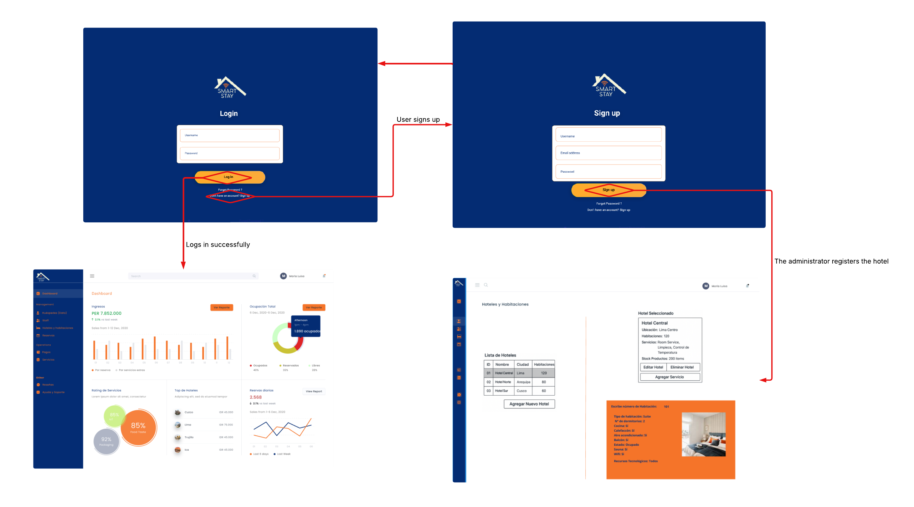

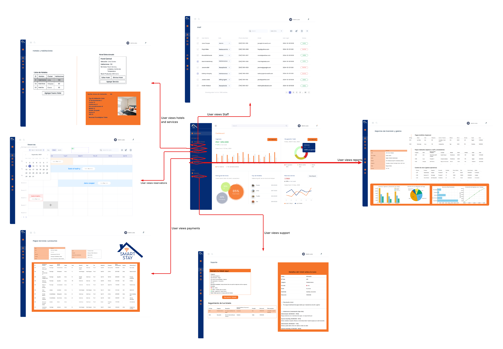


**Flujo del usuario:**
- **Login** – acceso con credenciales.
- **Intro** – pantalla inicial después del login.
- **Dashboard** – visualización general de métricas y accesos rápidos.
- Desde **Dashboard**, el usuario puede navegar a:
  - **Guests** – administrar huéspedes.
  - **Staff** – gestionar personal y turnos.
  - **Hotels / Rooms** – administrar hoteles y disponibilidad.
  - **Booking** – gestionar reservas.
  - **Payments** – revisar transacciones y estados de pago.
  - **Services / Productos** – configurar servicios adicionales.
  - **Reviews** – visualizar comentarios de huéspedes y métricas de satisfacción.
  - **Support / Tickets** – gestionar incidencias internas.
- **Accesos contextuales dentro del Dashboard:**
  - **See Reviews** – botón que lleva directamente a **Reviews**.
  - **Check Booking** – botón que lleva directamente a **Booking**.
- **Relación entre secciones:**
  - **Booking** se conecta con **Guests** para ver clientes de cada reserva.
  - **Reviews** se conecta con **Guests**, **Staff**, y **Hotels** para evaluar desempeño.
- **Logout** – el administrador puede cerrar sesión desde cualquier pantalla.


**Rol 2:** Huésped del hotel

**Objetivo:** Facilitar la navegación del huésped y el acceso a servicios del hotel durante su estadía.

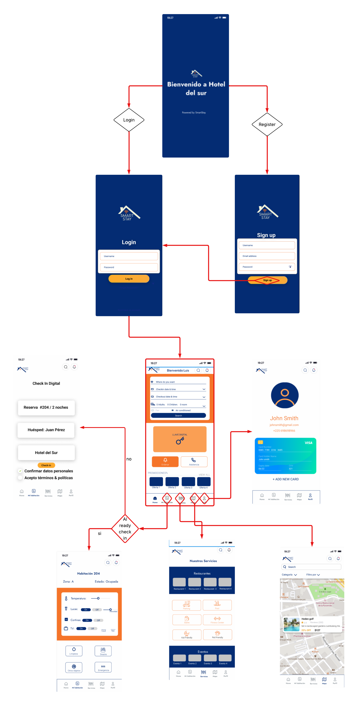


**Flujo del usuario:**
- **Intro** – pantalla inicial previa al acceso.
- **Home** – acceso principal después de validar reserva o QR.
- Desde **Home**, mediante el menú, se puede acceder a:
  - **Rooms** – detalles de la habitación asignada.
  - **Services** – solicitud de servicios internos del hotel.
  - **Map** – ubicación, rutas e información útil.
  - **Profile** – datos personales, preferencias y pagos.
- **Notifications** – acceso persistente mediante icono superior visible desde cualquier pantalla.
- **Logout** – cierre de sesión automático en checkout o manual.


**Rol 3:** Personal del hotel (staff)

**Objetivo:** Gestionar tareas asignadas, reservas asociadas y comunicación interna del personal.

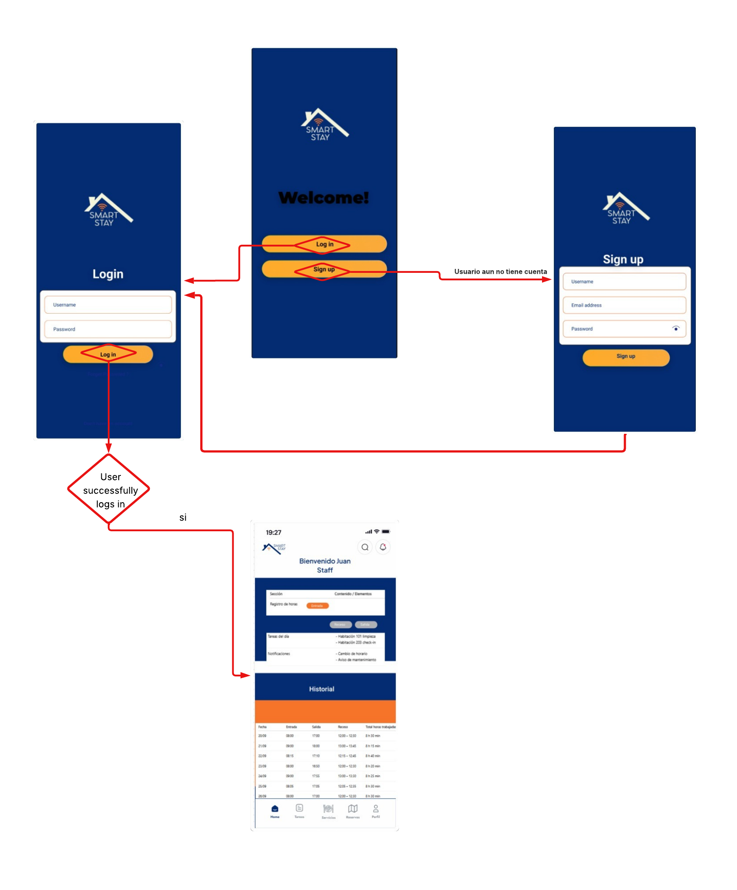
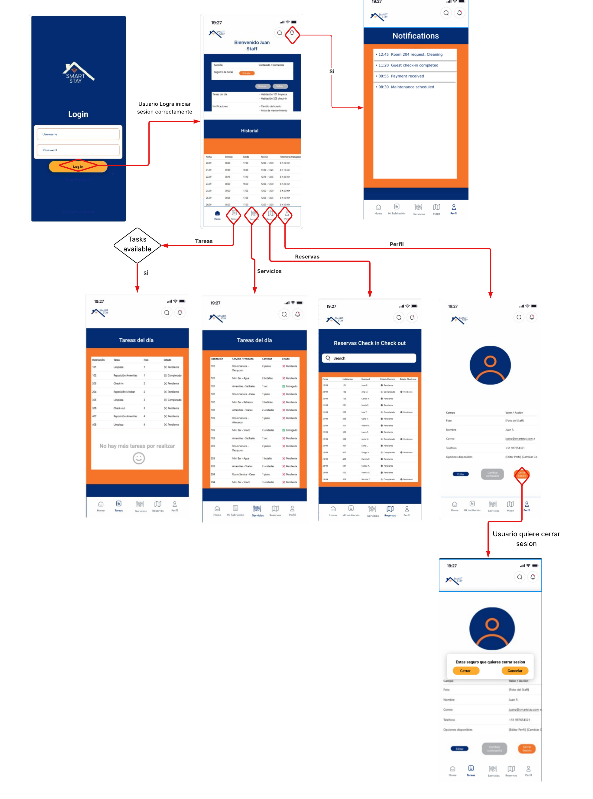


**Flujo del usuario:**
- **Intro** – pantalla inicial.
- **Login** – acceso obligatorio para control de actividad.
- **Home** – vista principal luego de la autenticación.
- Desde **Home**, mediante menú, se puede acceder a:
  - **Tasks** – lista de tareas asignadas y control de progreso.
  - **Services** – registro y reporte de servicios realizados.
  - **Booking** – revisión de reservas vinculadas al área de trabajo.
  - **Profile** – datos personales y horarios.
- **Notifications** – icono persistente accesible desde todas las pantallas.
- **Logout** – finalización de sesión al terminar turno.

## 4.5. Web Applications Prototyping

El prototipo permite simular la navegación entre todas las secciones principales mediante **carga dinámica de contenido**, mostrando cómo el administrador se moverá a través de los caminos definidos en los **User Flow Diagrams**, asegurando fluidez y coherencia en la experiencia de usuario.
En este caso presentaremos el prototipo del app principal que es del modo administrador:
https://tinyurl.com/372nrrbv

## 4.6. Domain-Driven Software Architecture

### 4.6.1. Design-Level EventStorming
**Legend of terminologies:**


**Step 1: Unstructured Exploration:**

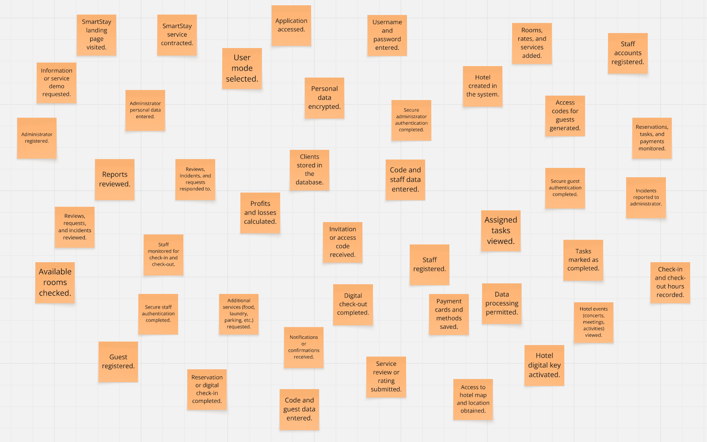

**Step 2: Timelines:**


**Step 3: Paint Points:**


**Step 4: Pivotal Points:**


**Step 5: Commands:**


**Step 6: Policies:**


**Step 7: Read models:**


**Step 8: External Systems:**


**Step 9: Aggregates:**


**Step 10: Bounded Contexts:**


**Link para visualizar mejor:** https://tinyurl.com/8529395x


### 4.6.2. Software Architecture Context Diagram


### 4.6.3. Software Architecture Container Diagrams


### 4.6.4. Software Architecture Components Diagrams


## 4.7. Software Object-Oriented Design

### 4.7.1. Class Diagrams
Diagrama de Clases: Componente de Autenticación


Este diagrama detalla las clases responsables de la gestión de la identidad y el acceso en el sistema. Incluye la jerarquía de User con sus roles especializados (Guest, Host, HotelStaff), el AuthService que contiene la lógica de negocio para el registro y la autenticación, y la interfaz IUserRepository para la persistencia de datos de usuario.

Diagrama de Clases: Componente de Gestión de Propiedades y Operaciones


Este diagrama muestra el diseño de clases para la gestión del inventario y las operaciones del hotel. Incluye las entidades Property y Room, que representan los activos físicos, y el PropertyService que maneja su estado y disponibilidad. Es importante destacar que este componente también actúa como el origen de los comandos de IoT, utilizando la interfaz IIoTCommandPublisher para iniciar acciones en el mundo físico.

Diagrama de Clases: Componente de Gestión de Reservas


Este diagrama presenta el diseño de clases para el componente central de reservas. Muestra las entidades de dominio Booking y Review, y el BookingService que actúa como orquestador. Este servicio interactúa con otros componentes a través de adaptadores (IPropertyServiceAdapter, IBillingServiceAdapter) para verificar disponibilidad y procesar pagos, gestionando así el flujo completo de una reserva.

Diagrama de Clases: Componente de Facturación


Este diagrama ilustra la estructura interna del componente de facturación. Se definen las entidades Payment e Invoice, el servicio BillingService que orquesta el proceso de pago, y los adaptadores (IPaymentGatewayAdapter, IAuthServiceAdapter) que se comunican con sistemas externos y otros componentes internos para garantizar transacciones seguras y autorizadas.

Diagrama de Clases: Componente Gateway IoT


Este diagrama detalla la arquitectura interna del componente técnico Gateway IoT. Su diseño se basa en un flujo de procesamiento de mensajes para desacoplar la lógica de negocio del hardware: un MessageListener recibe órdenes, un RulesEngine las interpreta, IDeviceController las especializa, y un ICloudApiClient se comunica con la plataforma externa del fabricante. Este patrón abstrae la complejidad de la integración con dispositivos físicos.

## 4.8. Database Design

Las decisiones clave tomadas, basadas directamente en nuestros diagramas de clases:

Traducción de Clases a Tablas: Cada clase de entidad (aquellas que guardan datos, como User, Property, Booking) se convierte en una tabla. Las clases de servicio e interfaces (AuthService, IUserRepository, etc.) no se convierten en tablas porque representan comportamiento, no datos.

Componentes sin Persistencia: Los componentes puramente técnicos como el Gateway IoT (MessageListener, RulesEngine, etc.) manejan datos en tránsito (mensajes, comandos) y no requieren persistencia en la base de datos relacional. Por lo tanto, no tienen tablas asociadas.

Nomenclatura: Se utiliza snake_case (ej: check_in_date) para nombres de tablas y columnas, una convención estándar en bases de datos.

Manejo de Herencia: La jerarquía de User se implementa con la estrategia "Tabla por Subclase" para máxima claridad y normalización.

Tipos de Datos ENUM: Los diferentes estados (BookingStatus, RoomStatus, etc.) se definen como tipos ENUM para garantizar la integridad de los datos.

Relaciones: Todas las asociaciones y composiciones en los diagramas de clases se implementan usando claves foráneas (FOREIGN KEY) con sus respectivas restricciones de multiplicidad (ej: UNIQUE para relaciones uno a uno).

### 4.8.1. Database Diagrams

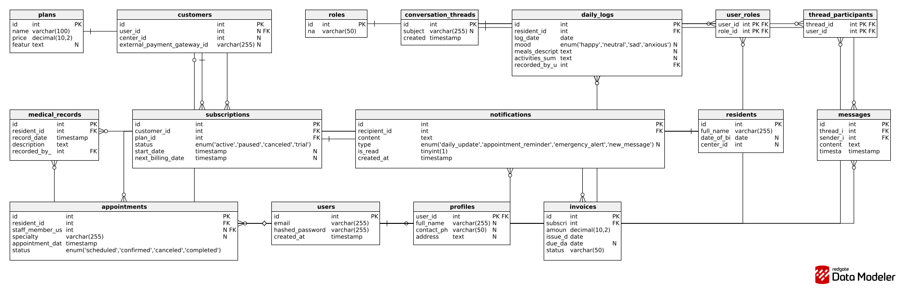

---
<div style="page-break-after: always;"></div>

# Capítulo V: Product Implementation, Validation & Deployment

# 5.1. Software Configuration Management

En esta sección el equipo establece las decisiones, herramientas y convenciones que permiten mantener la consistencia durante el ciclo de vida del proyecto. Se incluyen aspectos de configuración del entorno de desarrollo, gestión del código fuente, guías de estilo y configuración de despliegue de la solución.

---

## 5.1.1. Software Development Environment Configuration


### Project Management
Para la gestión del proyecto se emplearon diversas herramientas de comunicación, planificación y control de versiones. Se creó una organización en GitHub para centralizar el repositorio del código fuente y coordinar el trabajo colaborativo del equipo. La comunicación interna se realizó mediante Discord y WhatsApp, mientras que la planificación ágil de tareas se gestionó a través de Trello.

- **Organización del trabajo:** GitHub
- **Reuniones:** Discord
- **Comunicación:** WhatsApp
- **Planificación y asignación de tareas:** Trello

**Enlaces**  
-**GitHub:** https://github.com
-**Discord:** https://discord.com  
-**Trello:** https://trello.com


### Requirement Management
Para la fase de levantamiento y priorización de requisitos, se implementaron herramientas que facilitaron la recolección, análisis y documentación de información. Trello fue empleado para la gestión visual de tareas mediante tableros personalizados.  
Además, se utilizó **UXPressia** para el desarrollo de *User Personas*, *Empathy Maps*, *Journey Maps* y *Lean UX Canvas*, mientras que **Miro** sirvió para construir los escenarios *As-Is* y *To-Be* de los procesos del sistema.

**Enlaces**  
-**Trello:** https://trello.com 
-**UXPressia:** https://uxpressia.com 
-**Miro:** https://miro.com/es


### Product UX/UI Design
Durante el diseño de la experiencia e interfaz de usuario, el equipo utilizó **Figma** para crear *wireframes*, *mockups* y *prototipos interactivos*, lo cual permitió validar las propuestas de diseño antes de su implementación final.  
Asimismo, se aplicaron principios de usabilidad y diseño centrado en el usuario para garantizar una navegación fluida y consistente.

**Enlaces**  
-**Figma:** https://www.figma.com


### Software Development
Para el desarrollo de la aplicación se utilizaron distintas herramientas y entornos de programación.  
El *backend* fue implementado con **ASP.NET Core (C#)** empleando el IDE **JetBrains Rider**, mientras que el *frontend* se desarrolló con **Vue.js** en **JetBrains WebStorm**, apoyándose en **Node.js** y **NPM** para la gestión de dependencias.  
Adicionalmente, se emplearon **HTML**, **CSS** y **JavaScript** para la construcción de la *Landing Page*.  
La instalación y mantenimiento de las IDEs se realizó mediante **JetBrains ToolBox**.

**Enlaces**  
-**JetBrains ToolBox:** https://www.jetbrains.com/toolbox-app
-**Rider:** https://www.jetbrains.com/rider 
-**Webstorm:** https://www.jetbrains.com/webstorm
-**Node.js:** https://nodejs.org  
-**Vue.js:** https://vuejs.org
-**PrimeVue:** https://primevue.org 
-**Visual Studio Code:** https://code.visualstudio.com


### Software Documentation
Para la documentación técnica y la gestión del repositorio, se utilizó **GitHub** siguiendo la metodología de trabajo **GitHub Flow**.  
Esta estrategia permitió un control de versiones eficiente mediante el uso de ramas específicas para cada funcionalidad o corrección.  
Toda la documentación se redactó en formato **Markdown (.md)**, debido a su legibilidad, simplicidad y compatibilidad con GitHub.

**Enlaces**  
-**GitHub:** https://github.com

### Software Deployment
El despliegue de la *Landing Page* se realizó mediante **GitHub Pages**, una herramienta ideal para la publicación de sitios web estáticos directamente desde el repositorio del proyecto.

**Enlaces**  
-**GitHub Pages:**  https://pages.github.com

-----
## 5.1.2. Source Code Management

El sistema de control de versiones utilizado para el desarrollo del proyecto es **GitHub**, implementando un flujo de trabajo basado en **GitFlow**, el cual permite mantener un proceso de desarrollo estructurado, ordenado y colaborativo.

### Modelo de ramas Git Flow
El modelo de ramas adoptado se basa en **GitFlow**, estableciendo una organización clara del código fuente para facilitar la integración de nuevas funcionalidades y el control de versiones.

- **main:** rama principal donde se encuentra el código estable y listo para despliegue.
- **develop:** rama base para la integración y prueba de nuevas funcionalidades antes de su paso a producción.
- **feature/:** ramas destinadas al desarrollo de nuevas características o capítulos del proyecto.

**Ramas de características existentes:**
- `feature/chapter-01`
- `feature/chapter-02`
- `feature/chapter-03`
- `feature/chapter-04`
- `feature/chapter-05`

Cada funcionalidad o capítulo se desarrolla en una rama independiente y, una vez completada, se fusiona con la rama *develop*.

### Convenciones de nomenclatura
Para mantener coherencia en la gestión del código, se emplean las siguientes convenciones de nombres de ramas:

- `feature/<nombre>`: nuevas funcionalidades o módulos.
- `release/<versión>`: preparación de entregas o versiones estables.
- `hotfix/<incidencia>`: correcciones críticas en producción.

### Versionado semántico (Semantic Versioning)
El proyecto aplica **Semantic Versioning 2.0.0**, un estándar que define un esquema de control de versiones mediante el formato **MAJOR.MINOR.PATCH**, asegurando claridad en los cambios de versión.

**Ejemplos:**
- `v1.0.0`: versión estable inicial.
- `v1.1.0`: incorporación de nuevas funcionalidades.
- `v2.0.0`: cambios mayores o incompatibles con versiones anteriores.

### Convención de mensajes de commits
Se siguen las reglas de **Conventional Commits**, garantizando mensajes de confirmación legibles, consistentes y estandarizados.  
Esto permite mantener una trazabilidad clara de los cambios realizados en el repositorio.

**Ejemplos de commits:**
- `feat: agregar nuevo sistema de login`
- `fix: corregir validación en formulario de registro`
- `docs: actualizar README con instrucciones de despliegue`

### Repositorios del proyecto
El proyecto está organizado dentro de una **organización en GitHub**, donde cada módulo cuenta con su propio repositorio según su propósito y tecnología.

- **Landing Page:** desarrollada con *HTML*, *CSS* y *JavaScript*.
- **Web Services:** implementado con *ASP.NET Core (C#)*.
- **Frontend Web Application:** construida con *Vue.js* y *PrimeVue*.


### Flujo de trabajo de GitFlow
El flujo de trabajo del proyecto se basa en el modelo **“A Successful Git Branching Model”**, el cual organiza el proceso de desarrollo mediante ramas específicas para cada funcionalidad o corrección.  
Este enfoque permite un control de versiones ordenado y un desarrollo paralelo seguro.

### Estructura de branches (Ramas)

**Master branch (Rama principal):**  
Es la rama principal del proyecto, donde se almacena el código estable y listo para producción.  
Solo se integran cambios que hayan sido probados y validados previamente en las ramas de desarrollo (*develop*) y funcionalidad (*feature/*).  
Esta rama representa el estado más confiable del proyecto.

**Develop branch (Rama de desarrollo):**  
Actúa como un espacio de integración para el trabajo en equipo.  
Aquí se combinan, prueban y ajustan las nuevas funcionalidades antes de ser fusionadas con la rama principal (*main*).  
Su propósito es garantizar que el código integrado sea funcional y estable antes del despliegue.

**Feature branches (Ramas de funcionalidad):**  
Cada nueva funcionalidad o tarea específica se desarrolla en su propia rama independiente.  
Una vez completada y verificada, se integra nuevamente en la rama de desarrollo (*develop*).  
Las ramas de funcionalidad siguen un esquema de nombres descriptivos, como por ejemplo:
- `feature/chapter-01`
- `feature/chapter-02`
- `feature/chapter-03`
- `feature/chapter-04`
- `feature/chapter-05`


---

## 5.1.3. Source Code Style Guide & Conventions

El equipo adopta **convenciones de nomenclatura y guías de estilo estandarizadas** para mantener la coherencia, legibilidad y escalabilidad del código fuente a lo largo del proyecto.  
Todas las variables, funciones, clases y archivos se nombran en **inglés**, siguiendo las convenciones propias de cada lenguaje y marco de trabajo.


### HTML / CSS
Se siguen las recomendaciones de las guías de estilo oficiales:

- HTML Style Guide and Coding Conventions: https://www.w3schools.com/html/html5_syntax.asp
- Google HTML/CSS Style Guide : https://google.github.io/styleguide/htmlcssguide.html

**Convenciones aplicadas:**
- Uso de etiquetas **semánticas** para mejorar la estructura, accesibilidad y SEO del sitio.
- Clases CSS escritas en **kebab-case**, por ejemplo: `.main-header`, `.card-title`.
- Identificadores claros, descriptivos y consistentes.
- Organización modular del código mediante hojas de estilo separadas por componente o sección.

**Etiquetas utilizadas en la estructura de la Landing Page:**
- `<header>`: Contiene el contenido introductorio del sitio y el logotipo principal.
- `<nav>`: Define las secciones dedicadas a la navegación dentro del sitio.
- `<div>`: Permite agrupar elementos y aplicar estilos específicos por secciones.
- ``: Inserta imágenes optimizadas para mejorar la presentación visual.
- `<ul>`: Define listas desordenadas, empleadas en el menú de navegación.
- `<li>`: Representa los elementos de cada lista, utilizados en menús y secciones del blog.
- `<a>`: Crea hipervínculos que permiten desplazarse por las secciones del sitio.
- `<p>`: Define párrafos de texto para el contenido informativo.
- `<button>`: Declara botones interactivos que permiten ejecutar acciones específicas.
- `<h1>` – `<h4>`: Representan los distintos niveles de encabezados del sitio, donde `<h1>` es el nivel principal.

### JavaScript (Vue.js)

Se aplican las siguientes guías y herramientas de estilo:

- Google JavaScript Style Guide : https://google.github.io/styleguide/jsguide.html
- W3C JavaScript Best Practices : https://www.w3.org/wiki/JavaScript_best_practices
- MDN JavaScript Guidelines : https://developer.mozilla.org/en-US/docs/Web/JavaScript
- Vue Style Guide : https://vuejs.org/style-guide/

**Prácticas adoptadas:**
- Código escrito en **ES6+**, priorizando claridad y modularidad.
- Uso de **CamelCase** para variables y funciones.
- Componentes de Vue nombrados en **PascalCase**.
- Implementación de **ESLint** y **Prettier** para análisis estático y formateo automático del código.
- Uso del principio **DRY (Don’t Repeat Yourself)** para evitar duplicaciones.


### C# y ASP.NET Core
Las convenciones del código backend siguen los lineamientos de Microsoft:

- C# Coding Conventions : https://tinyurl.com/dcv9w6m8
- Microsoft ASP.NET Core Coding Guidelines : https://tinyurl.com/mw3m8w58

**Convenciones aplicadas:**
- Uso de **PascalCase** para clases, interfaces y métodos públicos.
- Uso de **camelCase** para variables locales y parámetros.
- Organización del código en **namespaces** coherentes con la arquitectura del proyecto.
- Comentarios XML para documentación interna de métodos y controladores.
- Pruebas unitarias y escenarios escritos siguiendo la convención **Gherkin (Given-When-Then)**.

### Buenas prácticas comunes
En todo el código del proyecto se aplican principios de ingeniería de software orientados a la calidad y mantenibilidad:

- Nomenclatura en inglés.
- Principio **DRY (Don’t Repeat Yourself)**: evitar duplicación de código.
- Principio **KISS (Keep It Simple, Stupid)**: priorizar soluciones simples y claras.
- Código documentado y con convenciones homogéneas entre frontend y backend.
- Control de formato automatizado mediante *linters* y *formatters* en cada entorno de desarrollo.
---

## 5.1.4. Software Deployment Configuration

El despliegue de la solución considera los siguientes aspectos generales, los cuales garantizan la disponibilidad y correcta operación de los distintos componentes del sistema:


### Landing Page Deployment
La **Landing Page** fue desarrollada utilizando **HTML**, **CSS** y **JavaScript**, y se encuentra desplegada públicamente a través de **GitHub Pages**.  
Para su publicación, se cumplieron los siguientes pasos:

1. **Preparación del entorno:**  
   Se creó un repositorio dentro de la organización en **GitHub**, destinado a alojar los archivos de la Landing Page.

2. **Estructura de archivos:**  
   Los archivos principales se encuentran en la raíz del repositorio, siguiendo las convenciones de nombres:
    - `index.html` → página principal.
    - `styles.css` → hoja de estilos principal.
    - `script.js` → scripts principales.
    - `languages.js` → archivo para gestionar los textos en distintos idiomas (español e inglés).
    - Carpeta `assets/images/` → para las imágenes utilizadas en el sitio.

3. **Configuración en GitHub Pages:**
    - Se accedió a **Settings > Pages** dentro del repositorio.
    - Se seleccionó la rama **main** como fuente de publicación.
    - Se configuró la carpeta raíz (`/`) como directorio base.
    - Una vez completado el proceso, GitHub generó automáticamente la URL pública de la Landing Page.

Además, se implementó un archivo `languages.js` que contiene los textos en español e inglés.  
Este archivo es consumido por el script `main.js`, permitiendo el cambio de idioma dinámico en la interfaz.


### Backend (Web Services)
El **backend** fue desarrollado en **ASP.NET Core con C#**, siguiendo el estilo arquitectónico **RESTful**.  
Su despliegue se realizó en la plataforma **Render**, configurada como un servicio *cloud* para ejecutar la API de forma continua.  
Esto permite mantener el servicio activo, escalable y sincronizado con el repositorio de GitHub.


### Frontend Web Application
La **aplicación web frontend** fue construida con **Vue.js** y **PrimeVue**, integrando una interfaz moderna e interactiva.  
El despliegue se llevó a cabo en **Render**, aprovechando su integración con GitHub para habilitar un flujo de despliegue automático.  
Cada actualización en la rama `main` desencadena una nueva versión publicada en producción.


### Integración Continua / Despliegue Continuo (CI/CD)
El proyecto implementa un flujo automatizado de **Integración Continua y Despliegue Continuo (CI/CD)**, con el objetivo de mantener la coherencia entre los entornos de desarrollo y producción.

- Todos los repositorios están conectados directamente a **GitHub**.
- **Render** ejecuta el despliegue automático al detectarse *merges* en la rama `main`.
- Este proceso garantiza una actualización constante de los servicios y minimiza la intervención manual en las publicaciones.

### Github Pages:


**La URL que nos entrega Github Pages para acceder a la landing page es la siguiente:**  
https://edgerunners-aplicaciones-web.github.io/landing-page/

---

## 5.2. Landing Page, Services & Applications Implementation.


---

## 5.2.1. Sprint 1

A continuación, se presenta el Sprint Planning 1, donde se incluyen las evidencias de planificación e implementación del Landing Page. También se registran los avances del proyecto e insights de colaboración del equipo a través de GitHub.


## 5.2.1.1. Sprint Planning 1
En esta sesión, el equipo definió los objetivos y el alcance del primer ciclo de trabajo, enfocándose en el desarrollo de la Landing Page como punto de entrada principal para comunicar la propuesta de valor de la plataforma. A continuación, se presenta el cuadro resumen del Sprint Planning :

| **Sprint #**                           | Sprint 1                                                                                                                                                                                                                                                      |
|----------------------------------------|---------------------------------------------------------------------------------------------------------------------------------------------------------------------------------------------------------------------------------------------------------------|
| **Sprint Planning Background**                                                       |
| **Date**                               | 2025-09-16                                                                                                                                                                                                                                                    |
| **Time**                               | 05:00 PM (GMT -5)                                                                                                                                                                                                                                             |
| **Location**                           | Modalidad remota mediante **Discord**                                                                                                                                                                                                                         |
| **Prepared By**                        | Equipo **SmartStay**                                                                                                                                                                                                                                          |
| **Attendees (to planning meeting)**    | Verona Flores, Italo Sebastián / Valverde Portuguez, Natalia Ximena / Fernandez Garfias, Alexander Piero / Saavedra Angulo, Jose Jhonatan                                                                                                                     |
| **Sprint n – 1 Review Summary**        | Este es el primer sprint del proyecto, por lo tanto, no existe una revisión de sprint anterior.                                                                                                                                                               |
| **Sprint n – 1 Retrospective Summary** | Al ser la primera iteración, no se registran retrospectivas previas. No obstante, se acordó la importancia de establecer lineamientos claros de trabajo colaborativo, mantener una comunicación efectiva y un uso disciplinado de las herramientas definidas (GitHub, Discord, Trello). Se establecieron buenas prácticas desde el inicio para garantizar la calidad del trabajo y la coordinación del equipo. |
| **Sprint Goal & User Stories**         |                                                                                                                                                                                                                                                          
| **Sprint 1 Goal**                      | **Our focus** is on delivering a professional and accessible first touchpoint for potential Smart Stay users. <br> **We believe it delivers** clear understanding of the platform's value proposition and easy access to registration for hotel administrators and guests. <br> **This will be confirmed when** the Landing Page is publicly deployed on GitHub Pages with responsive design, all main sections (Home, Products, Solutions, Pricing, Success Stories) are navigable, and at least 3 team members can successfully complete the flow from landing to registration/login without encountering navigation issues."                                                                                  |
| **Sprint 1 Velocity**                  | 2 Story Points                                                                                                                                                                                                                                                             |
| **Sum of Story Points**                |2 Story Points                                                                                                                                                                                                                                                            |


## 5.2.1.2. Deployment Evidence for Sprint Review

En esta sección se presenta la evidencia correspondiente al despliegue y desarrollo del Sprint, enfocada específicamente en la construcción y presentación de la Landing Page del proyecto. Para evaluar la participación de cada miembro del equipo, se establecieron cinco criterios principales que reflejan las responsabilidades técnicas del Sprint:

Estructura base del proyecto (HTML/CSS): Se evalúa la correcta creación de la estructura inicial del sitio, la organización del contenido y el uso adecuado de HTML y estilos CSS.

Diseño visual y maquetación web (Landing Page): Considera la implementación del diseño gráfico, la coherencia visual, la experiencia del usuario y el cumplimiento del mockup.

Integración de componentes visuales: Incluye la incorporación de imágenes, íconos, tipografías y elementos interactivos que enriquecen la página.

Revisión y control de versiones: Evalúa el uso adecuado de GitHub, la correcta gestión de commits, ramas, merges y el trabajo colaborativo ordenado.

La siguiente tabla muestra el nivel de participación según los criterios mencionados, usando las marcas L (Logrado) y C (Contribuido) para reflejar el aporte individual de cada integrante durante este Sprint.

| **Team Member (Last Name, First Name)** | **GitHub Username**                                  | **Estructura base del proyecto (HTML/CSS)** | **Diseño visual y maquetación web (Landing Page)** | **Integración de componentes visuales** | **Revisión y control de versiones** |
|-----------------------------------------|------------------------------------------------------|---------------------------------------------|----------------------------------------------------|-----------------------------------------|-------------------------------------|
| **Verona Flores, Italo Sebastián**      | [@atomdragon1318](https://github.com/atomdragon1318) | L                                           | C                                                  | C                                       | C                                   |
| **Valverde Portuguez, Natalia Ximena**  | [@NatValverde15](https://github.com/NatValverde15)   | C                                           | L                                                  | C                                       | C                                   |
| **Fernandez Garfias, Alexander Piero**  | [@shiloox](https://github.com/shiloox)               | C                                           | C                                                  | L                                       | C                                   |
| **Saavedra Angulo, Jose Jhonatan**      | [@ElrichMasNa](https://github.com/ElrichMasNa)       | C                                           | C                                                  | C                                       | L                                   |
| **Ramos Aguirre, Aldair Joaquin**       | [@AldairRamos13](https://github.com/AldairRamos13)   | C                                           | C                                                  | C                                       | L                                   |

---

## 5.2.1.3. Sprint Backlog 1

### Introducción
El objetivo principal del Sprint 1 es implementar la **Landing Page (EP08)** que permita a los visitantes explorar las funcionalidades básicas de SmartStay, conocer sus beneficios y acceder fácilmente al registro o login.  
Este Sprint está enfocado en **atraer visitantes y convertirlos en usuarios registrados** a través de una experiencia inicial clara e intuitiva.

**Evidencia en del avance en trello**


Este Sprint permitió entregar la **Landing Page inicial de Smart Stay**, proporcionando a los visitantes un primer acercamiento a las **funcionalidades**, **beneficios**, **testimonios** y **información general** de la aplicación.

### Sprint #1 – Sprint Backlog


| **Sprint #** | **User Story Id ** | **User Story Title**             | **Task Id** | **Task Title**                              | **Description**                                                                                              | **Estimation (Hours)** | **Assigned To** | **Status** |
|--------------|--------------------|----------------------------------|-------------|---------------------------------------------|--------------------------------------------------------------------------------------------------------------|------------------------|-----------------|------------|
| Sprint 1     | US-24              | Segmented landing page           | UT-01       | Design visual structure                     | Create the general structure of the Landing Page with differentiated sections for administrators and guests. | 6                      | Alexander       | Done       |
| Sprint 1     | US-24              | Segmented landing page           | UT-02       | Layout Landing Page                         | Implement the HTML and CSS design of the base prototype.                                                     | 5                      | Italo           | In Process |
| Sprint 1     | US-24              | Segmented landing page           | UT-03       | Navigation and internal links               | Configure navigation between sections with links and smooth scrolling.                                       | 3                      | Jose            | Done       |
| Sprint 1     | US-26              | Success stories and testimonials | UT-04       | Create testimonials section                 | Design carousel with user testimonials and simple animations.                                                | 4                      | Aldair          | To Review  |
| Sprint 1     | US-27              | Demo request and contact         | UT-05       | Contact form                                | Implement form with validation and responsive design.                                                        | 4                      | Natalia         | Done       |
| Sprint 1     | US-28              | Corporate information            | UT-06       | Write mission, vision and values            | Write institutional text consistent with the Smart Stay brand.                                               | 3                      | Natalia         | Done       |
| Sprint 1     | US-28              | Corporate information            | UT-07       | Implement “About Us” section                | Layout the section with text and representative image.                                                       | 4                      | Alexander       | To Do      |
| Sprint 1     | US-24              | Segmented landing page           | UT-08       | Add CTA buttons (Login, Registration, Demo) | Place visible buttons with links to authentication routes.                                                   | 3                      | Jose            | Done       |
| Sprint 1     | US-26              | Success stories and testimonials | UT-09       | Adjust animations and transitions           | Apply drop-in and fluid scrolling effects on testimonials.                                                   | 4                      | Aldair          | In Process |


## 5.2.1.4. Development Evidence for Sprint Review

### Introducción
Durante este Sprint se avanzó en la **implementación de la Landing Page**. Se desarrollaron las secciones de información general, beneficios de la plataforma y botones de acceso a login/registro. La mayor parte del trabajo se centró en la **estructura base, navegación y maquetación inicial**.

### Commits realizados

| Repository                          | Branch               | Commit Id | Commit Message                             | Commit Message Body                                                  | Committed on (Date) |
|-------------------------------------|----------------------|-----------|--------------------------------------------|----------------------------------------------------------------------|---------------------|
| Edgerunners-Aplicaciones-Web/report | feature/landing-page | `14ca4e3` | `feat: add initial landing page structure` | Se implementa la estructura base de la landing con secciones vacías. | 13/09/2025          |
| Edgerunners-Aplicaciones-Web/report | feature/landing-page | `27bd9f1` | `feat: add SmartStay introduction section` | Contenido informativo agregado a la landing.                         | 13/09/2025          |
| Edgerunners-Aplicaciones-Web/report | feature/landing-page | `38cf0d2` | `feat: add benefits section with icons`    | Sección de beneficios agregada con maquetado inicial.                | 14/09/2025          |
| Edgerunners-Aplicaciones-Web/report | feature/landing-page | `42af2e9` | `feat: add login/register buttons`         | Se agregan botones que redirigen a formularios de login y registro.  | 14/09/2025          |
| Edgerunners-Aplicaciones-Web/report | feature/landing-page | `59ff1d8` | `chore: fix navigation and styles`         | Ajustes en navegación y estilos de la landing.                       | 15/09/2025          |
| Edgerunners-Aplicaciones-Web/report | develop              | `6af1bc3` | `merge: feature/landing-page into develop` | Se integran cambios de la landing en la rama de desarrollo.          | 16/09/2025          |


### 5.2.1.5. Execution Evidence for Sprint Review.

En este **Sprint 1**, el entregable principal fue la **Landing Page inicial de SmartStay**, desarrollada e implementada en GitHub Pages.

La ejecución se centró en:
- Implementar la **estructura básica** de la landing page.
- Incluir una **barra de navegación**, sección principal (*Hero*) y enlaces de acceso hacia registro y login.
- Aplicar una **paleta de colores sencilla** y un diseño **responsive básico** para visualización en dispositivos móviles y escritorio.
- Publicar el proyecto en GitHub Pages, asegurando que esté disponible de manera pública.

### Evidencia visual
A continuación, se adjuntan capturas de pantalla que evidencian la ejecución realizada en este Sprint:

- Esta es la sección inicial, donde está el header.

  

- Aquí se puede observar la sección donde se presenta a los productos que ofrecemos.

  

- Esta sección describe las soluciones de acorde al tipo de propiedad.

  

-Tenemos en esta sección acerca de precios por el servicio.

  

-Aquí se puede observar la sección de reseñas.

  


### 5.2.1.6. Services Documentation Evidence for Sprint Review  

En este **Sprint 1**, los miembros del equipo lograron completar las tareas asociadas al desarrollo de la **Landing Page de SmartStay**.

El trabajo incluyó la definición de la estructura visual básica, la aplicación de colores corporativos y la integración de secciones clave como la barra de navegación y la sección principal (*Hero*).
f
La landing page cumple el rol de **página de presentación inicial** de la plataforma SmartStay, ofreciendo a los usuarios una visión general del proyecto y accesos rápidos al registro o login.

Una landing page es esencial en proyectos digitales, pues está diseñada estratégicamente para guiar al visitante hacia acciones específicas, optimizando la experiencia del usuario. En este caso, la acción principal es conocer SmartStay y dar el primer paso hacia el registro.


### 5.2.1.7. Software Deployment Evidence for Sprint Review  

- **Git**: Se utilizó para el control de versiones, registrando cada cambio en el código fuente.
- **Repositorio en GitHub**: Se creó y configuró el repositorio oficial específico para el landing page, facilitando la colaboración del equipo. https://github.com/Edgerunners-Aplicaciones-Web/landing-page  
- **GitHub Pages**: Se configuró como servicio de hosting gratuito para publicar la página y permitir su acceso en línea de manera pública, configurando la rama `main` como fuente de publicación. 
- **Integración automática**: cada *commit* en la rama principal actualiza de manera automática la página desplegada.  

Este flujo aseguró que el trabajo desarrollado estuviera disponible para todo el equipo y los revisores, permitiendo validar en tiempo real los avances.

  
 

### 5.2.1.8. Team Collaboration Insights during Sprint  

Las actividades de desarrollo de este Sprint se llevaron a cabo de manera colaborativa, distribuyendo las tareas entre los miembros del equipo.

**Acciones de colaboración destacadas:**
- Se utilizó **GitHub** como herramienta central de coordinación y control de versiones.
- Uno de los integrantes configuró el repositorio inicial y las ramas de trabajo.
- Cada miembro realizó **commits documentados** con los cambios implementados.
- Se llevaron a cabo **pull requests** para integrar las contribuciones al repositorio principal.
- Se realizaron revisiones de código en equipo para mantener la coherencia visual y funcional de la landing.

Gracias a este flujo de trabajo, el equipo pudo avanzar de forma paralela y ordenada, evitando conflictos en el código y asegurando un resultado consistente.


---

## 5.2.2 Sprint 2

A continuación, en el Sprint 2 nos enfocamos en las funcionalidades de la aplicación web, trabajando con una estructura basada en Domain-Driven Design (DDD). Nos organizamos utilizando bounded contexts clave que permiten una mejor gestión y uso eficiente de las herramientas de diseño de productos.


## 5.2.2.1 Sprint Planning 2
En esta sesión, el equipo definió los objetivos y el alcance del segundo ciclo de trabajo, enfocándose en el desarrollo de la aplicación web multi-rol con diseño responsive y soporte de internacionalización para servir a administradores de hotel, personal y huéspedes. A continuación, se presenta el cuadro resumen del Sprint Planning:

| **Sprint 2**                           | Sprint 2                                                                                                                                                                                                                                                                                                                                                                                                                                                                                                                                                                                   |
|----------------------------------------|--------------------------------------------------------------------------------------------------------------------------------------------------------------------------------------------------------------------------------------------------------------------------------------------------------------------------------------------------------------------------------------------------------------------------------------------------------------------------------------------------------------------------------------------------------------------------------------------|
| **Sprint Planning Background**         |                                                                                                                                                                                                                                                                                                                                                                           
| **Date**                               | 2025-10-01                                                                                                                                                                                                                                                                                                                                                                                                                                                                                                                                                                                 |
| **Time**                               | 07:00 PM                                                                                                                                                                                                                                                                                                                                                                                                                                                                                                                                                                                   |
| **Location**                           | Modalidad remota mediante **Discord**                                                                                                                                                                                                                                                                                                                                                                                                                                                                                                                                                      |
| **Prepared By**                        | Equipo **SmartStay**                                                                                                                                                                                                                                                                                                                                                                                                                                                                                                                                                                       |
| **Attendees (to planning meeting)**    | Verona Flores, Italo Sebastián / Valverde Portuguez, Natalia Ximena / Fernandez Garfias, Alexander Piero / Saavedra Angulo, Jose Jhonatan                                                                                                                                                                                                                                                                                                                                                                                                                                                  |
| **Sprint 2 – 1 Review Summary**        | Durante el Sprint 1, el equipo logró completar exitosamente el desarrollo y despliegue de la Landing Page de SmartStay. Se implementaron todas las secciones principales (Home, Products, Solutions, Pricing, Success Stories, Resources) con diseño responsive y navegación funcional. El Product Owner expresó satisfacción con el resultado visual y la claridad de la propuesta de valor presentada. Sin embargo, se identificaron oportunidades de mejora en la optimización de rendimiento y en la implementación completa del sistema de cambio de idioma, que quedó pendiente.                                                                                                                                                                                                                                                                                                                  |
| **Sprint 2 – 1 Retrospective Summary** | Durante el primer Sprint trabajamos de manera colaborativa en el desarrollo de Smart Stay y completamos la mayoría de las tareas planificadas con éxito. Sin embargo, surgieron algunos errores técnicos durante la integración. Identificamos como oportunidades de mejora la necesidad de una validación más rigurosa antes del despliegue y una mejor coordinación en la documentación del proyecto. El equipo acordó implementar revisiones de código más frecuentes y establecer checkpoints de validación antes de cada merge a la rama principal para el Sprint 2.                                                                                                                                                                 |
| **Sprint Goal & User Stories**         |                                                                                                                                                                                                                                                                                                                                                                                                                                                                                                                                                                 
| **Sprint 2 Goal**                      | **Our focus** is on delivering a fully functional multi-role web application with responsive design and internationalization support that serves hotel administrators, staff, and guests. <br> **We believe it delivers** an intuitive and accessible hotel management experience to administrators who can manage rooms and staff, efficient task management capabilities to hotel staff, and a seamless booking and service browsing experience to guests. <br> **This will be confirmed when** hotel administrators can successfully create, edit and delete room and staff records through the admin dashboard, staff members can view and update their assigned tasks, guests can browse properties and make bookings using the guest interface, all three user types can switch between English and Spanish languages, and the application is accessible and fully functional across desktop, tablet and mobile devices with response times under 3 seconds. |
| **Sprint 2 Velocity**                  | 15  Story Points                                                                                                                                                                                                                                                                                                                                                                                                                                                                                                                                                                                         |
| **Sum of Story Points**                | 18 Story Points                                                                                                                                                                                                                                                                                                                                                                                                                                                                                                                                                                                        |


---

## 5.2.2.2. Aspect Leaders and Collaborators

Durante este Sprint, el equipo se enfocó en el **diseño visual, maquetación y despliegue de la Landing Page** de **Smart Stay**, junto con la implementación inicial del soporte multilenguaje y la adaptación responsiva del sitio web.  
Para optimizar el trabajo colaborativo, se elaboró la **Matriz de Liderazgo y Colaboración (LACX)**, donde se asignan los roles de **Líder (L)** y **Colaborador (C)** en los principales aspectos del Sprint.

La matriz está dividida en cuatro grandes áreas del Sprint:

Diseño visual y maquetación web (Frontend funcional): Incluye la estructura visual, componentes, estilos, y la maquetación completa de la Landing Page y vistas principales.

Implementación técnica del cambio de idioma (Multilenguaje funcional): Configuración del sistema multilenguaje (ES/EN), archivos JSON, toggles de cambio de idioma, y aseguramiento de la traducción de componentes.

Responsividad y pruebas en distintos dispositivos: Ajuste del diseño para que funcione correctamente en laptops, tablets y smartphones. Identificación y corrección de desbordes, errores de layout o estilos.

Despliegue de la aplicación web: Configuración de hosting, repositorio, build final y publicación de la aplicación.

| **Team Member (Last Name, First Name)** | **GitHub Username**                                          | **Diseño visual y maquetación web (Frontend funcional)** | **Implementación técnica del cambio de idioma (Multilenguaje funcional)** | **Responsividad y pruebas en distintos dispositivos** | **Despliegue de la aplicación web** |
|-----------------------------------------|--------------------------------------------------------------|----------------------------------------------------------|---------------------------------------------------------------------------|-------------------------------------------------------|-------------------------------------|
| **Verona Flores, Italo Sebastián**      | [@atomdragon1318](https://github.com/atomdragon1318)         | L                                                        | C                                                                         | C                                                     | C                                   |
| **Valverde Portuguez, Natalia Ximena**  | [@NatValverde15](https://github.com/NatValverde15)           | C                                                        | L                                                                         | C                                                     | C                                   |
| **Fernandez Garfias, Alexander Piero**  | [@FernandezAlexander](https://github.com/FernandezAlexander) | C                                                        | C                                                                         | L                                                     | C                                   |
| **Saavedra Angulo, Jose Jhonatan**      | [@ElrichMasNa](https://github.com/ElrichMasNa)               | C                                                        | C                                                                         | C                                                     | L                                   |
| **Ramos Aguirre, Aldair Joaquin**       | [@AldairRamos13](https://github.com/AldairRamos13)           | C                                                        | C                                                                         | C                                                     | L                                   |

---

## 5.2.2.3. Sprint Backlog 2.

### Introducción
El objetivo principal del Sprint fue desarrollar el Frontend funcional de la aplicación SmartStay, implementando las vistas iniciales para los roles de usuario Administrador, Staff y Huésped (Guest).
Esta fase se centró en validar los flujos principales del sistema mediante interfaces navegables conectadas a una API simulada (mock data), lo cual permitió evaluar la experiencia del usuario y comprobar el correcto funcionamiento de las rutas y acciones esenciales dentro de la plataforma.

El enfoque de este Sprint fue ofrecer una experiencia más cercana al producto final, permitiendo a los usuarios interactuar con funcionalidades clave como la gestión de reservas, visualización de servicios del hotel, gestión de habitaciones y panel administrativo.


Este Sprint permitió entregar la primera versión funcional del Frontend Multirrol de SmartStay, asegurando:

- Navegación activa entre vistas de Admin, Guest y Staff.

- Validación de flujos de usuario clave mediante mock data.

- Simulación de operaciones como creación de reservas, visualización de habitaciones y gestión de servicios.

- Preparación del entorno para la futura conexión con el backend real.

| **Sprint #** | **User Story Id** | **User Story Title**             | **Task Id** | **Task Title**                 | **Description**                                               | **Estimation (Hours)** | **Assigned To** | **Status** |
|--------------|-------------------|----------------------------------|-------------|--------------------------------|---------------------------------------------------------------|------------------------|-----------------|------------|
| Sprint 2     | US-24             | Segmented landing page           | UT-10       | Optimize visual design         | Improve color coherence, typography, and graphic elements.    | 5                      | Natalia         | Done       |
| Sprint 2     | US-24             | Segmented landing page           | UT-11       | Optimize SEO and performance   | Implement SEO best practices and reduce load times.           | 6                      | Italo           | In Process |
| Sprint 2     | US-25             | ROI simulator for hotels         | UT-12       | Design ROI simulator interface | Create mockup and structure for interactive simulator fields. | 6                      | Alexander       | To Do      |
| Sprint 2     | US-25             | ROI simulator for hotels         | UT-13       | Implement calculation logic    | Program function to dynamically calculate ROI.                | 7                      | Jose            | In Process |
| Sprint 2     | US-27             | Demo request and contact         | UT-14       | Integrate form with backend    | Connect contact form with simulated lead registration API.    | 5                      | Aldair          | To Review  |
| Sprint 2     | US-24             | Segmented landing page           | UT-15       | Implement multilingual system  | Add support for English/Spanish and automatic detection.      | 6                      | Italo           | In Process |
| Sprint 2     | US-24             | Segmented landing page           | UT-16       | Responsiveness testing         | Conduct tests across different browsers and devices.          | 5                      | Natalia         | Done       |
| Sprint 2     | US-26             | Success stories and testimonials | UT-17       | Add metrics to testimonials    | Show improvement percentages or impact in success stories.    | 4                      | Jose            | To Do      |
| Sprint 2     | US-28             | Corporate information            | UT-18       | Team and leadership section    | Add data and images of key team members.                      | 4                      | Aldair          | To Review  |
| Sprint 2     | US-24             | Segmented landing page           | UT-19       | Deploy new public version      | Publish optimized and fully functional site version.          | 3                      | Italo           | Done       |

---
## 5.2.2.4. Development Evidence for Sprint Review

Durante este Sprint se avanzó significativamente en la arquitectura inicial del frontend de SmartStay, implementando la estructura modular basada en bounded contexts, así como la configuración del router, manejo de estado y soporte multilenguaje.
Este avance estableció las bases necesarias para el desarrollo de las vistas y funcionalidades de cada rol del sistema (Admin, Guest, Staff, Auth).

### Commits realizados

| Repository                                   | Branch          | Commit Id | Commit Message                                           | Commit Message Body                                                                                   | Committed on (Date) |
|----------------------------------------------|-----------------|-----------|----------------------------------------------------------|-------------------------------------------------------------------------------------------------------|----------------------|
| Edgerunners-Aplicaciones-Web/frontend-smartstay | feature/natalia | `a1b2c3d` | `feat: create code in bounded context admin`             | Creación del módulo base para el rol Admin siguiendo principios de arquitectura modular.             | 21/10/2025           |
| Edgerunners-Aplicaciones-Web/frontend-smartstay | feature/natalia | `b2c3d4e` | `feat: create code in bounded context guest`             | Implementación del módulo Guest con estructura para vistas y lógica de interfaz.                      | 21/10/2025           |
| Edgerunners-Aplicaciones-Web/frontend-smartstay | feature/natalia | `c3d4e5f` | `feat: create code in bounded context staff`             | Creación del módulo Staff, incluyendo estructura inicial para gestión de tareas y habitaciones.       | 21/10/2025           |
| Edgerunners-Aplicaciones-Web/frontend-smartstay | feature/natalia | `d4e5f6a` | `feat: update code in shared directory`                  | Actualización de componentes y utilidades compartidas por todos los módulos.                          | 21/10/2025           |
| Edgerunners-Aplicaciones-Web/frontend-smartstay | main            | `e5f6a7b` | `merge: feature/natalia into main`                       | Integración oficial de la estructura inicial del frontend a la rama principal del proyecto.           | 26/10/2025           |
| Edgerunners-Aplicaciones-Web/frontend-smartstay | main            | `1a2b3c4` | `feat: add Pinia store setup for state management`       | Implementación del sistema global de estado usando Pinia para autenticación y manejo de usuario.      | 27/10/2025           |
| Edgerunners-Aplicaciones-Web/frontend-smartstay | main            | `2b3c4d5` | `feat: implement Vue Router with routes for home and 404 page` | Configuración del router, rutas base y página 404 personalizada.                                     | 27/10/2025           |
| Edgerunners-Aplicaciones-Web/frontend-smartstay | main            | `3c4d5e6` | `feat: implement BaseApi and BaseEndpoint classes`       | Estructura base para la interacción con APIs, facilitando escalabilidad y acoplamiento bajo.           | 27/10/2025           |
| Edgerunners-Aplicaciones-Web/frontend-smartstay | main            | `4d5e6f7` | `feat: add i18n configuration for internationalization`  | Implementación de soporte multilenguaje (EN/ES) y configuración de archivos de localización.          | 27/10/2025           |

---

## 5.2.2.5. Execution Evidence for Sprint Review

Aquí veremos la versión de la aplicación web. Esto fue realizado mediante WebStorm y su complemento de git, con esto cada integrante pudo realizar cambios y versiones en sus ramas para luego mandarlas a la rama principal y no tener ningún inconveniente. A continuación se mostrarán las evidencias de ejecución.

Primero en esta vista podemos ver el Login de la app, con su respectivo formulario donde se coloca el email, contraseña y rol. También un vínculo para redirigir a register, que también lo puedes ver en un botón junto con los botones de lenguaje inglés y español.


En esta sección se puede ver la vista de register, con su repectivo formulario para crear una cuenta y en el rol que desees. También tiene un vínculo para redirigir a login, que también lo puedes ver en un botón junto con los botones de lenguaje inglés y español.


- VISTA COMO ADMINISTRADOR (ADMINISTRATOR)

En esta sección se puede ver el dashboard de administrador de la persona. Puede apreciar datos como Rooms Found, Registered Staff, Bookings(Today) y Occupance Rate. También tienes el menú con sus dos funciones principales que te redirigen a una vista diferente Manage Staff y Manage Rooms.


Aquí vemos la vista de Manage Staff. Puedes editar y eliminar la información de cada personal que se haya registrado. También puedes agregar un nuevo personal.


Aquí vemos la vista de Manage Rooms. Puedes editar y eliminar la información de cada habitación de un respectivo hotel que se haya registrado. También puedes agregar una nueva habitación.


También en el dashboard de admin puedes acceder a ver tu perfil.


- VISTA COMO HUÉSPED (GUEST)

En esta sección se puede ver el dashboard de huésped de la persona. Puede apreciar datos como Upcoming Bookings, Active Services, Recommendation donde puedes dejar tus reseñas y Recent Properties. También tienes el menú con sus tres funciones principales que te redirigen a una vista diferente View Properties, Manage Bookings y View Rooms.


Aquí vemos la vista de View Properties. Puedes buscar información de los hoteles, tienes el buscador para buscar para palabra clave y haces click en Ver Hotel y lo ves más a detalle.


Si presionas reservar te lleva a una vista donde seleccionas las fechas y reservas.


Aquí vemos la vista de View Rooms y puedes usar filtros por hotel, tipo y precio.


Y aquí donde dejamos las reseñas.


- VISTA COMO STAFF
  
En esta sección se puede ver el dashboard de staff de la persona. Puede apreciar datos como Performance Statistics, Pending Tasks, Assigned Rooms y Quick Actions para reportar problemas o pedir requerimientos. También tienes el menú lateral con Manage Tasks, Assigned Rooms de nuevo y Profile.


Aquí vemos la vista de Manage Tasks donde puedes editar, eliminar y agregar un nuevo task. Los ves por filtros de estados.


Aquí vemos la vista de Assigned Rooms. Puedes buscar los cuartos asignados y marcas sus estados si está ocupada, en mantenimiento, entre otras. Puedes ver la cantidad de cuartos por tipo de estado y tarea.


Y aquí verás el perfil del staff.


---
## 5.2.2.6. Service Documentation Evidence for Sprint Review. 

En este Sprint aún no se desarrolla el backend real de SmartStay; sin embargo, para avanzar con la funcionalidad del sistema, se implementaron rutas de frontend completamente operativas y conectadas a una API simulada (mock data).
Estas rutas representan las vistas principales del sistema para los perfiles Admin, Guest y Staff, y permitieron validar los flujos clave con datos falsos.

La documentación siguiente recoge las “acciones simuladas” disponibles en el sistema, incluyendo navegación, carga de datos de ejemplo, formularios y operaciones emuladas. Esto sirve como base para la posterior implementación de Web Services reales.

| Endpoint / Ruta                 | Acción Implementada (Simulada) | Método HTTP Simulado  | Sintaxis / Llamada                | Parámetros                  | Ejemplo de Response (Mock)                 | URL                                                     |
|---------------------------------|--------------------------------|-----------------------|-----------------------------------|-----------------------------|--------------------------------------------|---------------------------------------------------------|
| /login                          | Inicio de sesión del usuario   | POST (simulado)       | /login                            | Body: email, password       | { "status":"success","role":"admin" }      | https://smartstay-3cffc.web.app/login                   |
| /register                       | Registrar nuevo usuario        | POST (simulado)       | /register                         | Body: name, email, password | { "id": 4, "name": "Ana" }                 | https://smartstay-3cffc.web.app/register                |
| /admin/dashboard                | Mostrar dashboard admin        | GET                   | /admin/dashboard                  | —                           | { "welcome":"Admin Panel" }                | https://smartstay-3cffc.web.app/admin/dashboard         |
| /admin/auth/users               | Ver lista de staff             | GET                   | /admin/auth/users                 | Query: ?role=staff          | [ { "id":1,"name":"Juan"} ]                | https://smartstay-3cffc.web.app/admin/auth/users        |
| /admin/auth/users/edit/:id      | Editar usuario staff           | PUT (simulado)        | /admin/auth/users/edit/{id}       | Path: id                    | { "message":"User updated" }               | https://smartstay-3cffc.web.app/admin/auth/users/edit/2 |
| /admin/auth/users/add           | Crear usuario del staff        | POST (simulado)       | /admin/auth/users/add             | Body: name, role            | { "id":6, "name":"Sofía" }                 | https://smartstay-3cffc.web.app/admin/auth/users/add    |
| /admin/property/rooms           | Ver habitaciones               | GET                   | /admin/property/rooms             | Query: ?status=available    | [{"id":10, "type":"Doble"}]                | https://smartstay-3cffc.web.app/admin/property/rooms    |
| /admin/profile                  | Ver perfil admin               | GET                   | /admin/profile                    | —                           | { "id":1,"name":"Admin" }                  | https://smartstay-3cffc.web.app/admin/profile           |
| /guest/dashboard                | Dashboard huésped              | GET                   | /guest/dashboard                  | —                           | { "welcome":"Guest Dashboard" }            | https://smartstay-3cffc.web.app/guest/dashboard         |
| /guest/properties               | Ver propiedades                | GET                   | /guest/properties                 | Query: ?city=Lima           | [{"id":101,"name":"SmartStay Miraflores"}] | https://smartstay-3cffc.web.app/guest/properties        |
| /guest/property/:id             | Ver detalle de propiedad       | GET                   | /guest/property/{id}              | Path: id                    | { "id":101,"rooms":32 }                    | https://smartstay-3cffc.web.app/guest/property/101      |
| /guest/book/:propertyId/:roomId | Iniciar reserva simulada       | POST (simulado)       | /guest/book/{propertyId}/{roomId} | Path: propertyId, roomId    | { "bookingId":201,"status":"confirmed" }   | https://smartstay-3cffc.web.app/guest/book/101/201      |
| /guest/bookings                 | Ver reservas del huésped       | GET                   | /guest/bookings                   | Query: ?status=completed    | [{"id":201,"status":"confirmed"}]          | https://smartstay-3cffc.web.app/guest/bookings          |
| /guest/rooms                    | Ver lista de habitaciones      | GET                   | /guest/rooms                      | Query: ?capacity=2          | [{"id":31,"capacity":2}]                   | https://smartstay-3cffc.web.app/guest/rooms             |
| /staff/dashboard                | Dashboard del staff            | GET                   | /staff/dashboard                  | —                           | { "welcome":"Staff Dashboard" }            | https://smartstay-3cffc.web.app/staff/dashboard         |
| /staff/property/tasks           | Ver/gestionar tareas           | GET / POST (simulado) | /staff/property/tasks             | Body (POST): task, roomId   | [{"task":"Clean Room 12"}]                 | https://smartstay-3cffc.web.app/staff/property/tasks    |
| /staff/property/cleaning        | Ver habitaciones asignadas     | GET                   | /staff/property/cleaning          | —                           | [{"roomId":23,"status":"pending"}]         | https://smartstay-3cffc.web.app/staff/property/cleaning |
| /staff/profile                  | Ver perfil staff               | GET                   | /staff/profile                    | —                           | { "id":3,"name":"Rosa Staff" }             | https://smartstay-3cffc.web.app/staff/profile           |

---

## 5.2.2.7. Software Deployment Evidence for Sprint Review

Durante este Sprint hemos desplegado el frontend.

### Uso de Beeceptor para simular el backend (Mock API)
Durante este Sprint utilizamos Beeceptor para crear una API simulada que permitiera probar el frontend sin depender del backend real.
En esta etapa se creó un workspace llamado smartstay, lo que generó una URL de pruebas para realizar peticiones HTTP.


### Configuración de endpoints mock
Dentro del workspace se configuraron rutas como /users/login, /rooms y /bookings, las cuales devolvían respuestas JSON simuladas.
Estas rutas permitieron ejecutar y validar los principales flujos del sistema SmartStay sin necesidad de un backend real.

Usaremos Firebase, el cuál es una plataforma de desarrollo de Google que ofrece servicios backend listos.

### Deployment del Frontend en Firebase Hosting
Para publicar la aplicación y hacerla accesible desde la web, se utilizó Firebase Hosting.
En esta pantalla se creó el proyecto SmartStay, que sería utilizado para alojar el build generado por Angular.
Después se configuró Firebase en el proyecto local y se ejecutó el despliegue con firebase deploy.


---
## 5.2.2.8. Team Collaboration Insights during Sprint

Durante este Sprint, el equipo colaboró en la mejora del frontend de Smart Stay, corrigiendo aspectos de diseño, idioma y navegación. Se trabajó mediante GitHub, lo que permitió una buena organización y seguimiento de los aportes de cada integrante. Aunque la colaboración fue efectiva, se presentaron algunas limitaciones por tiempo y experiencia, pero el resultado final mostró una versión más sólida y funcional del producto.

### Acciones de colaboración destacadas

- Se utilizó **GitHub** como herramienta principal para coordinar el trabajo, gestionar versiones y mantener un registro claro de los avances.
- Un integrante del equipo organizó la estructura del repositorio y creó las ramas necesarias para trabajar ordenadamente en las mejoras del frontend.
- Cada miembro realizó **commits documentados**, describiendo los ajustes en diseño, idioma y navegación.
- Se llevaron a cabo **pull requests** para integrar los cambios en la rama principal, asegurando un flujo de trabajo controlado.
- Se realizaron **revisiones de código** en equipo para verificar la coherencia visual, la correcta implementación de las mejoras y la corrección de los errores señalados en la revisión anterior.
- A pesar de las limitaciones de tiempo y experiencia, la comunicación constante permitió resolver obstáculos y mantener un progreso estable.

Gracias a este flujo de trabajo, el equipo pudo avanzar de forma paralela y ordenada, evitando conflictos en el código y asegurando un resultado consistente.


---
## 5.2.3. Sprint 3

En el Sprint Backlog 3, se juntan todas las User Stories enfocadas en la creación del backend con sus respectivas tareas. Aquí también trabajamos con los mismos bounded contexts y estructura planteada en el anterior sprint, pero con el fin de crear su respectivo API RESTful.


## 5.2.3.1. Spring Planning 3.

En esta sesión, el equipo definió los objetivos y el alcance del tercer ciclo de trabajo, enfocándose en la implementación de los bounded contexts principales del negocio (Accommodations, Bookings y Payments) mediante una API RESTful siguiendo principios de Domain-Driven Design, la mejora de la calidad de las User Stories y Technical Stories, y la provisión de documentación interactiva de la API. A continuación, se presenta el cuadro resumen del Sprint Planning Meeting:

| **Sprint #**                           | Sprint 3                                                                                                                                                                                                                                                                                                                                                                                                                                                                                                                                                                                                                                                                                                                                                                                                                                                  |
|----------------------------------------|-----------------------------------------------------------------------------------------------------------------------------------------------------------------------------------------------------------------------------------------------------------------------------------------------------------------------------------------------------------------------------------------------------------------------------------------------------------------------------------------------------------------------------------------------------------------------------------------------------------------------------------------------------------------------------------------------------------------------------------------------------------------------------------------------------------------------------------------------------------|
| **Sprint Planning Background**         |             |
| **Date**                               | 2025-10-22                                                                                                                                                                                                                                                                                                                                                                                                                                                                                                                                                                                                                                                                                                                                                                                                                                                |
| **Time**                               | 07:00 PM                                                                                                                                                                                                                                                                                                                                                                                                                                                                                                                                                                                                                                                                                                                                                                                                                                                  |
| **Location**                           | Modalidad remota mediante **Discord**                                                                                                                                                                                                                                                                                                                                                                                                                                                                                                                                                                                                                                                                                                                                                                                                                     |
| **Prepared By**                        | Equipo **SmartStay**                                                                                                                                                                                                                                                                                                                                                                                                                                                                                                                                                                                                                                                                                                                                                                                                                                      |
| **Attendees (to planning meeting)**    | Verona Flores, Italo Sebastián / Valverde Portuguez, Natalia Ximena / Fernandez Garfias, Alexander Piero / Saavedra Angulo, Jose Jhonatan                                                                                                                                                                                                                                                                                                                                                                                                                                                                                                                                                                                                                                                                                                                 |
| **Sprint 3 – 2 Review Summary**        | Durante el Sprint 2, el equipo completó exitosamente el desarrollo del frontend de SmartStay, implementando las vistas multirrol para Administrador, Staff y Huésped con navegación funcional y diseño responsive. Se logró implementar el sistema de cambio de idioma (español/inglés) que quedó pendiente del Sprint 1, y se desplegó la aplicación web en Firebase. El Product Owner expresó satisfacción con la funcionalidad implementada y la experiencia de usuario lograda. Sin embargo, se identificaron pequeñas incidencias con la estructura de algunos bounded contexts, el diseño de ciertas interfaces y el rendimiento , aspectos que serán considerados en sprints futuros para optimización continua.                                                                                                                                                                                                                                                                                                                                                                                                                                                                            |
| **Sprint 3 – 2 Retrospective Summary** |Durante el Sprint 2, el equipo trabajó de forma colaborativa y cumplió con los objetivos propuestos. Sin embargo, se evidenció la necesidad de una mejor coordinación en la gestión de versiones y documentación del código. Se acordó reforzar el control de tiempo en las tareas dadas a los integrantes.                                                                                                                                                                                                                                                                                                                                                                                                                                                                                                                                                |
| **Sprint Goal & User Stories**                                                                                                                                                                                                                                                                                                                                                                                                                                                                                                                                                                                                                                                                                                                                                                                                                                                                |
| **Sprint 3 Goal**                      | **Our focus** is on implementing the core business bounded contexts (Accommodations, Bookings, and Payments) through a RESTful API following Domain-Driven Design principles, improving the quality of User Stories and Technical Stories, and providing interactive API documentation. <br> **We believe it delivers** robust and scalable backend functionality to frontend developers who need to consume accommodation, booking and payment services, better requirement specifications to stakeholders through improved stories quality, and a solid foundation for service integration to hotel administrators. <br> **This will be confirmed when** frontend developers can successfully consume the Accommodations, Bookings and Payments endpoints through the deployed API with response times under 2 seconds, all User Stories and Technical Stories comply with established quality standards eliminating UI references and following API REST format, and the interactive Swagger documentation is publicly accessible allowing developers to test all implemented endpoints without backend team intervention. |
| **Sprint 3 Velocity**                  | 18 story points                                                                                                                                                                                                                                                                                                                                                                                                                                                                                                                                                                                                                                                                                                                                                                                                                                                       |
| **Sum of Story Points**                | 20  story points                                                                                                                                                                                                                                                                                                                                                                                                                                                                                                                                                                                                                                                                                                                                                                                                                                                       |

---

## 5.2.3.2. Aspect Leaders and Collaborators.

Durante este tercer Sprint, el equipo se enfocó en el desarrollo e implementación del Backend , creando la estructura base de la API RESTful y los bounded contexts correspondientes. Se configuró la conexión a la base de datos, se implementó la autenticación y se estableció la comunicación entre servicios siguiendo los principios de arquitectura por bounded contexts.
Para optimizar la coordinación del equipo, se elaboró la Matriz de Liderazgo y Colaboración (LACX), donde se definen los roles de Líder (L) y Colaborador (C) según los principales aspectos del Sprint.

| **Team Member (Last Name, First Name)** | **GitHub Username**                                  | **Implementación de la API RESTful (Endpoints principales)** | **Integración de bounded contexts** | **Configuración y conexión con la Base de Datos** | **Gestión de autenticación y seguridad** |
|-----------------------------------------|------------------------------------------------------|--------------------------------------------------------------|-------------------------------------|---------------------------------------------------|------------------------------------------|
| **Verona Flores, Italo Sebastián**      | [@atomdragon1318](https://github.com/atomdragon1318) | L                                                            | C                                   | C                                                 | C                                        |
| **Valverde Portuguez, Natalia Ximena**  | [@NatValverde15](https://github.com/NatValverde15)   | C                                                            | L                                   | C                                                 | C                                        |
| **Fernandez Garfias, Alexander Piero**  | [@shiloox](https://github.com/shiloox)               | C                                                            | C                                   | L                                                 | C                                        |
| **Saavedra Angulo, Jose Jhonatan**      | [@ElrichMasNa](https://github.com/ElrichMasNa)       | C                                                            | C                                   | C                                                 | L                                        |

---

## 5.2.3.3. Sprint Backlog 3.

### Introducción

El objetivo principal de este Sprint fue implementar el backend real de SmartStay, desarrollando los servicios y endpoints necesarios para gestionar funcionalidades críticas como registro y autenticación segura de usuarios, control de roles, gestión de reservas, procesamiento de pagos y documentación de APIs.
Este Sprint marcó un avance significativo al pasar del uso de mock data a operaciones reales conectadas a base de datos, con validación, middleware y seguridad basada en JWT.

La implementación backend permite sostener las operaciones centrales del sistema, asegurando integridad de la información, trazabilidad, escalabilidad y soporte a la interfaz web desarrollada previamente.


| **Sprint #** | **User Story Id ** | **User Story Title**                                 | **Task Id** | **Task Title**                    | **Description**                                                                      | **Estimation (Hours)** | **Assigned To** | **Status** |
|--------------|--------------------|------------------------------------------------------|-------------|-----------------------------------|--------------------------------------------------------------------------------------|------------------------|-----------------|------------|
| Sprint 3     | US01               | Registro de huésped                                  | UT-20       | Registration Endpoint Development | Create an endpoint for user registration with field validation and database storage. | 3                      | Alexander       | Done       |
| Sprint 3     | US02               | Inicio de sesión seguro                              | UT-21       | Login Implementation              | Develop login endpoint using JWT for authentication and secure sessions.             | 3                      | Italo           | In Process |
| Sprint 3     | US03               | Recuperación de contraseña                           | UT-24       | Password Reset Service            | Develop a token-based password recovery system with email verification.              | 4                      | Natalia         | Done       |
| Sprint 3     | US04               | Edición de perfil personal                           | UT-22       | Profile API Creation              | Build endpoints for viewing and updating user profiles.                              | 5                      | Jose            | Done       |
| Sprint 3     | US04               | Edición de perfil personal                           | UT-23       | Role-Based Access Control         | Implement middleware to manage role permissions (admin, host, guest).                | 5                      | Italo           | Done       |
| Sprint 3     | TS01               | Registro de usuario a través de la API               | UT-20       | Registration Endpoint Development | Create an endpoint for user registration with field validation and database storage. | 3                      | Alexander       | Done       |
| Sprint 3     | TS02               | Inicio de sesión a través de la API                  | UT-21       | Login Implementation              | Develop login endpoint using JWT for authentication and secure sessions.             | 3                      | Italo           | In Process |
| Sprint 3     | TS01               | Registro de usuario a través de la API               | UT-34       | Auth Middleware Setup             | Configure authentication and authorization middleware for all routes.                | 3                      | Natalia         | Done       |
| Sprint 3     | TS09               | Crear habitación a través de la API                  | UT-25       | Room CRUD Implementation          | Create endpoints to add, update, and delete rooms.                                   | 3                      | Natalia         | Done       |
| Sprint 3     | TS09               | Crear habitación a través de la API                  | UT-26       | Availability Logic                | Implement room status updates (available, booked, maintenance).                      | 4                      | Alexander       | To Do      |
| Sprint 3     | TS10               | Obtener habitación por ID a través de la API         | UT-25       | Room CRUD Implementation          | Create endpoints to get room by ID.                                                  | 2                      | Natalia         | Done       |
| Sprint 3     | TS17               | Obtener todas las habitaciones a través de la API    | UT-25       | Room CRUD Implementation          | Create endpoint to get all rooms.                                                    | 2                      | Natalia         | Done       |
| Sprint 3     | TS18               | Obtener tipo de habitación por ID a través de la API | UT-25       | Room CRUD Implementation          | Create endpoint to get room type by ID.                                              | 2                      | Natalia         | Done       |
| Sprint 3     | TS11               | Crear reserva a través de la API                     | UT-27       | Booking CRUD Service              | Implement booking endpoints for creation, update, and cancellation.                  | 3                      | Jose            | Done       |
| Sprint 3     | TS11               | Crear reserva a través de la API                     | UT-28       | Database Linking                  | Connect booking data to users and rooms with proper relationships.                   | 4                      | Italo           | In Process |
| Sprint 3     | TS12               | Obtener reserva por ID a través de la API            | UT-27       | Booking CRUD Service              | Implement endpoint to get booking by ID.                                             | 2                      | Jose            | Done       |
| Sprint 3     | TS13               | Confirmar reserva a través de la API                 | UT-27       | Booking CRUD Service              | Implement endpoint to confirm booking.                                               | 2                      | Jose            | Done       |
| Sprint 3     | TS19               | Obtener todas las reservas a través de la API        | UT-27       | Booking CRUD Service              | Implement endpoint to get all bookings.                                              | 2                      | Jose            | Done       |
| Sprint 3     | TS20               | Cancelar reserva a través de la API                  | UT-27       | Booking CRUD Service              | Implement endpoint to cancel booking.                                                | 2                      | Jose            | Done       |
| Sprint 3     | TS14               | Crear pago a través de la API                        | UT-30       | Payment Gateway Simulation        | Create secure endpoint that simulates real payment processing.                       | 5                      | Italo           | In Process |
| Sprint 3     | TS14               | Crear pago a través de la API                        | UT-31       | Transaction Logging               | Store payment data and status in database with timestamp.                            | 3                      | Jose            | Done       |
| Sprint 3     | TS15               | Procesar pago a través de la API                     | UT-30       | Payment Gateway Simulation        | Create endpoint to process payment transactions.                                     | 3                      | Italo           | In Process |
| Sprint 3     | TS16               | Obtener pagos por reserva a través de la API         | UT-30       | Payment Gateway Simulation        | Create endpoint to get payments by booking ID.                                       | 2                      | Italo           | In Process |
| Sprint 3     | TS21               | Obtener pago por ID a través de la API               | UT-30       | Payment Gateway Simulation        | Create endpoint to get payment by ID.                                                | 2                      | Italo           | In Process |
| Sprint 3     | TS22               | Obtener todos los pagos a través de la API           | UT-30       | Payment Gateway Simulation        | Create endpoint to get all payments.                                                 | 2                      | Italo           | In Process |
| Sprint 3     | TS09               | Crear habitación a través de la API                  | UT-33       | Swagger Integration               | Document all endpoints using Swagger/OpenAPI.                                        | 4                      | Natalia         | Done       |
| Sprint 3     | TS11               | Crear reserva a través de la API                     | UT-33       | Swagger Integration               | Document all endpoints using Swagger/OpenAPI.                                        | 4                      | Natalia         | Done       |
| Sprint 3     | TS14               | Crear pago a través de la API                        | UT-33       | Swagger Integration               | Document all endpoints using Swagger/OpenAPI.                                        | 4                      | Natalia         | Done       |
| Sprint 3     | TS09               | Crear habitación a través de la API                  | UT-35       | Swagger UI Configuration          | Integrate Swagger UI to allow live endpoint testing and auto documentation.          | 4                      | Alexander       | To Do      |

---

## 5.2.3.4. Development Evidence for Sprint Review.

En este tercer sprint nos enfocamos en realizar la implementación del Backend. Además, como parte del trabajo de desarrollo, se mejoraron las User Stories y Technical Stories del proyecto eliminando referencias a elementos de UI y reescribiendo las Technical Stories para que sigan el formato correcto enfocado en la API REST.

### Commits realizados


### Backend

| Repository                                   | Branch          | Commit Id  | Commit Message                                                        | Commit Message Body                                                                                         | Committed on (Date) |
|----------------------------------------------|-----------------|------------|------------------------------------------------------------------------|--------------------------------------------------------------------------------------------------------------|----------------------|
| Edgerunners-Aplicaciones-Web/backend-smartstay | main            | `706757d4` | `fix: resolve dependency issues and update Swagger descriptions`      | Corrección de dependencias, actualización de descripciones Swagger y mejoras generales en Shared.            | 15/11/2025           |
| Edgerunners-Aplicaciones-Web/backend-smartstay | main            | `cbea4b3f` | `refactor(program.cs): reorganize service configuration`              | Reorganización del archivo Program.cs con mejoras en configuración y middleware.                              | 14/11/2025           |
| Edgerunners-Aplicaciones-Web/backend-smartstay | main            | `5ea2380`  | `feat(shared): enhance DB creation logic, logging, error handling`    | Mejora de la creación de base de datos, manejo de errores y configuración de Swagger.                        | 14/11/2025           |
| Edgerunners-Aplicaciones-Web/backend-smartstay | main            | `b4a2a42e` | `refactor(config): update default DB connection`                      | Actualización de la cadena de conexión para apuntar al backend-smartstay-db.                                 | 14/11/2025           |
| Edgerunners-Aplicaciones-Web/backend-smartstay | main            | `273de0bc` | `refactor(shared): enable accommodations, bookings, payments config`  | Configuración de EF Core para acomodaciones, reservas y pagos en AppDbContext.                               | 14/11/2025           |
| Edgerunners-Aplicaciones-Web/backend-smartstay | main            | `1fe40f01` | `feat(payments): implement REST API`                                  | Implementación completa de API REST para pagos con controladores, servicios, ensambladores y DI.              | 14/11/2025           |
| Edgerunners-Aplicaciones-Web/backend-smartstay | main            | `d57e07fb` | `feat(payments): add EF Core model builder extensions`                | Extensiones de configuración para entidad Payments.                                                           | 14/11/2025           |
| Edgerunners-Aplicaciones-Web/backend-smartstay | main            | `9f147481` | `feat(payments): implement payment command and query services`        | Servicios de comando y consulta para pagos siguiendo CQRS.                                                    | 14/11/2025           |
| Edgerunners-Aplicaciones-Web/backend-smartstay | main            | `453b109a` | `refactor(payments): add repository interfaces`                       | Se agregan interfaces de repositorio y servicios relacionados a payment management.                          | 14/11/2025           |
| Edgerunners-Aplicaciones-Web/backend-smartstay | main            | `9b489823` | `refactor(bookings): replace legacy structure with REST API`          | Reestructuración total del módulo de bookings a un API REST moderno y escalable.                             | 14/11/2025           |


### Front-end

### Front-end – Commits realizados

| Repository                                        | Branch | Commit Id  | Commit Message                                                                 | Commit Message Body                                                                                       | Committed on (Date) |
|---------------------------------------------------|--------|------------|---------------------------------------------------------------------------------|------------------------------------------------------------------------------------------------------------|----------------------|
| Edgerunners-Aplicaciones-Web/frontend-smartstay   | main   | `6823048`  | `refactor: rename modules for consistency`                                     | Renombrado de módulos para mantener consistencia (Profiles, Bookings, Properties).                        | 13/11/2025           |
| Edgerunners-Aplicaciones-Web/frontend-smartstay   | main   | `6a55366`  | `refactor: move Profile module to standalone context`                           | Separación del módulo Profile para mejorar escalabilidad y organización del proyecto.                     | 13/11/2025           |
| Edgerunners-Aplicaciones-Web/frontend-smartstay   | main   | `299f27a`  | `feat: implement booking and review management with use cases and API`         | Integración del flujo de reservas con casos de uso, API y lógica de reseñas.                              | 11/11/2025           |
| Edgerunners-Aplicaciones-Web/frontend-smartstay   | main   | `5ee545c`  | `feat: add axios instance and mock DB for user/property/room/booking data`      | Configuración de Axios + mock server con datos iniciales para pruebas.                                     | 10/11/2025           |
| Edgerunners-Aplicaciones-Web/frontend-smartstay   | main   | `2e962f1`  | `feat: implement analytics module`                                             | Implementación de vistas de análisis para admin, guest y staff con estadísticas y dashboard.              | 10/11/2025           |
| Edgerunners-Aplicaciones-Web/frontend-smartstay   | main   | `3e9b12b`  | `feat: add staff room cleaning list view`                                      | Vista de lista de limpieza para Staff con integración de store y botones de acción.                       | 10/11/2025           |
| Edgerunners-Aplicaciones-Web/frontend-smartstay   | main   | `aed1fd1`  | `feat: implement user repository interface and assembler for API integration`   | Creación del repositorio de usuarios, assembler y lógica para comunicación con el backend.                | 10/11/2025           |
| Edgerunners-Aplicaciones-Web/frontend-smartstay   | main   | `e5c707a`  | `feat: implement room management view and use cases`                            | Implementación de vistas de gestión de habitaciones con casos de uso para CRUD.                           | 10/11/2025           |
| Edgerunners-Aplicaciones-Web/frontend-smartstay   | main   | `fc472b9`  | `feat: add user management views`                                              | Creación de vistas para creación, edición y eliminación de usuarios.                                      | 10/11/2025           |


---

## 5.2.3.5. Execution Evidence for Sprint Review

En este **Sprint 3**, el entregable principal fue el **Backend API REST de SmartStay** siguiendo los principios de **Domain-Driven Design (DDD)**.

La ejecución se centró en:

- Implementar una **API REST** siguiendo la arquitectura DDD con separación en bounded contexts.
- Desarrollar los **bounded contexts core del negocio**: Accommodations , Bookings y Payments.
- Configurar **Entity Framework Core** para persistencia con base de datos MySQL.
- Implementar **Swagger/OpenAPI** para documentación interactiva de la API.
- Priorizar la **lógica de negocio core** necesaria para el funcionamiento principal del sistema.

### Bounded Contexts del Sistema

Nuestro sistema está diseñado con **5 bounded contexts** :

1. **Accommodations** - Gestión de habitaciones y tipos de habitación
2. **Bookings** - Gestión de reservas
3. **Payments** - Gestión de pagos
4. **IAM** - Identity and Access Management 
5. **Profile** - Gestión de perfiles de usuario 

En este **Sprint 3**, nos enfocamos en implementar los **3 bounded contexts core del negocio** (Accommodations, Bookings y Payments), ya que representan la lógica de negocio fundamental del sistema de gestión hotelera. Los bounded contexts de **IAM** y **Profile** se implementarán en el **Sprint 4**, ya que no representan lógica de negocio core y pueden desarrollarse posteriormente sin afectar el funcionamiento principal del sistema.

### Bounded contexts desarrollados

#### 1. BOUNDED CONTEXT ACCOMMODATIONS

Este bounded context gestiona las habitaciones y tipos de habitación del sistema:

- **RoomsController**: Endpoints para gestionar habitaciones
  - `GET /api/v1/rooms/{roomId}` - Obtener habitación por ID
  - `POST /api/v1/rooms` - Crear nueva habitación
  - `GET /api/v1/rooms` - Obtener todas las habitaciones
  - `GET /api/v1/rooms/type/{roomTypeId}` - Obtener habitaciones por tipo

- **RoomTypesController**: Endpoints para gestionar tipos de habitación
  - `GET /api/v1/room-types/{roomTypeId}` - Obtener tipo de habitación por ID
  - `POST /api/v1/room-types` - Crear nuevo tipo de habitación
  - `GET /api/v1/room-types` - Obtener todos los tipos de habitación

#### 2. BOUNDED CONTEXT BOOKINGS

Este bounded context gestiona las reservas de habitaciones:

- **BookingsController**: Endpoints para gestionar reservas
  - `GET /api/v1/bookings/{bookingId}` - Obtener reserva por ID
  - `POST /api/v1/bookings` - Crear nueva reserva
  - `GET /api/v1/bookings` - Obtener todas las reservas
  - `GET /api/v1/bookings/room/{roomId}` - Obtener reservas por habitación
  - `POST /api/v1/bookings/{bookingId}/confirm` - Confirmar una reserva
  - `POST /api/v1/bookings/{bookingId}/cancel` - Cancelar una reserva

#### 3. BOUNDED CONTEXT  PAYMENTS

Este bounded context gestiona los pagos asociados a las reservas:

- **PaymentsController**: Endpoints para gestionar pagos
  - `GET /api/v1/payments/{paymentId}` - Obtener pago por ID
  - `POST /api/v1/payments` - Crear nuevo pago
  - `GET /api/v1/payments` - Obtener todos los pagos
  - `GET /api/v1/payments/booking/{bookingId}` - Obtener pagos por reserva
  - `POST /api/v1/payments/{paymentId}/process` - Procesar un pago
  - `POST /api/v1/payments/{paymentId}/fail` - Marcar un pago como fallido

### Características técnicas implementadas

- Arquitectura basada en **Domain-Driven Design (DDD)** con bounded contexts
- **Entity Framework Core** para persistencia de datos con MySQL
- **Swagger/OpenAPI** para documentación interactiva de la API
- **API REST** con endpoints organizados por bounded contexts

### Evidencia visual

A continuación, se adjuntan capturas de pantalla que evidencian la ejecución realizada en este Sprint:

- **Swagger UI - Documentación de la API**

  Aquí se puede observar la interfaz de Swagger que documenta todos los endpoints disponibles de la API, organizados por bounded contexts (Accommodations, Bookings, Payments).

  

- **Swagger - Endpoints de Accommodations**

  Vista detallada de los endpoints del bounded context de Accommodations, mostrando los métodos HTTP disponibles y sus parámetros.

  

- **Swagger - Endpoints de Bookings**

  Vista detallada de los endpoints del bounded context de Bookings, incluyendo operaciones de creación, consulta, confirmación y cancelación.

  

- **Swagger - Endpoints de Payments**

  Vista detallada de los endpoints del bounded context de Payments, mostrando las operaciones para gestionar el ciclo de vida de los pagos.

  

- **Ejemplo de respuesta - Obtener habitación por ID**

  Respuesta JSON al consultar una habitación específica, mostrando la estructura de datos retornada por la API.

  

- **Ejemplo de creación - Crear nueva reserva**

  Petición POST para crear una nueva reserva, mostrando el cuerpo de la solicitud y la respuesta con el recurso creado.

  

- **Estructura del proyecto **

  Vista de la estructura de carpetas del proyecto, mostrando la organización por bounded contexts (Accommodations, Bookings, Payments).

  

- **Configuración de base de datos**

  Vista de la configuración de Entity Framework Core y la cadena de conexión a MySQL, mostrando cómo se configuró la persistencia de datos.

  

## 5.2.3.6. Services Documentation Evidence for Sprint Review.

En esta fase del Sprint se desarrollaron endpoints funcionales del backend de SmartStay para los módulos **Payments**, **Bookings**, **Rooms** y **Room Types**.  
La API está estructurada bajo la ruta base:

`/api/v1/`

Estos servicios permiten operaciones CRUD, búsquedas específicas y acciones de confirmación y cancelación.  
En el siguiente Sprint se conectará a base de datos y autenticación real.

---

### **Tabla de Endpoints Disponibles**

### **Payments**
| **Método** | **Endpoint** | **Descripción** | **Parámetros** | **Ejemplo de Response** |
|-----------|--------------|------------------|----------------|--------------------------|
| **GET** | `/api/v1/payments/{paymentId}` | Obtener un pago por ID | Path: `paymentId` | `{ "id": 30, "status": "pending" }` |
| **POST** | `/api/v1/payments` | Crear un nuevo pago | Body: `amount`, `bookingId`, `method` | `{ "message": "Payment created" }` |
| **GET** | `/api/v1/payments` | Obtener todos los pagos | — | `[ { "id": 30, "status": "completed" } ]` |
| **GET** | `/api/v1/payments/booking/{bookingId}` | Obtener pagos por ID de reserva | Path: `bookingId` | `[ { "paymentId": 20 } ]` |
| **POST** | `/api/v1/payments/{paymentId}/process` | Procesar un pago | Path: `paymentId` | `{ "status": "processed" }` |
| **POST** | `/api/v1/payments/{paymentId}/fail` | Rechazar o fallar un pago | Path: `paymentId` | `{ "status": "failed" }` |

---

### **Bookings**
| **Método** | **Endpoint** | **Descripción** | **Parámetros** | **Ejemplo Response** |
|-----------|--------------|------------------|----------------|----------------------|
| **GET** | `/api/v1/bookings/{bookingId}` | Obtener reserva por ID | Path: `bookingId` | `{ "id": 12, "status": "confirmed" }` |
| **POST** | `/api/v1/bookings` | Crear una reserva | Body: `userId`, `roomId`, `dates` | `{ "message": "Booking created" }` |
| **GET** | `/api/v1/bookings` | Obtener todas las reservas | — | `[ { "id": 20, "status": "pending" } ]` |
| **GET** | `/api/v1/bookings/room/{roomId}` | Obtener reservas por habitación | Path: `roomId` | `[ { "bookingId": 55 } ]` |
| **POST** | `/api/v1/bookings/{bookingId}/confirm` | Confirmar una reserva | Path: `bookingId` | `{ "status": "confirmed" }` |
| **POST** | `/api/v1/bookings/{bookingId}/cancel` | Cancelar una reserva | Path: `bookingId` | `{ "status": "canceled" }` |

---

### **Rooms**
| **Método** | **Endpoint** | **Descripción** | **Parámetros** | **Ejemplo Response** |
|-----------|--------------|------------------|----------------|----------------------|
| **GET** | `/api/v1/rooms/{roomId}` | Obtener habitación por ID | Path: `roomId` | `{ "id": 105, "capacity": 3 }` |
| **POST** | `/api/v1/rooms` | Crear habitación | Body: `typeId`, `number`, `price` | `{ "message": "Room created" }` |
| **GET** | `/api/v1/rooms` | Obtener todas las habitaciones | — | `[ { "id": 105, "status": "available" } ]` |
| **GET** | `/api/v1/rooms/type/{roomTypeId}` | Obtener habitaciones por tipo | Path: `roomTypeId` | `[ { "id": 110 } ]` |

---

### **Room Types**
| **Método** | **Endpoint** | **Descripción** | **Parámetros** | **Ejemplo Response** |
|-----------|--------------|------------------|----------------|----------------------|
| **GET** | `/api/v1/room-types/{roomTypeId}` | Obtener un tipo de habitación por ID | Path: `roomTypeId` | `{ "id": 1, "name": "Suite" }` |
| **POST** | `/api/v1/room-types` | Crear un tipo de habitación | Body: `name`, `price` | `{ "message": "Room type created" }` |
| **GET** | `/api/v1/room-types` | Obtener todos los tipos de habitación | — | `[ { "id": 1, "name": "Suite" } ]` |

---

## 5.2.3.7. Software Deployment Evidence for Sprint Review.

Durante este Sprint 3, el equipo desplegó el **Backend API REST de SmartStay**. El despliegue se realizó utilizando la plataforma **Render**, que permite ejecutar servicios web de forma continua y escalable.

### Herramientas y plataformas utilizadas

- **Git**: Se utilizó para el control de versiones, registrando cada cambio en el código fuente del backend.
- **GitHub**: Se creó y configuró el repositorio oficial para el backend, facilitando la colaboración del equipo y el seguimiento de los cambios realizados en los bounded contexts (Accommodations, Bookings, Payments).
- **Render**: Plataforma de hosting en la nube utilizada para desplegar la API REST, permitiendo que el servicio esté disponible de forma continua y accesible para el frontend y otros clientes.
- **MySQL**: Base de datos relacional configurada y conectada mediante Entity Framework Core para la persistencia de datos.
- **Swagger/OpenAPI**: Documentación interactiva de la API desplegada junto con el servicio, permitiendo probar los endpoints directamente desde el navegador.


Este flujo aseguró que el backend desarrollado estuviera disponible para todo el equipo, permitiendo realizar pruebas de integración con el frontend y validar el funcionamiento de la API en un entorno de producción simulado.

### Evidencia del despliegue

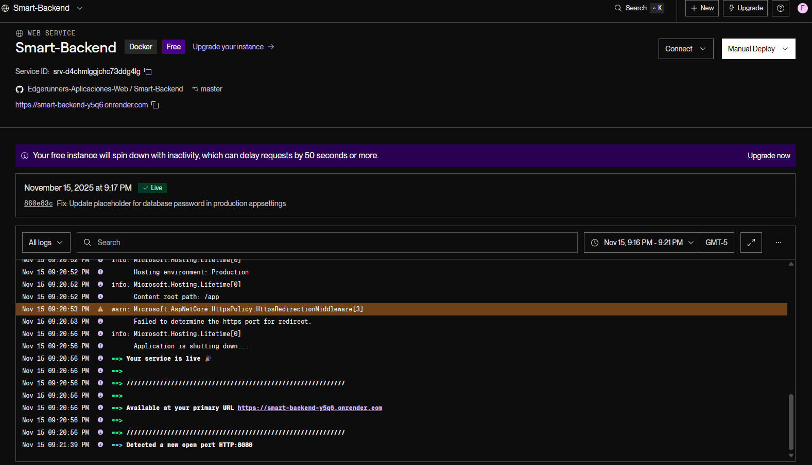

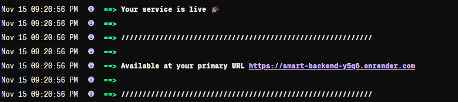

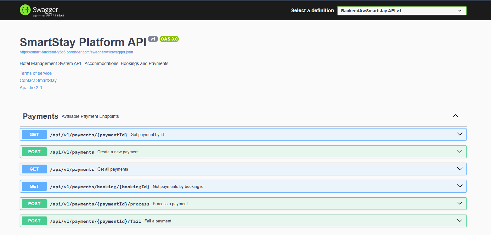

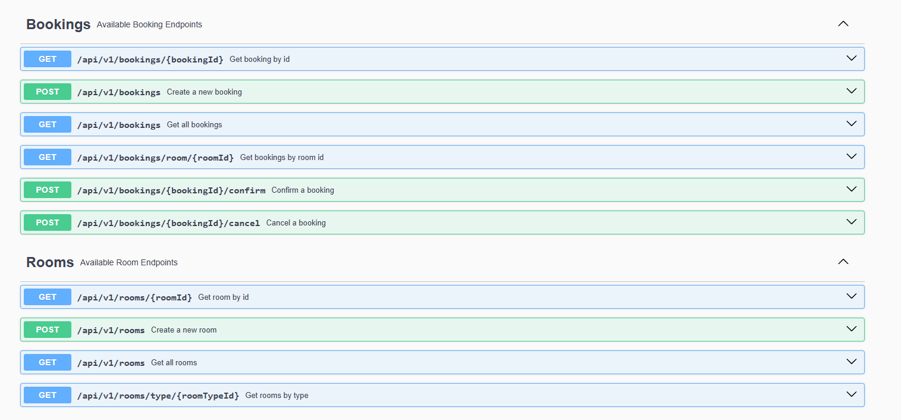

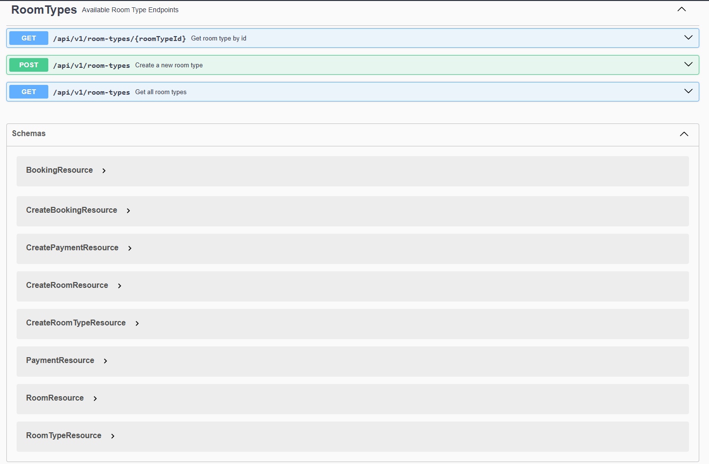

- **URL pública del servicio desplegado en Render:** https://smart-backend-y5q6.onrender.com/swagger/index.html

## 5.2.3.8. Team Collaboration Insights during Sprint.

Durante este Sprint, el equipo trabajó de manera colaborativa en el desarrollo del backend de Smart Stay, implementando la API RESTful siguiendo los principios de Domain-Driven Design (DDD). Además, se realizaron correcciones en el frontend, actualizaciones en el reporte y se mejoró la calidad de las User Stories y Technical Stories, eliminando referencias a UI y reescribiéndolas con formato API REST (endpoints específicos, códigos HTTP, estructura Given-When-Then).

Aunque surgieron limitaciones relacionadas con el tiempo y la experiencia técnica, el equipo logró consolidar una versión estable del backend con los bounded contexts de Accommodations, Bookings y Payments, optimizar el frontend y fortalecer la calidad general del proyecto.


### Acciones de colaboración destacadas

- Se utilizó **GitHub** como herramienta central para coordinar el trabajo, gestionar versiones y mantener un registro ordenado de los avances.
- Se reorganizó la estructura del repositorio, creando ramas específicas para el desarrollo del backend y corrección del frontend.
- Cada miembro realizó **commits documentados** detallando la implementación de funcionalidades en el backend, mejoras en el frontend y correcciones en el reporte.
- Se realizó una **revisión y mejora completa de las User Stories y Technical Stories**, eliminando referencias a UI y reescribiéndolas con formato API REST según estándares de calidad.
- Se realizaron **pull requests** y **revisiones de código** en equipo para validar la lógica del backend, verificar la configuración de base de datos y asegurar la corrección del frontend y reporte.
- Se utilizó **Trello** para la gestión visual de tareas y seguimiento del Sprint Backlog.

Gracias a este flujo de trabajo, el equipo pudo avanzar de forma paralela y ordenada, evitando conflictos y asegurando un resultado consistente. La implementación del backend siguiendo DDD permitió una arquitectura escalable y mantenible.


### 5.2.4. Sprint 4
#### 5.2.4.1. Sprint Planning 4

Para el sprint 4, el equipo realizó el sprint planning meeting para la distribución de tareas y revisión de errores a corregir. El resumen se mostrará a continuación:

| **Sprint 4** | **Sprint 4**                                                                                                                                                                                                                                                                                                                                                                                                                                                                                                                                                                                                                                                                                                                                                                                                                                                                     |
|--------------|----------------------------------------------------------------------------------------------------------------------------------------------------------------------------------------------------------------------------------------------------------------------------------------------------------------------------------------------------------------------------------------------------------------------------------------------------------------------------------------------------------------------------------------------------------------------------------------------------------------------------------------------------------------------------------------------------------------------------------------------------------------------------------------------------------------------------------------------------------------------------------|
| **Sprint Planning Background** |                                                                                                                                                                                                                                                                                                                                                                                                                                                                                                                                                                                                                                                                                                                                                                                                                                                                                  |
| **Date** | 01/12/25                                                                                                                                                                                                                                                                                                                                                                                                                                                                                                                                                                                                                                                                                                                                                                                                                                                                         |
| **Time** | 9:00 PM                                                                                                                                                                                                                                                                                                                                                                                                                                                                                                                                                                                                                                                                                                                                                                                                                                                                          |
| **Location** | Modalidad Remota por Discord                                                                                                                                                                                                                                                                                                                                                                                                                                                                                                                                                                                                                                                                                                                                                                                                                                                     |
| **Prepared By** | EdgeRunners                                                                                                                                                                                                                                                                                                                                                                                                                                                                                                                                                                                                                                                                                                                                                                                                                                                                      |
| **Attendees (to planning meeting)** | - Verona Flores, Italo Sebastián<br>- Valverde Portuguez, Natalia Ximena<br>- Seminario Castillo, Diego Vicente<br>- Jareth Beycker Vidal Malaga                                                                                                                                                                                                                                                                                                                                                                                                                                                                                                                                                                                                                                                                                                                                 |
| **Sprint n - 4 Review Summary** | Se creó la primera versión del backend, se deployo correctamente, se unio frontend -backend y se corrigió la mayoria de errores en el reporte. Además, se implementó el diseño final del frontend.                                                                                                                                                                                                                                                                                                                                                                                                                                                                                                                                                                                                                                                                               |
| **Sprint n - 4 Retrospective Summary** | Según los miembros del equipo, se logró corregir la mayoria del reporte, frontend y se implementó un backend sólido en la estructura para el consumo de API por parte del frontend.                                                                                                                                                                                                                                                                                                                                                                                                                                                                                                                                                                                                                                                                                              |
| **Sprint Goal & User Stories** |                                                                                                                                                                                                                                                                                                                                                                                                                                                                                                                                                                                                                                                                                                                                                                                                                                                                                  |
| **Sprint 4 Goal** | Our focus is on offering more secure access to guests, providing an enhanced profile management process to users, and incrementing new feature possibilities to the development team members. We believe it delivers easier authentication to visitors, more flexibility on profile updates to users, and opportunities for implementing more payment-related features in the hotel management ecosystem to development team. This will be confirmed when guests can register and log in securely in no more than three steps, users can update or delete their profiles without intervention of support staff, customers can complete online payments using input masks with accuracy and simplicity, and developers implement new features related to authentication, profiles, and payments using the implemented endpoints without intervention of backend development team. |
| **Sprint 4 Velocity** | 50                                                                                                                                                                                                                                                                                                                                                                                                                                                                                                                                                                                                                                                                                                                                                                                                                                                                               |
| **Sum of Story Points** | 50                                                                                                                                                                                                                                                                                                                                                                                                                                                                                                                                                                                                                                                                                                                                                                                                                                                                               |

#### 5.2.4.2. Aspect Leaders and Collaborators.
Durante este Sprint, el equipo se centró en la **integración del Frontend y Backend** de Smart Stay, asegurando la correcta comunicación entre los servicios, la implementación de endpoints funcionales, pruebas del flujo completo y la adaptación del frontend para consumir datos reales provenientes del backend.  

Como parte del trabajo colaborativo, se elaboró la Matriz de Liderazgo y Colaboración (LACX), donde se asignan los roles de Líder (L) y Colaborador (C) en los principales aspectos del Sprint.

| Team Member (Last Name, First Name) | GitHub Username | Integración Backend–Frontend (consumo de APIs) | Implementación de endpoints y servicios Backend | Adaptación del Frontend para datos reales | Pruebas integradas y validación funcional | Despliegue del sistema integrado |
|-------------------------------------|----------------|-------------------------------------------------|-------------------------------------------------|--------------------------------------------|--------------------------------------------|---------------------------------------------|
| **Verona Flores, Italo Sebastián**  | [@atomdragon1318](https://github.com/atomdragon1318) | L                                               | C                                               | C                                          | L                                          | C                                           |
| **Valverde Portuguez, Natalia Ximena** | [@NatValverde15](https://github.com/NatValverde15) | C                                               | L                                               | L                                          | C                                          | C                                           |
| **Seminario Castillo, Diego Vicente** | [@DiegoSeminario](https://github.com/DiegoSeminario) | C                                               | C                                               | C                                          | L                                          | L                                           |
| **Vidal Malaga, Jareth Beycker**    | [@Jareth341](https://github.com/Jareth341)  | C                                               | C                                               | C                                          | C                                          | L                                           |

#### 5.2.4.3. Sprint Backlog 4

**Objetivo del Sprint:** Finalizar el Bounded Context de Pagos (Frontend y Backend), integrar la Landing Page y conectar los servicios de IAM y Perfil con la interfaz de usuario.

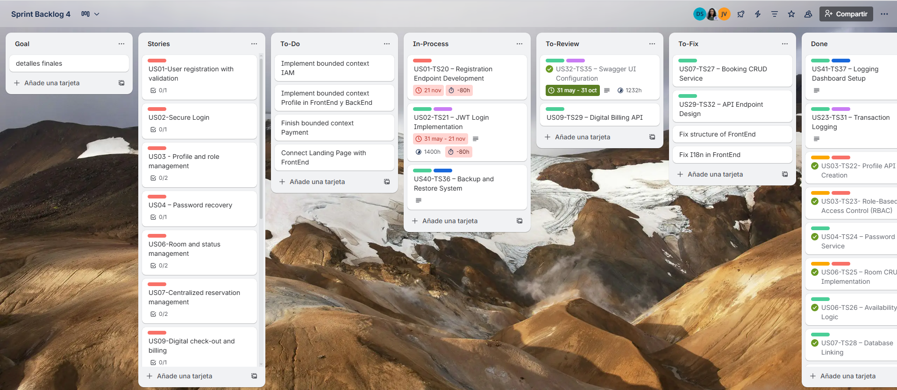

| Sprint # | User Story Id | User Story Title | Task Id | Task Title | Description | Est. (Horas) | Assigned To   | Status   |
| :--- | :--- | :--- | :--- | :--- | :--- | :--- |:--------------|:---------|
| **Sprint 4** | **US-23** | **Procesamiento de pagos digitales** | **UT-36** | **Diseño UI de Pasarela de Pagos** | **Crear la pantalla ("Pestaña de Pagos") con formulario para ingresar tarjeta, titular y monto.** | **5** | **Jareth**    | **Done** |
| **Sprint 4** | **US-23** | **Procesamiento de pagos digitales** | **UT-37** | **Validación de Formulario de Pago** | **Implementar validaciones en el Frontend (Luhn algorithm para tarjetas, fecha exp, CVV).** | **3** | **Alexander** | **Done** |
| **Sprint 4** | **US-23** | **Procesamiento de pagos digitales** | **UT-38** | **Integración API de Pagos** | **Conectar el formulario de pagos con el endpoint `TS15` (Procesar Pago) y manejar respuestas (éxito/error).** | **4** | **Italo**     | **Done** |
| **Sprint 4** | **US-24** | **Landing Page Segmentada** | **UT-39** | **Enrutamiento Landing-App** | **Conectar los botones "Ingresar" y "Registrarse" de la Landing Page con las rutas del Frontend de la aplicación.** | **2** | **Diego**     | **Done** |
| **Sprint 4** | **US-02** | **Inicio de sesión seguro** | **UT-40** | **Integración Frontend Login** | **Crear formulario de Login en Vue/Angular/React y consumir el endpoint de autenticación (guardar JWT).** | **4** | **Natalia**   | **Dne**  |
| **Sprint 4** | **US-04** | **Edición de perfil personal** | **UT-41** | **Vista de Perfil de Usuario** | **Desarrollar la interfaz para visualizar los datos del usuario consumiendo el endpoint `TS04`.** | **3** | **Natalia**   | **Done** |
| **Sprint 4** | **US-04** | **Edición de perfil personal** | **UT-42** | **Formulario de Edición de Perfil** | **Crear interfaz para modificar datos y conectar con el endpoint PUT de perfil.** | **3** | **Italo**     | **Done** |
| **Sprint 4** | **TS-26** | **Lógica de Disponibilidad** | **UT-26** | **Finalizar Lógica de Habitaciones** | *(Arrastrado del Sprint 3)* Implementar lógica para cambiar estados (disponible, reservado, mantenimiento). | **3** | **Jareth**    | **Done** |
| **Sprint 4** | **TS-14** | **Crear pago a través de API** | **UT-30** | **Finalizar Simulación Gateway** | *(Arrastrado del Sprint 3)* Completar la lógica backend para simular la respuesta del banco. | **2** | **Italo**     | **Done** |
| **Sprint 4** | **US-33** | **Webhooks para eventos** | **UT-43** | **Configuración de Webhook de Pago** | **Implementar webhook para notificar al usuario cuando el pago sea exitoso.** | **4** | **Natalia**   | **Done** |
| **Sprint 4** | **TS-35** | **Integración Swagger UI** | **UT-35** | **Testing de Endpoints en UI** | *(Arrastrado del Sprint 3)* Verificar que todos los nuevos endpoints de pagos funcionen correctamente en Swagger UI. | **2** | **Diego**     | **Done**   |


#### 5.2.4.4. Development Evidence for Sprint Review

| **Repository**  | **Branch**                           | **Commit ID**                            | **Author**     | **Time ago** |
|-----------------|--------------------------------------|------------------------------------------|----------------|--------------|
| Smart-Backend  | master                               | 2e649b18565f23df138acae42b07d7389d72a617 | atomdragon1318 | 1 days ago   |
| Smart-Backend  | feature/development                  | 860e83ce682a2c31e651162e85a81bdd23699f01 | atomdragon1318 | 3 weeks ago  |
| Smart-Backend  | feature/documentation                | 2536c95ced206c47b2f4bcd2b60037ef7138cae5 | atomdragon1318 | last week    |
| Smart-Backend  | feature/natalia                      | 2e649b18565f23df138acae42b07d7389d72a617 | atomdragon1318 | 14 days ago  |
| Smart-Backend  | feature/tb2                           | 439754c79c9b0c248464cf3bdaf52d96ea3cdabc | shiloox        | 1 days ago   |
| Smart-Backend  | feature/jareth                        | 3b070b306b13c1b89832e56be905d7ef2fa1cce2| Jareth341        | 1 days ago   |
| Smart-Backend  | feature/jareth                        | 780c7ef1e8fb3c19890c2b0c890e76a25e182be9 | Jareth341        | 1 days ago   |

#### 5.2.4.5. Execution Evidence for Sprint Review

El despliegue se realizó exitosamente y se puede visualizar su funcionamiento. Este se encuentra en el siguiente enlace: https://smart-backend-y5q6.onrender.com/swagger/index.html
*"El estado actual del proyecto Smart Stay, como se evidencia en la documentación visual adjunta, demuestra una arquitectura Backend robusta desplegada en la nube (Render) y documentada (Swagger), lista para soportar transacciones complejas. A nivel de Frontend, se ha logrado implementar el flujo visual completo del huésped, desde la selección de hoteles hasta la interfaz de la pasarela de pagos.

Las imágenes del tablero Kanban confirman que, habiendo superado los desafíos de infraestructura (configuración de Docker y conectividad de red), el foco estratégico del Sprint 4 es estrictamente la integración: conectar los formularios de UI de Pagos y Autenticación con los endpoints ya existentes en el Backend para cerrar el ciclo de negocio."*

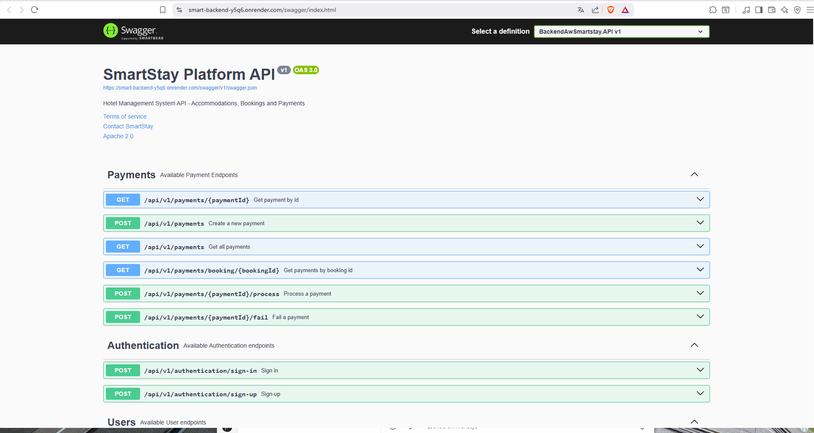
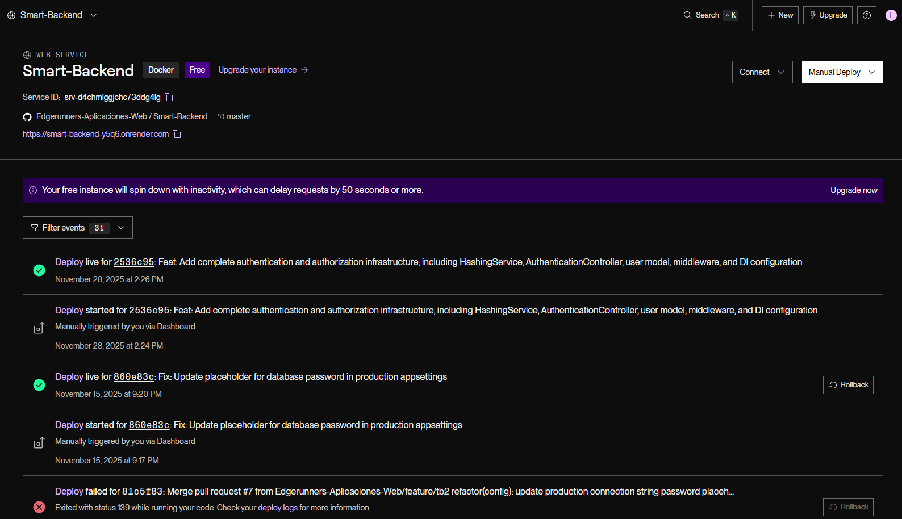
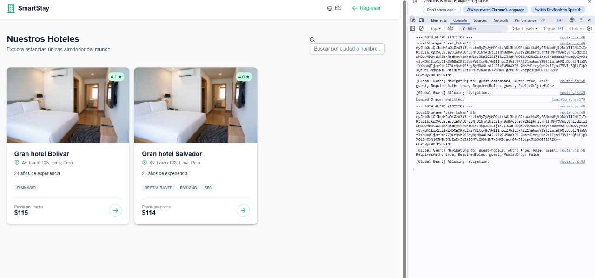
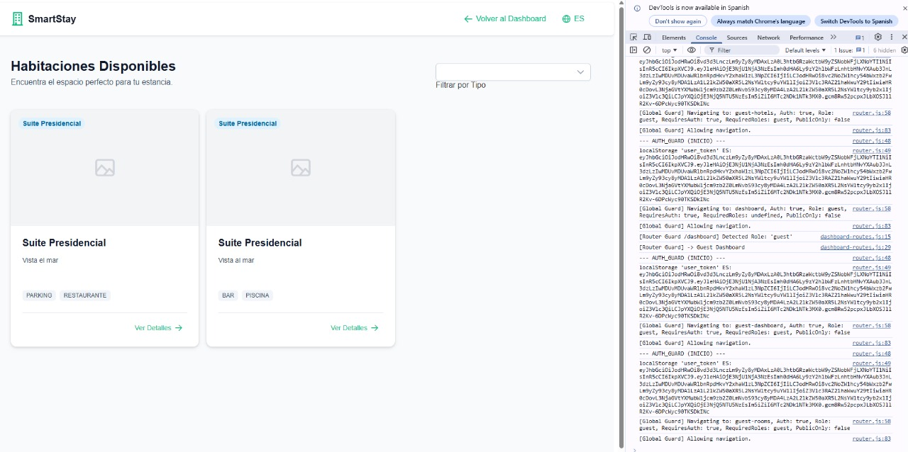
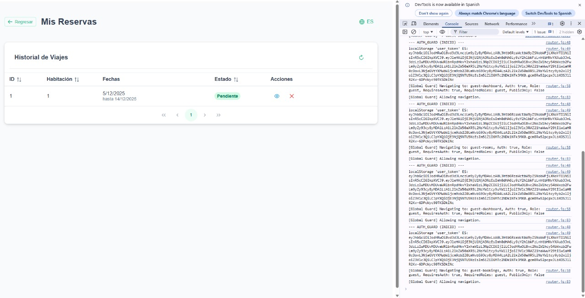
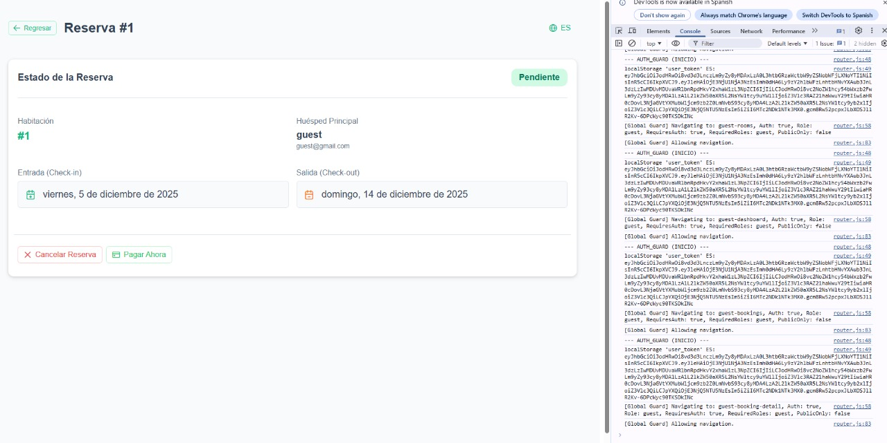
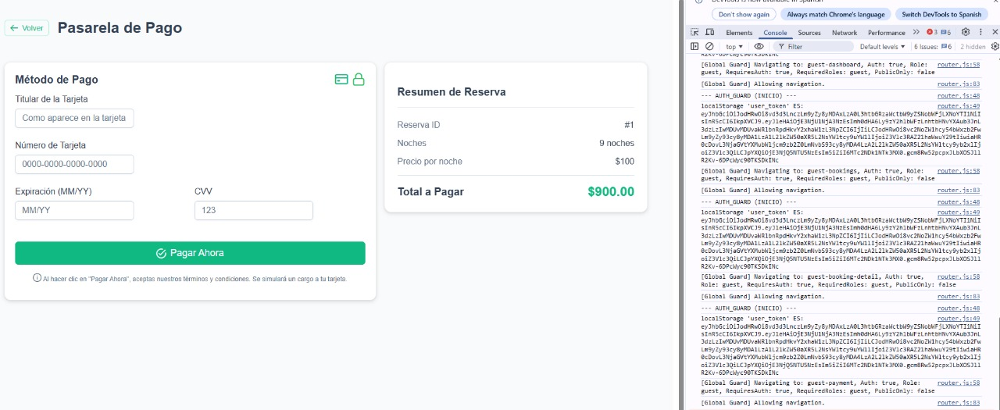

#### 5.2.4.6. Services Documentation Evidence for Sprint Review

Para el uso de datos en el frontend se utiliza la API del backend desarrollado y desplegado.

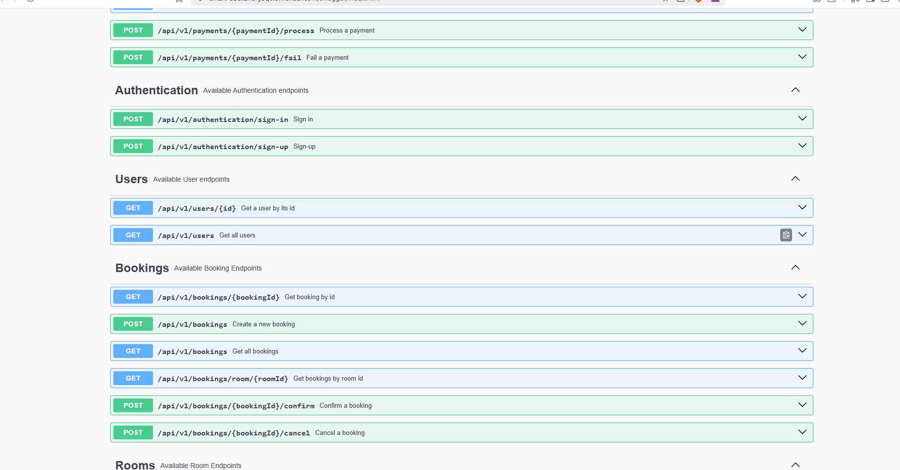

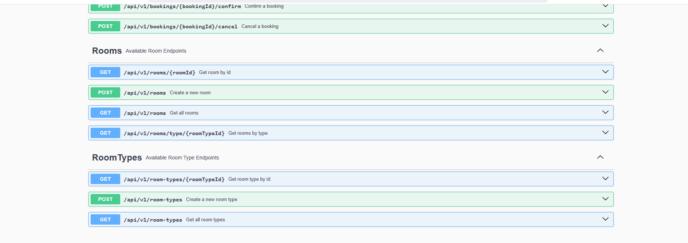


## 5.2.4.7. Software Deployment Evidence for Sprint Review


El despliegue del backend de SmartStay se realizó utilizando **Render**, un servicio en la nube que permite ejecutar aplicaciones en contenedores Docker. El proceso de deployment se integra directamente con GitHub, lo que hace posible que los cambios en la rama principal (`master`) se desplieguen automáticamente en el entorno de producción.


1. Conexión con GitHub y Rama de Producción
   El servicio de Render fue configurado para monitorear el repositorio del proyecto y desplegar cada actualización realizada en la rama `master`.  
   Esto permite que cualquier avance validado por el equipo se publique automáticamente sin intervenciones manuales.

2. Proceso Automático de Build y Deploy
   Cada vez que se detecta un nuevo commit en `master`, Render ejecuta el siguiente flujo:

- *Descarga del código fuente* desde el repositorio.
- *Construcción del contenedor Docker*, utilizando el `Dockerfile` del proyecto.
- *Compilación y verificación de dependencias* del backend.
- *Inicialización del servicio*, exponiéndolo en la URL pública del backend:
   ```
   https://smart-backend-jv56p.onrender.com
   ```
- *Verificación de estado*: si el servicio inicia correctamente, Render lo mantiene activo; si ocurre algún error, el despliegue se marca como fallido.

Este proceso garantiza consistencia entre el código entregado por el equipo y la versión que se ejecuta en producción.

3. Manejo de Fallos y Rollback
   Si durante el build o la ejecución del contenedor ocurre un error, Render:

- marca el deployment como **fallido**,
- conserva la última versión estable del backend,
- permite realizar un **rollback** de forma segura.

Esto asegura que el servicio continúe funcionando sin interrupciones mientras se corrigen los errores detectados.

4. Resultados del Deployment
   Tras aplicar las configuraciones necesarias (como variables de entorno, conexión a la base de datos y servicios de autenticación), el backend pudo desplegarse correctamente.  
   Actualmente, la API se encuentra disponible en producción, sirviendo los endpoints correspondientes a:

- Authentication
- Users
- Bookings
- Payments
- Rooms
- Room Types


#### 5.2.4.8. Team Collaboration Insights during Sprint
Durante este Sprint, uno de los avances clave fue la integración entre el frontend y el backend, permitiendo conectar los componentes visuales con la lógica de negocio de Smart Stay. Para lograr esta integración, el equipo realizó diversas acciones técnicas y de colaboración, entre las que destacan:

- Consumo de los nuevos endpoints generados para Bookings, Rooms, Payments y Authentication, asegurando su correcto funcionamiento desde el frontend.
- Verificación de la comunicación entre ambos módulos mediante peticiones HTTP (GET, POST) hacia la API desplegada.
- Ajustes en los componentes del frontend para recibir, renderizar y manejar los datos provenientes del backend.
- Corrección de rutas, formatos JSON y manejo de estados para garantizar una experiencia de usuario fluida.
- Validación conjunta del equipo para asegurar que las funcionalidades integradas operen de forma estable en distintos entornos.

En cuanto al trabajo colaborativo, se utilizaron diversas herramientas y prácticas de ingeniería:

- GitHub fue la herramienta central para coordinar el trabajo, gestionar versiones y mantener un historial claro de cambios.
- Se reorganizó la estructura del repositorio y se crearon ramas específicas para el desarrollo del backend, la corrección del frontend y la actualización del reporte final.
- Cada integrante realizó commits documentados, describiendo la implementación de nuevos endpoints, ajustes en controladores, mejoras en las vistas y correcciones en la documentación.
- Se completó una revisión profunda de las User Stories y Technical Stories, eliminando referencias a UI y reformulándolas con un enfoque API REST y usando el formato Given–When–Then.
- Se realizaron pull requests y revisiones en equipo para validar la lógica de negocio, la conexión con la base de datos y la interacción correcta entre módulos.


## 5.3. Validation Interviews.

## 5.3.1. Diseño de Entrevistas. 

### Entrevista – Segmento 1: Administradores de Hoteles Boutique y Pequeños

1. ¿Qué impresión te dejó la herramienta después de ver la demostración?
2. ¿La interfaz y la organización de la información te parecieron claras y fáciles de seguir?
3. ¿Qué partes del sistema te parecieron más útiles para tu hotel?
4. ¿Hay alguna función que no te parezca relevante para tu operación diaria?
5. Si implementaras esta herramienta, ¿qué procesos crees que mejorarían más? (reservas, pagos, personal, disponibilidad, reportes…)
6. ¿Cómo encajaría esta aplicación con la forma en la que actualmente gestionas el hotel?
7. ¿Crees que tu equipo podría adaptarse fácilmente al uso de esta herramienta?
8. En tu experiencia, ¿ves que esta app podría ayudar a evitar problemas como sobrerreservas, errores de disponibilidad o fallas en la facturación?
9. ¿Qué cosa en la app mejorarías para que se ajuste mejor a tu hotel?
10. ¿Qué te haría dudar en implementar una herramienta como esta? (costos, capacitación, tiempo, desconfianza, resistencia del personal, etc.)
11. Basado en lo que viste, ¿pagarías una suscripción mensual por este sistema?
12. ¿Qué rango de precio te parecería razonable para un hotel de tu tamaño?
13. Si pudieras pedir una mejora o nueva función antes de usar esta app en tu hotel, ¿cuál sería?
14. ¿Te gustaría probar una versión piloto en tu hotel cuando esté lista?

### Entrevista – Segmento 2: Huéspedes de Hoteles

1. ¿Qué impresión general te dejó la aplicación después de la demostración?
2. ¿La interfaz se te hizo intuitiva y fácil de entender?
3. ¿Qué parte te pareció más útil?
4. ¿Hay alguna función que no te parezca necesaria para ti como huésped?
5. ¿Sientes que este sistema haría más cómoda tu estadía en comparación con un hotel tradicional?
6. ¿Qué te sorprendió o llamó más la atención de manera positiva?
7. ¿Hay algo que te generaría desconfianza al usar este tipo de sistema?
8. ¿Preferirías interacción humana en algún punto, aunque exista el sistema digital?
9. Si dos hoteles ofrecieran lo mismo, pero uno tuviera esta experiencia digital, ¿cuál elegirías?
10. ¿Pagarías un poco más por la experiencia digital? ¿Cuánto aproximadamente?
11. ¿Qué agregarías o cambiarías para que la experiencia del huésped sea más cómoda?
12. ¿Qué parte de la demostración te pareció menos clara o más débil?

---

## 5.3.2. Registro de Entrevistas. 

### Entrevista – Segmento 1: Administradores de Hoteles Boutique y Pequeños

#### Entrevista 1

Datos del entrevistado:

**Nombre completo:**  Alejandra Beltrán Diaz

**Edad:** 23 años

**Ciudad:** Tarapoto

**Duración:** 7:35 minutos

**Evidencia:** 

**URL del video:** 
https://tinyurl.com/5n94ewyf

**Resumen de la entrevista** 

El entrevistado considera que la aplicación es práctica, clara y fácil de usar. Sugiere agregar más detalles del huésped, como el estado completo de pagos, y la posibilidad de ver reservas pasadas y futuras. Cree que, con esas funciones, la implementaría sin dudas. Está dispuesto a pagar hasta 120 soles mensuales y usaría la herramienta con gusto una vez esté completa.

---

#### Entrevista 2

Datos del entrevistado:

**Nombre completo:** Adrian Nicholaiv Saavedra Angulo 

**Edad:** 34

**Ciudad:** Tarapoto

**Duración:**  8:37 minutos

**Evidencia:** 

**URL del video:** 
https://tinyurl.com/bdnc3jm8

**Resumen de la entrevista**
Adrián considera que la aplicación es práctica y fácil de usar, y cree que su equipo podría adaptarse sin problema. Sugiere añadir información detallada del huésped, como estado de pago, monto pendiente, historial de reservas, preferencias alimenticias o restricciones. Ve importante poder consultar todas las reservas, pasadas y futuras. Está dispuesto a pagar hasta 100 soles, aunque tendría dudas si el precio fuera elevado. Una vez terminada la herramienta con estas funciones, afirma que la usaría sin dudar.

---

#### Entrevista 3

Datos del entrevistado:

**Nombre completo:** Alessandro Daniel Bravo Castillo

**Edad:** 27

**Ciudad:** Lima

**Duración:**  5:24 minutos

**Evidencia:** 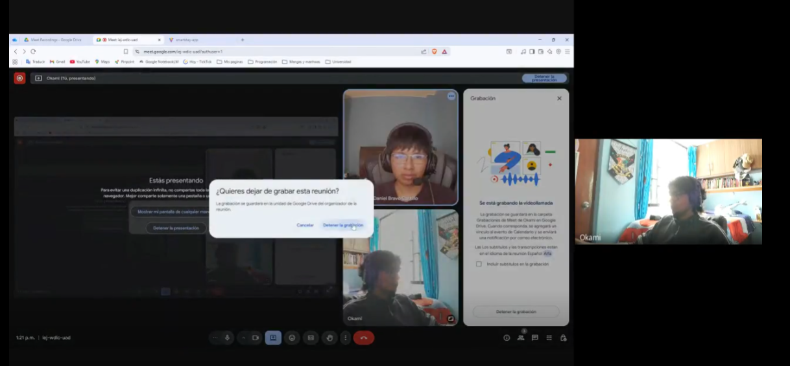

**URL del video:**
https://tinyurl.com/y85aj7s4

**Resumen de la entrevista**

Alessandro Bravo calificó la herramienta como bastante eficiente, destacando su interfaz sencilla e intuitiva, con diseño claro y acciones bien ubicadas; valoró especialmente la gestión de staff por ofrecer mayor control sobre los empleados, la gestión de habitaciones por su claridad en disponibilidad y servicios, y la mejora de procesos clave como reservas y reportes al reemplazar métodos engorrosos como Excel; sugirió añadir un dashboard específico para habitaciones en promoción; afirmó que la app encajaría muy bien en su hotel, ayudaría a prevenir errores como la sobre-reserva, y que el equipo podría adaptarse fácilmente con buena capacitación, mostrando confianza en su implementación por considerarla confiable y fácil de usar

---

#### Entrevista 4

Datos del entrevistado:

**Nombre completo:** Jorge Linares

**Edad:** 29

**Ciudad:** Lima

**Duración:**  8:39 minutos

**Evidencia:** 

**URL del video:**
https://tinyurl.com/4k3kr4mv

**Resumen de la entrevista**

Jorge Linares tuvo una impresión muy positiva de la aplicación de gestión hotelera, destacando su interfaz intuitiva y ordenada con nombres descriptivos que facilitan el uso; valoró especialmente la agilidad, automatización y el módulo de reservas por su vista detallada, además de la capacidad del sistema para prevenir errores como la sobre-reserva y centralizar información dispersa; sugirió mejoras como un módulo de pagos, exportación de reportes en PDF y funciones para coordinar al personal, además de asegurar la escalabilidad para hoteles grandes; consideró que su equipo podría adaptarse fácilmente con una breve capacitación y estaría dispuesto a pagar una suscripción mensual si el precio es razonable y la herramienta se mantiene estable.


---

### Entrevista – Segmento 2: Huéspedes de Hoteles Boutique

#### Entrevista 1

Datos del entrevistado:

**Nombre completo:** Vanessa Choy Robles

**Edad:** 25 años

**Distrito:** Jesus María – Lima Metropolitana

**Duración:** 04:05 minutos

**Evidencia:** 

**URL del video:** https://tinyurl.com/4yn7pm2w

**Resumen de la entrevista**

La usuaria tuvo una impresión muy positiva de la aplicación, resaltando que es clara, sencilla e intuitiva. Consideró útiles los filtros para elegir habitaciones y mencionó que, aunque la app tiene lo esencial, sería útil agregar servicios del hotel. Percibe que la experiencia digital haría su estadía más cómoda y valora especialmente la simplicidad de la interfaz, aunque le preocupa que puedan ocurrir fallos al procesar reservas o pagos. Prefiere interacción humana solo en casos específicos y estaría dispuesta a pagar unos 25 soles más por esta experiencia. Como mejoras, sugiere incluir check-in y check-out digitales y aclarar mejor la parte de pagos, que fue lo menos comprendido durante la demostración.

---

#### Entrevista 2

Datos del entrevistado:

**Nombre completo:** Nicole Yamile Avila Ayquipa

**Edad:** 25 años

**Distrito:** Lima, centro de Lima

**Duración:** 03:51 minutos

**Evidencia:** 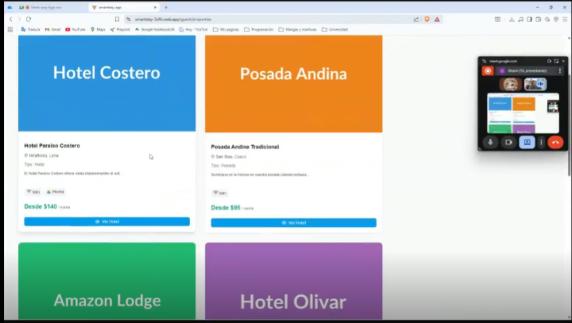

**URL del video:** https://tinyurl.com/bdd2t8cu

**Resumen de la entrevista**

Nicole Ávila tuvo una buena impresión de la aplicación, destacando su practicidad al centralizar información de varios hoteles y su interfaz intuitiva con ventanas rotativas que facilitan la exploración; valoró especialmente la agenda de reservas por su orden y claridad, así como la posibilidad de tomar decisiones más informadas gracias a las reseñas de otros huéspedes, sin encontrar funciones innecesarias; aunque considera el sistema confiable, sugirió incorporar una ventana de asistencia virtual para mantener interacción humana; afirmó que preferiría hoteles con esta experiencia digital y estaría dispuesta a pagar más por la seguridad que le brinda al elegir con mayor información.

---

## 5.3.3. Evaluaciones según heurísticas.

### UX Heuristics & Principles Evaluation
**Usability – Inclusive Design – Information Architecture**

- **CARRERA:** Ingeniería de Software
- **CURSO:** Aplicaciones Web
- **SECCIÓN:** 7454
- **PROFESORES:** Todos
- **AUDITOR:** Los Bytes
- **CLIENTE(S):** Administradores de Hoteles Boutique y Pequeños / Huéspedes
- **SITE/APP EVALUADA:** Smart Stay

---

### TAREAS EVALUADAS
- Gestión y consulta de reservas históricas y activas (Administradores)
- Acceso a información profunda del huésped (Administradores)
- Reserva de habitaciones (Huéspedes)
- Pago de reservas (Huéspedes)
- Consulta de servicios del hotel (Huéspedes)

#### TAREAS NO INCLUIDAS
- Control de habitación digital
- Integración con marketplaces
- Personalización avanzada
- Check-in/out automatizado

---

### ESCALA DE SEVERIDAD
- **0** = No es un problema
- **1** = Problema cosmético
- **2** = Baja severidad
- **3** = Alta severidad
- **4** = Catastrófico

---

### TABLA RESUMEN (Los Bytes)

| # | Heurística afectada                    | Severidad | Área                   | ¿Requiere rediseño? |
|---|----------------------------------------|-----------|------------------------|---------------------|
| 1 | Visibilidad del estado del sistema     | 3         | Información de huésped | Sí                  |
| 2 | Reconocimiento por encima del recuerdo | 2         | Historial de reservas  | Sí                  |
| 3 | Mapeo natural (coherencia conceptual)  | 3         | Flujo de pago          | Sí                  |
| 4 | Encontrabilidad (Findability)          | 2         | Servicios disponibles  | Parcial             |
| 5 | Control y libertad del usuario         | 2         | Tareas del huésped     | Parcial             |
| 6 | Prevención de errores                  | 3         | Reservas y pagos       | Sí                  |

---

### DESCRIPCIÓN DE PROBLEMAS – Los Bytes

#### PROBLEMA 1 – Información fragmentada del huésped
- **Severidad:** 3
- **Heurística violada:** Visibilidad del estado del sistema
- **Problema:** La vista actual ofrece datos parciales, lo que obliga a los administradores a depender de múltiples pantallas para reconstruir el perfil del huésped. Según Nielsen (1994), la visibilidad inmediata del estado del sistema disminuye el esfuerzo cognitivo, algo que aquí no ocurre.
- **Recomendación:** Diseñar un perfil unificado, con secciones diferenciadas: pagos, historial, preferencias y restricciones. Agrupar información crítica usando jerarquías visuales definidas en Arquitectura de Información (Morville & Rosenfeld, 2015).

---

#### PROBLEMA 2 – Reservas pasadas y futuras difíciles de ubicar
- **Severidad:** 2
- **Heurística violada:** Reconocimiento por encima del recuerdo
- **Problema:** La ausencia de una vista cronológica obliga a memorizar fechas o navegar múltiples pantallas. Esto contradice el principio de reducir la carga de memoria a corto plazo (Baddeley, 2012).
- **Recomendación:** Incorporar vista tipo timeline o calendario mensual con filtros de estado, ocupación y huésped.

---

#### PROBLEMA 3 – Flujo de pago con pobre mapeo conceptual
- **Severidad:** 3
- **Heurística violada:** Mapeo natural (sistema y mundo real)
- **Problema:** Los pasos del pago no se sienten intuitivos ni siguen el orden mental del usuario (selección → confirmación → pago). Norman (2013) argumenta que la interfaz debe imitar modelos mentales familiares.
- **Recomendación:** Implementar un flujo lineal guiado con indicadores de progreso, resumen previo y mensajes de verificación explícitos.

---

#### PROBLEMA 4 – Servicios del hotel poco visibles
- **Severidad:** 2
- **Heurística violada:** Encontrabilidad (Findability)
- **Problema:** La arquitectura de contenido no prioriza información relevante para la toma de decisiones del huésped. Morville (2010) resalta que la encontrabilidad es un eje en experiencias de descubrimiento.
- **Recomendación:** Crear módulo con iconografía accesible, descripciones simples y agrupaciones temáticas (spa, comida, actividades).

---

#### PROBLEMA 5 – Falta de mecanismos de control/retroceso
- **Severidad:** 2
- **Heurística violada:** Control y libertad del usuario
- **Problema:** No siempre se dispone de botones de retroceso o cancelación en interacciones clave.
- **Recomendación:** Asegurar un patrón consistente: cancelar, deshacer, volver.

---

#### PROBLEMA 6 – Ausencia de retroalimentación robusta ante fallos en pagos o reservas
- **Severidad:** 3
- **Heurística violada:** Prevención de errores y retroalimentación
- **Problema:** No existen mecanismos de alerta inmediata. Según Shneiderman & Plaisant (2010), la retroalimentación instantánea es vital en acciones críticas.
- **Recomendación:** Validación en tiempo real, confirmaciones visibles y mensajes de error accionables.

## 5.4. Video About-the-Product.

El Video About-the-Product de Smart Stay está dirigido a dos públicos principales: los visitantes del Landing Page que desean conocer el modelo de negocio y las características principales de la plataforma, y los usuarios de las aplicaciones que necesitan realizar tareas relacionadas con los procesos soportados por la solución.

Este video presenta de manera clara y concisa las funcionalidades clave de Smart Stay, incluyendo la gestión de reservas para administradores de hoteles boutique y la experiencia de reserva y pago para huéspedes. El tono utilizado es profesional y accesible, alineado con la identidad visual y comunicacional de la plataforma.

### Contenido del Video

El video incluye:

- **Modelo de negocio:** Explicación de cómo Smart Stay ayuda a los hoteles boutique a gestionar sus operaciones de manera eficiente.
- **Características principales:** Demostración de las funcionalidades core de la plataforma para administradores y huéspedes.
- **Procesos soportados:** Flujos de trabajo para gestión de reservas, información de huéspedes, proceso de pago y acceso a servicios del hotel.
- **Experiencia de usuario:** Visualización de la interfaz y navegación de la aplicación.

### Testimonio de Usuario

Durante las sesiones de validación, los usuarios expresaron opiniones positivas sobre la plataforma. A continuación, un testimonio destacado:

> *"La aplicación es práctica, clara y fácil de usar. Creo que mi equipo podría adaptarse sin problema. Una vez terminada la herramienta con las funciones sugeridas, la usaría sin dudar."*  
> **— Adrián Nicholaiv Saavedra Angulo, Administrador de Hotel (34 años, Tarapoto)**

### Metadatos del Video

**Screenshot del Video:**

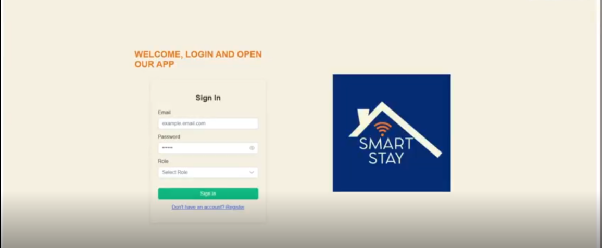

**URL de Microsoft Stream:**

Video About-the-Product : https://tinyurl.com/ytrwc5xj

**URL de YouTube (para incrustar en Landing Page):**

Video about the proyect : https://youtu.be/R7d_tfMvb5c

**Duración del Video:**

8:40 minutos

<div style="page-break-after: always;"></div>


## Conclusiones

A lo largo del desarrollo del proyecto Smart Stay, se lograron avances significativos en la implementación de una solución integral para la gestión de hoteles boutique. El trabajo realizado durante los tres sprints permitió consolidar tanto el frontend como el backend de la plataforma, siguiendo principios de Domain-Driven Design y arquitectura por bounded contexts.

### Logros Principales

Durante el **Sprint 3**, el equipo se enfocó en el desarrollo del Backend API REST, implementando los bounded contexts core del negocio: Accommodations, Bookings y Payments. Se estableció una base sólida con  Entity Framework Core y MySQL, proporcionando una API RESTful documentada con Swagger/OpenAPI que permite la integración con el frontend y futuras expansiones.

La mejora de las User Stories y Technical Stories fue un logro importante, eliminando referencias a elementos de UI y estructurando las Technical Stories con formato API REST, lo que facilitará la integración y el desarrollo futuro.

### Validación con Usuarios

Las sesiones de validación con administradores de hoteles y huéspedes proporcionaron retroalimentación valiosa. Los usuarios destacaron la claridad y facilidad de uso de la aplicación, aunque identificaron áreas de mejora importantes como la necesidad de información más detallada del huésped, visualización de reservas pasadas y futuras, y clarificación del proceso de pago.

### Desafíos y Aprendizajes

El proyecto enfrentó desafíos relacionados con el tiempo disponible y la experiencia técnica del equipo. Sin embargo, estos desafíos se convirtieron en oportunidades de aprendizaje, permitiendo al equipo desarrollar habilidades en arquitectura de software, desarrollo de APIs REST, y trabajo colaborativo mediante herramientas como GitHub y Trello.

### Reflexión Final

El desarrollo de Smart Stay representó un ejercicio completo de ingeniería de software, desde la concepción y diseño hasta la implementación y validación con usuarios reales. El equipo Edgerunners logró construir un producto cohesivo que integra múltiples tecnologías y principios de diseño de software modernos.
La experiencia adquirida durante los cuatro sprints del proyecto no solo resultó en un producto funcional, sino también en el desarrollo de competencias profesionales esenciales para la industria del software: trabajo en equipo efectivo, comunicación técnica clara, adaptabilidad ante desafíos técnicos, y compromiso con la calidad del producto final.
Smart Stay está ahora posicionado como una solución completa y operativa que puede transformar la manera en que los hoteles boutique gestionan sus operaciones, marcando el inicio de una nueva era de hospitalidad digital e inteligente.

### About-The-Team

**URL de Microsoft Stream:** https://n9.cl/f59e0
**Youtube** : https://n9.cl/f59e0


<div style="page-break-after: always;"></div>

## Bibliografía

### Documentación Técnica

- Microsoft. (2024). *ASP.NET Core Documentation*. Recuperado de https://learn.microsoft.com/en-us/aspnet/core/

- Microsoft. (2024). *Entity Framework Core Documentation*. Recuperado de https://learn.microsoft.com/en-us/ef/core/

- Oracle Corporation. (2024). *MySQL Documentation*. Recuperado de https://dev.mysql.com/doc/

- Swagger. (2024). *OpenAPI Specification*. Recuperado de https://swagger.io/specification/

### Arquitectura y Diseño

- Evans, E. (2003). *Domain-Driven Design: Tackling Complexity in the Heart of Software*. Addison-Wesley Professional.

- Martin, R. C. (2017). *Clean Architecture: A Craftsman's Guide to Software Structure and Design*. Prentice Hall.

### Metodologías Ágiles

- Schwaber, K., & Sutherland, J. (2020). *The Scrum Guide*. Recuperado de https://scrumguides.org/

- Cohn, M. (2004). *User Stories Applied: For Agile Software Development*. Addison-Wesley Professional.

### Usabilidad y Experiencia de Usuario


- W3C. (2021). *Web Content Accessibility Guidelines (WCAG) 2.1*. Recuperado de https://www.w3.org/WAI/WCAG21/quickref/

### Herramientas y Plataformas

- GitHub. (2024). *GitHub Documentation*. Recuperado de https://docs.github.com/

- Render. (2024). *Render Documentation*. Recuperado de https://render.com/docs

<div style="page-break-after: always;"></div>


## Anexos

### Anexo A - User Stories

| Epic / Story ID | Title | Description | Acceptance Criteria | Related to (Epic ID) |
|-----------------|-------|-------------|---------------------|---------------------|
| **EP-01** | **Authentication and User Management** | Epic that groups functionalities for registration, login, profile management, and role-based access control for all user types (administrators, staff, guests). | | - |
| **EP-02** | **Central Hotel Management** | Epic that includes reservation administration, room management, digital check-in/check-out, daily operational management, and internal service coordination. | | - |
| **EP-03** | **Guest Digital Experience** | Epic focused on guest experience: IoT environmental control, personalized services, digital communication, and post-stay evaluation. | | - |
| **EP-04** | **Analytics and Reporting** | Epic covering management dashboard, occupancy reports, operational KPIs, satisfaction analysis, and financial metrics. | | - |
| **EP-05** | **Integrations and External Channels** | Epic for connections with OTAs, WhatsApp, payment systems, digital reputation, and third-party webhooks. | | - |
| **EP-06** | **Landing Page and Digital Marketing** | Epic for the static website with segment-specific information, success stories, simulators, and commercial contact channels. | | - |
| **EP-07** | **RESTful API and Technical Services** | Epic including endpoints, API authentication, technical documentation, monitoring, and external system integration. | | - |
| **EP-08** | **Notifications and Communication** | Epic for push notification system, email, SMS, automatic alerts, and staff-guest communication. | | - |
| US-01 | User registration with validation | **As** a new user, **I want** to register in Smart Stay by validating my email **to** access functionalities according to my role. | **Scenario 1: Successful registration**<br>**Given** I am a new user with valid data, **when** I complete the registration form, **then** my account is created correctly and I receive email confirmation.<br><br>**Scenario 2: Email already registered**<br>**Given** I attempt to register with an existing email, **when** I submit the form, **then** the system shows "Email already registered" message and suggests password recovery.<br><br>**Scenario 3: Incomplete data**<br>**Given** I leave mandatory fields empty, **when** I try to register, **then** the system highlights missing fields and doesn't allow continuation.<br><br>**Scenario 4: Email format validation**<br>**Given** I enter an invalid email format, **when** I submit the form, **then** the system shows format error. | EP-01 |
| US-02 | Secure login | **As** a registered user, **I want** to login securely **to** access my personalized dashboard according to my role. | **Scenario 1: Correct login**<br>**Given** I have valid credentials, **when** I login, **then** I access my corresponding dashboard (admin/guest/staff).<br><br>**Scenario 2: Incorrect credentials**<br>**Given** I enter incorrect data, **when** I try to access, **then** I receive error message without revealing whether the problem is email or password.<br><br>**Scenario 3: Blocked account**<br>**Given** login failed 5 consecutive times, **when** I try again, **then** the account is temporarily blocked and I receive notification.<br><br>**Scenario 4: Persistent session**<br>**Given** I check "remember me", **when** I close and open the browser, **then** I remain logged in until I manually logout. | EP-01 |
| US-03 | Profile and role management | **As** an administrator, **I want** to manage users, assign roles and permissions **to** control access to different functionalities. | **Scenario 1: Create staff user**<br>**Given** I am admin, **when** I create a staff user, **then** I can assign specific permissions (housekeeping, front desk, maintenance).<br><br>**Scenario 2: Modify permissions**<br>**Given** there is a staff user, **when** I change their permissions, **then** their access is updated immediately.<br><br>**Scenario 3: Deactivate user**<br>**Given** I need to deactivate a user, **when** I do so, **then** they lose access but their history is maintained.<br><br>**Scenario 4: Access audit**<br>**Given** I need to review activity, **when** I consult logs, **then** I see date, time, user and action performed. | EP-01 |
| US-04 | Password recovery | **As** a user, **I want** to recover my password via email **to** regain access to my account. | **Scenario 1: Valid request**<br>**Given** I request password recovery with registered email, **when** I send the request, **then** I receive reset link via email.<br><br>**Scenario 2: Unregistered email**<br>**Given** I request with unregistered email, **when** I send request, **then** I receive generic message without revealing if email exists.<br><br>**Scenario 3: Expired link**<br>**Given** the reset link is older than 30 minutes, **when** I try to use it, **then** it expires and I must request a new one.<br><br>**Scenario 4: Successful change**<br>**Given** I have valid link, **when** I set new password, **then** it updates and I receive confirmation. | EP-01 |
| US-05 | Administrator dashboard | **As** an administrator, **I want** a centralized panel with key information **to** manage my hotel efficiently. | **Scenario 1: General view**<br>**Given** I access the dashboard, **when** it loads, **then** I see current occupancy, daily check-ins/outs, pending tasks and important alerts.<br><br>**Scenario 2: Date filters**<br>**Given** I want to review specific period, **when** I select date range, **then** all indicators update.<br><br>**Scenario 3: Quick access**<br>**Given** I'm on the dashboard, **when** I click any metric, **then** I navigate to corresponding detailed section.<br><br>**Scenario 4: Real-time updates**<br>**Given** there are operational changes, **when** they occur, **then** the dashboard updates automatically without reloading the page. | EP-02 |
| US-06 | Room and status management | **As** an administrator, **I want** to manage all room statuses **to** optimize daily operations. | **Scenario 1: Change room status**<br>**Given** I select a room, **when** I change its status (available/occupied/cleaning/maintenance), **then** it updates immediately and notifies corresponding staff.<br><br>**Scenario 2: Room map view**<br>**Given** I access room map, **when** it loads, **then** I see all statuses with color codes and can make quick changes.<br><br>**Scenario 3: Change history**<br>**Given** I need to review changes, **when** I consult room history, **then** I see all status changes with date, time and responsible user.<br><br>**Scenario 4: Automatic alerts**<br>**Given** a room is in maintenance for more than 24 hours, **when** time passes, **then** I receive automatic alert. | EP-02 |
| US-07 | Centralized reservation management | **As** an administrator, **I want** to manage all reservations in one place **to** avoid overbooking and optimize occupancy. | **Scenario 1: Reservation calendar view**<br>**Given** I access reservations, **when** I select calendar view, **then** I see all reservations organized by date with key information (guest, room, status).<br><br>**Scenario 2: Create manual reservation**<br>**Given** I receive phone reservation, **when** I enter it manually, **then** the system validates availability and confirms reservation.<br><br>**Scenario 3: Modify existing reservation**<br>**Given** I need to change a reservation, **when** I edit it, **then** the system validates new availability and notifies the guest.<br><br>**Scenario 4: Cancellation with policies**<br>**Given** a reservation is cancelled, **when** I process cancellation, **then** the system applies cancellation policies and releases the room. | EP-02 |
| US-08 | Automated digital check-in | **As** an administrator and guest, **I want** check-in to be performed digitally in less than 3 minutes **to** improve experience. | **Scenario 1: Successful guest check-in**<br>**Given** the guest initiates digital check-in, **when** they complete their data and confirmation, **then** they receive digital access to their room and access code.<br><br>**Scenario 2: Document validation**<br>**Given** the guest uploads ID documents, **when** the system processes them, **then** it validates automatically and approves check-in.<br><br>**Scenario 3: Assisted check-in**<br>**Given** the guest has difficulties, **when** they request help, **then** staff receives notification and can assist remotely.<br><br>**Scenario 4: Automatic notification**<br>**Given** check-in is completed, **when** confirmed, **then** housekeeping receives notification of occupied room and admin sees updated status. | EP-02 |
| US-09 | Digital check-out and billing | **As** a guest, **I want** to perform digital check-out and receive my invoice automatically **to** expedite my departure. | **Scenario 1: Successful check-out**<br>**Given** I start check-out from the app, **when** I confirm departure and review charges, **then** my room is released and I receive invoice via email.<br><br>**Scenario 2: Additional charges**<br>**Given** I have pending consumption, **when** I check-out, **then** I see charge details and can approve payment.<br><br>**Scenario 3: Late check-out**<br>**Given** my check-out is after deadline, **when** I process it, **then** corresponding charge is applied and notified.<br><br>**Scenario 4: Housekeeping notification**<br>**Given** I complete check-out, **when** confirmed, **then** housekeeping receives automatic cleaning task for that room. | EP-02 |
| US-10 | Staff task assignment and tracking | **As** an administrator, **I want** to assign tasks to staff and track their progress **to** optimize operations. | **Scenario 1: Assign housekeeping task**<br>**Given** a room needs cleaning, **when** I assign the task, **then** staff receives immediate notification with details and priority.<br><br>**Scenario 2: Progress update**<br>**Given** staff starts a task, **when** they mark it as "in progress", **then** admin sees real-time update.<br><br>**Scenario 3: Complete task**<br>**Given** staff finishes a task, **when** they mark it as completed, **then** admin receives notification and can validate work.<br><br>**Scenario 4: Overdue tasks**<br>**Given** a task isn't completed within expected time, **when** deadline passes, **then** automatic alert is generated. | EP-02 |
| US-11 | IoT environmental control from mobile app | **As** a guest, **I want** to control temperature, lighting and other environmental aspects from my smartphone **to** personalize my experience. | **Scenario 1: Temperature adjustment**<br>**Given** I'm in my room, **when** I change temperature from the app, **then** the IoT system adjusts climate in less than 30 seconds.<br><br>**Scenario 2: Lighting control**<br>**Given** I want to adjust lights, **when** I use app controls, **then** I can change intensity, color and turn on/off specific lights.<br><br>**Scenario 3: Blind configuration**<br>**Given** I want to control natural light, **when** I adjust blinds from app, **then** they open/close automatically to selected percentage.<br><br>**Scenario 4: Personalized presets**<br>**Given** I want quick configurations, **when** I save a preset (e.g., "rest", "work"), **then** I can activate multiple settings with one touch. | EP-03 |
| US-12 | Service requests from app | **As** a guest, **I want** to request room service, additional cleaning and other services from my smartphone **to** access services conveniently. | **Scenario 1: Request room service**<br>**Given** I want to order food, **when** I access menu in app, **then** I can select products, customize and confirm order with estimated time.<br><br>**Scenario 2: Additional cleaning service**<br>**Given** I need extra cleaning, **when** I request it, **then** I can choose preferred time and staff receives request immediately.<br><br>**Scenario 3: Request tracking**<br>**Given** I made an order, **when** I check status, **then** I see real-time progress (received, preparing, on way, delivered).<br><br>**Scenario 4: Special services**<br>**Given** I need special services (transport, tour, reservations), **when** I request them, **then** staff receives notification for personalized coordination. | EP-03 |
| US-13 | Digital guest-staff communication | **As** a guest, **I want** to communicate with hotel staff digitally **to** resolve questions and requests quickly. | **Scenario 1: Real-time chat**<br>**Given** I have a question, **when** I start chat from app, **then** I connect with available staff and receive response in less than 5 minutes.<br><br>**Scenario 2: Specific requests**<br>**Given** I need something specific, **when** I send detailed message, **then** corresponding staff receives request and can coordinate attention.<br><br>**Scenario 3: Conversation history**<br>**Given** I've had several conversations, **when** I access history, **then** I can review all interactions from my stay.<br><br>**Scenario 4: Automatic escalation**<br>**Given** my request isn't resolved in reasonable time, **when** time limit passes, **then** it's automatically escalated to a supervisor. | EP-03 |
| US-14 | Experience personalization based on preferences | **As** a guest, **I want** the system to learn my preferences **to** offer personalized experiences and services. | **Scenario 1: Initial preference setup**<br>**Given** it's my first stay, **when** I complete preference profile, **then** the system configures room according to my tastes before arrival.<br><br>**Scenario 2: Automatic learning**<br>**Given** I've used the system several times, **when** I return, **then** the system automatically suggests services and configurations based on my history.<br><br>**Scenario 3: Personalized recommendations**<br>**Given** my taste profile, **when** I'm at the hotel, **then** I receive restaurant, activity and service recommendations aligned with my interests.<br><br>**Scenario 4: Exclusive offers**<br>**Given** I'm a recurring guest, **when** I check the app, **then** I see personalized offers and upgrades based on my history and loyalty. | EP-03 |
| US-15 | Post-stay evaluation and feedback | **As** a guest, **I want** to evaluate my experience and leave feedback **to** help the hotel improve its services. | **Scenario 1: Automatic evaluation**<br>**Given** I complete my check-out, **when** 2 hours pass, **then** I receive automatic invitation to evaluate my stay with simple form.<br><br>**Scenario 2: Detailed feedback**<br>**Given** I want to give specific opinion, **when** I access extended evaluation, **then** I can rate individual aspects and leave comments.<br><br>**Scenario 3: Negative feedback follow-up**<br>**Given** I leave low rating, **when** I send evaluation, **then** hotel receives immediate alert and can contact me to resolve the problem.<br><br>**Scenario 4: Feedback incentives**<br>**Given** I complete evaluation, **when** I send it, **then** I receive benefit for next stay (discount, upgrade, free service). | EP-03 |
| US-16 | Analytics dashboard and operational KPIs | **As** an administrator, **I want** to visualize key metrics and KPIs **to** make informed decisions about hotel operations. | **Scenario 1: Real-time metrics**<br>**Given** I access analytics dashboard, **when** it loads, **then** I see current occupancy, daily revenue, completed tasks and average satisfaction.<br><br>**Scenario 2: Historical comparisons**<br>**Given** I want to analyze trends, **when** I select compare periods, **then** I see comparative charts of occupancy, revenue and operations.<br><br>**Scenario 3: Metric drill-down**<br>**Given** I see an interesting metric, **when** I click on it, **then** I can explore detailed data and filter by room, date or service.<br><br>**Scenario 4: Intelligent alerts**<br>**Given** there are negative trends, **when** system detects them, **then** I receive automatic alerts with action suggestions. | EP-04 |
| US-17 | Financial and occupancy reports | **As** an administrator, **I want** to generate financial and occupancy reports **to** support management analysis and decision making. | **Scenario 1: Automated daily report**<br>**Given** the operational day ends, **when** midnight passes, **then** system automatically generates daily report with revenue, occupancy and incidents.<br><br>**Scenario 2: Custom report**<br>**Given** I need specific analysis, **when** I configure parameters (dates, metrics, filters), **then** I generate customized report in PDF or Excel.<br><br>**Scenario 3: Forecasting and projections**<br>**Given** historical data, **when** I access projections, **then** I see occupancy and revenue forecasting based on trends and confirmed reservations.<br><br>**Scenario 4: Competitive benchmarking**<br>**Given** I have market data, **when** I generate comparative report, **then** I see my performance versus local competition in key metrics. | EP-04 |
| US-18 | Guest satisfaction analysis | **As** an administrator, **I want** to analyze guest satisfaction **to** identify improvement areas and maintain service quality. | **Scenario 1: Satisfaction dashboard**<br>**Given** I access satisfaction analysis, **when** it loads, **then** I see average NPS, rating distribution and recent comments.<br><br>**Scenario 2: Category analysis**<br>**Given** I want to understand specific problems, **when** I filter by aspect (cleanliness, service, comfort), **then** I see detailed ratings by area.<br><br>**Scenario 3: Temporal trends**<br>**Given** I want to see evolution, **when** I select temporal view, **then** I see how satisfaction has changed over time.<br><br>**Scenario 4: Corrective actions**<br>**Given** I identify recurring problem, **when** I mark it for action, **then** automatic task is created for responsible department. | EP-04 |
| US-19 | IoT energy consumption monitoring | **As** an administrator, **I want** to monitor energy consumption of rooms and common areas **to** optimize operational costs. | **Scenario 1: Real-time consumption dashboard**<br>**Given** I access energy monitoring, **when** it loads, **then** I see current consumption by room, common area and main equipment.<br><br>**Scenario 2: Excessive consumption alerts**<br>**Given** a room exceeds normal consumption, **when** it passes threshold, **then** I receive immediate alert with option to investigate or adjust remotely.<br><br>**Scenario 3: Automatic optimization**<br>**Given** a room is unoccupied, **when** 30 minutes pass without activity, **then** system automatically adjusts temperature and lights to eco mode.<br><br>**Scenario 4: Savings reports**<br>**Given** optimizations are implemented, **when** I generate monthly report, **then** I see consumption comparison and achieved savings versus previous period. | EP-04 |
| US-20 | OTA and booking channel integration | **As** an administrator, **I want** to integrate my inventory with Booking.com, Expedia and other OTAs **to** maximize occupancy and avoid overbooking. | **Scenario 1: Automatic availability synchronization**<br>**Given** I change availability in Smart Stay, **when** I update, **then** all connected channels synchronize automatically in less than 5 minutes.<br><br>**Scenario 2: Automatic reservation import**<br>**Given** I receive OTA reservation, **when** confirmed, **then** it's automatically imported to Smart Stay with all guest information.<br><br>**Scenario 3: Centralized price management**<br>**Given** I want to change rates, **when** I update them in Smart Stay, **then** they automatically propagate to all configured channels.<br><br>**Scenario 4: Conflict resolution**<br>**Given** there's discrepancy between channels, **when** system detects it, **then** it notifies me immediately and suggests actions to resolve conflict. | EP-05 |
| US-21 | WhatsApp Business integration | **As** an administrator, **I want** to use WhatsApp Business for direct guest communication and pre/post-stay query management **to** improve customer service. | **Scenario 1: Automatic welcome messages**<br>**Given** a guest confirms reservation, **when** registered, **then** they receive automatic WhatsApp message with arrival information and contact.<br><br>**Scenario 2: Pre-arrival queries**<br>**Given** guest sends WhatsApp query, **when** message arrives, **then** staff receives Smart Stay notification and can respond from platform.<br><br>**Scenario 3: Service confirmations**<br>**Given** guest requests service via WhatsApp, **when** processed, **then** they receive automatic confirmation with details and estimated time.<br><br>**Scenario 4: Post-stay follow-up**<br>**Given** guest checks out, **when** 1 day passes, **then** they receive automatic thank you message and invitation to evaluate experience. | EP-05 |
| US-22 | Digital reputation management | **As** an administrator, **I want** to manage Google, TripAdvisor and OTA reviews from one place **to** maintain good online reputation. | **Scenario 1: Review consolidation**<br>**Given** I access reputation management, **when** it loads, **then** I see all reviews from different platforms in one dashboard.<br><br>**Scenario 2: Centralized response**<br>**Given** I want to respond to a review, **when** I write response, **then** I can publish it automatically on corresponding platform.<br><br>**Scenario 3: Negative review alerts**<br>**Given** I receive 3-star or less review, **when** published, **then** I receive immediate alert for quick response.<br><br>**Scenario 4: Sentiment analysis**<br>**Given** I have multiple reviews, **when** I access analysis, **then** I see satisfaction trends, frequent keywords and identified improvement areas. | EP-05 |
| US-23 | Digital payment processing | **As** an administrator and guest, **I want** to process payments securely and efficiently through multiple payment methods **to** ensure smooth transactions. | **Scenario 1: Card payment at check-in**<br>**Given** guest performs digital check-in, **when** they enter card data, **then** secure pre-authorization is processed and registration confirmed.<br><br>**Scenario 2: Additional service payment**<br>**Given** guest requests room service, **when** they confirm order, **then** they can pay immediately through app with saved method.<br><br>**Scenario 3: Automatic check-out billing**<br>**Given** guest checks out, **when** they confirm final charges, **then** automatic payment is processed and they receive digital invoice.<br><br>**Scenario 4: Failed payment handling**<br>**Given** a payment fails, **when** error occurs, **then** guest receives immediate notification with alternative payment options. | EP-05 |
| US-24 | Segmented landing page | **As** a visitor, **I want** to find specific information according to my profile (hotel administrator or guest) **to** understand Smart Stay's value. | **Scenario 1: Administrator information**<br>**Given** I'm a hotel administrator visiting the page, **when** I navigate the hotels section, **then** I see operational benefits, ROI, success stories and specific demo.<br><br>**Scenario 2: Guest information**<br>**Given** I'm a traveler visiting the page, **when** I navigate the guests section, **then** I see experience benefits, comfort and technology.<br><br>**Scenario 3: Intuitive navigation**<br>**Given** I arrive at landing, **when** it loads, **then** I can easily identify my profile and navigate to relevant information in less than 3 clicks.<br><br>**Scenario 4: Clear calls to action**<br>**Given** I'm interested, **when** I look for next step, **then** I find clear CTAs (request demo, contact sales, download app). | EP-06 |
| US-25 | ROI simulator for hotels | **As** a visiting hotel administrator, **I want** to use a simulator to estimate the return on investment I would get with Smart Stay **to** make informed decisions. | **Scenario 1: Basic ROI calculation**<br>**Given** I enter basic data (number of rooms, average occupancy), **when** I run simulation, **then** I see estimated annual savings and recovery time.<br><br>**Scenario 2: Hotel type personalization**<br>**Given** I select my hotel type (boutique, chain, resort), **when** I use simulator, **then** calculations adjust to my segment averages.<br><br>**Scenario 3: Current situation comparison**<br>**Given** I enter current operational costs, **when** I generate report, **then** I see clear comparison between my current operation and with Smart Stay.<br><br>**Scenario 4: Export results**<br>**Given** I complete simulation, **when** I want to save results, **then** I can export PDF report to share with my team. | EP-06 |
| US-26 | Success stories and testimonials | **As** an interested visitor, **I want** to see real success stories from hotels using Smart Stay **to** validate solution effectiveness. | **Scenario 1: Video testimonials**<br>**Given** I access success stories, **when** I navigate the section, **then** I can see videos of real administrators sharing their experience with specific metrics.<br><br>**Scenario 2: Improvement metrics**<br>**Given** I read a success story, **when** I review details, **then** I see specific improvement data (% cost reduction, % satisfaction increase, time saved).<br><br>**Scenario 3: Stories by hotel type**<br>**Given** I look for references, **when** I filter by hotel type similar to mine, **then** I see relevant cases for my specific situation.<br><br>**Scenario 4: Direct contact with cases**<br>**Given** I'm interested in a specific case, **when** I request more information, **then** I can connect directly with the hotel for references. | EP-06 |
| US-27 | Demo request and commercial contact | **As** an interested visitor, **I want** to request a demonstration and contact the sales team easily and quickly **to** explore Smart Stay solutions. | **Scenario 1: Demo request form**<br>**Given** I want to see a demo, **when** I complete the form, **then** I receive immediate confirmation and team contact within 24 hours.<br><br>**Scenario 2: Automatic scheduling**<br>**Given** I request demo, **when** I submit form, **then** I can schedule appointment directly on available sales team calendar.<br><br>**Scenario 3: Accessible contact information**<br>**Given** I prefer direct contact, **when** I look for information, **then** I easily find phone, email and WhatsApp of sales team.<br><br>**Scenario 4: Automatic follow-up**<br>**Given** I requested information, **when** time passes without response, **then** I receive automatic follow-up with contact alternatives. | EP-06 |
| US-28 | Corporate information and values | **As** a visitor, **I want** to know Smart Stay's mission, vision and values **to** understand the company's philosophy. | **Scenario 1: Complete "About us" section**<br>**Given** I look for corporate information, **when** I access "About us", **then** I find clear description of mission, vision, values and company history.<br><br>**Scenario 2: Team and leadership**<br>**Given** I want to know the team, **when** I navigate to the section, **then** I see information about founders, key leaders and their experience.<br><br>**Scenario 3: Sustainability commitment**<br>**Given** I care about environmental impact, **when** I review values, **then** I see clear commitment to sustainability and energy efficiency.<br><br>**Scenario 4: Certifications and recognitions**<br>**Given** I look for quality validation, **when** I review credentials, **then** I see certifications, awards and industry recognitions. | EP-06 |
| US-29 | RESTful API for room management | **As** a developer, **I want** to access RESTful endpoints **to** integrate Smart Stay with external hotel management systems. | **Scenario 1: Query available rooms**<br>**Given** I make GET /api/v1/rooms?date=2025-10-15, **when** API processes request, **then** I receive room list with availability and prices.<br><br>**Scenario 2: Update room status**<br>**Given** I make PUT /api/v1/rooms/101 with new status, **when** processed, **then** room is updated and I receive 200 OK confirmation.<br><br>**Scenario 3: Create new reservation**<br>**Given** I make POST /api/v1/bookings with valid data, **when** processed, **then** reservation is created and I receive unique confirmation ID.<br><br>**Scenario 4: Error handling**<br>**Given** I send invalid data, **when** API processes it, **then** I receive 400 error with clear problem description. | EP-07 |
| US-30 | API for IoT device control | **As** a developer, **I want** endpoints to control room IoT devices **to** enable integration with external applications. | **Scenario 1: Get current device status**<br>**Given** I make GET /api/v1/rooms/101/devices, **when** processed, **then** I receive current status of temperature, lights, blinds and other devices.<br><br>**Scenario 2: Control temperature**<br>**Given** I make POST /api/v1/rooms/101/climate with desired temperature, **when** processed, **then** IoT device adjusts temperature.<br><br>**Scenario 3: Lighting control**<br>**Given** I make PUT /api/v1/rooms/101/lights with configuration, **when** processed, **then** lights adjust according to sent parameters.<br><br>**Scenario 4: Change logs**<br>**Given** I make GET /api/v1/rooms/101/device-logs, **when** processed, **then** I receive history of all device changes made. | EP-07 |
| US-31 | API authentication and authorization | **As** a developer, **I want** a secure authentication system **to** access Smart Stay API endpoints safely. | **Scenario 1: Get access token**<br>**Given** I make POST /api/v1/auth with valid credentials, **when** processed, **then** I receive JWT token with expiration time.<br><br>**Scenario 2: Access with valid token**<br>**Given** I include valid Bearer token in headers, **when** I make request to protected endpoint, **then** I receive successful response.<br><br>**Scenario 3: Expired token**<br>**Given** my token expired, **when** I make request, **then** I receive 401 Unauthorized error with clear message.<br><br>**Scenario 4: Different access levels**<br>**Given** I have read-only token, **when** I try POST/PUT/DELETE, **then** I receive 403 Forbidden error. | EP-07 |
| US-32 | Interactive API documentation | **As** a developer, **I want** to access complete and interactive documentation **to** easily integrate with Smart Stay API. | **Scenario 1: Explore available endpoints**<br>**Given** I access documentation, **when** I navigate, **then** I see all endpoints organized by category with complete description.<br><br>**Scenario 2: Test live endpoints**<br>**Given** I'm in documentation, **when** I select "Try it", **then** I can test endpoint directly with my credentials.<br><br>**Scenario 3: Code examples**<br>**Given** I review an endpoint, **when** I see documentation, **then** I find code examples in multiple languages (JavaScript, Python, PHP).<br><br>**Scenario 4: Data schemas**<br>**Given** I need to understand structure, **when** I review endpoint, **then** I see complete request/response schemas with data types. | EP-07 |
| US-33 | Webhooks for real-time events | **As** a developer, **I want** to configure webhooks **to** receive automatic notifications when important Smart Stay events occur. | **Scenario 1: Configure webhook**<br>**Given** I make POST /api/v1/webhooks with URL and events, **when** configured, **then** my endpoint receives notifications for those events.<br><br>**Scenario 2: New reservation notification**<br>**Given** I have webhook configured for "booking.created", **when** new reservation is made, **then** my endpoint receives POST with reservation data.<br><br>**Scenario 3: Automatic retries**<br>**Given** my endpoint doesn't respond, **when** Smart Stay sends webhook, **then** it retries up to 3 times with exponential backoff.<br><br>**Scenario 4: Security verification**<br>**Given** I receive webhook, **when** I verify signature, **then** I can confirm it really comes from Smart Stay using shared secret. | EP-07 |
| US-34 | Mobile push notification system | **As** a guest, **I want** to receive push notifications on my smartphone about my request and service status **to** stay informed. | **Scenario 1: Reservation confirmation notification**<br>**Given** I make a reservation, **when** confirmed, **then** I receive immediate push notification with details and next steps.<br><br>**Scenario 2: Check-in reminder**<br>**Given** my arrival is in 24 hours, **when** the moment comes, **then** I receive notification with direct link for digital check-in.<br><br>**Scenario 3: Service updates**<br>**Given** I requested room service, **when** status changes, **then** I receive notification with updated progress (preparing, on way, delivered).<br><br>**Scenario 4: Preference settings**<br>**Given** I want to control notifications, **when** I access settings, **then** I can choose which types to receive and at what times. | EP-08 |
| US-35 | Automatic staff notifications | **As** hotel staff, **I want** to receive automatic notifications about assigned tasks and important operational changes **to** respond promptly. | **Scenario 1: New assigned task**<br>**Given** administrator assigns me a task, **when** created, **then** I receive immediate notification with details, priority and deadline.<br><br>**Scenario 2: Priority change**<br>**Given** a task changes to high priority, **when** updated, **then** I receive special notification requiring read confirmation.<br><br>**Scenario 3: Deadline reminders**<br>**Given** I have pending task, **when** deadline approaches, **then** I receive reminder 2 hours before due time.<br><br>**Scenario 4: Operational emergencies**<br>**Given** there's emergency (technical problem, urgent complaint), **when** reported, **then** all relevant staff receive immediate alert. | EP-08 |
| US-36 | Automated email marketing | **As** an administrator, **I want** to send automated personalized emails to guests at different stages **to** enhance customer experience. | **Scenario 1: Pre-arrival welcome email**<br>**Given** guest confirms reservation, **when** 24 hours pass, **then** they receive email with hotel information, available services and arrival guide.<br><br>**Scenario 2: During stay**<br>**Given** guest is at hotel for 2+ days, **when** it's the second day, **then** they receive email with local recommendations and special services.<br><br>**Scenario 3: Post-stay and loyalty**<br>**Given** guest checks out, **when** 1 week passes, **then** they receive thank you email with special offer for next visit.<br><br>**Scenario 4: Segmented campaigns**<br>**Given** I want to run specific campaign, **when** I select criteria (VIP guests, seasonality), **then** I can send personalized emails to that segment. | EP-08 |
| US-37 | Intelligent alerts and escalation | **As** an administrator, **I want** to receive intelligent alerts about operational problems with automatic escalation **to** ensure quick resolution. | **Scenario 1: Low satisfaction alert**<br>**Given** guest gives 2-star rating or less, **when** they send evaluation, **then** I receive immediate alert for corrective action.<br><br>**Scenario 2: Critical technical problem**<br>**Given** IoT device doesn't respond for more than 10 minutes, **when** detected, **then** I receive alert with problem information and affected room.<br><br>**Scenario 3: Automatic escalation**<br>**Given** alert isn't attended within defined time, **when** time limit passes, **then** it's automatically escalated to supervisor or general manager.<br><br>**Scenario 4: Revenue management alerts**<br>**Given** occupancy is well below forecast, **when** trend is detected, **then** I receive alert with pricing adjustment suggestions. | EP-08 |
| US-38 | Unified communication panel | **As** an administrator, **I want** a centralized panel to manage all communications **to** streamline guest interaction management. | **Scenario 1: Unified conversation view**<br>**Given** I access communication panel, **when** it loads, **then** I see all active conversations from different channels in one interface.<br><br>**Scenario 2: Response from central panel**<br>**Given** guest sends WhatsApp message, **when** I respond from panel, **then** my response is sent through original channel automatically.<br><br>**Scenario 3: Unified guest history**<br>**Given** I select a guest, **when** I access their communication profile, **then** I see complete interaction history regardless of channel used.<br><br>**Scenario 4: Conversation assignment**<br>**Given** complex query arrives, **when** I receive it, **then** I can assign it to specialized staff who will receive notification to respond. | EP-08 |
| US-39 | Native mobile app for staff | **As** hotel staff, **I want** a dedicated mobile app to manage my tasks and communication **to** work efficiently while on the move. | **Scenario 1: Mobile task list**<br>**Given** I open staff app, **when** it loads, **then** I see my pending tasks organized by priority with essential information.<br><br>**Scenario 2: Update task status**<br>**Given** I complete a task, **when** I mark it as finished from app, **then** the change syncs immediately with central system.<br><br>**Scenario 3: Communication with administration**<br>**Given** I have question or problem, **when** I use app chat, **then** I can communicate directly with administration in real time.<br><br>**Scenario 4: Incident reporting**<br>**Given** I find problem (damaged room, broken equipment), **when** I report it from app, **then** automatic ticket is created with photo and location. | EP-03 |
| US-40 | Data backup and recovery | **As** a technical administrator, **I want** the system to have automatic backup and disaster recovery **to** guarantee operational continuity. | **Scenario 1: Automatic daily backup**<br>**Given** each operational day ends, **when** midnight arrives, **then** system creates complete data backup and stores it in secure location.<br><br>**Scenario 2: Integrity verification**<br>**Given** backup is created, **when** completed, **then** system automatically verifies integrity of backed up data.<br><br>**Scenario 3: Emergency recovery**<br>**Given** there's critical system failure, **when** I start recovery process, **then** I can restore operation from most recent backup in less than 2 hours.<br><br>**Scenario 4: Problem notification**<br>**Given** backup process fails, **when** error is detected, **then** technical administrators receive immediate alert for investigation. | EP-07 |
| US-41 | System monitoring and logs | **As** a technical administrator, **I want** to monitor system performance and access detailed logs **to** support troubleshooting activities. | **Scenario 1: Performance dashboard**<br>**Given** I access monitoring, **when** it loads, **then** I see key metrics (response time, CPU/memory usage, requests per minute, errors).<br><br>**Scenario 2: Performance alerts**<br>**Given** response time exceeds 3 seconds, **when** detected, **then** I receive automatic alert with problem details.<br><br>**Scenario 3: Centralized logs**<br>**Given** I need to investigate problem, **when** I access logs, **then** I can filter by date, user, action and error level.<br><br>**Scenario 4: Trend analysis**<br>**Given** I want to optimize performance, **when** I review historical metrics, **then** I can identify patterns and bottlenecks. | EP-07 |
| US-42 | Multi-hotel configuration for chains | **As** a hotel chain administrator, **I want** to manage multiple properties from a master account **to** centralize operations with independent configurations. | **Scenario 1: Consolidated chain view**<br>**Given** I manage multiple hotels, **when** I access master panel, **then** I see consolidated KPIs for entire chain with drill-down by property.<br><br>**Scenario 2: Per-property configuration**<br>**Given** each hotel is different, **when** I configure specific one, **then** I can customize services, prices and operation without affecting others.<br><br>**Scenario 3: Shared staff between properties**<br>**Given** I have staff working at multiple hotels, **when** I assign them, **then** they can access corresponding properties with specific permissions.<br><br>**Scenario 4: Consolidated reports**<br>**Given** I need chain analysis, **when** I generate reports, **then** I can see individual and comparative metrics across all my properties. | EP-02 |
| US-43 | Integration with existing PMS systems | **As** an administrator, **I want** to integrate Smart Stay with my current PMS system **to** migrate gradually without interrupting operations. | **Scenario 1: Bidirectional synchronization**<br>**Given** I have existing PMS, **when** I configure integration, **then** reservations synchronize automatically in both directions.<br><br>**Scenario 2: Gradual functionality migration**<br>**Given** I want to adopt Smart Stay progressively, **when** I enable specific modules, **then** they can coexist with my current PMS.<br><br>**Scenario 3: Consistency validation**<br>**Given** I have data in both systems, **when** it synchronizes, **then** I receive alerts if there are discrepancies requiring manual resolution.<br><br>**Scenario 4: Transition backup**<br>**Given** I'm migrating, **when** I complete transition, **then** I can maintain read-only access to previous PMS for grace period. | EP-05 |
| US-44 | Brand customization per hotel | **As** an administrator, **I want** to customize interface and communications with my hotel's brand **to** maintain visual consistency. | **Scenario 1: Color and logo customization**<br>**Given** I want to personalize appearance, **when** I upload my logo and define colors, **then** entire interface (web and app) updates with my branding.<br><br>**Scenario 2: Personalized brand emails**<br>**Given** automatic communications are sent, **when** they reach guest, **then** they include my logo, colors and personalized hotel message.<br><br>**Scenario 3: Personalized landing page**<br>**Given** guests access digital services, **when** they reach the page, **then** they see completely branded interface with my hotel.<br><br>**Scenario 4: Message configuration**<br>**Given** I want to personalize communication, **when** I configure templates, **then** I can adapt all automatic messages to my brand's tone. | EP-03 |
| US-45 | Integrated loyalty program | **As** an administrator, **I want** to manage a loyalty program for recurring guests **to** provide automatic benefits and increase retention. | **Scenario 1: Automatic point accumulation**<br>**Given** guest completes stay, **when** they check out, **then** they automatically accumulate points based on total spend and duration.<br><br>**Scenario 2: Level benefits**<br>**Given** guest reaches VIP level, **when** they make new reservation, **then** they automatically receive benefits (upgrade, late checkout, amenities).<br><br>**Scenario 3: Personalized offers**<br>**Given** guest's history, **when** they're about to travel, **then** they receive special offers based on their preferences and typical dates.<br><br>**Scenario 4: Benefit redemption**<br>**Given** guest has sufficient points, **when** they want to redeem, **then** they can exchange for services, upgrades or free nights from app. | EP-03 |
| US-46 | Event and conference management | **As** an administrator, **I want** to manage special events and conferences **to** provide specific group functionalities. | **Scenario 1: Create group event**<br>**Given** I receive event request, **when** I create event, **then** I can define special rates, block rooms and assign specific services.<br><br>**Scenario 2: Mass check-in**<br>**Given** event participants arrive, **when** they start check-in, **then** they can use special code for accelerated process with pre-loaded data.<br><br>**Scenario 3: Group communication**<br>**Given** I have active event, **when** I need to communicate something, **then** I can send mass messages only to specific event participants.<br><br>**Scenario 4: Consolidated billing**<br>**Given** event ends, **when** I generate billing, **then** I can create master invoice for organizer or individual invoices according to configuration. | EP-02 |
| US-47 | IoT predictive maintenance | **As** an administrator, **I want** the IoT system to predict maintenance needs **to** optimize equipment performance and reduce downtime. | **Scenario 1: Continuous equipment monitoring**<br>**Given** I have IoT devices installed, **when** they operate, **then** system continuously monitors performance, consumption and usage patterns.<br><br>**Scenario 2: Predictive alerts**<br>**Given** equipment shows degradation signs, **when** anomaly is detected, **then** I receive alert with preventive maintenance recommendation.<br><br>**Scenario 3: Automatic scheduling**<br>**Given** maintenance is required, **when** I accept recommendation, **then** it's automatically scheduled with technical team and room is blocked.<br><br>**Scenario 4: Performance history**<br>**Given** I want to analyze equipment, **when** I access metrics, **then** I see complete performance history and all maintenance performed. | EP-04 |
| US-48 | Competition analysis and dynamic pricing | **As** an administrator, **I want** to analyze competitor prices and adjust my rates automatically **to** optimize revenue. | **Scenario 1: Competitor price monitoring**<br>**Given** I configure competing hotels, **when** system analyzes prices, **then** I see daily rate comparison in my geographic area.<br><br>**Scenario 2: Pricing suggestions**<br>**Given** there are changes in competition, **when** detected, **then** I receive price adjustment suggestions based on occupancy and demand forecast.<br><br>**Scenario 3: Automatic rate adjustment**<br>**Given** I enable dynamic pricing, **when** defined conditions are met, **then** system automatically adjusts prices within configured ranges.<br><br>**Scenario 4: Elasticity analysis**<br>**Given** I have price change history, **when** I generate analysis, **then** I see impact of adjustments on occupancy and total revenue. | EP-04 |
| US-49 | Automated compliance and auditing | **As** an administrator, **I want** the system to generate automatic compliance reports **to** facilitate regulatory audits. | **Scenario 1: Automatic regulatory reports**<br>**Given** I must comply with local regulations, **when** period ends, **then** system automatically generates reports required by authorities.<br><br>**Scenario 2: Complete traceability**<br>**Given** I need audit, **when** I export data, **then** I get complete traceability of all transactions and changes with timestamps.<br><br>**Scenario 3: Tax data validation**<br>**Given** I process payments, **when** registered, **then** system automatically validates they meet local tax requirements.<br><br>**Scenario 4: Organized digital archive**<br>**Given** I store documents, **when** I need them for audit, **then** they're automatically organized by period, type and guest with quick search. | EP-04 |
| US-50 | Security system integration | **As** an administrator, **I want** to integrate Smart Stay with hotel security systems **to** provide automated access management. | **Scenario 1: Automatic access code generation**<br>**Given** guest completes digital check-in, **when** confirmed, **then** system automatically generates unique code for their room with specific validity.<br><br>**Scenario 2: Automatic post-checkout revocation**<br>**Given** guest checks out, **when** completed, **then** all access codes are automatically revoked in security systems.<br><br>**Scenario 3: Temporary staff access**<br>**Given** staff needs access for cleaning/maintenance, **when** task is assigned, **then** they receive temporary code valid only during their work shift.<br><br>**Scenario 4: Access log and alerts**<br>**Given** any access code is used, **when** it occurs, **then** it's recorded in central log and alerts are generated for access outside normal hours. | EP-05 |


<div style="page-break-after: always;"></div>

### Anexo B - Services Documentation Evidence for final Sprint

### **Authentication**
| Método | Endpoint | Descripción | Parámetros | Ejemplo Response |
|--------|----------|-------------|------------|------------------|
| POST | `/api/v1/authentication/sign-in` | Iniciar sesión | Body: `email`, `password` | `{ "token": "abc123", "refreshToken": "xyz789" }` |
| POST | `/api/v1/authentication/sign-up` | Registrar usuario | Body: `name`, `email`, `password` | `{ "message": "User created" }` |


### **Users**
| Método | Endpoint | Descripción | Parámetros | Ejemplo Response |
|--------|----------|-------------|------------|------------------|
| GET | `/api/v1/users/{id}` | Obtener usuario por ID | Path: `id` | `{ "id": 1, "email": "user@mail.com" }` |
| GET | `/api/v1/users` | Obtener todos los usuarios | — | `[ { "id": 1, "email": "user@mail.com" } ]` |


### **Payments**
| Método | Endpoint | Descripción | Parámetros | Ejemplo Response |
|--------|----------|-------------|------------|------------------|
| POST | `/api/v1/payments/{paymentId}/process` | Procesar un pago | Path: `paymentId` | `{ "status": "processed" }` |
| POST | `/api/v1/payments/{paymentId}/fail` | Marcar pago como fallido | Path: `paymentId` | `{ "status": "failed" }` |


### **Bookings**
| Método | Endpoint | Descripción | Parámetros | Ejemplo Response |
|--------|----------|-------------|------------|------------------|
| GET | `/api/v1/bookings/{bookingId}` | Obtener reserva por ID | Path: `bookingId` | `{ "id": 10, "status": "pending" }` |
| POST | `/api/v1/bookings` | Crear reserva | Body: `userId`, `roomId`, `dates` | `{ "message": "Booking created" }` |
| GET | `/api/v1/bookings/room/{roomId}` | Obtener reservas por habitación | Path: `roomId` | `[ { "bookingId": 22 } ]` |
| POST | `/api/v1/bookings/{bookingId}/confirm` | Confirmar reserva | Path: `bookingId` | `{ "status": "confirmed" }` |
| POST | `/api/v1/bookings/{bookingId}/cancel` | Cancelar reserva | Path: `bookingId` | `{ "status": "canceled" }` |


### **Rooms**
| Método | Endpoint | Descripción | Parámetros | Ejemplo Response |
|--------|----------|-------------|------------|------------------|
| GET | `/api/v1/rooms/{roomId}` | Obtener habitación por ID | Path: `roomId` | `{ "id": 105, "capacity": 3 }` |
| POST | `/api/v1/rooms` | Crear habitación | Body: `typeId`, `hotelId`, `price`, `number`, `amenities` | `{ "message": "Room created" }` |
| GET | `/api/v1/rooms` | Obtener todas las habitaciones | — | `[ { "id": 105 } ]` |
| GET | `/api/v1/rooms/type/{roomTypeId}` | Obtener habitaciones por tipo | Path: `roomTypeId` | `[ { "id": 120 } ]` |


### **Room Types**
| Método | Endpoint | Descripción | Parámetros | Ejemplo Response |
|--------|----------|-------------|------------|------------------|
| GET | `/api/v1/room-types/{roomTypeId}` | Obtener tipo de habitación por ID | Path: `roomTypeId` | `{ "id": 1, "name": "Suite" }` |
| POST | `/api/v1/room-types` | Crear tipo de habitación | Body: `name`, `description` | `{ "message": "Room type created" }` |
| GET | `/api/v1/room-types` | Obtener todos los tipos | — | `[ { "id": 1, "name": "Suite" } ]` |

Para el uso de datos en el frontend se utiliza la API del backend desarrollado y desplegado.

<div style="page-break-after: always;"></div>

### Anexo C - Videos de exposiciones

- Video About the Product: https://shre.ink/q5p2
- Video About the team: https://n9.cl/f59e0
- Video Exposición del Trabajo Final: https://n9.cl/nvn43m

<div style="page-break-after: always;"></div>

### Anexo D - Evidencias de deployments

- Deployment de Landing Page: https://shre.ink/q5f6
- Deployment de Front End: https://shre.ink/q5fR
- Deployment de Back End: https://shre.ink/q5fZ

<div style="page-break-after: always;"></div>

### Anexo E - Repsotorios de proyectos

- Repsortorio del reporte: https://shre.ink/q5f7
- Repositorio de Landing Page: https://shre.ink/q5fx
- Repositorio de Front End: https://shre.ink/q5fo
- Repositorio de Back End: https://shre.ink/q5fb

<div style="page-break-after: always;"></div>

### Anexo F - Wireframes y Mockups de Landing Page y aplicación

- Figma Landing Page: https://shre.ink/q5fr
- Figma Front End: https://shre.ink/q5fs

  

