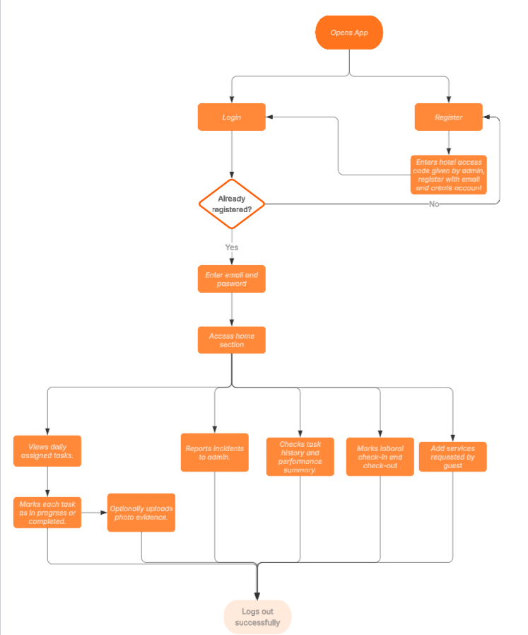

<div align="center">


# Universidad Peruana de Ciencias Aplicadas
## Carrera: Ingeniería de Software
## Ciclo: 2025 - 2


## Curso: 1ASI0730 - Aplicaciones Web
## NRC: 7454
## Profesor: Angel Augusto Velasquez Nuñez

# Informe de Trabajo Final
## Startup: Edgerunners
## Producto: Smart Stay

</div>

<div align="center">

|   Código   |   Apellidos      |     Nombres     |
|:----------:|:----------------:|:---------------:|
| U20221E617 | Verona Flores    | Italo Sebastian |
| U20231A816 | Valverde Portuguez| Natalia Ximena |
| U202019498 | Fernandez Garfias | Alexander Piero |
| u20191c464 | Saavedra Angulo   | Jose Jhonatan  |
| U20201F051 | Ramos Aguirre    | Aldair Joaquin |


**Mes y Año:** Septiembre 2025

</div>

## Registro de Versiones del Informe

El objetivo de esta sección es resumir las modificaciones relevantes que se realizan al informe durante el ciclo de vida del proyecto.  
Esta sección inicia en una página nueva e incluye un cuadro con la siguiente estructura:


| Versión |   Fecha    |                 Autor                 |                 Descripción de los Cambios                  |
|:-------:|:----------:|:-------------------------------------:|:-----------------------------------------------------------:|
|   1.0   | 01/09/2025 | Jose Jhonatan Saavedra Angulo (Líder) | Estructuración inicial del proyecto y coordinación del equipo |
|   1.0   | 01/09/2025 |     Italo Sebastian Verona Flores     | Creación del documento inicial del Informe de Trabajo Final |
|   1.1   | 15/09/2025 |    Natalia Ximena Valverde Portuguez  | Desarrollo de wireframes, mockups y guías de estilo visual |
|   1.2   | 20/09/2025 |   Alexander Piero Fernandez Garfias   | Implementación de landing page y desarrollo front-end |
|   1.3   | 25/09/2025 |     Aldair Joaquin Ramos Aguirre      | Elaboración de EventStorming e Impact Mapping |
|   2.0   | 30/09/2025 |  Equipo Edgerunners (Todos los miembros) | Finalización y revisión integral del Informe de Trabajo Final |


## Project Report Collaboration Insights

- **URL de la organización del proyecto:** https://github.com/Edgerunners-Aplicaciones-Web
- **URL del repositorio para el Project Report:** https://github.com/Edgerunners-Aplicaciones-Web/report
- **URL del repositorio de la landing page del proyecto:** https://edgerunners-aplicaciones-web.github.io/landing-page/
- **URL del repositorio del frontend del proyecto:** <!--TODO: AGREGAR EL URL-->

### Colaboración y Evidencia de Trabajo en Equipo

El desarrollo del presente informe de trabajo final se realizó de manera colaborativa utilizando las herramientas de control de versiones de GitHub. A continuación se presenta la evidencia de la participación y contribuciones de cada miembro del equipo:

#### Análisis de Commits por Colaborador

El trabajo en el repositorio del informe demuestra la participación activa de todos los miembros del equipo:


#### Distribución de Contribuciones

La colaboración se distribuyó de la siguiente manera:

- **Gestión del repositorio y estructura inicial:** Configuración de la estructura base del documento
- **Desarrollo de contenido por capítulos:** Cada miembro contribuyó con secciones específicas según su área de especialización
- **Revisión y refinamiento:** Proceso iterativo de mejora del contenido mediante pull requests y revisiones colaborativas
- **Integración final:** Consolidación de todas las contribuciones en el documento final

#### Metodología de Trabajo Colaborativo

- **Control de versiones:** Uso de Git para el seguimiento de cambios y colaboración
- **Revisiones de contenido:** Implementación de pull requests para la validación del contenido
- **Documentación continua:** Actualización incremental del informe durante todo el ciclo del proyecto
- **Coordinación de equipo:** Reuniones regulares para alinear el progreso y resolver conflictos

## Contenido

- [Capítulo I: Introducción](#capítulo-i-introducción)
    - [1.1. Startup Profile](#11-startup-profile)
        - [1.1.1. Descripción de la Startup](#111-descripción-de-la-startup)
        - [1.1.2. Perfiles de integrantes del equipo](#112-perfiles-de-integrantes-del-equipo)
    - [1.2. Solution Profile](#12-solution-profile)
        - [1.2.1. Antecedentes y problemática](#121-antecedentes-y-problemática)
        - [1.2.2. Lean UX Process](#122-lean-ux-process)
            - [1.2.2.1. Lean UX Problem Statements](#1221-lean-ux-problem-statements)
            - [1.2.2.2. Lean UX Assumptions](#1222-lean-ux-assumptions)
            - [1.2.2.3. Lean UX Hypothesis Statements](#1223-lean-ux-hypothesis-statements)
            - [1.2.2.4. Lean UX Canvas](#1224-lean-ux-canvas)
    - [1.3. Segmentos objetivo](#13-segmentos-objetivo)

- [Capítulo II: Requirements Elicitation & Analysis](#capítulo-ii-requirements-elicitation--analysis)
    - [2.1. Competidores](#21-competidores)
        - [2.1.1. Análisis competitivo](#211-análisis-competitivo)
        - [2.1.2. Estrategias y tácticas frente a competidores](#212-estrategias-y-tácticas-frente-a-competidores)
    - [2.2. Entrevistas](#22-entrevistas)
        - [2.2.1. Diseño de entrevistas](#221-diseño-de-entrevistas)
        - [2.2.2. Registro de entrevistas](#222-registro-de-entrevistas)
        - [2.2.3. Análisis de entrevistas](#223-análisis-de-entrevistas)
    - [2.3. Needfinding](#23-needfinding)
        - [2.3.1. User Personas](#231-user-personas)
        - [2.3.2. User Task Matrix](#232-user-task-matrix)
        - [2.3.3. User Journey Mapping](#233-user-journey-mapping)
        - [2.3.4. Empathy Mapping](#234-empathy-mapping)
    - [2.4. Big Picture EventStorming](#24-big-picture-eventstorming)
    - [2.5. Ubiquitous Language](#25-ubiquitous-language)

- [Capítulo III: Requirements Specification](#capítulo-iii-requirements-specification)
    - [3.1. User Stories](#31-user-stories)
    - [3.2. Impact Mapping](#32-impact-mapping)
    - [3.3. Product Backlog](#33-product-backlog)

- [Capítulo IV: Product Design](#capítulo-iv-product-design)
    - [4.1. Style Guidelines](#41-style-guidelines)
        - [4.1.1. General Style Guidelines](#411-general-style-guidelines)
        - [4.1.2. Web Style Guidelines](#412-web-style-guidelines)
    - [4.2. Information Architecture](#42-information-architecture)
        - [4.2.1. Organization Systems](#421-organization-systems)
        - [4.2.2. Labeling Systems](#422-labeling-systems)
        - [4.2.3. SEO Tags and Meta Tags](#423-seo-tags-and-meta-tags)
        - [4.2.4. Searching Systems](#424-searching-systems)
        - [4.2.5. Navigation Systems](#425-navigation-systems)
    - [4.3. Landing Page UI Design](#43-landing-page-ui-design)
        - [4.3.1. Landing Page Wireframe](#431-landing-page-wireframe)
        - [4.3.2. Landing Page Mock-up](#432-landing-page-mock-up)
    - [4.4. Web Applications UX/UI Design](#44-web-applications-uxui-design)
        - [4.4.1. Web Applications Wireframes](#441-web-applications-wireframes)
        - [4.4.2. Web Applications Wireflow Diagrams](#442-web-applications-wireflow-diagrams)
        - [4.4.3. Web Applications Mock-ups](#443-web-applications-mock-ups)
        - [4.4.4. Web Applications User Flow Diagrams](#444-web-applications-user-flow-diagrams)
    - [4.5. Web Applications Prototyping](#45-web-applications-prototyping)
    - [4.6. Domain-Driven Software Architecture](#46-domain-driven-software-architecture)
        - [4.6.1. Design-Level EventStorming](#461-design-level-eventstorming)
        - [4.6.2. Software Architecture Context Diagram](#462-software-architecture-context-diagram)
        - [4.6.3. Software Architecture Container Diagrams](#463-software-architecture-container-diagrams)
        - [4.6.4. Software Architecture Components Diagrams](#464-software-architecture-components-diagrams)
    - [4.7. Software Object-Oriented Design](#47-software-object-oriented-design)
        - [4.7.1. Class Diagrams](#471-class-diagrams)
    - [4.8. Database Design](#48-database-design)
        - [4.8.1. Database Diagrams](#481-database-diagrams)

- [Capítulo V: Product Implementation, Validation & Deployment](#capítulo-v-product-implementation-validation--deployment)
    - [5.1. Software Configuration Management](#51-software-configuration-management)
        - [5.1.1. Software Development Environment Configuration](#511-software-development-environment-configuration)
        - [5.1.2. Source Code Management](#512-source-code-management)
        - [5.1.3. Source Code Style Guide & Conventions](#513-source-code-style-guide--conventions)
        - [5.1.4. Software Deployment Configuration](#514-software-deployment-configuration)
    - [5.2. Landing Page, Services & Applications Implementation](#52-landing-page-services--applications-implementation)
        - [5.2.1. Sprint n](#521-sprint-n)
            - [5.2.1. Sprint Planning n](#5211-sprint-planning-n)
            - [5.2.1.2. Aspect Leaders and Collaborators](#5212-aspect-leaders-and-collaborators)
            - [5.2.1.3. Sprint Backlog n](#5213-sprint-backlog-n)
            - [5.2.1.4. Development Evidence for Sprint Review](#5214-development-evidence-for-sprint-review)
            - [5.2.1.5. Execution Evidence for Sprint Review](#5215-execution-evidence-for-sprint-review)
            - [5.2.1.6. Services Documentation Evidence for Sprint Review](#5216-services-documentation-evidence-for-sprint-review)
            - [5.2.1.7. Software Deployment Evidence for Sprint Review](#5217-software-deployment-evidence-for-sprint-review)
            - [5.2.1.8. Team Collaboration Insights during Sprint](#5218-team-collaboration-insights-during-sprint)

- [Conclusiones y Recomendaciones](#conclusiones-y-recomendaciones)
- [Bibliografía y Referencias](#bibliografía-y-referencias)

## Student Outcome

El curso contribuye al cumplimiento del Student Outcome ABET:

### ABET – EAC - Student Outcome 5

Criterio: La capacidad de funcionar efectivamente en un equipo cuyos miembros juntos proporcionan liderazgo, crean un entorno de colaboración e inclusivo, establecen objetivos, planifican tareas y cumplen objetivos.

En el siguiente cuadro se describe las acciones realizadas y enunciados de conclusiones por parte del grupo, que permiten sustentar el haber alcanzado el logro del ABET – EAC - Student Outcome 5

| Criterio específico                                                                                | Acciones realizadas                                                                                                                                                                                                                                                                                                                                                                                                                                                                                                                                                                                                                                                                                                                                                                                                                                                                                                                                                                                                                                                                                                                                                                                                                                                                                                                                                                                                                                                                                                                                                                                                                                                                                                                                            | Conclusiones                                                                                                                                                                                                                                                                                                                                                                                                                                                                                                                                                                                                                                                                                                                                                                                                                                                                                                                                              |
|----------------------------------------------------------------------------------------------------|----------------------------------------------------------------------------------------------------------------------------------------------------------------------------------------------------------------------------------------------------------------------------------------------------------------------------------------------------------------------------------------------------------------------------------------------------------------------------------------------------------------------------------------------------------------------------------------------------------------------------------------------------------------------------------------------------------------------------------------------------------------------------------------------------------------------------------------------------------------------------------------------------------------------------------------------------------------------------------------------------------------------------------------------------------------------------------------------------------------------------------------------------------------------------------------------------------------------------------------------------------------------------------------------------------------------------------------------------------------------------------------------------------------------------------------------------------------------------------------------------------------------------------------------------------------------------------------------------------------------------------------------------------------------------------------------------------------------------------------------------------------|-----------------------------------------------------------------------------------------------------------------------------------------------------------------------------------------------------------------------------------------------------------------------------------------------------------------------------------------------------------------------------------------------------------------------------------------------------------------------------------------------------------------------------------------------------------------------------------------------------------------------------------------------------------------------------------------------------------------------------------------------------------------------------------------------------------------------------------------------------------------------------------------------------------------------------------------------------------|
| **Trabaja en equipo para proporcionar liderazgo en forma conjunta**                                | Italo Sebastian Verona Flores TB1 <ul><li>Lideré la definición de la arquitectura de software del proyecto 'Smart Stay', utilizando el modelo C4 para establecer los diagramas de Contexto, Contenedores y Componentes.</li><li>Dirigí el diseño de la base de datos, solicitando y validando los esquemas en SQL y DBML para asegurar la correcta persistencia de los datos según los Bounded Contexts definidos.</li></ul> Natalia Ximena Valverde Portuguez TB1 <ul><li>Lideré el área de diseño de experiencia de usuario (UX), elaborando los wireframes y mockups de alta fidelidad que sirvieron como guía visual para todo el proyecto.</li><li>Dirigí la creación de la guía de estilos visuales de "Smart Stay", definiendo la paleta de colores, tipografía y branding para asegurar una identidad de marca coherente y profesional.</li></ul> Alexander Piero Fernandez Garfias TB1 <ul><li>Tomé el liderazgo en el desarrollo front-end, traduciendo los mockups y guías de estilo en un prototipo funcional utilizando HTML, Tailwind CSS y JavaScript.</li><li>Dirigí la implementación técnica de la arquitectura de página única estática (SPA), asegurando que la navegación entre vistas fuera fluida y eficiente.</li></ul> Jose Jhonatan Saavedra Angulo TB1 <ul><li>Lideré la fase de análisis de requerimientos del proyecto, siendo responsable de la creación y redacción del Product Backlog, incluyendo todas las Épicas y User Stories.</li><li>Guié la alineación del producto con las necesidades del negocio mediante la elaboración del Lean UX Canvas, asegurando que cada funcionalidad tuviera un propósito claro.</li></ul> Aldair Joaquin Ramos Aguirre TB1  <ul><li> Dirigí la definición Big Picture EventStorming para descubrir eventos de negocio y flujos principales. </li> <li>  Dirigí la definición mediante Impact Mapping para identificar objetivos, actores, impactos y entregables clave, estableciendo así una base estratégica que respaldó el diseño de la arquitectura de software del proyecto 'Smart Stay'.                          | *TB1*<br> <li>El liderazgo del equipo se manifestó de forma conjunta al distribuir responsabilidades clave (arquitectura, diseño de base de datos, UI/UX) entre los miembros, permitiendo que cada uno guiara su área de especialización y contribuyera a una visión técnica coherente y unificada del producto.</li><li>Las decisiones de diseño cruciales, como la adopción del modelo C4 para la arquitectura y la separación funcional de roles de usuario, se tomaron de manera consensuada, discutiendo y evaluando colectivamente las mejores alternativas para la robustez y escalabilidad del sistema.</li><li>El equipo demostró un liderazgo proactivo al guiar el proyecto a través de un proceso iterativo de refinamiento, transformando los conceptos iniciales en un conjunto de artefactos de diseño detallados y un prototipo funcional.</li>                                                                                           |
| **Crea un entorno colaborativo e inclusivo, establece metas, planifica tareas y cumple objetivos** | Italo Sebastian Verona Flores TB1 <ul><li>Establecí los objetivos para cada artefacto de diseño, planificando la secuencia de trabajo desde los diagramas de alto nivel (C4) hasta la implementación del front-end.</li><li>Fomenté un entorno de colaboración al proporcionar retroalimentación específica y constructiva sobre cada entregable, permitiendo la mejora continua del producto final.</li></ul> Natalia Ximena Valverde Portuguez TB1 <ul><li>Creé un entorno colaborativo al proporcionar los artefactos visuales (mockups) que sirvieron como un "lenguaje común" para alinear el trabajo de arquitectura y desarrollo.</li><li>Establecí las metas de diseño visual y de usabilidad, planificando las tareas de creación de componentes gráficos y asegurando el cumplimiento de los objetivos estéticos del proyecto.</li></ul> Alexander Piero Fernandez Garfias TB1 <ul><li>Colaboré estrechamente con el área de diseño para planificar las tareas de maquetación, asegurando que la implementación técnica fuera fiel a la visión UX/UI.</li><li>Cumplí el objetivo de entregar una landing page interactiva y funcional, implementando características complejas como el selector de idioma y la navegación entre vistas.</li></ul> Jose Jhonatan Saavedra Angulo TB1 <ul><li>Establecí las metas funcionales del producto a través de User Stories claras y bien definidas, lo que permitió al equipo planificar sus tareas de desarrollo de manera efectiva.</li><li>Creé un puente de colaboración entre la visión de negocio y el equipo técnico, asegurando que los entregables cumplieran con los objetivos planteados en la fase de análisis.</li></ul> Aldair Joaquin Ramos Aguirre TB1 <ul><li>Conduje una sesión de Big Picture EventStorming, mapeando eventos de negocio y flujos esenciales para obtener una visión integral de los procesos del proyecto.</li><li>Lideré el uso de Impact Mapping para definir metas, actores, resultados esperados y entregables, sentando las bases estratégicas.</li></ul>    | *TB1*<br> <li>Se fomentó un entorno altamente colaborativo utilizando los artefactos de diseño (diagramas C4, mockups, guías de estilo) como un lenguaje común, lo que facilitó la integración del trabajo individual y aseguró que todos los miembros compartieran la misma visión del producto final.</li><li>El equipo estableció y siguió un plan de trabajo estructurado, definiendo metas claras para cada fase del proyecto: desde el análisis de requerimientos y el diseño arquitectónico de alto nivel, hasta el modelado detallado de la base de datos y la implementación del prototipo.</li><li>Se cumplió con el objetivo principal del TB1 al entregar un producto cohesivo y funcional, que incluye una arquitectura de software documentada, un esquema de base de datos normalizado y una landing page estática e interactiva, demostrando la capacidad del equipo para planificar y ejecutar tareas complejas de manera efectiva.</li> |

# **Capítulo I: Introducción**

## 1.1. Startup Profile

La startup **Smart Stay** surge con el objetivo de transformar la gestión hotelera mediante el uso de tecnologías digitales e Internet of Things (IoT). Su propuesta busca integrar en una sola plataforma la administración de huéspedes, habitaciones y servicios, permitiendo al hotel optimizar recursos y, al mismo tiempo, ofrecer experiencias personalizadas a los clientes.

Entre sus principales características destacan:

- Registro automático de huéspedes mediante sistemas digitales.
- Identificación de habitaciones ocupadas, libres o en mantenimiento.
- Monitoreo de temperatura, iluminación y consumo energético.
- Integración con dispositivos IoT para controlar persianas, temperatura del agua y otros aspectos del confort del huésped.
- Personalización de servicios, como programación de limpieza, room service o entrega de comidas en horarios flexibles.


### 1.1.2. Perfiles de integrantes del equipo

|   Código   |   Apellidos   |     Nombres     |                                                                                                                                                                    Perfil Académico y Profesional                                                                                                                                                                     | Perfil                                       |
|:----------:|:-------------:|:---------------:|:---------------------------------------------------------------------------------------------------------------------------------------------------------------------------------------------------------------------------------------------------------------------------------------------------------------------------------------------------------------------:|----------------------------------------------|
| U20221E617 | Verona Flores | Italo Sebastian | Estudiante de Ingeniería de Software en la Universidad Peruana de Ciencias Aplicadas (UPC). Apasionado por la tecnología y el desarrollo de software, con habilidades en programación web, bases de datos y diseño de interfaces. Experiencia en proyectos académicos y personales que demuestran su capacidad para trabajar en equipo y resolver problemas técnicos. |  |
| U20231A816 | Valverde Portuguez| Natalia Ximena | Estudiante de Ingeniería de Software en la Universidad Peruana de Ciencias Aplicadas (UPC). Cuento con conocimientos de Marketing y estoy interesada en el UX Design y base de datos con sql. Experiencia en trabajos de creación de startups en el ámbito laboral, lo que fortalece mis capacidades tanto en trabajos grupales e individuales para las bases de un proyecto. | |  
| U20191C464 | Saavedra Angulo  | Jose Jhonatan   | Estudiante de Ingeniería de Software en la Universidad Peruana de Ciencias Aplicadas (UPC). Me gusta la computación y el programar se me hace divertido, tengo habilidades en programación en el lenguaje c++, python y algo de java. Tengo experiencia en proyectos académicos y personales que demuestran mi capacidad para trabajar en equipo y resolver problemas técnicos. |                                              
|  U20201F051 |      Ramos Aguirre   |   Aldair Joaquin     |    Estudiante de Ingeniería de Software en la Universidad Peruana de Ciencias Aplicadas (UPC).  Cuento con conocimientos C++, Python me gusta resolver problemas y poder colaborar con mis compañeros, cuento con experiencia en proyectos académicos previos.    |    |
| U202019498 | Fernández Garfias | Alexander Piero | Estudiante de Ingeniería de Software en la Universidad Peruana de Ciencias Aplicadas (UPC). Interesado en el desarrollo de aplicaciones móviles y web, con conocimientos en Java para Android, Flutter y HTML básico. Participa en proyectos académicos donde aplica sus habilidades técnicas y fortalece su capacidad de trabajo en equipo. | |                                                                               

## 1.2. Solution Profile

### 1.2.1. Antecedentes y problemática

### **Who? (¿Quiénes?)**
El problema afecta principalmente a los administradores y personal operativo de hoteles, así como a los huéspedes que buscan una experiencia personalizada y eficiente. El personal del hotel debe gestionar manualmente múltiples aspectos como registro de huéspedes, control de habitaciones, servicios de limpieza y gestión de inventarios.

### **What? (¿Qué?)**
El problema central es la falta de automatización y digitalización en la gestión hotelera integral. Esto incluye la gestión manual de reservas, control ineficiente de habitaciones, falta de personalización en la experiencia del huésped, y monitoreo deficiente de recursos y servicios del hotel.

### **Where? (¿Dónde?)**
La problemática se presenta en todas las áreas del hotel: recepción, habitaciones, áreas de servicio, cocina, limpieza, y en la gestión administrativa. También afecta la experiencia del huésped dentro de su habitación y en su interacción con los servicios del hotel.

### **When? (¿Cuándo?)**
Ocurre durante las 24 horas del día, los 7 días de la semana, especialmente durante las horas pico de check-in/check-out, temporadas altas, y cuando hay múltiples solicitudes simultáneas de servicios por parte de los huéspedes.

### **Why? (¿Por qué?)**
El problema existe debido a la dependencia de sistemas tradicionales de gestión hotelera que no están integrados, la falta de automatización en el control de habitaciones y servicios, y la ausencia de tecnología IoT que permita el monitoreo en tiempo real y la personalización de la experiencia del huésped.

### **How? (¿Cómo?)**
El personal debe realizar múltiples tareas manuales como verificar disponibilidad de habitaciones, coordinar servicios de limpieza, gestionar pedidos de room service, controlar inventarios, y atender solicitudes de huéspedes sin un sistema centralizado. Los huéspedes no pueden personalizar su estancia de manera autónoma y deben depender del personal para ajustes básicos.

### **How Much? (¿Cuánto?)**
La ineficiencia operativa puede representar pérdidas de 15-20% en productividad del personal, incremento en costos operativos por uso ineficiente de recursos (energía, agua, suministros), y una disminución en la satisfacción del cliente que puede afectar las reseñas y la ocupación futura. El costo de oportunidad incluye la pérdida de huéspedes que buscan experiencias más modernas y personalizadas.

### 1.2.2 Lean UX Process

#### 1.2.1.1 Lean UX Problem Statements.

**Problem Statement: Gestión Manual de Habitaciones**

Nuestro servicio de gestión hotelera busca optimizar la experiencia tanto del personal del hotel como de los huéspedes a través de una plataforma integrada que conecte todos los aspectos operativos del hotel. A través de nuestro servicio, los administradores hoteleros pueden gestionar eficientemente las habitaciones, servicios y recursos del hotel mientras los huéspedes pueden personalizar su experiencia de estancia.

Hemos observado un factor crítico que afecta la eficiencia operativa: la gestión manual de habitaciones y servicios que genera ineficiencias, errores en la disponibilidad y falta de personalización en tiempo real. Actualmente, el personal debe verificar manualmente el estado de las habitaciones, coordinar servicios de limpieza y atender solicitudes de huéspedes sin un sistema centralizado que permita automatización y monitoreo en tiempo real.

**Business Outcome:**

Objective (O): Mejorar la eficiencia operativa del hotel en el primer ciclo de 4 meses.

Key Results (KR):

- Reducir en 15% el tiempo promedio de check-in y check-out.

- Disminuir en 10% los costos de operación relacionados con procesos manuales.

- Alcanzar al menos 80% de adopción del sistema por parte del personal administrativo en tareas diarias.

**User Outcome:**

Objective (O): Brindar una experiencia de gestión más rápida y clara para huéspedes y personal.

Key Results (KR):
- Lograr que los huéspedes completen su check-in digital en menos de 3 minutos.
- Obtener una calificación de satisfacción de usuarios (NPS o encuesta) de al menos 8/10 en la nueva experiencia de registro.
- Asegurar que el 70% de los usuarios recurrentes utilicen la funcionalidad digital sin necesidad de asistencia del personal.

#### 1.2.2.2. Lean UX Assumptions

1. Creo que mis clientes necesitan
   Una solución integral de gestión hotelera que automatice procesos operativos, optimice el uso de recursos y proporcione una experiencia personalizada a los huéspedes mediante tecnología IoT.

2. Estas necesidades se pueden resolver con
   Una plataforma web SaaS integrada con dispositivos IoT que permita el monitoreo en tiempo real de habitaciones, automatización de servicios hoteleros y control personalizado del ambiente por parte de los huéspedes.

3. Mis clientes iniciales son (o serán)
   Hoteles boutique y de lujo (3-5 estrellas) de 50-200 habitaciones ubicados en zonas turísticas de Lima Metropolitana, seguidos por cadenas hoteleras medianas y hoteles de negocios.

4. El valor #1 que un cliente quiere de mi servicio es
   Optimización operativa que reduzca costos y mejore la eficiencia del personal, junto con una experiencia diferenciada para huéspedes que aumente la satisfacción y calificaciones del hotel.

5. El cliente también puede obtener estos beneficios adicionales
    - Reducción del 20-30% en costos de servicios públicos
    - Dashboards analíticos para toma de decisiones basada en datos
    - Integración con sistemas de gestión hotelera existentes
    - Reportes automatizados de ocupación y rendimiento
    - Marketing personalizado basado en preferencias de huéspedes

6. Voy a adquirir la mayoría de mis clientes a través de
   Marketing directo a hoteles, participación en ferias de turismo y hospitalidad, partnerships con proveedores de sistemas hoteleros existentes, y referencias de clientes satisfechos.

7. Haré dinero a través de
   Modelo de suscripción mensual escalonado según el número de habitaciones del hotel, más tarifas de instalación inicial de dispositivos IoT y servicios de consultoría para implementación.

8. Mi competencia principal en el mercado será
   Sistemas de gestión hotelera tradicionales como Oracle Hospitality, Amadeus, y startups de hoteltech como Smartpricing y RoomRaccoon, así como proveedores de soluciones IoT para hospitalidad.

9. Los venceremos debido a
   Nuestra integración completa entre gestión hotelera y tecnología IoT, enfoque específico en personalización del huésped, interface intuitiva, y capacidad de generar ROI medible a través de optimización de recursos.

10. Mi mayor riesgo de producto es
    La resistencia de los hoteles a adoptar nueva tecnología, problemas de conectividad o confiabilidad de dispositivos IoT, y los altos costos iniciales de implementación que pueden desalentar a hoteles pequeños.

11. Resolveremos esto a través de
    - Programa piloto con descuentos para early adopters
    - Soporte técnico 24/7 durante implementación
    - Garantías de tiempo de actividad y planes de contingencia
    - Modelos de financiamiento flexibles
    - Capacitación integral para personal hotelero

12. ¿Qué otras suposiciones tenemos que, si se prueba que es falso, causará que nuestro negocio/proyecto no funcione?

    - Los hoteles tienen infraestructura WiFi suficiente para soportar dispositivos IoT
    - Los huéspedes están dispuestos a interactuar con tecnología durante su estancia
    - El personal hotelero puede adaptarse a herramientas digitales sin resistencia significativa
    - Los dispositivos IoT tendrán una vida útil de al menos 3-5 años
    - Las regulaciones de privacidad y seguridad no impedirán la recolección de datos de habitaciones
    - El retorno de inversión será visible en los primeros 6-12 meses de implementación

#### 1.2.2.3. Lean UX Hypothesis Statements
<div>
    <p><strong>Hypothesis 1: Digital Check-in/Check-out</strong></p>
    <p><strong>We believe that</strong> implementing an automated digital check-in and check-out system for guests and reception staff will reduce the average time for these processes by 15%.</p>
    <p><strong>We will know we are successful</strong></p>
    <p><strong>When we see</strong> that guests complete their registration in less than 3 minutes and 70% use the digital system without needing staff assistance.</p>
</div>

<div>
    <p><strong>Hypothesis 2: Administrative Staff Adoption</strong></p>
    <p><strong>We believe that</strong> providing an intuitive hotel management platform with comprehensive training for administrative staff will achieve at least 80% adoption of the system for daily tasks.</p>
    <p><strong>We will know this is true</strong></p>
    <p><strong>When we see</strong> consistent daily use of the system by staff and a 10% reduction in manual operational costs after 4 months of implementation.</p>
</div>

<div>
    <p><strong>Hypothesis 3: User Satisfaction</strong></p>
    <p><strong>We believe that</strong> offering a faster and clearer digital management experience for guests and hotel staff will significantly improve overall satisfaction.</p>
    <p><strong>We will know we are successful</strong></p>
    <p><strong>When we see</strong> a satisfaction score of at least 8/10 in NPS surveys and that 70% of returning users use the features without assistance.</p>
</div>

<div>
    <p><strong>Hypothesis 4: IoT Resource Optimization</strong></p>
    <p><strong>We believe that</strong> integrating IoT devices for monitoring temperature, light, and energy consumption for hotel administrators will optimize the hotel's resource usage.</p>
    <p><strong>We will know this is true</strong></p>
    <p><strong>When we see</strong> a 20% reduction in utility expenses and detailed consumption reports that allow for better resource control during the 4-month period.</p>
</div>

<div>
    <p><strong>Hypothesis 5: Experience Personalization</strong></p>
    <p><strong>We believe that</strong> allowing guests to directly control their room's environment and schedule services will increase their satisfaction and consumption of additional services.</p>
    <p><strong>We will know we are successful</strong></p>
    <p><strong>When we see</strong> a 25% increase in customer satisfaction in post-stay surveys and a 15% increase in room service and optional service orders.</p>
</div>

<div>
    <p><strong>Hypothesis 6: Pilot Hotel Adoption</strong></p>
    <p><strong>We believe that</strong> offering a scalable subscription model with gradual implementation for boutique and small hotels in Lima will generate interest and participation in our pilot program.</p>
    <p><strong>We will know this is true</strong></p>
    <p><strong>When we see</strong> the participation of at least 3 hotels in our university pilot with signed collaboration agreements and confirmation of post-development implementation.</p>
</div>

<div>
    <p><strong>Hypothesis 7: Competitive Advantage</strong></p>
    <p><strong>We believe that</strong> our complete integration between traditional hotel management and IoT technology for hotels that seek modernization will give us an advantage over traditional systems.</p>
    <p><strong>We will know we are successful</strong></p>
    <p><strong>When we see</strong> that the pilot hotels report specific operational improvements and express a preference for our solution versus alternatives like Oracle Hospitality or manual management.</p>
</div>

#### 1.2.2.4. Lean UX Canvas

**Evidencia:**


## 1.3. Segmentos objetivos.

Esta sección incluye la descripción de los segmentos asociados al dominio del problema de gestión hotelera manual e ineficiente, incluyendo características demográficas e información estadística de sustento.

**Segmento Primario: Administradores de Hoteles Boutique y Pequeños en Lima**

**Características Demográficas:**

- **Edad**: Entre 35 y 50 años (basado en estudios regionales)
- **Nivel educativo**: Técnico o universitario en administración hotelera, turismo o áreas afines
- **Experiencia profesional**: 5-15 años en el sector hotelero, especialmente en hoteles de 3-4 estrellas
- **Cargo**: Gerentes generales, administradores, directores de operaciones

**Información del Sector:**

- **Número de hoteles**: Más de 300 hoteles pequeños (20-100 habitaciones) en Lima Metropolitana
- **Categorías**: Principalmente 3-4 estrellas
- **Ubicación**: Concentrados en Miraflores, San Isidro, Barranco y Centro Histórico
- **Tipo**: Hoteles boutique e independientes

**Inversión en Tecnología**
- **Presupuesto anual**: Entre $1,000 y $5,000 USD para sistemas de gestión y automatización
- **Adopción**: Transición lenta pero creciente hacia sistemas digitales
- **Apoyo**: Capacitaciones y subsidios tecnológicos disponibles a través de FEDECATUR

**Desafíos Operativos Identificados**
- Falta de acceso a financiamiento para modernización tecnológica
- Altos costos operativos por procesos manuales y baja eficiencia
- Tiempo excesivo dedicado a tareas administrativas (reduce atención al cliente)
- Impacto del tipo de cambio y estacionalidad que limita inversiones
- Muchos hoteles pequeños aún operan con procesos manuales en contabilidad, reservas y atención al cliente

---

**Segmento Secundario: Huéspedes de Hoteles**

**Perfil Demográfico**
- **Edad**: Entre 25 y 45 años (alta presencia de millennials y jóvenes profesionales)
- **Nivel socioeconómico**: Medio-alto a alto, con capacidad de gasto superior al promedio
- **Procedencia**:
    - **Internacional**: 40% - turistas de EE.UU., Europa, Chile y Colombia
    - **Nacional**: 60% - limeños y viajeros de Arequipa y Cusco que buscan experiencias urbanas modernas

**Comportamiento de Viaje**
- **Frecuencia**: 2-4 viajes al año, combinando ocio y trabajo (bleisure)
- **Duración promedio**: 2-5 noches en hoteles boutique
- **Gasto promedio**: $90-180 USD por noche (dependiendo del distrito y categoría)

**Preferencias Tecnológicas**
- **68%** elige hoteles con buena reputación digital (reseñas, presencia en redes, apps de reserva)
- **Dispuestos a pagar más** por experiencias digitales como:
    - Check-in sin contacto
    - Control de habitación vía app
    - WiFi de alta velocidad
    - Smart TV y asistentes virtuales

**Uso de Tecnología Durante la Estadía**
- **Dispositivo principal**: Smartphones para gestionar toda la estadía
- **Servicios esperados**:
    - WiFi gratuito y rápido
    - Apps del hotel para servicios internos
    - Integración con WhatsApp o Booking Pulse para atención al cliente
- **Gestión digital**: Reservas, pagos, mapas, recomendaciones

**Mercado Hotelero Boutique en Lima**
- **Total de hoteles**: Más de 2,000 hoteles registrados en Lima, con una parte significativa siendo boutique o pequeños
- **Hoteles destacados**: Pullman Lima Miraflores y Vignette Collection SOUMA (integran tecnología y diseño moderno)
- **Crecimiento**: Sostenido en el segmento boutique, impulsado por viajeros que valoran experiencias personalizadas y digitales
- **Ingresos adicionales**: 10-20% del total provienen de servicios digitales (upgrades, experiencias virtuales, tours online) en hoteles bien posicionados


**Datos de Sustento Estadístico**

**Oportunidad de Mercado**
- Lima cuenta con más de 300 hoteles pequeños objetivo para Smart Stay
- El 68% de huéspedes valora la reputación digital del hotel
- Los ingresos por servicios digitales representan hasta 20% del total en hoteles tecnológicamente avanzados
- Crecimiento sostenido del segmento boutique impulsado por demanda de experiencias digitales personalizadas

**Validación del Mercado Objetivo**

Esta información proporciona una base sólida para validar que existe un mercado objetivo claro y definido para la solución Smart Stay, con necesidades específicas tanto del lado de la oferta (administradores) como de la demanda (huéspedes tech-savvy).

# **Capítulo II: Requirements Elicitation & Analysis**

## 2.1. Competidores.

El mercado de soluciones para gestión hotelera en Lima y a nivel nacional presenta diversos actores que ofrecen herramientas digitales, sistemas tracionales de gestión y, en menor medida, plataformas integradas con IoT. Se identificaron los principales competidores.

#### 2.1.1 Análisis Competitivo.

El análisis competitivo permite identificar las fortalezas, debilidades y estrategias de los principales actores del mercado en comparación con la propuesta de **Smart Stay**.

**Matriz comparativa de competidores**

<table border="1" cellspacing="0" cellpadding="6" style="width:100%; border-collapse: collapse;">
  <tr>
    <td colspan="2"><b>¿Por qué llevar a cabo este análisis?</b></td>
    <td colspan="4">Este análisis permite identificar las fortalezas y debilidades de nuestra startup (Smart Stay) frente a los principales arquetipos de competidores, revelando oportunidades clave y amenazas potenciales para definir una propuesta de valor única y una estrategia sólida.</td>
  </tr>

  <tr>
<th colspan="2">Competidores</th>
<th>Smart Stay<br>

</th>
<th>
Oracle Hospitality<br>

</th>
<th>
Room Raccoon<br>

</th>
<th>
Sistemas Manuales<br>

</th>

  </tr>

  <tr>
    <th rowspan="2" style="writing-mode: vertical-rl; text-orientation: mixed; text-align:center;">Perfil</th>
    <td><b>Overview</b></td>
    <td>Plataforma integral de gestión hotelera con enfoque en hoteles boutique y medianos, incorporando IoT y personalización del huésped.</td>
    <td>Soluciones globales y completas (PMS/OPERA) para gestión de grandes cadenas hoteleras.</td>
    <td>SaaS en la nube todo-en-uno (PMS, Channel Manager, Motor de Reservas) intuitivo, orientado a hoteles pequeños e independientes.</td>
    <td>Sistemas tradicionales que usan Excel, papel y lápiz. Procesos 100% manuales.</td>
  </tr>
  <tr>
    <td><b>Ventaja competitiva</b><br>¿qué valor ofrece a los clientes?</td>
    <td>Accesibilidad, personalización profunda de la experiencia del huésped mediante IoT, y un enfoque especializado en el mercado LATAM.</td>
    <td>Reconocimiento global, robustez, soluciones integrales y confiabilidad para operaciones a gran escala.</td>
    <td>Extrema facilidad de uso, rápida implementación y un soporte al cliente muy valorado. Todo en uno para el hotelero independiente.</td>
    <td>Costo casi nulo y flexibilidad total al no depender de ningún software.</td>
  </tr>

  <tr>
    <th rowspan="2" style="writing-mode: vertical-rl; text-orientation: mixed; text-align:center;">Perfil de Marketing</th>
    <td><b>Mercado objetivo</b></td>
    <td>Hoteles boutique, medianos y en crecimiento en LATAM que buscan diferenciarse.</td>
    <td>Grandes cadenas hoteleras globales y resorts de lujo con operaciones complejas.</td>
    <td>Hoteles pequeños, hostales, B&Bs y apartamentos turísticos.</td>
    <td>Hoteles muy pequeños o de baja tecnología que no han iniciado su digitalización.</td>
  </tr>
  <tr>
    <td><b>Estrategias de marketing</b></td>
    <td>Marketing de contenidos enfocado en modernización, diferenciación por IoT y experiencia del huésped. Pilotos en LATAM.</td>
    <td>Ventas corporativas B2B, branding global y posicionamiento como el estándar de la industria.</td>
    <td>Marketing digital (SEO, SEM) enfocado en facilidad de uso y buen soporte. Altas calificaciones en sitios de reseñas.</td>
    <td>Inexistente. Adopción por necesidad o falta de alternativas conocidas.</td>
  </tr>

  <tr>
    <th rowspan="3" style="writing-mode: vertical-rl; text-orientation: mixed; text-align:center;">Perfil de Producto</th>
    <td><b>Productos & Servicios</b></td>
    <td>PMS, Channel Manager, Motor de Reservas, App para huéspedes con control IoT (luces, temp), reportes analíticos.</td>
    <td>Suite OPERA Cloud (PMS, Ventas y Catering, POS), reportes y analítica avanzada, integraciones.</td>
    <td>Plataforma todo-en-uno: PMS, Channel Manager, Motor de Reservas, Pagos, Housekeeping.</td>
    <td>Hojas de cálculo, libros de registro, calendarios de papel.</td>
  </tr>
  <tr>
    <td><b>Precios & Costos</b></td>
    <td>Modelo SaaS por suscripción mensual, probablemente escalado por número de habitaciones. Costo de hardware IoT inicial.</td>
    <td>Licenciamiento enterprise. Costos de implementación y mantenimiento muy elevados. Solo por cotización.</td>
    <td>Suscripción mensual transparente y pública, basada en el número de habitaciones. Muy accesible.</td>
    <td>Gratuito o el costo de una licencia de Office.</td>
  </tr>
  <tr>
    <td><b>Canales de distribución</b><br>(Web y/o Móvil)</td>
    <td>Plataforma web (Cloud) y aplicación móvil para huéspedes y staff.</td>
    <td>Aplicación web (Cloud) para el personal del hotel.</td>
    <td>Plataforma web (Cloud).</td>
    <td>Offline.</td>
  </tr>

  <tr>
    <th rowspan="4" style="writing-mode: vertical-rl; text-orientation: mixed; text-align:center;">Análisis SWOT</th>
    <td><b>Fortalezas</b></td>
    <td>Propuesta de valor única (IoT), enfoque en nicho desatendido (boutique LATAM), tecnología moderna.</td>
    <td>Marca líder, producto robusto y escalable, gran base de clientes cautiva.</td>
    <td>Fácil de usar, rápido de implementar, excelente soporte, precio transparente.</td>
    <td>Costo cero, simplicidad absoluta, sin necesidad de capacitación.</td>
  </tr>
  <tr>
    <td><b>Debilidades</b></td>
    <td>Marca nueva sin reputación, requiere instalación de hardware, necesidad de educar al mercado sobre IoT.</td>
    <td>Costo prohibitivo para pymes, implementación lenta y compleja, considerado poco innovador.</td>
    <td>Funcionalidades limitadas para hoteles grandes o con operaciones complejas.</td>
    <td>Ineficiente, propenso a errores, no escalable, sin conectividad online.</td>
  </tr>
  <tr>
    <td><b>Oportunidades</b></td>
    <td>Crecimiento del turismo en LATAM, demanda de experiencias personalizadas, adopción de "smart homes" extrapolable a hoteles.</td>
    <td>Migración de sus clientes on-premise a la nube, venta cruzada de nuevos módulos.</td>
    <td>Expandirse a mercados emergentes, añadir más integraciones de terceros.</td>
    <td>Ninguna. Es el punto de partida para la digitalización.</td>
  </tr>
  <tr>
    <td><b>Amenazas</b></td>
    <td>Grandes jugadores añadiendo módulos IoT, competidores SaaS más ágiles, lenta adopción tecnológica en el sector.</td>
    <td>Nuevos competidores SaaS ágiles y más económicos, ciberseguridad.</td>
    <td>Competencia intensa en el segmento de pymes, que un PMS más grande ofrezca una versión "lite".</td>
    <td>Cualquier software básico representa una amenaza existencial.</td>
  </tr>
</table>

#### 2.1.2  Estrategias y Tácticas frente a Competidores.

Para posicionarse de manera efectiva frente a los competidores, **Smart Stay** implementará las siguientes estrategias:

#### Estrategias

1. **Diferenciación Tecnológica**: Integrar gestión hotelera con IoT, algo que los competidores actuales no ofrecen de manera completa.
2. **Enfoque en nicho**: Dirigirse a hoteles boutique y pequeños (20-100 habitaciones), un segmento poco atendido por gigantes como Oracle o Amadeus.
3. **Modelo de suscripción accesible**: Precios escalables según número de habitaciones, permitiendo competir contra soluciones costosas sin sacrificar funcionalidad.
4. **Soporte local y en español**: Acompañamiento cercano que mejora la adopción frente a competidores extranjeros.
5. **Valor medible**: Promesa clara de reducción de costos operativos (10-20%)

#### Tácticas

- **Programa píloto** con hoteles boutique de lima para generar casos de éxito y testimonios.
- **Alianzas estratégicas** con gremios turísticos (ej. FEDECATUR) para acelerar la adopción.
- **Capacitación continua** para el personal hotelero, disminuyendo resistencia al cambio.
- **Marketing digital enfocado en ROI**: Mostrar comparativas de costos y beneficios frente a sistemas tracicionales
- **Integraciones rápidas** con PMS existentes para facilitar la migración y reduccir fricciones.
- **Atencion postventa 24/7** como ventaja competitiva sobre startups con soporte limitado.

## 2.2. Entrevistas.

Con el objetivo de profundizar en las necesidades y expectativas de los segmentos objetivos, se realizaron entrevistas semiestructuradas a administradores de hoteles boutique y a huéspedes. Esta información cualitativa sirvió como base para identificar problemáticas actuales y orientar la definición de requisitos del sistema.

#### 2.2.1  Diseño de entrevistas

### Entrevista – Segmento 1: Administradores de Hoteles Boutique y Pequeños

1. ¿Cómo te llamas y qué cargo ocupas en el hotel?
2. ¿En qué distrito o ciudad se encuentra el hotel?
3. ¿Cuántas habitaciones y personal gestionan aproximadamente?
4. ¿Podrías contarme cómo es un día típico de trabajo administrando el hotel?
5. ¿Qué tan seguido deben gestionar procesos como reservas, check-in/check-out o facturación?
6. ¿Cómo suelen organizar actualmente la gestión de reservas y pagos?
7. ¿Han tenido dificultades con sobrerreservas, disponibilidad de habitaciones o errores de facturación?
8. ¿Qué dispositivos usas con mayor frecuencia para gestionar el hotel?
9. ¿Qué aplicaciones o sistemas usas actualmente en tu día a día para el manejo del hotel?
10. ¿Has tenido alguna dificultad o experiencia negativa al usarlas?
11. ¿Qué te motivaría a adoptar una nueva herramienta digital para centralizar reservas, pagos y tareas del personal?
12. Si una herramienta digital lograra optimizar tus operaciones y reducir tus costos, ¿cómo valorarías invertir en una suscripción mensual para acceder a ella?
13. ¿Cuáles son tus principales preocupaciones respecto a la gestión del hotel?

### Entrevista – Segmento 2: Huéspedes de Hoteles

1. ¿Cómo te llamas y con qué frecuencia viajas por turismo o trabajo?
2. ¿Qué tipo de hotel sueles elegir (boutique, cadena internacional, Airbnb, etc.) y por qué?
3. ¿Qué valoras más en un hotel: ubicación, precio, comodidad o servicios digitales?
4. ¿Cómo fue tu última experiencia de check-in y check-out? ¿Qué mejorarías?
5. ¿Qué tan importante es para ti poder personalizar tu habitación (temperatura, luz, limpieza, room service) desde tu celular u otro dispositivo tecnológico?
6. ¿Qué servicios digitales utilizas más durante tu estadía en un hotel (WiFi, app del hotel, WhatsApp, smart TV, llaves digitales)?
7. ¿Has tenido experiencias negativas con la gestión del hotel (esperas largas, problemas con el servicio, falta de personalización)?
8. ¿Qué opinas de un sistema que te permita hacer check-in sin pasar por recepción y controlar tu habitación desde una app?
9. ¿Estarías dispuesto a pagar un poco más por un hotel que ofrezca experiencias digitales y personalización avanzada? ¿Cuánto aproximadamente?
10. ¿Qué tanto influyen las reseñas digitales y la reputación online en tu decisión de reservar un hotel?
11. Si un hotel ofreciera un servicio totalmente digitalizado, ¿qué expectativa tendrías respecto al trato humano? ¿Lo consideras un valor agregado o no es necesario?
12. ¿Qué recomendarías para que la experiencia digital en un hotel sea cómoda y no complicada para los huéspedes?

### 2.2.2. Registro de entrevistas

### Entrevista – Segmento 1: Administradores de Hoteles Boutique y Pequeños

#### Entrevista 1

Datos del entrevistado:

**Nombre completo:** Adrian Saavedra Angulo

**Edad:** 34 años

**Ciudad:** Tarapoto

**Duración:** 8:07 minutos

**Evidencia:** 

**Resumen de la entrevista**

Adrián administra un hotel de 12 habitaciones en Tarapoto con un equipo de 6 personas. Su rutina diaria incluye revisar reservas, coordinar limpieza, organizar recojos y responder a nuevas solicitudes. Los procesos de reservas y facturación son constantes por el alto movimiento del negocio.
Aunque cuentan con un sistema propio, han tenido problemas de sobreventa porque no se sincroniza con todas las plataformas, lo que obliga a actualizaciones manuales y genera errores. Adrián estaría motivado a usar una herramienta que centralice la gestión y se integre con plataformas externas, siempre que el costo de suscripción sea razonable.


**URL del video:** [Entrevista Adrián Saavedra](https://upcedupe-my.sharepoint.com/:v:/g/personal/u20191c464_upc_edu_pe/ESyVWXpzLu5BntGjGocrfCQBzbC6LcTyvE1fJR1lpZgD7g?nav=eyJyZWZlcnJhbEluZm8iOnsicmVmZXJyYWxBcHAiOiJTdHJlYW1XZWJBcHAiLCJyZWZlcnJhbFZpZXciOiJTaGFyZURpYWxvZy1MaW5rIiwicmVmZXJyYWxBcHBQbGF0Zm9ybSI6IldlYiIsInJlZmVycmFsTW9kZSI6InZpZXcifX0%3D&e=croANB)

---

#### Entrevista 2

Datos del entrevistado:

**Nombre completo:** Monica Hernandez Vela

**Edad:** 33 años

**Ciudad:** Tarapoto

**Duración:** 5:53 minutos

**Evidencia:** 

**URL del video:** [Monica Hernandez Vela](https://upcedupe-my.sharepoint.com/:v:/g/personal/u20191c464_upc_edu_pe/EdqJPIq2kS1Jv-WFlDlGmQsBrYHjn4HfJhkJQcrdY9D9BQ?e=NfHBpW&nav=eyJyZWZlcnJhbEluZm8iOnsicmVmZXJyYWxBcHAiOiJTdHJlYW1XZWJBcHAiLCJyZWZlcnJhbFZpZXciOiJTaGFyZURpYWxvZy1MaW5rIiwicmVmZXJyYWxBcHBQbGF0Zm9ybSI6IldlYiIsInJlZmVycmFsTW9kZSI6InZpZXcifX0%3D)

**Resumen de la entrevista**

Mónica administra un hotel de 12 habitaciones en Tarapoto con un equipo de 4 personas. Su rutina diaria incluye organizar los desayunos, coordinar la limpieza, asignar habitaciones, atender a los turistas y revisar constantemente las reservas. Utiliza un sistema propio a través de la página web del hotel, gestionado principalmente desde laptops y computadoras, y se comunica con su personal mediante WhatsApp.
Ha tenido dificultades con el uso del sistema actual y señala que le motivaría adoptar una herramienta digital que centralice la gestión de reservas y operaciones, siempre que pueda adaptarse a las características de su hotel. Considera razonable pagar una suscripción mensual si contribuye a mejorar los servicios del establecimiento.

---

#### Entrevista 3

Datos del entrevistado:
**Nombre completo:** Alejandra Beltrán Diaz

**Edad:** 23 años

**Ciudad:** Tarapoto

**Duración:** 4:11 minutos

**Evidencia:** 


**URL del video:** [Alejandra Beltrán Diaz](https://upcedupe-my.sharepoint.com/:v:/g/personal/u20191c464_upc_edu_pe/EafROYDObWhKpbd2D1HKOVYBNtkLrBMdElD0yQFrdCl0ZA?e=1qSp39&nav=eyJyZWZlcnJhbEluZm8iOnsicmVmZXJyYWxBcHAiOiJTdHJlYW1XZWJBcHAiLCJyZWZlcnJhbFZpZXciOiJTaGFyZURpYWxvZy1MaW5rIiwicmVmZXJyYWxBcHBQbGF0Zm9ybSI6IldlYiIsInJlZmVycmFsTW9kZSI6InZpZXcifX0%3D)

**Resumen de la entrevista**

Valeria Alejandra administra un hotel de 19 habitaciones junto a un equipo de 5 personas. Su día típico comienza organizando al personal de limpieza, revisando las reservas recibidas por WhatsApp y luego trasladándolas a un archivo Excel para llevar el control. Su principal herramienta es este archivo, aunque reconoce que no siempre guarda correctamente la información, lo que ha ocasionado problemas con reservas perdidas.
También ha tenido experiencias negativas con WhatsApp, ya que a veces resulta difícil ubicar las reservas registradas en la aplicación. Para ella, un sistema ideal de gestión debería incluir notificaciones automáticas que recuerden las reservas del día. Valeria considera que pagar una suscripción mensual sería una buena opción si la herramienta realmente simplifica las labores administrativas del hotel.

---

### Entrevista – Segmento 2: Huéspedes de Hoteles Boutique


#### Entrevista 1

Datos del entrevistado:

**Nombre completo:** Diego Michael Segura Martínez

**Edad:** 25 años

**Distrito:** Santa Anita – Lima Metropolitana

**Duración:** 5:34 minutos

**Evidencia:** 

**URL del video:** [Diego Michael Segura](https://upcedupe-my.sharepoint.com/:v:/g/personal/u202019498_upc_edu_pe/Ecu4CtT8NWxKgN-Lk8cgX0MB0LMVwWwuwQo6Bmx0fNUlCg?e=tbxK6m&nav=eyJyZWZlcnJhbEluZm8iOnsicmVmZXJyYWxBcHAiOiJTdHJlYW1XZWJBcHAiLCJyZWZlcnJhbFZpZXciOiJTaGFyZURpYWxvZy1MaW5rIiwicmVmZXJyYWxBcHBQbGF0Zm9ybSI6IldlYiIsInJlZmVycmFsTW9kZSI6InZpZXcifX0%3D)

**Resumen de la entrevista**

Diego suele hospedarse en hoteles cuando viaja, principalmente con su pareja y en menor medida con su familia. Prefiere hoteles cómodos, con privacidad y buena experiencia. Valora la comodidad y los servicios digitales que simplifiquen su estadía.
Su principal frustración son las esperas en recepción y la falta de personalización. Le atrae la idea de un sistema digital que permita check-in/check-out sin filas y control de la habitación desde el celular (luz, temperatura, room service).
Utiliza principalmente WiFi y Smart TV, pero estaría dispuesto a usar una app centralizada. Confía en las reseñas digitales para tomar decisiones y estaría dispuesto a pagar entre 10% y 15% más por un hotel con experiencias digitales avanzadas.
Considera que el trato humano sigue siendo un valor agregado, aunque la digitalización es clave. Recomienda que los sistemas sean fáciles de usar y que cada hotel cuente con una página clara con descripción completa y disponibilidad de habitaciones en tiempo real.

---

#### Entrevista 2

Datos del entrevistado:

**Nombre completo:** Juan Salcedo

**Edad:** 44 años

**Distrito:** San Borja – Lima Metropolitana

**Duración:** 6:11 minutos


**Nombre:** Juan Salcedo  
**Edad:** 44 años  
**Distrito:** San Borja


**Evidencia:** 

**URL del video:** [https://shorturl.at/7UPcY](https://upcedupe-my.sharepoint.com/:v:/g/personal/u20221e617_upc_edu_pe/ERPriyAe3RlMlJHW2WouYN8BTLnggzX4JPIaQq2eElKZXQ?nav=eyJyZWZlcnJhbEluZm8iOnsicmVmZXJyYWxBcHAiOiJPbmVEcml2ZUZvckJ1c2luZXNzIiwicmVmZXJyYWxBcHBQbGF0Zm9ybSI6IldlYiIsInJlZmVycmFsTW9kZSI6InZpZXciLCJyZWZlcnJhbFZpZXciOiJNeUZpbGVzTGlua0NvcHkifX0&e=wfbeZY)

**Resumen de la entrevista**

Juan viaja por trabajo cada 1-2 meses y prefiere alojamientos cómodos, autónomos y con buena conectividad, optando principalmente por Airbnb y, en menor medida, por hoteles. Valora especialmente la ubicación céntrica, el Wi-Fi de calidad y la facilidad tecnológica. Considera que los horarios estrictos de check-in y check-out son una gran limitación, y aunque nunca ha usado una habitación totalmente “smart”, le interesa la idea, aunque cree que aún no está bien implementada en Perú. No pagaría más por funciones digitales avanzadas, ya que las asocia con un público más joven. Usa Wi-Fi como servicio indispensable, junto con laptop y smartphone, y ha tenido experiencias negativas relacionadas con demoras en la atención y falta de limpieza, además de percibir una falta de personalización en el servicio. Recomienda priorizar la mejora del Wi-Fi (fibra óptica) y mantener una atención eficiente, considerando que la digitalización debe complementar, pero no reemplazar, el buen trato humano.

---

#### Entrevista 3

Datos del entrevistado:

**Nombre completo:** Tadeo Loja Beloglio

**Edad:** 22 años

**Distrito:** Santiago de Surco – Lima Metropolitana

**Duración:** 7:21 minutos

**Evidencia:** 

**URL del video:** [Entrevista-3](https://upcedupe-my.sharepoint.com/:v:/g/personal/u20201f051_upc_edu_pe/EX5Eq-XT8MdGnWsqsTcHL7MBqeTy6xG91s4YoE9WcsRY_w?nav=eyJyZWZlcnJhbEluZm8iOnsicmVmZXJyYWxBcHAiOiJTdHJlYW1XZWJBcHAiLCJyZWZlcnJhbFZpZXciOiJTaGFyZURpYWxvZy1MaW5rIiwicmVmZXJyYWxBcHBQbGF0Zm9ybSI6IldlYiIsInJlZmVycmFsTW9kZSI6InZpZXcifX0%3D&e=0XZvvA)

**Resumen de la entrevista**

Tadeo viaja por turismo una vez al año y suele elegir hoteles de cadenas internacionales porque le ofrecen mayor confianza y calidad de servicio, aunque también considera opciones boutique si el precio es conveniente. Lo que más valora es el precio y la comodidad, seguido de la ubicación. Su última experiencia de check-in fue lenta, mientras que el check-out resultó rápido, por lo que cree que ambos procesos deberían digitalizarse.

No considera esencial la personalización de la habitación, pero sí cómodo poder controlar luz y temperatura desde el celular. Durante sus estadías utiliza principalmente el WiFi y la smart TV, y le gustaría contar con llaves digitales.

Entre los problemas que ha tenido destacan las largas esperas en recepción y la falta de coordinación en la limpieza. Considera muy práctico un sistema de check-in digital y control de la habitación mediante una app, y estaría dispuesto a pagar hasta un 5% más por ello siempre que mejore la experiencia.

Las reseñas digitales influyen en un 70% en su decisión de reserva. Para él, el trato humano sigue siendo un valor agregado incluso en un hotel digitalizado, y recomienda que la experiencia digital se concentre en una app única, sencilla y con asistencia rápida.

---
## Entrevista 4

Datos del entrevistado:

**Nombre completo:** Joaquin Fernandez

**Edad:** 21 años

**Distrito:** Santiago de Surco – Lima Metropolitana

**Duración:** 4:44 minutos

**Evidencia:** 


**Enlace al video en Microsoft Stream:** [Entrevista-4](https://upcedupe-my.sharepoint.com/:v:/g/personal/u20201f051_upc_edu_pe/EfHhd4ZVeqNEuji_fhRH2HABSjkFsOZnYobTIIqx-BN9nw?nav=eyJyZWZlcnJhbEluZm8iOnsicmVmZXJyYWxBcHAiOiJTdHJlYW1XZWJBcHAiLCJyZWZlcnJhbFZpZXciOiJTaGFyZURpYWxvZy1MaW5rIiwicmVmZXJyYWxBcHBQbGF0Zm9ybSI6IldlYiIsInJlZmVycmFsTW9kZSI6InZpZXcifX0%3D&e=eCsesR)

**Resumen de la entrevista**

Joaquín viaja por turismo una vez al año y suele elegir hoteles sencillos o Airbnb por ser accesibles y prácticos, aunque también considera los boutique si el precio es conveniente. Lo que más valora es el precio y la comodidad, seguido de la ubicación.
Su última experiencia de check-in fue lenta, mientras que el check-out resultó rápido, por lo que cree que ambos procesos deberían digitalizarse. No considera esencial la personalización de la habitación, pero sí cómodo poder controlar luz
y temperatura desde el celular. Durante sus estadías utiliza principalmente el WiFi y la smart TV, y le gustaría contar con llaves digitales. Entre los problemas que ha tenido destacan las largas esperas en recepción y la falta de coordinación
en la limpieza. Considera muy práctico un sistema de check-in digital y control de la habitación mediante una app, y estaría dispuesto a pagar entre 5% y 10% más por ello siempre que mejore la experiencia. Las reseñas digitales influyen en un 70% en su decisión de reserva. Para él, el trato humano sigue siendo un valor agregado incluso en un hotel digitalizado, y recomienda que la experiencia digital se concentre en una app única, sencilla y con asistenciarápida.


---

### 2.2.3. Análisis de entrevistas

En esta sección se presenta un análisis detallado por cada segmento objetivo, identificando con sustento estadístico (porcentajes) todas las características objetivas y subjetivas que representan los aspectos más comunes de cada segmento, necesarios para la construcción de los arquetipos. La información se basa en las entrevistas registradas y sus respectivos resúmenes, respaldada por fuentes académicas y de la industria.

**Segmento 1: Administradores de Hoteles Boutique y Pequeños**

**Características Demográficas**

**Perfil de Edad y Ubicación**
Los administradores entrevistados presentan una edad promedio de **30.0 años**, con un rango que va desde los 23 hasta los 34 años.

El **100%** de los entrevistados se ubican en Tarapoto, lo que indica una concentración geográfica específica en esta región turística del Perú. Este hallazgo se alinea con las tendencias nacionales, ya que según *Statista Market Forecast (2025)*, Peru ha experimentado un crecimiento significativo en el mercado hotelero, posicionándose como un actor clave en la industria hotelera latinoamericana.


**Características del Negocio**
Los hoteles administrados por este segmento tienen un tamaño promedio de **14.3 habitaciones**, con un rango que va desde 12 hasta 19 habitaciones, confirmando que se trata efectivamente de establecimientos boutique y pequeños. El equipo de trabajo promedio es de **5.0 personas**, variando entre 4 y 6 empleados, lo que refleja operaciones de escala reducida pero con estructura organizacional definida. Estas características coinciden con las tendencias identificadas por *Statista*, donde los viajeros en Perú buscan cada vez más experiencias únicas y auténticas, impulsando la demanda de hoteles boutique.


**Herramientas Tecnológicas Actuales**

**Diversidad de Sistemas**
El análisis revela una heterogeneidad en los sistemas utilizados:
- **66.7%** (2 de 3 administradores) utilizan sistemas propios desarrollados para sus hoteles.
- **33.3%** (1 de 3 administradores) depende de herramientas básicas como Excel y WhatsApp.


Esta distribución indica que, aunque la mayoría cuenta con algún nivel de digitalización, existe una brecha significativa en la sofisticación de las herramientas empleadas. Este panorama refleja los hallazgos de un estudio académico sobre barreras de adopción tecnológica en hoteles pequeños y medianos, donde se identificó que la falta de recursos financieros, conocimiento de TI y resistencia al cambio son las principales limitaciones.

**Problemas Identificados**

**Distribución Equitativa de Problemas**
Cada administrador enfrenta diferentes tipos de desafíos, con una distribución del **33.3%** para cada categoría:
- **Problemas de sincronización:** Adrián experimenta sobreventa debido a la falta de sincronización entre plataformas.
- **Dificultades operativas:** Mónica tiene complicaciones con el uso de su sistema actual.
- **Pérdida de información:** Alejandra sufre pérdidas de reservas por las limitaciones de sus herramientas básicas.


Estas problemáticas están documentadas en la literatura académica, donde se ha identificado que las organizaciones hoteleras pequeñas y medianas son más reluctantes a adoptar nuevas tecnologías de información que las más grandes, debido a la falta de entrenamiento, recursos financieros limitados y percepción de costos elevados.

**Actitud hacia Nueva Tecnología**

**Unanimidad en la Aceptación**
Los resultados muestran una receptividad completa hacia soluciones tecnológicas mejoradas:
- **100%** de los administradores expresan motivación para adoptar una nueva herramienta de gestión.
- **100%** están dispuestos a pagar una suscripción mensual, siempre que el costo sea razonable y justifique la mejora en la eficiencia operativa.

Esta disposición positiva contrasta con estudios previos pero se alinea con las tendencias post-pandemia. Según *Oracle Hospitality & Skift (2022)*, el **89%** de los ejecutivos hoteleros latinoamericanos afirmaron que la pandemia aceleró su adopción de tecnología hotelera, comparado con el 76% globalmente.


---

**Segmento 2: Huéspedes de Hoteles Boutique**

**Características Demográficas**

**Perfil Generacional**
Los huéspedes entrevistados tienen una edad promedio de **28.0 años**, con un rango de 21 a 44 años. El **75%** pertenece a la generación Millennial/Gen Z (menores de 26 años), lo que sugiere un segmento predominantemente joven y digitalmente nativo. Esta composición demográfica es especialmente relevante, ya que según *Hotel Tech Report (2025)*, los millennials son **57% más propensos** a ser influenciados por la tecnología hotelera.


**Patrones de Viaje y Preferencias Tecnológicas**

**Propósito y Frecuencia**
El análisis de los patrones de viaje revela:
- **75%** viaja por turismo (Diego, Tadeo, Joaquín).
- **25%** viaja por trabajo (Juan).
- **100%** mantiene una frecuencia regular de viaje (anual o cada 1-2 meses).


Las preferencias de esta generación están bien documentadas en la investigación de *Mews (2025)*, que indica que las estimaciones sugieren que los millennials representarán el **50%** de los huéspedes hoteleros en los próximos años, convirtiéndolos en críticos para los ingresos y el crecimiento de marca de los hoteles.

**Problemas Más Frecuentes y Expectativas Digitales**

**Consenso en Puntos de Dolor**
Los problemas identificados muestran patrones claros:
- **75%** experimenta esperas prolongadas en recepción como principal frustración.
- **25%** señala problemas con horarios estrictos de check-in/check-out.


Estos hallazgos se correlacionan directamente con estudios globales de la industria. Según *Oracle Hospitality & Skift (2022)*, el **65%** de los huéspedes desean que los hoteles ofrezcan tecnologías que minimicen el contacto con el personal y otros huéspedes. Además, el **43%** de los huéspedes de lujo esperan no hacer filas, según *Hotel Tech Report (2025)*.

**Actitud hacia la Digitalización**

**Alta Receptividad Tecnológica**
Los resultados demuestran una fuerte inclinación hacia soluciones digitales:
- **75%** muestra alto interés en digitalización de servicios hoteleros.
- **75%** está dispuesto a pagar un sobrecosto por experiencias digitales mejoradas.
- **100%** considera las reseñas digitales como factor influyente en sus decisiones.


- Estos datos se alinean con investigaciones globales que indican que el **74%** de los huéspedes esperan poder hacer en línea cualquier cosa que ya pueden hacer en persona o por teléfono. Además, el **48%** de los huéspedes considera las reseñas en línea como el factor principal para elegir un hotel.

**Disposición de Pago por Digitalización**
- **25%** pagaría entre 10-15% adicional.
- **50%** pagaría entre 5-10% adicional.
- **25%** no pagaría sobrecosto adicional.


La disposición a pagar por tecnología varía según la generación. Mientras que el **35%** de la Gen Z considera que la velocidad del Wi-Fi es más importante que la comodidad de la cama, los usuarios de mayor edad muestran menos disposición a pagar extra por funciones digitales avanzadas.

**Influencia de Reseñas Digitales**
- **50%** reporta alta influencia de reseñas (70% o más en su decisión).
- **100%** considera las reseñas como factor relevante en su proceso de selección.


Esta tendencia refleja datos globales donde las reseñas en línea han reemplazado el boca a boca tradicional, con los millennials consultando plataformas como TripAdvisor, Google y redes sociales antes de reservar.

---

## 2.3. Needfinding.

### 2.3.1. User Personas.

**Segmento 1 – Administradores de Hoteles Boutique y Pequeños en Lima**


**Segmento 2 – Huéspedes de Hoteles**


---

### 2.3.2. User Task Matrix

En esta sección se presenta el User Task Matrix, que concentra las tareas que los User Persona realizan para cumplir sus objetivos en la gestión hotelera y la experiencia de estadía. Las tareas descritas existen independientemente de cualquier solución de software. Se consideran dos segmentos con sus respectivos User Persona:

Administradores de Hoteles Boutique y Pequeños en Lima (User Persona: Administrador)

Huéspedes de Hoteles Boutique (User Persona: Huésped)

<table>
  <tr>
    <th rowspan="2">Tarea / Task</th>
    <th colspan="2">Administradores</th>
    <th colspan="2">Huéspedes</th>
  </tr>
  <tr>
    <th>Frecuencia</th>
    <th>Importancia</th>
    <th>Frecuencia</th>
    <th>Importancia</th>
  </tr>
  <tr>
    <td>Centralizar reservas en un único sistema</td>
    <td>Alta</td>
    <td>Alta</td>
    <td>Media</td>
    <td>Alta</td>
  </tr>
  <tr>
    <td>Evitar sobreventa por falta de sincronización</td>
    <td>Media</td>
    <td>Alta</td>
    <td>Baja</td>
    <td>Media</td>
  </tr>
  <tr>
    <td>Gestionar check-in/check-out (automatizado o rápido)</td>
    <td>Alta</td>
    <td>Alta</td>
    <td>Alta</td>
    <td>Alta</td>
  </tr>
  <tr>
    <td>Monitorear ocupación, tarifas y disponibilidad</td>
    <td>Alta</td>
    <td>Alta</td>
    <td>Media</td>
    <td>Media</td>
  </tr>
  <tr>
    <td>Generar reportes de operación y KPIs</td>
    <td>Media</td>
    <td>Alta</td>
    <td>Baja</td>
    <td>Media</td>
  </tr>
  <tr>
    <td>Gestionar pagos y facturación digital</td>
    <td>Media</td>
    <td>Alta</td>
    <td>Media</td>
    <td>Alta</td>
  </tr>
  <tr>
    <td>Coordinar housekeeping y mantenimiento</td>
    <td>Media</td>
    <td>Alta</td>
    <td>Baja</td>
    <td>Media</td>
  </tr>
  <tr>
    <td>Capacitar al equipo en nuevas herramientas</td>
    <td>Baja</td>
    <td>Media</td>
    <td>Baja</td>
    <td>Media</td>
  </tr>
  <tr>
    <td>Controlar costos operativos y presupuesto TI</td>
    <td>Media</td>
    <td>Alta</td>
    <td>Baja</td>
    <td>Media</td>
  </tr>
  <tr>
    <td>Integrar canales (OTAs, WhatsApp, Booking)</td>
    <td>Media</td>
    <td>Alta</td>
    <td>Media</td>
    <td>Alta</td>
  </tr>
  <tr>
    <td>Gestionar reseñas y reputación digital</td>
    <td>Media</td>
    <td>Alta</td>
    <td>Alta</td>
    <td>Alta</td>
  </tr>
  <tr>
    <td>Personalizar comunicación y upselling</td>
    <td>Media</td>
    <td>Media</td>
    <td>Media</td>
    <td>Alta</td>
  </tr>
  <tr>
    <td>Realizar reservas y pagos desde el móvil</td>
    <td>—</td>
    <td>—</td>
    <td>Alta</td>
    <td>Alta</td>
  </tr>
  <tr>
    <td>Realizar check-in sin contacto</td>
    <td>—</td>
    <td>—</td>
    <td>Alta</td>
    <td>Alta</td>
  </tr>
  <tr>
    <td>Control de habitación vía app (WiFi/TV/servicios)</td>
    <td>—</td>
    <td>—</td>
    <td>Media</td>
    <td>Alta</td>
  </tr>
  <tr>
    <td>Solicitar servicios internos por app/chat</td>
    <td>—</td>
    <td>—</td>
    <td>Alta</td>
    <td>Alta</td>
  </tr>
  <tr>
    <td>Consultar mapas, recomendaciones y beneficios</td>
    <td>—</td>
    <td>—</td>
    <td>Media</td>
    <td>Media</td>
  </tr>
  <tr>
    <td>Evaluar y dejar reseñas post-estadía</td>
    <td>—</td>
    <td>—</td>
    <td>Media</td>
    <td>Alta</td>
  </tr>
</table>

**Análisis:**

**Tareas de mayor frecuencia e importancia compartidas:**

Gestionar check-in/check-out con mínimo tiempo: Alta/Alta en ambos perfiles. Es el punto de mayor fricción para huéspedes y de mayor impacto operativo para administradores.

Gestionar y responder reseñas: Importancia Alta en ambos; para huéspedes es frecuente, y para administradores es clave por reputación e ingresos.

**Tareas críticas para Administradores:**

Centralizar y actualizar reservas; Monitorear ocupación/tarifas; Evitar sobreventa; Integrar canales; Pagos/facturación. Todas con Importancia Alta y Frecuencia de Media a Alta.

**Control de costos y presupuesto TI:**

Importancia Alta (impacto financiero), Frecuencia Media (ciclos presupuestales).

**Tareas críticas para Huéspedes:**

Reservar y pagar desde smartphone, check-in sin contacto, solicitar servicios por app/chat, reputación digital: Importancia Alta; muchas con Frecuencia Alta por preferencia mobile-first.

**Controlar habitación vía app y consultar recomendaciones:**

Importancia de Media a Alta, mejoran experiencia y satisfacción.

**Diferencias clave:**

Administradores priorizan coordinación operativa y control financiero; Huéspedes priorizan rapidez, autonomía digital y conveniencia móvil.

**Coincidencias:**

Ambos valoran procesos rápidos en front desk y una reputación digital sólida (reseñas), alineándose con las tendencias de adopción tecnológica y expectativa de autoservicio.

---

### 2.3.3. User Journey Mapping.

El User Journey Mapping permite visualizar las etapas que recorren los usuarios desde el descubrimiento de la solución hasta la evaluación final de su experiencia. A través de este recurso se identifican los objetivos de los usuarios, los puntos de contacto con el servicio, sus pensamientos, percepciones y oportunidades de mejora en cada fase del proceso.

En el caso de Smart Stay, se elaboraron dos mapas diferenciados según los segmentos objetivos:

- **Segmento 1** : enfocado en la gestión operativa y la centralización de reservas.
- **Segmento 2** : centrado en la experiencia de estadía y la digitalización de servicios.

Estos recorridos permiten detectar fricciones, validar expectativas y proponer mejoras orientadas a optimizar tanto la gestión hotelera como la satisfacción de los huéspedes.

**Segmento 1 – Administradores de Hoteles Boutique y Pequeños en Lima**


**Segmento 2 – Huéspedes de Hoteles**


---

### 2.3.4. Empathy Mapping.

El Empathy Mapping permite comprender en profundidad las emociones, pensamientos y comportamientos de los usuarios, facilitando una conexión más humana con sus necesidades reales.
A través de esta herramienta, se identifican los dolores, motivaciones y expectativas de los distintos perfiles, lo que contribuye al diseño de soluciones más relevantes y personalizadas.

En el caso de Smart Stay, se elaboraron dos mapas de empatía diferenciados según los segmentos objetivos:

- **Segmento 1: orientado a la gestión operativa y administración hotelera, representado por el perfil del Manager (Adrián Ramírez).**

- **Segmento 2: enfocado en la experiencia de estadía y servicios digitales, representado por el perfil del Traveler (Valeria Ríos).**

Estos mapas permiten visualizar cómo cada tipo de usuario piensa, siente y actúa frente al servicio, además de reconocer los puntos de dolor (pains) y las ganancias esperadas (gains).
El análisis conjunto de ambos segmentos brinda una visión integral para mejorar la eficiencia operativa del hotel y elevar la satisfacción del huésped, alineando tecnología y experiencia humana.

**Segmento 1 – Administradores de Hoteles Boutique y Pequeños en Lima**


**Segmento 2 – Huéspedes de Hoteles**

.png)

---

## 2.4. Big Picture EventStorming.


**Chaotic Exploration:**


**Timeline:**


**People & Systems:**


**Problems & Opportunities:**


**Prioritization:**


---

## 2.5. Ubiquitous Language.

| **Término en Inglés**        | **Término en Español**             | **Definición**                                                                                                                                      |
| ---------------------------- | ---------------------------------- | --------------------------------------------------------------------------------------------------------------------------------------------------- |
| Hotel Administrator          | Administrador del hotel            | Usuario encargado de la gestión operativa del hotel. Supervisa reservas, limpieza, facturación y coordinación con el personal.                      |
| Reservation Management       | Gestión de reservas                | Proceso centralizado de registro, confirmación, modificación y cancelación de reservas en tiempo real.                                              |
| Overbooking                  | Sobreventa                         | Situación en la que el hotel vende más habitaciones de las disponibles debido a la falta de sincronización en los sistemas de reserva.              |
| Housekeeping Schedule        | Programación de limpieza           | Organización de tareas de limpieza y mantenimiento de habitaciones, coordinadas desde el sistema de gestión.                                        |
| Digital Check-In / Check-Out | Registro digital de entrada/salida | Funcionalidad que permite al huésped ingresar o salir del hotel sin necesidad de hacer filas en recepción, a través de una aplicación o portal web. |
| Guest Profile                | Perfil del huésped                 | Información digital del cliente que incluye preferencias, historial de estadías y solicitudes especiales.                                           |
| Smart Room Control           | Control inteligente de habitación  | Función que permite al huésped manejar servicios como iluminación, temperatura o room service desde su dispositivo móvil.                           |
| Real-Time Notification       | Notificación en tiempo real        | Alerta automática que informa sobre nuevas reservas, cambios en disponibilidad o solicitudes de huéspedes.                                          |
| Financial Report             | Reporte financiero                 | Documento digital generado por el sistema que resume ingresos, gastos y métricas clave para evaluar la rentabilidad del hotel.                      |
| Guest Feedback               | Retroalimentación del huésped      | Opiniones y calificaciones que los huéspedes comparten sobre su estadía, utilizadas para mejorar los servicios.                                     |

# **Capítulo III: Requirements Specification**

## 3.1. User Stories.

<table>
  <tr>
    <th>Epic / Story ID</th>
    <th>Title</th>
    <th>Description</th>
    <th>Acceptance Criteria</th>
    <th>Related to (Epic ID)</th>
  </tr>

  <!-- EPICS -->
  <tr class="epic-row">
    <td><strong>EP-01</strong></td>
    <td><strong>Authentication and User Management</strong></td>
    <td>Epic that groups functionalities for registration, login, profile management, and role-based access control for all user types (administrators, staff, guests).</td>
    <td></td>
    <td>-</td>
  </tr>
  <tr class="epic-row">
    <td><strong>EP-02</strong></td>
    <td><strong>Central Hotel Management</strong></td>
    <td>Epic that includes reservation administration, room management, digital check-in/check-out, daily operational management, and internal service coordination.</td>
    <td></td>
    <td>-</td>
  </tr>
  <tr class="epic-row">
    <td><strong>EP-03</strong></td>
    <td><strong>Guest Digital Experience</strong></td>
    <td>Epic focused on guest experience: IoT environmental control, personalized services, digital communication, and post-stay evaluation.</td>
    <td></td>
    <td>-</td>
  </tr>
  <tr class="epic-row">
    <td><strong>EP-04</strong></td>
    <td><strong>Analytics and Reporting</strong></td>
    <td>Epic covering management dashboard, occupancy reports, operational KPIs, satisfaction analysis, and financial metrics.</td>
    <td></td>
    <td>-</td>
  </tr>
  <tr class="epic-row">
    <td><strong>EP-05</strong></td>
    <td><strong>Integrations and External Channels</strong></td>
    <td>Epic for connections with OTAs, WhatsApp, payment systems, digital reputation, and third-party webhooks.</td>
    <td></td>
    <td>-</td>
  </tr>
  <tr class="epic-row">
    <td><strong>EP-06</strong></td>
    <td><strong>Landing Page and Digital Marketing</strong></td>
    <td>Epic for the static website with segment-specific information, success stories, simulators, and commercial contact channels.</td>
    <td></td>
    <td>-</td>
  </tr>
  <tr class="epic-row">
    <td><strong>EP-07</strong></td>
    <td><strong>RESTful API and Technical Services</strong></td>
    <td>Epic including endpoints, API authentication, technical documentation, monitoring, and external system integration.</td>
    <td></td>
    <td>-</td>
  </tr>
  <tr class="epic-row">
    <td><strong>EP-08</strong></td>
    <td><strong>Notifications and Communication</strong></td>
    <td>Epic for push notification system, email, SMS, automatic alerts, and staff-guest communication.</td>
    <td></td>
    <td>-</td>
  </tr>

  <!-- USER STORIES -->
  <tr>
    <td>US-01</td>
    <td>User registration with validation</td>
    <td class="user-story-desc"><strong>As</strong> a new user, <strong>I want</strong> to register in Smart Stay by validating my email <strong>to</strong> access functionalities according to my role.</td>
    <td class="acceptance-criteria">
      <strong>Scenario 1: Successful registration</strong><br>
      <strong>Given</strong> I am a new user with valid data, <strong>when</strong> I complete the registration form, <strong>then</strong> my account is created correctly and I receive email confirmation.<br>
      <strong>Scenario 2: Email already registered</strong><br>
      <strong>Given</strong> I attempt to register with an existing email, <strong>when</strong> I submit the form, <strong>then</strong> the system shows "Email already registered" message and suggests password recovery.<br>
      <strong>Scenario 3: Incomplete data</strong><br>
      <strong>Given</strong> I leave mandatory fields empty, <strong>when</strong> I try to register, <strong>then</strong> the system highlights missing fields and doesn't allow continuation.<br>
      <strong>Scenario 4: Email format validation</strong><br>
      <strong>Given</strong> I enter an invalid email format, <strong>when</strong> I submit the form, <strong>then</strong> the system shows format error.
    </td>
    <td>EP-01</td>
  </tr>
  <tr>
    <td>US-02</td>
    <td>Secure login</td>
    <td class="user-story-desc"><strong>As</strong> a registered user, <strong>I want</strong> to login securely <strong>to</strong> access my personalized dashboard according to my role.</td>
    <td class="acceptance-criteria">
      <strong>Scenario 1: Correct login</strong><br>
      <strong>Given</strong> I have valid credentials, <strong>when</strong> I login, <strong>then</strong> I access my corresponding dashboard (admin/guest/staff).<br>
      <strong>Scenario 2: Incorrect credentials</strong><br>
      <strong>Given</strong> I enter incorrect data, <strong>when</strong> I try to access, <strong>then</strong> I receive error message without revealing whether the problem is email or password.<br>
      <strong>Scenario 3: Blocked account</strong><br>
      <strong>Given</strong> login failed 5 consecutive times, <strong>when</strong> I try again, <strong>then</strong> the account is temporarily blocked and I receive notification.<br>
      <strong>Scenario 4: Persistent session</strong><br>
      <strong>Given</strong> I check "remember me", <strong>when</strong> I close and open the browser, <strong>then</strong> I remain logged in until I manually logout.
    </td>
    <td>EP-01</td>
  </tr>
  <tr>
    <td>US-03</td>
    <td>Profile and role management</td>
    <td class="user-story-desc"><strong>As</strong> an administrator, <strong>I want</strong> to manage users, assign roles and permissions <strong>to</strong> control access to different functionalities.</td>
    <td class="acceptance-criteria">
      <strong>Scenario 1: Create staff user</strong><br>
      <strong>Given</strong> I am admin, <strong>when</strong> I create a staff user, <strong>then</strong> I can assign specific permissions (housekeeping, front desk, maintenance).<br>
      <strong>Scenario 2: Modify permissions</strong><br>
      <strong>Given</strong> there is a staff user, <strong>when</strong> I change their permissions, <strong>then</strong> their access is updated immediately.<br>
      <strong>Scenario 3: Deactivate user</strong><br>
      <strong>Given</strong> I need to deactivate a user, <strong>when</strong> I do so, <strong>then</strong> they lose access but their history is maintained.<br>
      <strong>Scenario 4: Access audit</strong><br>
      <strong>Given</strong> I need to review activity, <strong>when</strong> I consult logs, <strong>then</strong> I see date, time, user and action performed.
    </td>
    <td>EP-01</td>
  </tr>
  <tr>
    <td>US-04</td>
    <td>Password recovery</td>
    <td class="user-story-desc"><strong>As</strong> a user, <strong>I want</strong> to recover my password via email <strong>to</strong> regain access to my account.</td>
    <td class="acceptance-criteria">
      <strong>Scenario 1: Valid request</strong><br>
      <strong>Given</strong> I request password recovery with registered email, <strong>when</strong> I send the request, <strong>then</strong> I receive reset link via email.<br>
      <strong>Scenario 2: Unregistered email</strong><br>
      <strong>Given</strong> I request with unregistered email, <strong>when</strong> I send request, <strong>then</strong> I receive generic message without revealing if email exists.<br>
      <strong>Scenario 3: Expired link</strong><br>
      <strong>Given</strong> the reset link is older than 30 minutes, <strong>when</strong> I try to use it, <strong>then</strong> it expires and I must request a new one.<br>
      <strong>Scenario 4: Successful change</strong><br>
      <strong>Given</strong> I have valid link, <strong>when</strong> I set new password, <strong>then</strong> it updates and I receive confirmation.
    </td>
    <td>EP-01</td>
  </tr>
  <tr>
    <td>US-05</td>
    <td>Administrator dashboard</td>
    <td class="user-story-desc"><strong>As</strong> an administrator, <strong>I want</strong> a centralized panel with key information <strong>to</strong> manage my hotel efficiently.</td>
    <td class="acceptance-criteria">
      <strong>Scenario 1: General view</strong><br>
      <strong>Given</strong> I access the dashboard, <strong>when</strong> it loads, <strong>then</strong> I see current occupancy, daily check-ins/outs, pending tasks and important alerts.<br>
      <strong>Scenario 2: Date filters</strong><br>
      <strong>Given</strong> I want to review specific period, <strong>when</strong> I select date range, <strong>then</strong> all indicators update.<br>
      <strong>Scenario 3: Quick access</strong><br>
      <strong>Given</strong> I'm on the dashboard, <strong>when</strong> I click any metric, <strong>then</strong> I navigate to corresponding detailed section.<br>
      <strong>Scenario 4: Real-time updates</strong><br>
      <strong>Given</strong> there are operational changes, <strong>when</strong> they occur, <strong>then</strong> the dashboard updates automatically without reloading the page.
    </td>
    <td>EP-02</td>
  </tr>
  <tr>
    <td>US-06</td>
    <td>Room and status management</td>
    <td class="user-story-desc"><strong>As</strong> an administrator, <strong>I want</strong> to manage all room statuses <strong>to</strong> optimize daily operations.</td>
    <td class="acceptance-criteria">
      <strong>Scenario 1: Change room status</strong><br>
      <strong>Given</strong> I select a room, <strong>when</strong> I change its status (available/occupied/cleaning/maintenance), <strong>then</strong> it updates immediately and notifies corresponding staff.<br>
      <strong>Scenario 2: Room map view</strong><br>
      <strong>Given</strong> I access room map, <strong>when</strong> it loads, <strong>then</strong> I see all statuses with color codes and can make quick changes.<br>
      <strong>Scenario 3: Change history</strong><br>
      <strong>Given</strong> I need to review changes, <strong>when</strong> I consult room history, <strong>then</strong> I see all status changes with date, time and responsible user.<br>
      <strong>Scenario 4: Automatic alerts</strong><br>
      <strong>Given</strong> a room is in maintenance for more than 24 hours, <strong>when</strong> time passes, <strong>then</strong> I receive automatic alert.
    </td>
    <td>EP-02</td>
  </tr>
  <tr>
    <td>US-07</td>
    <td>Centralized reservation management</td>
    <td class="user-story-desc"><strong>As</strong> an administrator, <strong>I want</strong> to manage all reservations in one place <strong>to</strong> avoid overbooking and optimize occupancy.</td>
    <td class="acceptance-criteria">
      <strong>Scenario 1: Reservation calendar view</strong><br>
      <strong>Given</strong> I access reservations, <strong>when</strong> I select calendar view, <strong>then</strong> I see all reservations organized by date with key information (guest, room, status).<br>
      <strong>Scenario 2: Create manual reservation</strong><br>
      <strong>Given</strong> I receive phone reservation, <strong>when</strong> I enter it manually, <strong>then</strong> the system validates availability and confirms reservation.<br>
      <strong>Scenario 3: Modify existing reservation</strong><br>
      <strong>Given</strong> I need to change a reservation, <strong>when</strong> I edit it, <strong>then</strong> the system validates new availability and notifies the guest.<br>
      <strong>Scenario 4: Cancellation with policies</strong><br>
      <strong>Given</strong> a reservation is cancelled, <strong>when</strong> I process cancellation, <strong>then</strong> the system applies cancellation policies and releases the room.
    </td>
    <td>EP-02</td>
  </tr>
  <tr>
    <td>US-08</td>
    <td>Automated digital check-in</td>
    <td class="user-story-desc"><strong>As</strong> an administrator and guest, <strong>I want</strong> check-in to be performed digitally in less than 3 minutes <strong>to</strong> improve experience.</td>
    <td class="acceptance-criteria">
      <strong>Scenario 1: Successful guest check-in</strong><br>
      <strong>Given</strong> the guest initiates digital check-in, <strong>when</strong> they complete their data and confirmation, <strong>then</strong> they receive digital access to their room and access code.<br>
      <strong>Scenario 2: Document validation</strong><br>
      <strong>Given</strong> the guest uploads ID documents, <strong>when</strong> the system processes them, <strong>then</strong> it validates automatically and approves check-in.<br>
      <strong>Scenario 3: Assisted check-in</strong><br>
      <strong>Given</strong> the guest has difficulties, <strong>when</strong> they request help, <strong>then</strong> staff receives notification and can assist remotely.<br>
      <strong>Scenario 4: Automatic notification</strong><br>
      <strong>Given</strong> check-in is completed, <strong>when</strong> confirmed, <strong>then</strong> housekeeping receives notification of occupied room and admin sees updated status.
    </td>
    <td>EP-02</td>
  </tr>
  <tr>
    <td>US-09</td>
    <td>Digital check-out and billing</td>
    <td class="user-story-desc"><strong>As</strong> a guest, <strong>I want</strong> to perform digital check-out and receive my invoice automatically <strong>to</strong> expedite my departure.</td>
    <td class="acceptance-criteria">
      <strong>Scenario 1: Successful check-out</strong><br>
      <strong>Given</strong> I start check-out from the app, <strong>when</strong> I confirm departure and review charges, <strong>then</strong> my room is released and I receive invoice via email.<br>
      <strong>Scenario 2: Additional charges</strong><br>
      <strong>Given</strong> I have pending consumption, <strong>when</strong> I check-out, <strong>then</strong> I see charge details and can approve payment.<br>
      <strong>Scenario 3: Late check-out</strong><br>
      <strong>Given</strong> my check-out is after deadline, <strong>when</strong> I process it, <strong>then</strong> corresponding charge is applied and notified.<br>
      <strong>Scenario 4: Housekeeping notification</strong><br>
      <strong>Given</strong> I complete check-out, <strong>when</strong> confirmed, <strong>then</strong> housekeeping receives automatic cleaning task for that room.
    </td>
    <td>EP-02</td>
  </tr>
  <tr>
    <td>US-10</td>
    <td>Staff task assignment and tracking</td>
    <td class="user-story-desc"><strong>As</strong> an administrator, <strong>I want</strong> to assign tasks to staff and track their progress <strong>to</strong> optimize operations.</td>
    <td class="acceptance-criteria">
      <strong>Scenario 1: Assign housekeeping task</strong><br>
      <strong>Given</strong> a room needs cleaning, <strong>when</strong> I assign the task, <strong>then</strong> staff receives immediate notification with details and priority.<br>
      <strong>Scenario 2: Progress update</strong><br>
      <strong>Given</strong> staff starts a task, <strong>when</strong> they mark it as "in progress", <strong>then</strong> admin sees real-time update.<br>
      <strong>Scenario 3: Complete task</strong><br>
      <strong>Given</strong> staff finishes a task, <strong>when</strong> they mark it as completed, <strong>then</strong> admin receives notification and can validate work.<br>
      <strong>Scenario 4: Overdue tasks</strong><br>
      <strong>Given</strong> a task isn't completed within expected time, <strong>when</strong> deadline passes, <strong>then</strong> automatic alert is generated.
    </td>
    <td>EP-02</td>
  </tr>
  <tr>
    <td>US-11</td>
    <td>IoT environmental control from mobile app</td>
    <td class="user-story-desc"><strong>As</strong> a guest, <strong>I want</strong> to control temperature, lighting and other environmental aspects from my smartphone <strong>to</strong> personalize my experience.</td>
    <td class="acceptance-criteria">
      <strong>Scenario 1: Temperature adjustment</strong><br>
      <strong>Given</strong> I'm in my room, <strong>when</strong> I change temperature from the app, <strong>then</strong> the IoT system adjusts climate in less than 30 seconds.<br>
      <strong>Scenario 2: Lighting control</strong><br>
      <strong>Given</strong> I want to adjust lights, <strong>when</strong> I use app controls, <strong>then</strong> I can change intensity, color and turn on/off specific lights.<br>
      <strong>Scenario 3: Blind configuration</strong><br>
      <strong>Given</strong> I want to control natural light, <strong>when</strong> I adjust blinds from app, <strong>then</strong> they open/close automatically to selected percentage.<br>
      <strong>Scenario 4: Personalized presets</strong><br>
      <strong>Given</strong> I want quick configurations, <strong>when</strong> I save a preset (e.g., "rest", "work"), <strong>then</strong> I can activate multiple settings with one touch.
    </td>
    <td>EP-03</td>
  </tr>
  <tr>
    <td>US-12</td>
    <td>Service requests from app</td>
    <td class="user-story-desc"><strong>As</strong> a guest, <strong>I want</strong> to request room service, additional cleaning and other services from my smartphone <strong>to</strong> access services conveniently.</td>
    <td class="acceptance-criteria">
      <strong>Scenario 1: Request room service</strong><br>
      <strong>Given</strong> I want to order food, <strong>when</strong> I access menu in app, <strong>then</strong> I can select products, customize and confirm order with estimated time.<br>
      <strong>Scenario 2: Additional cleaning service</strong><br>
      <strong>Given</strong> I need extra cleaning, <strong>when</strong> I request it, <strong>then</strong> I can choose preferred time and staff receives request immediately.<br>
      <strong>Scenario 3: Request tracking</strong><br>
      <strong>Given</strong> I made an order, <strong>when</strong> I check status, <strong>then</strong> I see real-time progress (received, preparing, on way, delivered).<br>
      <strong>Scenario 4: Special services</strong><br>
      <strong>Given</strong> I need special services (transport, tour, reservations), <strong>when</strong> I request them, <strong>then</strong> staff receives notification for personalized coordination.
    </td>
    <td>EP-03</td>
  </tr>
  <tr>
    <td>US-13</td>
    <td>Digital guest-staff communication</td>
    <td class="user-story-desc"><strong>As</strong> a guest, <strong>I want</strong> to communicate with hotel staff digitally <strong>to</strong> resolve questions and requests quickly.</td>
    <td class="acceptance-criteria">
      <strong>Scenario 1: Real-time chat</strong><br>
      <strong>Given</strong> I have a question, <strong>when</strong> I start chat from app, <strong>then</strong> I connect with available staff and receive response in less than 5 minutes.<br>
      <strong>Scenario 2: Specific requests</strong><br>
      <strong>Given</strong> I need something specific, <strong>when</strong> I send detailed message, <strong>then</strong> corresponding staff receives request and can coordinate attention.<br>
      <strong>Scenario 3: Conversation history</strong><br>
      <strong>Given</strong> I've had several conversations, <strong>when</strong> I access history, <strong>then</strong> I can review all interactions from my stay.<br>
      <strong>Scenario 4: Automatic escalation</strong><br>
      <strong>Given</strong> my request isn't resolved in reasonable time, <strong>when</strong> time limit passes, <strong>then</strong> it's automatically escalated to a supervisor.
    </td>
    <td>EP-03</td>
  </tr>
  <tr>
    <td>US-14</td>
    <td>Experience personalization based on preferences</td>
    <td class="user-story-desc"><strong>As</strong> a guest, <strong>I want</strong> the system to learn my preferences <strong>to</strong> offer personalized experiences and services.</td>
    <td class="acceptance-criteria">
      <strong>Scenario 1: Initial preference setup</strong><br>
      <strong>Given</strong> it's my first stay, <strong>when</strong> I complete preference profile, <strong>then</strong> the system configures room according to my tastes before arrival.<br>
      <strong>Scenario 2: Automatic learning</strong><br>
      <strong>Given</strong> I've used the system several times, <strong>when</strong> I return, <strong>then</strong> the system automatically suggests services and configurations based on my history.<br>
      <strong>Scenario 3: Personalized recommendations</strong><br>
      <strong>Given</strong> my taste profile, <strong>when</strong> I'm at the hotel, <strong>then</strong> I receive restaurant, activity and service recommendations aligned with my interests.<br>
      <strong>Scenario 4: Exclusive offers</strong><br>
      <strong>Given</strong> I'm a recurring guest, <strong>when</strong> I check the app, <strong>then</strong> I see personalized offers and upgrades based on my history and loyalty.
    </td>
    <td>EP-03</td>
  </tr>
  <tr>
    <td>US-15</td>
    <td>Post-stay evaluation and feedback</td>
    <td class="user-story-desc"><strong>As</strong> a guest, <strong>I want</strong> to evaluate my experience and leave feedback <strong>to</strong> help the hotel improve its services.</td>
    <td class="acceptance-criteria">
      <strong>Scenario 1: Automatic evaluation</strong><br>
      <strong>Given</strong> I complete my check-out, <strong>when</strong> 2 hours pass, <strong>then</strong> I receive automatic invitation to evaluate my stay with simple form.<br>
      <strong>Scenario 2: Detailed feedback</strong><br>
      <strong>Given</strong> I want to give specific opinion, <strong>when</strong> I access extended evaluation, <strong>then</strong> I can rate individual aspects and leave comments.<br>
      <strong>Scenario 3: Negative feedback follow-up</strong><br>
      <strong>Given</strong> I leave low rating, <strong>when</strong> I send evaluation, <strong>then</strong> hotel receives immediate alert and can contact me to resolve the problem.<br>
      <strong>Scenario 4: Feedback incentives</strong><br>
      <strong>Given</strong> I complete evaluation, <strong>when</strong> I send it, <strong>then</strong> I receive benefit for next stay (discount, upgrade, free service).
    </td>
    <td>EP-03</td>
  </tr>
  <tr>
    <td>US-16</td>
    <td>Analytics dashboard and operational KPIs</td>
    <td class="user-story-desc"><strong>As</strong> an administrator, <strong>I want</strong> to visualize key metrics and KPIs <strong>to</strong> make informed decisions about hotel operations.</td>
    <td class="acceptance-criteria">
      <strong>Scenario 1: Real-time metrics</strong><br>
      <strong>Given</strong> I access analytics dashboard, <strong>when</strong> it loads, <strong>then</strong> I see current occupancy, daily revenue, completed tasks and average satisfaction.<br>
      <strong>Scenario 2: Historical comparisons</strong><br>
      <strong>Given</strong> I want to analyze trends, <strong>when</strong> I select compare periods, <strong>then</strong> I see comparative charts of occupancy, revenue and operations.<br>
      <strong>Scenario 3: Metric drill-down</strong><br>
      <strong>Given</strong> I see an interesting metric, <strong>when</strong> I click on it, <strong>then</strong> I can explore detailed data and filter by room, date or service.<br>
      <strong>Scenario 4: Intelligent alerts</strong><br>
      <strong>Given</strong> there are negative trends, <strong>when</strong> system detects them, <strong>then</strong> I receive automatic alerts with action suggestions.
    </td>
    <td>EP-04</td>
  </tr>
  <tr>
    <td>US-17</td>
    <td>Financial and occupancy reports</td>
    <td class="user-story-desc"><strong>As</strong> an administrator, <strong>I want</strong> to generate financial and occupancy reports <strong>to</strong> support management analysis and decision making.</td>
    <td class="acceptance-criteria">
      <strong>Scenario 1: Automated daily report</strong><br>
      <strong>Given</strong> the operational day ends, <strong>when</strong> midnight passes, <strong>then</strong> system automatically generates daily report with revenue, occupancy and incidents.<br>
      <strong>Scenario 2: Custom report</strong><br>
      <strong>Given</strong> I need specific analysis, <strong>when</strong> I configure parameters (dates, metrics, filters), <strong>then</strong> I generate customized report in PDF or Excel.<br>
      <strong>Scenario 3: Forecasting and projections</strong><br>
      <strong>Given</strong> historical data, <strong>when</strong> I access projections, <strong>then</strong> I see occupancy and revenue forecasting based on trends and confirmed reservations.<br>
      <strong>Scenario 4: Competitive benchmarking</strong><br>
      <strong>Given</strong> I have market data, <strong>when</strong> I generate comparative report, <strong>then</strong> I see my performance versus local competition in key metrics.
    </td>
    <td>EP-04</td>
  </tr>
  <tr>
    <td>US-18</td>
    <td>Guest satisfaction analysis</td>
    <td class="user-story-desc"><strong>As</strong> an administrator, <strong>I want</strong> to analyze guest satisfaction <strong>to</strong> identify improvement areas and maintain service quality.</td>
    <td class="acceptance-criteria">
      <strong>Scenario 1: Satisfaction dashboard</strong><br>
      <strong>Given</strong> I access satisfaction analysis, <strong>when</strong> it loads, <strong>then</strong> I see average NPS, rating distribution and recent comments.<br>
      <strong>Scenario 2: Category analysis</strong><br>
      <strong>Given</strong> I want to understand specific problems, <strong>when</strong> I filter by aspect (cleanliness, service, comfort), <strong>then</strong> I see detailed ratings by area.<br>
      <strong>Scenario 3: Temporal trends</strong><br>
      <strong>Given</strong> I want to see evolution, <strong>when</strong> I select temporal view, <strong>then</strong> I see how satisfaction has changed over time.<br>
      <strong>Scenario 4: Corrective actions</strong><br>
      <strong>Given</strong> I identify recurring problem, <strong>when</strong> I mark it for action, <strong>then</strong> automatic task is created for responsible department.
    </td>
    <td>EP-04</td>
  </tr>
  <tr>
    <td>US-19</td>
    <td>IoT energy consumption monitoring</td>
    <td class="user-story-desc"><strong>As</strong> an administrator, <strong>I want</strong> to monitor energy consumption of rooms and common areas <strong>to</strong> optimize operational costs.</td>
    <td class="acceptance-criteria">
      <strong>Scenario 1: Real-time consumption dashboard</strong><br>
      <strong>Given</strong> I access energy monitoring, <strong>when</strong> it loads, <strong>then</strong> I see current consumption by room, common area and main equipment.<br>
      <strong>Scenario 2: Excessive consumption alerts</strong><br>
      <strong>Given</strong> a room exceeds normal consumption, <strong>when</strong> it passes threshold, <strong>then</strong> I receive immediate alert with option to investigate or adjust remotely.<br>
      <strong>Scenario 3: Automatic optimization</strong><br>
      <strong>Given</strong> a room is unoccupied, <strong>when</strong> 30 minutes pass without activity, <strong>then</strong> system automatically adjusts temperature and lights to eco mode.<br>
      <strong>Scenario 4: Savings reports</strong><br>
      <strong>Given</strong> optimizations are implemented, <strong>when</strong> I generate monthly report, <strong>then</strong> I see consumption comparison and achieved savings versus previous period.
    </td>
    <td>EP-04</td>
  </tr>
  <tr>
    <td>US-20</td>
    <td>OTA and booking channel integration</td>
    <td class="user-story-desc"><strong>As</strong> an administrator, <strong>I want</strong> to integrate my inventory with Booking.com, Expedia and other OTAs <strong>to</strong> maximize occupancy and avoid overbooking.</td>
    <td class="acceptance-criteria">
      <strong>Scenario 1: Automatic availability synchronization</strong><br>
      <strong>Given</strong> I change availability in Smart Stay, <strong>when</strong> I update, <strong>then</strong> all connected channels synchronize automatically in less than 5 minutes.<br>
      <strong>Scenario 2: Automatic reservation import</strong><br>
      <strong>Given</strong> I receive OTA reservation, <strong>when</strong> confirmed, <strong>then</strong> it's automatically imported to Smart Stay with all guest information.<br>
      <strong>Scenario 3: Centralized price management</strong><br>
      <strong>Given</strong> I want to change rates, <strong>when</strong> I update them in Smart Stay, <strong>then</strong> they automatically propagate to all configured channels.<br>
      <strong>Scenario 4: Conflict resolution</strong><br>
      <strong>Given</strong> there's discrepancy between channels, <strong>when</strong> system detects it, <strong>then</strong> it notifies me immediately and suggests actions to resolve conflict.
    </td>
    <td>EP-05</td>
  </tr>
  <tr>
    <td>US-21</td>
    <td>WhatsApp Business integration</td>
    <td class="user-story-desc"><strong>As</strong> an administrator, <strong>I want</strong> to use WhatsApp Business for direct guest communication and pre/post-stay query management <strong>to</strong> improve customer service.</td>
    <td class="acceptance-criteria">
      <strong>Scenario 1: Automatic welcome messages</strong><br>
      <strong>Given</strong> a guest confirms reservation, <strong>when</strong> registered, <strong>then</strong> they receive automatic WhatsApp message with arrival information and contact.<br>
      <strong>Scenario 2: Pre-arrival queries</strong><br>
      <strong>Given</strong> guest sends WhatsApp query, <strong>when</strong> message arrives, <strong>then</strong> staff receives Smart Stay notification and can respond from platform.<br>
      <strong>Scenario 3: Service confirmations</strong><br>
      <strong>Given</strong> guest requests service via WhatsApp, <strong>when</strong> processed, <strong>then</strong> they receive automatic confirmation with details and estimated time.<br>
      <strong>Scenario 4: Post-stay follow-up</strong><br>
      <strong>Given</strong> guest checks out, <strong>when</strong> 1 day passes, <strong>then</strong> they receive automatic thank you message and invitation to evaluate experience.
    </td>
    <td>EP-05</td>
  </tr>
  <tr>
    <td>US-22</td>
    <td>Digital reputation management</td>
    <td class="user-story-desc"><strong>As</strong> an administrator, <strong>I want</strong> to manage Google, TripAdvisor and OTA reviews from one place <strong>to</strong> maintain good online reputation.</td>
    <td class="acceptance-criteria">
      <strong>Scenario 1: Review consolidation</strong><br>
      <strong>Given</strong> I access reputation management, <strong>when</strong> it loads, <strong>then</strong> I see all reviews from different platforms in one dashboard.<br>
      <strong>Scenario 2: Centralized response</strong><br>
      <strong>Given</strong> I want to respond to a review, <strong>when</strong> I write response, <strong>then</strong> I can publish it automatically on corresponding platform.<br>
      <strong>Scenario 3: Negative review alerts</strong><br>
      <strong>Given</strong> I receive 3-star or less review, <strong>when</strong> published, <strong>then</strong> I receive immediate alert for quick response.<br>
      <strong>Scenario 4: Sentiment analysis</strong><br>
      <strong>Given</strong> I have multiple reviews, <strong>when</strong> I access analysis, <strong>then</strong> I see satisfaction trends, frequent keywords and identified improvement areas.
    </td>
    <td>EP-05</td>
  </tr>
  <tr>
    <td>US-23</td>
    <td>Digital payment processing</td>
    <td class="user-story-desc"><strong>As</strong> an administrator and guest, <strong>I want</strong> to process payments securely and efficiently through multiple payment methods <strong>to</strong> ensure smooth transactions.</td>
    <td class="acceptance-criteria">
      <strong>Scenario 1: Card payment at check-in</strong><br>
      <strong>Given</strong> guest performs digital check-in, <strong>when</strong> they enter card data, <strong>then</strong> secure pre-authorization is processed and registration confirmed.<br>
      <strong>Scenario 2: Additional service payment</strong><br>
      <strong>Given</strong> guest requests room service, <strong>when</strong> they confirm order, <strong>then</strong> they can pay immediately through app with saved method.<br>
      <strong>Scenario 3: Automatic check-out billing</strong><br>
      <strong>Given</strong> guest checks out, <strong>when</strong> they confirm final charges, <strong>then</strong> automatic payment is processed and they receive digital invoice.<br>
      <strong>Scenario 4: Failed payment handling</strong><br>
      <strong>Given</strong> a payment fails, <strong>when</strong> error occurs, <strong>then</strong> guest receives immediate notification with alternative payment options.
    </td>
    <td>EP-05</td>
  </tr>
  <tr>
    <td>US-24</td>
    <td>Segmented landing page</td>
    <td class="user-story-desc"><strong>As</strong> a visitor, <strong>I want</strong> to find specific information according to my profile (hotel administrator or guest) <strong>to</strong> understand Smart Stay's value.</td>
    <td class="acceptance-criteria">
      <strong>Scenario 1: Administrator information</strong><br>
      <strong>Given</strong> I'm a hotel administrator visiting the page, <strong>when</strong> I navigate the hotels section, <strong>then</strong> I see operational benefits, ROI, success stories and specific demo.<br>
      <strong>Scenario 2: Guest information</strong><br>
      <strong>Given</strong> I'm a traveler visiting the page, <strong>when</strong> I navigate the guests section, <strong>then</strong> I see experience benefits, comfort and technology.<br>
      <strong>Scenario 3: Intuitive navigation</strong><br>
      <strong>Given</strong> I arrive at landing, <strong>when</strong> it loads, <strong>then</strong> I can easily identify my profile and navigate to relevant information in less than 3 clicks.<br>
      <strong>Scenario 4: Clear calls to action</strong><br>
      <strong>Given</strong> I'm interested, <strong>when</strong> I look for next step, <strong>then</strong> I find clear CTAs (request demo, contact sales, download app).
    </td>
    <td>EP-06</td>
  </tr>
  <tr>
    <td>US-25</td>
    <td>ROI simulator for hotels</td>
    <td class="user-story-desc"><strong>As</strong> a visiting hotel administrator, <strong>I want</strong> to use a simulator to estimate the return on investment I would get with Smart Stay <strong>to</strong> make informed decisions.</td>
    <td class="acceptance-criteria">
      <strong>Scenario 1: Basic ROI calculation</strong><br>
      <strong>Given</strong> I enter basic data (number of rooms, average occupancy), <strong>when</strong> I run simulation, <strong>then</strong> I see estimated annual savings and recovery time.<br>
      <strong>Scenario 2: Hotel type personalization</strong><br>
      <strong>Given</strong> I select my hotel type (boutique, chain, resort), <strong>when</strong> I use simulator, <strong>then</strong> calculations adjust to my segment averages.<br>
      <strong>Scenario 3: Current situation comparison</strong><br>
      <strong>Given</strong> I enter current operational costs, <strong>when</strong> I generate report, <strong>then</strong> I see clear comparison between my current operation and with Smart Stay.<br>
      <strong>Scenario 4: Export results</strong><br>
      <strong>Given</strong> I complete simulation, <strong>when</strong> I want to save results, <strong>then</strong> I can export PDF report to share with my team.
    </td>
    <td>EP-06</td>
  </tr>
  <tr>
    <td>US-26</td>
    <td>Success stories and testimonials</td>
    <td class="user-story-desc"><strong>As</strong> an interested visitor, <strong>I want</strong> to see real success stories from hotels using Smart Stay <strong>to</strong> validate solution effectiveness.</td>
    <td class="acceptance-criteria">
      <strong>Scenario 1: Video testimonials</strong><br>
      <strong>Given</strong> I access success stories, <strong>when</strong> I navigate the section, <strong>then</strong> I can see videos of real administrators sharing their experience with specific metrics.<br>
      <strong>Scenario 2: Improvement metrics</strong><br>
      <strong>Given</strong> I read a success story, <strong>when</strong> I review details, <strong>then</strong> I see specific improvement data (% cost reduction, % satisfaction increase, time saved).<br>
      <strong>Scenario 3: Stories by hotel type</strong><br>
      <strong>Given</strong> I look for references, <strong>when</strong> I filter by hotel type similar to mine, <strong>then</strong> I see relevant cases for my specific situation.<br>
      <strong>Scenario 4: Direct contact with cases</strong><br>
      <strong>Given</strong> I'm interested in a specific case, <strong>when</strong> I request more information, <strong>then</strong> I can connect directly with the hotel for references.
    </td>
    <td>EP-06</td>
  </tr>
  <tr>
    <td>US-27</td>
    <td>Demo request and commercial contact</td>
    <td class="user-story-desc"><strong>As</strong> an interested visitor, <strong>I want</strong> to request a demonstration and contact the sales team easily and quickly <strong>to</strong> explore Smart Stay solutions.</td>
    <td class="acceptance-criteria">
      <strong>Scenario 1: Demo request form</strong><br>
      <strong>Given</strong> I want to see a demo, <strong>when</strong> I complete the form, <strong>then</strong> I receive immediate confirmation and team contact within 24 hours.<br>
      <strong>Scenario 2: Automatic scheduling</strong><br>
      <strong>Given</strong> I request demo, <strong>when</strong> I submit form, <strong>then</strong> I can schedule appointment directly on available sales team calendar.<br>
      <strong>Scenario 3: Accessible contact information</strong><br>
      <strong>Given</strong> I prefer direct contact, <strong>when</strong> I look for information, <strong>then</strong> I easily find phone, email and WhatsApp of sales team.<br>
      <strong>Scenario 4: Automatic follow-up</strong><br>
      <strong>Given</strong> I requested information, <strong>when</strong> time passes without response, <strong>then</strong> I receive automatic follow-up with contact alternatives.
    </td>
    <td>EP-06</td>
  </tr>
  <tr>
    <td>US-28</td>
    <td>Corporate information and values</td>
    <td class="user-story-desc"><strong>As</strong> a visitor, <strong>I want</strong> to know Smart Stay's mission, vision and values <strong>to</strong> understand the company's philosophy.</td>
    <td class="acceptance-criteria">
      <strong>Scenario 1: Complete "About us" section</strong><br>
      <strong>Given</strong> I look for corporate information, <strong>when</strong> I access "About us", <strong>then</strong> I find clear description of mission, vision, values and company history.<br>
      <strong>Scenario 2: Team and leadership</strong><br>
      <strong>Given</strong> I want to know the team, <strong>when</strong> I navigate to the section, <strong>then</strong> I see information about founders, key leaders and their experience.<br>
      <strong>Scenario 3: Sustainability commitment</strong><br>
      <strong>Given</strong> I care about environmental impact, <strong>when</strong> I review values, <strong>then</strong> I see clear commitment to sustainability and energy efficiency.<br>
      <strong>Scenario 4: Certifications and recognitions</strong><br>
      <strong>Given</strong> I look for quality validation, <strong>when</strong> I review credentials, <strong>then</strong> I see certifications, awards and industry recognitions.
    </td>
    <td>EP-06</td>
  </tr>
  <tr>
    <td>US-29</td>
    <td>RESTful API for room management</td>
    <td class="user-story-desc"><strong>As</strong> a developer, <strong>I want</strong> to access RESTful endpoints <strong>to</strong> integrate Smart Stay with external hotel management systems.</td>
    <td class="acceptance-criteria">
      <strong>Scenario 1: Query available rooms</strong><br>
      <strong>Given</strong> I make GET /api/v1/rooms?date=2025-10-15, <strong>when</strong> API processes request, <strong>then</strong> I receive room list with availability and prices.<br>
      <strong>Scenario 2: Update room status</strong><br>
      <strong>Given</strong> I make PUT /api/v1/rooms/101 with new status, <strong>when</strong> processed, <strong>then</strong> room is updated and I receive 200 OK confirmation.<br>
      <strong>Scenario 3: Create new reservation</strong><br>
      <strong>Given</strong> I make POST /api/v1/bookings with valid data, <strong>when</strong> processed, <strong>then</strong> reservation is created and I receive unique confirmation ID.<br>
      <strong>Scenario 4: Error handling</strong><br>
      <strong>Given</strong> I send invalid data, <strong>when</strong> API processes it, <strong>then</strong> I receive 400 error with clear problem description.
    </td>
    <td>EP-07</td>
  </tr>
  <tr>
    <td>US-30</td>
    <td>API for IoT device control</td>
    <td class="user-story-desc"><strong>As</strong> a developer, <strong>I want</strong> endpoints to control room IoT devices <strong>to</strong> enable integration with external applications.</td>
    <td class="acceptance-criteria">
      <strong>Scenario 1: Get current device status</strong><br>
      <strong>Given</strong> I make GET /api/v1/rooms/101/devices, <strong>when</strong> processed, <strong>then</strong> I receive current status of temperature, lights, blinds and other devices.<br>
      <strong>Scenario 2: Control temperature</strong><br>
      <strong>Given</strong> I make POST /api/v1/rooms/101/climate with desired temperature, <strong>when</strong> processed, <strong>then</strong> IoT device adjusts temperature.<br>
      <strong>Scenario 3: Lighting control</strong><br>
      <strong>Given</strong> I make PUT /api/v1/rooms/101/lights with configuration, <strong>when</strong> processed, <strong>then</strong> lights adjust according to sent parameters.<br>
      <strong>Scenario 4: Change logs</strong><br>
      <strong>Given</strong> I make GET /api/v1/rooms/101/device-logs, <strong>when</strong> processed, <strong>then</strong> I receive history of all device changes made.
    </td>
    <td>EP-07</td>
  </tr>
  <tr>
    <td>US-31</td>
    <td>API authentication and authorization</td>
    <td class="user-story-desc"><strong>As</strong> a developer, <strong>I want</strong> a secure authentication system <strong>to</strong> access Smart Stay API endpoints safely.</td>
    <td class="acceptance-criteria">
      <strong>Scenario 1: Get access token</strong><br>
      <strong>Given</strong> I make POST /api/v1/auth with valid credentials, <strong>when</strong> processed, <strong>then</strong> I receive JWT token with expiration time.<br>
      <strong>Scenario 2: Access with valid token</strong><br>
      <strong>Given</strong> I include valid Bearer token in headers, <strong>when</strong> I make request to protected endpoint, <strong>then</strong> I receive successful response.<br>
      <strong>Scenario 3: Expired token</strong><br>
      <strong>Given</strong> my token expired, <strong>when</strong> I make request, <strong>then</strong> I receive 401 Unauthorized error with clear message.<br>
      <strong>Scenario 4: Different access levels</strong><br>
      <strong>Given</strong> I have read-only token, <strong>when</strong> I try POST/PUT/DELETE, <strong>then</strong> I receive 403 Forbidden error.
    </td>
    <td>EP-07</td>
  </tr>
  <tr>
    <td>US-32</td>
    <td>Interactive API documentation</td>
    <td class="user-story-desc"><strong>As</strong> a developer, <strong>I want</strong> to access complete and interactive documentation <strong>to</strong> easily integrate with Smart Stay API.</td>
    <td class="acceptance-criteria">
      <strong>Scenario 1: Explore available endpoints</strong><br>
      <strong>Given</strong> I access documentation, <strong>when</strong> I navigate, <strong>then</strong> I see all endpoints organized by category with complete description.<br>
      <strong>Scenario 2: Test live endpoints</strong><br>
      <strong>Given</strong> I'm in documentation, <strong>when</strong> I select "Try it", <strong>then</strong> I can test endpoint directly with my credentials.<br>
      <strong>Scenario 3: Code examples</strong><br>
      <strong>Given</strong> I review an endpoint, <strong>when</strong> I see documentation, <strong>then</strong> I find code examples in multiple languages (JavaScript, Python, PHP).<br>
      <strong>Scenario 4: Data schemas</strong><br>
      <strong>Given</strong> I need to understand structure, <strong>when</strong> I review endpoint, <strong>then</strong> I see complete request/response schemas with data types.
    </td>
    <td>EP-07</td>
  </tr>
  <tr>
    <td>US-33</td>
    <td>Webhooks for real-time events</td>
    <td class="user-story-desc"><strong>As</strong> a developer, <strong>I want</strong> to configure webhooks <strong>to</strong> receive automatic notifications when important Smart Stay events occur.</td>
    <td class="acceptance-criteria">
      <strong>Scenario 1: Configure webhook</strong><br>
      <strong>Given</strong> I make POST /api/v1/webhooks with URL and events, <strong>when</strong> configured, <strong>then</strong> my endpoint receives notifications for those events.<br>
      <strong>Scenario 2: New reservation notification</strong><br>
      <strong>Given</strong> I have webhook configured for "booking.created", <strong>when</strong> new reservation is made, <strong>then</strong> my endpoint receives POST with reservation data.<br>
      <strong>Scenario 3: Automatic retries</strong><br>
      <strong>Given</strong> my endpoint doesn't respond, <strong>when</strong> Smart Stay sends webhook, <strong>then</strong> it retries up to 3 times with exponential backoff.<br>
      <strong>Scenario 4: Security verification</strong><br>
      <strong>Given</strong> I receive webhook, <strong>when</strong> I verify signature, <strong>then</strong> I can confirm it really comes from Smart Stay using shared secret.
    </td>
    <td>EP-07</td>
  </tr>
  <tr>
    <td>US-34</td>
    <td>Mobile push notification system</td>
    <td class="user-story-desc"><strong>As</strong> a guest, <strong>I want</strong> to receive push notifications on my smartphone about my request and service status <strong>to</strong> stay informed.</td>
    <td class="acceptance-criteria">
      <strong>Scenario 1: Reservation confirmation notification</strong><br>
      <strong>Given</strong> I make a reservation, <strong>when</strong> confirmed, <strong>then</strong> I receive immediate push notification with details and next steps.<br>
      <strong>Scenario 2: Check-in reminder</strong><br>
      <strong>Given</strong> my arrival is in 24 hours, <strong>when</strong> the moment comes, <strong>then</strong> I receive notification with direct link for digital check-in.<br>
      <strong>Scenario 3: Service updates</strong><br>
      <strong>Given</strong> I requested room service, <strong>when</strong> status changes, <strong>then</strong> I receive notification with updated progress (preparing, on way, delivered).<br>
      <strong>Scenario 4: Preference settings</strong><br>
      <strong>Given</strong> I want to control notifications, <strong>when</strong> I access settings, <strong>then</strong> I can choose which types to receive and at what times.
    </td>
    <td>EP-08</td>
  </tr>
  <tr>
    <td>US-35</td>
    <td>Automatic staff notifications</td>
    <td class="user-story-desc"><strong>As</strong> hotel staff, <strong>I want</strong> to receive automatic notifications about assigned tasks and important operational changes <strong>to</strong> respond promptly.</td>
    <td class="acceptance-criteria">
      <strong>Scenario 1: New assigned task</strong><br>
      <strong>Given</strong> administrator assigns me a task, <strong>when</strong> created, <strong>then</strong> I receive immediate notification with details, priority and deadline.<br>
      <strong>Scenario 2: Priority change</strong><br>
      <strong>Given</strong> a task changes to high priority, <strong>when</strong> updated, <strong>then</strong> I receive special notification requiring read confirmation.<br>
      <strong>Scenario 3: Deadline reminders</strong><br>
      <strong>Given</strong> I have pending task, <strong>when</strong> deadline approaches, <strong>then</strong> I receive reminder 2 hours before due time.<br>
      <strong>Scenario 4: Operational emergencies</strong><br>
      <strong>Given</strong> there's emergency (technical problem, urgent complaint), <strong>when</strong> reported, <strong>then</strong> all relevant staff receive immediate alert.
    </td>
    <td>EP-08</td>
  </tr>
  <tr>
    <td>US-36</td>
    <td>Automated email marketing</td>
    <td class="user-story-desc"><strong>As</strong> an administrator, <strong>I want</strong> to send automated personalized emails to guests at different stages <strong>to</strong> enhance customer experience.</td>
    <td class="acceptance-criteria">
      <strong>Scenario 1: Pre-arrival welcome email</strong><br>
      <strong>Given</strong> guest confirms reservation, <strong>when</strong> 24 hours pass, <strong>then</strong> they receive email with hotel information, available services and arrival guide.<br>
      <strong>Scenario 2: During stay</strong><br>
      <strong>Given</strong> guest is at hotel for 2+ days, <strong>when</strong> it's the second day, <strong>then</strong> they receive email with local recommendations and special services.<br>
      <strong>Scenario 3: Post-stay and loyalty</strong><br>
      <strong>Given</strong> guest checks out, <strong>when</strong> 1 week passes, <strong>then</strong> they receive thank you email with special offer for next visit.<br>
      <strong>Scenario 4: Segmented campaigns</strong><br>
      <strong>Given</strong> I want to run specific campaign, <strong>when</strong> I select criteria (VIP guests, seasonality), <strong>then</strong> I can send personalized emails to that segment.
    </td>
    <td>EP-08</td>
  </tr>
  <tr>
    <td>US-37</td>
    <td>Intelligent alerts and escalation</td>
    <td class="user-story-desc"><strong>As</strong> an administrator, <strong>I want</strong> to receive intelligent alerts about operational problems with automatic escalation <strong>to</strong> ensure quick resolution.</td>
    <td class="acceptance-criteria">
      <strong>Scenario 1: Low satisfaction alert</strong><br>
      <strong>Given</strong> guest gives 2-star rating or less, <strong>when</strong> they send evaluation, <strong>then</strong> I receive immediate alert for corrective action.<br>
      <strong>Scenario 2: Critical technical problem</strong><br>
      <strong>Given</strong> IoT device doesn't respond for more than 10 minutes, <strong>when</strong> detected, <strong>then</strong> I receive alert with problem information and affected room.<br>
      <strong>Scenario 3: Automatic escalation</strong><br>
      <strong>Given</strong> alert isn't attended within defined time, <strong>when</strong> time limit passes, <strong>then</strong> it's automatically escalated to supervisor or general manager.<br>
      <strong>Scenario 4: Revenue management alerts</strong><br>
      <strong>Given</strong> occupancy is well below forecast, <strong>when</strong> trend is detected, <strong>then</strong> I receive alert with pricing adjustment suggestions.
    </td>
    <td>EP-08</td>
  </tr>
  <tr>
    <td>US-38</td>
    <td>Unified communication panel</td>
    <td class="user-story-desc"><strong>As</strong> an administrator, <strong>I want</strong> a centralized panel to manage all communications <strong>to</strong> streamline guest interaction management.</td>
    <td class="acceptance-criteria">
      <strong>Scenario 1: Unified conversation view</strong><br>
      <strong>Given</strong> I access communication panel, <strong>when</strong> it loads, <strong>then</strong> I see all active conversations from different channels in one interface.<br>
      <strong>Scenario 2: Response from central panel</strong><br>
      <strong>Given</strong> guest sends WhatsApp message, <strong>when</strong> I respond from panel, <strong>then</strong> my response is sent through original channel automatically.<br>
      <strong>Scenario 3: Unified guest history</strong><br>
      <strong>Given</strong> I select a guest, <strong>when</strong> I access their communication profile, <strong>then</strong> I see complete interaction history regardless of channel used.<br>
      <strong>Scenario 4: Conversation assignment</strong><br>
      <strong>Given</strong> complex query arrives, <strong>when</strong> I receive it, <strong>then</strong> I can assign it to specialized staff who will receive notification to respond.
    </td>
    <td>EP-08</td>
  </tr>
  <tr>
    <td>US-39</td>
    <td>Native mobile app for staff</td>
    <td class="user-story-desc"><strong>As</strong> hotel staff, <strong>I want</strong> a dedicated mobile app to manage my tasks and communication <strong>to</strong> work efficiently while on the move.</td>
    <td class="acceptance-criteria">
      <strong>Scenario 1: Mobile task list</strong><br>
      <strong>Given</strong> I open staff app, <strong>when</strong> it loads, <strong>then</strong> I see my pending tasks organized by priority with essential information.<br>
      <strong>Scenario 2: Update task status</strong><br>
      <strong>Given</strong> I complete a task, <strong>when</strong> I mark it as finished from app, <strong>then</strong> the change syncs immediately with central system.<br>
      <strong>Scenario 3: Communication with administration</strong><br>
      <strong>Given</strong> I have question or problem, <strong>when</strong> I use app chat, <strong>then</strong> I can communicate directly with administration in real time.<br>
      <strong>Scenario 4: Incident reporting</strong><br>
      <strong>Given</strong> I find problem (damaged room, broken equipment), <strong>when</strong> I report it from app, <strong>then</strong> automatic ticket is created with photo and location.
    </td>
    <td>EP-03</td>
  </tr>
  <tr>
    <td>US-40</td>
    <td>Data backup and recovery</td>
    <td class="user-story-desc"><strong>As</strong> a technical administrator, <strong>I want</strong> the system to have automatic backup and disaster recovery <strong>to</strong> guarantee operational continuity.</td>
    <td class="acceptance-criteria">
      <strong>Scenario 1: Automatic daily backup</strong><br>
      <strong>Given</strong> each operational day ends, <strong>when</strong> midnight arrives, <strong>then</strong> system creates complete data backup and stores it in secure location.<br>
      <strong>Scenario 2: Integrity verification</strong><br>
      <strong>Given</strong> backup is created, <strong>when</strong> completed, <strong>then</strong> system automatically verifies integrity of backed up data.<br>
      <strong>Scenario 3: Emergency recovery</strong><br>
      <strong>Given</strong> there's critical system failure, <strong>when</strong> I start recovery process, <strong>then</strong> I can restore operation from most recent backup in less than 2 hours.<br>
      <strong>Scenario 4: Problem notification</strong><br>
      <strong>Given</strong> backup process fails, <strong>when</strong> error is detected, <strong>then</strong> technical administrators receive immediate alert for investigation.
    </td>
    <td>EP-07</td>
  </tr>
  <tr>
    <td>US-41</td>
    <td>System monitoring and logs</td>
    <td class="user-story-desc"><strong>As</strong> a technical administrator, <strong>I want</strong> to monitor system performance and access detailed logs <strong>to</strong> support troubleshooting activities.</td>
    <td class="acceptance-criteria">
      <strong>Scenario 1: Performance dashboard</strong><br>
      <strong>Given</strong> I access monitoring, <strong>when</strong> it loads, <strong>then</strong> I see key metrics (response time, CPU/memory usage, requests per minute, errors).<br>
      <strong>Scenario 2: Performance alerts</strong><br>
      <strong>Given</strong> response time exceeds 3 seconds, <strong>when</strong> detected, <strong>then</strong> I receive automatic alert with problem details.<br>
      <strong>Scenario 3: Centralized logs</strong><br>
      <strong>Given</strong> I need to investigate problem, <strong>when</strong> I access logs, <strong>then</strong> I can filter by date, user, action and error level.<br>
      <strong>Scenario 4: Trend analysis</strong><br>
      <strong>Given</strong> I want to optimize performance, <strong>when</strong> I review historical metrics, <strong>then</strong> I can identify patterns and bottlenecks.
    </td>
    <td>EP-07</td>
  </tr>
  <tr>
    <td>US-42</td>
    <td>Multi-hotel configuration for chains</td>
    <td class="user-story-desc"><strong>As</strong> a hotel chain administrator, <strong>I want</strong> to manage multiple properties from a master account <strong>to</strong> centralize operations with independent configurations.</td>
    <td class="acceptance-criteria">
      <strong>Scenario 1: Consolidated chain view</strong><br>
      <strong>Given</strong> I manage multiple hotels, <strong>when</strong> I access master panel, <strong>then</strong> I see consolidated KPIs for entire chain with drill-down by property.<br>
      <strong>Scenario 2: Per-property configuration</strong><br>
      <strong>Given</strong> each hotel is different, <strong>when</strong> I configure specific one, <strong>then</strong> I can customize services, prices and operation without affecting others.<br>
      <strong>Scenario 3: Shared staff between properties</strong><br>
      <strong>Given</strong> I have staff working at multiple hotels, <strong>when</strong> I assign them, <strong>then</strong> they can access corresponding properties with specific permissions.<br>
      <strong>Scenario 4: Consolidated reports</strong><br>
      <strong>Given</strong> I need chain analysis, <strong>when</strong> I generate reports, <strong>then</strong> I can see individual and comparative metrics across all my properties.
    </td>
    <td>EP-02</td>
  </tr>
  <tr>
    <td>US-43</td>
    <td>Integration with existing PMS systems</td>
    <td class="user-story-desc"><strong>As</strong> an administrator, <strong>I want</strong> to integrate Smart Stay with my current PMS system <strong>to</strong> migrate gradually without interrupting operations.</td>
    <td class="acceptance-criteria">
      <strong>Scenario 1: Bidirectional synchronization</strong><br>
      <strong>Given</strong> I have existing PMS, <strong>when</strong> I configure integration, <strong>then</strong> reservations synchronize automatically in both directions.<br>
      <strong>Scenario 2: Gradual functionality migration</strong><br>
      <strong>Given</strong> I want to adopt Smart Stay progressively, <strong>when</strong> I enable specific modules, <strong>then</strong> they can coexist with my current PMS.<br>
      <strong>Scenario 3: Consistency validation</strong><br>
      <strong>Given</strong> I have data in both systems, <strong>when</strong> it synchronizes, <strong>then</strong> I receive alerts if there are discrepancies requiring manual resolution.<br>
      <strong>Scenario 4: Transition backup</strong><br>
      <strong>Given</strong> I'm migrating, <strong>when</strong> I complete transition, <strong>then</strong> I can maintain read-only access to previous PMS for grace period.
    </td>
    <td>EP-05</td>
  </tr>
  <tr>
    <td>US-44</td>
    <td>Brand customization per hotel</td>
    <td class="user-story-desc"><strong>As</strong> an administrator, <strong>I want</strong> to customize interface and communications with my hotel's brand <strong>to</strong> maintain visual consistency.</td>
    <td class="acceptance-criteria">
      <strong>Scenario 1: Color and logo customization</strong><br>
      <strong>Given</strong> I want to personalize appearance, <strong>when</strong> I upload my logo and define colors, <strong>then</strong> entire interface (web and app) updates with my branding.<br>
      <strong>Scenario 2: Personalized brand emails</strong><br>
      <strong>Given</strong> automatic communications are sent, <strong>when</strong> they reach guest, <strong>then</strong> they include my logo, colors and personalized hotel message.<br>
      <strong>Scenario 3: Personalized landing page</strong><br>
      <strong>Given</strong> guests access digital services, <strong>when</strong> they reach the page, <strong>then</strong> they see completely branded interface with my hotel.<br>
      <strong>Scenario 4: Message configuration</strong><br>
      <strong>Given</strong> I want to personalize communication, <strong>when</strong> I configure templates, <strong>then</strong> I can adapt all automatic messages to my brand's tone.
    </td>
    <td>EP-03</td>
  </tr>
  <tr>
    <td>US-45</td>
    <td>Integrated loyalty program</td>
    <td class="user-story-desc"><strong>As</strong> an administrator, <strong>I want</strong> to manage a loyalty program for recurring guests <strong>to</strong> provide automatic benefits and increase retention.</td>
    <td class="acceptance-criteria">
      <strong>Scenario 1: Automatic point accumulation</strong><br>
      <strong>Given</strong> guest completes stay, <strong>when</strong> they check out, <strong>then</strong> they automatically accumulate points based on total spend and duration.<br>
      <strong>Scenario 2: Level benefits</strong><br>
      <strong>Given</strong> guest reaches VIP level, <strong>when</strong> they make new reservation, <strong>then</strong> they automatically receive benefits (upgrade, late checkout, amenities).<br>
      <strong>Scenario 3: Personalized offers</strong><br>
      <strong>Given</strong> guest's history, <strong>when</strong> they're about to travel, <strong>then</strong> they receive special offers based on their preferences and typical dates.<br>
      <strong>Scenario 4: Benefit redemption</strong><br>
      <strong>Given</strong> guest has sufficient points, <strong>when</strong> they want to redeem, <strong>then</strong> they can exchange for services, upgrades or free nights from app.
    </td>
    <td>EP-03</td>
  </tr>
  <tr>
    <td>US-46</td>
    <td>Event and conference management</td>
    <td class="user-story-desc"><strong>As</strong> an administrator, <strong>I want</strong> to manage special events and conferences <strong>to</strong> provide specific group functionalities.</td>
    <td class="acceptance-criteria">
      <strong>Scenario 1: Create group event</strong><br>
      <strong>Given</strong> I receive event request, <strong>when</strong> I create event, <strong>then</strong> I can define special rates, block rooms and assign specific services.<br>
      <strong>Scenario 2: Mass check-in</strong><br>
      <strong>Given</strong> event participants arrive, <strong>when</strong> they start check-in, <strong>then</strong> they can use special code for accelerated process with pre-loaded data.<br>
      <strong>Scenario 3: Group communication</strong><br>
      <strong>Given</strong> I have active event, <strong>when</strong> I need to communicate something, <strong>then</strong> I can send mass messages only to specific event participants.<br>
      <strong>Scenario 4: Consolidated billing</strong><br>
      <strong>Given</strong> event ends, <strong>when</strong> I generate billing, <strong>then</strong> I can create master invoice for organizer or individual invoices according to configuration.
    </td>
    <td>EP-02</td>
  </tr>
  <tr>
    <td>US-47</td>
    <td>IoT predictive maintenance</td>
    <td class="user-story-desc"><strong>As</strong> an administrator, <strong>I want</strong> the IoT system to predict maintenance needs <strong>to</strong> optimize equipment performance and reduce downtime.</td>
    <td class="acceptance-criteria">
      <strong>Scenario 1: Continuous equipment monitoring</strong><br>
      <strong>Given</strong> I have IoT devices installed, <strong>when</strong> they operate, <strong>then</strong> system continuously monitors performance, consumption and usage patterns.<br>
      <strong>Scenario 2: Predictive alerts</strong><br>
      <strong>Given</strong> equipment shows degradation signs, <strong>when</strong> anomaly is detected, <strong>then</strong> I receive alert with preventive maintenance recommendation.<br>
      <strong>Scenario 3: Automatic scheduling</strong><br>
      <strong>Given</strong> maintenance is required, <strong>when</strong> I accept recommendation, <strong>then</strong> it's automatically scheduled with technical team and room is blocked.<br>
      <strong>Scenario 4: Performance history</strong><br>
      <strong>Given</strong> I want to analyze equipment, <strong>when</strong> I access metrics, <strong>then</strong> I see complete performance history and all maintenance performed.
    </td>
    <td>EP-04</td>
  </tr>
  <tr>
    <td>US-48</td>
    <td>Competition analysis and dynamic pricing</td>
    <td class="user-story-desc"><strong>As</strong> an administrator, <strong>I want</strong> to analyze competitor prices and adjust my rates automatically <strong>to</strong> optimize revenue.</td>
    <td class="acceptance-criteria">
      <strong>Scenario 1: Competitor price monitoring</strong><br>
      <strong>Given</strong> I configure competing hotels, <strong>when</strong> system analyzes prices, <strong>then</strong> I see daily rate comparison in my geographic area.<br>
      <strong>Scenario 2: Pricing suggestions</strong><br>
      <strong>Given</strong> there are changes in competition, <strong>when</strong> detected, <strong>then</strong> I receive price adjustment suggestions based on occupancy and demand forecast.<br>
      <strong>Scenario 3: Automatic rate adjustment</strong><br>
      <strong>Given</strong> I enable dynamic pricing, <strong>when</strong> defined conditions are met, <strong>then</strong> system automatically adjusts prices within configured ranges.<br>
      <strong>Scenario 4: Elasticity analysis</strong><br>
      <strong>Given</strong> I have price change history, <strong>when</strong> I generate analysis, <strong>then</strong> I see impact of adjustments on occupancy and total revenue.
    </td>
    <td>EP-04</td>
  </tr>
  <tr>
    <td>US-49</td>
    <td>Automated compliance and auditing</td>
    <td class="user-story-desc"><strong>As</strong> an administrator, <strong>I want</strong> the system to generate automatic compliance reports <strong>to</strong> facilitate regulatory audits.</td>
    <td class="acceptance-criteria">
      <strong>Scenario 1: Automatic regulatory reports</strong><br>
      <strong>Given</strong> I must comply with local regulations, <strong>when</strong> period ends, <strong>then</strong> system automatically generates reports required by authorities.<br>
      <strong>Scenario 2: Complete traceability</strong><br>
      <strong>Given</strong> I need audit, <strong>when</strong> I export data, <strong>then</strong> I get complete traceability of all transactions and changes with timestamps.<br>
      <strong>Scenario 3: Tax data validation</strong><br>
      <strong>Given</strong> I process payments, <strong>when</strong> registered, <strong>then</strong> system automatically validates they meet local tax requirements.<br>
      <strong>Scenario 4: Organized digital archive</strong><br>
      <strong>Given</strong> I store documents, <strong>when</strong> I need them for audit, <strong>then</strong> they're automatically organized by period, type and guest with quick search.
    </td>
    <td>EP-04</td>
  </tr>
  <tr>
    <td>US-50</td>
    <td>Security system integration</td>
    <td class="user-story-desc"><strong>As</strong> an administrator, <strong>I want</strong> to integrate Smart Stay with hotel security systems <strong>to</strong> provide automated access management.</td>
    <td class="acceptance-criteria">
      <strong>Scenario 1: Automatic access code generation</strong><br>
      <strong>Given</strong> guest completes digital check-in, <strong>when</strong> confirmed, <strong>then</strong> system automatically generates unique code for their room with specific validity.<br>
      <strong>Scenario 2: Automatic post-checkout revocation</strong><br>
      <strong>Given</strong> guest checks out, <strong>when</strong> completed, <strong>then</strong> all access codes are automatically revoked in security systems.<br>
      <strong>Scenario 3: Temporary staff access</strong><br>
      <strong>Given</strong> staff needs access for cleaning/maintenance, <strong>when</strong> task is assigned, <strong>then</strong> they receive temporary code valid only during their work shift.<br>
      <strong>Scenario 4: Access log and alerts</strong><br>
      <strong>Given</strong> any access code is used, <strong>when</strong> it occurs, <strong>then</strong> it's recorded in central log and alerts are generated for access outside normal hours.
    </td>
    <td>EP-05</td>
  </tr>
</table>


## 3.2. Impact Mapping.


## 3.3. Product Backlog.

<table border="1" cellpadding="8" cellspacing="0">
  <thead>
    <tr style="background-color: #f2f2f2;">
      <th>#</th>
      <th>Order</th>
      <th>User Story Id</th>
      <th>Title</th>
      <th>Description</th>
      <th>Story Points (1 / 2 / 3 / 5 / 8)</th>
    </tr>
  </thead>
  <tbody>
    <tr>
      <td>1</td>
      <td>1</td>
      <td>US-24</td>
      <td>Segmented landing page</td>
      <td><strong>As</strong> a visitor, <strong>I want</strong> to find specific information according to my profile (hotel administrator or guest) <strong>to</strong> understand Smart Stay's value.</td>
      <td>5</td>
    </tr>
    <tr>
      <td>2</td>
      <td>2</td>
      <td>US-25</td>
      <td>ROI simulator for hotels</td>
      <td><strong>As</strong> a visiting hotel administrator, <strong>I want</strong> to use a simulator to estimate the return on investment I would get with Smart Stay <strong>to</strong> make informed decisions.</td>
      <td>8</td>
    </tr>
    <tr>
      <td>3</td>
      <td>3</td>
      <td>US-27</td>
      <td>Demo request and commercial contact</td>
      <td><strong>As</strong> an interested visitor, <strong>I want</strong> to request a demonstration and contact the sales team easily and quickly <strong>to</strong> explore Smart Stay solutions.</td>
      <td>3</td>
    </tr>
    <tr>
      <td>4</td>
      <td>4</td>
      <td>US-26</td>
      <td>Success stories and testimonials</td>
      <td><strong>As</strong> an interested visitor, <strong>I want</strong> to see real success stories from hotels using Smart Stay <strong>to</strong> validate solution effectiveness.</td>
      <td>5</td>
    </tr>
    <tr>
      <td>5</td>
      <td>5</td>
      <td>US-28</td>
      <td>Corporate information and values</td>
      <td><strong>As</strong> a visitor, <strong>I want</strong> to know Smart Stay's mission, vision and values <strong>to</strong> understand the company's philosophy.</td>
      <td>2</td>
    </tr>
    <tr>
      <td>6</td>
      <td>6</td>
      <td>US-05</td>
      <td>Administrator dashboard</td>
      <td><strong>As</strong> an administrator, <strong>I want</strong> a centralized panel with key information <strong>to</strong> manage my hotel efficiently.</td>
      <td>8</td>
    </tr>
    <tr>
      <td>7</td>
      <td>7</td>
      <td>US-07</td>
      <td>Centralized reservation management</td>
      <td><strong>As</strong> an administrator, <strong>I want</strong> to manage all reservations in one place <strong>to</strong> avoid overbooking and optimize occupancy.</td>
      <td>8</td>
    </tr>
    <tr>
      <td>8</td>
      <td>8</td>
      <td>US-08</td>
      <td>Automated digital check-in</td>
      <td><strong>As</strong> an administrator and guest, <strong>I want</strong> check-in to be performed digitally in less than 3 minutes <strong>to</strong> improve experience.</td>
      <td>8</td>
    </tr>
    <tr>
      <td>9</td>
      <td>9</td>
      <td>US-09</td>
      <td>Digital check-out and billing</td>
      <td><strong>As</strong> a guest, <strong>I want</strong> to perform digital check-out and receive my invoice automatically <strong>to</strong> expedite my departure.</td>
      <td>5</td>
    </tr>
    <tr>
      <td>10</td>
      <td>10</td>
      <td>US-06</td>
      <td>Room and status management</td>
      <td><strong>As</strong> an administrator, <strong>I want</strong> to manage all room statuses <strong>to</strong> optimize daily operations.</td>
      <td>5</td>
    </tr>
    <tr>
      <td>11</td>
      <td>11</td>
      <td>US-20</td>
      <td>OTA and booking channel integration</td>
      <td><strong>As</strong> an administrator, <strong>I want</strong> to integrate my inventory with Booking.com, Expedia and other OTAs <strong>to</strong> maximize occupancy and avoid overbooking.</td>
      <td>8</td>
    </tr>
    <tr>
      <td>12</td>
      <td>12</td>
      <td>US-01</td>
      <td>User registration with validation</td>
      <td><strong>As</strong> a new user, <strong>I want</strong> to register in Smart Stay by validating my email <strong>to</strong> access functionalities according to my role.</td>
      <td>3</td>
    </tr>
    <tr>
      <td>13</td>
      <td>13</td>
      <td>US-02</td>
      <td>Secure login</td>
      <td><strong>As</strong> a registered user, <strong>I want</strong> to login securely <strong>to</strong> access my personalized dashboard according to my role.</td>
      <td>3</td>
    </tr>
    <tr>
      <td>14</td>
      <td>14</td>
      <td>US-11</td>
      <td>IoT environmental control from mobile app</td>
      <td><strong>As</strong> a guest, <strong>I want</strong> to control temperature, lighting and other environmental aspects from my smartphone <strong>to</strong> personalize my experience.</td>
      <td>8</td>
    </tr>
    <tr>
      <td>15</td>
      <td>15</td>
      <td>US-12</td>
      <td>Service requests from app</td>
      <td><strong>As</strong> a guest, <strong>I want</strong> to request room service, additional cleaning and other services from my smartphone <strong>to</strong> access services conveniently.</td>
      <td>5</td>
    </tr>
    <tr>
      <td>16</td>
      <td>16</td>
      <td>US-23</td>
      <td>Digital payment processing</td>
      <td><strong>As</strong> an administrator and guest, <strong>I want</strong> to process payments securely and efficiently through multiple payment methods <strong>to</strong> ensure smooth transactions.</td>
      <td>8</td>
    </tr>
    <tr>
      <td>17</td>
      <td>17</td>
      <td>US-10</td>
      <td>Staff task assignment and tracking</td>
      <td><strong>As</strong> an administrator, <strong>I want</strong> to assign tasks to staff and track their progress <strong>to</strong> optimize operations.</td>
      <td>5</td>
    </tr>
    <tr>
      <td>18</td>
      <td>18</td>
      <td>US-16</td>
      <td>Analytics dashboard and operational KPIs</td>
      <td><strong>As</strong> an administrator, <strong>I want</strong> to visualize key metrics and KPIs <strong>to</strong> make informed decisions about hotel operations.</td>
      <td>8</td>
    </tr>
    <tr>
      <td>19</td>
      <td>19</td>
      <td>US-34</td>
      <td>Mobile push notification system</td>
      <td><strong>As</strong> a guest, <strong>I want</strong> to receive push notifications on my smartphone about my request and service status <strong>to</strong> stay informed.</td>
      <td>5</td>
    </tr>
    <tr>
      <td>20</td>
      <td>20</td>
      <td>US-35</td>
      <td>Automatic staff notifications</td>
      <td><strong>As</strong> hotel staff, <strong>I want</strong> to receive automatic notifications about assigned tasks and important operational changes <strong>to</strong> respond promptly.</td>
      <td>3</td>
    </tr>
    <tr>
      <td>21</td>
      <td>21</td>
      <td>US-21</td>
      <td>WhatsApp Business integration</td>
      <td><strong>As</strong> an administrator, <strong>I want</strong> to use WhatsApp Business for direct guest communication and pre/post-stay query management <strong>to</strong> improve customer service.</td>
      <td>5</td>
    </tr>
    <tr>
      <td>22</td>
      <td>22</td>
      <td>US-13</td>
      <td>Digital guest-staff communication</td>
      <td><strong>As</strong> a guest, <strong>I want</strong> to communicate with hotel staff digitally <strong>to</strong> resolve questions and requests quickly.</td>
      <td>5</td>
    </tr>
    <tr>
      <td>23</td>
      <td>23</td>
      <td>US-22</td>
      <td>Digital reputation management</td>
      <td><strong>As</strong> an administrator, <strong>I want</strong> to manage Google, TripAdvisor and OTA reviews from one place <strong>to</strong> maintain good online reputation.</td>
      <td>5</td>
    </tr>
    <tr>
      <td>24</td>
      <td>24</td>
      <td>US-17</td>
      <td>Financial and occupancy reports</td>
      <td><strong>As</strong> an administrator, <strong>I want</strong> to generate financial and occupancy reports <strong>to</strong> support management analysis and decision making.</td>
      <td>5</td>
    </tr>
    <tr>
      <td>25</td>
      <td>25</td>
      <td>US-19</td>
      <td>IoT energy consumption monitoring</td>
      <td><strong>As</strong> an administrator, <strong>I want</strong> to monitor energy consumption of rooms and common areas <strong>to</strong> optimize operational costs.</td>
      <td>8</td>
    </tr>
    <tr>
      <td>26</td>
      <td>26</td>
      <td>US-14</td>
      <td>Experience personalization based on preferences</td>
      <td><strong>As</strong> a guest, <strong>I want</strong> the system to learn my preferences <strong>to</strong> offer personalized experiences and services.</td>
      <td>8</td>
    </tr>
    <tr>
      <td>27</td>
      <td>27</td>
      <td>US-15</td>
      <td>Post-stay evaluation and feedback</td>
      <td><strong>As</strong> a guest, <strong>I want</strong> to evaluate my experience and leave feedback <strong>to</strong> help the hotel improve its services.</td>
      <td>3</td>
    </tr>
    <tr>
      <td>28</td>
      <td>28</td>
      <td>US-18</td>
      <td>Guest satisfaction analysis</td>
      <td><strong>As</strong> an administrator, <strong>I want</strong> to analyze guest satisfaction <strong>to</strong> identify improvement areas and maintain service quality.</td>
      <td>5</td>
    </tr>
    <tr>
      <td>29</td>
      <td>29</td>
      <td>US-29</td>
      <td>RESTful API for room management</td>
      <td><strong>As</strong> a developer, <strong>I want</strong> to access RESTful endpoints <strong>to</strong> integrate Smart Stay with external hotel management systems.</td>
      <td>8</td>
    </tr>
    <tr>
      <td>30</td>
      <td>30</td>
      <td>US-30</td>
      <td>API for IoT device control</td>
      <td><strong>As</strong> a developer, <strong>I want</strong> endpoints to control room IoT devices <strong>to</strong> enable integration with external applications.</td>
      <td>8</td>
    </tr>
    <tr>
      <td>31</td>
      <td>31</td>
      <td>US-31</td>
      <td>API authentication and authorization</td>
      <td><strong>As</strong> a developer, <strong>I want</strong> a secure authentication system <strong>to</strong> access Smart Stay API endpoints safely.</td>
      <td>5</td>
    </tr>
    <tr>
      <td>32</td>
      <td>32</td>
      <td>US-32</td>
      <td>Interactive API documentation</td>
      <td><strong>As</strong> a developer, <strong>I want</strong> to access complete and interactive documentation <strong>to</strong> easily integrate with Smart Stay API.</td>
      <td>3</td>
    </tr>
    <tr>
      <td>33</td>
      <td>33</td>
      <td>US-33</td>
      <td>Webhooks for real-time events</td>
      <td><strong>As</strong> a developer, <strong>I want</strong> to configure webhooks <strong>to</strong> receive automatic notifications when important Smart Stay events occur.</td>
      <td>5</td>
    </tr>
    <tr>
      <td>34</td>
      <td>34</td>
      <td>US-03</td>
      <td>Profile and role management</td>
      <td><strong>As</strong> an administrator, <strong>I want</strong> to manage users, assign roles and permissions <strong>to</strong> control access to different functionalities.</td>
      <td>5</td>
    </tr>
    <tr>
      <td>35</td>
      <td>35</td>
      <td>US-04</td>
      <td>Password recovery</td>
      <td><strong>As</strong> a user, <strong>I want</strong> to recover my password via email <strong>to</strong> regain access to my account.</td>
      <td>2</td>
    </tr>
    <tr>
      <td>36</td>
      <td>36</td>
      <td>US-36</td>
      <td>Automated email marketing</td>
      <td><strong>As</strong> an administrator, <strong>I want</strong> to send automated personalized emails to guests at different stages <strong>to</strong> enhance customer experience.</td>
      <td>5</td>
    </tr>
    <tr>
      <td>37</td>
      <td>37</td>
      <td>US-37</td>
      <td>Intelligent alerts and escalation</td>
      <td><strong>As</strong> an administrator, <strong>I want</strong> to receive intelligent alerts about operational problems with automatic escalation <strong>to</strong> ensure quick resolution.</td>
      <td>5</td>
    </tr>
    <tr>
      <td>38</td>
      <td>38</td>
      <td>US-38</td>
      <td>Unified communication panel</td>
      <td><strong>As</strong> an administrator, <strong>I want</strong> a centralized panel to manage all communications <strong>to</strong> streamline guest interaction management.</td>
      <td>8</td>
    </tr>
    <tr>
      <td>39</td>
      <td>39</td>
      <td>US-39</td>
      <td>Native mobile app for staff</td>
      <td><strong>As</strong> hotel staff, <strong>I want</strong> a dedicated mobile app to manage my tasks and communication <strong>to</strong> work efficiently while on the move.</td>
      <td>8</td>
    </tr>
    <tr>
      <td>40</td>
      <td>40</td>
      <td>US-42</td>
      <td>Multi-hotel configuration for chains</td>
      <td><strong>As</strong> a hotel chain administrator, <strong>I want</strong> to manage multiple properties from a master account <strong>to</strong> centralize operations with independent configurations.</td>
      <td>8</td>
    </tr>
    <tr>
      <td>41</td>
      <td>41</td>
      <td>US-43</td>
      <td>Integration with existing PMS systems</td>
      <td><strong>As</strong> an administrator, <strong>I want</strong> to integrate Smart Stay with my current PMS system <strong>to</strong> migrate gradually without interrupting operations.</td>
      <td>8</td>
    </tr>
    <tr>
      <td>42</td>
      <td>42</td>
      <td>US-44</td>
      <td>Brand customization per hotel</td>
      <td><strong>As</strong> an administrator, <strong>I want</strong> to customize interface and communications with my hotel's brand <strong>to</strong> maintain visual consistency.</td>
      <td>5</td>
    </tr>
    <tr>
      <td>43</td>
      <td>43</td>
      <td>US-45</td>
      <td>Integrated loyalty program</td>
      <td><strong>As</strong> an administrator, <strong>I want</strong> to manage a loyalty program for recurring guests <strong>to</strong> provide automatic benefits and increase retention.</td>
      <td>8</td>
    </tr>
    <tr>
      <td>44</td>
      <td>44</td>
      <td>US-46</td>
      <td>Event and conference management</td>
      <td><strong>As</strong> an administrator, <strong>I want</strong> to manage special events and conferences <strong>to</strong> provide specific group functionalities.</td>
      <td>8</td>
    </tr>
    <tr>
      <td>45</td>
      <td>45</td>
      <td>US-47</td>
      <td>IoT predictive maintenance</td>
      <td><strong>As</strong> an administrator, <strong>I want</strong> the IoT system to predict maintenance needs <strong>to</strong> optimize equipment performance and reduce downtime.</td>
      <td>8</td>
    </tr>
    <tr>
      <td>46</td>
      <td>46</td>
      <td>US-48</td>
      <td>Competition analysis and dynamic pricing</td>
      <td><strong>As</strong> an administrator, <strong>I want</strong> to analyze competitor prices and adjust my rates automatically <strong>to</strong> optimize revenue.</td>
      <td>8</td>
    </tr>
    <tr>
      <td>47</td>
      <td>47</td>
      <td>US-49</td>
      <td>Automated compliance and auditing</td>
      <td><strong>As</strong> an administrator, <strong>I want</strong> the system to generate automatic compliance reports <strong>to</strong> facilitate regulatory audits.</td>
      <td>5</td>
    </tr>
    <tr>
      <td>48</td>
      <td>48</td>
      <td>US-50</td>
      <td>Security system integration</td>
      <td><strong>As</strong> an administrator, <strong>I want</strong> to integrate Smart Stay with hotel security systems <strong>to</strong> provide automated access management.</td>
      <td>8</td>
    </tr>
    <tr>
      <td>49</td>
      <td>49</td>
      <td>US-40</td>
      <td>Data backup and recovery</td>
      <td><strong>As</strong> a technical administrator, <strong>I want</strong> the system to have automatic backup and disaster recovery <strong>to</strong> guarantee operational continuity.</td>
      <td>5</td>
    </tr>
    <tr>
      <td>50</td>
      <td>50</td>
      <td>US-41</td>
      <td>System monitoring and logs</td>
      <td><strong>As</strong> a technical administrator, <strong>I want</strong> to monitor system performance and access detailed logs <strong>to</strong> support troubleshooting activities.</td>
      <td>3</td>
    </tr>
  </tbody>
</table>

# Capítulo IV: Product Design

## 4.1. Style Guidelines

Nuestra base es establecer la identidad visual y de diseño de Smart Stay, asegurando coherencia, claridad y usabilidad en todos los puntos de contacto de la marca, tanto en medios digitales como en experiencias del usuario.

Objetivo:
- Alinear la comunicación visual y de producto con la misión de la startup.
-	Garantizar una experiencia de usuario clara, accesible y atractiva.
-	Facilitar la integración de diseño en web y aplicaciones móviles con un lenguaje unificado.

### 4.1.1. General Style Guidelines

**Branding**

- Logo Smart Stay: El logo principal de la startup con el que se muestra ante el público.


- Logo Modo Oscuro: Este logo es creado para contrastar en fondos oscuros, lo cual permite la protección de la vista del usuario y favorece el rendimiento de la batería de su dispositivo.


- Logo Plus: Es una versión del logo con un color que resalta más elegancia, el cual se usa para los usuarios que opten por usar la suscripción plus del servicio.


- Logo Plus Modo Oscuro: Tiene la misma función que el logo modo oscuro con la diferencia de que sirve para la suscripción plus.


- Logos Monocromáticos: Logos con paleta de colores blanco y negro, cuyo uso es exclusivo para impresiones y documentos.


**Tipografía**

- Fuente principal (Brand & Títulos):
  Cocomat Pro
  Uso: Logo, headers, títulos principales en la app/web.
  Razón: Da un aire moderno y premium, con un estilo limpio que refuerza la identidad de la marca.

- Fuente secundaria (Texto y párrafos)
  Open Sans o Lato
  Uso: Textos descriptivos, botones, menús, correos y cualquier contenido largo.
  Razón: Son altamente legibles en pantallas, versátiles y complementan la elegancia de Cocomat Pro sin competir con ella.

- Jerarquía de uso
1. Títulos (H1, H2): Cocomat Pro Bold.
2. Subtítulos / énfasis: Cocomat Pro Medium.
3. Texto general / párrafos: Open Sans Regular.
4. Botones y menús: Open Sans SemiBold.

- Sistema Tipográfico
  H1 (Títulos principales):
  Cocomat Pro Bold – 32px

H2 (Subtítulos / secciones):
Cocomat Pro Medium – 24px

H3 (Bloques / cards):
Cocomat Pro Medium – 20px

Texto cuerpo (párrafos):
Open Sans Regular – 16px

Texto secundario / notas:
Open Sans Regular – 14px

Botones primarios:
Open Sans SemiBold – 16px (MAYÚSCULAS)


**Paleta de colores**
Espaciado de líneas: 1.5x en párrafos para mayor legibilidad.
Uso de color:
- Primario: Azul Marino (#2C3E91) → solidez, profesionalismo.
- Secundario: Dorado/Naranja Suave (#E67E22) → lujo, calidez.
- Neutros: Beige (#F5F5DC), Gris medio (#BDC3C7), Blanco (#FFFFFF).
- Apoyos: Verde agua (#1ABC9C) → frescura, sostenibilidad.


**Dimensiones**
- Cercano y humano: Hablar como si fueras un amigo confiable, sin tecnicismos innecesarios.
- Claro y directo: Frases cortas, fáciles de entender, sin rodeos.
- Inspirador: Transmitir seguridad y motivación para que el usuario sienta que tomó la mejor decisión.
- Profesional pero cálido: Ni demasiado rígido ni demasiado informal.

### 4.1.2. Web Style Guidelines

**Páginas principales**

- Home: enfoque en storytelling + CTA (“Probar demo”).
- Productos: módulos claros (cards azules) con descripciones cortas.
- Soluciones: bloques con imágenes + botones de acción (descargar brochure).
- Precios:  tabla comparativa clara (Plan Normal vs Plan Plus).
  

**Encabezados Hero (Landing)**

- Imagen grande en 16:9 con overlay oscuro: refuerza contraste con texto.
- Texto principal: H1 32px, Cocomat Pro Bold en blanco.
- Botón destacado (CTA): Naranja Suave (#E67E22) en mayúsculas.
  

**Cards y Bloques de Contenido**

- Fondo azul marino (#2C3E91), texto blanco.
- Iconografía minimalista y consistente.
- Bordes redondeados 12px + sombra suave.
- Espaciado interno: 24px padding.
- Uso de grillas para mantener equilibrio visual.
  

**Tablas Comparativas (Precios)**

- Fondo alternado con colores que definen los planes para mejorar lectura.
- Encabezados fijos con H2 Medium 24px.
- Marca de “incluido” en check.
- Elementos no incluidos  sin check.
- Botón “Mejorar plan” en naranja como llamada a la acción final.
  

**Footer**

- Fondo azul marino sólido.
- Texto en blanco y gris claro.
- Columnas organizadas con links en Open Sans 14px.
- Inclusión de iconos sociales en fila inferior.
  

**Uso de Color en Web**

- Azul Marino (#2C3E91) → fondos de bloques, navegación, footer.
- Naranja Suave (#E67E22) → CTAs principales.
  -Verde Agua (#1ABC9C) → énfasis positivo (checks, beneficios, “incluido”).
- Beige (#F5F5DC) → fondos neutros para separar secciones.

**Comportamiento UX**

- Hover Cards → elevación (sombra) + cambio leve en tono de fondo.
- Hover Botones → transición 0.3s de azul → naranja.
- Scroll suave en anclas de página.
- Menú sticky superior para navegación rápida.
  

## 4.2. Information Architecture

**UX Heuristics & Principles Evaluation**

**Usability – Inclusive Design – Information Architecture**

- CARRERA: Ingeniería de Software
- CURSO: Aplicaciones Web
- SECCIÓN: 7454
- PROFESOR: Angel Augusto Velasquez Nuñez
- AUDITOR: Equipo Smart Stay
- CLIENTE(S): Administradores de Hoteles Boutique y Huéspedes de Hoteles
- SITE o APP A EVALUAR: Smart Stay

**TAREAS A EVALUAR**

**Segmento Objetivo #1: Administradores de Hoteles Boutique y Pequeños en Lima**
- Gestionar reservas: claridad en el calendario y sincronización con canales externos.
- Notificaciones automáticas: facilidad para configurar alertas de check-in/check-out y limpieza.
- Reportes: acceso rápido a reportes de ocupación y facturación.
- Seguridad: control de accesos internos para el personal.

**Segmento Objetivo #2: Huéspedes de Hoteles**
- Realizar check-in/out digital: facilidad, rapidez y disponibilidad desde la app.
- Control desde el celular: acceso a funciones de la habitación (llaves digitales, temperatura, Wi-Fi).
- Personalización de la estadía: opciones visibles de preferencias (horarios, limpieza, amenities).
- Comunicación con el hotel: claridad y rapidez en canales de contacto digital.

**No incluidas en esta versión de la evaluación:**
- Procesos de facturación avanzada.
- Integración con marketplaces globales.
- Funcionalidades de marketing interno del hotel.

**ESCALA DE SEVERIDAD**

| Nivel | Descripción |
|-------|-------------|
| **1** | Problema superficial: puede ser superado fácilmente. No requiere arreglo inmediato. |
| **2** | Problema menor: afecta ocasionalmente la experiencia. Resolución de baja prioridad. |
| **3** | Problema mayor: ocurre frecuentemente y afecta la experiencia de forma significativa. Requiere corrección prioritaria. |
| **4** | Problema muy grave: impide continuar con la tarea. Requiere corrección inmediata antes del lanzamiento. |


**TABLA RESUMEN**

| # | Problema | Escala de severidad | Heurística/Principio violado |
|---|----------|---------------------|-------------------------------|
| 1 | Reservas no muestran disponibilidad en tiempo real (riesgo de sobreventa). | 3 | Usabilidad: Visibilidad del estado del sistema. |
| 2 | Notificaciones poco configurables y sin opciones personalizadas. | 2 | Flexibilidad y eficiencia de uso. |
| 3 | Reportes de ocupación y facturación poco visibles en el dashboard. | 2 | Visibilidad y reconocimiento antes que recuerdo. |
| 4 | Botón de check-in digital en la app es poco visible en la pantalla de inicio. | 3 | Usabilidad: Visibilidad del estado del sistema. |
| 5 | El control desde la app (llaves digitales, limpieza) no está claramente explicado. | 2 | Coincidencia entre el sistema y el mundo real. |


**DESCRIPCIÓN DE PROBLEMAS**

**SEGMENTO: Administradores de Hoteles**
- **Severidad: 3 – Visibilidad del estado del sistema**
    - Problema: El calendario de reservas no refleja actualizaciones en tiempo real con plataformas externas.
    - Recomendación: Implementar sincronización inmediata con canales externos (Booking, Airbnb, etc.) y estados visuales claros de disponibilidad.

- **Severidad: 2 – Flexibilidad y eficiencia de uso**
    - Problema: Las notificaciones automáticas no permiten personalizar mensajes ni frecuencia.
    - Recomendación: Añadir un panel de configuración flexible con plantillas y horarios definidos por el administrador.

- **Severidad: 2 – Reconocimiento antes que recuerdo**
    - Problema: Los reportes se encuentran en un submenú poco visible.
    - Recomendación: Colocar accesos rápidos en el dashboard inicial y usar iconografía clara.


**SEGMENTO: Huéspedes de Hoteles**

- **Severidad: 2 – Coincidencia entre el sistema y el mundo real**
    - Problema: El control de la habitación desde la app (llaves digitales, limpieza, Wi-Fi) no cuenta con guías visuales.
    - Recomendación: Incluir íconos representativos y tutoriales cortos dentro de la app.

- **Severidad: 3 – Ayuda y documentación**
    - Problema: No existe chat directo con la recepción del hotel; solo un formulario genérico.
    - Recomendación: Incorporar mensajería en tiempo real con la recepción.

- **Severidad: 2 – Accesibilidad universal**
    - Problema: Algunos botones presentan bajo contraste en modo claro (ejemplo: naranja sobre beige).
    - Recomendación: Ajustar colores con ratio de contraste mínimo 4.5:1 siguiendo WCAG 2.1.

### 4.2.1. Organization Systems

En el diseño de interfaces digitales centradas en el usuario, el Sistema de Organización es el componente de la arquitectura de información encargado de definir cómo se   agrupan, clasifican y presentan los contenidos dentro de la plataforma. Su objetivo principal es que los usuarios puedan explorar, comprender y acceder a la información de manera rápida e intuitiva, reduciendo la carga cognitiva y mejorando la usabilidad en sus interacciones con el producto.

Para Smart Stay, se ha implementado un sistema de organización híbrido que combina estructuras jerárquicas y funcionales. En la Landing Page, el contenido se distribuye en bloques según su prioridad: primero se destacan las llamadas a la acción principales, como “Probar Demo” y seguidas de la propuesta de valor de la plataforma . El encabezado (header) y pie de página (footer) refuerzan esta jerarquía al agrupar accesos principales y secundarios, permitiendo que los usuarios comprendan rápidamente qué ofrece Smart Stay y cómo navegar por ella, incluso desde dispositivos móviles, aplicando principios de progressive disclosure y adaptabilidad responsiva.


**Link para visualizar mejor:** [https://shorturl.at/7UPcY](https://lucid.app/lucidchart/c2895e86-0754-454b-9efb-d0f274918a3b/edit?viewport_loc=-1463%2C-581%2C3504%2C1441%2C0_0&invitationId=inv_f4b1886d-203a-4341-a7aa-50cbe423a0ad)

En Application Wen, el contenido se distribuye en bloques según su prioridad: primero se accede a través de Login y si aún no se tiene cuenta pasas por Register, en el Login se selecciona el modo de usuario y una vez ingresas te deriva al modo de aplicación según el modo seleccionado. En cada modo se desglosa a través del menú y los botones de herramientas ubicados en la esquina superior.


**Link para visualizar mejor:** [https://shorturl.at/7UPcY](https://lucid.app/lucidchart/83b0dc0e-542a-4bc9-8ac8-a1b59abaa464/edit?viewport_loc=-4786%2C-1265%2C7941%2C3266%2C0_0&invitationId=inv_6f1b4e45-f319-4624-a925-3bb6a7ec89a3)

### 4.2.2. Labeling Systems

| Etiqueta | Ubicación / Componente | Función |
|----------|----------------------|---------|
| Home | Header | Enlace a la Landing Page. Claro y universal. |
| Services | Header | Información sobre los servicios disponibles (alojamiento, limpieza, extras). Directo y comprensible. |
| Bookings | Header | Acceso a la sección de reservas. Término estándar y reconocido. |
| Contact | Header | Formulario de contacto o enlace de correo. Directa y orientada a la acción. |
| Sign Up | Header (botón) | Registro de nuevos usuarios. Corto, amigable y visualmente destacado. |
| Login | Header (botón) | Inicio de sesión de usuarios. Palabra ampliamente reconocida. |
| Try Demo | Hero Section (CTA principal) | Llamada a la acción principal para probar la demo. Imperativo que motiva la interacción. |
| Benefits | Hero Section / Sección de valor | Destaca las ventajas de la plataforma. Claro y enfocado al usuario. |
| Testimonials | Sección de valor | Muestra opiniones de usuarios. Genera confianza y credibilidad. |
| About | Footer / Company | Información institucional sobre Smart Stay. Claro y directo. |
| Privacy Policy | Footer / Legal | Obligatorio por normativa. Etiqueta reconocida internacionalmente. |
| Terms & Conditions | Footer / Legal | Complementa la política de privacidad. Estándar legal indispensable. |
| Social Media | Footer / Navigation | Agrupa enlaces a redes oficiales. Convencional y reconocible globalmente. |
| Smart Stay | Marca | Nombre distintivo de la plataforma. Funciona como ancla visual y semántica. |

### 4.2.3. SEO Tags and Meta Tags

Los SEO tags y meta tags son elementos clave dentro de la Landing Page y cualquier página web, porque permiten que los motores de búsqueda comprendan el contenido, mejoren la visibilidad y aumenten la tasa de clics desde resultados de búsqueda. Además, algunas etiquetas influyen directamente en cómo se muestra la página en redes sociales y en navegadores móviles.
La landing page de SmartStay incluye los siguientes SEO/meta tags: charset, viewport, title, description, keywords y favicon. Estos permiten definir la codificación, hacer la página responsive, dar un título y descripción para los buscadores, y mostrar un ícono en la pestaña del navegador.

**Meta charset**

```html
<meta charset="UTF-8">
```

- Define la codificación de caracteres de la página.
- Importante para que los navegadores interpreten correctamente acentos y caracteres especiales.

**Meta viewport**

```html
<meta name="viewport" content="width=device-width, initial-scale=1.0">
```

- Hace que la página sea responsive, ajustando la visualización a distintos dispositivos.

**Tittle**

```html
<title>SmartStay</title>
```

**1. Meta Tags principales**

- charset: Define la codificación de caracteres de la página. UTF-8 es estándar internacional.
- viewport: Hace que la página sea responsive, adaptándose a diferentes tamaños de pantalla.
- description: Breve resumen de la página; es lo que aparece debajo del título en los resultados de búsqueda (SERPs). Muy importante para mejorar el CTR.
- keywords: Lista de palabras clave relevantes para el contenido. Aunque Google ya no las usa directamente, ayudan en SEO interno y organización.
- author: Indica el autor o equipo responsable del sitio.
- robots: Controla cómo los motores de búsqueda indexan la página (index, follow permite que la página sea indexada y los enlaces seguidos).

```html
<meta name="description" content="Smart Stay integra tecnología IoT e inteligencia artificial para optimizar la gestión hotelera. Descubre la revolución en hospitalidad inteligente.">
```

- Ayuda a los buscadores a mostrar un resumen en los resultados de búsqueda.
- Clave para mejorar CTR (click-through rate).

**Meta keywords**

```html
<meta name="keywords" content="Smart Stay, hotel management, IoT, AI, hospitality, smart hotels">
```

- Open Graph (og:): Permiten que la página se vea atractiva al compartirse en Facebook, LinkedIn, WhatsApp y otras plataformas.
- Twitter Cards: Similar a Open Graph, pero optimizado para Twitter. Muestra título, descripción e imagen.

**Author y Favicon**

```html
<meta name="author" content="Smart Stay Team">
```
```html
<link rel="icon" href="images/favicon.ico" type="image/x-icon">
```

- Title: Encabezado principal visible en resultados de búsqueda. Fundamental para atraer clics.
- H1, H2, H3: Encabezados dentro de la página que estructuran el contenido. Mejoran la lectura y el SEO on-page.
- Alt Text: Texto alternativo para imágenes, necesario para accesibilidad y SEO de imágenes.
  -Canonical URL: Indica la URL principal para evitar contenido duplicado y penalizaciones SEO.
  -Schema.org / JSON-LD: Datos estructurados que ayudan a los motores de búsqueda a mostrar rich snippets (calificaciones, eventos, precios).
  -Language: Define el idioma de la página, útil para SEO internacional.
  -Theme-color: Ajusta el color principal en navegadores móviles, mejorando la experiencia del usuario.

### 4.2.4. Searching Systems

El Searching System de Smart Stay permite a los usuarios localizar información, reservas, servicios o productos de manera rápida y eficiente.
En la Landing Page, la búsqueda está orientada a descubrir información general sobre la plataforma, con barra de búsqueda, autocompletado y enlaces directos a secciones clave como “Try Demo” o “Benefits”.
En la Web App, la búsqueda es más funcional y permite filtrar y ordenar datos concretos como huéspedes, reservas y servicios, aplicando autocompletado, filtros dinámicos y persistencia de resultados para mejorar la experiencia del usuario.
El sistema se diseña siguiendo principios de intuitividad, consistencia, visibilidad y escalabilidad, asegurando que los usuarios siempre encuentren lo que buscan de manera rápida y clara.

| Search Type | Location / Component | Function |
|------------|--------------------|---------|
| General Search | Landing Page / Header | Permite buscar información general sobre la plataforma y sus servicios (ej. "services", "demo", "benefits"). Incluye autocompletado y filtros básicos. |
| Try Demo / Benefits Links | Landing Page / Hero & Value Sections | Funciona como búsqueda indirecta, guiando al usuario hacia contenido relevante sin necesidad de escribir. |
| Guest / Customer Search | Web App / Guests Section | Permite filtrar por nombre, ID, tipo de habitación o fecha de reserva. Facilita gestión de usuarios. |
| Bookings Search | Web App / Bookings Section | Filtrado por fechas, estado de reserva (pendiente, confirmada, cancelada) y tipo de servicio. |
| Services & Products Search | Web App / Services & Products Section | Filtrado por categoría (limpieza, comida, amenities), disponibilidad y precios. |
| Autocomplete | Web App / All Search Fields | Sugerencias dinámicas mientras se escribe para acelerar la búsqueda y mejorar experiencia de usuario. |
| Dynamic Filters | Web App / All Search Results | Ajusta los resultados en tiempo real según criterios seleccionados. |
| Sorting | Web App / All Search Results | Permite ordenar resultados por fecha, nombre, prioridad o relevancia. |
| Search Persistence | Web App / All Sections | Mantiene los filtros y resultados de búsqueda mientras el usuario navega dentro de la misma sección. |

### 4.2.5. Navigation Systems

**Landing Page Navigation**

| Navigation Item | Location / Component | Function |
|-----------------|--------------------|---------|
| Home | Header | Enlace a la Landing Page. Permite regresar al inicio desde cualquier sección. |
| Services | Header | Acceso rápido a la sección de servicios disponibles. |
| Bookings | Header | Permite al usuario gestionar reservas desde cualquier lugar. |
| Contact | Header | Enlace al formulario de contacto o correo de soporte. |
| Sign Up | Header (button) | Registro de nuevos usuarios. Destacado visualmente. |
| Login | Header (button) | Acceso a la sesión del usuario. Fácil de localizar. |
| Try Demo | Hero Section (CTA principal) | Llamada a la acción principal para probar la demo de Smart Stay. |
| Benefits | Hero Section / Value Section | Navegación indirecta hacia los beneficios de la plataforma. |
| About | Footer / Company | Información institucional sobre Smart Stay. Acceso desde cualquier sección. |
| Privacy Policy | Footer / Legal | Enlace obligatorio por normativa legal. |
| Terms & Conditions | Footer / Legal | Complementa la política de privacidad. |
| Social Media | Footer / Navigation | Acceso a redes oficiales, visibilidad global. |

**Web App Navigation**

| Navigation Item | Location / Component | Function |
|-----------------|--------------------|---------|
| Guests | Sidebar | Sección principal para gestionar huéspedes o clientes. |
| Bookings | Sidebar | Sección principal para gestionar reservas y su estado. |
| Services | Sidebar | Sección principal para gestionar servicios disponibles. |
| Products | Sidebar | Sección para visualizar y administrar productos asociados. |
| Profile | Top Bar | Acceso a perfil de usuario, configuración y notificaciones. |
| Notifications | Top Bar | Acceso rápido a alertas y mensajes importantes. |
| Breadcrumbs | Optional | Indica la ruta de navegación y permite regresar a secciones previas. |

## 4.3. Landing Page UI Design
### 4.3.1. Landing Page Wireframe

Los wireframes representan la primera aproximación al diseño de la interfaz de Smart Stay.  
Se han desarrollado en formato blanco y negro, sin imágenes ni estilos gráficos, para enfocarse únicamente en la estructura, disposición de los elementos y flujo de navegación.

El objetivo de estos wireframes es:
- Establecer la arquitectura de información de la plataforma.
- Definir la jerarquía de contenidos en cada sección.
- Validar la navegación y experiencia de usuario antes de pasar al diseño visual (mockups).

A continuación, se presenta un resumen de cada una de las secciones.

**1. Home**
- **Propósito:** Página principal de presentación de Smart Stay.
- **Elementos clave:**
    - Encabezado con menú de navegación.
    - Hero con nombre de la plataforma y botón de llamada a la acción (*CTA: Probar demo*).
    - Sección "¿Quiénes somos?" con breve descripción.
    - Bloques de beneficios y características principales.
    - Footer con enlaces de contacto, políticas y redes sociales.
      

**2. Products**
- **Propósito:** Mostrar los productos y módulos de la plataforma.
- **Elementos clave:**
    - Lista de funcionalidades divididas en áreas: gestión hotelera, experiencia del huésped, reportes, seguridad.
    - Descripción breve de cada módulo.
    - Botón de descarga de brochure.
      

**3. Solutions**
- **Propósito:** Explicar cómo Smart Stay se adapta a diferentes tipos de hoteles.
- **Elementos clave:**
    - Sección para hoteles boutique.
    - Sección para alojamientos alternativos.
    - Sección para cadenas hoteleras.
    - Botón para descargar información detallada.
      


**4. Prices**
- **Propósito:** Detallar planes y costos de la plataforma.
- **Elementos clave:**
    - Tabla comparativa de funcionalidades entre Plan Normal y Plan Plus.
    - Categorías claras: gestión hotelera, experiencia huésped, seguridad, soporte.
      

**5. Success Stories**
- **Propósito:** Mostrar testimonios y ejemplos de hoteles que ya usan Smart Stay.
- **Elementos clave:**
    - Bloques con testimonios de clientes.
    - Descripción breve de resultados obtenidos (ahorro de tiempo, mejora de experiencia, reducción de costos).
      

**6. Resources**
- **Propósito:** Repositorio de materiales de apoyo y aprendizaje.
- **Elementos clave:**
    - Documentos descargables (guías, whitepapers, brochures).
    - Links de blogs.  
      

**7. Register**
- **Propósito:** Permitir que un nuevo usuario cree su cuenta.
- **Elementos clave:**
    - Formulario de registro con campos básicos (nombre, correo, contraseña, tipo de empresa).
    - Botón de registro.  
      

**8. Login**
- **Propósito:** Acceso de usuarios ya registrados.
- **Elementos clave:**
    - Formulario de inicio de sesión con correo y contraseña.
    - Botón de acceso.
    - Enlace a recuperación de contraseña y a registro.  
      

Los wireframes definen la base de navegación de Smart Stay, asegurando que cada sección tenga un propósito claro:
- **Home:** captar atención y presentar la plataforma.
- **Productos, Soluciones, Precios:** comunicar valor y opciones.
- **Casos de Éxito, Recursos:** generar confianza y soporte.
- **Registro y Login:** habilitar el acceso a la app.


### 4.3.2. Landing Page Mock-up

Tras la validación de los wireframes, se desarrollaron los mockups de alta fidelidad de Smart Stay.  
Estos mockups ya incorporan la identidad visual definida (colores, tipografía, logotipo e imágenes), con el objetivo de reflejar la experiencia final que tendrán los usuarios en la plataforma.

Su propósito es:
- Validar la usabilidad con un diseño más realista.
- Asegurar la coherencia con la guía de estilos definida.
- Proyectar cómo se verá cada sección en un entorno final.

**1. Landing Page**
- **Cambios respecto al wireframe:**
    - Se añadió el logotipo de Smart Stay en el header.
    - Paleta de colores aplicada (azul corporativo + tonos complementarios).
    - Imagen de fondo en el Hero con llamada a la acción resaltada (“Probar demo”).
    - Iconografía personalizada para los beneficios.  
      

**2. Product**
-**Cambios respecto al wireframe:**
- Uso de íconos y colores diferenciados por módulo (gestión, experiencia huésped, seguridad, reportes).
- Inclusión de imágenes ilustrativas.
- Botón de descarga estilizado con colores de la marca.  
  

**3. Solutions**
- **Cambios respecto al wireframe:**
    - Bloques visuales para cada tipo de cliente (hoteles boutique, alojamientos alternativos, cadenas).
    - Uso de fotografías representativas de hoteles.
    - CTA destacado.
      

**4. Prices**
- **Cambios respecto al wireframe:**
    - Tabla de precios con colores diferenciadores por plan.
    - Plan recomendado resaltado con un fondo destacado.  
      

**5. Success Stories**
- **Cambios respecto al wireframe:**
    - Testimonios acompañados de logos reales de hoteles.  
      

**6. Resources**
- **Cambios respecto al wireframe:**
    - Secciones de miniaturas de documentos descargables.
    - Secciones de blog con botón de visitar página externa.
      

**7. Register**
- **Cambios respecto al wireframe:**
    - Formulario minimalista con campos estilizados.
    - Botón de “Enviar y registrar” resaltado en color primario.
    - Fondo con imagen ligera para dar contexto al servicio.
      

**8. Login**
- **Cambios respecto al wireframe:**
    - Formulario ubicado a lateral izquierdo en pantalla con diseño limpio.
    - Logo al lado derecho de la pantalla.
    - Enlaces secundarios estilizados para “¿Olvidaste tu contraseña?”.  
      

Los mockups consolidan el diseño visual final de Smart Stay, transformando la estructura básica de los wireframes en interfaces listas para evaluación estética y funcional.


## 4.4. Web Applications UX/UI Design
En esta sección de Web Applications UX/UI Design ya nos enfocamos en el diseño de la interfaz y la experiencia de usuario de nuestro explicativo el cual se menciona e informa en el landing page, cabe resaltar que el el aplicativo es difernte según el rol que forman parte de la solución digital: administrador, staff y huéspedpor lo que su funcionamiento es distinto. Aquí se visualizará el prototipo de cada app y a su vez se presentará en la forma más práctica según su rol, formato desktop para administrados y formato móvil para staff y huésped, aunque los tres cuentan con diseño responsive por lo que se puede usar de cualquier dispositivo móvil.

### 4.4.1. Web Applications Wireframes

**Wireframes – Modo Administrador**


Los wireframes del **modo Administrador** representan la primera aproximación al diseño de la interfaz de esta vista de la aplicación.  
Se han elaborado en formato blanco y negro, sin imágenes ni estilos gráficos, con el objetivo de centrarse en la estructura, navegación y jerarquía de la información que manejará el administrador.

A continuación, se presenta un resumen de cada una de las secciones principales del modo Administrador.

**1. Dashboard**

**Propósito:** Vista general del estado de la plataforma.  
**Elementos clave:**
- Panel con métricas principales (usuarios activos, reportes recientes, accesos).
- Gráficas de estadísticas generales.
- Acceso rápido a notificaciones.

**2. Guests**

**Propósito:** Control y administración de los perfiles que usan la plataforma.  
**Elementos clave:**
- Lista de usuarios con buscador y filtros.
- Botón para agregar, editar o eliminar usuarios.
- Tabla con información básica (nombre, correo, rol, estado).


**3. Staff**

**Propósito:** Definir los niveles de acceso de cada tipo de usuario.  
**Elementos clave:**
- Tabla de roles existentes.
- Información y datos del staff con el que trabaja.

**4. Hotels and rooms**  
**Propósito:** Gestión de la cadena hotelera administrada en la plataforma.  
**Elementos clave:**
- Lista de hoteles con buscador y filtros (ciudad, estado, categoría).
- Detalle del hotel seleccionado (información general, servicios, estadísticas).
- Campo para ingresar número de habitación y botón *Ver detalle*.
- Vista de detalle de habitación con estado, tipo, huésped actual, check-in/out y acciones rápidas.


**5. Booking**

**Propósito:** Control y gestión de todas las reservas realizadas en los hoteles.  
**Elementos clave:**
- Calendario interactivo para visualizar y administrar reservas por día, semana o mes.
- Lista de reservas con buscador y filtros (hotel, fecha, estado).
- Detalle de la reserva (huésped, habitación, fechas, monto).
- Botones para modificar, confirmar o cancelar reservas.
- Indicadores de ocupación y disponibilidad directamente desde el calendario.

**6. Payments**

**Propósito:** Administración de ingresos y egresos financieros en la plataforma.  
**Elementos clave:**
- Registro de pagos recibidos de huéspedes y clientes.
- Registro de egresos: pagos a staff, proveedores y compras de stock.
- Tablas y filtros por fecha, hotel, método de pago y categoría.
- Reportes de gastos, ingresos y ganancias.
- Gráficos comparativos y dashboard financiero.


**7. Sevices and Products**

**Propósito:** Gestión integral de servicios y dispositivos tecnológicos de Smart Stay.  
**Elementos clave:**
- Tabla general con categorías: limpieza, alimentos, tecnología, amenities.
- Columnas: nombre, categoría, estado, stock, ubicación, proveedor.
- Filtros por hotel, piso, habitación y categoría.
- Vista de detalle de cada producto con historial, estado y mantenimiento.

**8. Reviews**

**Propósito:** Seguimiento de la experiencia de los huéspedes y tickets de soporte.  
**Elementos clave:**
- Lista de comentarios y calificaciones por hotel y servicio.
- Filtros por fecha, hotel, tipo de reseña o ticket.
- Vista de detalle con respuesta del staff.
- Estadísticas de satisfacción y gráficos de tendencias.
- Panel de tickets: abiertos, en proceso, cerrados.  
  

**9. Support**

**Propósito:** Gestión de los tickets creados por los hoteles y usuarios hacia Smart Stay.  
**Elementos clave:**
- Lista de tickets recibidos desde los hoteles o usuarios.
- Clasificación por prioridad (alta, media, baja) y estado (pendiente, en proceso, resuelto).
- Filtros por hotel, tipo de problema y fecha.
- Vista de detalle del ticket con historial de comunicación.
- Historial de ticket.
  

**Wireframes – Modo Huésped**

Los wireframes del modo Huésped representan la primera aproximación al diseño de la interfaz de esta vista de la aplicación huesped, el cual ellos ingresanpor un codigo qr que el hotel les brinda para de frente acceder al app huesped.  
Se han elaborado en formato blanco y negro, sin imágenes ni estilos gráficos, con el objetivo de centrarse en la estructura, navegación y jerarquía de la información que manejará el huésped.

**1. Welcome View**

- Solo es una introducción por lo que aparece el logo y un saludo.

**2. Home**
**Propósito:** Pantalla principal con acceso a las funciones más utilizadas.  
**Elementos clave:**
- Barra superior con logo y buscador.
- Banner de bienvenida.
- Acceso rápido a habitaciones, servicios y notificaciones.
- Sección de ofertas o promociones destacadas.

**3. Rooms**
**Propósito:** Explorar y seleccionar opciones de hospedaje.  
**Elementos clave:**
- Información básica (número y estado de habitación).
- Controles de ambiente: temperatura, luces, cortinas, TV, música.
- Servicios rápidos: limpieza inmediata o programada, amenities, minibar digital.
- Botón de asistencia y emergencia.  
  

**4. Services**
**Propósito:** Acceder a servicios adicionales ofrecidos por el hotel.  
**Elementos clave:**
- Categorías de servicios (gimnasio, parking, restaurante, eventos).

**5. Map**
**Propósito:** Orientar al huésped dentro del hotel y ofrecer rutas y descubrimientos locales.  
**Elementos clave:**
- Mapa interactivo del hotel con puntos de interés (piscina, gimnasio, restaurantes, lobby, salones).
- Indicación de la ubicación de la habitación del huésped y rutas internas (wayfinding) hacia cualquier punto.
- Opciones de búsqueda y filtros (por tipo de servicio, accesibilidad, horarios).

**6. Profile**
**Propósito:** Gestionar los datos del huésped.  
**Elementos clave:**
- Información personal (nombre, correo, teléfono).
- Preferencias de pago y métodos guardados.

**7. Notifications**
**Propósito:** Informar al huésped sobre novedades y recordatorios.  
**Elementos clave:**
- Lista de notificaciones recientes (confirmaciones de reserva, promociones, mensajes del hotel).
- Botón para marcar como leídas o eliminar notificaciones.  
  

**Wireframes – Modo Staff**

Los wireframes del modo Staff representan la primera aproximación al diseño de la interfaz de esta vista de la aplicación.  
Se han elaborado en formato blanco y negro, sin imágenes ni estilos gráficos, con el objetivo de centrarse en la estructura, navegación y jerarquía de la información que manejará el personal del hotel.

**1. Introduction**
**Propósito:** Pantalla inicial de bienvenida y presentación de la app Staff.  
**Elementos clave:**
- Logo.
- Breve mensaje de bienvenida.

**2. Login**
**Propósito:** Autenticar al personal del hotel para acceder a la app.  
**Elementos clave:**
- Campos de correo electrónico y contraseña.
- Botón de Iniciar Sesión.
- Opción de Recuperar contraseña.

**3. Home / Dashboard**
**Propósito:** Pantalla principal con resumen de tareas y registro de horas.  
**Elementos clave:**
- Registro de horas: botones para marcar Entrada, Receso y Salida.
- Tabla de historial diario de horas trabajadas.
- Lista resumida de tareas del día con estado (pendiente/completado).

**4. Tasks**
**Propósito:** Gestionar todas las tareas asignadas al staff.  
**Elementos clave:**
- Lista completa de tareas diarias con habitación, tipo de tarea, piso.
- Estado de tarea con emoticonos: ✅ Completado / ❌ Pendiente.     
  

**5. Services / Products**
**Propósito:** Registrar entrega de servicios y productos a habitaciones.  
**Elementos clave:**
- Lista de servicios/productos por entregar (Room Service, Mini Bar, Amenities, etc.).
- Cantidad y habitación correspondiente.
- Estado de entrega con emoticonos: ✅ Entregado / ❌ Pendiente.

**6. Booking**
**Propósito:** Consultar y gestionar reservas asignadas al staff.  
**Elementos clave:**
- Sección de búsqueda de cliente.
- Lista de reservas con habitación, huésped, fecha, estado de check-in/check-out.
- Semáforo de estados: 🔴 Pendiente / 🟢 Completado.

**7. Profile**
**Propósito:** Gestionar la información personal del staff y las preferencias de la app.  
**Elementos clave:**
- Foto y datos personales (nombre, correo, teléfono).
- Cambiar contraseña, editar y cerrar sesión.

**8. Notifications**
**Propósito:** Informar al staff sobre novedades, cambios de tareas o alertas importantes.  
**Elementos clave:**
- Lista de notificaciones recientes (cambios de turno, emergencias, avisos de tareas).
- Botón para marcar como leído o eliminar notificaciones.  
  .

### 4.4.2. Web Applications Wireflow Diagrams

**Web Applications Wireflow Diagrams – Modo Administrador**

**Propósito:**  
Mostrar cómo cada sección del administrador se conecta a través del menú principal.


**Menú Principal (Administrador)**

Desde cualquier sección, el menú permite acceder a:

1.**Intro** - Pantalla de inicio a app Adminstrator luego de iniciar sesión.
2. **Dashboard** – Resumen general de actividad, métricas y gráficos.
3. **Guests** – Gestión de perfiles de usuarios; agregar, editar o eliminar.
4. **Staff** – Gestión del personal; roles, turnos y contacto.
5. **Hotels / Rooms** – Administración de hoteles, habitaciones y disponibilidad.
6. **Booking** – Calendario de reservas; agregar, modificar o cancelar reservas.
7. **Payments** – Visualización y gestión de transacciones y estados de pago.
8. **Services / Productos** – Gestión de servicios del hotel y productos adicionales.
9. **Reviews** – Panel de comentarios de huéspedes con gráficos de satisfacción.
10. **Support / Tickets** – Crear tickets de ayuda y consultar su estado.

**Flujo General (Wireflow)**

- **Dashboard**: centro de información y acceso rápido a secciones principales por botones. En los gráficos de ganancia y pérdidas el botón "See Reviews" te deriva **Reviews** y en los gráficos porcentual de habitaciones ocupadas el botón "check Booking" te deriva a **Booking**.
- **Menú Bar**: conecta directamente a las 9 secciones.
- Secciones interrelacionadas:
    - **Staff, Guests, Hotels** se conecta con **Reviews** ya que allí se derivan los comentarios sobre el staff huésped y el hotel.
    - **Booking** se relaciona con **Guests** para ver los clientes de cada reserva hecha.

**Web Applications Wireflow Diagrams – Modo Huésped**

**Propósito:**  
Mostrar cómo cada sección de la app para huéspedes se conecta a través del menú principal y elementos persistentes (como el icono de notificaciones).


**Secciones Principales**

1. **Intro** – Pantalla inicial, solo se conecta a **Home**.
2. **Home** – Vista principal; acceso a todas las secciones mediante el menú.
3. **Rooms** – Detalles de la habitación asignada o disponible; acceso desde el menú.
4. **Services** – Servicios del hotel disponibles para el huésped; acceso desde el menú.
5. **Map** – Ubicación del hotel, puntos de interés; acceso desde el menú.
6. **Profile** – Datos del huésped, preferencias y configuración; acceso desde el menú.
7. **Notifications** – Alertas y mensajes importantes; acceso mediante un icono persistente arriba, visible desde todas las secciones.

**Flujo General (Wireflow)**

- **Intro** → **Home**
- **Home** → conecta a **Rooms**, **Services**, **Map**, **Profile** mediante el menú principal.
- **Notifications** → accesibles desde cualquier sección a través del icono superior.

**Web Applications Wireflow Diagrams – Modo Staff**

**Propósito:**  
Mostrar cómo cada sección de la app para staff se conecta a través del menú principal y elementos persistentes (como el icono de notificaciones).


**Secciones Principales**

1. **Intro** – Pantalla inicial, conecta al **Login**.
2. **Login** – Pantalla de acceso; una vez autenticado, va a **Home**. Para ellos siempre es necesario que hagan login por el uso continuo del app a diferencia del huésped que solo tienen acceso durante su estadía.
3. **Home** – Vista principal; acceso a todas las secciones mediante el menú.
4. **Tasks** – Lista y gestión de tareas asignadas; acceso desde el menú.
5. **Services** – Gestión de servicios ofrecidos por el staff; acceso desde el menú.
6. **Booking** – Visualización de reservas relacionadas con el staff; acceso desde el menú.
7. **Profile** – Datos del staff y configuración personal; acceso desde el menú.
8. **Notifications** – Alertas y mensajes importantes; accesibles mediante un icono persistente que aparece en todas las secciones.

**Flujo General (Wireflow)**

- **Intro** → **Login** → **Home**
- Desde **Home** se puede acceder mediante el menú a: **Tasks**, **Services**, **Booking**, **Profile**
- **Notifications** → accesibles desde cualquier sección a través del icono superior.

### 4.4.3. Web Applications Mock-ups

**Mockups – Modo Administrador**

Los mockups muestran la interfaz final del administrador de SmartStay, incluyendo **colores, tipografía, iconos, imágenes y logos**, reflejando la identidad visual de la plataforma.

**1. Dashboard**
- Paleta de colores corporativa aplicada a gráficos y métricas.
- Gráficos circulares y de barras con animaciones.
- Iconos para alertas, reservas y notificaciones.
- Ilustraciones o imágenes para resaltar métricas clave.

**2. Huéspedes**
- Tarjetas visuales para cada huésped con foto, nombre y estado.
- Botones coloreados según función (agregar: verde, eliminar: rojo).
- Filtros y buscador estilizados con iconos.

**3. Staff**
- Tabla con fotos de perfil, roles y horarios.
- Indicadores de estado con colores o iconos.
- Botones consistentes con la paleta de SmartStay.

**4. Hoteles**
- Cards con imagen del hotel o miniaturas.
- Indicadores visuales de ocupación y disponibilidad.
- Botones de acción con efectos hover.

**5. Reservas**
- Calendario visual con colores según estado (confirmada, pendiente, cancelada).
- Tarjetas de reserva con foto del huésped y detalles.
- Botones destacados para aprobar, modificar o cancelar.

**6. Pagos**
- Tabla con iconos de métodos de pago (tarjeta, Yape, Plin).
- Resaltado de pagos pendientes con color.
- Botones para generar facturas con efectos visuales.

**7. Servicios y Productos**
- Cards o listas con imágenes de productos y servicios.
- Indicadores de disponibilidad con colores y símbolos.
- Botones con iconos para editar, eliminar o agregar.

**8. Reseñas**
- Panel con estrellas de puntuación y colores según valoración.
- Tarjetas de comentarios con avatar del huésped y fecha.
- Gráficos visuales de satisfacción general.

**9. Soporte**
- Tabla de tickets con colores según estado (pendiente, en proceso, finalizado).
- Formulario visual con iconos y campos destacados.
- Botones de acción consistentes con la paleta.

**Elementos generales**
- Logo de SmartStay visible en header o menú lateral.
- Paleta de colores corporativa aplicada a fondos, botones y textos.
- Tipografía uniforme que diferencia títulos, subtítulos y contenido.
- Iconografía consistente para acciones, estados y navegación.
- Feedback visual en botones e interacciones (hover, clic, activo).


**Mockups – Modo Huésped**

Los mockups muestran la interfaz final del usuario huésped en SmartStay, incluyendo **colores, tipografía, iconos, imágenes y logos**, reflejando la identidad visual y la experiencia de usuario.

**1. Introducción**
- Pantalla de bienvenida con **logo y colores corporativos**.
- **Imágenes o ilustraciones atractivas** para la experiencia inicial.
- Botón destacado para comenzar y acceder a Home.

**2. Home**
- Panel con **resumen de reservas y notificaciones recientes**.
- Cards visuales para acceder a habitaciones, servicios y mapa.
- **Botones e iconos claros** para navegación rápida.

**3. Habitación**
- Tarjetas con fotos de la habitación y detalles (tipo, servicios incluidos, disponibilidad).
- Indicadores visuales de estado de limpieza o check-in/check-out.
- Botones para solicitar servicio o hacer reservas adicionales.

**4. Servicios**
- Lista o cards de servicios disponibles (spa, lavandería, comida, etc.) con imágenes.
- Indicadores de disponibilidad y precios.
- Botones para solicitar o reservar servicios fácilmente.

**5. Mapa**
- Mapa interactivo con **ubicación del hotel, habitaciones y servicios cercanos**.
- Iconos para puntos de interés y rutas dentro del hotel.
- Colores y estilo consistente con la identidad visual.


**6. Perfil**
- Información personal del huésped con **foto y datos básicos**.
- Botones para editar información o preferencias.
- Indicadores de estado de membresía o historial de reservas.

**7. Notificaciones**
- Lista de notificaciones recientes con **iconos y colores según tipo** (alerta, mensaje, promoción).
- Botones para marcar como leído o eliminar.
- Diseño consistente con la paleta y tipografía de la app.

**Elementos generales**
- Logo de SmartStay visible en header o menú.
- Paleta de colores corporativa aplicada a fondos, botones y textos.
- Tipografía uniforme que diferencia títulos, subtítulos y contenido.
- Iconografía consistente para acciones, estados y navegación.
- Feedback visual en botones e interacciones (hover, clic, activo).


**Mockups – Modo Staff**

Los mockups muestran la interfaz final del personal de SmartStay, incluyendo **colores, tipografía, iconos, imágenes y logos**, reflejando la identidad visual y la experiencia de usuario para el staff.

**1. Introducción**
- Pantalla de bienvenida con **logo y colores corporativos**.
- **Ilustraciones o imágenes** que reflejan la experiencia inicial.
- Botón destacado para avanzar al login.

**2. Login**
- Formulario con **campos destacados** para correo y contraseña.
- Botón principal con **color corporativo** para iniciar sesión.
- Iconos de seguridad y feedback visual al ingresar datos incorrectos.

**3. Home**
- Panel con **resumen de tareas, reservas y notificaciones recientes**.
- Cards visuales para acceder a tareas, servicios, reservas y perfil.
- Botones e iconos claros para navegación rápida.

**4. Tareas**
- Lista o cards de tareas asignadas con **estado visual** (pendiente, en proceso, finalizado).
- Botones para marcar tareas completadas o reasignar.
- Indicadores de prioridad con colores y símbolos.

**5. Servicios**
- Lista de servicios a realizar o supervisar, con **imágenes o iconos representativos**.
- Indicadores de estado y disponibilidad.
- Botones para actualizar estado o registrar finalización.

**6. Reservas**
- Calendario visual mostrando reservas asignadas al staff.
- Tarjetas de reserva con detalles resumidos y foto del huésped.
- Botones para confirmar asistencia o marcar tareas relacionadas a la reserva.

**7. Perfil**
- Información personal del staff con **foto, rol y datos de contacto**.
- Botones para editar información y configurar preferencias.
- Indicadores de estado activo/inactivo.

**8. Notificaciones**
- Lista de notificaciones recientes con **iconos y colores según tipo** (alerta, mensaje, aviso).
- Botones para marcar como leído o eliminar.
- Diseño consistente con la paleta y tipografía de la app.

**Elementos generales**
- Logo de SmartStay visible en header o menú.
- Paleta de colores corporativa aplicada a fondos, botones y textos.
- Tipografía uniforme que diferencia títulos, subtítulos y contenido.
- Iconografía consistente para acciones, estados y navegación.
- Feedback visual en botones e interacciones (hover, clic, activo).


### 4.4.4. Web Applications User Flow Diagrams

**Rol 1:** Administrador del hotel

**Objetivo:** Gestionar todas las áreas del hotel de manera eficiente desde un panel centralizado, incluyendo huéspedes, staff, reservas, pagos, servicios, reseñas y soporte.

**Cómo ayuda el diagrama:** Permite identificar los pasos necesarios para realizar tareas frecuentes y optimizar la navegación para máxima eficiencia.

**Happy Paths:**

**Link para visualizar mejor:** [https://shorturl.at/7UPcY](https://lucid.app/lucidchart/dc345c68-b9ba-4b68-ba59-d33a107cd547/edit?viewport_loc=-2020%2C-505%2C6554%2C2712%2C0_0&invitationId=inv_f306e465-ed6b-4d99-9d15-d416cfe5ca03)

**Unhappy Paths:**

**Link para visualizar mejor:** [https://shorturl.at/7UPcY](https://lucid.app/lucidchart/5b49d2f9-1e2c-495a-bb48-a86af3f68d15/edit?viewport_loc=-805%2C345%2C3936%2C1628%2C0_0&invitationId=inv_3de7ece2-dc86-4690-95d5-4ab9db028e9a)

**Rol 2:** Huésped del hotel

**Objetivo:** Permitir al huésped consultar y gestionar su estadía, incluyendo habitaciones, servicios, mapa, perfil y notificaciones.
**Cómo ayuda el diagrama:** Visualiza los pasos más rápidos e intuitivos para que el huésped acceda a la información que necesita y realice solicitudes con facilidad.

**Happy Paths:**

**Link para visualizar mejor:** [https://shorturl.at/7UPcY](https://lucid.app/lucidchart/7b89dd53-b257-4f78-97e3-1b599d6b85e5/edit?viewport_loc=-1918%2C-477%2C5700%2C2358%2C0_0&invitationId=inv_9502d876-be63-41c8-acb4-1d8e2ca1de0d)

**Unhappy Paths:**

**Link para visualizar mejor:** [https://shorturl.at/7UPcY](https://lucid.app/lucidchart/18fbfec8-9c89-4794-8f4b-a9242e4db649/edit?viewport_loc=-930%2C-4%2C3511%2C1453%2C0_0&invitationId=inv_bbc495e4-6bb4-418f-a0ac-65c431096cd6)


**Rol 3:** Personal del hotel (staff)

**Objetivo:** Permitir al staff gestionar tareas, servicios, reservas y comunicaciones con eficiencia.
**Cómo ayuda el diagrama:** Identifica pasos clave para que el personal cumpla sus responsabilidades sin confusión y con mínima navegación.

**Happy Paths:**

**Link para visualizar mejor:** [https://shorturl.at/7UPcY](https://lucid.app/lucidchart/9f2ebd7e-4046-4322-967e-5ebba51fb97c/edit?viewport_loc=-1647%2C-458%2C3981%2C1647%2C0_0&invitationId=inv_fdadb516-80a9-47ea-bb85-0561af5c0704)

**Unhappy Paths:**

**Link para visualizar mejor:** [https://shorturl.at/7UPcY](https://lucid.app/lucidchart/543c4cad-5bce-40bc-bc29-8a1f2a604a63/edit?viewport_loc=-2062%2C-511%2C5080%2C2102%2C0_0&invitationId=inv_8e3a4604-fe5c-4655-addc-5f16e8fb91d4)

## 4.5. Web Applications Prototyping

El prototipo permite simular la navegación entre todas las secciones principales mediante **carga dinámica de contenido**, mostrando cómo el administrador se moverá a través de los caminos definidos en los **User Flow Diagrams**, asegurando fluidez y coherencia en la experiencia de usuario.
En este caso presentaremos el prototipo del app principal que es del modo administrador:
[https://shorturl.at/7UPcY](https://www.figma.com/proto/RqI67mkRZ1AwuQNTcuGBvA/Sin-t%C3%ADtulo?node-id=48-3793&p=f&t=4u5X36WGvtb7jWe4-1&scaling=min-zoom&content-scaling=fixed&page-id=0%3A1)

## 4.6. Domain-Driven Software Architecture

### 4.6.1. Design-Level EventStorming
**Legend of terminologies:**


**Step 1: Unstructured Exploration:**


**Step 2: Timelines:**


**Step 3: Paint Points:**


**Step 4: Pivotal Points:**


**Step 5: Commands:**


**Step 6: Policies:**


**Step 7: Read models:**


**Step 8: External Systems:**


**Step 9: Aggregates:**


**Step 10: Bounded Contexts:**


**Link para visualizar mejor:** [https://shorturl.at/7UPcY](https://miro.com/app/board/uXjVJ9iB8iU=/?share_link_id=650007847940)


### 4.6.2. Software Architecture Context Diagram
**System Context**


### 4.6.3. Software Architecture Container Diagrams
**Containers**

### 4.6.4. Software Architecture Components Diagrams

**Api Components**


**IoT Gateway Components**


## 4.7. Software Object-Oriented Design

### 4.7.1. Class Diagrams
Diagrama de Clases: Componente de Autenticación


Este diagrama detalla las clases responsables de la gestión de la identidad y el acceso en el sistema. Incluye la jerarquía de User con sus roles especializados (Guest, Host, HotelStaff), el AuthService que contiene la lógica de negocio para el registro y la autenticación, y la interfaz IUserRepository para la persistencia de datos de usuario.

Diagrama de Clases: Componente de Gestión de Propiedades y Operaciones


Este diagrama muestra el diseño de clases para la gestión del inventario y las operaciones del hotel. Incluye las entidades Property y Room, que representan los activos físicos, y el PropertyService que maneja su estado y disponibilidad. Es importante destacar que este componente también actúa como el origen de los comandos de IoT, utilizando la interfaz IIoTCommandPublisher para iniciar acciones en el mundo físico.

Diagrama de Clases: Componente de Gestión de Reservas


Este diagrama presenta el diseño de clases para el componente central de reservas. Muestra las entidades de dominio Booking y Review, y el BookingService que actúa como orquestador. Este servicio interactúa con otros componentes a través de adaptadores (IPropertyServiceAdapter, IBillingServiceAdapter) para verificar disponibilidad y procesar pagos, gestionando así el flujo completo de una reserva.

Diagrama de Clases: Componente de Facturación


Este diagrama ilustra la estructura interna del componente de facturación. Se definen las entidades Payment e Invoice, el servicio BillingService que orquesta el proceso de pago, y los adaptadores (IPaymentGatewayAdapter, IAuthServiceAdapter) que se comunican con sistemas externos y otros componentes internos para garantizar transacciones seguras y autorizadas.

Diagrama de Clases: Componente Gateway IoT


Este diagrama detalla la arquitectura interna del componente técnico Gateway IoT. Su diseño se basa en un flujo de procesamiento de mensajes para desacoplar la lógica de negocio del hardware: un MessageListener recibe órdenes, un RulesEngine las interpreta, IDeviceController las especializa, y un ICloudApiClient se comunica con la plataforma externa del fabricante. Este patrón abstrae la complejidad de la integración con dispositivos físicos.

## 4.8. Database Design

Las decisiones clave tomadas, basadas directamente en nuestros diagramas de clases:

Traducción de Clases a Tablas: Cada clase de entidad (aquellas que guardan datos, como User, Property, Booking) se convierte en una tabla. Las clases de servicio e interfaces (AuthService, IUserRepository, etc.) no se convierten en tablas porque representan comportamiento, no datos.

Componentes sin Persistencia: Los componentes puramente técnicos como el Gateway IoT (MessageListener, RulesEngine, etc.) manejan datos en tránsito (mensajes, comandos) y no requieren persistencia en la base de datos relacional. Por lo tanto, no tienen tablas asociadas.

Nomenclatura: Se utiliza snake_case (ej: check_in_date) para nombres de tablas y columnas, una convención estándar en bases de datos.

Manejo de Herencia: La jerarquía de User se implementa con la estrategia "Tabla por Subclase" para máxima claridad y normalización.

Tipos de Datos ENUM: Los diferentes estados (BookingStatus, RoomStatus, etc.) se definen como tipos ENUM para garantizar la integridad de los datos.

Relaciones: Todas las asociaciones y composiciones en los diagramas de clases se implementan usando claves foráneas (FOREIGN KEY) con sus respectivas restricciones de multiplicidad (ej: UNIQUE para relaciones uno a uno).

### 4.8.1. Database Diagrams


# Capítulo V: Product Implementation, Validation & Deployment
## 5.1. Software Configuration Management
### 5.1.1. Software Development Environment Configuration
### 5.1.2. Source Code Management
### 5.1.3. Source Code Style Guide & Conventions
### 5.1.4. Software Deployment Configuration

## 5.2. Landing Page, Services & Applications Implementation
### 5.2.1. Sprint n
#### 5.2.1.1. Sprint Planning n
#### 5.2.1.2. Aspect Leaders and Collaborators
#### 5.2.1.3. Sprint Backlog n
#### 5.2.1.4. Development Evidence for Sprint Review
#### 5.2.1.5. Execution Evidence for Sprint Review
#### 5.2.1.6. Services Documentation Evidence for Sprint Review
#### 5.2.1.7. Software Deployment Evidence for Sprint Review
#### 5.2.1.8. Team Collaboration Insights during Sprint


# Conclusiones y Recomendaciones

# Bibliografía y Referencias