

# Universidad Peruana de Ciencias Aplicadas
## Carrera: Ingeniería de Software
## Ciclo: 2025 - 2

## Curso: 1ASI0730 - Aplicaciones Web
## NRC: 7454
## Profesor: Angel Augusto Velasquez Nuñez

# Informe de Trabajo Final
## Startup: Edgerunners
## Producto: Smart Stay

|   Código   |   Apellidos      |     Nombres     |
|:----------:|:----------------:|:---------------:|
| U20221E617 | Verona Flores    | Italo Sebastian |
| U20231A816 |Valverde Portuguez|  Natalia Ximena |
| U202019498 |Fernandez Garfias |  Alexander Piero|
| u20191c464 |Saavedra Angulo   |  Jose Jhonatan  |
|            |                  |                 |

**Mes y Año:** Septiembre 2025

## Registro de Versiones del Informe

El objetivo de esta sección es resumir las modificaciones relevantes que se realizan al informe durante el ciclo de vida del proyecto.  
Esta sección inicia en una página nueva e incluye un cuadro con la siguiente estructura:

| Versión |   Fecha    |                 Autor                 |                 Descripción de los Cambios                  |
|:-------:|:----------:|:-------------------------------------:|:-----------------------------------------------------------:|
|   1.0   | 01/09/2025 | Jose Jhonatan Saavedra Angulo (Líder) |                                                             |
|   1.0   | 01/09/2025 |     Italo Sebastian Verona Flores     | Creación del documento inicial del Informe de Trabajo Final |

## Project Report Collaboration Insights

- URL del repositorio para el Project Report:

<!-- \-\- Enlace pendiente de agregar por el equipo y capturas sobre el avance en el git hub. \-\- -->

## Contenido

- [Capítulo I: Introducción](#capítulo-i-introducción)
  - [1.1. Startup Profile](#11-startup-profile)
    - [1.1.1. Descripción de la Startup](#111-descripción-de-la-startup)
    - [1.1.2. Perfiles de integrantes del equipo](#112-perfiles-de-integrantes-del-equipo)
  - [1.2. Solution Profile](#12-solution-profile)
    - [1.2.1. Antecedentes y problemática](#121-antecedentes-y-problemática)
    - [1.2.2. Lean UX Process](#122-lean-ux-process)
      - [1.2.2.1. Lean UX Problem Statements](#1221-lean-ux-problem-statements)
      - [1.2.2.2. Lean UX Assumptions](#1222-lean-ux-assumptions)
      - [1.2.2.3. Lean UX Hypothesis Statements](#1223-lean-ux-hypothesis-statements)
      - [1.2.2.4. Lean UX Canvas](#1224-lean-ux-canvas)
  - [1.3. Segmentos objetivo](#13-segmentos-objetivo)

- [Capítulo II: Requirements Elicitation & Analysis](#capítulo-ii-requirements-elicitation--analysis)
  - [2.1. Competidores](#21-competidores)
    - [2.1.1. Análisis competitivo](#211-análisis-competitivo)
    - [2.1.2. Estrategias y tácticas frente a competidores](#212-estrategias-y-tácticas-frente-a-competidores)
  - [2.2. Entrevistas](#22-entrevistas)
    - [2.2.1. Diseño de entrevistas](#221-diseño-de-entrevistas)
    - [2.2.2. Registro de entrevistas](#222-registro-de-entrevistas)
    - [2.2.3. Análisis de entrevistas](#223-análisis-de-entrevistas)
  - [2.3. Needfinding](#23-needfinding)
    - [2.3.1. User Personas](#231-user-personas)
    - [2.3.2. User Task Matrix](#232-user-task-matrix)
    - [2.3.3. User Journey Mapping](#233-user-journey-mapping)
    - [2.3.4. Empathy Mapping](#234-empathy-mapping)
  - [2.4. Big Picture EventStorming](#24-big-picture-eventstorming)
  - [2.5. Ubiquitous Language](#25-ubiquitous-language)

- [Capítulo III: Requirements Specification](#capítulo-iii-requirements-specification)
  - [3.1. User Stories](#31-user-stories)
  - [3.2. Impact Mapping](#32-impact-mapping)
  - [3.3. Product Backlog](#33-product-backlog)

- [Capítulo IV: Product Design](#capítulo-iv-product-design)
  - [4.1. Style Guidelines](#41-style-guidelines)
    - [4.1.1. General Style Guidelines](#411-general-style-guidelines)
    - [4.1.2. Web Style Guidelines](#412-web-style-guidelines)
  - [4.2. Information Architecture](#42-information-architecture)
    - [4.2.1. Organization Systems](#421-organization-systems)
    - [4.2.2. Labeling Systems](#422-labeling-systems)
    - [4.2.3. SEO Tags and Meta Tags](#423-seo-tags-and-meta-tags)
    - [4.2.4. Searching Systems](#424-searching-systems)
    - [4.2.5. Navigation Systems](#425-navigation-systems)
  - [4.3. Landing Page UI Design](#43-landing-page-ui-design)
    - [4.3.1. Landing Page Wireframe](#431-landing-page-wireframe)
    - [4.3.2. Landing Page Mock-up](#432-landing-page-mock-up)
  - [4.4. Web Applications UX/UI Design](#44-web-applications-uxui-design)
    - [4.4.1. Web Applications Wireframes](#441-web-applications-wireframes)
    - [4.4.2. Web Applications Wireflow Diagrams](#442-web-applications-wireflow-diagrams)
    - [4.4.3. Web Applications Mock-ups](#443-web-applications-mock-ups)
    - [4.4.4. Web Applications User Flow Diagrams](#444-web-applications-user-flow-diagrams)
  - [4.5. Web Applications Prototyping](#45-web-applications-prototyping)
  - [4.6. Domain-Driven Software Architecture](#46-domain-driven-software-architecture)
    - [4.6.1. Design-Level EventStorming](#461-design-level-eventstorming)
    - [4.6.2. Software Architecture Context Diagram](#462-software-architecture-context-diagram)
    - [4.6.3. Software Architecture Container Diagrams](#463-software-architecture-container-diagrams)
    - [4.6.4. Software Architecture Components Diagrams](#464-software-architecture-components-diagrams)
  - [4.7. Software Object-Oriented Design](#47-software-object-oriented-design)
    - [4.7.1. Class Diagrams](#471-class-diagrams)
  - [4.8. Database Design](#48-database-design)
    - [4.8.1. Database Diagrams](#481-database-diagrams)

- [Capítulo V: Product Implementation, Validation & Deployment](#capítulo-v-product-implementation-validation--deployment)
  - [5.1. Software Configuration Management](#51-software-configuration-management)
    - [5.1.1. Software Development Environment Configuration](#511-software-development-environment-configuration)
    - [5.1.2. Source Code Management](#512-source-code-management)
    - [5.1.3. Source Code Style Guide & Conventions](#513-source-code-style-guide--conventions)
    - [5.1.4. Software Deployment Configuration](#514-software-deployment-configuration)
  - [5.2. Landing Page, Services & Applications Implementation](#52-landing-page-services--applications-implementation)
    - [5.2.1. Sprint n](#521-sprint-n)
      - [5.2.1. Sprint Planning n](#5211-sprint-planning-n)
      - [5.2.1.2. Aspect Leaders and Collaborators](#5212-aspect-leaders-and-collaborators)
      - [5.2.1.3. Sprint Backlog n](#5213-sprint-backlog-n)
      - [5.2.1.4. Development Evidence for Sprint Review](#5214-development-evidence-for-sprint-review)
      - [5.2.1.5. Execution Evidence for Sprint Review](#5215-execution-evidence-for-sprint-review)
      - [5.2.1.6. Services Documentation Evidence for Sprint Review](#5216-services-documentation-evidence-for-sprint-review)
      - [5.2.1.7. Software Deployment Evidence for Sprint Review](#5217-software-deployment-evidence-for-sprint-review)
      - [5.2.1.8. Team Collaboration Insights during Sprint](#5218-team-collaboration-insights-during-sprint)

## Student Outcome

El curso contribuye al cumplimiento del Student Outcome ABET:

### ABET – EAC - Student Outcome 5

Criterio: La capacidad de funcionar efectivamente en un equipo cuyos miembros juntos proporcionan liderazgo, crean un entorno de colaboración e inclusivo, establecen objetivos, planifican tareas y cumplen objetivos. 

En el siguiente cuadro se describe las acciones realizadas y enunciados de conclusiones por parte del grupo, que permiten sustentar el haber alcanzado el logro del ABET – EAC - Student Outcome 5

| Criterio específico                                                                                | Acciones realizadas                                                                                                                                                                                                                                                                                                                                                                                                                                               | Conclusiones                                                                                                                                          |
|----------------------------------------------------------------------------------------------------|-------------------------------------------------------------------------------------------------------------------------------------------------------------------------------------------------------------------------------------------------------------------------------------------------------------------------------------------------------------------------------------------------------------------------------------------------------------------|-------------------------------------------------------------------------------------------------------------------------------------------------------|
| **Trabaja en equipo para proporcionar liderazgo en forma conjunta**                                | **Italo Sebastian Verona Flores** *TB1* Colocar que hiciste en la TB1 (Acciones realizadas)  **Integrante 2** *TB1* Colocar que hiciste en la TB1 (Acciones realizadas)  **Integrante 3** *TB1* Colocar que hiciste en la TB1 (Acciones realizadas)  **Integrante 4** *TB1* Colocar que hiciste en la TB1 (Acciones realizadas)  **Integrante 5** *TB1* Colocar que hiciste en la TB1 (Acciones realizadas) | *TB1* • [Colocar conclusiones del equipo para TB1] • [Colocar conclusiones del equipo para TB1] • [Colocar conclusiones del equipo para TB1] |
| **Crea un entorno colaborativo e inclusivo, establece metas, planifica tareas y cumple objetivos** | **Italo Sebastian Verona Flores** *TB1* Colocar que hiciste en la TB1 (Acciones realizadas)  **Integrante 2** *TB1* Colocar que hiciste en la TB1 (Acciones realizadas)  **Integrante 3** *TB1* Colocar que hiciste en la TB1 (Acciones realizadas)  **Integrante 4** *TB1* Colocar que hiciste en la TB1 (Acciones realizadas)  **Integrante 5** *TB1* Colocar que hiciste en la TB1 (Acciones realizadas) | *TB1* • [Colocar conclusiones del equipo para TB1] • [Colocar conclusiones del equipo para TB1] • [Colocar conclusiones del equipo para TB1] |
# **Capítulo I: Introducción**

## 1.1. Startup Profile

La startup **Smart Stay** surge con el objetivo de transformar la gestión hotelera mediante el uso de tecnologías digitales e Internet of Things (IoT). Su propuesta busca integrar en una sola plataforma la administración de huéspedes, habitaciones y servicios, permitiendo al hotel optimizar recursos y, al mismo tiempo, ofrecer experiencias personalizadas a los clientes.

Entre sus principales características destacan:

- Registro automático de huéspedes mediante sistemas digitales.
- Identificación de habitaciones ocupadas, libres o en mantenimiento.
- Monitoreo de temperatura, iluminación y consumo energético.
- Integración con dispositivos IoT para controlar persianas, temperatura del agua y otros aspectos del confort del huésped.
- Personalización de servicios, como programación de limpieza, room service o entrega de comidas en horarios flexibles.

### 1.1.2. Perfiles de integrantes del equipo

|   Código   |   Apellidos   |     Nombres     |                                                                                                                                                                    Perfil Académico y Profesional                                                                                                                                                                     | Perfil                                       |
|:----------:|:-------------:|:---------------:|:---------------------------------------------------------------------------------------------------------------------------------------------------------------------------------------------------------------------------------------------------------------------------------------------------------------------------------------------------------------------:|----------------------------------------------|
| U20221E617 | Verona Flores | Italo Sebastian | Estudiante de Ingeniería de Software en la Universidad Peruana de Ciencias Aplicadas (UPC). Apasionado por la tecnología y el desarrollo de software, con habilidades en programación web, bases de datos y diseño de interfaces. Experiencia en proyectos académicos y personales que demuestran su capacidad para trabajar en equipo y resolver problemas técnicos. |  |
| U202019498 | Fernández Garfias | Alexander Piero | Estudiante de Ingeniería de Software en la Universidad Peruana de Ciencias Aplicadas (UPC). Interesado en el desarrollo de aplicaciones móviles y web, con conocimientos en Java para Android, Flutter y HTML básico. Participa en proyectos académicos donde aplica sus habilidades técnicas y fortalece su capacidad de trabajo en equipo. | |                                                                                                                                                                  |                                              |            |               |                 |                    |
|            |               |                 |                                                                                                                                                                                                                                                                                                                                                                       |                                              |            |               |                 |                    |
|            |               |                 |                                                                                                                                                                                                                                                                                                                                                                       |                                              |            |               |                 |                    |
|            |               |                 |                                                                                                                                                                                                                                                                                                                                                                       |                                              |            |               |                 |                    |

---

## 1.2. Solution Profile

### 1.2.1. Antecedentes y problemática

### **Who? (¿Quiénes?)**
El problema afecta principalmente a los administradores y personal operativo de hoteles, así como a los huéspedes que buscan una experiencia personalizada y eficiente. El personal del hotel debe gestionar manualmente múltiples aspectos como registro de huéspedes, control de habitaciones, servicios de limpieza y gestión de inventarios.

### **What? (¿Qué?)**
El problema central es la falta de automatización y digitalización en la gestión hotelera integral. Esto incluye la gestión manual de reservas, control ineficiente de habitaciones, falta de personalización en la experiencia del huésped, y monitoreo deficiente de recursos y servicios del hotel.

### **Where? (¿Dónde?)**
La problemática se presenta en todas las áreas del hotel: recepción, habitaciones, áreas de servicio, cocina, limpieza, y en la gestión administrativa. También afecta la experiencia del huésped dentro de su habitación y en su interacción con los servicios del hotel.

### **When? (¿Cuándo?)**
Ocurre durante las 24 horas del día, los 7 días de la semana, especialmente durante las horas pico de check-in/check-out, temporadas altas, y cuando hay múltiples solicitudes simultáneas de servicios por parte de los huéspedes.

### **Why? (¿Por qué?)**
El problema existe debido a la dependencia de sistemas tradicionales de gestión hotelera que no están integrados, la falta de automatización en el control de habitaciones y servicios, y la ausencia de tecnología IoT que permita el monitoreo en tiempo real y la personalización de la experiencia del huésped.

### **How? (¿Cómo?)**
El personal debe realizar múltiples tareas manuales como verificar disponibilidad de habitaciones, coordinar servicios de limpieza, gestionar pedidos de room service, controlar inventarios, y atender solicitudes de huéspedes sin un sistema centralizado. Los huéspedes no pueden personalizar su estancia de manera autónoma y deben depender del personal para ajustes básicos.

### **How Much? (¿Cuánto?)**
La ineficiencia operativa puede representar pérdidas de 15-20% en productividad del personal, incremento en costos operativos por uso ineficiente de recursos (energía, agua, suministros), y una disminución en la satisfacción del cliente que puede afectar las reseñas y la ocupación futura. El costo de oportunidad incluye la pérdida de huéspedes que buscan experiencias más modernas y personalizadas.

### 1.2.2 Lean UX Process

#### 1.2.1.1 Lean UX Problem Statements.

**Problem Statement: Gestión Manual de Habitaciones**

Nuestro servicio de gestión hotelera busca optimizar la experiencia tanto del personal del hotel como de los huéspedes a través de una plataforma integrada que conecte todos los aspectos operativos del hotel. A través de nuestro servicio, los administradores hoteleros pueden gestionar eficientemente las habitaciones, servicios y recursos del hotel mientras los huéspedes pueden personalizar su experiencia de estancia.

Hemos observado un factor crítico que afecta la eficiencia operativa: la gestión manual de habitaciones y servicios que genera ineficiencias, errores en la disponibilidad y falta de personalización en tiempo real. Actualmente, el personal debe verificar manualmente el estado de las habitaciones, coordinar servicios de limpieza y atender solicitudes de huéspedes sin un sistema centralizado que permita automatización y monitoreo en tiempo real.

**Business Outcome:**

Objective (O): Mejorar la eficiencia operativa del hotel en el primer ciclo de 4 meses.
Key Results (KR):

Reducir en 15% el tiempo promedio de check-in y check-out.

Disminuir en 10% los costos de operación relacionados con procesos manuales.

Alcanzar al menos 80% de adopción del sistema por parte del personal administrativo en tareas diarias.

**User Outcome:**

Objective (O): Brindar una experiencia de gestión más rápida y clara para huéspedes y personal.
Key Results (KR):

Lograr que los huéspedes completen su check-in digital en menos de 3 minutos.

Obtener una calificación de satisfacción de usuarios (NPS o encuesta) de al menos 8/10 en la nueva experiencia de registro.

Asegurar que el 70% de los usuarios recurrentes utilicen la funcionalidad digital sin necesidad de asistencia del personal.

#### 1.2.2.2. Lean UX Assumptions

1. Creo que mis clientes necesitan
Una solución integral de gestión hotelera que automatice procesos operativos, optimice el uso de recursos y proporcione una experiencia personalizada a los huéspedes mediante tecnología IoT.

2. Estas necesidades se pueden resolver con
Una plataforma web SaaS integrada con dispositivos IoT que permita el monitoreo en tiempo real de habitaciones, automatización de servicios hoteleros y control personalizado del ambiente por parte de los huéspedes.

3. Mis clientes iniciales son (o serán)
Hoteles boutique y de lujo (3-5 estrellas) de 50-200 habitaciones ubicados en zonas turísticas de Lima Metropolitana, seguidos por cadenas hoteleras medianas y hoteles de negocios.

4. El valor #1 que un cliente quiere de mi servicio es
Optimización operativa que reduzca costos y mejore la eficiencia del personal, junto con una experiencia diferenciada para huéspedes que aumente la satisfacción y calificaciones del hotel.

5. El cliente también puede obtener estos beneficios adicionales
   - Reducción del 20-30% en costos de servicios públicos
   - Dashboards analíticos para toma de decisiones basada en datos
   - Integración con sistemas de gestión hotelera existentes
   - Reportes automatizados de ocupación y rendimiento
   - Marketing personalizado basado en preferencias de huéspedes
 
6. Voy a adquirir la mayoría de mis clientes a través de
Marketing directo a hoteles, participación en ferias de turismo y hospitalidad, partnerships con proveedores de sistemas hoteleros existentes, y referencias de clientes satisfechos.

7. Haré dinero a través de
Modelo de suscripción mensual escalonado según el número de habitaciones del hotel, más tarifas de instalación inicial de dispositivos IoT y servicios de consultoría para implementación.

8. Mi competencia principal en el mercado será
Sistemas de gestión hotelera tradicionales como Oracle Hospitality, Amadeus, y startups de hoteltech como Smartpricing y RoomRaccoon, así como proveedores de soluciones IoT para hospitalidad.

9. Los venceremos debido a
Nuestra integración completa entre gestión hotelera y tecnología IoT, enfoque específico en personalización del huésped, interface intuitiva, y capacidad de generar ROI medible a través de optimización de recursos.

10. Mi mayor riesgo de producto es
La resistencia de los hoteles a adoptar nueva tecnología, problemas de conectividad o confiabilidad de dispositivos IoT, y los altos costos iniciales de implementación que pueden desalentar a hoteles pequeños.

11. Resolveremos esto a través de
    - Programa piloto con descuentos para early adopters
    - Soporte técnico 24/7 durante implementación
    - Garantías de tiempo de actividad y planes de contingencia
    - Modelos de financiamiento flexibles
    - Capacitación integral para personal hotelero

12. ¿Qué otras suposiciones tenemos que, si se prueba que es falso, causará que nuestro negocio/proyecto no funcione?

    - Los hoteles tienen infraestructura WiFi suficiente para soportar dispositivos IoT
    - Los huéspedes están dispuestos a interactuar con tecnología durante su estancia
    - El personal hotelero puede adaptarse a herramientas digitales sin resistencia significativa
    - Los dispositivos IoT tendrán una vida útil de al menos 3-5 años
    - Las regulaciones de privacidad y seguridad no impedirán la recolección de datos de habitaciones
    - El retorno de inversión será visible en los primeros 6-12 meses de implementación

#### 1.2.2.3. Lean UX Hypothesis Statements

**Hypothesis 1: Check-in/Check-out Digital**
**Creemos que** implementar un sistema de check-in y check-out digital automatizado para huéspedes y personal de recepción reducirá en 15% el tiempo promedio de estos procesos.
**Sabremos que hemos tenido éxito**
**Cuando veamos** que los huéspedes completan su registro en menos de 3 minutos y el 70% utiliza el sistema digital sin necesidad de asistencia del personal.

**Hypothesis 2: Adopción del Personal Administrativo**
**Creemos que** proporcionar una plataforma intuitiva de gestión hotelera con capacitación integral para personal administrativo logrará al menos 80% de adopción del sistema en tareas diarias.
**Sabremos que esto es cierto**
**Cuando veamos** un uso diario constante del sistema por parte del personal y una reducción del 10% en costos operativos manuales después de 4 meses de implementación.

**Hypothesis 3: Satisfacción del Usuario**
**Creemos que** ofrecer una experiencia de gestión digital más rápida y clara para huéspedes y personal del hotel mejorará significativamente la satisfacción general.
**Sabremos que hemos tenido éxito**
**Cuando veamos** una calificación de satisfacción de al menos 8/10 en encuestas NPS y que el 70% de usuarios recurrentes utilicen las funcionalidades sin asistencia.

**Hypothesis 4: Optimización de Recursos IoT**
**Creemos que** integrar dispositivos IoT para monitoreo de temperatura, luz y consumo energético para administradores hoteleros optimizará el uso de recursos del hotel.
**Sabremos que esto es cierto**
**Cuando veamos** una reducción del 20% en gastos de servicios públicos y reportes detallados de consumo que permitan mejor control de recursos durante el período de 4 meses.

**Hypothesis 5: Personalización de la Experiencia**
**Creemos que** permitir a los huéspedes controlar directamente el ambiente de su habitación y programar servicios aumentará su satisfacción y consumo de servicios adicionales.
**Sabremos que hemos tenido éxito**
**Cuando veamos** un aumento del 25% en la satisfacción del cliente en encuestas post-estadía y un incremento del 15% en pedidos de room service y servicios opcionales.

**Hypothesis 6: Adopción de Hoteles Piloto**
**Creemos que** ofrecer un modelo de suscripción escalable con implementación gradual para hoteles boutique y pequeños en Lima generará interés y participación en nuestro programa piloto.
**Sabremos que esto es cierto**
**Cuando veamos** la participación de al menos 3 hoteles en nuestro piloto universitario con acuerdos firmados de colaboración y confirmación de implementación post-desarrollo.

**Hypothesis 7: Ventaja Competitiva**
**Creemos que** nuestra integración completa entre gestión hotelera tradicional y tecnología IoT para hoteles que buscan modernización nos dará ventaja sobre sistemas tradicionales.
**Sabremos que hemos tenido éxito**
**Cuando veamos** que los hoteles piloto reporten mejoras operativas específicas y expresen preferencia por nuestra solución versus alternativas como Oracle Hospitality o gestión manual.

#### 1.2.2.4. Lean UX Canvass
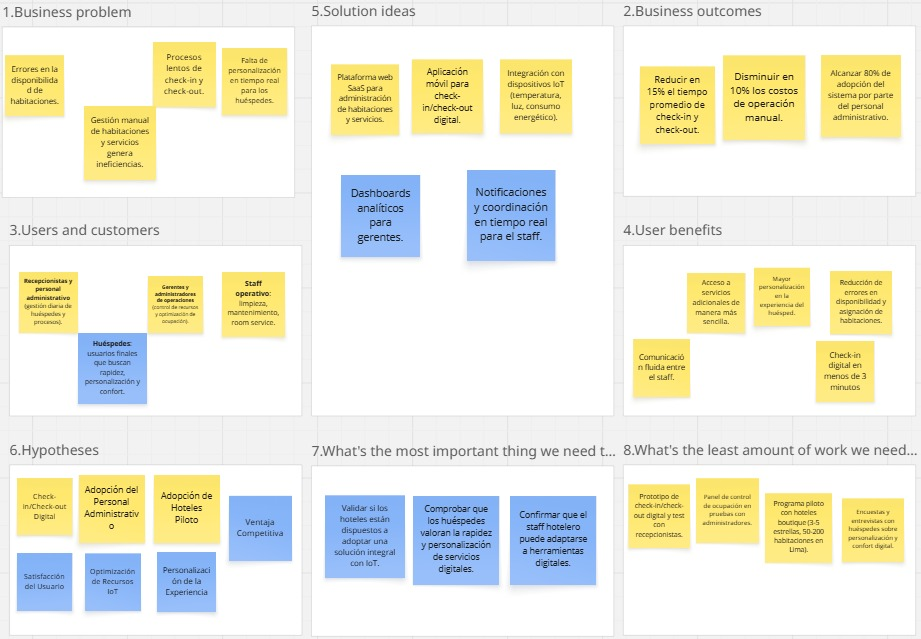

## 1.3. Segmentos objetivos.

Esta sección incluye la descripción de los segmentos asociados al dominio del problema de gestión hotelera manual e ineficiente, incluyendo características demográficas e información estadística de sustento.

**Segmento Primario: Administradores de Hoteles Boutique y Pequeños en Lima**

**Características Demográficas:**

- **Edad**: Entre 35 y 50 años (basado en estudios regionales)
- **Nivel educativo**: Técnico o universitario en administración hotelera, turismo o áreas afines
- **Experiencia profesional**: 5-15 años en el sector hotelero, especialmente en hoteles de 3-4 estrellas
- **Cargo**: Gerentes generales, administradores, directores de operaciones

**Información del Sector:**

- **Número de hoteles**: Más de 300 hoteles pequeños (20-100 habitaciones) en Lima Metropolitana
- **Categorías**: Principalmente 3-4 estrellas
- **Ubicación**: Concentrados en Miraflores, San Isidro, Barranco y Centro Histórico
- **Tipo**: Hoteles boutique e independientes

**Inversión en Tecnología**
- **Presupuesto anual**: Entre $1,000 y $5,000 USD para sistemas de gestión y automatización
- **Adopción**: Transición lenta pero creciente hacia sistemas digitales
- **Apoyo**: Capacitaciones y subsidios tecnológicos disponibles a través de FEDECATUR

**Desafíos Operativos Identificados**
- Falta de acceso a financiamiento para modernización tecnológica
- Altos costos operativos por procesos manuales y baja eficiencia
- Tiempo excesivo dedicado a tareas administrativas (reduce atención al cliente)
- Impacto del tipo de cambio y estacionalidad que limita inversiones
- Muchos hoteles pequeños aún operan con procesos manuales en contabilidad, reservas y atención al cliente

---

**Segmento Secundario: Huéspedes de Hoteles**

**Perfil Demográfico**
- **Edad**: Entre 25 y 45 años (alta presencia de millennials y jóvenes profesionales)
- **Nivel socioeconómico**: Medio-alto a alto, con capacidad de gasto superior al promedio
- **Procedencia**:
    - **Internacional**: 40% - turistas de EE.UU., Europa, Chile y Colombia
    - **Nacional**: 60% - limeños y viajeros de Arequipa y Cusco que buscan experiencias urbanas modernas

**Comportamiento de Viaje**
- **Frecuencia**: 2-4 viajes al año, combinando ocio y trabajo (bleisure)
- **Duración promedio**: 2-5 noches en hoteles boutique
- **Gasto promedio**: $90-180 USD por noche (dependiendo del distrito y categoría)

**Preferencias Tecnológicas**
- **68%** elige hoteles con buena reputación digital (reseñas, presencia en redes, apps de reserva)
- **Dispuestos a pagar más** por experiencias digitales como:
    - Check-in sin contacto
    - Control de habitación vía app
    - WiFi de alta velocidad
    - Smart TV y asistentes virtuales

**Uso de Tecnología Durante la Estadía**
- **Dispositivo principal**: Smartphones para gestionar toda la estadía
- **Servicios esperados**:
    - WiFi gratuito y rápido
    - Apps del hotel para servicios internos
    - Integración con WhatsApp o Booking Pulse para atención al cliente
- **Gestión digital**: Reservas, pagos, mapas, recomendaciones

**Mercado Hotelero Boutique en Lima**
- **Total de hoteles**: Más de 2,000 hoteles registrados en Lima, con una parte significativa siendo boutique o pequeños
- **Hoteles destacados**: Pullman Lima Miraflores y Vignette Collection SOUMA (integran tecnología y diseño moderno)
- **Crecimiento**: Sostenido en el segmento boutique, impulsado por viajeros que valoran experiencias personalizadas y digitales
- **Ingresos adicionales**: 10-20% del total provienen de servicios digitales (upgrades, experiencias virtuales, tours online) en hoteles bien posicionados

**Datos de Sustento Estadístico**

**Oportunidad de Mercado**
- Lima cuenta con más de 300 hoteles pequeños objetivo para Smart Stay
- El 68% de huéspedes valora la reputación digital del hotel
- Los ingresos por servicios digitales representan hasta 20% del total en hoteles tecnológicamente avanzados
- Crecimiento sostenido del segmento boutique impulsado por demanda de experiencias digitales personalizadas

**Validación del Mercado Objetivo**

Esta información proporciona una base sólida para validar que existe un mercado objetivo claro y definido para la solución Smart Stay, con necesidades específicas tanto del lado de la oferta (administradores) como de la demanda (huéspedes tech-savvy).

# **Capítulo II: Requirements Elicitation & Analysis**

## 2.1. Competidores.

El mercado de soluciones para gestión hotelera en Lima y a nivel global presenta diversos actores que ofrecen herramientas digitales, sistemas tracionales de gestión y, en menor medida, plataformas integradas con IoT. Se identificaron los principales competidores:

#### 2.1.1 Análisis Competitivo.

El análisis competitivo permite identificar las fortalezas y debilidades de los principales actores del mercado frente a la propuesta de **Smart Stay**.  

| Competidor              | Fortalezas                                                                 | Debilidades                                                                 | Diferenciación de Smart Stay |
|--------------------------|----------------------------------------------------------------------------|----------------------------------------------------------------------------|-------------------------------|
| **Oracle Hospitality**  | Reconocimiento global, soluciones completas de gestión hotelera.           | Alto costo, complejidad de implementación, poco flexible para hoteles pequeños. | Plataforma más accesible y enfocada en hoteles boutique. |
| **Amadeus Hospitality** | Escalabilidad, fuerte presencia en cadenas hoteleras internacionales.      | Costos elevados, lenta implementación, baja personalización.               | Enfoque ágil y flexible para hoteles independientes. |
| **RoomRaccoon**         | SaaS en la nube, interfaz intuitiva, diseñado para hoteles pequeños.       | Limitada presencia en LATAM, soporte técnico remoto.                       | Presencia local y soporte técnico en español para Lima. |
| **Smartpricing**        | IA para revenue management y optimización de precios.                      | No cubre operaciones completas ni personalización del huésped.             | Gestión integral + IoT con personalización de la experiencia. |
| **Startups locales**    | Precios accesibles, soporte en español, integración con canales de reservas. | Funcionalidades limitadas, sin IoT, poco enfoque en experiencia del huésped. | Plataforma integral que combina PMS + IoT + personalización. |
| **Sistemas manuales**   | Bajo costo inicial, fáciles de usar sin capacitación avanzada.             | Ineficiencia, errores frecuentes, cero automatización.                     | Digitalización total y reducción de costos operativos. |

#### 2.1.2  Estrategias y Tácticas frente a Competidores.

Para posicionarse de manera efectiva frente a los competidores,  **Smart Stay** implementará las siguientes estrategias: 

#### Estrategias

1. **Diferenciación Tecnológica**: Integrar gestión hotelera con IoT, algo que los competidores actuales no ofrecen de manera completa.
2. **Enfoque en nicho**: Dirigirse a hoteles boutique y pequeños (20-100 habitaciones), un segmento poco atendido por gigantes como Oracle o Amadeus.
3. **Modelo de suscripción accesible**: Precios escalables según número de habitaciones, permitiendo competir contra soluciones costosas sin sacrificar funcionalidad.
4. **Soporte local y en español**: Acompañamiento cercano que mejora la adopción frente a competidores extranjeros.
5. **Valor medible**: Promesa clara de reducción de costos operativos (10-20%)

#### Tácticas

- **Programa píloto** con hoteles boutique de lima para generar casos de éxito y testimonios.
- **Alianzas estratégicas** con gremios turísticos (ej. FEDECATUR) para acelerar la adopción.
- **Capacitación continua** para el personal hotelero, disminuyendo resistencia al cambio.
- **Marketing digital enfocado en ROI**: Mostrar comparativas de costos y beneficios frente a sistemas tracicionales
- **Integraciones rápidas** con PMS existentes para facilitar la migración y reduccir fricciones.
- **Atencion postventa 24/7** como ventaja competitiva sobre startups con soporte limitado. 

## 2.1. Entrevistas.
Con el objetivo de profundizar en las necesidades y expectativas de los segmentos objetivos, se realizaron entrevistas semiestructuradas a administradores de hoteles boutique y a huéspedes. Esta información cualitativa sirvió como base para identificar problemáticas actuales y orientar la definición de requisitos del sistema.

#### 2.1.2  Diseño de entrevistas

### Entrevista – Segmento 1: Administradores de Hoteles Boutique y Pequeños

1. ¿Cómo te llamas y qué cargo ocupas en el hotel?  
2. ¿En qué distrito o ciudad se encuentra el hotel?  
3. ¿Cuántas habitaciones y personal gestionan aproximadamente?  
4. ¿Podrías contarme cómo es un día típico de trabajo administrando el hotel?  
5. ¿Qué tan seguido deben gestionar procesos como reservas, check-in/check-out o facturación?  
6. ¿Cómo suelen organizar actualmente la gestión de reservas y pagos?  
7. ¿Han tenido dificultades con sobrerreservas, disponibilidad de habitaciones o errores de facturación?  
8. ¿Qué dispositivos usas con mayor frecuencia para gestionar el hotel?  
9. ¿Qué aplicaciones o sistemas usas actualmente en tu día a día para el manejo del hotel?  
10. ¿Has tenido alguna dificultad o experiencia negativa al usarlas?  
11. ¿Qué te motivaría a adoptar una nueva herramienta digital para centralizar reservas, pagos y tareas del personal?  
12. Si una herramienta digital lograra optimizar tus operaciones y reducir tus costos, ¿cómo valorarías invertir en una suscripción mensual para acceder a ella?  
13. ¿Cuáles son tus principales preocupaciones respecto a la gestión del hotel?

### Entrevista – Segmento 2: Huéspedes de Hoteles

1. ¿Cómo te llamas y con qué frecuencia viajas por turismo o trabajo?
2. ¿Qué tipo de hotel sueles elegir (boutique, cadena internacional, Airbnb, etc.) y por qué?
3. ¿Qué valoras más en un hotel: ubicación, precio, comodidad o servicios digitales?
4. ¿Cómo fue tu última experiencia de check-in y check-out? ¿Qué mejorarías?
5. ¿Qué tan importante es para ti poder personalizar tu habitación (temperatura, luz, limpieza, room service) desde tu celular u otro dispositivo tecnológico?
6. ¿Qué servicios digitales utilizas más durante tu estadía en un hotel (WiFi, app del hotel, WhatsApp, smart TV, llaves digitales)?
7. ¿Has tenido experiencias negativas con la gestión del hotel (esperas largas, problemas con el servicio, falta de personalización)?
8. ¿Qué opinas de un sistema que te permita hacer check-in sin pasar por recepción y controlar tu habitación desde una app?
9. ¿Estarías dispuesto a pagar un poco más por un hotel que ofrezca experiencias digitales y personalización avanzada? ¿Cuánto aproximadamente?
10. ¿Qué tanto influyen las reseñas digitales y la reputación online en tu decisión de reservar un hotel?
11. Si un hotel ofreciera un servicio totalmente digitalizado, ¿qué expectativa tendrías respecto al trato humano? ¿Lo consideras un valor agregado o no es necesario?
12. ¿Qué recomendarías para que la experiencia digital en un hotel sea cómoda y no complicada para los huéspedes?

### 2.2.2. Registro de entrevistas

### Entrevista – Segmento 1: Administradores de Hoteles Boutique y Pequeños

#### Entrevista 1

Datos del entrevistado:

**Nombre completo:** Adrian Saavedra Angulo 

**Edad:** 34 años

**Ciudad:** Tarapoto 

**Duración:** 8:07 minutos

**Evidencia:** 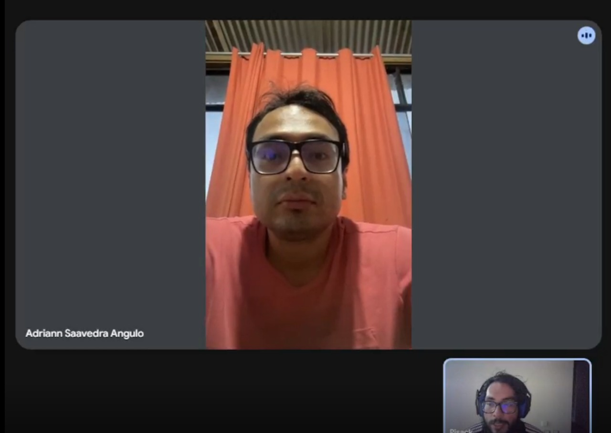

**Resumen de la entrevista**

Adrián administra un hotel de 12 habitaciones en Tarapoto con un equipo de 6 personas. Su rutina diaria incluye revisar reservas, coordinar limpieza, organizar recojos y responder a nuevas solicitudes. Los procesos de reservas y facturación son constantes por el alto movimiento del negocio.
Aunque cuentan con un sistema propio, han tenido problemas de sobreventa porque no se sincroniza con todas las plataformas, lo que obliga a actualizaciones manuales y genera errores. Adrián estaría motivado a usar una herramienta que centralice la gestión y se integre con plataformas externas, siempre que el costo de suscripción sea razonable.

**URL del video:** [https://shorturl.at/7UPcY](https://upcedupe-my.sharepoint.com/:v:/g/personal/u20191c464_upc_edu_pe/ESyVWXpzLu5BntGjGocrfCQBzbC6LcTyvE1fJR1lpZgD7g?nav=eyJyZWZlcnJhbEluZm8iOnsicmVmZXJyYWxBcHAiOiJTdHJlYW1XZWJBcHAiLCJyZWZlcnJhbFZpZXciOiJTaGFyZURpYWxvZy1MaW5rIiwicmVmZXJyYWxBcHBQbGF0Zm9ybSI6IldlYiIsInJlZmVycmFsTW9kZSI6InZpZXcifX0%3D&e=croANB)

---

#### Entrevista 2

Datos del entrevistado:

**Nombre completo:** Monica Hernandez Vela 

**Edad:** 33 años

**Ciudad:** Tarapoto 

**Duración:** 5:53 minutos

**Evidencia:** 

**URL del video:** [https://shorturl.at/7UPcY](https://upcedupe-my.sharepoint.com/:v:/g/personal/u20191c464_upc_edu_pe/EdqJPIq2kS1Jv-WFlDlGmQsBrYHjn4HfJhkJQcrdY9D9BQ?e=NfHBpW&nav=eyJyZWZlcnJhbEluZm8iOnsicmVmZXJyYWxBcHAiOiJTdHJlYW1XZWJBcHAiLCJyZWZlcnJhbFZpZXciOiJTaGFyZURpYWxvZy1MaW5rIiwicmVmZXJyYWxBcHBQbGF0Zm9ybSI6IldlYiIsInJlZmVycmFsTW9kZSI6InZpZXcifX0%3D)

**Resumen de la entrevista**

Mónica administra un hotel de 12 habitaciones en Tarapoto con un equipo de 4 personas. Su rutina diaria incluye organizar los desayunos, coordinar la limpieza, asignar habitaciones, atender a los turistas y revisar constantemente las reservas. Utiliza un sistema propio a través de la página web del hotel, gestionado principalmente desde laptops y computadoras, y se comunica con su personal mediante WhatsApp.
Ha tenido dificultades con el uso del sistema actual y señala que le motivaría adoptar una herramienta digital que centralice la gestión de reservas y operaciones, siempre que pueda adaptarse a las características de su hotel. Considera razonable pagar una suscripción mensual si contribuye a mejorar los servicios del establecimiento.

---

#### Entrevista 3

Datos del entrevistado:
**Nombre completo:** Alejandra Beltrán Diaz

**Edad:** 23 años

**Ciudad:** Tarapoto 

**Duración:** 4:11 minutos

**Evidencia:** 

**URL del video:** [https://shorturl.at/7UPcY](https://upcedupe-my.sharepoint.com/:v:/g/personal/u20191c464_upc_edu_pe/EafROYDObWhKpbd2D1HKOVYBNtkLrBMdElD0yQFrdCl0ZA?e=1qSp39&nav=eyJyZWZlcnJhbEluZm8iOnsicmVmZXJyYWxBcHAiOiJTdHJlYW1XZWJBcHAiLCJyZWZlcnJhbFZpZXciOiJTaGFyZURpYWxvZy1MaW5rIiwicmVmZXJyYWxBcHBQbGF0Zm9ybSI6IldlYiIsInJlZmVycmFsTW9kZSI6InZpZXcifX0%3D)

**Resumen de la entrevista**

Valeria Alejandra administra un hotel de 19 habitaciones junto a un equipo de 5 personas. Su día típico comienza organizando al personal de limpieza, revisando las reservas recibidas por WhatsApp y luego trasladándolas a un archivo Excel para llevar el control. Su principal herramienta es este archivo, aunque reconoce que no siempre guarda correctamente la información, lo que ha ocasionado problemas con reservas perdidas.
También ha tenido experiencias negativas con WhatsApp, ya que a veces resulta difícil ubicar las reservas registradas en la aplicación. Para ella, un sistema ideal de gestión debería incluir notificaciones automáticas que recuerden las reservas del día. Valeria considera que pagar una suscripción mensual sería una buena opción si la herramienta realmente simplifica las labores administrativas del hotel.

---

### Entrevista – Segmento 2: Huéspedes de Hoteles Boutique

---

#### Entrevista 1

Datos del entrevistado:

**Nombre completo:** Diego Michael Segura Martínez

**Edad:** 25 años

**Distrito:** Santa Anita – Lima Metropolitana

**Duración:** 5:34 minutos

**Evidencia:** 

**URL del video:** [https://shorturl.at/7UPcY](https://upcedupe-my.sharepoint.com/:v:/g/personal/u202019498_upc_edu_pe/Ecu4CtT8NWxKgN-Lk8cgX0MB0LMVwWwuwQo6Bmx0fNUlCg?e=tbxK6m&nav=eyJyZWZlcnJhbEluZm8iOnsicmVmZXJyYWxBcHAiOiJTdHJlYW1XZWJBcHAiLCJyZWZlcnJhbFZpZXciOiJTaGFyZURpYWxvZy1MaW5rIiwicmVmZXJyYWxBcHBQbGF0Zm9ybSI6IldlYiIsInJlZmVycmFsTW9kZSI6InZpZXcifX0%3D)

**Resumen de la entrevista**

Diego suele hospedarse en hoteles cuando viaja, principalmente con su pareja y en menor medida con su familia. Prefiere hoteles cómodos, con privacidad y buena experiencia. Valora la comodidad y los servicios digitales que simplifiquen su estadía.
Su principal frustración son las esperas en recepción y la falta de personalización. Le atrae la idea de un sistema digital que permita check-in/check-out sin filas y control de la habitación desde el celular (luz, temperatura, room service).
Utiliza principalmente WiFi y Smart TV, pero estaría dispuesto a usar una app centralizada. Confía en las reseñas digitales para tomar decisiones y estaría dispuesto a pagar entre 10% y 15% más por un hotel con experiencias digitales avanzadas.
Considera que el trato humano sigue siendo un valor agregado, aunque la digitalización es clave. Recomienda que los sistemas sean fáciles de usar y que cada hotel cuente con una página clara con descripción completa y disponibilidad de habitaciones en tiempo real.

---

#### Entrevista 2

Datos del entrevistado:

**Nombre completo:** Juan Salcedo  

**Edad:** 44 años

**Distrito:** San Borja – Lima Metropolitana

**Duración:** 6:11 minutos

**Nombre:** Juan Salcedo  
**Edad:** 44 años  
**Distrito:** San Borja

**Evidencia:** 

**URL del video:** [https://shorturl.at/7UPcY](https://upcedupe-my.sharepoint.com/:v:/g/personal/u20221e617_upc_edu_pe/ERPriyAe3RlMlJHW2WouYN8BTLnggzX4JPIaQq2eElKZXQ?nav=eyJyZWZlcnJhbEluZm8iOnsicmVmZXJyYWxBcHAiOiJPbmVEcml2ZUZvckJ1c2luZXNzIiwicmVmZXJyYWxBcHBQbGF0Zm9ybSI6IldlYiIsInJlZmVycmFsTW9kZSI6InZpZXciLCJyZWZlcnJhbFZpZXciOiJNeUZpbGVzTGlua0NvcHkifX0&e=wfbeZY)  

**Resumen de la entrevista**

Juan viaja por trabajo cada 1-2 meses y prefiere alojamientos cómodos, autónomos y con buena conectividad, optando principalmente por Airbnb y, en menor medida, por hoteles. Valora especialmente la ubicación céntrica, el Wi-Fi de calidad y la facilidad tecnológica. Considera que los horarios estrictos de check-in y check-out son una gran limitación, y aunque nunca ha usado una habitación totalmente “smart”, le interesa la idea, aunque cree que aún no está bien implementada en Perú. No pagaría más por funciones digitales avanzadas, ya que las asocia con un público más joven. Usa Wi-Fi como servicio indispensable, junto con laptop y smartphone, y ha tenido experiencias negativas relacionadas con demoras en la atención y falta de limpieza, además de percibir una falta de personalización en el servicio. Recomienda priorizar la mejora del Wi-Fi (fibra óptica) y mantener una atención eficiente, considerando que la digitalización debe complementar, pero no reemplazar, el buen trato humano.

---

#### Entrevista 3

Datos del entrevistado:

**Nombre completo:** Tadeo Loja Beloglio 

**Edad:** 22 años

**Distrito:** Santiago de Surco – Lima Metropolitana

**Duración:** 7:21 minutos

**Evidencia:** 

**URL del video:** [Entrevista-3](https://upcedupe-my.sharepoint.com/:v:/g/personal/u20201f051_upc_edu_pe/EX5Eq-XT8MdGnWsqsTcHL7MBqeTy6xG91s4YoE9WcsRY_w?nav=eyJyZWZlcnJhbEluZm8iOnsicmVmZXJyYWxBcHAiOiJTdHJlYW1XZWJBcHAiLCJyZWZlcnJhbFZpZXciOiJTaGFyZURpYWxvZy1MaW5rIiwicmVmZXJyYWxBcHBQbGF0Zm9ybSI6IldlYiIsInJlZmVycmFsTW9kZSI6InZpZXcifX0%3D&e=0XZvvA)

**Resumen de la entrevista**

Tadeo viaja por turismo una vez al año y suele elegir hoteles de cadenas internacionales porque le ofrecen mayor confianza y calidad de servicio, aunque también considera opciones boutique si el precio es conveniente. Lo que más valora es el precio y la comodidad, seguido de la ubicación. Su última experiencia de check-in fue lenta, mientras que el check-out resultó rápido, por lo que cree que ambos procesos deberían digitalizarse.

No considera esencial la personalización de la habitación, pero sí cómodo poder controlar luz y temperatura desde el celular. Durante sus estadías utiliza principalmente el WiFi y la smart TV, y le gustaría contar con llaves digitales.

Entre los problemas que ha tenido destacan las largas esperas en recepción y la falta de coordinación en la limpieza. Considera muy práctico un sistema de check-in digital y control de la habitación mediante una app, y estaría dispuesto a pagar hasta un 5% más por ello siempre que mejore la experiencia.

Las reseñas digitales influyen en un 70% en su decisión de reserva. Para él, el trato humano sigue siendo un valor agregado incluso en un hotel digitalizado, y recomienda que la experiencia digital se concentre en una app única, sencilla y con asistencia rápida.

---
## Entrevista 4

Datos del entrevistado:

**Nombre completo:** Joaquin Fernandez

**Edad:** 21 años

**Distrito:** Santiago de Surco – Lima Metropolitana

**Duración:** 4:44 minutos

**Evidencia:** 

**Enlace al video en Microsoft Stream:** [Entrevista-4](https://upcedupe-my.sharepoint.com/:v:/g/personal/u20201f051_upc_edu_pe/EfHhd4ZVeqNEuji_fhRH2HABSjkFsOZnYobTIIqx-BN9nw?nav=eyJyZWZlcnJhbEluZm8iOnsicmVmZXJyYWxBcHAiOiJTdHJlYW1XZWJBcHAiLCJyZWZlcnJhbFZpZXciOiJTaGFyZURpYWxvZy1MaW5rIiwicmVmZXJyYWxBcHBQbGF0Zm9ybSI6IldlYiIsInJlZmVycmFsTW9kZSI6InZpZXcifX0%3D&e=eCsesR)  

**Resumen de la entrevista**

Joaquín viaja por turismo una vez al año y suele elegir hoteles sencillos o Airbnb por ser accesibles y prácticos, aunque también considera los boutique si el precio es conveniente. Lo que más valora es el precio y la comodidad, seguido de la ubicación.
Su última experiencia de check-in fue lenta, mientras que el check-out resultó rápido, por lo que cree que ambos procesos deberían digitalizarse. No considera esencial la personalización de la habitación, pero sí cómodo poder controlar luz
y temperatura desde el celular. Durante sus estadías utiliza principalmente el WiFi y la smart TV, y le gustaría contar con llaves digitales. Entre los problemas que ha tenido destacan las largas esperas en recepción y la falta de coordinación
en la limpieza. Considera muy práctico un sistema de check-in digital y control de la habitación mediante una app, y estaría dispuesto a pagar entre 5% y 10% más por ello siempre que mejore la experiencia. Las reseñas digitales influyen en un 70% en su decisión de reserva. Para él, el trato humano sigue siendo un valor agregado incluso en un hotel digitalizado, y recomienda que la experiencia digital se concentre en una app única, sencilla y con asistenciarápida.

---

### 2.2.2. Análisis de entrevistas

**Segmento 1 – Administradores de Hoteles Boutique y Pequeños en Lima**

| Entrevistado   | Hotel               | Herramientas actuales                   | Dolor principal                                  | Motivación                                                 | Pago por suscripción           |
| -------------- | ------------------- | --------------------------------------- | ------------------------------------------------ | ---------------------------------------------------------- | ------------------------------ |
| Adrián (34)    | 12 hab., 6 personas | Sistema propio no sincroniza            | **Sobreventa, errores por actualización manual** | Centralizar gestión + integraciones externas               | Sí, si el costo es razonable   |
| Mónica (33)    | 12 hab., 4 personas | Sistema web propio + laptops + WhatsApp | **Dificultad de uso, poco flexible**             | Herramienta que centralice operaciones adaptada a su hotel | Sí, si mejora servicios        |
| Alejandra (23) | 19 hab., 5 personas | WhatsApp + Excel                        | **Reservas perdidas, falta de control**          | Notificaciones automáticas + simplificación                | Sí, si realmente ahorra tiempo |

**Hallazgos clave segmento 1:**

- Problemas principales: Los entrevistados enfrentan dificultades recurrentes con la gestión de reservas debido a la ausencia de un sistema centralizado. Entre los problemas más destacados se encuentran la sobreventa de habitaciones, la duplicación de tareas administrativas y la pérdida de información en los registros. Estas situaciones generan ineficiencia, errores en la atención y mayor carga operativa.
- Solución esperada: Los administradores expresaron la necesidad de implementar una herramienta digital que integre la gestión de reservas con otros procesos internos, tales como la coordinación de limpieza, los servicios adicionales y la generación de notificaciones automáticas. De esta manera, se busca simplificar el trabajo, reducir errores y aumentar la eficiencia operativa.
- Disposición de pago: Existe consenso en la disposición a pagar por una suscripción mensual, siempre que la solución proporcione beneficios tangibles en términos de simplicidad y mejora del control administrativo.
- Perfil digital: Aunque los establecimientos cuentan con sistemas propios, aún prevalece el uso de herramientas básicas como WhatsApp y Excel para el registro y seguimiento de reservas. Esto revela un nivel bajo de madurez tecnológica, pero acompañado de apertura hacia la adopción de soluciones digitales más sofisticadas.

---

**Segmento 2 – Huéspedes de Hoteles**

| Entrevistado | Perfil                   | Frustraciones                                                         | Valor esperado                                             | Pago adicional |
| ------------ | ------------------------ | --------------------------------------------------------------------- | ---------------------------------------------------------- | -------------- |
| Diego (25)   | Viaja con pareja/familia | Esperas en recepción, falta de personalización                        | Check-in/out digital, control desde celular, app unificada | Sí, +10%-15%   |
| Juan (44)    | Viaja por trabajo        | Horarios rígidos, Wi-Fi deficiente, falta de limpieza/personalización | Mejor Wi-Fi, atención rápida, flexibilidad                 | No pagaría más |
| Tadeo (22)   | Viaja por turismo anual  | Esperas en recepción, falta de coordinación en limpieza               | Check-in digital, control desde app, llaves digitales      | Sí, hasta +5%  |
| Joaquín (21) | Viaja por turismo anual  | Largas esperas, limpieza deficiente                                   | Check-in digital, control desde app, llaves digitales      | Sí, +5% a +10% |

**Hallazgos clave segmento 2:**

- Problemas principales: Los participantes identifican como principales frustraciones las demoras en los procesos de check-in y check-out, la falta de personalización en el servicio, los horarios inflexibles, problemas de limpieza y deficiencias en la conectividad Wi-Fi. Estas situaciones afectan tanto a viajeros frecuentes como a los que viajan por turismo ocasional.
- Solución esperada: Existe una fuerte preferencia por herramientas digitales que faciliten el check-in/check-out sin contacto, el control de funciones de la habitación desde el celular (como iluminación, temperatura y llaves digitales), y la disponibilidad de una app única para centralizar todos los servicios. Aunque la personalización total no es vista como esencial por todos, sí se espera comodidad y eficiencia.
- Disposición de pago: Los usuarios más jóvenes muestran disposición a pagar entre un 5% y 15% más por experiencias digitales que realmente mejoren su estadía. Por otro lado, los viajeros mayores, como profesionales en viaje de trabajo, priorizan la funcionalidad y el costo, y no están dispuestos a pagar más por servicios digitales avanzados.
- Perfil digital: El nivel de madurez tecnológica del segmento puede clasificarse como intermedio a alto. Todos los entrevistados utilizan Wi-Fi, Smart TV y reseñas digitales como parte clave de su experiencia de hospedaje. Existe apertura hacia la innovación, siempre que esta sea fácil de usar y aporte valor real a la experiencia del huésped.

**Conclusión Integradora**

El análisis de ambos segmentos revela que, aunque sus necesidades se orientan a aspectos distintos del servicio, existe un punto común en la demanda de mayor digitalización y centralización de procesos. Para el segmento 1  el reto principal radica en mejorar la gestión operativa mediante sistemas integrados. Para el segmento 2 la prioridad se centra en optimizar la experiencia del usuario a través de herramientas digitales que reduzcan tiempos de espera, ofrezcan personalización y garanticen conectividad.

Ambos segmentos muestran apertura a soluciones tecnológicas, aunque con diferentes expectativas y niveles de disposición de pago. Este hallazgo subraya la oportunidad de diseñar una plataforma integral que atienda simultáneamente la eficiencia operativa del hotel y la satisfacción del huésped, alineando la modernización de los procesos internos con la mejora de la experiencia de los clientes.

---

## 2.3. Needfinding.

### 2.3.1. User Personas.

**Segmento 1 – Administradores de Hoteles Boutique y Pequeños en Lima**

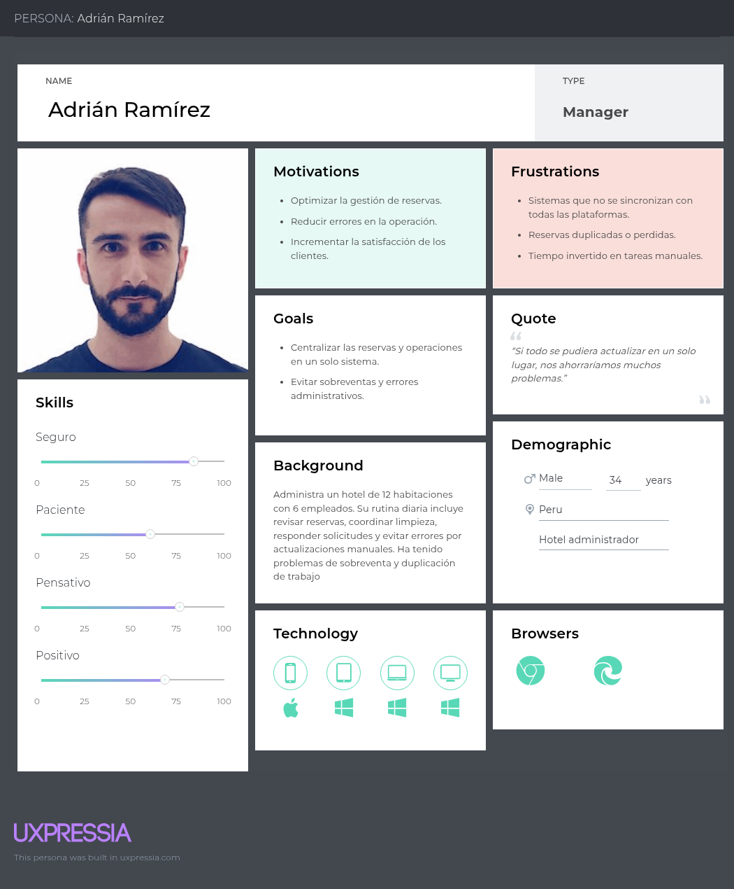 

**Segmento 2 – Huéspedes de Hoteles**

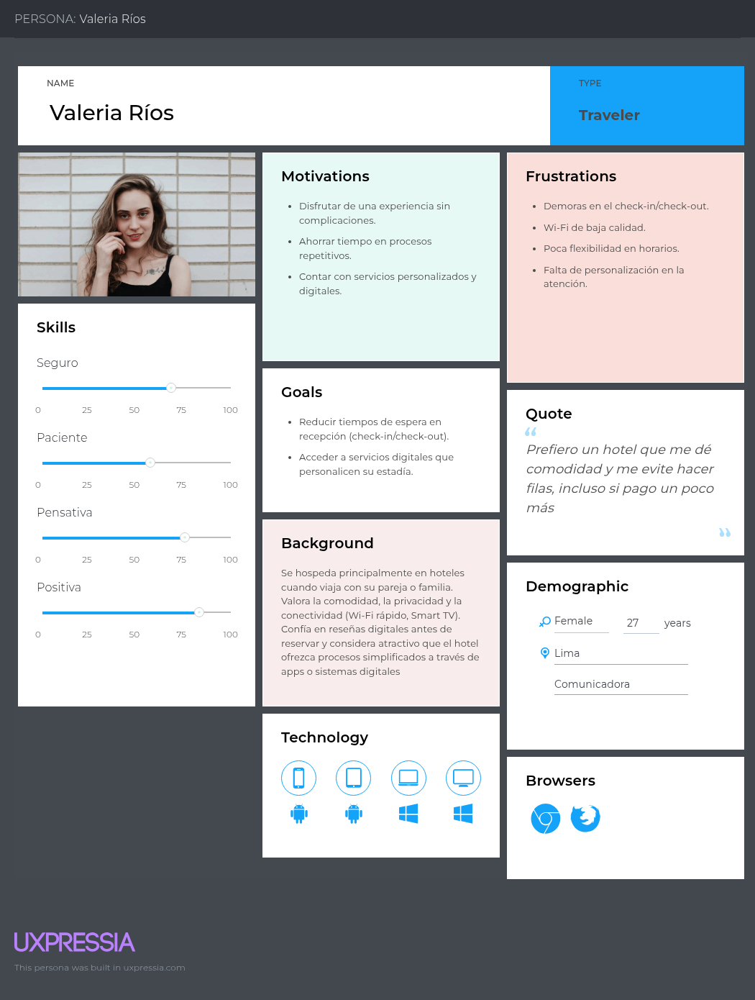 

---
 
### 2.3.2. User Task Matrix

La siguiente matriz cruza a nuestros **User Personas** con las tareas clave que realizan en el hotel, considerando **frecuencia** e **importancia** para priorizar funcionalidades del sistema.

**Adrián Ramírez (Administrador de hotel boutique)**

| **Tarea**                           | **Frecuencia** | **Importancia** |
|-------------------------------------|----------------|-----------------|
| Gestionar reservas y disponibilidad | Alta           | Alta            |
| Evitar sobreventas y duplicados     | Alta           | Alta            |
| Coordinar limpieza y personal       | Media          | Alta            |
| Revisar y responder solicitudes     | Alta           | Media           |
| Centralizar operaciones en un sistema único | Media | Alta |

---

**Valeria Ríos (Huésped)**

| **Tarea**                                  | **Frecuencia** | **Importancia** |
|--------------------------------------------|----------------|-----------------|
| Hacer check-in/check-out                   | Alta           | Alta            |
| Acceder a wifi rápido y confiable          | Alta           | Alta            |
| Personalizar su estadía con servicios digitales | Media      | Alta            |
| Ahorrar tiempo en procesos                 | Alta           | Alta            |

### 2.3.3. User Journey Mapping.

El User Journey Mapping permite visualizar las etapas que recorren los usuarios desde el descubrimiento de la solución hasta la evaluación final de su experiencia. A través de este recurso se identifican los objetivos de los usuarios, los puntos de contacto con el servicio, sus pensamientos, percepciones y oportunidades de mejora en cada fase del proceso.

En el caso de Smart Stay, se elaboraron dos mapas diferenciados según los segmentos objetivos:

- **Segmento 1** : enfocado en la gestión operativa y la centralización de reservas.
- **Segmento 2** : centrado en la experiencia de estadía y la digitalización de servicios.

Estos recorridos permiten detectar fricciones, validar expectativas y proponer mejoras orientadas a optimizar tanto la gestión hotelera como la satisfacción de los huéspedes.

**Segmento 1 – Administradores de Hoteles Boutique y Pequeños en Lima**

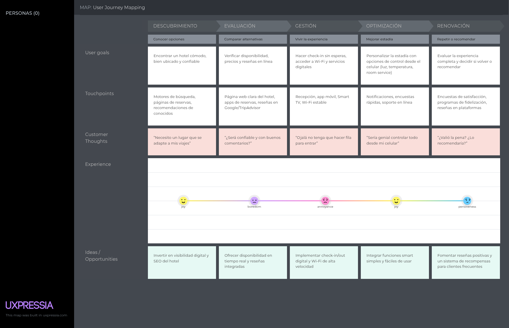 

**Segmento 2 – Huéspedes de Hoteles**

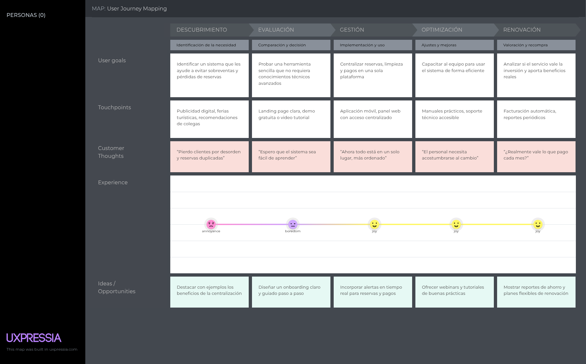 

---

### 2.3.4. Empathy Mapping.

**Adrián Ramírez (Administrador de hotel boutique):**

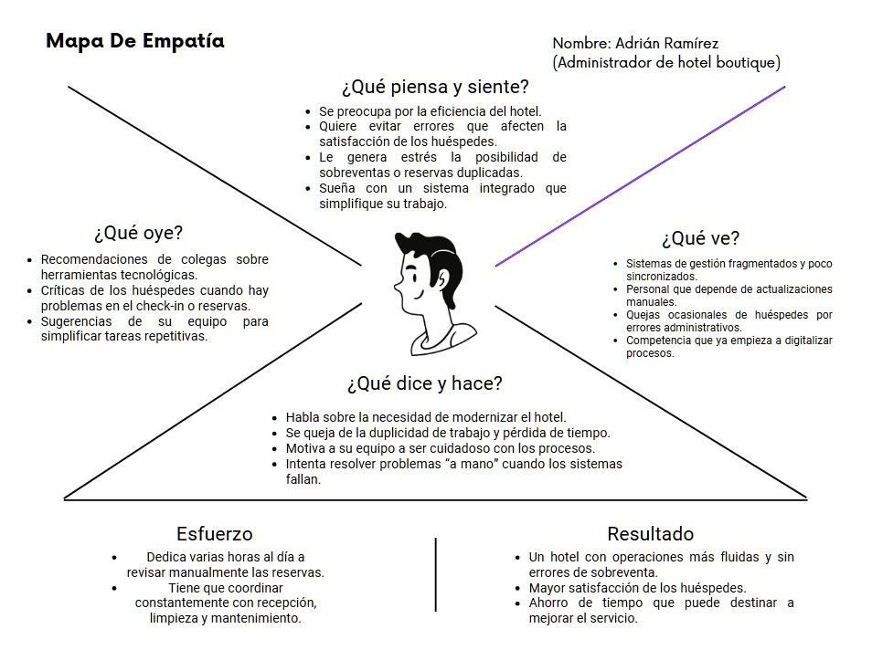

**Valeria Ríos (Huésped / Viajera):**

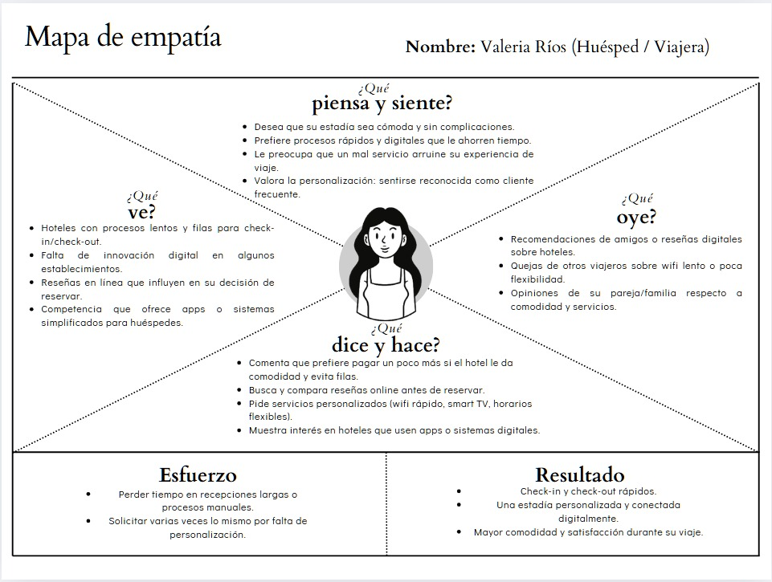

## 2.4. Big Picture EventStorming.

---

## 2.5. Ubiquitous Language.

| **Término en Inglés**        | **Término en Español**             | **Definición**                                                                                                                                      |
| ---------------------------- | ---------------------------------- | --------------------------------------------------------------------------------------------------------------------------------------------------- |
| Hotel Administrator          | Administrador del hotel            | Usuario encargado de la gestión operativa del hotel. Supervisa reservas, limpieza, facturación y coordinación con el personal.                      |
| Reservation Management       | Gestión de reservas                | Proceso centralizado de registro, confirmación, modificación y cancelación de reservas en tiempo real.                                              |
| Overbooking                  | Sobreventa                         | Situación en la que el hotel vende más habitaciones de las disponibles debido a la falta de sincronización en los sistemas de reserva.              |
| Housekeeping Schedule        | Programación de limpieza           | Organización de tareas de limpieza y mantenimiento de habitaciones, coordinadas desde el sistema de gestión.                                        |
| Digital Check-In / Check-Out | Registro digital de entrada/salida | Funcionalidad que permite al huésped ingresar o salir del hotel sin necesidad de hacer filas en recepción, a través de una aplicación o portal web. |
| Guest Profile                | Perfil del huésped                 | Información digital del cliente que incluye preferencias, historial de estadías y solicitudes especiales.                                           |
| Smart Room Control           | Control inteligente de habitación  | Función que permite al huésped manejar servicios como iluminación, temperatura o room service desde su dispositivo móvil.                           |
| Real-Time Notification       | Notificación en tiempo real        | Alerta automática que informa sobre nuevas reservas, cambios en disponibilidad o solicitudes de huéspedes.                                          |
| Financial Report             | Reporte financiero                 | Documento digital generado por el sistema que resume ingresos, gastos y métricas clave para evaluar la rentabilidad del hotel.                      |
| Guest Feedback               | Retroalimentación del huésped      | Opiniones y calificaciones que los huéspedes comparten sobre su estadía, utilizadas para mejorar los servicios.                                     |

---

# **Capítulo III: Requirements Specification**

## 3.1. User Stories.

**Epics**

| EPIC ID | Nombre del Epic                           | Descripción                                                                                                         |
| ------- | ----------------------------------------- | ------------------------------------------------------------------------------------------------------------------- |
| EP01    | Registro y Gestión de Perfil de Huésped   | Como huésped, quiero registrarme, iniciar sesión y gestionar mi perfil de forma segura para acceder a mis reservas. |
| EP02    | Registro y Gestión de Perfil de Anfitrión | Como anfitrión, quiero registrarme y administrar mi perfil para publicar propiedades y gestionar reservas.          |
| EP03    | Gestión de Propiedades                    | Como anfitrión, quiero registrar, editar y eliminar propiedades con fotos, precios y descripciones.                 |
| EP04    | Búsqueda y Reserva de Estancias           | Como huésped, quiero buscar propiedades y realizar reservas fácilmente.                                             |
| EP05    | Pagos y Facturación                       | Como usuario, quiero pagar de manera segura y consultar mis comprobantes de pago.                                   |
| EP06    | Reseñas y Calificaciones                  | Como usuario, quiero dejar reseñas y calificaciones después de una estancia.                                        |
| EP07    | Soporte y Ayuda                           | Como usuario, quiero acceder a soporte técnico y resolver mis dudas.                                                |
| EP08    | Exploración como Visitante                | Como visitante, quiero conocer las funcionalidades de SmartStay desde la landing page antes de registrarme.         |

**Desarrollo de Epics**

**EP01 – Registro y Gestión de Perfil de Huésped**

| User Story ID | Título                     |
| ------------- | -------------------------- |
| US01          | Registro de huésped        |
| US02          | Inicio de sesión seguro    |
| US03          | Recuperación de contraseña |
| US04          | Edición de perfil personal |

| Technical Story ID | Título                                               |
| ------------------ | ---------------------------------------------------- |
| TS01               | Registro de usuario a través de la API |

**EP02 – Registro y Gestión de Perfil de Anfitrión**

| User Story ID | Título                             |
| ------------- | ---------------------------------- |
| US05          | Registro de anfitrión              |
| US06          | Verificación de identidad básica   |
| US07          | Configuración de datos de contacto |
| US08          | Edición de perfil de anfitrión     |

| Technical Story ID | Título                                              |
| ------------------ | --------------------------------------------------- |
| TS02               | Inicio de sesión a través de la API |

**EP03 – Gestión de Propiedades**

| User Story ID | Título                             |
| ------------- | ---------------------------------- |
| US09          | Registrar nueva propiedad          |
| US10          | Subir fotos de la propiedad        |
| US11          | Editar información de la propiedad |
| US12          | Eliminar propiedad                 |

| Technical Story ID | Título                             |
| ------------------ | ---------------------------------- |
| TS09              | Crear habitación a través de la API |
| TS10              | Obtener habitación por ID a través de la API |
| TS17              | Obtener todas las habitaciones a través de la API |
| TS18              | Obtener tipo de habitación por ID a través de la API |

**EP04 – Búsqueda y Reserva de Estancias**

| User Story ID | Título                           |
| ------------- | -------------------------------- |
| US13          | Buscar propiedades por ubicación |
| US14          | Filtrar por precio y fechas      |
| US15          | Reservar una propiedad           |
| US16          | Ver historial de reservas        |

| Technical Story ID | Título                                      |
| ------------------ | ------------------------------------------- |
| TS11              | Crear reserva a través de la API |
| TS12              | Obtener reserva por ID a través de la API |
| TS13              | Confirmar reserva a través de la API |
| TS19              | Obtener todas las reservas a través de la API |
| TS20              | Cancelar reserva a través de la API |

**EP05 – Pagos y Facturación**

| User Story ID | Título                        |
| ------------- | ----------------------------- |
| US17          | Realizar pago en línea        |
| US18          | Consultar historial de pagos  |
| US19          | Descargar comprobante de pago |

| Technical Story ID | Título                                                |
| ------------------ | ----------------------------------------------------- |
| TS14               | Crear pago a través de la API |
| TS15               | Procesar pago a través de la API |
| TS16               | Obtener pagos por reserva a través de la API |
| TS21               | Obtener pago por ID a través de la API |
| TS22               | Obtener todos los pagos a través de la API |

**EP06 – Reseñas y Calificaciones**

| User Story ID | Título                        |
| ------------- | ----------------------------- |
| US20          | Dejar reseña de una estancia  |
| US21          | Calificar anfitrión o huésped |
| US22          | Ver reseñas de una propiedad  |

| Technical Story ID | Título                                              |
| ------------------ | --------------------------------------------------- |
| TS06               | Formulario de reseñas conectado a la UI, guardado simulado en frontendFormulario de reseñas conectado a la UI, guardado simulado en frontend  |

**EP07 – Soporte y Ayuda**

| User Story ID | Título                         |
| ------------- | ------------------------------ |
| US23          | Acceder a preguntas frecuentes |
| US24          | Enviar reporte de problema     |
| US25          | Contactar con soporte técnico  |

**EP08 – Exploración como Visitante**

| User Story ID | Título                                   |
| ------------- | ---------------------------------------- |
| US26          | Ver información general sobre SmartStay  |
| US27          | Conocer beneficios de usar la plataforma |
| US28          | Acceder fácilmente al registro o login   |

| Technical Story ID | Título                             |
| ------------------ | ---------------------------------- |
| TS08               | Implementar landing page con navegación hacia login/registro |

---

**EP01 – Registro y Autenticación**

| ID Épica | Épica                                   | ID   | Título                               | Descripción                                                                      | Criterios de Aceptación                                                                                                                                                                                                                                                                                                                                                    |
| -------- | --------------------------------------- | ---- | ------------------------------------ | -------------------------------------------------------------------------------- | -------------------------------------------------------------------------------------------------------------------------------------------------------------------------------------------------------------------------------------------------------------------------------------------------------------------------------------------------------------------------- |
| EP01     | Registro y Gestión de Perfil de Huésped | US01 | Registro de huésped                  | Como huésped, quiero registrarme en la plataforma para crear mi cuenta.          | - Escenario 1: Registro exitoso   **Dado** que el usuario completa el formulario de registro con datos válidos,   **Cuando** envía la solicitud de registro,   **Entonces** el sistema registra al usuario y confirma la creación de la cuenta.                                                                                                              |
| EP01     | Registro y Gestión de Perfil de Huésped | US02 | Inicio de sesión seguro              | Como huésped registrado, quiero iniciar sesión para acceder a mis funciones.     | - Escenario 1: Inicio exitoso   **Dado** que el usuario ya está registrado,   **Cuando** envía credenciales válidas,   **Entonces** el sistema autentica al usuario y le permite acceder a sus funciones.    - Escenario 2: Inicio fallido   **Dado** que el usuario envía credenciales incorrectas,   **Cuando** intenta iniciar sesión,   **Entonces** el sistema rechaza la autenticación y notifica el error. |
| EP01     | Registro y Gestión de Perfil de Huésped | US03 | Recuperación de contraseña           | Como huésped, quiero recuperar mi contraseña para poder acceder si la olvido.    | - Escenario 1: Recuperación exitosa   **Dado** que el usuario olvidó su contraseña,   **Cuando** solicita la recuperación proporcionando su correo electrónico,   **Entonces** el sistema procesa la solicitud y envía un enlace de restablecimiento al correo registrado.                                                                                                                                                    |
| EP01     | Registro y Gestión de Perfil de Huésped | US04 | Edición de perfil personal           | Como huésped, quiero editar mi información personal para mantenerla actualizada. | - Escenario 1: Edición de perfil   **Dado** que el usuario está autenticado,   **Cuando** modifica sus datos personales y envía la actualización,   **Entonces** el sistema actualiza la información del perfil correctamente.                                                                                                                                                                  |
| EP01     | Registro y Gestión de Perfil de Huésped | TS01 | Registro de usuario a través de la API | Como desarrollador frontend, quiero registrar usuarios a través de la API para implementar el flujo de registro en la interfaz. | - Escenario 1: Registro exitoso   **Dado** que se recibe una petición POST a `/api/v1/authentication/sign-up` con atributos: Username, Password, Email, Role,   **Cuando** la API valida y persiste el usuario,   **Entonces** la API responde `200 OK` y retorna el usuario creado con sus atributos (id, username, email, role).    - Escenario 2: Error de validación   **Dado** que se recibe una petición POST a `/api/v1/authentication/sign-up` con atributos faltantes o inválidos,   **Cuando** la API rechaza la petición por validación,   **Entonces** la API responde `400 Bad Request` y retorna un payload de error describiendo los problemas de validación. |

**EP02 – Búsqueda y Reserva de Propiedades**

| ID Épica | Épica                                     | ID   | Título                                   | Descripción                                                                                             | Criterios de Aceptación                                                                                                                                                                                                                                                                                                                                                                                          |
| -------- | ----------------------------------------- | ---- | ---------------------------------------- | ------------------------------------------------------------------------------------------------------- | ---------------------------------------------------------------------------------------------------------------------------------------------------------------------------------------------------------------------------------------------------------------------------------------------------------------------------------------------------------------------------------------------------------------- |
| EP02     | Registro y Gestión de Perfil de Anfitrión | US05 | Registro de anfitrión                    | Como anfitrión, quiero registrarme en la plataforma para publicar mis propiedades.                      | - Escenario 1: Registro exitoso   **Dado** que el usuario completa el formulario de registro de anfitrión con datos válidos,   **Cuando** envía la solicitud de registro,   **Entonces** el sistema registra al anfitrión y confirma la creación de la cuenta.                                                                                                                                     |
| EP02     | Registro y Gestión de Perfil de Anfitrión | US06 | Verificación de identidad básica         | Como anfitrión, quiero verificar mi identidad de manera sencilla para dar confianza a los huéspedes.    | - Escenario 1: Verificación cargada   **Dado** que el anfitrión está autenticado,   **Cuando** envía un documento válido de identificación,   **Entonces** el sistema procesa el documento y actualiza el estado de verificación como "En revisión".                                                                                                                                                                             |
| EP02     | Registro y Gestión de Perfil de Anfitrión | US07 | Configuración de datos de contacto       | Como anfitrión, quiero configurar mis datos de contacto para que los huéspedes puedan comunicarse.      | - Escenario 1: Configuración exitosa   **Dado** que el anfitrión está autenticado,   **Cuando** envía datos de contacto actualizados (teléfono o correo),   **Entonces** el sistema actualiza los datos de contacto correctamente.                                                                                                                                                                                            |
| EP02     | Registro y Gestión de Perfil de Anfitrión | US08 | Edición de perfil de anfitrión           | Como anfitrión, quiero editar mi información personal y de negocio para mantenerla actualizada.         | - Escenario 1: Edición correcta   **Dado** que el anfitrión está autenticado,   **Cuando** envía información actualizada de su perfil,   **Entonces** el sistema actualiza los cambios exitosamente.                                                                                                                                                                                                            |
| EP02     | Registro y Gestión de Perfil de Anfitrión | TS02 | Inicio de sesión a través de la API | Como desarrollador frontend, quiero autenticar usuarios a través de la API para implementar el flujo de inicio de sesión. | - Escenario 1: Autenticación exitosa   **Dado** que se recibe una petición POST a `/api/v1/authentication/sign-in` con atributos: Username, Password,   **Cuando** las credenciales son válidas,   **Entonces** la API responde `200 OK` y retorna `AuthenticatedUserResource` (información del usuario y token JWT).    - Escenario 2: Credenciales inválidas   **Dado** que se recibe una petición POST a `/api/v1/authentication/sign-in` con credenciales incorrectas,   **Cuando** la API valida las credenciales,   **Entonces** la API responde `401 Unauthorized` o `404 Not Found` con un payload de error. |

**EP03 – Gestión de Propiedades**

| ID Épica | Épica                  | ID   | Título                             | Descripción                                                                                                              | Criterios de Aceptación                                                                                                                                                                                                                 |
| -------- | ---------------------- | ---- | ---------------------------------- | ------------------------------------------------------------------------------------------------------------------------ | --------------------------------------------------------------------------------------------------------------------------------------------------------------------------------------------------------------------------------------- |
| EP03     | Gestión de Propiedades | US09 | Registrar nueva propiedad          | Como anfitrión, quiero registrar una nueva propiedad con descripción, precio y ubicación para ofrecerla a los huéspedes. | - Escenario 1: Registro exitoso **Dado** que el anfitrión está autenticado, **Cuando** envía los datos completos de la propiedad (descripción, precio, ubicación), **Entonces** el sistema registra la propiedad y la incluye en su lista de propiedades. |
| EP03     | Gestión de Propiedades | US10 | Subir fotos de la propiedad        | Como anfitrión, quiero subir fotos de mi propiedad para que los huéspedes tengan una mejor referencia.                   | - Escenario 1: Carga correcta **Dado** que el anfitrión tiene una propiedad registrada, **Cuando** envía imágenes válidas para la propiedad, **Entonces** el sistema procesa y almacena las fotos asociándolas a la propiedad.                       |
| EP03     | Gestión de Propiedades | US11 | Editar información de la propiedad | Como anfitrión, quiero editar los datos de mi propiedad para mantenerlos actualizados.                                   | - Escenario 1: Edición exitosa **Dado** que el anfitrión tiene una propiedad registrada, **Cuando** envía datos actualizados de la propiedad, **Entonces** el sistema actualiza la información de la propiedad correctamente.                                                      |
| EP03     | Gestión de Propiedades | US12 | Eliminar propiedad                 | Como anfitrión, quiero eliminar una propiedad registrada para que ya no aparezca disponible.                             | - Escenario 1: Eliminación correcta **Dado** que el anfitrión tiene una propiedad registrada, **Cuando** solicita la eliminación de la propiedad, **Entonces** el sistema elimina la propiedad y la retira de su lista.                                          |
| EP03     | Gestión de Propiedades | TS09 | Crear habitación a través de la API | Como desarrollador frontend, quiero crear habitaciones a través de la API para implementar el flujo de registro de habitaciones. | - Escenario 1: Creación exitosa **Dado** que se recibe una petición POST a `/api/v1/rooms` con atributos: RoomTypeId, Number, Status,  **Cuando** la API valida y persiste la habitación, **Entonces** la API responde `201 Created` y retorna la habitación creada con sus atributos (id, roomTypeId, number, status).  - Escenario 2: Error de validación **Dado** que se recibe una petición POST a `/api/v1/rooms` con atributos faltantes o inválidos, **Cuando** la API rechaza la petición por validación, **Entonces** la API responde `400 Bad Request` y retorna un payload de error. |
| EP03     | Gestión de Propiedades | TS10 | Obtener habitación por ID a través de la API | Como desarrollador frontend, quiero obtener una habitación por ID para implementar la vista de detalle de habitación. | - Escenario 1: Habitación encontrada **Dado** que se recibe una petición GET a `/api/v1/rooms/{roomId}`, **Cuando** la API encuentra la habitación, **Entonces** la API responde `200 OK` y retorna `RoomResource` con los datos de la habitación.  - Escenario 2: Habitación no encontrada **Dado** que se recibe una petición GET a `/api/v1/rooms/{roomId}` para un ID inexistente, **Cuando** la API no encuentra la habitación, **Entonces** la API responde `404 Not Found` y retorna un payload de error. |
| EP03     | Gestión de Propiedades | TS17 | Obtener todas las habitaciones a través de la API | Como desarrollador frontend, quiero obtener todas las habitaciones para implementar la lista de habitaciones. | - Escenario 1: Lista exitosa **Dado** que se recibe una petición GET a `/api/v1/rooms`, **Cuando** la API retorna habitaciones, **Entonces** la API responde `200 OK` con un array de `RoomResource` items.  - Escenario 2: Lista vacía **Dado** que se recibe una petición GET a `/api/v1/rooms` cuando no hay habitaciones, **Cuando** la API no encuentra habitaciones, **Entonces** la API responde `200 OK` con un array vacío. |
| EP03     | Gestión de Propiedades | TS18 | Obtener tipo de habitación por ID a través de la API | Como desarrollador frontend, quiero obtener un tipo de habitación por ID para mostrar información del tipo. | - Escenario 1: Tipo encontrado **Dado** que se recibe una petición GET a `/api/v1/room-types/{roomTypeId}`, **Cuando** la API encuentra el tipo de habitación, **Entonces** la API responde `200 OK` y retorna `RoomTypeResource` con los datos del tipo.  - Escenario 2: Tipo no encontrado **Dado** que se recibe una petición GET a `/api/v1/room-types/{roomTypeId}` para un ID inexistente, **Cuando** la API no encuentra el tipo, **Entonces** la API responde `404 Not Found` y retorna un payload de error. |

**EP04 – Búsqueda y Reserva de Estancias**

| ID Épica | Épica                           | ID   | Título                               | Descripción                                                                                           | Criterios de Aceptación                                                                                                                                                                                                                                                                                                                                                  |
| -------- | ------------------------------- | ---- | ------------------------------------ | ----------------------------------------------------------------------------------------------------- | ------------------------------------------------------------------------------------------------------------------------------------------------------------------------------------------------------------------------------------------------------------------------------------------------------------------------------------------------------------------------ |
| EP04     | Búsqueda y Reserva de Estancias | US13 | Buscar propiedades por ubicación     | Como huésped, quiero buscar propiedades por ubicación para encontrar opciones cercanas a donde viajo. | - Escenario 1: Búsqueda exitosa **Dado** que el huésped proporciona una ciudad o dirección válida, **Cuando** envía la solicitud de búsqueda, **Entonces** el sistema retorna las propiedades disponibles en esa ubicación.                                                                                                                                                                 |
| EP04     | Búsqueda y Reserva de Estancias | US14 | Filtrar por precio y fechas          | Como huésped, quiero aplicar filtros de precio y fechas para ajustar mi búsqueda.                     | - Escenario 1: Filtro aplicado **Dado** que el huésped envía criterios de filtrado (precio y fechas), **Cuando** solicita la búsqueda con filtros, **Entonces** el sistema retorna solo las propiedades que cumplen con esos criterios.                                                                                                                                                            |
| EP04     | Búsqueda y Reserva de Estancias | US15 | Reservar una propiedad               | Como huésped, quiero reservar una propiedad para asegurar mi estancia en las fechas seleccionadas.    | - Escenario 1: Reserva exitosa **Dado** que el huésped selecciona una propiedad disponible, **Cuando** envía la solicitud de reserva con fechas válidas, **Entonces** el sistema procesa y confirma la reserva.                                                                                                                                                                            |
| EP04     | Búsqueda y Reserva de Estancias | US16 | Ver historial de reservas            | Como huésped, quiero ver mi historial de reservas para consultar mis viajes pasados y futuros.        | - Escenario 1: Consulta exitosa **Dado** que el huésped está autenticado, **Cuando** solicita su historial de reservas, **Entonces** el sistema retorna sus reservas previas y próximas.                                                                                                                                                                      |
| EP04     | Búsqueda y Reserva de Estancias | TS11 | Crear reserva a través de la API | Como desarrollador frontend, quiero crear reservas a través de la API para implementar el flujo de reservación. | - Escenario 1: Creación exitosa **Dado** que se recibe una petición POST a `/api/v1/bookings` con atributos: RoomId, GuestId, CheckInDate, CheckOutDate,  **Cuando** la API valida y persiste la reserva, **Entonces** la API responde `201 Created` y retorna la reserva creada con sus atributos (id, roomId, guestId, checkInDate, checkOutDate, status).  - Escenario 2: Error de validación **Dado** que se recibe una petición POST a `/api/v1/bookings` con atributos faltantes o fechas inválidas, **Cuando** la API rechaza la petición por validación, **Entonces** la API responde `400 Bad Request` y retorna un payload de error.  - Escenario 3: Habitación no disponible **Dado** que se recibe una petición POST a `/api/v1/bookings` para una habitación no disponible en las fechas solicitadas, **Cuando** la API verifica la disponibilidad, **Entonces** la API responde `409 Conflict` y retorna un payload de error indicando conflicto de disponibilidad. |
| EP04     | Búsqueda y Reserva de Estancias | TS12 | Obtener reserva por ID a través de la API | Como desarrollador frontend, quiero obtener una reserva por ID para implementar la vista de detalle de reserva. | - Escenario 1: Reserva encontrada **Dado** que se recibe una petición GET a `/api/v1/bookings/{bookingId}`, **Cuando** la API encuentra la reserva, **Entonces** la API responde `200 OK` y retorna `BookingResource` con los datos de la reserva.  - Escenario 2: Reserva no encontrada **Dado** que se recibe una petición GET a `/api/v1/bookings/{bookingId}` para un ID inexistente, **Cuando** la API no encuentra la reserva, **Entonces** la API responde `404 Not Found` y retorna un payload de error. |
| EP04     | Búsqueda y Reserva de Estancias | TS13 | Confirmar reserva a través de la API | Como desarrollador frontend, quiero confirmar reservas a través de la API para implementar el flujo de confirmación. | - Escenario 1: Confirmación exitosa **Dado** que se recibe una petición POST a `/api/v1/bookings/{bookingId}/confirm`, **Cuando** la API procesa la confirmación, **Entonces** la API responde `200 OK` y retorna la reserva actualizada con status "Confirmed".  - Escenario 2: Reserva no encontrada **Dado** que se recibe una petición POST a `/api/v1/bookings/{bookingId}/confirm` para un ID inexistente, **Cuando** la API no encuentra la reserva, **Entonces** la API responde `404 Not Found` y retorna un payload de error. |
| EP04     | Búsqueda y Reserva de Estancias | TS19 | Obtener todas las reservas a través de la API | Como desarrollador frontend, quiero obtener todas las reservas para implementar la lista de reservas. | - Escenario 1: Lista exitosa **Dado** que se recibe una petición GET a `/api/v1/bookings`, **Cuando** la API retorna reservas, **Entonces** la API responde `200 OK` con un array de `BookingResource` items.  - Escenario 2: Lista vacía **Dado** que se recibe una petición GET a `/api/v1/bookings` cuando no hay reservas, **Cuando** la API no encuentra reservas, **Entonces** la API responde `200 OK` con un array vacío. |
| EP04     | Búsqueda y Reserva de Estancias | TS20 | Cancelar reserva a través de la API | Como desarrollador frontend, quiero cancelar reservas a través de la API para implementar el flujo de cancelación. | - Escenario 1: Cancelación exitosa **Dado** que se recibe una petición POST a `/api/v1/bookings/{bookingId}/cancel`, **Cuando** la API procesa la cancelación, **Entonces** la API responde `200 OK` y retorna la reserva actualizada con status "Cancelled".  - Escenario 2: Reserva no encontrada **Dado** que se recibe una petición POST a `/api/v1/bookings/{bookingId}/cancel` para un ID inexistente, **Cuando** la API no encuentra la reserva, **Entonces** la API responde `404 Not Found` y retorna un payload de error. |

**EP05 – Pagos y Facturación**

| ID Épica | Épica               | ID   | Título                        | Descripción                                                                               | Criterios de Aceptación                                                                                                                                                                                                                                                                                                                                                            |
| -------- | ------------------- | ---- | ----------------------------- | ----------------------------------------------------------------------------------------- | ---------------------------------------------------------------------------------------------------------------------------------------------------------------------------------------------------------------------------------------------------------------------------------------------------------------------------------------------------------------------------------- |
| EP05     | Pagos y Facturación | US17 | Realizar pago en línea        | Como usuario, quiero realizar un pago en línea para completar mi reserva.                 | - Escenario 1: Pago exitoso **Dado** que el usuario tiene una reserva pendiente de pago, **Cuando** envía los datos de pago válidos, **Entonces** el sistema procesa el pago y confirma la transacción.  - Escenario 2: Pago rechazado **Dado** que el usuario envía datos de pago inválidos, **Cuando** intenta procesar el pago, **Entonces** el sistema rechaza la transacción y notifica el error. |
| EP05     | Pagos y Facturación | US18 | Consultar historial de pagos  | Como usuario, quiero consultar mi historial de pagos para revisar mis transacciones.      | - Escenario 1: Ver historial **Dado** que el usuario está autenticado y tiene transacciones realizadas, **Cuando** solicita su historial de pagos, **Entonces** el sistema retorna la lista de pagos realizados.  - Escenario 2: Sin historial **Dado** que el usuario no tiene pagos registrados, **Cuando** solicita su historial de pagos, **Entonces** el sistema retorna una lista vacía.                |
| EP05     | Pagos y Facturación | US19 | Descargar comprobante de pago | Como usuario, quiero descargar un comprobante de pago para tener un respaldo.             | - Escenario 1: Descarga exitosa **Dado** que el usuario tiene un pago registrado, **Cuando** solicita el comprobante de pago, **Entonces** el sistema genera y proporciona un documento con los datos del pago.                                                                                                                                                                                            |
| EP05     | Pagos y Facturación | TS14 | Crear pago a través de la API | Como desarrollador frontend, quiero crear pagos a través de la API para implementar el flujo de procesamiento de pagos. | - Escenario 1: Creación exitosa **Dado** que se recibe una petición POST a `/api/v1/payments` con atributos: BookingId, Amount, PaymentMethod,  **Cuando** la API valida y persiste el pago, **Entonces** la API responde `201 Created` y retorna el pago creado con sus atributos (id, bookingId, amount, status, paymentMethod).  - Escenario 2: Error de validación **Dado** que se recibe una petición POST a `/api/v1/payments` con atributos faltantes o inválidos, **Cuando** la API rechaza la petición por validación, **Entonces** la API responde `400 Bad Request` y retorna un payload de error. |
| EP05     | Pagos y Facturación | TS15 | Procesar pago a través de la API | Como desarrollador frontend, quiero procesar pagos a través de la API para completar transacciones. | - Escenario 1: Procesamiento exitoso **Dado** que se recibe una petición POST a `/api/v1/payments/{paymentId}/process`, **Cuando** la API procesa el pago exitosamente, **Entonces** la API responde `200 OK` y retorna el pago actualizado con status "Completed".  - Escenario 2: Procesamiento fallido **Dado** que se recibe una petición POST a `/api/v1/payments/{paymentId}/process`, **Cuando** el procesamiento del pago falla, **Entonces** la API responde `200 OK` y retorna el pago actualizado con status "Failed". |
| EP05     | Pagos y Facturación | TS16 | Obtener pagos por reserva a través de la API | Como desarrollador frontend, quiero obtener los pagos asociados a una reserva para mostrar el historial de pagos. | - Escenario 1: Pagos encontrados **Dado** que se recibe una petición GET a `/api/v1/payments/booking/{bookingId}`, **Cuando** la API encuentra pagos asociados a la reserva, **Entonces** la API responde `200 OK` y retorna un array de `PaymentResource` con los pagos de la reserva.  - Escenario 2: Sin pagos **Dado** que se recibe una petición GET a `/api/v1/payments/booking/{bookingId}` para una reserva sin pagos, **Cuando** la API no encuentra pagos, **Entonces** la API responde `200 OK` con un array vacío.     |
| EP05     | Pagos y Facturación | TS21 | Obtener pago por ID a través de la API | Como desarrollador frontend, quiero obtener un pago por ID para implementar la vista de detalle de pago. | - Escenario 1: Pago encontrado **Dado** que se recibe una petición GET a `/api/v1/payments/{paymentId}`, **Cuando** la API encuentra el pago, **Entonces** la API responde `200 OK` y retorna `PaymentResource` con los datos del pago.  - Escenario 2: Pago no encontrado **Dado** que se recibe una petición GET a `/api/v1/payments/{paymentId}` para un ID inexistente, **Cuando** la API no encuentra el pago, **Entonces** la API responde `404 Not Found` y retorna un payload de error. |
| EP05     | Pagos y Facturación | TS22 | Obtener todos los pagos a través de la API | Como desarrollador frontend, quiero obtener todos los pagos para implementar la lista de pagos. | - Escenario 1: Lista exitosa **Dado** que se recibe una petición GET a `/api/v1/payments`, **Cuando** la API retorna pagos, **Entonces** la API responde `200 OK` con un array de `PaymentResource` items.  - Escenario 2: Lista vacía **Dado** que se recibe una petición GET a `/api/v1/payments` cuando no hay pagos, **Cuando** la API no encuentra pagos, **Entonces** la API responde `200 OK` con un array vacío. |

**EP06 – Reseñas y Calificaciones**

| ID Épica | Épica                    | ID   | Título                            | Descripción                                                                                              | Criterios de Aceptación                                                                                                                                                                                                                                                                                                                                                                |
| -------- | ------------------------ | ---- | --------------------------------- | -------------------------------------------------------------------------------------------------------- | -------------------------------------------------------------------------------------------------------------------------------------------------------------------------------------------------------------------------------------------------------------------------------------------------------------------------------------------------------------------------------------- |
| EP06     | Reseñas y Calificaciones | US20 | Dejar reseña de una estancia      | Como usuario, quiero dejar una reseña después de mi estancia para compartir mi experiencia.              | - Escenario 1: Reseña enviada **Dado** que el usuario completó una estancia, **Cuando** envía una reseña con contenido válido, **Entonces** el sistema procesa y guarda la reseña asociándola a la estancia.  - Escenario 2: Validación **Dado** que el usuario intenta enviar una reseña vacía, **Cuando** envía la solicitud, **Entonces** el sistema rechaza la solicitud y notifica el error de validación.                           |
| EP06     | Reseñas y Calificaciones | US21 | Calificar anfitrión o huésped     | Como usuario, quiero calificar al anfitrión o huésped para dar retroalimentación.                        | - Escenario 1: Calificación registrada **Dado** que el usuario completó una interacción, **Cuando** envía una calificación con puntuación válida, **Entonces** el sistema registra la calificación y actualiza el perfil del calificado.                                                                                                                                                                             |
| EP06     | Reseñas y Calificaciones | US22 | Ver reseñas de una propiedad      | Como huésped, quiero ver reseñas de propiedades para tomar mejores decisiones.                           | - Escenario 1: Reseñas disponibles **Dado** que una propiedad tiene reseñas registradas, **Cuando** el huésped solicita las reseñas de la propiedad, **Entonces** el sistema retorna el listado de reseñas.  - Escenario 2: Sin reseñas **Dado** que una propiedad no tiene reseñas, **Cuando** el huésped solicita las reseñas, **Entonces** el sistema retorna una lista vacía. |

**EP07 – Seguridad y Privacidad**

| ID Épica | Épica           | ID   | Título                                                               | Descripción                                                                                         | Criterios de Aceptación                                                                                                                                                                                                                                                                                                                                                                                |
| -------- | --------------- | ---- | -------------------------------------------------------------------- | --------------------------------------------------------------------------------------------------- | ------------------------------------------------------------------------------------------------------------------------------------------------------------------------------------------------------------------------------------------------------------------------------------------------------------------------------------------------------------------------------------------------------ |
| EP07     | Soporte y Ayuda | US23 | Acceder a preguntas frecuentes                                       | Como usuario, quiero acceder a una sección de preguntas frecuentes para resolver mis dudas comunes. | - Escenario 1: Ver FAQs **Dado** que el usuario solicita las preguntas frecuentes, **Cuando** el sistema procesa la solicitud, **Entonces** el sistema retorna un listado con preguntas y respuestas.                                                                                                                                                                                             |
| EP07     | Soporte y Ayuda | US24 | Enviar reporte de problema                                           | Como usuario, quiero enviar un reporte de problema para notificar errores en la plataforma.         | - Escenario 1: Enviar reporte **Dado** que el usuario completa el formulario de reporte con datos válidos, **Cuando** envía el reporte, **Entonces** el sistema procesa y confirma la recepción del reporte.                                                                                                                                                                                                             |
| EP07     | Soporte y Ayuda | US25 | Contactar con soporte técnico                                        | Como usuario, quiero contactar con soporte técnico para recibir asistencia personalizada.           | - Escenario 1: Solicitar contacto **Dado** que el usuario envía una solicitud de contacto con datos válidos, **Cuando** el sistema procesa la solicitud, **Entonces** el sistema confirma que la solicitud será atendida.                                                                                                                                                                                         |

**EP08 – Exploración como Visitante**

| ID Épica | Épica                      | ID   | Título                                                    | Descripción                                                                                       | Criterios de Aceptación                                                                                                                                                                                                                                                                                                                                                                                           |
| -------- | -------------------------- | ---- | --------------------------------------------------------- | ------------------------------------------------------------------------------------------------- | ----------------------------------------------------------------------------------------------------------------------------------------------------------------------------------------------------------------------------------------------------------------------------------------------------------------------------------------------------------------------------------------------------------------- |
| EP08     | Exploración como Visitante | US26 | Ver información general sobre SmartStay                   | Como visitante, quiero ver información general sobre SmartStay para conocer la plataforma.        | - Escenario 1: Información visible **Dado** que el visitante accede al landing page, **Cuando** la página se carga, **Entonces** el sistema muestra información general de SmartStay.                                                                                                                                                                                                                        |
| EP08     | Exploración como Visitante | US27 | Conocer beneficios de usar la plataforma                  | Como visitante, quiero conocer los beneficios de usar la plataforma para evaluar su utilidad.     | - Escenario 1: Ver beneficios **Dado** que el visitante accede al landing page, **Cuando** navega por la sección de beneficios, **Entonces** el sistema muestra los principales beneficios destacados de la plataforma.                                                                                                                                                                                                     |
| EP08     | Exploración como Visitante | US28 | Acceder fácilmente al registro o login                    | Como visitante, quiero acceder fácilmente al registro o login para empezar a usar la plataforma.  | - Escenario 1: Acceso a registro/login **Dado** que el visitante está en el landing page, **Cuando** solicita acceso a registro o login, **Entonces** el sistema proporciona acceso a las páginas correspondientes.                                                                                                                                                                                             |
| EP08     | Exploración como Visitante | TS08 | Implementar landing page con navegación hacia login/registro | Como desarrollador, quiero implementar el landing page con navegación clara hacia login y registro. | - Escenario 1: Navegación funcional **Dado** que el visitante solicita acceso a registro o login desde el landing, **Cuando** el sistema procesa la solicitud, **Entonces** el sistema redirige correctamente a la página correspondiente.  - Escenario 2: Diseño responsive **Dado** que el visitante accede desde un dispositivo móvil, **Cuando** el landing se carga, **Entonces** el contenido se adapta al tamaño del dispositivo. |

## 3.2. Impact Mapping.

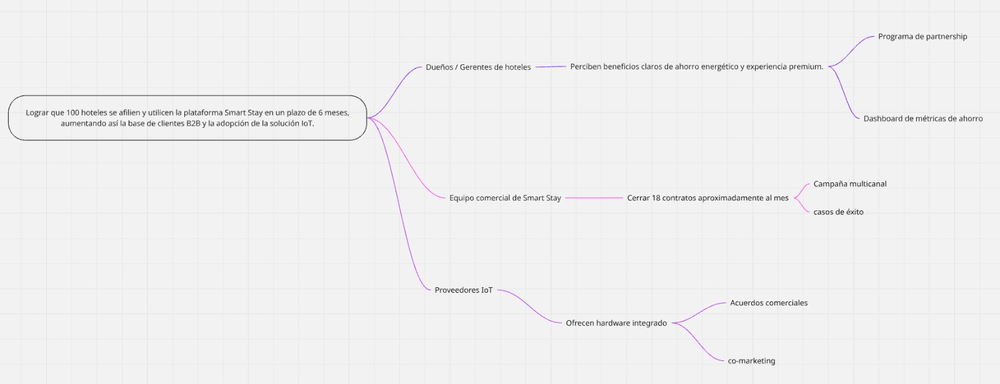

## 3.3. Product Backlog.

| #Orden | ID   | User Story / Technical Story                                             | Story Points |
| ------ | ---- | ------------------------------------------------------------------------ | ------------ |
| 01     | US01 | Registro de huésped                                                      | 5            |
| 02     | US02 | Inicio de sesión seguro                                                  | 5            |
| 03     | US03 | Recuperación de contraseña                                               | 3            |
| 04     | US04 | Edición de perfil personal                                               | 3            |
| 05     | TS01 | Conectar formularios de registro/login con validaciones en frontend      | 8            |
| 06     | US05 | Registro de anfitrión                                                    | 5            |
| 07     | US06 | Verificación de identidad básica                                         | 3            |
| 08     | US07 | Configuración de datos de contacto                                       | 3            |
| 09     | US08 | Edición de perfil de anfitrión                                           | 3            |
| 10     | TS02 | Validar campos de formulario en frontend (correo, contraseña, documento) | 8            |
| 11     | US09 | Registrar nueva propiedad                                                | 5            |
| 12     | US10 | Subir fotos de la propiedad                                              | 5            |
| 13     | US11 | Editar información de la propiedad                                       | 3            |
| 14     | US12 | Eliminar propiedad                                                       | 3            |
| 15     | US13 | Buscar propiedades por ubicación                                         | 5            |
| 16     | US14 | Filtrar por precio y fechas                                              | 5            |
| 17     | US15 | Reservar una propiedad                                                   | 8            |
| 18     | US16 | Ver historial de reservas                                                | 3            |
| 19     | TS03 | Crear buscador y filtros en frontend                                     | 8            |
| 20     | TS04 | Simular reservas con estado guardado en frontend                         | 5            |
| 21     | US17 | Realizar pago en línea                                                   | 8            |
| 22     | US18 | Consultar historial de pagos                                             | 3            |
| 23     | US19 | Descargar comprobante de pago                                            | 3            |
| 24     | TS05 | Simular integración de pago                                              | 8            |
| 25     | US20 | Dejar reseña de una estancia                                             | 5            |
| 26     | US21 | Calificar anfitrión o huésped                                            | 3            |
| 27     | US22 | Ver reseñas de una propiedad                                             | 3            |
| 28     | TS06 | Formulario de reseñas conectado a la UI, guardado simulado en frontend   | 5            |
| 29     | US23 | Acceder a preguntas frecuentes                                           | 3            |
| 30     | US24 | Enviar reporte de problema                                               | 3            |
| 31     | US25 | Contactar con soporte técnico                                            | 5            |
| 32     | TS07 | Implementar formulario de contacto y sección de preguntas frecuentes     | 8            |
| 33     | US26 | Ver información general sobre SmartStay                                  | 3            |
| 34     | US27 | Conocer beneficios de usar la plataforma                                 | 3            |
| 35     | US28 | Acceder fácilmente al registro o login                                   | 5            |
| 36     | TS08 | Implementar landing page con botones hacia login/registro                | 5            |

---

# Capítulo IV: Product Design

## 4.1. Style Guidelines

Nuestra base es establecer la identidad visual y de diseño de Smart Stay, asegurando coherencia, claridad y usabilidad en todos los puntos de contacto de la marca, tanto en medios digitales como en experiencias del usuario.

Objetivo:
- Alinear la comunicación visual y de producto con la misión de la startup.
-	Garantizar una experiencia de usuario clara, accesible y atractiva.
-	Facilitar la integración de diseño en web y aplicaciones móviles con un lenguaje unificado.

### 4.1.1. General Style Guidelines

**Branding**

- Logo Rewind: El logo principal de la startup con el que se muestra ante el público.

  
- Logo Modo Oscuro: Este logo es creado para contrastar en fondos oscuros, lo cual permite la protección de la vista del usuario y favorece el rendimiento de la batería de su dispositivo.

- Logo Plus: Es una versión del logo con un color que resalta más elegancia, el cual se usa para los usuarios que opten por usar la suscripción plus del servicio.

- Logo Plus Modo Oscuro: Tiene la misma función que el logo modo oscuro con la diferencia de que sirve para la suscripción plus.

  
- Logos Monocromáticos: Logos con paleta de colores blanco y negro, cuyo uso es exclusivo para impresiones y documentos.

**Tipografia**

- Fuente principal (Brand & Títulos):
  Cocomat Pro
  Uso: Logo, headers, títulos principales en la app/web.
  Razón: Da un aire moderno y premium, con un estilo limpio que refuerza la identidad de la marca.
  
- Fuente secundaria (Texto y párrafos)
  Open Sans o Lato
  Uso: Textos descriptivos, botones, menús, correos y cualquier contenido largo.
  Razón: Son altamente legibles en pantallas, versátiles y complementan la elegancia de Cocomat Pro sin competir con ella.
  
-Jerarquía de uso
1. Títulos (H1, H2): Cocomat Pro Bold.
2. Subtítulos / énfasis: Cocomat Pro Medium.
Texto general / párrafos: Open Sans Regular.
Botones y menús: Open Sans SemiBold.

- Sistema Tipográfico 
H1 (Títulos principales):
Cocomat Pro Bold – 32px

H2 (Subtítulos / secciones):
Cocomat Pro Medium – 24px

H3 (Bloques / cards):
Cocomat Pro Medium – 20px

Texto cuerpo (párrafos):
Open Sans Regular – 16px

Texto secundario / notas:
Open Sans Regular – 14px

Botones primarios:
Open Sans SemiBold – 16px (MAYÚSCULAS)

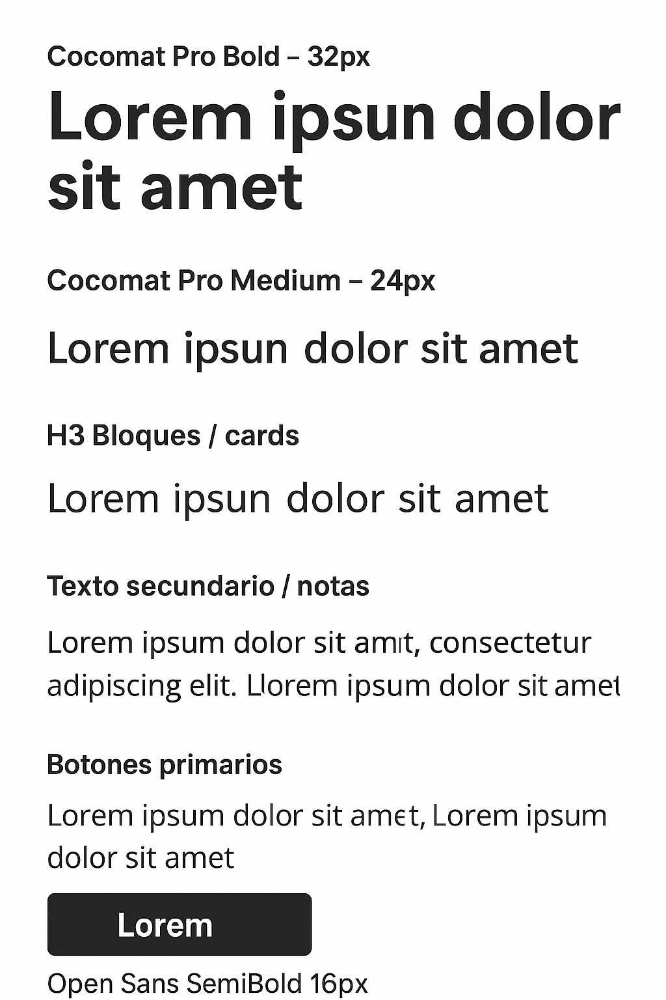

**Paleta de colores**
Espaciado de líneas: 1.5x en párrafos para mayor legibilidad.
Uso de color:
- Primario: Azul Marino (#2C3E91) → solidez, profesionalismo.
- Secundario: Dorado/Naranja Suave (#E67E22) → lujo, calidez.
- Neutros: Beige (#F5F5DC), Gris medio (#BDC3C7), Blanco (#FFFFFF).
- Apoyos: Verde agua (#1ABC9C) → frescura, sostenibilidad.

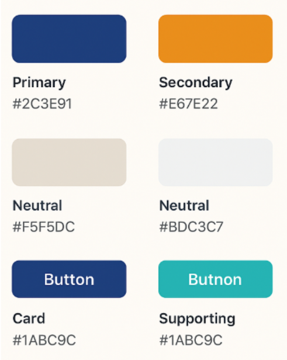

**Dimensiones**
- Cercano y humano: Hablar como si fueras un amigo confiable, sin tecnicismos innecesarios.
- Claro y directo: Frases cortas, fáciles de entender, sin rodeos.
- Inspirador: Transmitir seguridad y motivación para que el usuario sienta que tomó la mejor decisión.
- Profesional pero cálido: Ni demasiado rígido ni demasiado informal.
  
### 4.1.2. Web Style Guidelines

**Páginas principales**

- Home: enfoque en storytelling + CTA (“Probar demo”).
- Productos: módulos claros (cards azules) con descripciones cortas.
- Soluciones: bloques con imágenes + botones de acción (descargar brochure).
- Precios:  tabla comparativa clara (Plan Normal vs Plan Plus).
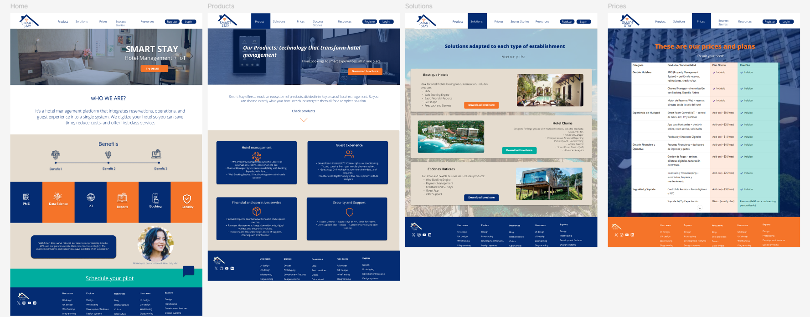

**Encabezados Hero (Landing)**

- Imagen grande en 16:9 con overlay oscuro: refuerza contraste con texto.
- Texto principal: H1 32px, Cocomat Pro Bold en blanco.
- Botón destacado (CTA): Naranja Suave (#E67E22) en mayúsculas.

**Cards y Bloques de Contenido**

- Fondo azul marino (#2C3E91), texto blanco.
- Iconografía minimalista y consistente.
- Bordes redondeados 12px + sombra suave.
- Espaciado interno: 24px padding.
- Uso de grillas para mantener equilibrio visual.
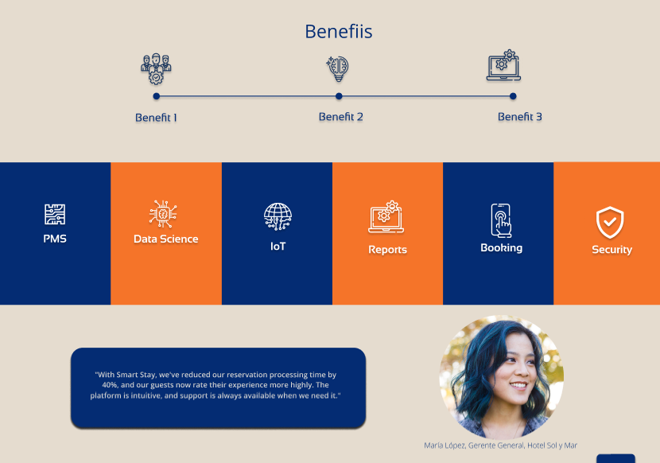

**Tablas Comparativas (Precios)**

- Fondo alternado con colores que definen los planes para mejorar lectura.
- Encabezados fijos con H2 Medium 24px.
- Marca de “incluido” en check.
- Elementos no incluidos  sin check.
- Botón “Mejorar plan” en naranja como llamada a la acción final.
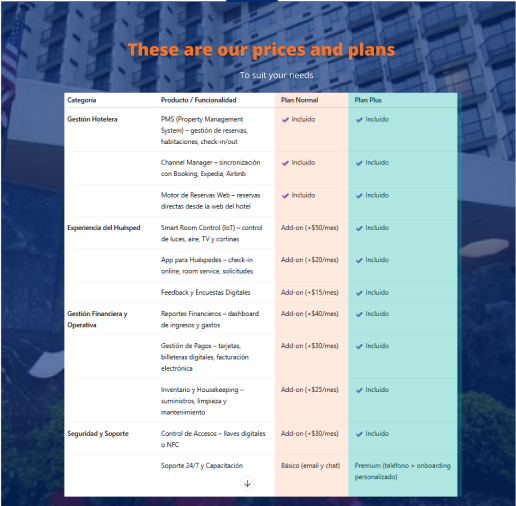

**Footer**

- Fondo azul marino sólido.
- Texto en blanco y gris claro.
- Columnas organizadas con links en Open Sans 14px.
- Inclusión de iconos sociales en fila inferior.

**Uso de Color en Web**

-Azul Marino (#2C3E91) → fondos de bloques, navegación, footer.
-Naranja Suave (#E67E22) → CTAs principales.
-Verde Agua (#1ABC9C) → énfasis positivo (checks, beneficios, “incluido”).
-Beige (#F5F5DC) → fondos neutros para separar secciones.

**Comportamiento UX**

- Hover Cards → elevación (sombra) + cambio leve en tono de fondo.
- Hover Botones → transición 0.3s de azul → naranja.
- Scroll suave en anclas de página.
- Menú sticky superior para navegación rápida.
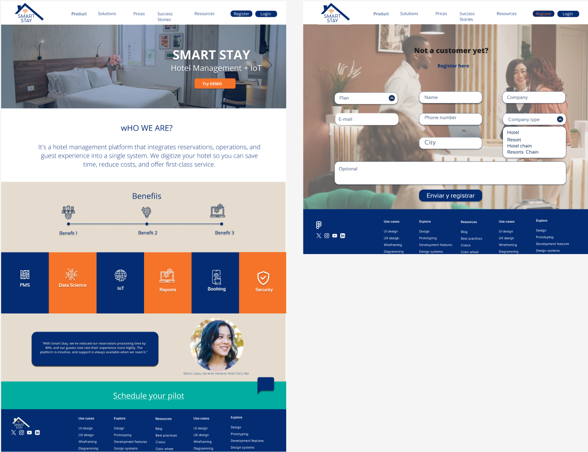
  
## 4.2. Information Architecture

**UX Heuristics & Principles Evaluation**

**Usability – Inclusive Design – Information Architecture**

-CARRERA: Ingeniería de Software  
-CURSO: Desarrollo de Aplicaciones Open Source  
-SECCIÓN: 7454  
-PROFESORES: Todos  
-AUDITOR: Nombre del Grupo el cual está encargado de evaluar 
-CLIENTE(S): Administradores de Hoteles Boutique y Huéspedes de Hoteles  
-SITE o APP A EVALUAR: Smart Stay

**TAREAS A EVALUAR**

**Segmento Objetivo #1: Administradores de Hoteles Boutique y Pequeños en Lima**  
- Gestionar reservas: claridad en el calendario y sincronización con canales externos.  
- Notificaciones automáticas: facilidad para configurar alertas de check-in/check-out y limpieza.  
- Reportes: acceso rápido a reportes de ocupación y facturación.  
- Seguridad: control de accesos internos para el personal.  

**Segmento Objetivo #2: Huéspedes de Hoteles**  
- Realizar check-in/out digital: facilidad, rapidez y disponibilidad desde la app.  
- Control desde el celular: acceso a funciones de la habitación (llaves digitales, temperatura, Wi-Fi).  
- Personalización de la estadía: opciones visibles de preferencias (horarios, limpieza, amenities).  
- Comunicación con el hotel: claridad y rapidez en canales de contacto digital.  

**No incluidas en esta versión de la evaluación:**  
- Procesos de facturación avanzada.  
- Integración con marketplaces globales.  
- Funcionalidades de marketing interno del hotel.  

**ESCALA DE SEVERIDAD** 

| Nivel | Descripción |
|-------|-------------|
| **1** | Problema superficial: puede ser superado fácilmente. No requiere arreglo inmediato. |
| **2** | Problema menor: afecta ocasionalmente la experiencia. Resolución de baja prioridad. |
| **3** | Problema mayor: ocurre frecuentemente y afecta la experiencia de forma significativa. Requiere corrección prioritaria. |
| **4** | Problema muy grave: impide continuar con la tarea. Requiere corrección inmediata antes del lanzamiento. |

**TABLA RESUMEN**  

| # | Problema | Escala de severidad | Heurística/Principio violado |
|---|----------|---------------------|-------------------------------|
| 1 | Reservas no muestran disponibilidad en tiempo real (riesgo de sobreventa). | 3 | Usabilidad: Visibilidad del estado del sistema. |
| 2 | Notificaciones poco configurables y sin opciones personalizadas. | 2 | Flexibilidad y eficiencia de uso. |
| 3 | Reportes de ocupación y facturación poco visibles en el dashboard. | 2 | Visibilidad y reconocimiento antes que recuerdo. |
| 4 | Botón de check-in digital en la app es poco visible en la pantalla de inicio. | 3 | Usabilidad: Visibilidad del estado del sistema. |
| 5 | El control desde la app (llaves digitales, limpieza) no está claramente explicado. | 2 | Coincidencia entre el sistema y el mundo real. |

**DESCRIPCIÓN DE PROBLEMAS**

**SEGMENTO: Administradores de Hoteles**
- **Severidad: 3 – Visibilidad del estado del sistema**  
  - Problema: El calendario de reservas no refleja actualizaciones en tiempo real con plataformas externas.  
  - Recomendación: Implementar sincronización inmediata con canales externos (Booking, Airbnb, etc.) y estados visuales claros de disponibilidad.  

- **Severidad: 2 – Flexibilidad y eficiencia de uso**  
  - Problema: Las notificaciones automáticas no permiten personalizar mensajes ni frecuencia.  
  - Recomendación: Añadir un panel de configuración flexible con plantillas y horarios definidos por el administrador.  

- **Severidad: 2 – Reconocimiento antes que recuerdo**  
  - Problema: Los reportes se encuentran en un submenú poco visible.  
  - Recomendación: Colocar accesos rápidos en el dashboard inicial y usar iconografía clara.  

**SEGMENTO: Huéspedes de Hoteles**  

- **Severidad: 2 – Coincidencia entre el sistema y el mundo real**  
  - Problema: El control de la habitación desde la app (llaves digitales, limpieza, Wi-Fi) no cuenta con guías visuales.  
  - Recomendación: Incluir íconos representativos y tutoriales cortos dentro de la app.  

- **Severidad: 3 – Ayuda y documentación**  
  - Problema: No existe chat directo con la recepción del hotel; solo un formulario genérico.  
  - Recomendación: Incorporar mensajería en tiempo real con la recepción.  

- **Severidad: 2 – Accesibilidad universal**  
  - Problema: Algunos botones presentan bajo contraste en modo claro (ejemplo: naranja sobre beige).  
  - Recomendación: Ajustar colores con ratio de contraste mínimo 4.5:1 siguiendo WCAG 2.1.  

### 4.2.1. Organization Systems
### 4.2.2. Labeling Systems
### 4.2.3. SEO Tags and Meta Tags
### 4.2.4. Searching Systems
### 4.2.5. Navigation Systems
## 4.3. Landing Page UI Design

### 4.3.1. Landing Page Wireframe

Los wireframes representan la primera aproximación al diseño de la interfaz de Smart Stay.  
Se han desarrollado en formato blanco y negro, sin imágenes ni estilos gráficos, para enfocarse únicamente en la estructura, disposición de los elementos y flujo de navegación.  

El objetivo de estos wireframes es:
- Establecer la arquitectura de información de la plataforma.  
- Definir la jerarquía de contenidos en cada sección.  
- Validar la navegación y experiencia de usuario antes de pasar al diseño visual (mockups).  

A continuación, se presenta un resumen de cada una de las secciones.

**1. Home**
- **Propósito:** Página principal de presentación de Smart Stay.  
- **Elementos clave:**  
  - Encabezado con menú de navegación.  
  - Hero con nombre de la plataforma y botón de llamada a la acción (*CTA: Probar demo*).  
  - Sección "¿Quiénes somos?" con breve descripción.  
  - Bloques de beneficios y características principales.  
  - Footer con enlaces de contacto, políticas y redes sociales.
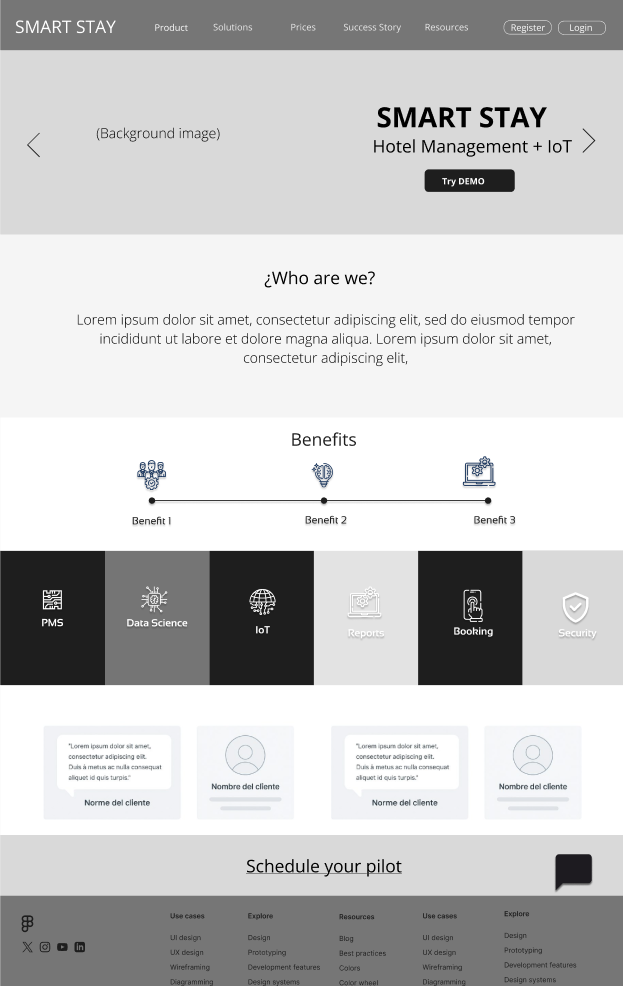

**2. Productos**
- **Propósito:** Mostrar los productos y módulos de la plataforma.  
- **Elementos clave:**  
  - Lista de funcionalidades divididas en áreas: gestión hotelera, experiencia del huésped, reportes, seguridad.  
  - Descripción breve de cada módulo.  
  - Botón de descarga de brochure.
  

**3. Soluciones**
- **Propósito:** Explicar cómo Smart Stay se adapta a diferentes tipos de hoteles.  
- **Elementos clave:**  
  - Sección para hoteles boutique.  
  - Sección para alojamientos alternativos.  
  - Sección para cadenas hoteleras.  
  - Botón para descargar información detallada.
  

**4. Precios**
- **Propósito:** Detallar planes y costos de la plataforma.  
- **Elementos clave:**  
  - Tabla comparativa de funcionalidades entre Plan Normal y Plan Plus.  
  - Categorías claras: gestión hotelera, experiencia huésped, seguridad, soporte.
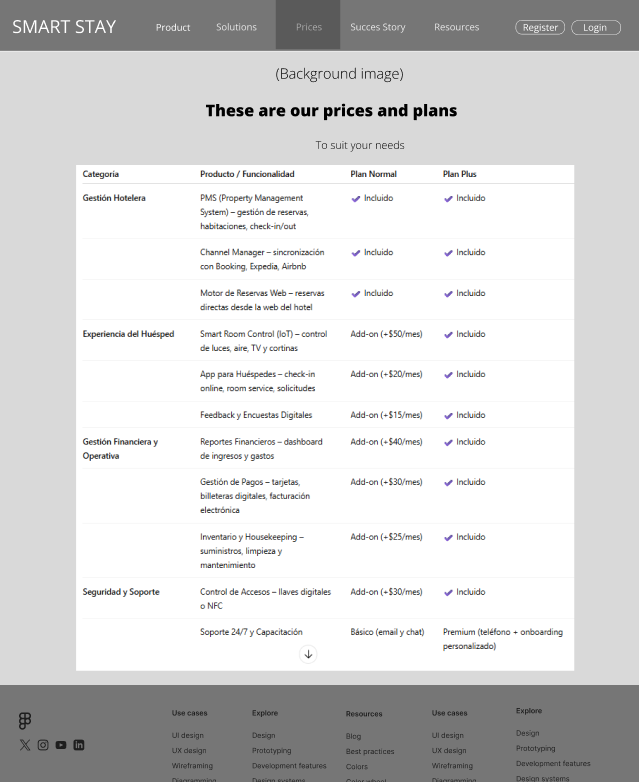

**5. Casos de Éxito**
- **Propósito:** Mostrar testimonios y ejemplos de hoteles que ya usan Smart Stay.  
- **Elementos clave:**  
  - Bloques con testimonios de clientes.  
  - Descripción breve de resultados obtenidos (ahorro de tiempo, mejora de experiencia, reducción de costos).
  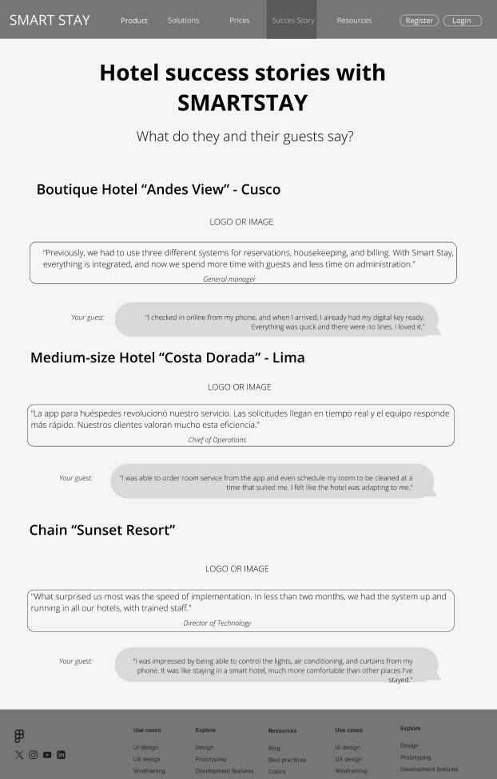  

**6. Recursos**
- **Propósito:** Repositorio de materiales de apoyo y aprendizaje.  
- **Elementos clave:**  
  - Documentos descargables (guías, whitepapers, brochures).  
  - Links de blogs.  
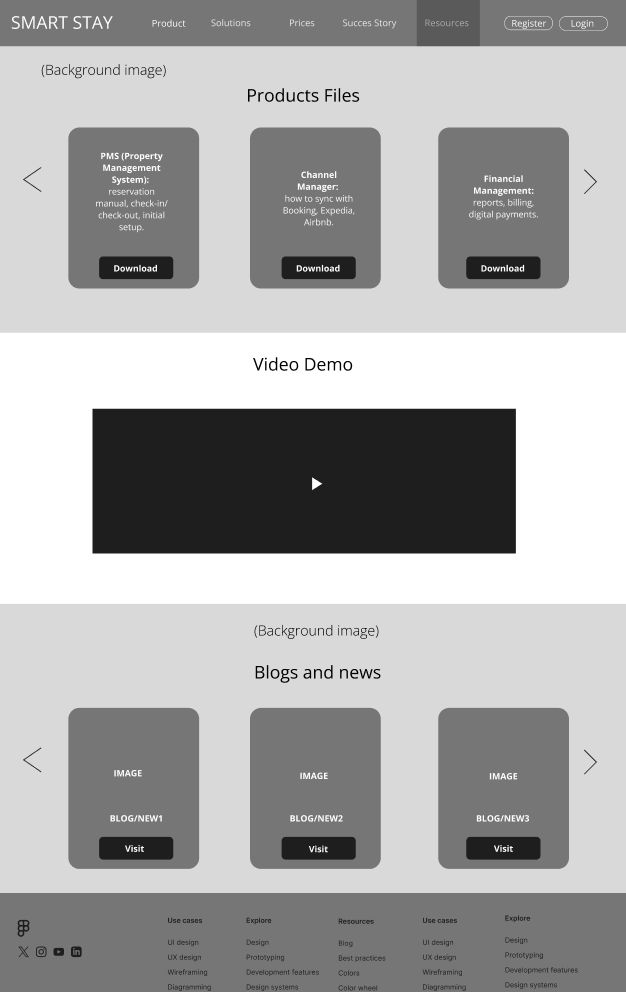

**7. Registro**
- **Propósito:** Permitir que un nuevo usuario cree su cuenta.  
- **Elementos clave:**  
  - Formulario de registro con campos básicos (nombre, correo, contraseña, tipo de empresa).  
  - Botón de registro.  

**8. Login**
- **Propósito:** Acceso de usuarios ya registrados.  
- **Elementos clave:**  
  - Formulario de inicio de sesión con correo y contraseña.  
  - Botón de acceso.  
  - Enlace a recuperación de contraseña y a registro.  
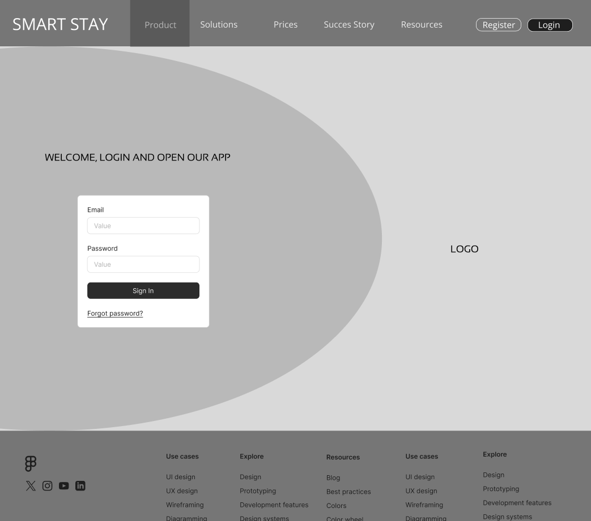

Los wireframes definen la base de navegación de Smart Stay, asegurando que cada sección tenga un propósito claro:  
- **Home:** captar atención y presentar la plataforma.  
- **Productos, Soluciones, Precios:** comunicar valor y opciones.  
- **Casos de Éxito, Recursos:** generar confianza y soporte.  
- **Registro y Login:** habilitar el acceso a la app.  

### 4.3.2. Landing Page Mock-up

Tras la validación de los wireframes, se desarrollaron los mockups de alta fidelidad de Smart Stay.  
Estos mockups ya incorporan la identidad visual definida (colores, tipografía, logotipo e imágenes), con el objetivo de reflejar la experiencia final que tendrán los usuarios en la plataforma.  

Su propósito es:
- Validar la usabilidad con un diseño más realista.  
- Asegurar la coherencia con la guía de estilos definida.  
- Proyectar cómo se verá cada sección en un entorno final.  

**1. Landing Page**
- **Cambios respecto al wireframe:**  
  - Se añadió el logotipo de Smart Stay en el header.  
  - Paleta de colores aplicada (azul corporativo + tonos complementarios).  
  - Imagen de fondo en el Hero con llamada a la acción resaltada (“Probar demo”).  
  - Iconografía personalizada para los beneficios.  
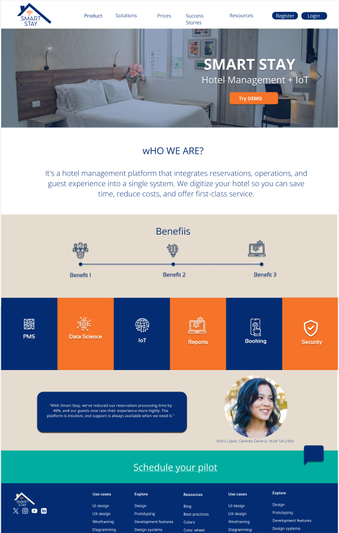

**2. Productos**
-**Cambios respecto al wireframe:**  
  - Uso de íconos y colores diferenciados por módulo (gestión, experiencia huésped, seguridad, reportes).  
  - Inclusión de imágenes ilustrativas.  
  - Botón de descarga estilizado con colores de la marca.  
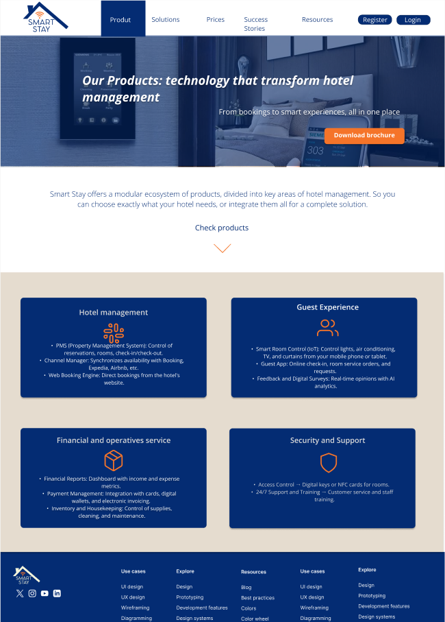

**3. Soluciones**
- **Cambios respecto al wireframe:**  
  - Bloques visuales para cada tipo de cliente (hoteles boutique, alojamientos alternativos, cadenas).  
  - Uso de fotografías representativas de hoteles.  
  - CTA destacado.

**4. Precios**
- **Cambios respecto al wireframe:**  
  - Tabla de precios con colores diferenciadores por plan.  
  - Plan recomendado resaltado con un fondo destacado.  
  

**5. Casos de Éxito**
- **Cambios respecto al wireframe:**  
  - Testimonios acompañados de logos reales de hoteles.  
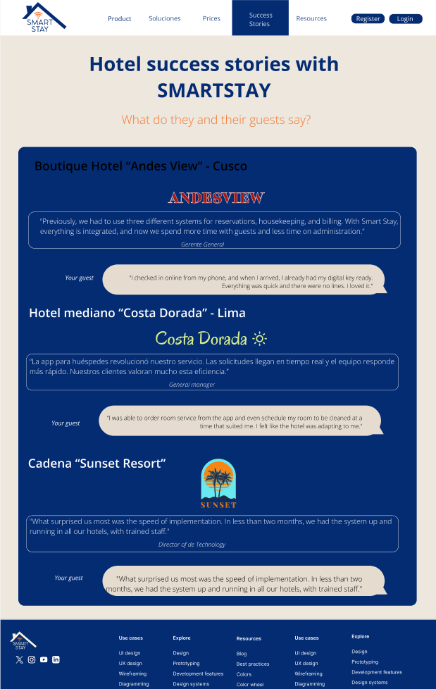

**6. Recursos**
- **Cambios respecto al wireframe:**  
  - Secciones de miniaturas de documentos descargables.  
  - Secciones de blog con botón de visitar página externa.
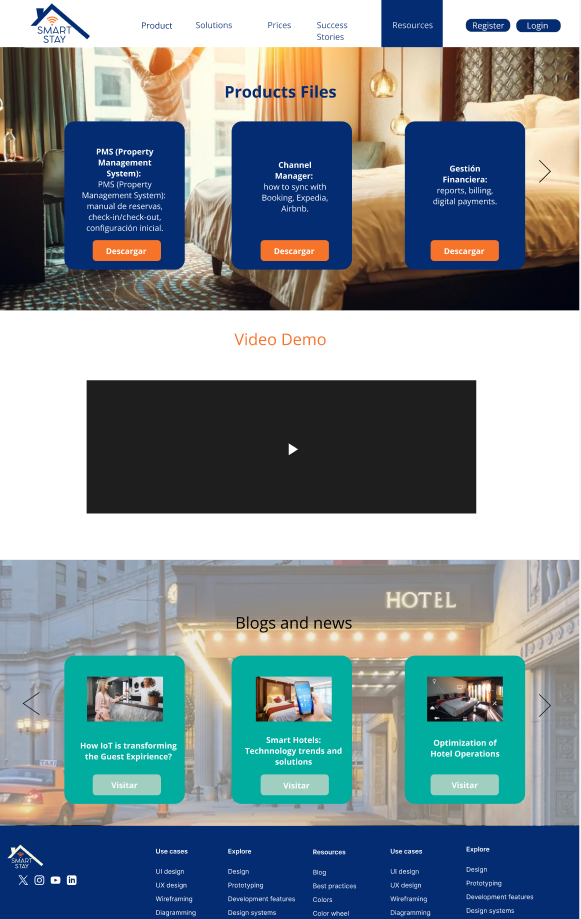

**7. Registro**
- **Cambios respecto al wireframe:**  
  - Formulario minimalista con campos estilizados.  
  - Botón de “Enviar y registrar” resaltado en color primario.  
  - Fondo con imagen ligera para dar contexto al servicio.
  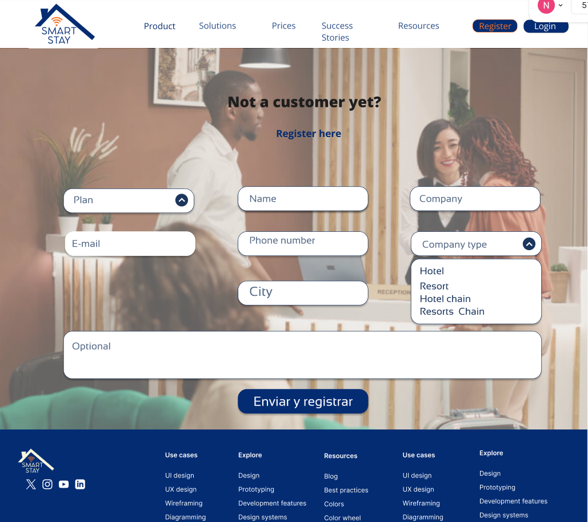

**8. Login**
- **Cambios respecto al wireframe:**  
  - Formulario ubicado a lateral izquierdo en pantalla con diseño limpio.  
  - Logo al lado derecho de la pantalla.  
  - Enlaces secundarios estilizados para “¿Olvidaste tu contraseña?”.  
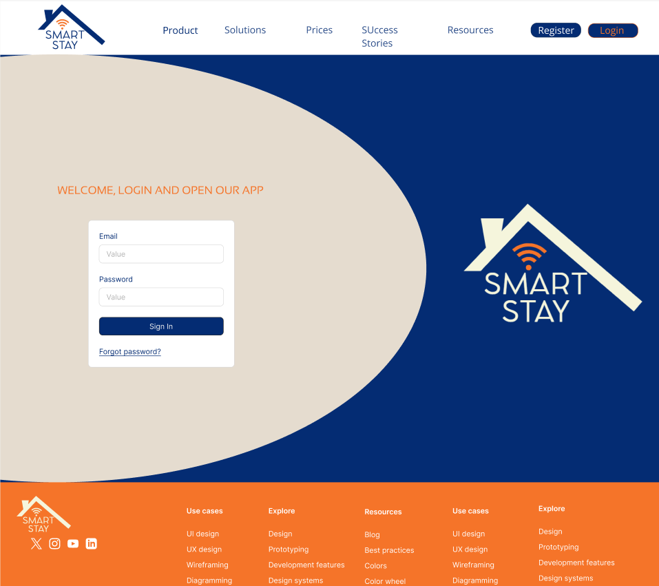

Los mockups consolidan el diseño visual final de Smart Stay, transformando la estructura básica de los wireframes en interfaces listas para evaluación estética y funcional.  

## 4.4. Web Applications UX/UI Design
En esta sección de Web Applications UX/UI Design ya nos enfocamos en el diseño de la interfaz y la experiencia de usuario de nuestro explicativo el cual se menciona e informa en el landing page, cabe resaltar que el el aplicativo es difernte según el rol que forman parte de la solución digital: administrador, staff y huéspedpor lo que su funcionamiento es distinto. Aquí se visualizará el prototipo de cada app y a su vez se presentará en la forma más práctica según su rol, formato desktop para administrados y formato móvil para staff y huésped, aunque los tres cuentan con diseño responsive por lo que se puede usar de cualquier dispositivo móvil.

### 4.4.1. Web Applications Wireframes

**Wireframes – Modo Administrador**

Los wireframes del **modo Administrador** representan la primera aproximación al diseño de la interfaz de esta vista de la aplicación.  
Se han elaborado en formato blanco y negro, sin imágenes ni estilos gráficos, con el objetivo de centrarse en la estructura, navegación y jerarquía de la información que manejará el administrador.  

A continuación, se presenta un resumen de cada una de las secciones principales del modo Administrador.  

**1. Dashboard**
**Propósito:** Vista general del estado de la plataforma.  
**Elementos clave:**  
- Panel con métricas principales (usuarios activos, reportes recientes, accesos).  
- Gráficas de estadísticas generales.  
- Acceso rápido a notificaciones.  

**2. Huéspedes**
**Propósito:** Control y administración de los perfiles que usan la plataforma.  
**Elementos clave:**  
- Lista de usuarios con buscador y filtros.  
- Botón para agregar, editar o eliminar usuarios.  
- Tabla con información básica (nombre, correo, rol, estado).  

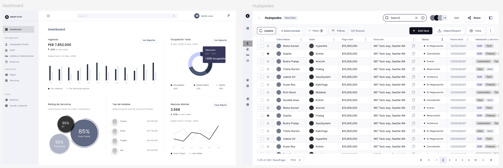

**3. Staff**  
**Propósito:** Definir los niveles de acceso de cada tipo de usuario.  
**Elementos clave:**  
- Tabla de roles existentes.  
- Información y datos del staff con el que trabaja.  

**4. Hoteles y habitaciones**  
**Propósito:** Gestión de la cadena hotelera administrada en la plataforma.  
**Elementos clave:**  
- Lista de hoteles con buscador y filtros (ciudad, estado, categoría).  
- Detalle del hotel seleccionado (información general, servicios, estadísticas).  
- Campo para ingresar número de habitación y botón *Ver detalle*.  
- Vista de detalle de habitación con estado, tipo, huésped actual, check-in/out y acciones rápidas.   

**5. Reservas** 
**Propósito:** Control y gestión de todas las reservas realizadas en los hoteles.  
**Elementos clave:**  
- Calendario interactivo para visualizar y administrar reservas por día, semana o mes.  
- Lista de reservas con buscador y filtros (hotel, fecha, estado).  
- Detalle de la reserva (huésped, habitación, fechas, monto).  
- Botones para modificar, confirmar o cancelar reservas.  
- Indicadores de ocupación y disponibilidad directamente desde el calendario. 

**6. Pagos**  
**Propósito:** Administración de ingresos y egresos financieros en la plataforma.  
**Elementos clave:**  
- Registro de pagos recibidos de huéspedes y clientes.  
- Registro de egresos: pagos a staff, proveedores y compras de stock.  
- Tablas y filtros por fecha, hotel, método de pago y categoría.  
- Reportes de gastos, ingresos y ganancias.  
- Gráficos comparativos y dashboard financiero.
  

**7. Servicios y Productos**  
**Propósito:** Gestión integral de servicios y dispositivos tecnológicos de Smart Stay.  
**Elementos clave:**  
- Tabla general con categorías: limpieza, alimentos, tecnología, amenities.  
- Columnas: nombre, categoría, estado, stock, ubicación, proveedor.  
- Filtros por hotel, piso, habitación y categoría.  
- Vista de detalle de cada producto con historial, estado y mantenimiento.  

**8. Reseñas**  
**Propósito:** Seguimiento de la experiencia de los huéspedes y tickets de soporte.  
**Elementos clave:**  
- Lista de comentarios y calificaciones por hotel y servicio.  
- Filtros por fecha, hotel, tipo de reseña o ticket.  
- Vista de detalle con respuesta del staff.  
- Estadísticas de satisfacción y gráficos de tendencias.  
- Panel de tickets: abiertos, en proceso, cerrados.  

**9. Soporte**  
**Propósito:** Gestión de los tickets creados por los hoteles y usuarios hacia Smart Stay.  
**Elementos clave:**  
- Lista de tickets recibidos desde los hoteles o usuarios.  
- Clasificación por prioridad (alta, media, baja) y estado (pendiente, en proceso, resuelto).  
- Filtros por hotel, tipo de problema y fecha.  
- Vista de detalle del ticket con historial de comunicación.  
- Historial de ticket.

**Wireframes – Modo Huésped**

Los wireframes del modo Huésped representan la primera aproximación al diseño de la interfaz de esta vista de la aplicación huesped, el cual ellos ingresanpor un codigo qr que el hotel les brinda para de frente acceder al app huesped.  
Se han elaborado en formato blanco y negro, sin imágenes ni estilos gráficos, con el objetivo de centrarse en la estructura, navegación y jerarquía de la información que manejará el huésped.  

**1. Pantalla de Bienvenida**
- Solo es una introducción por lo que aparece el logo y un saludo.
  
**2. Inicio**
**Propósito:** Pantalla principal con acceso a las funciones más utilizadas.  
**Elementos clave:**  
- Barra superior con logo y buscador.  
- Banner de bienvenida.  
- Acceso rápido a habitaciones, servicios y notificaciones.  
- Sección de ofertas o promociones destacadas.
  
**3. Habitaciones**
**Propósito:** Explorar y seleccionar opciones de hospedaje.  
**Elementos clave:**  
- Información básica (número y estado de habitación).  
- Controles de ambiente: temperatura, luces, cortinas, TV, música.  
- Servicios rápidos: limpieza inmediata o programada, amenities, minibar digital.  
- Botón de asistencia y emergencia.  

**4. Servicios**
**Propósito:** Acceder a servicios adicionales ofrecidos por el hotel.  
**Elementos clave:**  
- Categorías de servicios (gimnasio, parking, restaurante, eventos).
  
**5. Mapa & Explorar**
**Propósito:** Orientar al huésped dentro del hotel y ofrecer rutas y descubrimientos locales.  
**Elementos clave:**  
- Mapa interactivo del hotel con puntos de interés (piscina, gimnasio, restaurantes, lobby, salones).  
- Indicación de la ubicación de la habitación del huésped y rutas internas (wayfinding) hacia cualquier punto.  
- Opciones de búsqueda y filtros (por tipo de servicio, accesibilidad, horarios).  
  
**6. Perfil**
**Propósito:** Gestionar los datos del huésped.  
**Elementos clave:**  
- Información personal (nombre, correo, teléfono).  
- Preferencias de pago y métodos guardados.  

**7. Notificaciones**
**Propósito:** Informar al huésped sobre novedades y recordatorios.  
**Elementos clave:**  
- Lista de notificaciones recientes (confirmaciones de reserva, promociones, mensajes del hotel).  
- Botón para marcar como leídas o eliminar notificaciones.  

**Wireframes – Modo Staff**

Los wireframes del modo Staff representan la primera aproximación al diseño de la interfaz de esta vista de la aplicación.  
Se han elaborado en formato blanco y negro, sin imágenes ni estilos gráficos, con el objetivo de centrarse en la estructura, navegación y jerarquía de la información que manejará el personal del hotel.

**1. Introducción**
**Propósito:** Pantalla inicial de bienvenida y presentación de la app Staff.  
**Elementos clave:**  
- Logo.  
- Breve mensaje de bienvenida.

**2. Login**
**Propósito:** Autenticar al personal del hotel para acceder a la app.  
**Elementos clave:**  
- Campos de correo electrónico y contraseña.  
- Botón de Iniciar Sesión.  
- Opción de Recuperar contraseña.  

**3. Home / Dashboard**
**Propósito:** Pantalla principal con resumen de tareas y registro de horas.  
**Elementos clave:**  
- Registro de horas: botones para marcar Entrada, Receso y Salida.  
- Tabla de historial diario de horas trabajadas.  
- Lista resumida de tareas del día con estado (pendiente/completado).  

**4. Tareas**
**Propósito:** Gestionar todas las tareas asignadas al staff.  
**Elementos clave:**  
- Lista completa de tareas diarias con habitación, tipo de tarea, piso.  
- Estado de tarea con emoticonos: ✅ Completado / ❌ Pendiente.     

**5. Servicios / Productos**
**Propósito:** Registrar entrega de servicios y productos a habitaciones.  
**Elementos clave:**  
- Lista de servicios/productos por entregar (Room Service, Mini Bar, Amenities, etc.).  
- Cantidad y habitación correspondiente.  
- Estado de entrega con emoticonos: ✅ Entregado / ❌ Pendiente.  

**6. Reservas**
**Propósito:** Consultar y gestionar reservas asignadas al staff.  
**Elementos clave:**  
- Sección de búsqueda de cliente.  
- Lista de reservas con habitación, huésped, fecha, estado de check-in/check-out.  
- Semáforo de estados: 🔴 Pendiente / 🟢 Completado.  

**7. Perfil**
**Propósito:** Gestionar la información personal del staff y las preferencias de la app.  
**Elementos clave:**  
- Foto y datos personales (nombre, correo, teléfono).  
- Cambiar contraseña, editar y cerrar sesión.  

**8. Notificaciones**
**Propósito:** Informar al staff sobre novedades, cambios de tareas o alertas importantes.  
**Elementos clave:**  
- Lista de notificaciones recientes (cambios de turno, emergencias, avisos de tareas).  
- Botón para marcar como leído o eliminar notificaciones.  
.

### 4.4.2. Web Applications Wireflow Diagrams

**Web Applications Wireflow Diagrams – Modo Administrador**

**Propósito:**  
Mostrar cómo cada sección del administrador se conecta a través del menú principal.
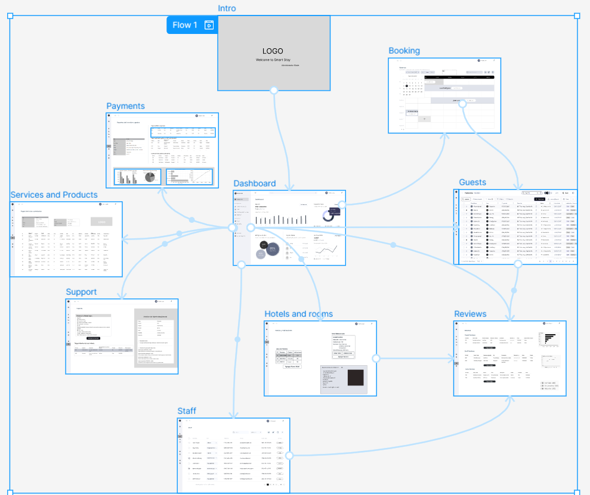

**Menú Principal (Administrador)**

Desde cualquier sección, el menú permite acceder a:

1. **Dashboard** – Resumen general de actividad, métricas y gráficos.
2. **Huéspedes** – Gestión de perfiles de usuarios; agregar, editar o eliminar.
3. **Staff** – Gestión del personal; roles, turnos y contacto.
4. **Hoteles / Habitaciones** – Administración de hoteles, habitaciones y disponibilidad.
5. **Reservas** – Calendario de reservas; agregar, modificar o cancelar reservas.
6. **Pagos** – Visualización y gestión de transacciones y estados de pago.
7. **Servicios / Productos** – Gestión de servicios del hotel y productos adicionales.
8. **Reseñas** – Panel de comentarios de huéspedes con gráficos de satisfacción.
9. **Soporte / Tickets** – Crear tickets de ayuda y consultar su estado.

**Flujo General (Wireflow)**

- **Dashboard**: centro de información y acceso rápido a todas las secciones.  
- **Menú Principal**: conecta directamente a las 9 secciones.  
- Secciones interrelacionadas:  
  - **Reservas ↔ Pagos ↔ Servicios / Productos**  
  - **Huéspedes ↔ Reservas ↔ Reseñas**  
  - **Staff ↔ Hoteles / Habitaciones**  
- **Soporte / Tickets**: siempre accesible desde cualquier sección para resolver inconveniencias.

**Web Applications Wireflow Diagrams – Modo Huésped**

**Propósito:**  
Mostrar cómo cada sección de la app para huéspedes se conecta a través del menú principal y elementos persistentes (como el icono de notificaciones).

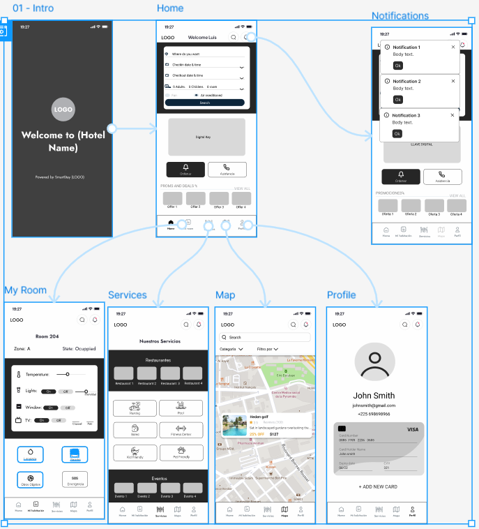

**Secciones Principales**

1. **Introducción** – Pantalla inicial, solo se conecta a **Home**.
2. **Home** – Vista principal; acceso a todas las secciones mediante el menú.
3. **Habitación** – Detalles de la habitación asignada o disponible; acceso desde el menú.
4. **Servicios** – Servicios del hotel disponibles para el huésped; acceso desde el menú.
5. **Mapa** – Ubicación del hotel, puntos de interés; acceso desde el menú.
6. **Perfil** – Datos del huésped, preferencias y configuración; acceso desde el menú.
7. **Notificaciones** – Alertas y mensajes importantes; acceso mediante un icono persistente arriba, visible desde todas las secciones.

**Flujo General (Wireflow)**

- **Introducción** → **Home**  
- **Home** → conecta a **Habitación**, **Servicios**, **Mapa**, **Perfil** mediante el menú principal.  
- **Notificaciones** → accesibles desde cualquier sección a través del icono superior.  

**Web Applications Wireflow Diagrams – Modo Staff**

**Propósito:**  
Mostrar cómo cada sección de la app para staff se conecta a través del menú principal y elementos persistentes (como el icono de notificaciones).

**Secciones Principales**

1. **Introducción** – Pantalla inicial, conecta al **Login**.  
2. **Login** – Pantalla de acceso; una vez autenticado, va a **Home**.  
3. **Home** – Vista principal; acceso a todas las secciones mediante el menú.  
4. **Tareas** – Lista y gestión de tareas asignadas; acceso desde el menú.  
5. **Servicios** – Gestión de servicios ofrecidos por el staff; acceso desde el menú.  
6. **Reservas** – Visualización de reservas relacionadas con el staff; acceso desde el menú.  
7. **Perfil** – Datos del staff y configuración personal; acceso desde el menú.  
8. **Notificaciones** – Alertas y mensajes importantes; accesibles mediante un icono persistente que aparece en todas las secciones.

**Flujo General (Wireflow)**

- **Introducción** → **Login** → **Home**  
- Desde **Home** se puede acceder mediante el menú a: **Tareas**, **Servicios**, **Reservas**, **Perfil**  
- **Notificaciones** → accesibles desde cualquier sección a través del icono superior.

### 4.4.3. Web Applications Mock-ups

**Mockups – Modo Administrador**

Los mockups muestran la interfaz final del administrador de SmartStay, incluyendo **colores, tipografía, iconos, imágenes y logos**, reflejando la identidad visual de la plataforma.

**1. Dashboard**
- Paleta de colores corporativa aplicada a gráficos y métricas.  
- Gráficos circulares y de barras con animaciones.  
- Iconos para alertas, reservas y notificaciones.  
- Ilustraciones o imágenes para resaltar métricas clave.

**2. Huéspedes**
- Tarjetas visuales para cada huésped con foto, nombre y estado.  
- Botones coloreados según función (agregar: verde, eliminar: rojo).  
- Filtros y buscador estilizados con iconos.

**3. Staff**
- Tabla con fotos de perfil, roles y horarios.  
- Indicadores de estado con colores o iconos.  
- Botones consistentes con la paleta de SmartStay.

**4. Hoteles**
- Cards con imagen del hotel o miniaturas.  
- Indicadores visuales de ocupación y disponibilidad.  
- Botones de acción con efectos hover.

**5. Reservas**
- Calendario visual con colores según estado (confirmada, pendiente, cancelada).  
- Tarjetas de reserva con foto del huésped y detalles.  
- Botones destacados para aprobar, modificar o cancelar.

**6. Pagos**
- Tabla con iconos de métodos de pago (tarjeta, Yape, Plin).  
- Resaltado de pagos pendientes con color.  
- Botones para generar facturas con efectos visuales.

**7. Servicios y Productos**
- Cards o listas con imágenes de productos y servicios.  
- Indicadores de disponibilidad con colores y símbolos.  
- Botones con iconos para editar, eliminar o agregar.

**8. Reseñas**
- Panel con estrellas de puntuación y colores según valoración.  
- Tarjetas de comentarios con avatar del huésped y fecha.  
- Gráficos visuales de satisfacción general.

**9. Soporte**
- Tabla de tickets con colores según estado (pendiente, en proceso, finalizado).  
- Formulario visual con iconos y campos destacados.  
- Botones de acción consistentes con la paleta.

**Elementos generales**
- Logo de SmartStay visible en header o menú lateral.  
- Paleta de colores corporativa aplicada a fondos, botones y textos.  
- Tipografía uniforme que diferencia títulos, subtítulos y contenido.  
- Iconografía consistente para acciones, estados y navegación.  
- Feedback visual en botones e interacciones (hover, clic, activo).

**Mockups – Modo Huésped**

Los mockups muestran la interfaz final del usuario huésped en SmartStay, incluyendo **colores, tipografía, iconos, imágenes y logos**, reflejando la identidad visual y la experiencia de usuario.

**1. Introducción**
- Pantalla de bienvenida con **logo y colores corporativos**.  
- **Imágenes o ilustraciones atractivas** para la experiencia inicial.  
- Botón destacado para comenzar y acceder a Home.

**2. Home**
- Panel con **resumen de reservas y notificaciones recientes**.  
- Cards visuales para acceder a habitaciones, servicios y mapa.  
- **Botones e iconos claros** para navegación rápida.

**3. Habitación**
- Tarjetas con fotos de la habitación y detalles (tipo, servicios incluidos, disponibilidad).  
- Indicadores visuales de estado de limpieza o check-in/check-out.  
- Botones para solicitar servicio o hacer reservas adicionales.

**4. Servicios**
- Lista o cards de servicios disponibles (spa, lavandería, comida, etc.) con imágenes.  
- Indicadores de disponibilidad y precios.  
- Botones para solicitar o reservar servicios fácilmente.

**5. Mapa**
- Mapa interactivo con **ubicación del hotel, habitaciones y servicios cercanos**.  
- Iconos para puntos de interés y rutas dentro del hotel.  
- Colores y estilo consistente con la identidad visual.

**6. Perfil**
- Información personal del huésped con **foto y datos básicos**.  
- Botones para editar información o preferencias.  
- Indicadores de estado de membresía o historial de reservas.

**7. Notificaciones**
- Lista de notificaciones recientes con **iconos y colores según tipo** (alerta, mensaje, promoción).  
- Botones para marcar como leído o eliminar.  
- Diseño consistente con la paleta y tipografía de la app.

**Elementos generales**
- Logo de SmartStay visible en header o menú.  
- Paleta de colores corporativa aplicada a fondos, botones y textos.  
- Tipografía uniforme que diferencia títulos, subtítulos y contenido.  
- Iconografía consistente para acciones, estados y navegación.  
- Feedback visual en botones e interacciones (hover, clic, activo).

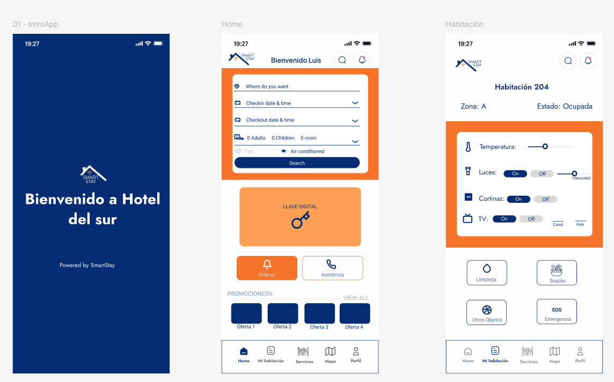

**Mockups – Modo Staff**

Los mockups muestran la interfaz final del personal de SmartStay, incluyendo **colores, tipografía, iconos, imágenes y logos**, reflejando la identidad visual y la experiencia de usuario para el staff.

**1. Introducción**
- Pantalla de bienvenida con **logo y colores corporativos**.  
- **Ilustraciones o imágenes** que reflejan la experiencia inicial.  
- Botón destacado para avanzar al login.

**2. Login**
- Formulario con **campos destacados** para correo y contraseña.  
- Botón principal con **color corporativo** para iniciar sesión.  
- Iconos de seguridad y feedback visual al ingresar datos incorrectos.

**3. Home**
- Panel con **resumen de tareas, reservas y notificaciones recientes**.  
- Cards visuales para acceder a tareas, servicios, reservas y perfil.  
- Botones e iconos claros para navegación rápida.

**4. Tareas**
- Lista o cards de tareas asignadas con **estado visual** (pendiente, en proceso, finalizado).  
- Botones para marcar tareas completadas o reasignar.  
- Indicadores de prioridad con colores y símbolos.

**5. Servicios**
- Lista de servicios a realizar o supervisar, con **imágenes o iconos representativos**.  
- Indicadores de estado y disponibilidad.  
- Botones para actualizar estado o registrar finalización.

**6. Reservas**
- Calendario visual mostrando reservas asignadas al staff.  
- Tarjetas de reserva con detalles resumidos y foto del huésped.  
- Botones para confirmar asistencia o marcar tareas relacionadas a la reserva.

**7. Perfil**
- Información personal del staff con **foto, rol y datos de contacto**.  
- Botones para editar información y configurar preferencias.  
- Indicadores de estado activo/inactivo.

**8. Notificaciones**
- Lista de notificaciones recientes con **iconos y colores según tipo** (alerta, mensaje, aviso).  
- Botones para marcar como leído o eliminar.  
- Diseño consistente con la paleta y tipografía de la app.

**Elementos generales**
- Logo de SmartStay visible en header o menú.  
- Paleta de colores corporativa aplicada a fondos, botones y textos.  
- Tipografía uniforme que diferencia títulos, subtítulos y contenido.  
- Iconografía consistente para acciones, estados y navegación.  
- Feedback visual en botones e interacciones (hover, clic, activo).

### 4.4.4. Web Applications User Flow Diagrams
## 4.5. Web Applications Prototyping

El prototipo permite simular la navegación entre todas las secciones principales mediante **carga dinámica de contenido**, mostrando cómo el administrador se moverá a través de los caminos definidos en los **User Flow Diagrams**, asegurando fluidez y coherencia en la experiencia de usuario.
En este caso presentaremos el prototipo del app principal que es del modo administrador:
[https://shorturl.at/7UPcY](https://www.figma.com/proto/RqI67mkRZ1AwuQNTcuGBvA/Sin-t%C3%ADtulo?node-id=48-3793&p=f&t=4u5X36WGvtb7jWe4-1&scaling=min-zoom&content-scaling=fixed&page-id=0%3A1)

## 4.6. Domain-Driven Software Architecture

### 4.6.1. Design-Level EventStorming
### 4.6.2. Software Architecture Context Diagram
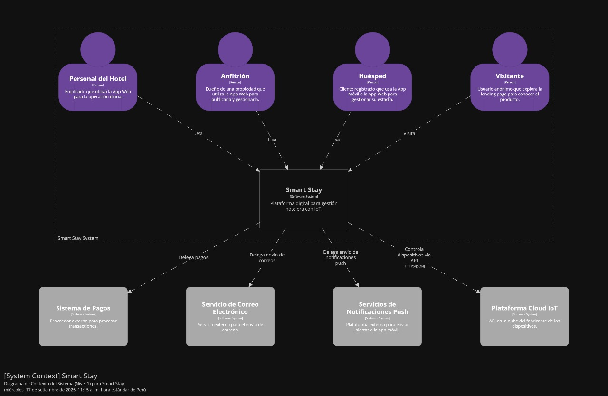
### 4.6.3. Software Architecture Container Diagrams
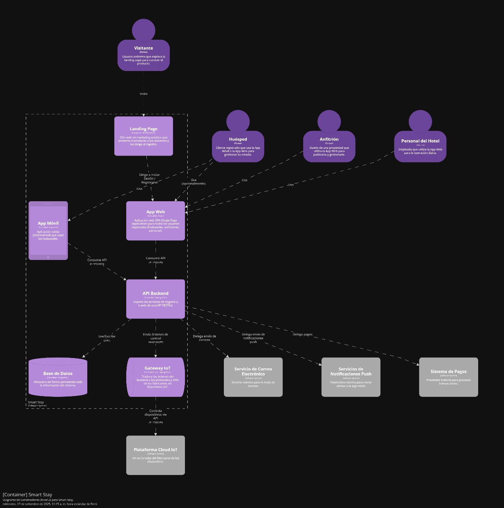
### 4.6.4. Software Architecture Components Diagrams
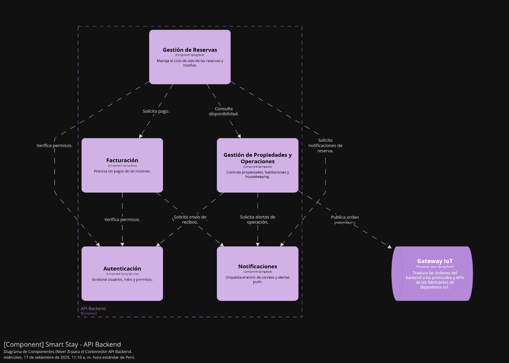
## 4.7. Software Object-Oriented Design
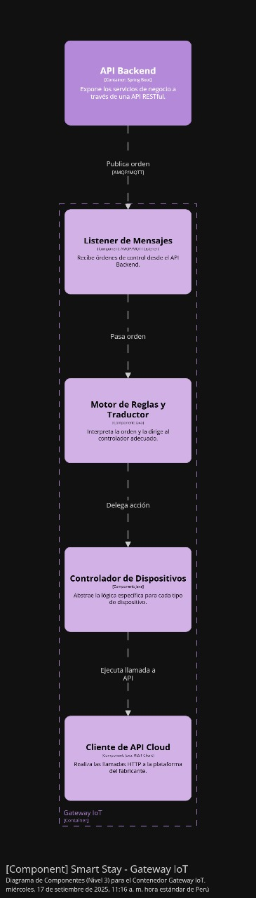

### 4.7.1. Class Diagrams
Diagrama de Clases: Componente de Autenticación

Este diagrama detalla las clases responsables de la gestión de la identidad y el acceso en el sistema. Incluye la jerarquía de User con sus roles especializados (Guest, Host, HotelStaff), el AuthService que contiene la lógica de negocio para el registro y la autenticación, y la interfaz IUserRepository para la persistencia de datos de usuario.

Diagrama de Clases: Componente de Gestión de Propiedades y Operaciones

Este diagrama muestra el diseño de clases para la gestión del inventario y las operaciones del hotel. Incluye las entidades Property y Room, que representan los activos físicos, y el PropertyService que maneja su estado y disponibilidad. Es importante destacar que este componente también actúa como el origen de los comandos de IoT, utilizando la interfaz IIoTCommandPublisher para iniciar acciones en el mundo físico.

Diagrama de Clases: Componente de Gestión de Reservas

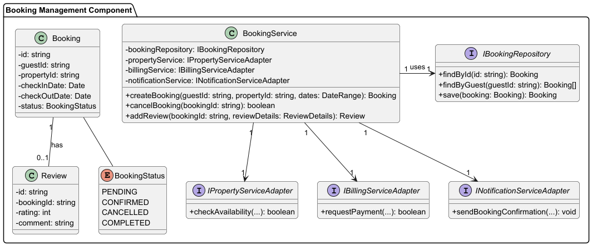

Este diagrama presenta el diseño de clases para el componente central de reservas. Muestra las entidades de dominio Booking y Review, y el BookingService que actúa como orquestador. Este servicio interactúa con otros componentes a través de adaptadores (IPropertyServiceAdapter, IBillingServiceAdapter) para verificar disponibilidad y procesar pagos, gestionando así el flujo completo de una reserva.

Diagrama de Clases: Componente de Facturación

Este diagrama ilustra la estructura interna del componente de facturación. Se definen las entidades Payment e Invoice, el servicio BillingService que orquesta el proceso de pago, y los adaptadores (IPaymentGatewayAdapter, IAuthServiceAdapter) que se comunican con sistemas externos y otros componentes internos para garantizar transacciones seguras y autorizadas.

Diagrama de Clases: Componente Gateway IoT

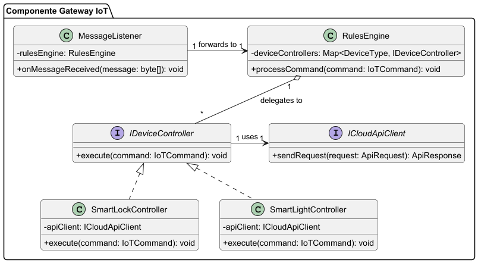

Este diagrama detalla la arquitectura interna del componente técnico Gateway IoT. Su diseño se basa en un flujo de procesamiento de mensajes para desacoplar la lógica de negocio del hardware: un MessageListener recibe órdenes, un RulesEngine las interpreta, IDeviceController las especializa, y un ICloudApiClient se comunica con la plataforma externa del fabricante. Este patrón abstrae la complejidad de la integración con dispositivos físicos.

## 4.8. Database Design

Las decisiones clave tomadas, basadas directamente en nuestros diagramas de clases:

Traducción de Clases a Tablas: Cada clase de entidad (aquellas que guardan datos, como User, Property, Booking) se convierte en una tabla. Las clases de servicio e interfaces (AuthService, IUserRepository, etc.) no se convierten en tablas porque representan comportamiento, no datos.

Componentes sin Persistencia: Los componentes puramente técnicos como el Gateway IoT (MessageListener, RulesEngine, etc.) manejan datos en tránsito (mensajes, comandos) y no requieren persistencia en la base de datos relacional. Por lo tanto, no tienen tablas asociadas.

Nomenclatura: Se utiliza snake_case (ej: check_in_date) para nombres de tablas y columnas, una convención estándar en bases de datos.

Manejo de Herencia: La jerarquía de User se implementa con la estrategia "Tabla por Subclase" para máxima claridad y normalización.

Tipos de Datos ENUM: Los diferentes estados (BookingStatus, RoomStatus, etc.) se definen como tipos ENUM para garantizar la integridad de los datos.

Relaciones: Todas las asociaciones y composiciones en los diagramas de clases se implementan usando claves foráneas (FOREIGN KEY) con sus respectivas restricciones de multiplicidad (ej: UNIQUE para relaciones uno a uno).

### 4.8.1. Database Diagrams

---

# Capítulo V: Product Implementation, Validation & Deployment

# 5.1. Software Configuration Management  

En esta sección el equipo establece las decisiones, herramientas y convenciones que permiten mantener la consistencia durante el ciclo de vida del proyecto. Se incluyen aspectos de configuración del entorno de desarrollo, gestión del código fuente, guías de estilo y configuración de despliegue de la solución.  

---

## 5.1.1. Software Development Environment Configuration  

### Project Management
Para la gestión del proyecto se emplearon diversas herramientas de comunicación, planificación y control de versiones. Se creó una organización en GitHub para centralizar el repositorio del código fuente y coordinar el trabajo colaborativo del equipo. La comunicación interna se realizó mediante Discord y WhatsApp, mientras que la planificación ágil de tareas se gestionó a través de Trello.

- **Organización del trabajo:** GitHub  
- **Reuniones:** Discord  
- **Comunicación:** WhatsApp  
- **Planificación y asignación de tareas:** Trello  

**Enlaces**  
-**GitHub:** [GitHub](https://github.com/)  
-**Discord:** [Discord](https://discord.com/)  
-**Trello:** [Trello](https://trello.com/)

### Requirement Management
Para la fase de levantamiento y priorización de requisitos, se implementaron herramientas que facilitaron la recolección, análisis y documentación de información. Trello fue empleado para la gestión visual de tareas mediante tableros personalizados.  
Además, se utilizó **UXPressia** para el desarrollo de *User Personas*, *Empathy Maps*, *Journey Maps* y *Lean UX Canvas*, mientras que **Miro** sirvió para construir los escenarios *As-Is* y *To-Be* de los procesos del sistema.

**Enlaces**  
-**Trello:** [Trello](https://trello.com/)  
-**UXPressia:** [UXPressia](https://uxpressia.com/)  
-**Miro:** [Miro](https://miro.com/es/)

### Product UX/UI Design
Durante el diseño de la experiencia e interfaz de usuario, el equipo utilizó **Figma** para crear *wireframes*, *mockups* y *prototipos interactivos*, lo cual permitió validar las propuestas de diseño antes de su implementación final.  
Asimismo, se aplicaron principios de usabilidad y diseño centrado en el usuario para garantizar una navegación fluida y consistente.

**Enlaces**  
-**Figma:** [Figma](https://www.figma.com/)

### Software Development
Para el desarrollo de la aplicación se utilizaron distintas herramientas y entornos de programación.  
El *backend* fue implementado con **ASP.NET Core (C#)** empleando el IDE **JetBrains Rider**, mientras que el *frontend* se desarrolló con **Vue.js** en **JetBrains WebStorm**, apoyándose en **Node.js** y **NPM** para la gestión de dependencias.  
Adicionalmente, se emplearon **HTML**, **CSS** y **JavaScript** para la construcción de la *Landing Page*.  
La instalación y mantenimiento de las IDEs se realizó mediante **JetBrains ToolBox**.

**Enlaces**  
-**JetBrains ToolBox:** [JetBrains ToolBox](https://www.jetbrains.com/toolbox-app/)  
-**Rider:** [JetBrains Rider](https://www.jetbrains.com/rider/)  
-**Webstorm:** [JetBrains WebStorm](https://www.jetbrains.com/webstorm/)  
-**Node.js:** [Node.js](https://nodejs.org/)  
-**Vue.js:** [Vue.js](https://vuejs.org/)  
-**PrimeVue:** [PrimeVue](https://primevue.org/)  
-**Visual Studio Code:** [Visual Studio Code](https://code.visualstudio.com/)

### Software Documentation
Para la documentación técnica y la gestión del repositorio, se utilizó **GitHub** siguiendo la metodología de trabajo **GitHub Flow**.  
Esta estrategia permitió un control de versiones eficiente mediante el uso de ramas específicas para cada funcionalidad o corrección.  
Toda la documentación se redactó en formato **Markdown (.md)**, debido a su legibilidad, simplicidad y compatibilidad con GitHub.

**Enlaces**  
-**GitHub:** [GitHub](https://github.com/)

### Software Deployment
El despliegue de la *Landing Page* se realizó mediante **GitHub Pages**, una herramienta ideal para la publicación de sitios web estáticos directamente desde el repositorio del proyecto.

**Enlaces**  
-**GitHub Pages:**  [GitHub Pages](https://pages.github.com/)

-----
## 5.1.2. Source Code Management  

El sistema de control de versiones utilizado para el desarrollo del proyecto es **GitHub**, implementando un flujo de trabajo basado en **GitFlow**, el cual permite mantener un proceso de desarrollo estructurado, ordenado y colaborativo.

### Modelo de ramas Git Flow
El modelo de ramas adoptado se basa en **GitFlow**, estableciendo una organización clara del código fuente para facilitar la integración de nuevas funcionalidades y el control de versiones.

- **main:** rama principal donde se encuentra el código estable y listo para despliegue.  
- **develop:** rama base para la integración y prueba de nuevas funcionalidades antes de su paso a producción.  
- **feature/:** ramas destinadas al desarrollo de nuevas características o capítulos del proyecto.

**Ramas de características existentes:**
- `feature/chapter-01`  
- `feature/chapter-02`  
- `feature/chapter-03`  
- `feature/chapter-04`  
- `feature/chapter-05`
  
Cada funcionalidad o capítulo se desarrolla en una rama independiente y, una vez completada, se fusiona con la rama *develop*.

### Convenciones de nomenclatura
Para mantener coherencia en la gestión del código, se emplean las siguientes convenciones de nombres de ramas:

- `feature/<nombre>`: nuevas funcionalidades o módulos.  
- `release/<versión>`: preparación de entregas o versiones estables.  
- `hotfix/<incidencia>`: correcciones críticas en producción.

### Versionado semántico (Semantic Versioning)
El proyecto aplica **Semantic Versioning 2.0.0**, un estándar que define un esquema de control de versiones mediante el formato **MAJOR.MINOR.PATCH**, asegurando claridad en los cambios de versión.

**Ejemplos:**
- `v1.0.0`: versión estable inicial.  
- `v1.1.0`: incorporación de nuevas funcionalidades.  
- `v2.0.0`: cambios mayores o incompatibles con versiones anteriores.

### Convención de mensajes de commits
Se siguen las reglas de **Conventional Commits**, garantizando mensajes de confirmación legibles, consistentes y estandarizados.  
Esto permite mantener una trazabilidad clara de los cambios realizados en el repositorio.

**Ejemplos de commits:**
- `feat: agregar nuevo sistema de login`  
- `fix: corregir validación en formulario de registro`  
- `docs: actualizar README con instrucciones de despliegue`

### Repositorios del proyecto
El proyecto está organizado dentro de una **organización en GitHub**, donde cada módulo cuenta con su propio repositorio según su propósito y tecnología.

- **Landing Page:** desarrollada con *HTML*, *CSS* y *JavaScript*.  
- **Web Services:** implementado con *ASP.NET Core (C#)*.  
- **Frontend Web Application:** construida con *Vue.js* y *PrimeVue*.

### Flujo de trabajo de GitFlow
El flujo de trabajo del proyecto se basa en el modelo **“A Successful Git Branching Model”**, el cual organiza el proceso de desarrollo mediante ramas específicas para cada funcionalidad o corrección.  
Este enfoque permite un control de versiones ordenado y un desarrollo paralelo seguro.

### Estructura de branches (Ramas)

**Master branch (Rama principal):**  
Es la rama principal del proyecto, donde se almacena el código estable y listo para producción.  
Solo se integran cambios que hayan sido probados y validados previamente en las ramas de desarrollo (*develop*) y funcionalidad (*feature/*).  
Esta rama representa el estado más confiable del proyecto.

**Develop branch (Rama de desarrollo):**  
Actúa como un espacio de integración para el trabajo en equipo.  
Aquí se combinan, prueban y ajustan las nuevas funcionalidades antes de ser fusionadas con la rama principal (*main*).  
Su propósito es garantizar que el código integrado sea funcional y estable antes del despliegue.

**Feature branches (Ramas de funcionalidad):**  
Cada nueva funcionalidad o tarea específica se desarrolla en su propia rama independiente.  
Una vez completada y verificada, se integra nuevamente en la rama de desarrollo (*develop*).  
Las ramas de funcionalidad siguen un esquema de nombres descriptivos, como por ejemplo:  
- `feature/chapter-01`  
- `feature/chapter-02`  
- `feature/chapter-03`  
- `feature/chapter-04`  
- `feature/chapter-05`

---

## 5.1.3. Source Code Style Guide & Conventions  

El equipo adopta **convenciones de nomenclatura y guías de estilo estandarizadas** para mantener la coherencia, legibilidad y escalabilidad del código fuente a lo largo del proyecto.  
Todas las variables, funciones, clases y archivos se nombran en **inglés**, siguiendo las convenciones propias de cada lenguaje y marco de trabajo.

### HTML / CSS
Se siguen las recomendaciones de las guías de estilo oficiales:

- [HTML Style Guide and Coding Conventions](https://www.w3schools.com/html/html5_syntax.asp)  
- [Google HTML/CSS Style Guide](https://google.github.io/styleguide/htmlcssguide.html)

**Convenciones aplicadas:**
- Uso de etiquetas **semánticas** para mejorar la estructura, accesibilidad y SEO del sitio.  
- Clases CSS escritas en **kebab-case**, por ejemplo: `.main-header`, `.card-title`.  
- Identificadores claros, descriptivos y consistentes.  
- Organización modular del código mediante hojas de estilo separadas por componente o sección.

**Etiquetas utilizadas en la estructura de la Landing Page:**
- `<header>`: Contiene el contenido introductorio del sitio y el logotipo principal.  
- `<nav>`: Define las secciones dedicadas a la navegación dentro del sitio.  
- `
`: Permite agrupar elementos y aplicar estilos específicos por secciones.  
- ``: Inserta imágenes optimizadas para mejorar la presentación visual.  
- `<ul>`: Define listas desordenadas, empleadas en el menú de navegación.  
- `<li>`: Representa los elementos de cada lista, utilizados en menús y secciones del blog.  
- `<a>`: Crea hipervínculos que permiten desplazarse por las secciones del sitio.  
- `
`: Define párrafos de texto para el contenido informativo.  
- `<button>`: Declara botones interactivos que permiten ejecutar acciones específicas.  
- `<h1>` – `<h4>`: Representan los distintos niveles de encabezados del sitio, donde `<h1>` es el nivel principal.

### JavaScript (Vue.js)

Se aplican las siguientes guías y herramientas de estilo:

- [Google JavaScript Style Guide](https://google.github.io/styleguide/jsguide.html)  
- [W3C JavaScript Best Practices](https://www.w3.org/wiki/JavaScript_best_practices)  
- [MDN JavaScript Guidelines](https://developer.mozilla.org/en-US/docs/Web/JavaScript)  
- [Vue Style Guide](https://vuejs.org/style-guide/)  

**Prácticas adoptadas:**
- Código escrito en **ES6+**, priorizando claridad y modularidad.  
- Uso de **CamelCase** para variables y funciones.  
- Componentes de Vue nombrados en **PascalCase**.  
- Implementación de **ESLint** y **Prettier** para análisis estático y formateo automático del código.  
- Uso del principio **DRY (Don’t Repeat Yourself)** para evitar duplicaciones.

### C# y ASP.NET Core
Las convenciones del código backend siguen los lineamientos de Microsoft:

- [C# Coding Conventions](https://learn.microsoft.com/en-us/dotnet/csharp/fundamentals/coding-style/coding-conventions)  
- [Microsoft ASP.NET Core Coding Guidelines](https://learn.microsoft.com/en-us/aspnet/core/fundamentals/?view=aspnetcore-7.0)

**Convenciones aplicadas:**
- Uso de **PascalCase** para clases, interfaces y métodos públicos.  
- Uso de **camelCase** para variables locales y parámetros.  
- Organización del código en **namespaces** coherentes con la arquitectura del proyecto.  
- Comentarios XML para documentación interna de métodos y controladores.  
- Pruebas unitarias y escenarios escritos siguiendo la convención **Gherkin (Given-When-Then)**.

### Buenas prácticas comunes
En todo el código del proyecto se aplican principios de ingeniería de software orientados a la calidad y mantenibilidad:

- Nomenclatura en inglés.  
- Principio **DRY (Don’t Repeat Yourself)**: evitar duplicación de código.  
- Principio **KISS (Keep It Simple, Stupid)**: priorizar soluciones simples y claras.  
- Código documentado y con convenciones homogéneas entre frontend y backend.  
- Control de formato automatizado mediante *linters* y *formatters* en cada entorno de desarrollo.
---

## 5.1.4. Software Deployment Configuration

El despliegue de la solución considera los siguientes aspectos generales, los cuales garantizan la disponibilidad y correcta operación de los distintos componentes del sistema:

### Landing Page Deployment
La **Landing Page** fue desarrollada utilizando **HTML**, **CSS** y **JavaScript**, y se encuentra desplegada públicamente a través de **GitHub Pages**.  
Para su publicación, se cumplieron los siguientes pasos:

1. **Preparación del entorno:**  
   Se creó un repositorio dentro de la organización en **GitHub**, destinado a alojar los archivos de la Landing Page.

2. **Estructura de archivos:**  
   Los archivos principales se encuentran en la raíz del repositorio, siguiendo las convenciones de nombres:  
   - `index.html` → página principal.  
   - `styles.css` → hoja de estilos principal.  
   - `script.js` → scripts principales.  
   - `languages.js` → archivo para gestionar los textos en distintos idiomas (español e inglés).  
   - Carpeta `assets/images/` → para las imágenes utilizadas en el sitio.  

3. **Configuración en GitHub Pages:**  
   - Se accedió a **Settings > Pages** dentro del repositorio.  
   - Se seleccionó la rama **main** como fuente de publicación.  
   - Se configuró la carpeta raíz (`/`) como directorio base.  
   - Una vez completado el proceso, GitHub generó automáticamente la URL pública de la Landing Page.

Además, se implementó un archivo `languages.js` que contiene los textos en español e inglés.  
Este archivo es consumido por el script `main.js`, permitiendo el cambio de idioma dinámico en la interfaz.

### Backend (Web Services)
El **backend** fue desarrollado en **ASP.NET Core con C#**, siguiendo el estilo arquitectónico **RESTful**.  
Su despliegue se realizó en la plataforma **Render**, configurada como un servicio *cloud* para ejecutar la API de forma continua.  
Esto permite mantener el servicio activo, escalable y sincronizado con el repositorio de GitHub.

### Frontend Web Application
La **aplicación web frontend** fue construida con **Vue.js** y **PrimeVue**, integrando una interfaz moderna e interactiva.  
El despliegue se llevó a cabo en **Render**, aprovechando su integración con GitHub para habilitar un flujo de despliegue automático.  
Cada actualización en la rama `main` desencadena una nueva versión publicada en producción.

### Integración Continua / Despliegue Continuo (CI/CD)
El proyecto implementa un flujo automatizado de **Integración Continua y Despliegue Continuo (CI/CD)**, con el objetivo de mantener la coherencia entre los entornos de desarrollo y producción.

- Todos los repositorios están conectados directamente a **GitHub**.  
- **Render** ejecuta el despliegue automático al detectarse *merges* en la rama `main`.  
- Este proceso garantiza una actualización constante de los servicios y minimiza la intervención manual en las publicaciones.

### Github Pages: 
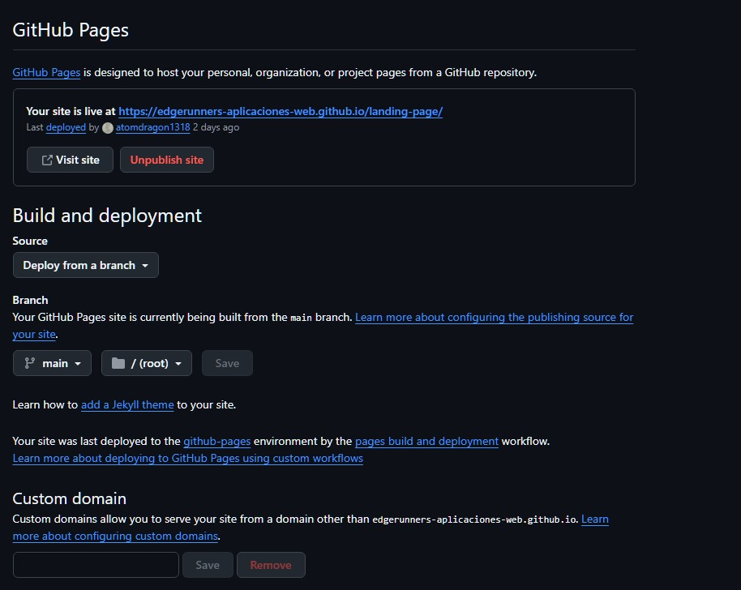

**La URL que nos entrega Github Pages para acceder a la landing page es la siguiente:**  
[https://edgerunners-aplicaciones-web.github.io/landing-page/](https://edgerunners-aplicaciones-web.github.io/landing-page/)

---

## 5.2. Landing Page, Services & Applications Implementation.

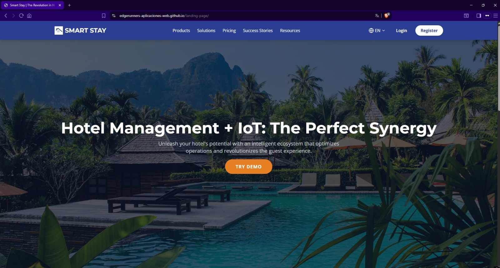

---

## 5.2.1. Sprint 1

A continuación, se presenta el Sprint Planning 1, donde se incluyen las evidencias de planificación e implementación del Landing Page. También se registran los avances del proyecto e insights de colaboración del equipo a través de GitHub.

## 5.2.1.1. Sprint Planning 1  

| **Sprint #** | Sprint 1 |
|------------|-----------------|
| **Sprint Planning Background** | Reunión inicial de planificación del proyecto **SmartStay**, orientada a establecer los objetivos del primer sprint y asignar las tareas relacionadas con el diseño, desarrollo y despliegue de la Landing Page. |
| **Date** | 2025-09-16 |
| **Time** | 05:00 PM (GMT -5) |
| **Location** | Modalidad remota mediante **Discord** |
| **Prepared By** | Equipo **SmartStay** |
| **Attendees (to planning meeting)** | Verona Flores, Italo Sebastián / Valverde Portuguez, Natalia Ximena / Fernandez Garfias, Alexander Piero / Saavedra Angulo, Jose Jhonatan |
| **Sprint n – 1 Review Summary** | Este es el primer sprint del proyecto, por lo tanto, no existe una revisión de sprint anterior. |
| **Sprint n – 1 Retrospective Summary** | Al ser la primera iteración, no se registran retrospectivas previas. No obstante, se acordó la importancia de establecer lineamientos claros de trabajo colaborativo, mantener una comunicación efectiva y un uso disciplinado de las herramientas definidas. |
| **Sprint Goal & User Stories** | — |
| **Sprint 1 Goal** | Publicar una **Landing Page funcional** para SmartStay, con diseño responsive, estructura clara y accesible desde GitHub Pages, sirviendo como punto inicial de la solución. |
| **Sprint 1 Velocity** | 2 |
| **Sum of Story Points** | 2 |

## 5.2.1.2. Deployment Evidence for Sprint Review

| **Team Member (Last Name, First Name)** | **GitHub Username** | **Estructura base del proyecto (HTML/CSS)** | **Diseño visual y maquetación web (Landing Page)** | **Integración de componentes visuales** | **Revisión y control de versiones** |
|------------------------------------------|----------------------|------------------------------------------------------|------------------------------------------------------------------------------|---------------------------------------------------------|---------------------------------------|
| **Verona Flores, Italo Sebastián** | [@atomdragon1318](https://github.com/atomdragon1318) | L | C | C | C |
| **Valverde Portuguez, Natalia Ximena** | [@NatValverde15](https://github.com/NatValverde15) | C | L | C | C |
| **Fernandez Garfias, Alexander Piero** | [@shiloox](https://github.com/shiloox) | C | C | L | C |
| **Saavedra Angulo, Jose Jhonatan** | [@ElrichMasNa](https://github.com/ElrichMasNa) | C | C | C | L |
| **Ramos Aguirre, Aldair Joaquin** | [@AldairRamos13](https://github.com/AldairRamos13) | C | C | C | L |

---

## 5.2.1.3. Sprint Backlog 1

### Introducción
El objetivo principal del Sprint 1 es implementar la **Landing Page (EP08)** que permita a los visitantes explorar las funcionalidades básicas de SmartStay, conocer sus beneficios y acceder fácilmente al registro o login.  
Este Sprint está enfocado en **atraer visitantes y convertirlos en usuarios registrados** a través de una experiencia inicial clara e intuitiva.

**Evidencia en del avance en trello**

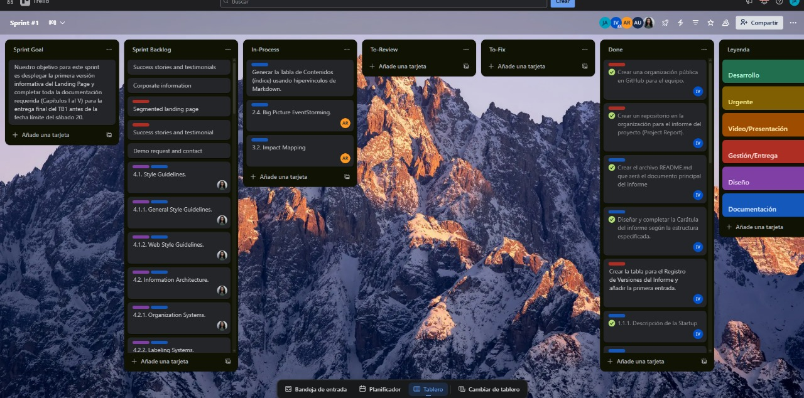

Este Sprint permitió entregar la **Landing Page inicial de Smart Stay**, proporcionando a los visitantes un primer acercamiento a las **funcionalidades**, **beneficios**, **testimonios** y **información general** de la aplicación.

### Sprint #1 – Sprint Backlog

| **Sprint #** | **User Story Id ** | **User Story Title** | **Task Id** | **Task Title** | **Description** | **Estimation (Hours)** | **Assigned To** | **Status** |
|--------------|----------------|--------------------|--------|------------|-----------------|------------------------|-----------------|------------|
| Sprint 1 | US-24 | Segmented landing page | UT-01 | Design visual structure | Create the general structure of the Landing Page with differentiated sections for administrators and guests. | 6 | Alexander | Done |
| Sprint 1 | US-24 | Segmented landing page | UT-02 | Layout Landing Page | Implement the HTML and CSS design of the base prototype. | 5 | Italo | In Process |
| Sprint 1 | US-24 | Segmented landing page | UT-03 | Navigation and internal links | Configure navigation between sections with links and smooth scrolling.| 3 | Jose | Done |
| Sprint 1 | US-26 | Success stories and testimonials | UT-04 | Create testimonials section | Design carousel with user testimonials and simple animations. | 4 | Aldair | To Review |
| Sprint 1 | US-27 | Demo request and contact | UT-05 | Contact form | Implement form with validation and responsive design. | 4 | Natalia | Done |
| Sprint 1 | US-28 | Corporate information | UT-06 | Write mission, vision and values | Write institutional text consistent with the Smart Stay brand.| 3 | Natalia | Done |
| Sprint 1 | US-28 | Corporate information | UT-07 | Implement “About Us” section | Layout the section with text and representative image. | 4 | Alexander | To Do |
| Sprint 1 | US-24 | Segmented landing page | UT-08 | Add CTA buttons (Login, Registration, Demo) | Place visible buttons with links to authentication routes. | 3 | Jose | Done |
| Sprint 1 | US-26 | Success stories and testimonials | UT-09 | Adjust animations and transitions | Apply drop-in and fluid scrolling effects on testimonials.| 4 | Aldair | In Process |

## 5.2.1.4. Development Evidence for Sprint Review

### Introducción
Durante este Sprint se avanzó en la **implementación de la Landing Page**. Se desarrollaron las secciones de información general, beneficios de la plataforma y botones de acceso a login/registro. La mayor parte del trabajo se centró en la **estructura base, navegación y maquetación inicial**.

### Commits realizados

| Repository | Branch | Commit Id | Commit Message | Commit Message Body | Committed on (Date) |
|------------|--------|-----------|----------------|---------------------|---------------------|
| Edgerunners-Aplicaciones-Web/report | feature/landing-page | `14ca4e3` | `feat: add initial landing page structure` | Se implementa la estructura base de la landing con secciones vacías. | 13/09/2025 |
| Edgerunners-Aplicaciones-Web/report | feature/landing-page | `27bd9f1` | `feat: add SmartStay introduction section` | Contenido informativo agregado a la landing. | 13/09/2025 |
| Edgerunners-Aplicaciones-Web/report | feature/landing-page | `38cf0d2` | `feat: add benefits section with icons` | Sección de beneficios agregada con maquetado inicial. | 14/09/2025 |
| Edgerunners-Aplicaciones-Web/report | feature/landing-page | `42af2e9` | `feat: add login/register buttons` | Se agregan botones que redirigen a formularios de login y registro. | 14/09/2025 |
| Edgerunners-Aplicaciones-Web/report | feature/landing-page | `59ff1d8` | `chore: fix navigation and styles` | Ajustes en navegación y estilos de la landing. | 15/09/2025 |
| Edgerunners-Aplicaciones-Web/report | develop | `6af1bc3` | `merge: feature/landing-page into develop` | Se integran cambios de la landing en la rama de desarrollo. | 16/09/2025 |

**Evidencia de los commits del landing page**

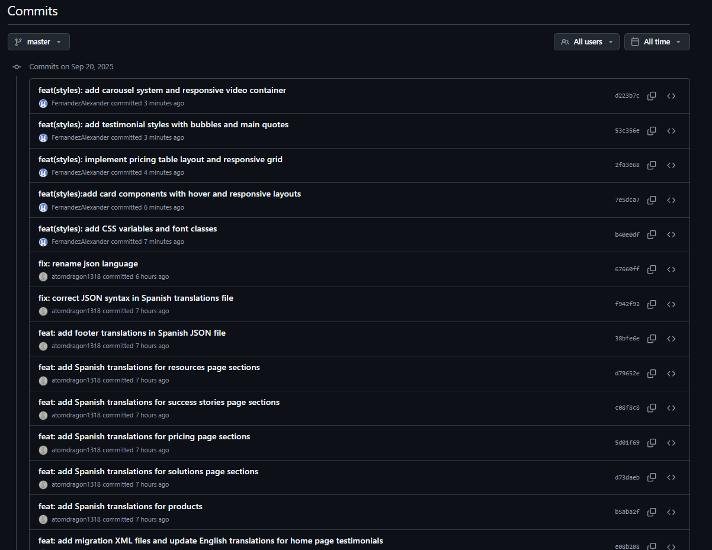

### 5.2.1.5. Execution Evidence for Sprint Review.

En este **Sprint 1**, el entregable principal fue la **Landing Page inicial de SmartStay**, desarrollada e implementada en GitHub Pages.  

La ejecución se centró en:  
- Implementar la **estructura básica** de la landing page.  
- Incluir una **barra de navegación**, sección principal (*Hero*) y enlaces de acceso hacia registro y login.  
- Aplicar una **paleta de colores sencilla** y un diseño **responsive básico** para visualización en dispositivos móviles y escritorio.  
- Publicar el proyecto en GitHub Pages, asegurando que esté disponible de manera pública.  

### Evidencia visual  
A continuación, se adjuntan capturas de pantalla que evidencian la ejecución realizada en este Sprint:  

- Esta es la sección inicial, donde está el header.

  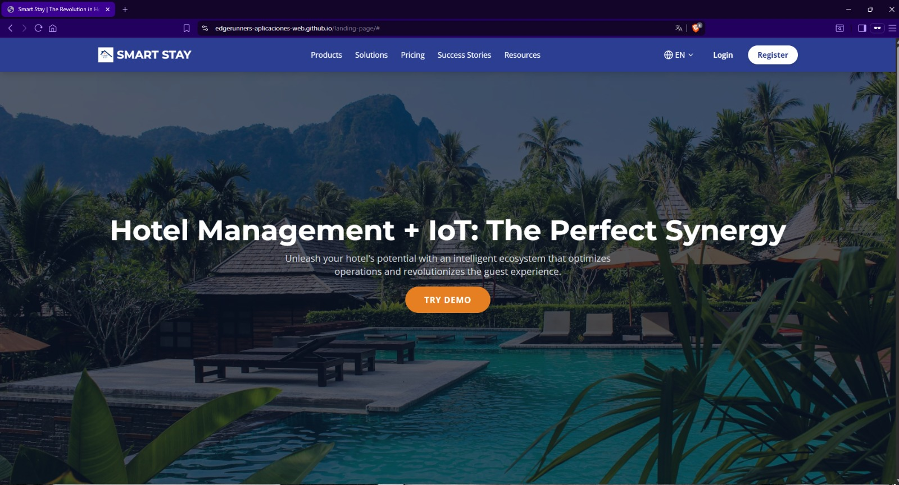

- Aquí se puede observar la sección donde se presenta a los productos que ofrecemos.

  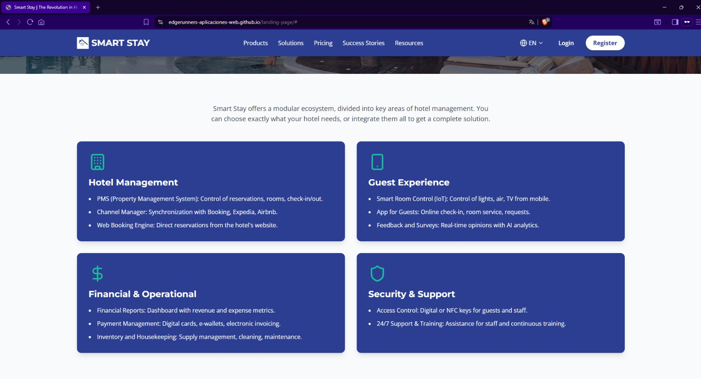

- Esta sección describe las soluciones de acorde al tipo de propiedad.
  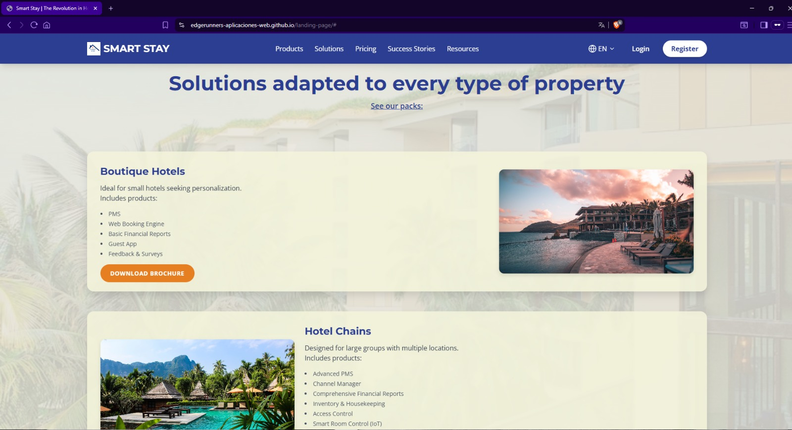

-Tenemos en esta sección acerca de precios por el servicio.

  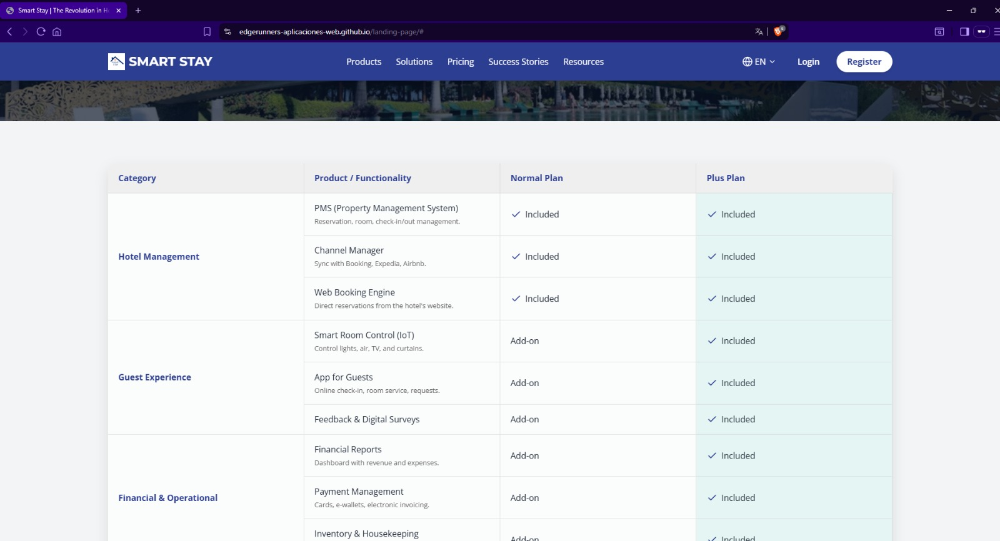

-Aquí se puede observar la sección de reseñas.

  

### 5.2.1.6. Services Documentation Evidence for Sprint Review  

En este **Sprint 1**, los miembros del equipo lograron completar las tareas asociadas al desarrollo de la **Landing Page de SmartStay**.  

El trabajo incluyó la definición de la estructura visual básica, la aplicación de colores corporativos y la integración de secciones clave como la barra de navegación y la sección principal (*Hero*).  

La landing page cumple el rol de **página de presentación inicial** de la plataforma SmartStay, ofreciendo a los usuarios una visión general del proyecto y accesos rápidos al registro o login.  

Una landing page es esencial en proyectos digitales, pues está diseñada estratégicamente para guiar al visitante hacia acciones específicas, optimizando la experiencia del usuario. En este caso, la acción principal es conocer SmartStay y dar el primer paso hacia el registro.  

### 5.2.1.7. Software Deployment Evidence for Sprint Review  

- **Git**: Se utilizó para el control de versiones, registrando cada cambio en el código fuente.
- **Repositorio en GitHub**: Se creó y configuró el repositorio oficial específico para el landing page, facilitando la colaboración del equipo. [Landing Page – GitHub Repository](https://github.com/Edgerunners-Aplicaciones-Web/landing-page).  
- **GitHub Pages**: Se configuró como servicio de hosting gratuito para publicar la página y permitir su acceso en línea de manera pública, configurando la rama `main` como fuente de publicación. 
- **Integración automática**: cada *commit* en la rama principal actualiza de manera automática la página desplegada.  

Este flujo aseguró que el trabajo desarrollado estuviera disponible para todo el equipo y los revisores, permitiendo validar en tiempo real los avances.  

### Evidencia  

- **Creación de Repositorio en GitHub**  
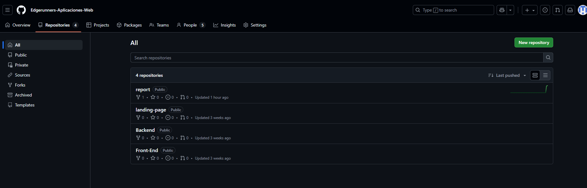  
 
- **Configuración de GitHub Pages**
(FALTA IMÁGENES DE ESTO)

---

### 5.2.1.8. Team Collaboration Insights during Sprint  

Las actividades de desarrollo de este Sprint se llevaron a cabo de manera colaborativa, distribuyendo las tareas entre los miembros del equipo.  

**Acciones de colaboración destacadas:**  
- Se utilizó **GitHub** como herramienta central de coordinación y control de versiones.  
- Uno de los integrantes configuró el repositorio inicial y las ramas de trabajo.  
- Cada miembro realizó **commits documentados** con los cambios implementados.  
- Se llevaron a cabo **pull requests** para integrar las contribuciones al repositorio principal.  
- Se realizaron revisiones de código en equipo para mantener la coherencia visual y funcional de la landing.  

Gracias a este flujo de trabajo, el equipo pudo avanzar de forma paralela y ordenada, evitando conflictos en el código y asegurando un resultado consistente.  

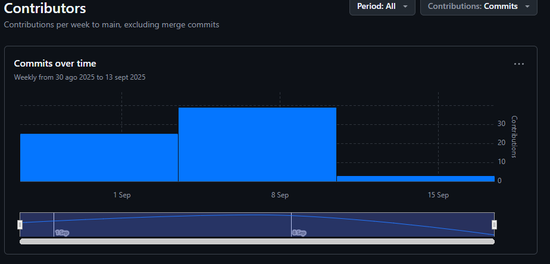  

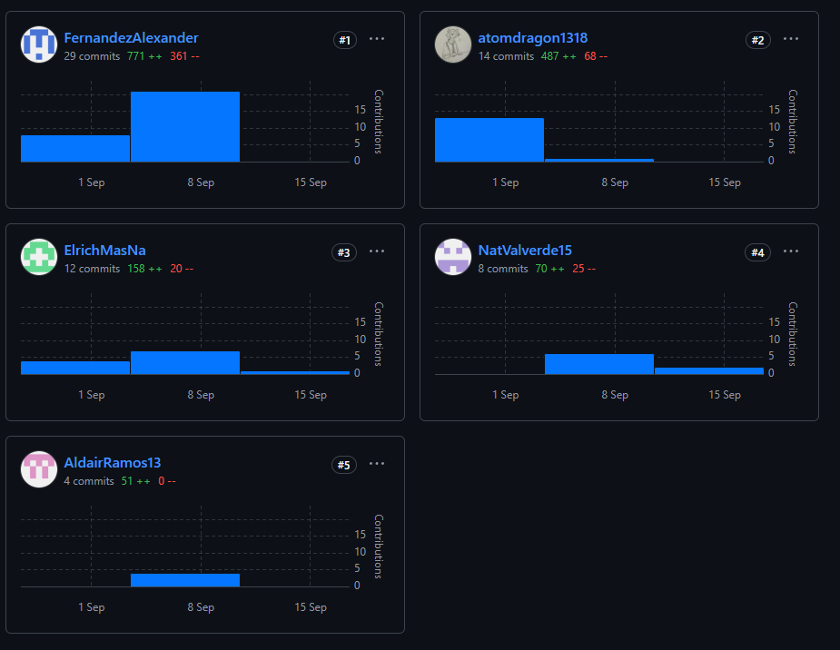  

---

## 5.2.2 Sprint 2

A continuación, en el Sprint 2 nos enfocamos en las funcionalidades de la aplicación web, trabajando con una estructura basada en Domain-Driven Design (DDD). Nos organizamos utilizando bounded contexts clave que permiten una mejor gestión y uso eficiente de las herramientas de diseño de productos.

## 5.2.2.1 Sprint Planning 2

| **Sprint #** | Sprint 2 |
|------------|-----------------|
| **Sprint Planning Background** | Reunión inicial de planificación del proyecto **SmartStay**, orientada a establecer los objetivos del primer sprint y asignar las tareas relacionadas con el diseño, desarrollo y despliegue de la Landing Page. |
| **Date** | 2025-10-01 |
| **Time** | 07:00 PM |
| **Location** | Modalidad remota mediante **Discord** |
| **Prepared By** | Equipo **SmartStay** |
| **Attendees (to planning meeting)** | Verona Flores, Italo Sebastián / Valverde Portuguez, Natalia Ximena / Fernandez Garfias, Alexander Piero / Saavedra Angulo, Jose Jhonatan |
| **Sprint 2 – 1 Review Summary** | Durante el primer Sprint desarrollamos la estructura base de **Smart Stay** y logramos poner en marcha una versión funcional inicial. El progreso fue positivo, aunque se detectó un problema con la configuración del idioma, que será corregido en el siguiente Sprint. |
| **Sprint 2 – 1 Retrospective Summary** | Durante el primer Sprint trabajamos de manera colaborativa en el desarrollo de **Smart Stay** y completamos la mayoría de las tareas planificadas con éxito. Sin embargo, surgieron algunos errores técnicos durante la integración. Identificamos como oportunidades de mejora la necesidad de una validación más rigurosa antes del despliegue y una mejor coordinación en la documentación del proyecto. |
| **Sprint Goal & User Stories** | — |
| **Sprint 2 Goal** | Nuestro objetivo es entregar una versión completamente funcional y visualmente mejorada de **Smart Stay** como una aplicación web de una sola página (SPA). Incluiremos la optimización de la experiencia en la landing page para ofrecer una navegación más clara y atractiva. Esperamos que estos avances mejoren la usabilidad y la percepción de los usuarios que están explorando nuestra plataforma. El cumplimiento se confirmará cuando la landing page refleje los nuevos ajustes de diseño, la navegación sea fluida y la aplicación esté desplegada de forma pública y estable. |
| **Sprint 2 Velocity** | 15 |
| **Sum of Story Points** | 18 |

---

## 5.2.2.2. Aspect Leaders and Collaborators

Durante este Sprint, el equipo se enfocó en el **diseño visual, maquetación y despliegue de la Landing Page** de **Smart Stay**, junto con la implementación inicial del soporte multilenguaje y la adaptación responsiva del sitio web.  
Para optimizar el trabajo colaborativo, se elaboró la **Matriz de Liderazgo y Colaboración (LACX)**, donde se asignan los roles de **Líder (L)** y **Colaborador (C)** en los principales aspectos del Sprint.

| **Team Member (Last Name, First Name)** | **GitHub Username** | **Diseño visual y maquetación web (Frontend funcional)** | **Implementación técnica del cambio de idioma (Multilenguaje funcional)** | **Responsividad y pruebas en distintos dispositivos** | **Despliegue de la aplicación web** |
|-----------------------------------------|---------------------|-----------------------------------------------------|-----------------------------------------------------------------------------|--------------------------------------------------------|--------------------------------------|
| **Verona Flores, Italo Sebastián**      | [@atomdragon1318](https://github.com/atomdragon1318) | L | C | C | C |
| **Valverde Portuguez, Natalia Ximena**  | [@NatValverde15](https://github.com/NatValverde15) | C | L | C | C |
| **Fernandez Garfias, Alexander Piero**  | [@FernandezAlexander](https://github.com/FernandezAlexander) | C | C | L | C |
| **Saavedra Angulo, Jose Jhonatan**      | [@ElrichMasNa](https://github.com/ElrichMasNa)| C | C | C | L |
| **Ramos Aguirre, Aldair Joaquin**      | [@AldairRamos13](https://github.com/AldairRamos13)| C | C | C | L |

---

## 5.2.2.3. Sprint Backlog 2. 

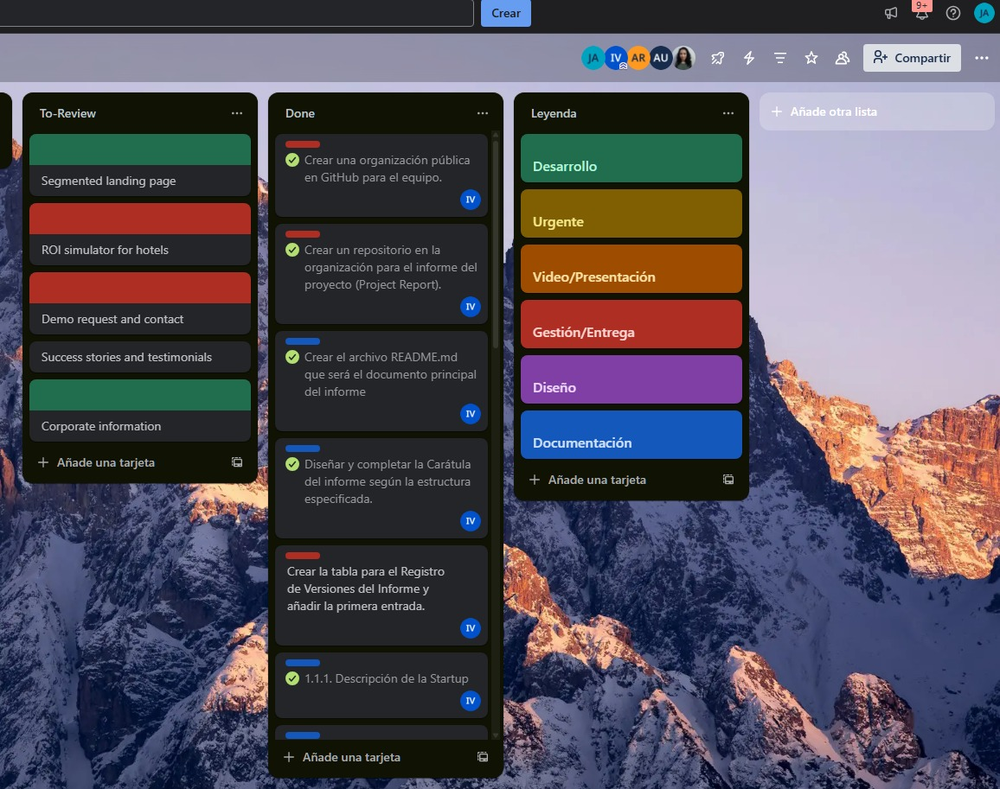

| **Sprint #** | **User Story Id** | **User Story Title** | **Task Id** | **Task Title** | **Description** | **Estimation (Hours)** | **Assigned To** | **Status** |
|--------------|----------------|--------------------|--------|------------|-----------------|------------------------|-----------------|------------|
| Sprint 2 | US-24 | Segmented landing page | UT-10 | Optimize visual design | Improve color coherence, typography, and graphic elements. | 5 | Natalia | Done |
| Sprint 2 | US-24 | Segmented landing page | UT-11 | Optimize SEO and performance | Implement SEO best practices and reduce load times. | 6 | Italo | In Process |
| Sprint 2 | US-25 | ROI simulator for hotels | UT-12 | Design ROI simulator interface | Create mockup and structure for interactive simulator fields. | 6 | Alexander | To Do |
| Sprint 2 | US-25 | ROI simulator for hotels | UT-13 | Implement calculation logic | Program function to dynamically calculate ROI. | 7 | Jose | In Process |
| Sprint 2 | US-27 | Demo request and contact | UT-14 | Integrate form with backend| Connect contact form with simulated lead registration API. | 5 | Aldair | To Review |
| Sprint 2 | US-24 | Segmented landing page | UT-15 | Implement multilingual system | Add support for English/Spanish and automatic detection. | 6 | Italo | In Process |
| Sprint 2 | US-24 | Segmented landing page | UT-16 | Responsiveness testing | Conduct tests across different browsers and devices. | 5 | Natalia | Done |
| Sprint 2 | US-26 | Success stories and testimonials | UT-17 |Add metrics to testimonials | Show improvement percentages or impact in success stories. | 4 | Jose | To Do |
| Sprint 2 | US-28 | Corporate information | UT-18 |Team and leadership section| Add data and images of key team members. | 4 | Aldair | To Review |
| Sprint 2 | US-24 | Segmented landing page | UT-19 | Deploy new public version | Publish optimized and fully functional site version. | 3 | Italo | Done |

---
## 5.2.2.4. Development Evidence for Sprint Review 

En este segundo Sprint hemos realizado la implementación de nuestra Single Page Application. En la siguiente tabla se muestran los commits realizados.

### Commits realizados

(FALTA TABLA DE COMMITS)

**Evidencia de los commits del FrontEnd**
(FALTA FOTO DE COMMITS DE FRONTEND)

---

## 5.2.2.5. Execution Evidence for Sprint Review

Aquí veremos la versión de la aplicación web. Esto fue realizado mediante WebStorm y su complemento de git, con esto cada integrante pudo realizar cambios y versiones en sus ramas para luego mandarlas a la rama principal y no tener ningún inconveniente. A continuación se mostrarán las evidencias de ejecución.

- LOGIN Y REGISTER

Primero en esta vista podemos ver el Login de la app, con su respectivo formulario donde se coloca el email, contraseña y rol. También un vínculo para redirigir a register, que también lo puedes ver en un botón junto con los botones de lenguaje inglés y español.

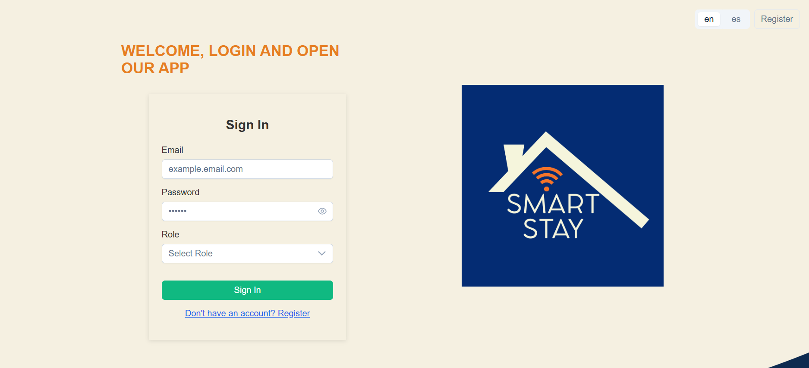

En esta sección se puede ver la vista de register, con su repectivo formulario para crear una cuenta y en el rol que desees. También tiene un vínculo para redirigir a login, que también lo puedes ver en un botón junto con los botones de lenguaje inglés y español.

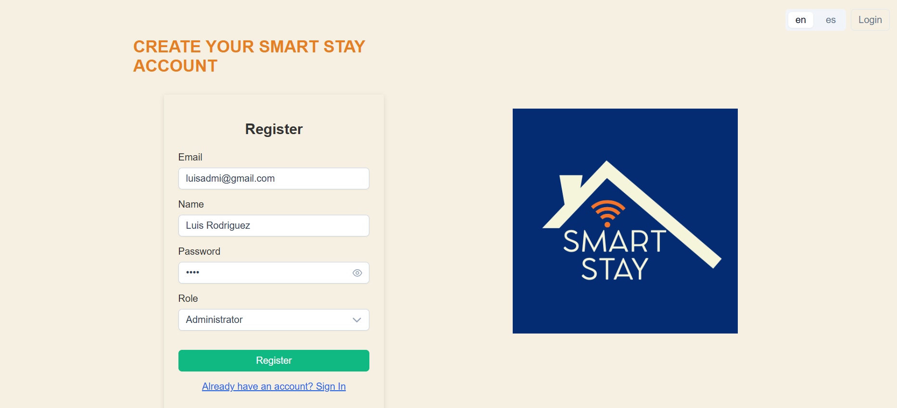

- VISTA COMO ADMINISTRADOR (ADMINISTRATOR)

En esta sección se puede ver el dashboard de administrador de la persona. Puede apreciar datos como Rooms Found, Registered Staff, Bookings(Today) y Occupance Rate. También tienes el menú con sus dos funciones principales que te redirigen a una vista diferente Manage Staff y Manage Rooms.

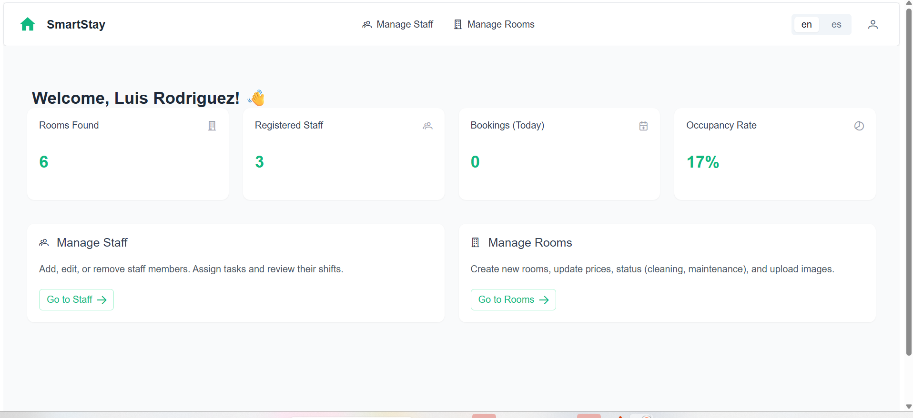

Aquí vemos la vista de Manage Staff. Puedes editar y eliminar la información de cada personal que se haya registrado. También puedes agregar un nuevo personal.

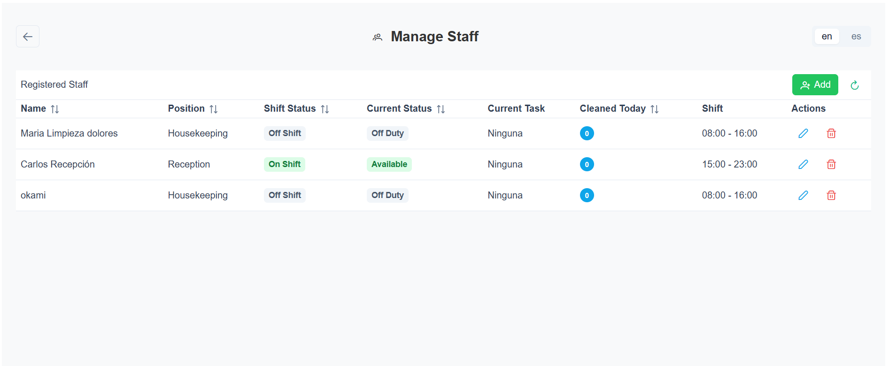

Aquí vemos la vista de Manage Rooms. Puedes editar y eliminar la información de cada habitación de un respectivo hotel que se haya registrado. También puedes agregar una nueva habitación.

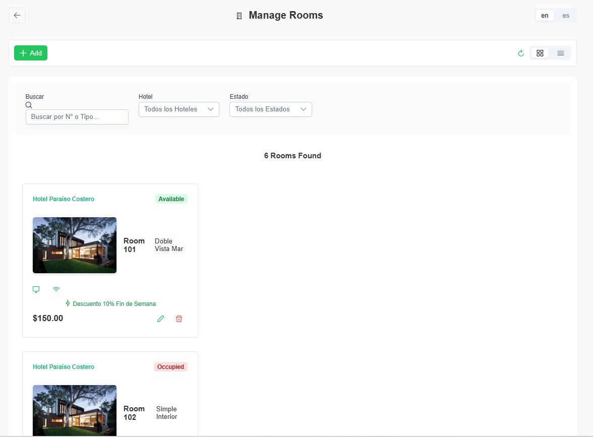
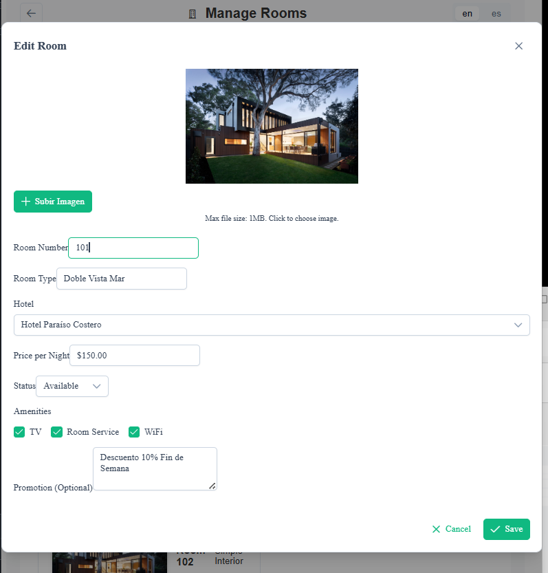

También en el dashboard de admin puedes acceder a ver tu perfil.

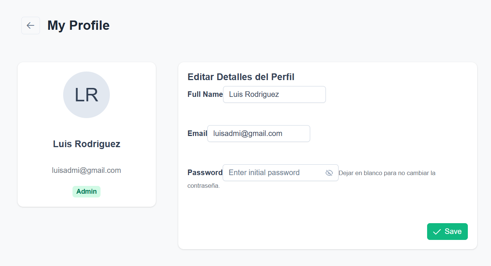

- VISTA COMO HUÉSPED (GUEST)

En esta sección se puede ver el dashboard de huésped de la persona. Puede apreciar datos como Upcoming Bookings, Active Services, Recommendation donde puedes dejar tus reseñas y Recent Properties. También tienes el menú con sus tres funciones principales que te redirigen a una vista diferente View Properties, Manage Bookings y View Rooms.

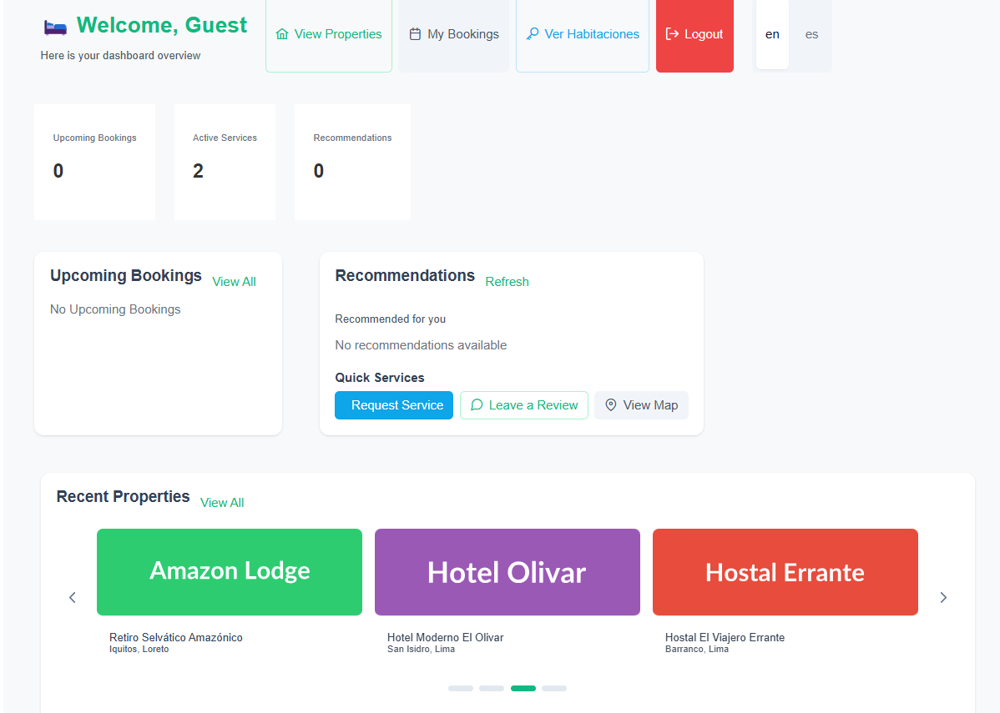

Aquí vemos la vista de View Properties. Puedes buscar información de los hoteles, tienes el buscador para buscar para palabra clave y haces click en Ver Hotel y lo ves más a detalle.

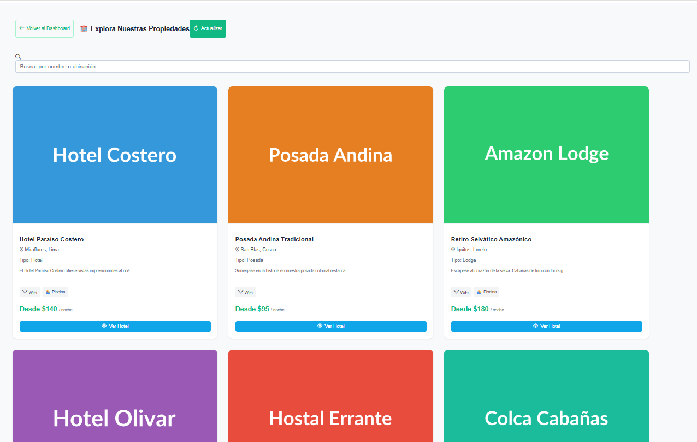
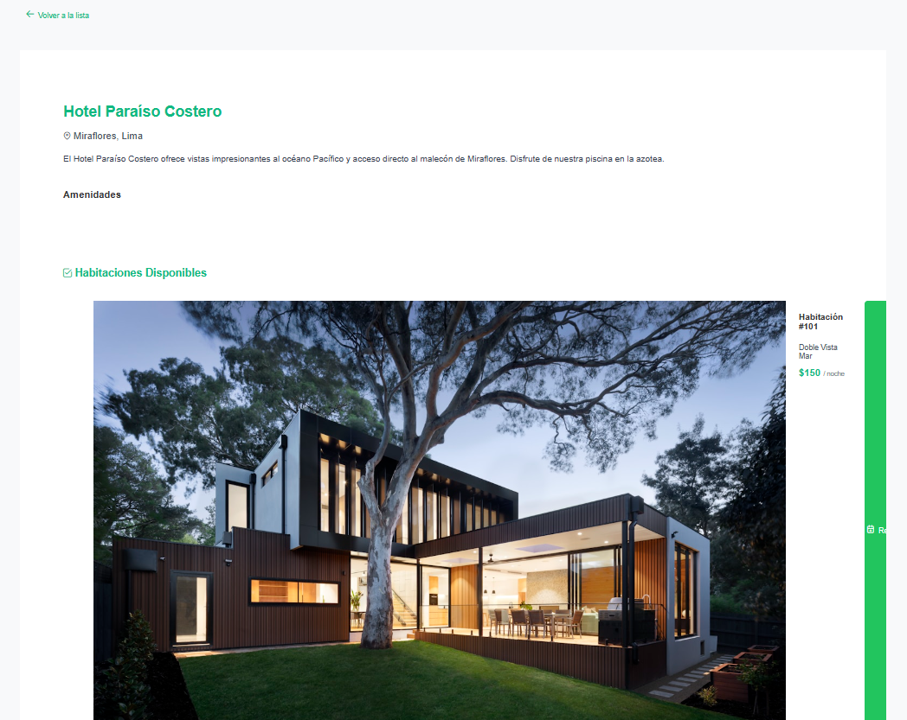

Si presionas reservar te lleva a una vista donde seleccionas las fechas y reservas.
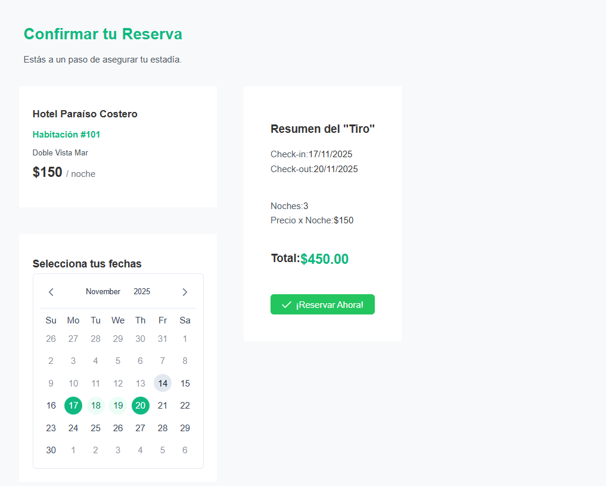

Aquí vemos la vista de View Rooms y puedes usar filtros por hotel, tipo y precio.

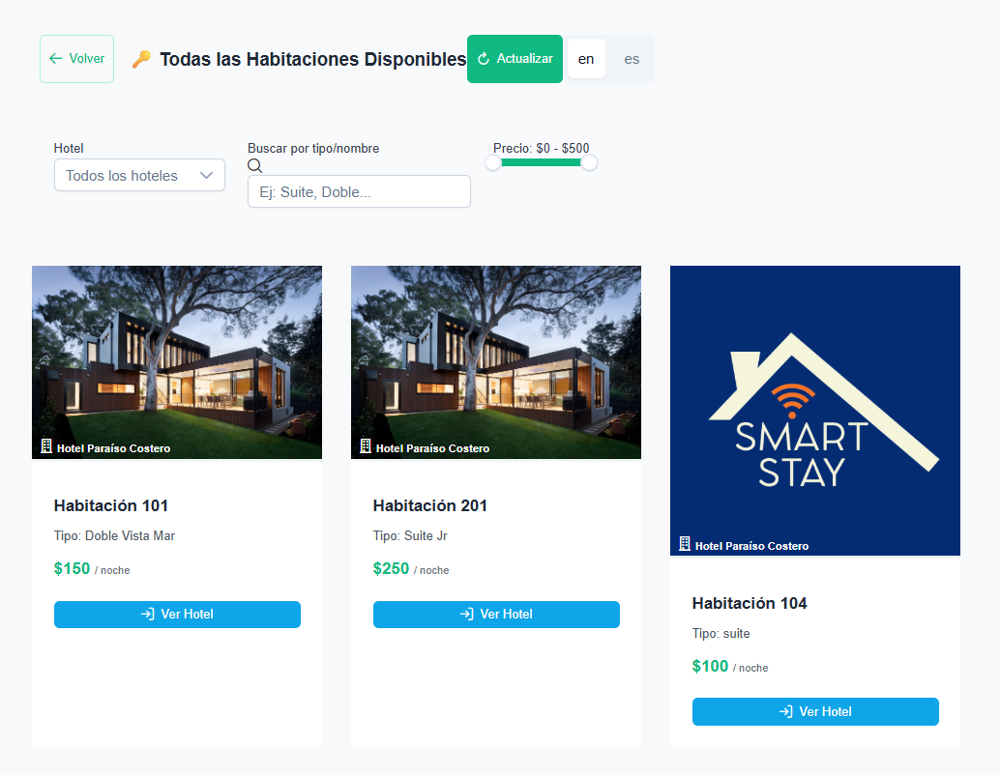

Y aquí donde dejamos las reseñas.
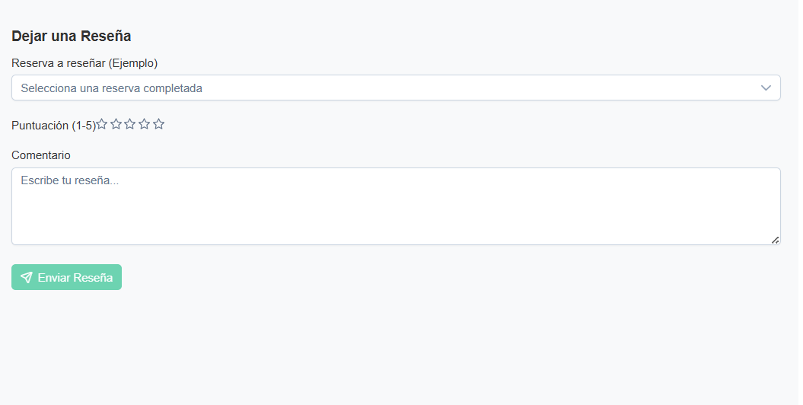

- VISTA COMO STAFF
  
En esta sección se puede ver el dashboard de staff de la persona. Puede apreciar datos como Performance Statistics, Pending Tasks, Assigned Rooms y Quick Actions para reportar problemas o pedir requerimientos. También tienes el menú lateral con Manage Tasks, Assigned Rooms de nuevo y Profile.

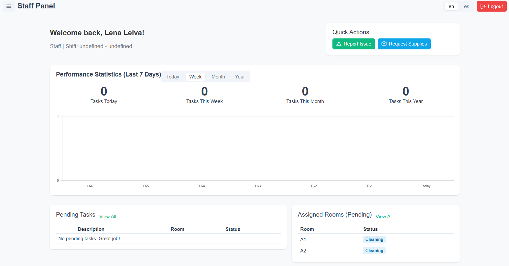

Aquí vemos la vista de Manage Tasks donde puedes editar, eliminar y agregar un nuevo task. Los ves por filtros de estados.

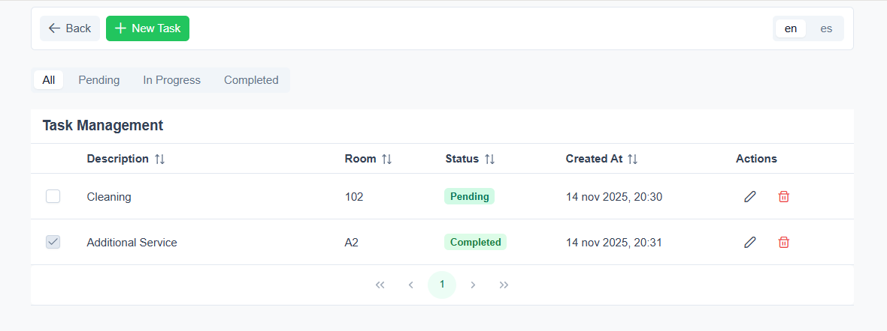

Aquí vemos la vista de Assigned Rooms. Puedes buscar los cuartos asignados y marcas sus estados si está ocupada, en mantenimiento, entre otras. Puedes ver la cantidad de cuartos por tipo de estado y tarea.

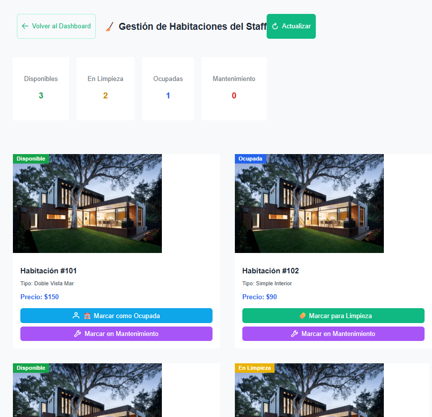

Y aquí verás el perfil del staff.
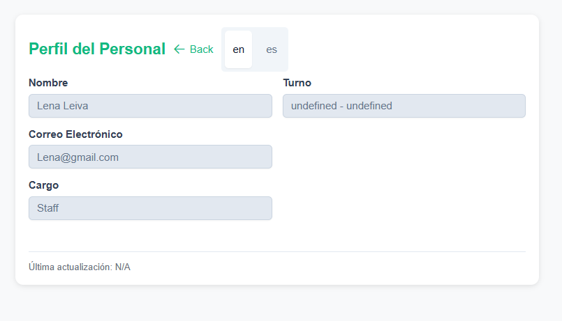

---
## 5.2.2.6. Service Documentation Evidence for Sprint Review. 

En este Sprint aún no se desarrolla el backend real de SmartStay; sin embargo, para avanzar con la funcionalidad del sistema, se implementaron rutas de frontend completamente operativas y conectadas a una API simulada (mock data).
Estas rutas representan las vistas principales del sistema para los perfiles Admin, Guest y Staff, y permitieron validar los flujos clave con datos falsos.

La documentación siguiente recoge las “acciones simuladas” disponibles en el sistema, incluyendo navegación, carga de datos de ejemplo, formularios y operaciones emuladas. Esto sirve como base para la posterior implementación de Web Services reales.

| Endpoint / Ruta | Acción Implementada (Simulada) | Método HTTP Simulado | Sintaxis / Llamada | Parámetros | Ejemplo de Response (Mock) | URL |
|------------------|-------------------------------|-----------------------|---------------------|------------|------------------------------|------|
| /login | Inicio de sesión del usuario | POST (simulado) | /login | Body: email, password | { "status":"success","role":"admin" } | https://smartstay-3cffc.web.app/login |
| /register | Registrar nuevo usuario | POST (simulado) | /register | Body: name, email, password | { "id": 4, "name": "Ana" } | https://smartstay-3cffc.web.app/register |
| /admin/dashboard | Mostrar dashboard admin | GET | /admin/dashboard | — | { "welcome":"Admin Panel" } | https://smartstay-3cffc.web.app/admin/dashboard |
| /admin/auth/users | Ver lista de staff | GET | /admin/auth/users | Query: ?role=staff | [ { "id":1,"name":"Juan"} ] | https://smartstay-3cffc.web.app/admin/auth/users |
| /admin/auth/users/edit/:id | Editar usuario staff | PUT (simulado) | /admin/auth/users/edit/{id} | Path: id | { "message":"User updated" } | https://smartstay-3cffc.web.app/admin/auth/users/edit/2 |
| /admin/auth/users/add | Crear usuario del staff | POST (simulado) | /admin/auth/users/add | Body: name, role | { "id":6, "name":"Sofía" } | https://smartstay-3cffc.web.app/admin/auth/users/add |
| /admin/property/rooms | Ver habitaciones | GET | /admin/property/rooms | Query: ?status=available | [{"id":10, "type":"Doble"}] | https://smartstay-3cffc.web.app/admin/property/rooms |
| /admin/profile | Ver perfil admin | GET | /admin/profile | — | { "id":1,"name":"Admin" } | https://smartstay-3cffc.web.app/admin/profile |
| /guest/dashboard | Dashboard huésped | GET | /guest/dashboard | — | { "welcome":"Guest Dashboard" } | https://smartstay-3cffc.web.app/guest/dashboard |
| /guest/properties | Ver propiedades | GET | /guest/properties | Query: ?city=Lima | [{"id":101,"name":"SmartStay Miraflores"}] | https://smartstay-3cffc.web.app/guest/properties |
| /guest/property/:id | Ver detalle de propiedad | GET | /guest/property/{id} | Path: id | { "id":101,"rooms":32 } | https://smartstay-3cffc.web.app/guest/property/101 |
| /guest/book/:propertyId/:roomId | Iniciar reserva simulada | POST (simulado) | /guest/book/{propertyId}/{roomId} | Path: propertyId, roomId | { "bookingId":201,"status":"confirmed" } | https://smartstay-3cffc.web.app/guest/book/101/201 |
| /guest/bookings | Ver reservas del huésped | GET | /guest/bookings | Query: ?status=completed | [{"id":201,"status":"confirmed"}] | https://smartstay-3cffc.web.app/guest/bookings |
| /guest/rooms | Ver lista de habitaciones | GET | /guest/rooms | Query: ?capacity=2 | [{"id":31,"capacity":2}] | https://smartstay-3cffc.web.app/guest/rooms |
| /staff/dashboard | Dashboard del staff | GET | /staff/dashboard | — | { "welcome":"Staff Dashboard" } | https://smartstay-3cffc.web.app/staff/dashboard |
| /staff/property/tasks | Ver/gestionar tareas | GET / POST (simulado) | /staff/property/tasks | Body (POST): task, roomId | [{"task":"Clean Room 12"}] | https://smartstay-3cffc.web.app/staff/property/tasks |
| /staff/property/cleaning | Ver habitaciones asignadas | GET | /staff/property/cleaning | — | [{"roomId":23,"status":"pending"}] | https://smartstay-3cffc.web.app/staff/property/cleaning |
| /staff/profile | Ver perfil staff | GET | /staff/profile | — | { "id":3,"name":"Rosa Staff" } | https://smartstay-3cffc.web.app/staff/profile |

---

## 5.2.2.7. Software Deployment Evidence for Sprint Review

Durante este Sprint hemos desplegado el frontend.

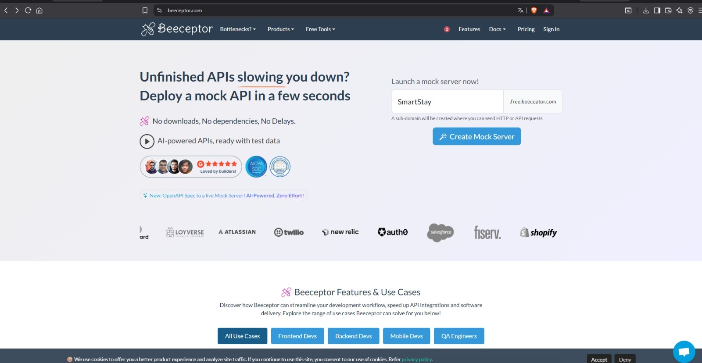

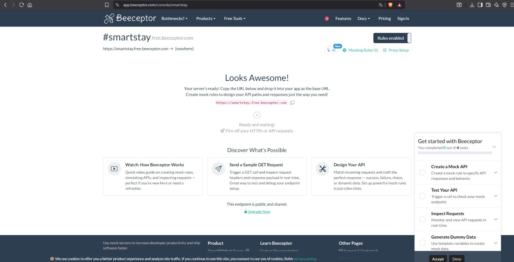

Usaremos Firebase, el cuál es una plataforma de desarrollo de Google que ofrece servicios backend listos.

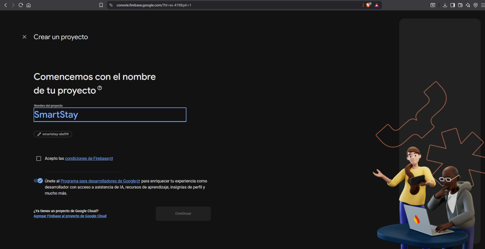

---
## 5.2.2.8. Team Collaboration Insights during Sprint

Durante este Sprint, el equipo colaboró en la mejora del frontend de Smart Stay, corrigiendo aspectos de diseño, idioma y navegación. Se trabajó mediante GitHub, lo que permitió una buena organización y seguimiento de los aportes de cada integrante. Aunque la colaboración fue efectiva, se presentaron algunas limitaciones por tiempo y experiencia, pero el resultado final mostró una versión más sólida y funcional del producto.

### Acciones de colaboración destacadas

- Se utilizó **GitHub** como herramienta principal para coordinar el trabajo, gestionar versiones y mantener un registro claro de los avances.
- Un integrante del equipo organizó la estructura del repositorio y creó las ramas necesarias para trabajar ordenadamente en las mejoras del frontend.
- Cada miembro realizó **commits documentados**, describiendo los ajustes en diseño, idioma y navegación.
- Se llevaron a cabo **pull requests** para integrar los cambios en la rama principal, asegurando un flujo de trabajo controlado.
- Se realizaron **revisiones de código** en equipo para verificar la coherencia visual, la correcta implementación de las mejoras y la corrección de los errores señalados en la revisión anterior.
- A pesar de las limitaciones de tiempo y experiencia, la comunicación constante permitió resolver obstáculos y mantener un progreso estable.

Gracias a este flujo de trabajo, el equipo pudo avanzar de forma paralela y ordenada, evitando conflictos en el código y asegurando un resultado consistente.

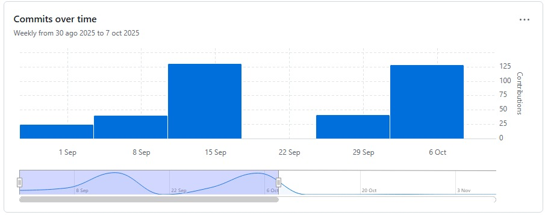

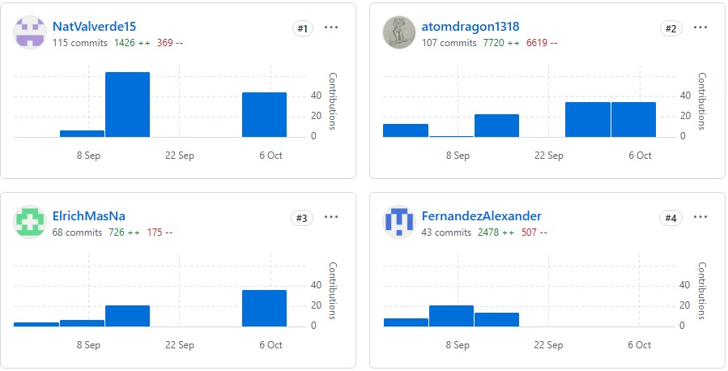

---
## 5.2.3. Sprint 3

En el Sprint Backlog 3, se juntan todas las User Stories enfocadas en la creación del backend con sus respectivas tareas. Aquí también trabajamos con los mismos bounded contexts y estructura planteada en el anterior sprint, pero con el fin de crear su respectivo API RESTful.

## 5.2.3.1. Spring Planning 3.

| **Sprint #** | Sprint 3|
|------------|-----------------|
| **Sprint Planning Background** | Reunión de planificación correspondiente al Sprint 3 del proyecto SmartStay, centrada en el desarrollo e implementación del Backend. En esta etapa se construirá la API RESTful que permitirá la comunicación entre el frontend y la base de datos. Además, se acordó mejorar la calidad de las User Stories y Technical Stories del proyecto, corrigiendo referencias a elementos de UI y reescribiendo las Technical Stories para que sigan el formato correcto enfocado en la API REST con endpoints específicos y códigos HTTP. |
| **Date** | 2025-10-22 |
| **Time** | 07:00 PM |
| **Location** | Modalidad remota mediante **Discord** |
| **Prepared By** | Equipo **SmartStay** |
| **Attendees (to planning meeting)** | Verona Flores, Italo Sebastián / Valverde Portuguez, Natalia Ximena / Fernandez Garfias, Alexander Piero / Saavedra Angulo, Jose Jhonatan |
| **Sprint 3 – 2 Review Summary** | En el Sprint 2, logramos culminar el desarrollo del frontend de SmartStay, incluyendo la implementación de la interfaz principal, la navegación y la optimización visual. El resultado fue funcional, aunque se identificaron pequeñas incidencias con la estructura de los bounded contexts, el diseño de interfaz y el rendimiento que deberán ser ajustadas más adelante. |
| **Sprint 3 – 2 Retrospective Summary** | Durante el Sprint 2, el equipo trabajó de forma colaborativa y cumplió con los objetivos propuestos. Sin embargo, se evidenció la necesidad de una mejor coordinación en la gestión de versiones y documentación del código. Se acordó reforzar el control de tiempo en las tareas dadas a los integrantes. |
| **Sprint Goal & User Stories** | — |
| **Sprint 3 Goal** | **Nuestro enfoque está en** implementar los bounded contexts core del negocio (Accommodations, Bookings y Payments) a través de una API RESTful, mejorando la calidad de las User Stories y Technical Stories del proyecto, y proporcionando documentación interactiva de la API. **Creemos que esto proporciona** funcionalidad backend robusta y escalable a los desarrolladores frontend, mejor especificación de requisitos a los stakeholders, y una base sólida para la integración de servicios a los administradores de hoteles. **Esto se confirmará cuando** los desarrolladores frontend puedan consumir los endpoints de Accommodations, Bookings y Payments a través de la API desplegada, las User Stories y Technical Stories cumplan con los estándares de calidad establecidos  y la documentación Swagger  para pruebas de integración. |
| **Sprint 3 Velocity** | 18 |
| **Sum of Story Points** | 20 |

---

## 5.2.3.2. Aspect Leaders and Collaborators.

Durante este tercer Sprint, el equipo se enfocó en el desarrollo e implementación del Backend , creando la estructura base de la API RESTful y los bounded contexts correspondientes. Se configuró la conexión a la base de datos, se implementó la autenticación y se estableció la comunicación entre servicios siguiendo los principios de arquitectura por bounded contexts.
Para optimizar la coordinación del equipo, se elaboró la Matriz de Liderazgo y Colaboración (LACX), donde se definen los roles de Líder (L) y Colaborador (C) según los principales aspectos del Sprint.

| **Team Member (Last Name, First Name)** | **GitHub Username** | **Implementación de la API RESTful (Endpoints principales)** | **Integración de bounded contexts** | **Configuración y conexión con la Base de Datos** | **Gestión de autenticación y seguridad** |
|-----------------------------------------|---------------------|-----------------------------------------------------|-----------------------------------------------------------------------------|--------------------------------------------------------|--------------------------------------|
| **Verona Flores, Italo Sebastián**      | [@atomdragon1318](https://github.com/atomdragon1318) | L | C | C | C |
| **Valverde Portuguez, Natalia Ximena**  | [@NatValverde15](https://github.com/NatValverde15) | C | L | C | C |
| **Fernandez Garfias, Alexander Piero**  | [@shiloox](https://github.com/shiloox) | C | C | L | C |
| **Saavedra Angulo, Jose Jhonatan**      | [@ElrichMasNa](https://github.com/ElrichMasNa)| C | C | C | L |

---

## 5.2.3.3. Sprint Backlog 3.

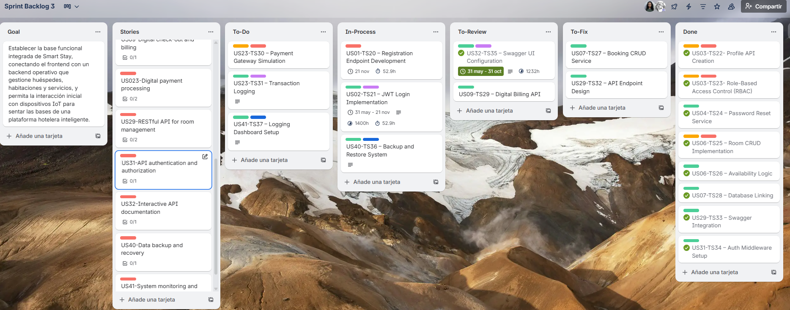

| **Sprint #** | **User Story Id ** | **User Story Title** | **Task Id** | **Task Title** | **Description** | **Estimation (Hours)** | **Assigned To** | **Status** |
|--------------|----------------|--------------------|--------|------------|-----------------|------------------------|-----------------|------------|
| Sprint 3 | US01 | Registro de huésped | UT-20 | Registration Endpoint Development | Create an endpoint for user registration with field validation and database storage. | 3 | Alexander | Done |
| Sprint 3 | US02 | Inicio de sesión seguro | UT-21 | Login Implementation | Develop login endpoint using JWT for authentication and secure sessions. | 3 | Italo | In Process |
| Sprint 3 | US03 | Recuperación de contraseña | UT-24 | Password Reset Service | Develop a token-based password recovery system with email verification. | 4 | Natalia | Done |
| Sprint 3 | US04 | Edición de perfil personal | UT-22 | Profile API Creation | Build endpoints for viewing and updating user profiles.| 5 | Jose | Done |
| Sprint 3 | US04 | Edición de perfil personal | UT-23 | Role-Based Access Control | Implement middleware to manage role permissions (admin, host, guest).| 5 | Italo | Done |
| Sprint 3 | TS01 | Registro de usuario a través de la API | UT-20 | Registration Endpoint Development | Create an endpoint for user registration with field validation and database storage. | 3 | Alexander | Done |
| Sprint 3 | TS02 | Inicio de sesión a través de la API | UT-21 | Login Implementation | Develop login endpoint using JWT for authentication and secure sessions. | 3 | Italo | In Process |
| Sprint 3 | TS01 | Registro de usuario a través de la API | UT-34 | Auth Middleware Setup | Configure authentication and authorization middleware for all routes. | 3 | Natalia | Done |
| Sprint 3 | TS09 | Crear habitación a través de la API | UT-25 | Room CRUD Implementation | Create endpoints to add, update, and delete rooms.| 3 | Natalia | Done |
| Sprint 3 | TS09 | Crear habitación a través de la API | UT-26 | Availability Logic | Implement room status updates (available, booked, maintenance). | 4 | Alexander | To Do |
| Sprint 3 | TS10 | Obtener habitación por ID a través de la API | UT-25 | Room CRUD Implementation | Create endpoints to get room by ID.| 2 | Natalia | Done |
| Sprint 3 | TS17 | Obtener todas las habitaciones a través de la API | UT-25 | Room CRUD Implementation | Create endpoint to get all rooms.| 2 | Natalia | Done |
| Sprint 3 | TS18 | Obtener tipo de habitación por ID a través de la API | UT-25 | Room CRUD Implementation | Create endpoint to get room type by ID.| 2 | Natalia | Done |
| Sprint 3 | TS11 | Crear reserva a través de la API | UT-27 | Booking CRUD Service | Implement booking endpoints for creation, update, and cancellation. | 3 | Jose | Done |
| Sprint 3 | TS11 | Crear reserva a través de la API | UT-28 | Database Linking | Connect booking data to users and rooms with proper relationships.| 4 | Italo | In Process |
| Sprint 3 | TS12 | Obtener reserva por ID a través de la API | UT-27 | Booking CRUD Service | Implement endpoint to get booking by ID.| 2 | Jose | Done |
| Sprint 3 | TS13 | Confirmar reserva a través de la API | UT-27 | Booking CRUD Service | Implement endpoint to confirm booking.| 2 | Jose | Done |
| Sprint 3 | TS19 | Obtener todas las reservas a través de la API | UT-27 | Booking CRUD Service | Implement endpoint to get all bookings.| 2 | Jose | Done |
| Sprint 3 | TS20 | Cancelar reserva a través de la API | UT-27 | Booking CRUD Service | Implement endpoint to cancel booking.| 2 | Jose | Done |
| Sprint 3 | TS14 | Crear pago a través de la API | UT-30 | Payment Gateway Simulation | Create secure endpoint that simulates real payment processing. | 5 | Italo | In Process |
| Sprint 3 | TS14 | Crear pago a través de la API | UT-31 | Transaction Logging | Store payment data and status in database with timestamp. | 3 | Jose | Done |
| Sprint 3 | TS15 | Procesar pago a través de la API | UT-30 | Payment Gateway Simulation | Create endpoint to process payment transactions.| 3 | Italo | In Process |
| Sprint 3 | TS16 | Obtener pagos por reserva a través de la API | UT-30 | Payment Gateway Simulation | Create endpoint to get payments by booking ID.| 2 | Italo | In Process |
| Sprint 3 | TS21 | Obtener pago por ID a través de la API | UT-30 | Payment Gateway Simulation | Create endpoint to get payment by ID.| 2 | Italo | In Process |
| Sprint 3 | TS22 | Obtener todos los pagos a través de la API | UT-30 | Payment Gateway Simulation | Create endpoint to get all payments.| 2 | Italo | In Process |
| Sprint 3 | TS09 | Crear habitación a través de la API | UT-33 | Swagger Integration | Document all endpoints using Swagger/OpenAPI. | 4 | Natalia | Done |
| Sprint 3 | TS11 | Crear reserva a través de la API | UT-33 | Swagger Integration | Document all endpoints using Swagger/OpenAPI. | 4 | Natalia | Done |
| Sprint 3 | TS14 | Crear pago a través de la API | UT-33 | Swagger Integration | Document all endpoints using Swagger/OpenAPI. | 4 | Natalia | Done |
| Sprint 3 | TS09 | Crear habitación a través de la API | UT-35 | Swagger UI Configuration | Integrate Swagger UI to allow live endpoint testing and auto documentation. | 4 | Alexander | To Do |

---

## 5.2.3.4. Development Evidence for Sprint Review.

En este tercer sprint nos enfocamos en realizar la implementación del Backend. Además, como parte del trabajo de desarrollo, se mejoraron las User Stories y Technical Stories del proyecto eliminando referencias a elementos de UI y reescribiendo las Technical Stories para que sigan el formato correcto enfocado en la API REST.

### Commits realizados

### Backend

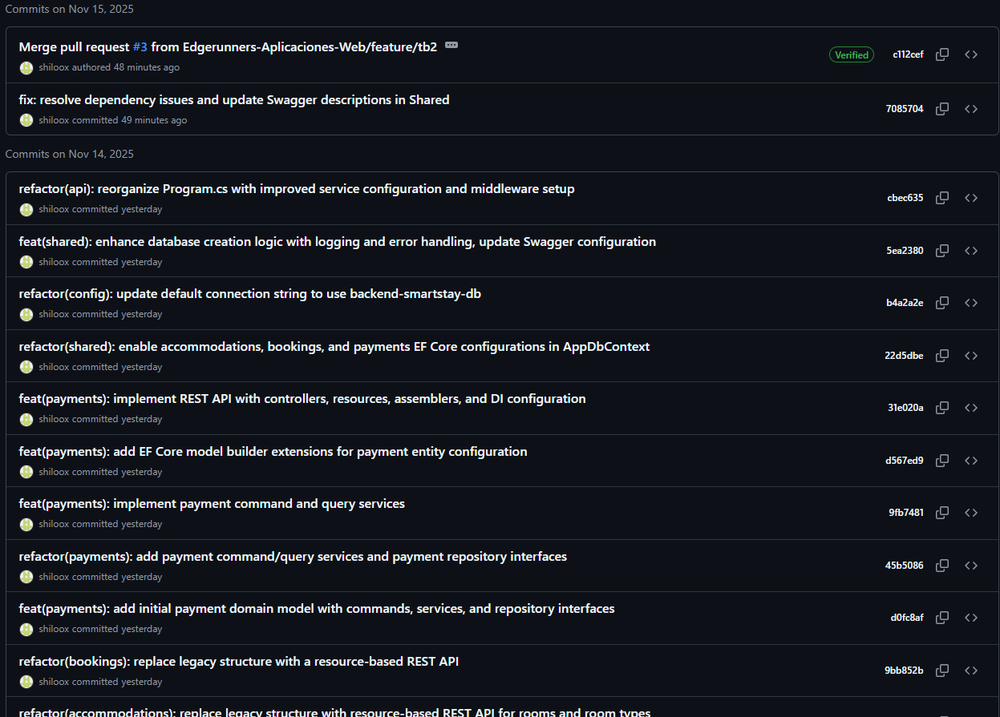

### Report

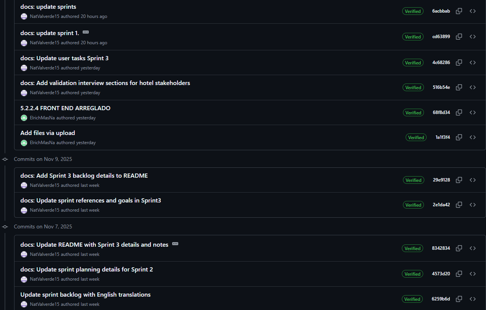

### Front-end

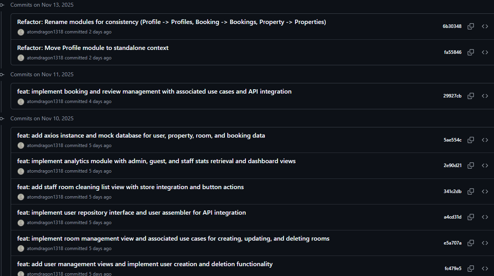

---

## 5.2.3.5. Execution Evidence for Sprint Review

En este **Sprint 3**, el entregable principal fue el **Backend API REST de SmartStay** siguiendo los principios de **Domain-Driven Design (DDD)**.

La ejecución se centró en:

- Implementar una **API REST** siguiendo la arquitectura DDD con separación en bounded contexts.
- Desarrollar los **bounded contexts core del negocio**: Accommodations , Bookings y Payments.
- Configurar **Entity Framework Core** para persistencia con base de datos MySQL.
- Implementar **Swagger/OpenAPI** para documentación interactiva de la API.
- Priorizar la **lógica de negocio core** necesaria para el funcionamiento principal del sistema.

### Bounded Contexts del Sistema

Nuestro sistema está diseñado con **5 bounded contexts** :

1. **Accommodations** - Gestión de habitaciones y tipos de habitación
2. **Bookings** - Gestión de reservas
3. **Payments** - Gestión de pagos
4. **IAM** - Identity and Access Management 
5. **Profile** - Gestión de perfiles de usuario 

En este **Sprint 3**, nos enfocamos en implementar los **3 bounded contexts core del negocio** (Accommodations, Bookings y Payments), ya que representan la lógica de negocio fundamental del sistema de gestión hotelera. Los bounded contexts de **IAM** y **Profile** se implementarán en el **Sprint 4**, ya que no representan lógica de negocio core y pueden desarrollarse posteriormente sin afectar el funcionamiento principal del sistema.

### Bounded contexts desarrollados

#### 1. BOUNDED CONTEXT ACCOMMODATIONS

Este bounded context gestiona las habitaciones y tipos de habitación del sistema:

- **RoomsController**: Endpoints para gestionar habitaciones
  - `GET /api/v1/rooms/{roomId}` - Obtener habitación por ID
  - `POST /api/v1/rooms` - Crear nueva habitación
  - `GET /api/v1/rooms` - Obtener todas las habitaciones
  - `GET /api/v1/rooms/type/{roomTypeId}` - Obtener habitaciones por tipo

- **RoomTypesController**: Endpoints para gestionar tipos de habitación
  - `GET /api/v1/room-types/{roomTypeId}` - Obtener tipo de habitación por ID
  - `POST /api/v1/room-types` - Crear nuevo tipo de habitación
  - `GET /api/v1/room-types` - Obtener todos los tipos de habitación

#### 2. BOUNDED CONTEXT BOOKINGS

Este bounded context gestiona las reservas de habitaciones:

- **BookingsController**: Endpoints para gestionar reservas
  - `GET /api/v1/bookings/{bookingId}` - Obtener reserva por ID
  - `POST /api/v1/bookings` - Crear nueva reserva
  - `GET /api/v1/bookings` - Obtener todas las reservas
  - `GET /api/v1/bookings/room/{roomId}` - Obtener reservas por habitación
  - `POST /api/v1/bookings/{bookingId}/confirm` - Confirmar una reserva
  - `POST /api/v1/bookings/{bookingId}/cancel` - Cancelar una reserva

#### 3. BOUNDED CONTEXT  PAYMENTS

Este bounded context gestiona los pagos asociados a las reservas:

- **PaymentsController**: Endpoints para gestionar pagos
  - `GET /api/v1/payments/{paymentId}` - Obtener pago por ID
  - `POST /api/v1/payments` - Crear nuevo pago
  - `GET /api/v1/payments` - Obtener todos los pagos
  - `GET /api/v1/payments/booking/{bookingId}` - Obtener pagos por reserva
  - `POST /api/v1/payments/{paymentId}/process` - Procesar un pago
  - `POST /api/v1/payments/{paymentId}/fail` - Marcar un pago como fallido

### Características técnicas implementadas

- Arquitectura basada en **Domain-Driven Design (DDD)** con bounded contexts
- **Entity Framework Core** para persistencia de datos con MySQL
- **Swagger/OpenAPI** para documentación interactiva de la API
- **API REST** con endpoints organizados por bounded contexts

### Evidencia visual

A continuación, se adjuntan capturas de pantalla que evidencian la ejecución realizada en este Sprint:

- **Swagger UI - Documentación de la API**

  Aquí se puede observar la interfaz de Swagger que documenta todos los endpoints disponibles de la API, organizados por bounded contexts (Accommodations, Bookings, Payments).

  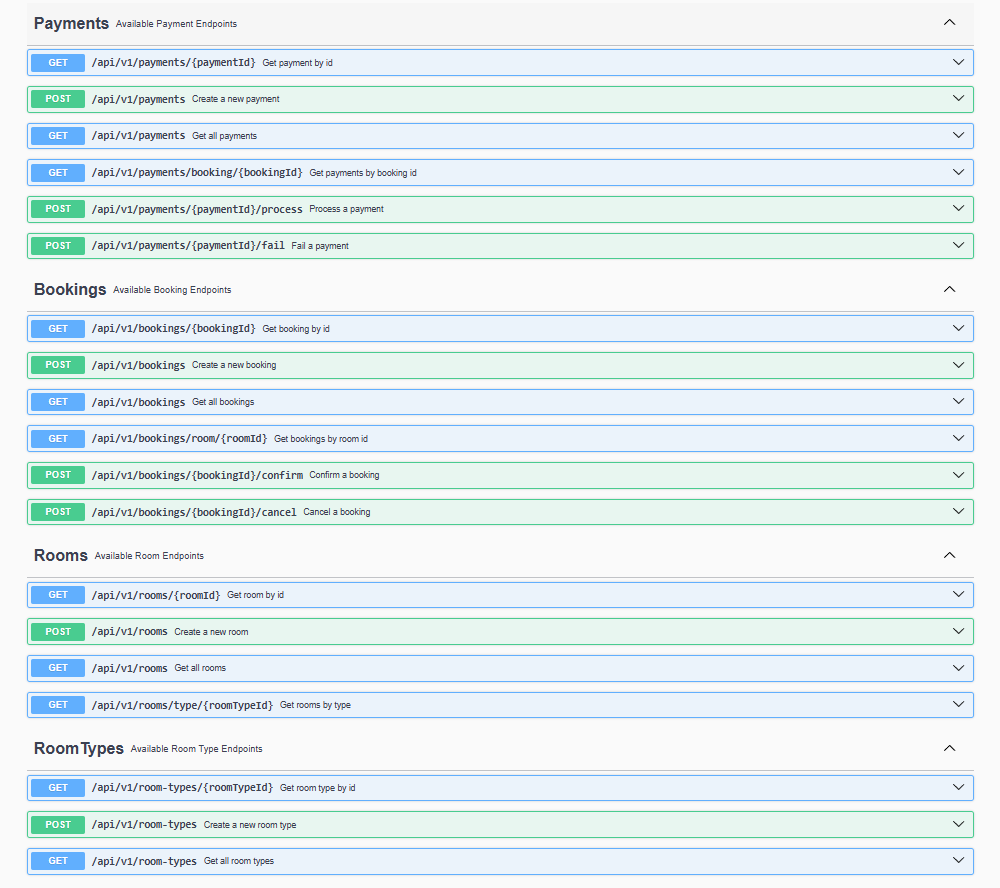

- **Swagger - Endpoints de Accommodations**

  Vista detallada de los endpoints del bounded context de Accommodations, mostrando los métodos HTTP disponibles y sus parámetros.

  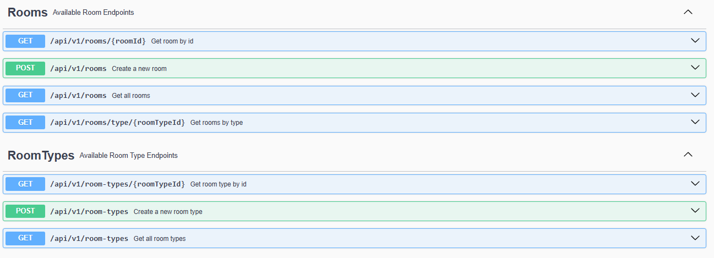

- **Swagger - Endpoints de Bookings**

  Vista detallada de los endpoints del bounded context de Bookings, incluyendo operaciones de creación, consulta, confirmación y cancelación.

  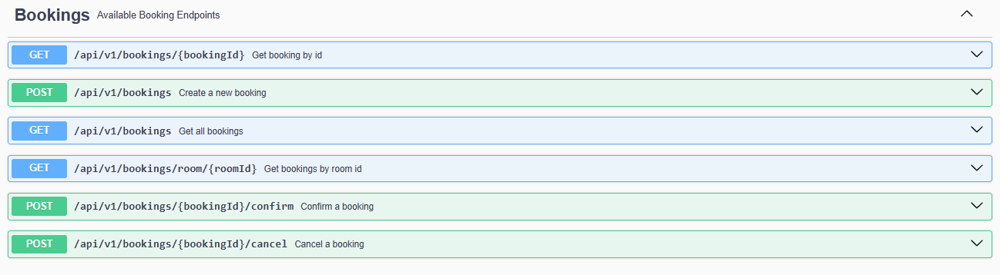

- **Swagger - Endpoints de Payments**

  Vista detallada de los endpoints del bounded context de Payments, mostrando las operaciones para gestionar el ciclo de vida de los pagos.

  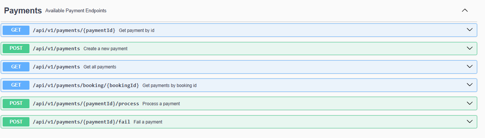

- **Ejemplo de respuesta - Obtener habitación por ID**

  Respuesta JSON al consultar una habitación específica, mostrando la estructura de datos retornada por la API.

  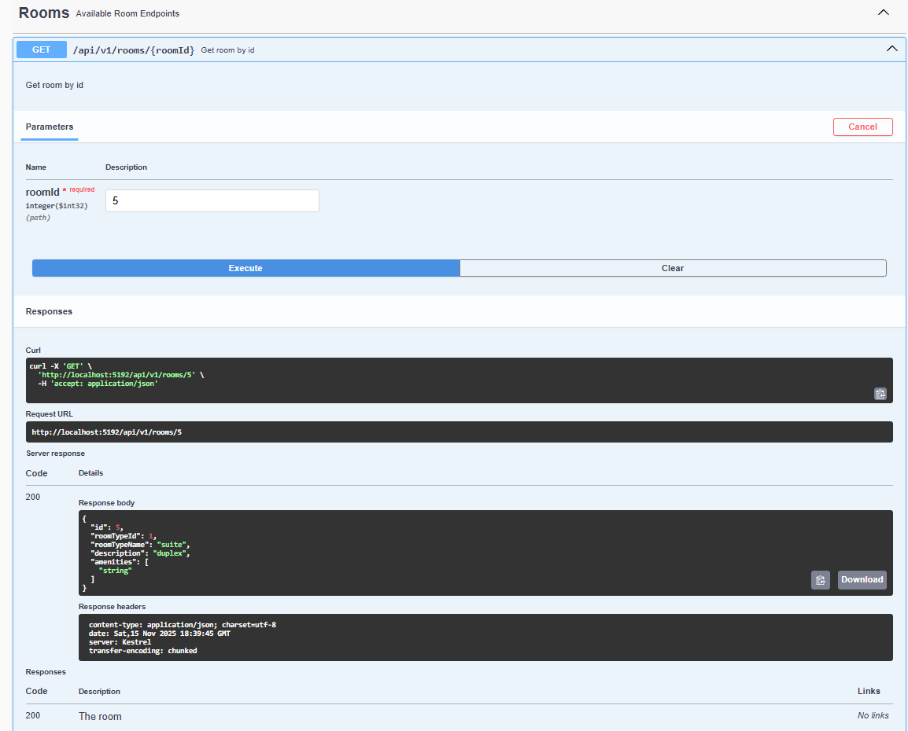

- **Ejemplo de creación - Crear nueva reserva**

  Petición POST para crear una nueva reserva, mostrando el cuerpo de la solicitud y la respuesta con el recurso creado.

  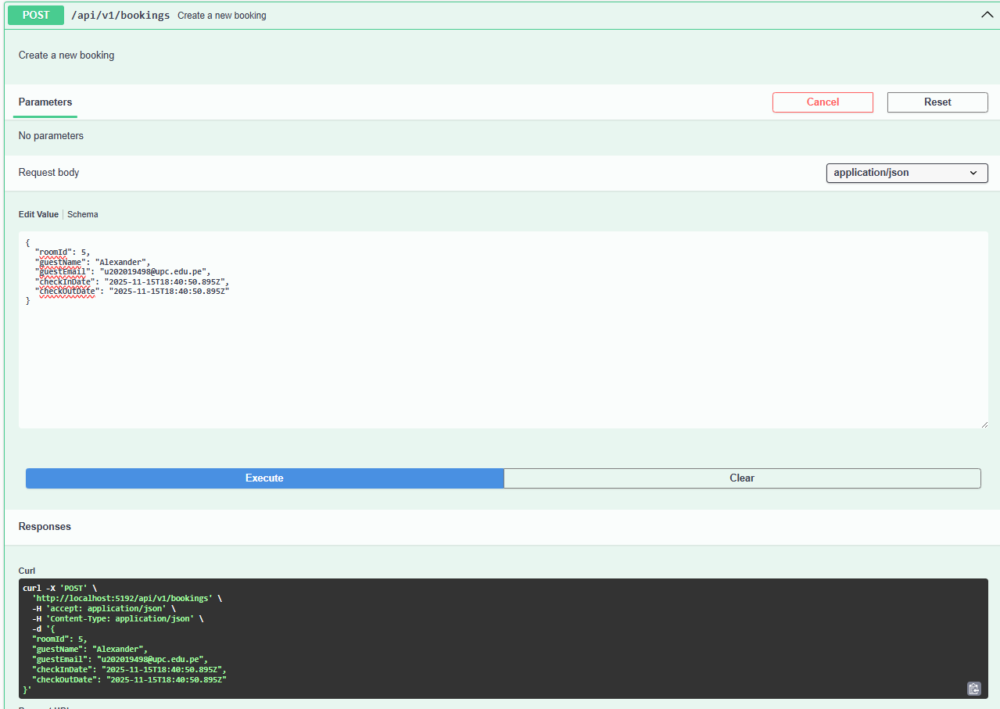

- **Estructura del proyecto **

  Vista de la estructura de carpetas del proyecto, mostrando la organización por bounded contexts (Accommodations, Bookings, Payments).

  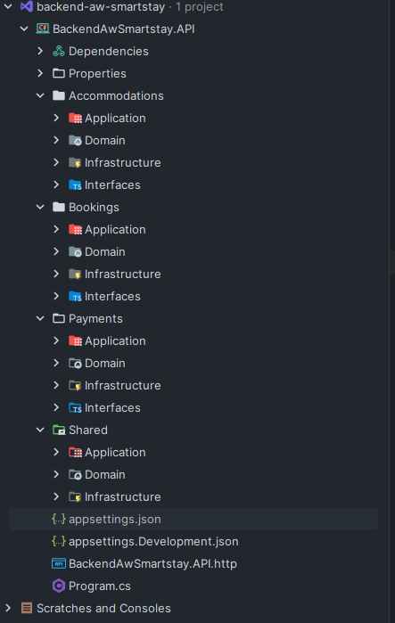

- **Configuración de base de datos**

  Vista de la configuración de Entity Framework Core y la cadena de conexión a MySQL, mostrando cómo se configuró la persistencia de datos.

  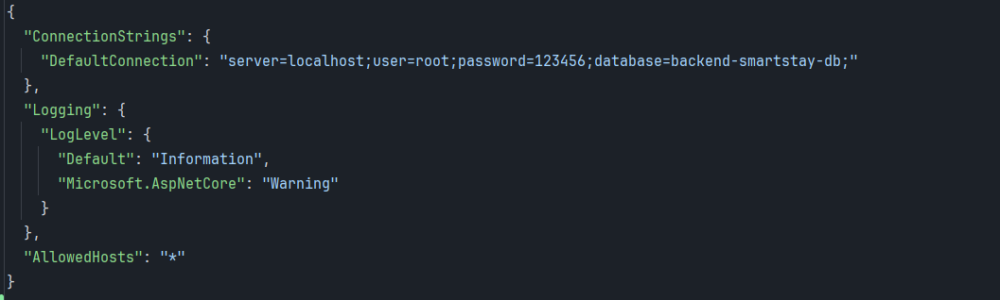

## 5.2.3.6. Services Documentation Evidence for Sprint Review.

En este **Sprint 3**, el equipo implementó la documentación completa de la **API REST de SmartStay** utilizando **Swagger/OpenAPI**. Esta documentación interactiva permite a los desarrolladores y usuarios del sistema entender, probar y consumir los endpoints de manera eficiente.

### Documentación con Swagger/OpenAPI

La documentación de la API se generó  utilizando **Swagger UI**, que proporciona una interfaz web interactiva para explorar y probar todos los endpoints disponibles. Esta herramienta es esencial para:

- **Documentación automática**: Genera documentación actualizada automáticamente basada en los atributos y comentarios del código.
- **Pruebas interactivas**: Permite probar los endpoints directamente desde el navegador sin necesidad de herramientas externas como Postman.
- **Validación de esquemas**: Muestra los modelos de datos, tipos de parámetros y respuestas esperadas para cada endpoint.
- **Integración con frontend**: Facilita la integración del frontend al proporcionar especificaciones OpenAPI que pueden ser consumidas por herramientas de generación de código.

### Bounded contexts documentados

La documentación cubre los siguientes bounded contexts y sus respectivos endpoints:

1. **Accommodations (Alojamientos)**
   - Endpoints para gestión de habitaciones (`/api/v1/rooms`)
   - Endpoints para gestión de tipos de habitación (`/api/v1/room-types`)
   - Operaciones CRUD completas con ejemplos de request y response

2. **Bookings (Reservas)**
   - Endpoints para creación y gestión de reservas (`/api/v1/bookings`)
   - Operaciones de confirmación y cancelación de reservas
   - Consultas de reservas por usuario o habitación

3. **Payments (Pagos)**
   - Endpoints para procesamiento de pagos (`/api/v1/payments`)
   - Consulta de transacciones y estados de pago
   - Integración con simuladores de pasarelas de pago

### Características de la documentación

- **Especificación OpenAPI 3.0**: Cumple con el estándar OpenAPI para máxima compatibilidad.
- **Ejemplos de uso**: Cada endpoint incluye ejemplos de requests y responses.
- **Autenticación documentada**: Se documentan los métodos de autenticación requeridos para endpoints protegidos.
- **Códigos de estado HTTP**: Se especifican todos los códigos de respuesta posibles (200, 201, 400, 401, 404, 500, etc.).

## 5.2.3.7. Software Deployment Evidence for Sprint Review.

Durante este Sprint 3, el equipo desplegó el **Backend API REST de SmartStay**. El despliegue se realizó utilizando la plataforma **Render**, que permite ejecutar servicios web de forma continua y escalable.

### Herramientas y plataformas utilizadas

- **Git**: Se utilizó para el control de versiones, registrando cada cambio en el código fuente del backend.
- **GitHub**: Se creó y configuró el repositorio oficial para el backend, facilitando la colaboración del equipo y el seguimiento de los cambios realizados en los bounded contexts (Accommodations, Bookings, Payments).
- **Render**: Plataforma de hosting en la nube utilizada para desplegar la API REST, permitiendo que el servicio esté disponible de forma continua y accesible para el frontend y otros clientes.
- **MySQL**: Base de datos relacional configurada y conectada mediante Entity Framework Core para la persistencia de datos.
- **Swagger/OpenAPI**: Documentación interactiva de la API desplegada junto con el servicio, permitiendo probar los endpoints directamente desde el navegador.

Este flujo aseguró que el backend desarrollado estuviera disponible para todo el equipo, permitiendo realizar pruebas de integración con el frontend y validar el funcionamiento de la API en un entorno de producción simulado.

### Evidencia del despliegue

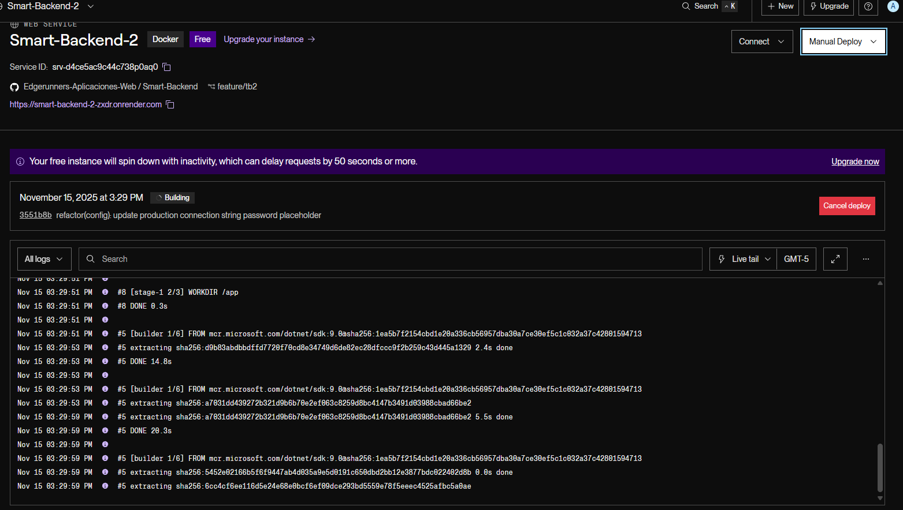

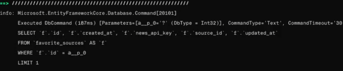

- **URL pública del servicio desplegado en Render:** `https://[//PEGAR AQUI EL DESPLEGUE///ITALO////////////////].onrender.com`

## 5.2.3.8. Team Collaboration Insights during Sprint.

Durante este Sprint, el equipo trabajó de manera colaborativa en el desarrollo del backend de Smart Stay, implementando la API RESTful siguiendo los principios de Domain-Driven Design (DDD). Además, se realizaron correcciones en el frontend, actualizaciones en el reporte y se mejoró la calidad de las User Stories y Technical Stories, eliminando referencias a UI y reescribiéndolas con formato API REST (endpoints específicos, códigos HTTP, estructura Given-When-Then).

Aunque surgieron limitaciones relacionadas con el tiempo y la experiencia técnica, el equipo logró consolidar una versión estable del backend con los bounded contexts de Accommodations, Bookings y Payments, optimizar el frontend y fortalecer la calidad general del proyecto.

### Acciones de colaboración destacadas

- Se utilizó **GitHub** como herramienta central para coordinar el trabajo, gestionar versiones y mantener un registro ordenado de los avances.
- Se reorganizó la estructura del repositorio, creando ramas específicas para el desarrollo del backend y corrección del frontend.
- Cada miembro realizó **commits documentados** detallando la implementación de funcionalidades en el backend, mejoras en el frontend y correcciones en el reporte.
- Se realizó una **revisión y mejora completa de las User Stories y Technical Stories**, eliminando referencias a UI y reescribiéndolas con formato API REST según estándares de calidad.
- Se realizaron **pull requests** y **revisiones de código** en equipo para validar la lógica del backend, verificar la configuración de base de datos y asegurar la corrección del frontend y reporte.
- Se utilizó **Trello** para la gestión visual de tareas y seguimiento del Sprint Backlog.

Gracias a este flujo de trabajo, el equipo pudo avanzar de forma paralela y ordenada, evitando conflictos y asegurando un resultado consistente. La implementación del backend siguiendo DDD permitió una arquitectura escalable y mantenible.

### Evidencia de colaboración

**Commits realizados durante el Sprint 3:**

## 5.3. Validation Interviews.

## 5.3.1. Diseño de Entrevistas. 

### Entrevista – Segmento 1: Administradores de Hoteles Boutique y Pequeños

1. ¿Qué impresión te dejó la herramienta después de ver la demostración?
2. ¿La interfaz y la organización de la información te parecieron claras y fáciles de seguir?
3. ¿Qué partes del sistema te parecieron más útiles para tu hotel?
4. ¿Hay alguna función que no te parezca relevante para tu operación diaria?
5.Si implementaras esta herramienta, ¿qué procesos crees que mejorarían más? (reservas, pagos, personal, disponibilidad, reportes…)
6. ¿Cómo encajaría esta aplicación con la forma en la que actualmente gestionas el hotel?
7.¿Crees que tu equipo podría adaptarse fácilmente al uso de esta herramienta?
8. En tu experiencia, ¿ves que esta app podría ayudar a evitar problemas como sobrerreservas, errores de disponibilidad o fallas en la facturación?
9. ¿Qué cosa en la app mejorarías para que se ajuste mejor a tu hotel?
10. ¿Qué te haría dudar en implementar una herramienta como esta? (costos, capacitación, tiempo, desconfianza, resistencia del personal, etc.)
11. Basado en lo que viste, ¿pagarías una suscripción mensual por este sistema?
12. ¿Qué rango de precio te parecería razonable para un hotel de tu tamaño?
13.Si pudieras pedir una mejora o nueva función antes de usar esta app en tu hotel, ¿cuál sería?
14. ¿Te gustaría probar una versión piloto en tu hotel cuando esté lista?

### Entrevista – Segmento 2: Huéspedes de Hoteles

1. ¿Qué impresión general te dejó la aplicación después de la demostración?
2. ¿La interfaz se te hizo intuitiva y fácil de entender?
3. ¿Qué parte te pareció más útil?
4. ¿Hay alguna función que no te parezca necesaria para ti como huésped?
5. ¿Sientes que este sistema haría más cómoda tu estadía en comparación con un hotel tradicional?
6. ¿Qué te sorprendió o llamó más la atención de manera positiva?
7. ¿Hay algo que te generaría desconfianza al usar este tipo de sistema?
8. ¿Preferirías interacción humana en algún punto, aunque exista el sistema digital?
9. Si dos hoteles ofrecieran lo mismo, pero uno tuviera esta experiencia digital, ¿cuál elegirías?
10. ¿Pagarías un poco más por la experiencia digital? ¿Cuánto aproximadamente?
11. ¿Qué agregarías o cambiarías para que la experiencia del huésped sea más cómoda?
12. ¿Qué parte de la demostración te pareció menos clara o más débil?

---

## 5.3.2. Registro de Entrevistas. 

### Entrevista – Segmento 1: Administradores de Hoteles Boutique y Pequeños

#### Entrevista 1

Datos del entrevistado:

**Nombre completo:**  Alejandra Beltrán Diaz

**Edad:** 23 años

**Ciudad:** Tarapoto

**Duración:** 7:35 minutos

**Evidencia:** 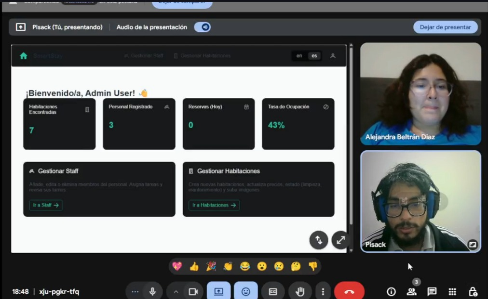

**URL del video:** 

[https://shorturl.at/7UPcY](https://upcedupe-my.sharepoint.com/:v:/g/personal/u20191c464_upc_edu_pe/IQAWKRdlP0wrTrxrWyH1YpxUAQgX4tukkfWsGlrNkWzDV7g?e=mV81At&nav=eyJyZWZlcnJhbEluZm8iOnsicmVmZXJyYWxBcHAiOiJTdHJlYW1XZWJBcHAiLCJyZWZlcnJhbFZpZXciOiJTaGFyZURpYWxvZy1MaW5rIiwicmVmZXJyYWxBcHBQbGF0Zm9ybSI6IldlYiIsInJlZmVycmFsTW9kZSI6InZpZXcifX0%3D)
**Resumen de la entrevista** 

El entrevistado considera que la aplicación es práctica, clara y fácil de usar. Sugiere agregar más detalles del huésped, como el estado completo de pagos, y la posibilidad de ver reservas pasadas y futuras. Cree que, con esas funciones, la implementaría sin dudas. Está dispuesto a pagar hasta 120 soles mensuales y usaría la herramienta con gusto una vez esté completa.

---

#### Entrevista 2

Datos del entrevistado:

**Nombre completo:** Adrian Nicholaiv Saavedra Angulo 

**Edad:** 34

**Ciudad:** Tarapoto

**Duración:**  8:37 minutos

**Evidencia:** 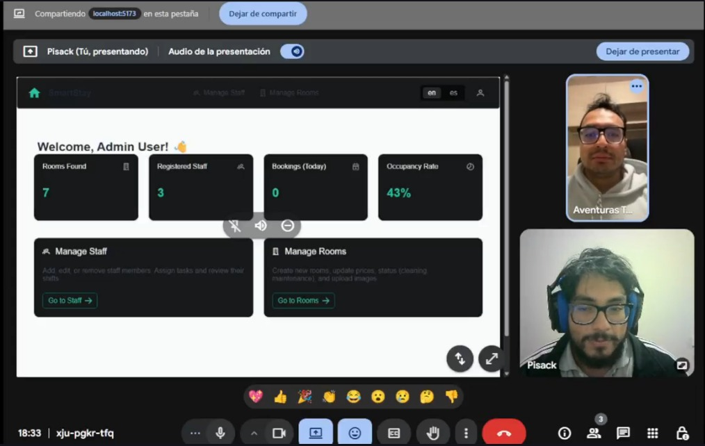

**URL del video:** 
[https://shorturl.at/7UPcY](https://upcedupe-my.sharepoint.com/:v:/g/personal/u20191c464_upc_edu_pe/IQAjqYO1yBXEQLgqecYAWIroAdXaCEo-q3_ooN9jxKAo1nI?e=LV5AoW&nav=eyJyZWZlcnJhbEluZm8iOnsicmVmZXJyYWxBcHAiOiJTdHJlYW1XZWJBcHAiLCJyZWZlcnJhbFZpZXciOiJTaGFyZURpYWxvZy1MaW5rIiwicmVmZXJyYWxBcHBQbGF0Zm9ybSI6IldlYiIsInJlZmVycmFsTW9kZSI6InZpZXcifX0%3D)

**Resumen de la entrevista**
Adrián considera que la aplicación es práctica y fácil de usar, y cree que su equipo podría adaptarse sin problema. Sugiere añadir información detallada del huésped, como estado de pago, monto pendiente, historial de reservas, preferencias alimenticias o restricciones. Ve importante poder consultar todas las reservas, pasadas y futuras. Está dispuesto a pagar hasta 100 soles, aunque tendría dudas si el precio fuera elevado. Una vez terminada la herramienta con estas funciones, afirma que la usaría sin dudar.

---

### Entrevista – Segmento 2: Huéspedes de Hoteles Boutique

---

#### Entrevista 1

Datos del entrevistado:

**Nombre completo:** Vanessa Choy Robles

**Edad:** 25 años

**Distrito:** Jesus María – Lima Metropolitana

**Duración:** 04:05 minutos

**Evidencia:** 

**URL del video:** [https://shorturl.at/7UPcY](https://drive.google.com/file/d/1whr93eI_f3YJgqxVULE7BqRw50qBHzoJ/view?usp=sharing)

**Resumen de la entrevista**

La usuaria tuvo una impresión muy positiva de la aplicación, resaltando que es clara, sencilla e intuitiva. Consideró útiles los filtros para elegir habitaciones y mencionó que, aunque la app tiene lo esencial, sería útil agregar servicios del hotel. Percibe que la experiencia digital haría su estadía más cómoda y valora especialmente la simplicidad de la interfaz, aunque le preocupa que puedan ocurrir fallos al procesar reservas o pagos. Prefiere interacción humana solo en casos específicos y estaría dispuesta a pagar unos 25 soles más por esta experiencia. Como mejoras, sugiere incluir check-in y check-out digitales y aclarar mejor la parte de pagos, que fue lo menos comprendido durante la demostración.

---

## 5.3.3. Evaluaciones según heurísticas.

**UX Heuristics & Principles Evaluation**

**Usability – Inclusive Design – Information Architecture**

- **CARRERA:** Ingeniería de Software  
- **CURSO:** Aplicaciones Web  
- **SECCIÓN:** 7454  
- **PROFESORES:** Todos  
- **AUDITOR:** Equipo SmartStay  
- **CLIENTE(S):** Administradores de Hoteles Boutique y Pequeños / Huéspedes de Hoteles  

**SITE o APP A EVALUAR:**

Smart Stay

**TAREAS A EVALUAR:**

El alcance de esta evaluación incluye la revisión de la usabilidad de las siguientes tareas:

1. Gestionar reservas y visualizar historial completo (Administradores)
2. Acceder a información detallada del huésped (pagos, preferencias) (Administradores)
3. Realizar reservas de habitaciones (Huéspedes)
4. Proceso de pago de reservas (Huéspedes)
5. Acceder a información de servicios del hotel (Huéspedes)

No están incluidas en esta versión de la evaluación las siguientes tareas:

1. Control de habitación desde app (llaves digitales, temperatura, Wi-Fi)
2. Integración con marketplaces globales
3. Funcionalidades avanzadas de personalización
4. Check-in y check-out digital

**ESCALA DE SEVERIDAD:**

Los errores serán puntuados tomando en cuenta la siguiente escala de severidad

| Nivel | Descripción |
|-------|-------------|
| **1** | Problema superficial: puede ser fácilmente superado por el usuario o ocurre con muy poca frecuencia. No necesita ser arreglado a no ser que exista disponibilidad de tiempo. |
| **2** | Problema menor: puede ocurrir un poco más frecuentemente o es un poco más difícil de superar para el usuario. Se le debería asignar una prioridad baja resolverlo de cara al siguiente release. |
| **3** | Problema mayor: ocurre frecuentemente o los usuarios no son capaces de resolverlos. Es importante que sean corregidos y se les debe asignar una prioridad alta. |
| **4** | Problema muy grave: un error de gran impacto que impide al usuario continuar con el uso de la herramienta. Es imperativo que sea corregido antes del lanzamiento. |

**TABLA RESUMEN:**

| # | Problema | Escala de severidad | Heurística/Principio violada(o) |
|---|----------|---------------------|----------------------------------|
| 1 | Falta información detallada del huésped (pagos, preferencias, restricciones). | 3 | Usability: Visibilidad del estado del sistema |
| 2 | No se visualizan reservas pasadas y futuras claramente. | 3 | Usability: Reconocimiento antes que recuerdo |
| 3 | Proceso de pago poco claro durante la demostración. | 3 | Usability: Coincidencia entre el sistema y el mundo real |
| 4 | Falta información sobre servicios del hotel disponibles. | 2 | Information Architecture: Is it findable? |
| 5 | Ausencia de funcionalidades de check-in y check-out digital. | 2 | Usability: Flexibilidad y eficiencia de uso |
| 6 | Preocupación por fallos al procesar reservas o pagos sin retroalimentación clara. | 3 | Usability: Prevención de errores y retroalimentación |

**DESCRIPCIÓN DE PROBLEMAS:**

**PROBLEMA #1: Falta información detallada del huésped (pagos, preferencias, restricciones)**

**Severidad:** 3

**Heurística violada:** Usability - Visibilidad del estado del sistema

**Problema:**

Los administradores no pueden acceder a información completa del huésped, incluyendo estado de pagos, montos pendientes, preferencias alimenticias y restricciones. Durante las entrevistas, ambos administradores (Alejandra y Adrián) mencionaron la necesidad de ver más detalles del huésped, estado de pago y monto pendiente para una gestión eficiente.

**Recomendación:**

Implementar un perfil completo del huésped con secciones claras para: estado de pagos, historial de transacciones, preferencias, restricciones alimenticias y notas importantes. Incluir un dashboard que muestre un resumen visual del estado del huésped.

---

**PROBLEMA #2: No se visualizan reservas pasadas y futuras claramente**

**Severidad:** 3

**Heurística violada:** Usability - Reconocimiento antes que recuerdo

**Problema:**

No existe una vista clara que permita visualizar reservas pasadas y futuras de manera organizada. Los administradores necesitan poder consultar todas las reservas para una gestión eficiente, pero actualmente no tienen acceso a esta información de forma clara y organizada.

**Recomendación:**

Crear un calendario o vista de lista con filtros temporales (pasadas, actuales, futuras) y opciones de búsqueda por huésped, fecha o estado. Implementar una vista de calendario mensual con indicadores visuales de ocupación.

---

**PROBLEMA #3: Proceso de pago poco claro durante la demostración**

**Severidad:** 3

**Heurística violada:** Usability - Coincidencia entre el sistema y el mundo real

**Problema:**

El proceso de pago no está claramente explicado durante la demostración, generando confusión sobre los pasos a seguir. La entrevistada Vanessa mencionó que "la parte de pagos fue lo menos comprendido durante la demostración" y sugiere "aclarar mejor la parte de pagos".

**Recomendación:**

Implementar un flujo de pago paso a paso con indicadores visuales claros (paso 1 de 3), resumen de la reserva antes del pago, y mensajes de confirmación después de cada acción. Incluir tooltips o ayuda contextual en cada paso del proceso.

---

**PROBLEMA #4: Falta información sobre servicios del hotel disponibles**

**Severidad:** 2

**Heurística violada:** Information Architecture - Is it findable?

**Problema:**

Falta información visible sobre servicios del hotel disponibles para el huésped. La entrevistada mencionó que "sería útil agregar servicios del hotel" y que "la app tiene lo esencial", indicando que esta información es importante pero no está disponible.

**Recomendación:**

Crear una sección dedicada de servicios del hotel con iconos claros, descripciones y disponibilidad. Incluir esta información en la vista de reserva confirmada y en el dashboard del huésped.

---

**PROBLEMA #5: Ausencia de funcionalidades de check-in y check-out digital**

**Severidad:** 2

**Heurística violada:** Usability - Flexibilidad y eficiencia de uso

**Problema:**

Ausencia de funcionalidades de check-in y check-out digital mencionadas como deseables por los usuarios. La entrevistada sugirió "incluir check-in y check-out digitales" como mejora para la experiencia del huésped.

**Recomendación:**

Implementar flujos de check-in y check-out digital con guías paso a paso, confirmaciones visuales y opción de contacto con recepción si es necesario. Incluir validación de documentos y confirmación de llegada.

---

**PROBLEMA #6: Preocupación por fallos al procesar reservas o pagos sin retroalimentación clara**

**Severidad:** 3

**Heurística violada:** Usability - Prevención de errores y retroalimentación

**Problema:**

Preocupación sobre posibles fallos al procesar reservas o pagos sin retroalimentación clara del sistema. La entrevistada mencionó que "le preocupa que puedan ocurrir fallos al procesar reservas o pagos", lo que genera desconfianza en el sistema.

**Recomendación:**

Implementar mensajes de confirmación claros después de cada acción crítica (reserva creada, pago procesado), validaciones en tiempo real antes de enviar formularios, y mensajes de error descriptivos con sugerencias de solución. Agregar un sistema de notificaciones que confirme cada paso del proceso. 

## 5.4. Video About-the-Product.

El Video About-the-Product de Smart Stay está dirigido a dos públicos principales: los visitantes del Landing Page que desean conocer el modelo de negocio y las características principales de la plataforma, y los usuarios de las aplicaciones que necesitan realizar tareas relacionadas con los procesos soportados por la solución.

Este video presenta de manera clara y concisa las funcionalidades clave de Smart Stay, incluyendo la gestión de reservas para administradores de hoteles boutique y la experiencia de reserva y pago para huéspedes. El tono utilizado es profesional y accesible, alineado con la identidad visual y comunicacional de la plataforma.

### Contenido del Video

El video incluye:

- **Modelo de negocio:** Explicación de cómo Smart Stay ayuda a los hoteles boutique a gestionar sus operaciones de manera eficiente.
- **Características principales:** Demostración de las funcionalidades core de la plataforma para administradores y huéspedes.
- **Procesos soportados:** Flujos de trabajo para gestión de reservas, información de huéspedes, proceso de pago y acceso a servicios del hotel.
- **Experiencia de usuario:** Visualización de la interfaz y navegación de la aplicación.

### Testimonio de Usuario

Durante las sesiones de validación, los usuarios expresaron opiniones positivas sobre la plataforma. A continuación, un testimonio destacado:

> *"La aplicación es práctica, clara y fácil de usar. Creo que mi equipo podría adaptarse sin problema. Una vez terminada la herramienta con las funciones sugeridas, la usaría sin dudar."*  
> **— Adrián Nicholaiv Saavedra Angulo, Administrador de Hotel (34 años, Tarapoto)**

### Metadatos del Video

**Screenshot del Video:**

**URL de Microsoft Stream:**

[//PEGAR AQUI EL URL DE MICROSOFT STREAM//]

**URL de YouTube (para incrustar en Landing Page):**

[//PEGAR AQUI EL URL DE YOUTUBE//]

**Duración del Video:**

[//PEGAR AQUI LA DURACION DEL VIDEO (ej: 5:30 minutos)//]

---

## Conclusiones

A lo largo del desarrollo del proyecto Smart Stay, se lograron avances significativos en la implementación de una solución integral para la gestión de hoteles boutique. El trabajo realizado durante los tres sprints permitió consolidar tanto el frontend como el backend de la plataforma, siguiendo principios de Domain-Driven Design y arquitectura por bounded contexts.

### Logros Principales

Durante el **Sprint 3**, el equipo se enfocó en el desarrollo del Backend API REST, implementando los bounded contexts core del negocio: Accommodations, Bookings y Payments. Se estableció una base sólida con  Entity Framework Core y MySQL, proporcionando una API RESTful documentada con Swagger/OpenAPI que permite la integración con el frontend y futuras expansiones.

La mejora de las User Stories y Technical Stories fue un logro importante, eliminando referencias a elementos de UI y estructurando las Technical Stories con formato API REST, lo que facilitará la integración y el desarrollo futuro.

### Validación con Usuarios

Las sesiones de validación con administradores de hoteles y huéspedes proporcionaron retroalimentación valiosa. Los usuarios destacaron la claridad y facilidad de uso de la aplicación, aunque identificaron áreas de mejora importantes como la necesidad de información más detallada del huésped, visualización de reservas pasadas y futuras, y clarificación del proceso de pago.

### Desafíos y Aprendizajes

El proyecto enfrentó desafíos relacionados con el tiempo disponible y la experiencia técnica del equipo. Sin embargo, estos desafíos se convirtieron en oportunidades de aprendizaje, permitiendo al equipo desarrollar habilidades en arquitectura de software, desarrollo de APIs REST, y trabajo colaborativo mediante herramientas como GitHub y Trello.

### Próximos Pasos

Para futuros sprints, se recomienda implementar los bounded contexts de IAM y Profile, mejorar la retroalimentación del sistema en procesos críticos, y agregar funcionalidades solicitadas por los usuarios como check-in/check-out digital y sección de servicios del hotel. La base establecida en este sprint proporciona una plataforma sólida para estas expansiones.

---

## Bibliografía

### Documentación Técnica

- Microsoft. (2024). *ASP.NET Core Documentation*. Recuperado de https://learn.microsoft.com/en-us/aspnet/core/

- Microsoft. (2024). *Entity Framework Core Documentation*. Recuperado de https://learn.microsoft.com/en-us/ef/core/

- Oracle Corporation. (2024). *MySQL Documentation*. Recuperado de https://dev.mysql.com/doc/

- Swagger. (2024). *OpenAPI Specification*. Recuperado de https://swagger.io/specification/

### Arquitectura y Diseño

- Evans, E. (2003). *Domain-Driven Design: Tackling Complexity in the Heart of Software*. Addison-Wesley Professional.

- Martin, R. C. (2017). *Clean Architecture: A Craftsman's Guide to Software Structure and Design*. Prentice Hall.

### Metodologías Ágiles

- Schwaber, K., & Sutherland, J. (2020). *The Scrum Guide*. Recuperado de https://scrumguides.org/

- Cohn, M. (2004). *User Stories Applied: For Agile Software Development*. Addison-Wesley Professional.

### Usabilidad y Experiencia de Usuario

- Nielsen, J. (1994). *Usability Engineering*. Morgan Kaufmann.

- Norman, D. (2013). *The Design of Everyday Things: Revised and Expanded Edition*. Basic Books.

- W3C. (2021). *Web Content Accessibility Guidelines (WCAG) 2.1*. Recuperado de https://www.w3.org/WAI/WCAG21/quickref/

### Herramientas y Plataformas

- GitHub. (2024). *GitHub Documentation*. Recuperado de https://docs.github.com/

- Render. (2024). *Render Documentation*. Recuperado de https://render.com/docs

- React. (2024). *React Documentation*. Recuperado de https://react.dev/
