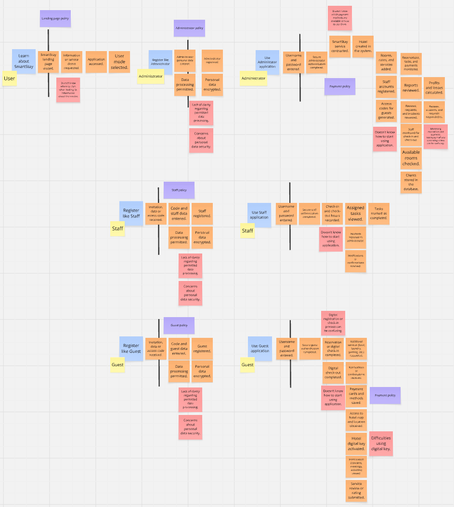

# Universidad Peruana de Ciencias Aplicadas
## Carrera: Ingeniería de Software
## Ciclo: 2025 - 2

## Curso: 1ASI0730 - Aplicaciones Web
## NRC: 7454
## Profesor: Angel Augusto Velasquez Nuñez

# Informe de Trabajo Final
## Startup: Edgerunners
## Producto: Smart Stay

|   Código   |   Apellidos      |     Nombres     |
|:----------:|:----------------:|:---------------:|
| U20221E617 | Verona Flores    | Italo Sebastian |
| U20231A816 |Valverde Portuguez|  Natalia Ximena |
| U202019498 |Fernandez Garfias |  Alexander Piero |
|            |                  |                 |
|            |                  |                 |

**Mes y Año:** Septiembre 2025

## Registro de Versiones del Informe

El objetivo de esta sección es resumir las modificaciones relevantes que se realizan al informe durante el ciclo de vida del proyecto.  
Esta sección inicia en una página nueva e incluye un cuadro con la siguiente estructura:

| Versión |   Fecha    |                 Autor                 |                 Descripción de los Cambios                  |
|:-------:|:----------:|:-------------------------------------:|:-----------------------------------------------------------:|
|   1.0   | 01/09/2025 | Jose Jhonatan Saavedra Angulo (Líder) |                                                             |
|   1.0   | 01/09/2025 |     Italo Sebastian Verona Flores     | Creación del documento inicial del Informe de Trabajo Final |

## Project Report Collaboration Insights

- URL del repositorio para el Project Report:

<!-- \-\- Enlace pendiente de agregar por el equipo y capturas sobre el avance en el git hub. \-\- -->

## Contenido

- [Capítulo I: Introducción](#capítulo-i-introducción)
    - [1.1. Startup Profile](#11-startup-profile)
        - [1.1.1. Descripción de la Startup](#111-descripción-de-la-startup)
        - [1.1.2. Perfiles de integrantes del equipo](#112-perfiles-de-integrantes-del-equipo)
    - [1.2. Solution Profile](#12-solution-profile)
        - [1.2.1. Antecedentes y problemática](#121-antecedentes-y-problemática)
        - [1.2.2. Lean UX Process](#122-lean-ux-process)
            - [1.2.2.1. Lean UX Problem Statements](#1221-lean-ux-problem-statements)
            - [1.2.2.2. Lean UX Assumptions](#1222-lean-ux-assumptions)
            - [1.2.2.3. Lean UX Hypothesis Statements](#1223-lean-ux-hypothesis-statements)
            - [1.2.2.4. Lean UX Canvas](#1224-lean-ux-canvas)
    - [1.3. Segmentos objetivo](#13-segmentos-objetivo)

- [Capítulo II: Requirements Elicitation & Analysis](#capítulo-ii-requirements-elicitation--analysis)
    - [2.1. Competidores](#21-competidores)
        - [2.1.1. Análisis competitivo](#211-análisis-competitivo)
        - [2.1.2. Estrategias y tácticas frente a competidores](#212-estrategias-y-tácticas-frente-a-competidores)
    - [2.2. Entrevistas](#22-entrevistas)
        - [2.2.1. Diseño de entrevistas](#221-diseño-de-entrevistas)
        - [2.2.2. Registro de entrevistas](#222-registro-de-entrevistas)
        - [2.2.3. Análisis de entrevistas](#223-análisis-de-entrevistas)
    - [2.3. Needfinding](#23-needfinding)
        - [2.3.1. User Personas](#231-user-personas)
        - [2.3.2. User Task Matrix](#232-user-task-matrix)
        - [2.3.3. User Journey Mapping](#233-user-journey-mapping)
        - [2.3.4. Empathy Mapping](#234-empathy-mapping)
    - [2.4. Big Picture EventStorming](#24-big-picture-eventstorming)
    - [2.5. Ubiquitous Language](#25-ubiquitous-language)

- [Capítulo III: Requirements Specification](#capítulo-iii-requirements-specification)
    - [3.1. User Stories](#31-user-stories)
    - [3.2. Impact Mapping](#32-impact-mapping)
    - [3.3. Product Backlog](#33-product-backlog)

- [Capítulo IV: Product Design](#capítulo-iv-product-design)
    - [4.1. Style Guidelines](#41-style-guidelines)
        - [4.1.1. General Style Guidelines](#411-general-style-guidelines)
        - [4.1.2. Web Style Guidelines](#412-web-style-guidelines)
    - [4.2. Information Architecture](#42-information-architecture)
        - [4.2.1. Organization Systems](#421-organization-systems)
        - [4.2.2. Labeling Systems](#422-labeling-systems)
        - [4.2.3. SEO Tags and Meta Tags](#423-seo-tags-and-meta-tags)
        - [4.2.4. Searching Systems](#424-searching-systems)
        - [4.2.5. Navigation Systems](#425-navigation-systems)
    - [4.3. Landing Page UI Design](#43-landing-page-ui-design)
        - [4.3.1. Landing Page Wireframe](#431-landing-page-wireframe)
        - [4.3.2. Landing Page Mock-up](#432-landing-page-mock-up)
    - [4.4. Web Applications UX/UI Design](#44-web-applications-uxui-design)
        - [4.4.1. Web Applications Wireframes](#441-web-applications-wireframes)
        - [4.4.2. Web Applications Wireflow Diagrams](#442-web-applications-wireflow-diagrams)
        - [4.4.3. Web Applications Mock-ups](#443-web-applications-mock-ups)
        - [4.4.4. Web Applications User Flow Diagrams](#444-web-applications-user-flow-diagrams)
    - [4.5. Web Applications Prototyping](#45-web-applications-prototyping)
    - [4.6. Domain-Driven Software Architecture](#46-domain-driven-software-architecture)
        - [4.6.1. Design-Level EventStorming](#461-design-level-eventstorming)
        - [4.6.2. Software Architecture Context Diagram](#462-software-architecture-context-diagram)
        - [4.6.3. Software Architecture Container Diagrams](#463-software-architecture-container-diagrams)
        - [4.6.4. Software Architecture Components Diagrams](#464-software-architecture-components-diagrams)
    - [4.7. Software Object-Oriented Design](#47-software-object-oriented-design)
        - [4.7.1. Class Diagrams](#471-class-diagrams)
    - [4.8. Database Design](#48-database-design)
        - [4.8.1. Database Diagrams](#481-database-diagrams)

- [Capítulo V: Product Implementation, Validation & Deployment](#capítulo-v-product-implementation-validation--deployment)
    - [5.1. Software Configuration Management](#51-software-configuration-management)
        - [5.1.1. Software Development Environment Configuration](#511-software-development-environment-configuration)
        - [5.1.2. Source Code Management](#512-source-code-management)
        - [5.1.3. Source Code Style Guide & Conventions](#513-source-code-style-guide--conventions)
        - [5.1.4. Software Deployment Configuration](#514-software-deployment-configuration)
    - [5.2. Landing Page, Services & Applications Implementation](#52-landing-page-services--applications-implementation)
        - [5.2.1. Sprint n](#521-sprint-n)
            - [5.2.1. Sprint Planning n](#5211-sprint-planning-n)
            - [5.2.1.2. Aspect Leaders and Collaborators](#5212-aspect-leaders-and-collaborators)
            - [5.2.1.3. Sprint Backlog n](#5213-sprint-backlog-n)
            - [5.2.1.4. Development Evidence for Sprint Review](#5214-development-evidence-for-sprint-review)
            - [5.2.1.5. Execution Evidence for Sprint Review](#5215-execution-evidence-for-sprint-review)
            - [5.2.1.6. Services Documentation Evidence for Sprint Review](#5216-services-documentation-evidence-for-sprint-review)
            - [5.2.1.7. Software Deployment Evidence for Sprint Review](#5217-software-deployment-evidence-for-sprint-review)
            - [5.2.1.8. Team Collaboration Insights during Sprint](#5218-team-collaboration-insights-during-sprint)

- [Conclusiones y Recomendaciones](#conclusiones-y-recomendaciones)
- [Bibliografía y Referencias](#bibliografía-y-referencias)

## Student Outcome

El curso contribuye al cumplimiento del Student Outcome ABET:

### ABET – EAC - Student Outcome 5

Criterio: La capacidad de funcionar efectivamente en un equipo cuyos miembros juntos proporcionan liderazgo, crean un entorno de colaboración e inclusivo, establecen objetivos, planifican tareas y cumplen objetivos. 

En el siguiente cuadro se describe las acciones realizadas y enunciados de conclusiones por parte del grupo, que permiten sustentar el haber alcanzado el logro del ABET – EAC - Student Outcome 5

| Criterio específico                                                                                | Acciones realizadas                                                                                                                                                                                                                                                                                                                                                                                                                                               | Conclusiones                                                                                                                                          |
|----------------------------------------------------------------------------------------------------|-------------------------------------------------------------------------------------------------------------------------------------------------------------------------------------------------------------------------------------------------------------------------------------------------------------------------------------------------------------------------------------------------------------------------------------------------------------------|-------------------------------------------------------------------------------------------------------------------------------------------------------|
| **Trabaja en equipo para proporcionar liderazgo en forma conjunta**                                | **Italo Sebastian Verona Flores** *TB1* Colocar que hiciste en la TB1 (Acciones realizadas)  **Integrante 2** *TB1* Colocar que hiciste en la TB1 (Acciones realizadas)  **Integrante 3** *TB1* Colocar que hiciste en la TB1 (Acciones realizadas)  **Integrante 4** *TB1* Colocar que hiciste en la TB1 (Acciones realizadas)  **Integrante 5** *TB1* Colocar que hiciste en la TB1 (Acciones realizadas) | *TB1* • [Colocar conclusiones del equipo para TB1] • [Colocar conclusiones del equipo para TB1] • [Colocar conclusiones del equipo para TB1] |
| **Crea un entorno colaborativo e inclusivo, establece metas, planifica tareas y cumple objetivos** | **Italo Sebastian Verona Flores** *TB1* Colocar que hiciste en la TB1 (Acciones realizadas)  **Integrante 2** *TB1* Colocar que hiciste en la TB1 (Acciones realizadas)  **Integrante 3** *TB1* Colocar que hiciste en la TB1 (Acciones realizadas)  **Integrante 4** *TB1* Colocar que hiciste en la TB1 (Acciones realizadas)  **Integrante 5** *TB1* Colocar que hiciste en la TB1 (Acciones realizadas) | *TB1* • [Colocar conclusiones del equipo para TB1] • [Colocar conclusiones del equipo para TB1] • [Colocar conclusiones del equipo para TB1] |

# **Capítulo II: Requirements Elicitation & Analysis**

## 2.1. Competidores.

El mercado de soluciones para gestión hotelera en Lima y a nivel nacional presenta diversos actores que ofrecen herramientas digitales, sistemas tracionales de gestión y, en menor medida, plataformas integradas con IoT. Se identificaron los principales competidores:

#### 2.1.1 Análisis Competitivo.

El análisis competitivo permite identificar las fortalezas, debilidades y estrategias de los principales actores del mercado en comparación con la propuesta de **Smart Stay**.  

### Matriz comparativa de competidores

<table border="1" cellspacing="0" cellpadding="6" style="width:100%; border-collapse: collapse;">
  <tr>
    <td colspan="2"><b>¿Por qué llevar a cabo este análisis?</b></td>
    <td colspan="4">Este análisis permite identificar las fortalezas y debilidades de nuestra startup (Smart Stay) frente a los principales arquetipos de competidores, revelando oportunidades clave y amenazas potenciales para definir una propuesta de valor única y una estrategia sólida.</td>
  </tr>

  <tr>
<th colspan="2">Competidores</th>
<th>Smart Stay 

</th>
<th>
Oracle Hospitality 

</th>
<th>
Room Raccoon 

</th>
<th>
Sistemas Manuales 

</th>

  </tr>

  <tr>
    <th rowspan="2" style="writing-mode: vertical-rl; text-orientation: mixed; text-align:center;">Perfil</th>
    <td><b>Overview</b></td>
    <td>Plataforma integral de gestión hotelera con enfoque en hoteles boutique y medianos, incorporando IoT y personalización del huésped.</td>
    <td>Soluciones globales y completas (PMS/OPERA) para gestión de grandes cadenas hoteleras.</td>
    <td>SaaS en la nube todo-en-uno (PMS, Channel Manager, Motor de Reservas) intuitivo, orientado a hoteles pequeños e independientes.</td>
    <td>Sistemas tradicionales que usan Excel, papel y lápiz. Procesos 100% manuales.</td>
  </tr>
  <tr>
    <td><b>Ventaja competitiva</b> ¿qué valor ofrece a los clientes?</td>
    <td>Accesibilidad, personalización profunda de la experiencia del huésped mediante IoT, y un enfoque especializado en el mercado LATAM.</td>
    <td>Reconocimiento global, robustez, soluciones integrales y confiabilidad para operaciones a gran escala.</td>
    <td>Extrema facilidad de uso, rápida implementación y un soporte al cliente muy valorado. Todo en uno para el hotelero independiente.</td>
    <td>Costo casi nulo y flexibilidad total al no depender de ningún software.</td>
  </tr>

  <tr>
    <th rowspan="2" style="writing-mode: vertical-rl; text-orientation: mixed; text-align:center;">Perfil de Marketing</th>
    <td><b>Mercado objetivo</b></td>
    <td>Hoteles boutique, medianos y en crecimiento en LATAM que buscan diferenciarse.</td>
    <td>Grandes cadenas hoteleras globales y resorts de lujo con operaciones complejas.</td>
    <td>Hoteles pequeños, hostales, B&Bs y apartamentos turísticos.</td>
    <td>Hoteles muy pequeños o de baja tecnología que no han iniciado su digitalización.</td>
  </tr>
  <tr>
    <td><b>Estrategias de marketing</b></td>
    <td>Marketing de contenidos enfocado en modernización, diferenciación por IoT y experiencia del huésped. Pilotos en LATAM.</td>
    <td>Ventas corporativas B2B, branding global y posicionamiento como el estándar de la industria.</td>
    <td>Marketing digital (SEO, SEM) enfocado en facilidad de uso y buen soporte. Altas calificaciones en sitios de reseñas.</td>
    <td>Inexistente. Adopción por necesidad o falta de alternativas conocidas.</td>
  </tr>

  <tr>
    <th rowspan="3" style="writing-mode: vertical-rl; text-orientation: mixed; text-align:center;">Perfil de Producto</th>
    <td><b>Productos & Servicios</b></td>
    <td>PMS, Channel Manager, Motor de Reservas, App para huéspedes con control IoT (luces, temp), reportes analíticos.</td>
    <td>Suite OPERA Cloud (PMS, Ventas y Catering, POS), reportes y analítica avanzada, integraciones.</td>
    <td>Plataforma todo-en-uno: PMS, Channel Manager, Motor de Reservas, Pagos, Housekeeping.</td>
    <td>Hojas de cálculo, libros de registro, calendarios de papel.</td>
  </tr>
  <tr>
    <td><b>Precios & Costos</b></td>
    <td>Modelo SaaS por suscripción mensual, probablemente escalado por número de habitaciones. Costo de hardware IoT inicial.</td>
    <td>Licenciamiento enterprise. Costos de implementación y mantenimiento muy elevados. Solo por cotización.</td>
    <td>Suscripción mensual transparente y pública, basada en el número de habitaciones. Muy accesible.</td>
    <td>Gratuito o el costo de una licencia de Office.</td>
  </tr>
  <tr>
    <td><b>Canales de distribución</b> (Web y/o Móvil)</td>
    <td>Plataforma web (Cloud) y aplicación móvil para huéspedes y staff.</td>
    <td>Aplicación web (Cloud) para el personal del hotel.</td>
    <td>Plataforma web (Cloud).</td>
    <td>Offline.</td>
  </tr>

  <tr>
    <th rowspan="4" style="writing-mode: vertical-rl; text-orientation: mixed; text-align:center;">Análisis SWOT</th>
    <td><b>Fortalezas</b></td>
    <td>Propuesta de valor única (IoT), enfoque en nicho desatendido (boutique LATAM), tecnología moderna.</td>
    <td>Marca líder, producto robusto y escalable, gran base de clientes cautiva.</td>
    <td>Fácil de usar, rápido de implementar, excelente soporte, precio transparente.</td>
    <td>Costo cero, simplicidad absoluta, sin necesidad de capacitación.</td>
  </tr>
  <tr>
    <td><b>Debilidades</b></td>
    <td>Marca nueva sin reputación, requiere instalación de hardware, necesidad de educar al mercado sobre IoT.</td>
    <td>Costo prohibitivo para pymes, implementación lenta y compleja, considerado poco innovador.</td>
    <td>Funcionalidades limitadas para hoteles grandes o con operaciones complejas.</td>
    <td>Ineficiente, propenso a errores, no escalable, sin conectividad online.</td>
  </tr>
  <tr>
    <td><b>Oportunidades</b></td>
    <td>Crecimiento del turismo en LATAM, demanda de experiencias personalizadas, adopción de "smart homes" extrapolable a hoteles.</td>
    <td>Migración de sus clientes on-premise a la nube, venta cruzada de nuevos módulos.</td>
    <td>Expandirse a mercados emergentes, añadir más integraciones de terceros.</td>
    <td>Ninguna. Es el punto de partida para la digitalización.</td>
  </tr>
  <tr>
    <td><b>Amenazas</b></td>
    <td>Grandes jugadores añadiendo módulos IoT, competidores SaaS más ágiles, lenta adopción tecnológica en el sector.</td>
    <td>Nuevos competidores SaaS ágiles y más económicos, ciberseguridad.</td>
    <td>Competencia intensa en el segmento de pymes, que un PMS más grande ofrezca una versión "lite".</td>
    <td>Cualquier software básico representa una amenaza existencial.</td>
  </tr>
</table>

#### 2.1.2  Estrategias y Tácticas frente a Competidores.

Para posicionarse de manera efectiva frente a los competidores,  **Smart Stay** implementará las siguientes estrategias: 

#### Estrategias

1. **Diferenciación Tecnológica**: Integrar gestión hotelera con IoT, algo que los competidores actuales no ofrecen de manera completa.
2. **Enfoque en nicho**: Dirigirse a hoteles boutique y pequeños (20-100 habitaciones), un segmento poco atendido por gigantes como Oracle o Amadeus.
3. **Modelo de suscripción accesible**: Precios escalables según número de habitaciones, permitiendo competir contra soluciones costosas sin sacrificar funcionalidad.
4. **Soporte local y en español**: Acompañamiento cercano que mejora la adopción frente a competidores extranjeros.
5. **Valor medible**: Promesa clara de reducción de costos operativos (10-20%)

#### Tácticas

- **Programa píloto** con hoteles boutique de lima para generar casos de éxito y testimonios.
- **Alianzas estratégicas** con gremios turísticos (ej. FEDECATUR) para acelerar la adopción.
- **Capacitación continua** para el personal hotelero, disminuyendo resistencia al cambio.
- **Marketing digital enfocado en ROI**: Mostrar comparativas de costos y beneficios frente a sistemas tracicionales
- **Integraciones rápidas** con PMS existentes para facilitar la migración y reduccir fricciones.
- **Atencion postventa 24/7** como ventaja competitiva sobre startups con soporte limitado. 

## 2.1. Entrevistas.
Con el objetivo de profundizar en las necesidades y expectativas de los segmentos objetivos, se realizaron entrevistas semiestructuradas a administradores de hoteles boutique y a huéspedes. Esta información cualitativa sirvió como base para identificar problemáticas actuales y orientar la definición de requisitos del sistema.

#### 2.1.2  Diseño de entrevistas

### Entrevista – Segmento 1: Administradores de Hoteles Boutique y Pequeños

1. ¿Cómo te llamas y qué cargo ocupas en el hotel?  
2. ¿En qué distrito o ciudad se encuentra el hotel?  
3. ¿Cuántas habitaciones y personal gestionan aproximadamente?  
4. ¿Podrías contarme cómo es un día típico de trabajo administrando el hotel?  
5. ¿Qué tan seguido deben gestionar procesos como reservas, check-in/check-out o facturación?  
6. ¿Cómo suelen organizar actualmente la gestión de reservas y pagos?  
7. ¿Han tenido dificultades con sobrerreservas, disponibilidad de habitaciones o errores de facturación?  
8. ¿Qué dispositivos usas con mayor frecuencia para gestionar el hotel?  
9. ¿Qué aplicaciones o sistemas usas actualmente en tu día a día para el manejo del hotel?  
10. ¿Has tenido alguna dificultad o experiencia negativa al usarlas?  
11. ¿Qué te motivaría a adoptar una nueva herramienta digital para centralizar reservas, pagos y tareas del personal?  
12. Si una herramienta digital lograra optimizar tus operaciones y reducir tus costos, ¿cómo valorarías invertir en una suscripción mensual para acceder a ella?  
13. ¿Cuáles son tus principales preocupaciones respecto a la gestión del hotel?

### Entrevista – Segmento 2: Huéspedes de Hoteles

1. ¿Cómo te llamas y con qué frecuencia viajas por turismo o trabajo?
2. ¿Qué tipo de hotel sueles elegir (boutique, cadena internacional, Airbnb, etc.) y por qué?
3. ¿Qué valoras más en un hotel: ubicación, precio, comodidad o servicios digitales?
4. ¿Cómo fue tu última experiencia de check-in y check-out? ¿Qué mejorarías?
5. ¿Qué tan importante es para ti poder personalizar tu habitación (temperatura, luz, limpieza, room service) desde tu celular u otro dispositivo tecnológico?
6. ¿Qué servicios digitales utilizas más durante tu estadía en un hotel (WiFi, app del hotel, WhatsApp, smart TV, llaves digitales)?
7. ¿Has tenido experiencias negativas con la gestión del hotel (esperas largas, problemas con el servicio, falta de personalización)?
8. ¿Qué opinas de un sistema que te permita hacer check-in sin pasar por recepción y controlar tu habitación desde una app?
9. ¿Estarías dispuesto a pagar un poco más por un hotel que ofrezca experiencias digitales y personalización avanzada? ¿Cuánto aproximadamente?
10. ¿Qué tanto influyen las reseñas digitales y la reputación online en tu decisión de reservar un hotel?
11. Si un hotel ofreciera un servicio totalmente digitalizado, ¿qué expectativa tendrías respecto al trato humano? ¿Lo consideras un valor agregado o no es necesario?
12. ¿Qué recomendarías para que la experiencia digital en un hotel sea cómoda y no complicada para los huéspedes?

### 2.2.2. Registro de entrevistas

### Entrevista – Segmento 1: Administradores de Hoteles Boutique y Pequeños

#### Entrevista 1

Datos del entrevistado:

**Nombre completo:** Adrian Saavedra Angulo 

**Edad:** 34 años

**Ciudad:** Tarapoto 

**Duración:** 8:07 minutos

**Evidencia:** 

**Resumen de la entrevista**

Adrián administra un hotel de 12 habitaciones en Tarapoto con un equipo de 6 personas. Su rutina diaria incluye revisar reservas, coordinar limpieza, organizar recojos y responder a nuevas solicitudes. Los procesos de reservas y facturación son constantes por el alto movimiento del negocio.
Aunque cuentan con un sistema propio, han tenido problemas de sobreventa porque no se sincroniza con todas las plataformas, lo que obliga a actualizaciones manuales y genera errores. Adrián estaría motivado a usar una herramienta que centralice la gestión y se integre con plataformas externas, siempre que el costo de suscripción sea razonable.

**URL del video:** [Entrevista Adrián Saavedra](https://upcedupe-my.sharepoint.com/:v:/g/personal/u20191c464_upc_edu_pe/ESyVWXpzLu5BntGjGocrfCQBzbC6LcTyvE1fJR1lpZgD7g?nav=eyJyZWZlcnJhbEluZm8iOnsicmVmZXJyYWxBcHAiOiJTdHJlYW1XZWJBcHAiLCJyZWZlcnJhbFZpZXciOiJTaGFyZURpYWxvZy1MaW5rIiwicmVmZXJyYWxBcHBQbGF0Zm9ybSI6IldlYiIsInJlZmVycmFsTW9kZSI6InZpZXcifX0%3D&e=croANB)

---

#### Entrevista 2

Datos del entrevistado:

**Nombre completo:** Monica Hernandez Vela 

**Edad:** 33 años

**Ciudad:** Tarapoto 

**Duración:** 5:53 minutos

**Evidencia:** 

**URL del video:** [Monica Hernandez Vela](https://upcedupe-my.sharepoint.com/:v:/g/personal/u20191c464_upc_edu_pe/EdqJPIq2kS1Jv-WFlDlGmQsBrYHjn4HfJhkJQcrdY9D9BQ?e=NfHBpW&nav=eyJyZWZlcnJhbEluZm8iOnsicmVmZXJyYWxBcHAiOiJTdHJlYW1XZWJBcHAiLCJyZWZlcnJhbFZpZXciOiJTaGFyZURpYWxvZy1MaW5rIiwicmVmZXJyYWxBcHBQbGF0Zm9ybSI6IldlYiIsInJlZmVycmFsTW9kZSI6InZpZXcifX0%3D)

**Resumen de la entrevista**

Mónica administra un hotel de 12 habitaciones en Tarapoto con un equipo de 4 personas. Su rutina diaria incluye organizar los desayunos, coordinar la limpieza, asignar habitaciones, atender a los turistas y revisar constantemente las reservas. Utiliza un sistema propio a través de la página web del hotel, gestionado principalmente desde laptops y computadoras, y se comunica con su personal mediante WhatsApp.
Ha tenido dificultades con el uso del sistema actual y señala que le motivaría adoptar una herramienta digital que centralice la gestión de reservas y operaciones, siempre que pueda adaptarse a las características de su hotel. Considera razonable pagar una suscripción mensual si contribuye a mejorar los servicios del establecimiento.

---

#### Entrevista 3

Datos del entrevistado:
**Nombre completo:** Alejandra Beltrán Diaz

**Edad:** 23 años

**Ciudad:** Tarapoto 

**Duración:** 4:11 minutos

**Evidencia:** 

**URL del video:** [Alejandra Beltrán Diaz](https://upcedupe-my.sharepoint.com/:v:/g/personal/u20191c464_upc_edu_pe/EafROYDObWhKpbd2D1HKOVYBNtkLrBMdElD0yQFrdCl0ZA?e=1qSp39&nav=eyJyZWZlcnJhbEluZm8iOnsicmVmZXJyYWxBcHAiOiJTdHJlYW1XZWJBcHAiLCJyZWZlcnJhbFZpZXciOiJTaGFyZURpYWxvZy1MaW5rIiwicmVmZXJyYWxBcHBQbGF0Zm9ybSI6IldlYiIsInJlZmVycmFsTW9kZSI6InZpZXcifX0%3D)

**Resumen de la entrevista**

Valeria Alejandra administra un hotel de 19 habitaciones junto a un equipo de 5 personas. Su día típico comienza organizando al personal de limpieza, revisando las reservas recibidas por WhatsApp y luego trasladándolas a un archivo Excel para llevar el control. Su principal herramienta es este archivo, aunque reconoce que no siempre guarda correctamente la información, lo que ha ocasionado problemas con reservas perdidas.
También ha tenido experiencias negativas con WhatsApp, ya que a veces resulta difícil ubicar las reservas registradas en la aplicación. Para ella, un sistema ideal de gestión debería incluir notificaciones automáticas que recuerden las reservas del día. Valeria considera que pagar una suscripción mensual sería una buena opción si la herramienta realmente simplifica las labores administrativas del hotel.

---

### Entrevista – Segmento 2: Huéspedes de Hoteles Boutique

#### Entrevista 1

Datos del entrevistado:

**Nombre completo:** Diego Michael Segura Martínez

**Edad:** 25 años

**Distrito:** Santa Anita – Lima Metropolitana

**Duración:** 5:34 minutos

**Evidencia:** 

**URL del video:** [Diego Michael Segura](https://upcedupe-my.sharepoint.com/:v:/g/personal/u202019498_upc_edu_pe/Ecu4CtT8NWxKgN-Lk8cgX0MB0LMVwWwuwQo6Bmx0fNUlCg?e=tbxK6m&nav=eyJyZWZlcnJhbEluZm8iOnsicmVmZXJyYWxBcHAiOiJTdHJlYW1XZWJBcHAiLCJyZWZlcnJhbFZpZXciOiJTaGFyZURpYWxvZy1MaW5rIiwicmVmZXJyYWxBcHBQbGF0Zm9ybSI6IldlYiIsInJlZmVycmFsTW9kZSI6InZpZXcifX0%3D)

**Resumen de la entrevista**

Diego suele hospedarse en hoteles cuando viaja, principalmente con su pareja y en menor medida con su familia. Prefiere hoteles cómodos, con privacidad y buena experiencia. Valora la comodidad y los servicios digitales que simplifiquen su estadía.
Su principal frustración son las esperas en recepción y la falta de personalización. Le atrae la idea de un sistema digital que permita check-in/check-out sin filas y control de la habitación desde el celular (luz, temperatura, room service).
Utiliza principalmente WiFi y Smart TV, pero estaría dispuesto a usar una app centralizada. Confía en las reseñas digitales para tomar decisiones y estaría dispuesto a pagar entre 10% y 15% más por un hotel con experiencias digitales avanzadas.
Considera que el trato humano sigue siendo un valor agregado, aunque la digitalización es clave. Recomienda que los sistemas sean fáciles de usar y que cada hotel cuente con una página clara con descripción completa y disponibilidad de habitaciones en tiempo real.

---

#### Entrevista 2

Datos del entrevistado:

**Nombre completo:** Juan Salcedo  

**Edad:** 44 años

**Distrito:** San Borja – Lima Metropolitana

**Duración:** 6:11 minutos

**Nombre:** Juan Salcedo  
**Edad:** 44 años  
**Distrito:** San Borja

**Evidencia:** 

**URL del video:** [https://shorturl.at/7UPcY](https://upcedupe-my.sharepoint.com/:v:/g/personal/u20221e617_upc_edu_pe/ERPriyAe3RlMlJHW2WouYN8BTLnggzX4JPIaQq2eElKZXQ?nav=eyJyZWZlcnJhbEluZm8iOnsicmVmZXJyYWxBcHAiOiJPbmVEcml2ZUZvckJ1c2luZXNzIiwicmVmZXJyYWxBcHBQbGF0Zm9ybSI6IldlYiIsInJlZmVycmFsTW9kZSI6InZpZXciLCJyZWZlcnJhbFZpZXciOiJNeUZpbGVzTGlua0NvcHkifX0&e=wfbeZY)  

**Resumen de la entrevista**

Juan viaja por trabajo cada 1-2 meses y prefiere alojamientos cómodos, autónomos y con buena conectividad, optando principalmente por Airbnb y, en menor medida, por hoteles. Valora especialmente la ubicación céntrica, el Wi-Fi de calidad y la facilidad tecnológica. Considera que los horarios estrictos de check-in y check-out son una gran limitación, y aunque nunca ha usado una habitación totalmente “smart”, le interesa la idea, aunque cree que aún no está bien implementada en Perú. No pagaría más por funciones digitales avanzadas, ya que las asocia con un público más joven. Usa Wi-Fi como servicio indispensable, junto con laptop y smartphone, y ha tenido experiencias negativas relacionadas con demoras en la atención y falta de limpieza, además de percibir una falta de personalización en el servicio. Recomienda priorizar la mejora del Wi-Fi (fibra óptica) y mantener una atención eficiente, considerando que la digitalización debe complementar, pero no reemplazar, el buen trato humano.

---

#### Entrevista 3

Datos del entrevistado:

**Nombre completo:** Tadeo Loja Beloglio 

**Edad:** 22 años

**Distrito:** Santiago de Surco – Lima Metropolitana

**Duración:** 7:21 minutos

**Evidencia:** 

**URL del video:** [Entrevista-3](https://upcedupe-my.sharepoint.com/:v:/g/personal/u20201f051_upc_edu_pe/EX5Eq-XT8MdGnWsqsTcHL7MBqeTy6xG91s4YoE9WcsRY_w?nav=eyJyZWZlcnJhbEluZm8iOnsicmVmZXJyYWxBcHAiOiJTdHJlYW1XZWJBcHAiLCJyZWZlcnJhbFZpZXciOiJTaGFyZURpYWxvZy1MaW5rIiwicmVmZXJyYWxBcHBQbGF0Zm9ybSI6IldlYiIsInJlZmVycmFsTW9kZSI6InZpZXcifX0%3D&e=0XZvvA)

**Resumen de la entrevista**

Tadeo viaja por turismo una vez al año y suele elegir hoteles de cadenas internacionales porque le ofrecen mayor confianza y calidad de servicio, aunque también considera opciones boutique si el precio es conveniente. Lo que más valora es el precio y la comodidad, seguido de la ubicación. Su última experiencia de check-in fue lenta, mientras que el check-out resultó rápido, por lo que cree que ambos procesos deberían digitalizarse.

No considera esencial la personalización de la habitación, pero sí cómodo poder controlar luz y temperatura desde el celular. Durante sus estadías utiliza principalmente el WiFi y la smart TV, y le gustaría contar con llaves digitales.

Entre los problemas que ha tenido destacan las largas esperas en recepción y la falta de coordinación en la limpieza. Considera muy práctico un sistema de check-in digital y control de la habitación mediante una app, y estaría dispuesto a pagar hasta un 5% más por ello siempre que mejore la experiencia.

Las reseñas digitales influyen en un 70% en su decisión de reserva. Para él, el trato humano sigue siendo un valor agregado incluso en un hotel digitalizado, y recomienda que la experiencia digital se concentre en una app única, sencilla y con asistencia rápida.

---
## Entrevista 4

Datos del entrevistado:

**Nombre completo:** Joaquin Fernandez

**Edad:** 21 años

**Distrito:** Santiago de Surco – Lima Metropolitana

**Duración:** 4:44 minutos

**Evidencia:** 

**Enlace al video en Microsoft Stream:** [Entrevista-4](https://upcedupe-my.sharepoint.com/:v:/g/personal/u20201f051_upc_edu_pe/EfHhd4ZVeqNEuji_fhRH2HABSjkFsOZnYobTIIqx-BN9nw?nav=eyJyZWZlcnJhbEluZm8iOnsicmVmZXJyYWxBcHAiOiJTdHJlYW1XZWJBcHAiLCJyZWZlcnJhbFZpZXciOiJTaGFyZURpYWxvZy1MaW5rIiwicmVmZXJyYWxBcHBQbGF0Zm9ybSI6IldlYiIsInJlZmVycmFsTW9kZSI6InZpZXcifX0%3D&e=eCsesR)  

**Resumen de la entrevista**

Joaquín viaja por turismo una vez al año y suele elegir hoteles sencillos o Airbnb por ser accesibles y prácticos, aunque también considera los boutique si el precio es conveniente. Lo que más valora es el precio y la comodidad, seguido de la ubicación.
Su última experiencia de check-in fue lenta, mientras que el check-out resultó rápido, por lo que cree que ambos procesos deberían digitalizarse. No considera esencial la personalización de la habitación, pero sí cómodo poder controlar luz
y temperatura desde el celular. Durante sus estadías utiliza principalmente el WiFi y la smart TV, y le gustaría contar con llaves digitales. Entre los problemas que ha tenido destacan las largas esperas en recepción y la falta de coordinación
en la limpieza. Considera muy práctico un sistema de check-in digital y control de la habitación mediante una app, y estaría dispuesto a pagar entre 5% y 10% más por ello siempre que mejore la experiencia. Las reseñas digitales influyen en un 70% en su decisión de reserva. Para él, el trato humano sigue siendo un valor agregado incluso en un hotel digitalizado, y recomienda que la experiencia digital se concentre en una app única, sencilla y con asistenciarápida.

---

### 2.2.2. Análisis de entrevistas

En esta sección se presenta un análisis detallado por cada segmento objetivo, identificando con sustento estadístico (porcentajes) todas las características objetivas y subjetivas que representan los aspectos más comunes de cada segmento, necesarios para la construcción de los arquetipos. La información se basa en las entrevistas registradas y sus respectivos resúmenes, respaldada por fuentes académicas y de la industria.

**Segmento 1: Administradores de Hoteles Boutique y Pequeños**

**Características Demográficas**

**Perfil de Edad y Ubicación**
Los administradores entrevistados presentan una edad promedio de **30.0 años**, con un rango que va desde los 23 hasta los 34 años. 

El **100%** de los entrevistados se ubican en Tarapoto, lo que indica una concentración geográfica específica en esta región turística del Perú. Este hallazgo se alinea con las tendencias nacionales, ya que según *Statista Market Forecast (2025)*, Peru ha experimentado un crecimiento significativo en el mercado hotelero, posicionándose como un actor clave en la industria hotelera latinoamericana.

**Características del Negocio**
Los hoteles administrados por este segmento tienen un tamaño promedio de **14.3 habitaciones**, con un rango que va desde 12 hasta 19 habitaciones, confirmando que se trata efectivamente de establecimientos boutique y pequeños. El equipo de trabajo promedio es de **5.0 personas**, variando entre 4 y 6 empleados, lo que refleja operaciones de escala reducida pero con estructura organizacional definida. Estas características coinciden con las tendencias identificadas por *Statista*, donde los viajeros en Perú buscan cada vez más experiencias únicas y auténticas, impulsando la demanda de hoteles boutique.

**Herramientas Tecnológicas Actuales**

**Diversidad de Sistemas**
El análisis revela una heterogeneidad en los sistemas utilizados:
- **66.7%** (2 de 3 administradores) utilizan sistemas propios desarrollados para sus hoteles.
- **33.3%** (1 de 3 administradores) depende de herramientas básicas como Excel y WhatsApp.

Esta distribución indica que, aunque la mayoría cuenta con algún nivel de digitalización, existe una brecha significativa en la sofisticación de las herramientas empleadas. Este panorama refleja los hallazgos de un estudio académico sobre barreras de adopción tecnológica en hoteles pequeños y medianos, donde se identificó que la falta de recursos financieros, conocimiento de TI y resistencia al cambio son las principales limitaciones.

**Problemas Identificados**

**Distribución Equitativa de Problemas**
Cada administrador enfrenta diferentes tipos de desafíos, con una distribución del **33.3%** para cada categoría:
- **Problemas de sincronización:** Adrián experimenta sobreventa debido a la falta de sincronización entre plataformas.
- **Dificultades operativas:** Mónica tiene complicaciones con el uso de su sistema actual.
- **Pérdida de información:** Alejandra sufre pérdidas de reservas por las limitaciones de sus herramientas básicas.

Estas problemáticas están documentadas en la literatura académica, donde se ha identificado que las organizaciones hoteleras pequeñas y medianas son más reluctantes a adoptar nuevas tecnologías de información que las más grandes, debido a la falta de entrenamiento, recursos financieros limitados y percepción de costos elevados.

**Actitud hacia Nueva Tecnología**

**Unanimidad en la Aceptación**
Los resultados muestran una receptividad completa hacia soluciones tecnológicas mejoradas:
- **100%** de los administradores expresan motivación para adoptar una nueva herramienta de gestión.
- **100%** están dispuestos a pagar una suscripción mensual, siempre que el costo sea razonable y justifique la mejora en la eficiencia operativa.

Esta disposición positiva contrasta con estudios previos pero se alinea con las tendencias post-pandemia. Según *Oracle Hospitality & Skift (2022)*, el **89%** de los ejecutivos hoteleros latinoamericanos afirmaron que la pandemia aceleró su adopción de tecnología hotelera, comparado con el 76% globalmente.

---

**Segmento 2: Huéspedes de Hoteles Boutique**

**Características Demográficas**

**Perfil Generacional**
Los huéspedes entrevistados tienen una edad promedio de **28.0 años**, con un rango de 21 a 44 años. El **75%** pertenece a la generación Millennial/Gen Z (menores de 26 años), lo que sugiere un segmento predominantemente joven y digitalmente nativo. Esta composición demográfica es especialmente relevante, ya que según *Hotel Tech Report (2025)*, los millennials son **57% más propensos** a ser influenciados por la tecnología hotelera.

**Patrones de Viaje y Preferencias Tecnológicas**

**Propósito y Frecuencia**
El análisis de los patrones de viaje revela:
- **75%** viaja por turismo (Diego, Tadeo, Joaquín).
- **25%** viaja por trabajo (Juan).
- **100%** mantiene una frecuencia regular de viaje (anual o cada 1-2 meses).

Las preferencias de esta generación están bien documentadas en la investigación de *Mews (2025)*, que indica que las estimaciones sugieren que los millennials representarán el **50%** de los huéspedes hoteleros en los próximos años, convirtiéndolos en críticos para los ingresos y el crecimiento de marca de los hoteles.

**Problemas Más Frecuentes y Expectativas Digitales**

**Consenso en Puntos de Dolor**
Los problemas identificados muestran patrones claros:
- **75%** experimenta esperas prolongadas en recepción como principal frustración.
- **25%** señala problemas con horarios estrictos de check-in/check-out.

Estos hallazgos se correlacionan directamente con estudios globales de la industria. Según *Oracle Hospitality & Skift (2022)*, el **65%** de los huéspedes desean que los hoteles ofrezcan tecnologías que minimicen el contacto con el personal y otros huéspedes. Además, el **43%** de los huéspedes de lujo esperan no hacer filas, según *Hotel Tech Report (2025)*.

**Actitud hacia la Digitalización**

**Alta Receptividad Tecnológica**
Los resultados demuestran una fuerte inclinación hacia soluciones digitales:
- **75%** muestra alto interés en digitalización de servicios hoteleros.
- **75%** está dispuesto a pagar un sobrecosto por experiencias digitales mejoradas.
- **100%** considera las reseñas digitales como factor influyente en sus decisiones.

- Estos datos se alinean con investigaciones globales que indican que el **74%** de los huéspedes esperan poder hacer en línea cualquier cosa que ya pueden hacer en persona o por teléfono. Además, el **48%** de los huéspedes considera las reseñas en línea como el factor principal para elegir un hotel.

**Disposición de Pago por Digitalización**
- **25%** pagaría entre 10-15% adicional.
- **50%** pagaría entre 5-10% adicional.
- **25%** no pagaría sobrecosto adicional.

La disposición a pagar por tecnología varía según la generación. Mientras que el **35%** de la Gen Z considera que la velocidad del Wi-Fi es más importante que la comodidad de la cama, los usuarios de mayor edad muestran menos disposición a pagar extra por funciones digitales avanzadas.

**Influencia de Reseñas Digitales**
- **50%** reporta alta influencia de reseñas (70% o más en su decisión).
- **100%** considera las reseñas como factor relevante en su proceso de selección.

Esta tendencia refleja datos globales donde las reseñas en línea han reemplazado el boca a boca tradicional, con los millennials consultando plataformas como TripAdvisor, Google y redes sociales antes de reservar.

---

## 2.3. Needfinding.

### 2.3.1. User Personas.

**Segmento 1 – Administradores de Hoteles Boutique y Pequeños en Lima**

 

**Segmento 2 – Huéspedes de Hoteles**

 

---
 
### 2.3.2. User Task Matrix

En esta sección se presenta el User Task Matrix, que concentra las tareas que los User Persona realizan para cumplir sus objetivos en la gestión hotelera y la experiencia de estadía. Las tareas descritas existen independientemente de cualquier solución de software. Se consideran dos segmentos con sus respectivos User Persona:

Administradores de Hoteles Boutique y Pequeños en Lima (User Persona: Administrador)

Huéspedes de Hoteles Boutique (User Persona: Huésped)

<table>
  <tr>
    <th rowspan="2">Tarea / Task</th>
    <th colspan="2">Administradores</th>
    <th colspan="2">Huéspedes</th>
  </tr>
  <tr>
    <th>Frecuencia</th>
    <th>Importancia</th>
    <th>Frecuencia</th>
    <th>Importancia</th>
  </tr>
  <tr>
    <td>Centralizar reservas en un único sistema</td>
    <td>Alta</td>
    <td>Alta</td>
    <td>Media</td>
    <td>Alta</td>
  </tr>
  <tr>
    <td>Evitar sobreventa por falta de sincronización</td>
    <td>Media</td>
    <td>Alta</td>
    <td>Baja</td>
    <td>Media</td>
  </tr>
  <tr>
    <td>Gestionar check-in/check-out (automatizado o rápido)</td>
    <td>Alta</td>
    <td>Alta</td>
    <td>Alta</td>
    <td>Alta</td>
  </tr>
  <tr>
    <td>Monitorear ocupación, tarifas y disponibilidad</td>
    <td>Alta</td>
    <td>Alta</td>
    <td>Media</td>
    <td>Media</td>
  </tr>
  <tr>
    <td>Generar reportes de operación y KPIs</td>
    <td>Media</td>
    <td>Alta</td>
    <td>Baja</td>
    <td>Media</td>
  </tr>
  <tr>
    <td>Gestionar pagos y facturación digital</td>
    <td>Media</td>
    <td>Alta</td>
    <td>Media</td>
    <td>Alta</td>
  </tr>
  <tr>
    <td>Coordinar housekeeping y mantenimiento</td>
    <td>Media</td>
    <td>Alta</td>
    <td>Baja</td>
    <td>Media</td>
  </tr>
  <tr>
    <td>Capacitar al equipo en nuevas herramientas</td>
    <td>Baja</td>
    <td>Media</td>
    <td>Baja</td>
    <td>Media</td>
  </tr>
  <tr>
    <td>Controlar costos operativos y presupuesto TI</td>
    <td>Media</td>
    <td>Alta</td>
    <td>Baja</td>
    <td>Media</td>
  </tr>
  <tr>
    <td>Integrar canales (OTAs, WhatsApp, Booking)</td>
    <td>Media</td>
    <td>Alta</td>
    <td>Media</td>
    <td>Alta</td>
  </tr>
  <tr>
    <td>Gestionar reseñas y reputación digital</td>
    <td>Media</td>
    <td>Alta</td>
    <td>Alta</td>
    <td>Alta</td>
  </tr>
  <tr>
    <td>Personalizar comunicación y upselling</td>
    <td>Media</td>
    <td>Media</td>
    <td>Media</td>
    <td>Alta</td>
  </tr>
  <tr>
    <td>Realizar reservas y pagos desde el móvil</td>
    <td>—</td>
    <td>—</td>
    <td>Alta</td>
    <td>Alta</td>
  </tr>
  <tr>
    <td>Realizar check-in sin contacto</td>
    <td>—</td>
    <td>—</td>
    <td>Alta</td>
    <td>Alta</td>
  </tr>
  <tr>
    <td>Control de habitación vía app (WiFi/TV/servicios)</td>
    <td>—</td>
    <td>—</td>
    <td>Media</td>
    <td>Alta</td>
  </tr>
  <tr>
    <td>Solicitar servicios internos por app/chat</td>
    <td>—</td>
    <td>—</td>
    <td>Alta</td>
    <td>Alta</td>
  </tr>
  <tr>
    <td>Consultar mapas, recomendaciones y beneficios</td>
    <td>—</td>
    <td>—</td>
    <td>Media</td>
    <td>Media</td>
  </tr>
  <tr>
    <td>Evaluar y dejar reseñas post-estadía</td>
    <td>—</td>
    <td>—</td>
    <td>Media</td>
    <td>Alta</td>
  </tr>
</table>

**Análisis:**

**Tareas de mayor frecuencia e importancia compartidas:**

Gestionar check-in/check-out con mínimo tiempo: Alta/Alta en ambos perfiles. Es el punto de mayor fricción para huéspedes y de mayor impacto operativo para administradores.

Gestionar y responder reseñas: Importancia Alta en ambos; para huéspedes es frecuente, y para administradores es clave por reputación e ingresos.

**Tareas críticas para Administradores:**

Centralizar y actualizar reservas; Monitorear ocupación/tarifas; Evitar sobreventa; Integrar canales; Pagos/facturación. Todas con Importancia Alta y Frecuencia de Media a Alta.

**Control de costos y presupuesto TI:**

Importancia Alta (impacto financiero), Frecuencia Media (ciclos presupuestales).

**Tareas críticas para Huéspedes:**

Reservar y pagar desde smartphone, check-in sin contacto, solicitar servicios por app/chat, reputación digital: Importancia Alta; muchas con Frecuencia Alta por preferencia mobile-first.

**Controlar habitación vía app y consultar recomendaciones:** 

Importancia de Media a Alta, mejoran experiencia y satisfacción.

**Diferencias clave:**

Administradores priorizan coordinación operativa y control financiero; Huéspedes priorizan rapidez, autonomía digital y conveniencia móvil.

**Coincidencias:**

Ambos valoran procesos rápidos en front desk y una reputación digital sólida (reseñas), alineándose con las tendencias de adopción tecnológica y expectativa de autoservicio.

---

### 2.3.3. User Journey Mapping.

El User Journey Mapping permite visualizar las etapas que recorren los usuarios desde el descubrimiento de la solución hasta la evaluación final de su experiencia. A través de este recurso se identifican los objetivos de los usuarios, los puntos de contacto con el servicio, sus pensamientos, percepciones y oportunidades de mejora en cada fase del proceso.

En el caso de Smart Stay, se elaboraron dos mapas diferenciados según los segmentos objetivos:

- **Segmento 1** : enfocado en la gestión operativa y la centralización de reservas.
- **Segmento 2** : centrado en la experiencia de estadía y la digitalización de servicios.

Estos recorridos permiten detectar fricciones, validar expectativas y proponer mejoras orientadas a optimizar tanto la gestión hotelera como la satisfacción de los huéspedes.

**Segmento 1 – Administradores de Hoteles Boutique y Pequeños en Lima**

 

**Segmento 2 – Huéspedes de Hoteles**

 

---

### 2.3.4. Empathy Mapping.

El Empathy Mapping permite comprender en profundidad las emociones, pensamientos y comportamientos de los usuarios, facilitando una conexión más humana con sus necesidades reales.
A través de esta herramienta, se identifican los dolores, motivaciones y expectativas de los distintos perfiles, lo que contribuye al diseño de soluciones más relevantes y personalizadas.

En el caso de Smart Stay, se elaboraron dos mapas de empatía diferenciados según los segmentos objetivos:

- **Segmento 1: orientado a la gestión operativa y administración hotelera, representado por el perfil del Manager (Adrián Ramírez).**

- **Segmento 2: enfocado en la experiencia de estadía y servicios digitales, representado por el perfil del Traveler (Valeria Ríos).**

Estos mapas permiten visualizar cómo cada tipo de usuario piensa, siente y actúa frente al servicio, además de reconocer los puntos de dolor (pains) y las ganancias esperadas (gains).
El análisis conjunto de ambos segmentos brinda una visión integral para mejorar la eficiencia operativa del hotel y elevar la satisfacción del huésped, alineando tecnología y experiencia humana.

**Segmento 1 – Administradores de Hoteles Boutique y Pequeños en Lima**

 

**Segmento 2 – Huéspedes de Hoteles**

.png) 

---

## 2.4. Big Picture EventStorming.

**Legend of terminologies:**

 

**Step 1: Unstructured Exploration:**

 

**Step 2: Timelines:**

 

**Step 3: Paint Points:**

 

**Step 4: Pivotal Points:**

 

**Step 5: Commands:**

 

**Step 6: Policies:**

 

**Step 7: Read models:**

 

**Step 8: External Systems:**

 

**Step 9: Aggregates:**

 

**Step 10: Bounded Contexts:**

 

**Link para visualizar mejor:** [https://shorturl.at/7UPcY](https://miro.com/app/board/uXjVJ9iB8iU=/?share_link_id=650007847940)

---

## 2.5. Ubiquitous Language.

| **Término en Inglés**        | **Término en Español**             | **Definición**                                                                                                                                      |
| ---------------------------- | ---------------------------------- | --------------------------------------------------------------------------------------------------------------------------------------------------- |
| Hotel Administrator          | Administrador del hotel            | Usuario encargado de la gestión operativa del hotel. Supervisa reservas, limpieza, facturación y coordinación con el personal.                      |
| Reservation Management       | Gestión de reservas                | Proceso centralizado de registro, confirmación, modificación y cancelación de reservas en tiempo real.                                              |
| Overbooking                  | Sobreventa                         | Situación en la que el hotel vende más habitaciones de las disponibles debido a la falta de sincronización en los sistemas de reserva.              |
| Housekeeping Schedule        | Programación de limpieza           | Organización de tareas de limpieza y mantenimiento de habitaciones, coordinadas desde el sistema de gestión.                                        |
| Digital Check-In / Check-Out | Registro digital de entrada/salida | Funcionalidad que permite al huésped ingresar o salir del hotel sin necesidad de hacer filas en recepción, a través de una aplicación o portal web. |
| Guest Profile                | Perfil del huésped                 | Información digital del cliente que incluye preferencias, historial de estadías y solicitudes especiales.                                           |
| Smart Room Control           | Control inteligente de habitación  | Función que permite al huésped manejar servicios como iluminación, temperatura o room service desde su dispositivo móvil.                           |
| Real-Time Notification       | Notificación en tiempo real        | Alerta automática que informa sobre nuevas reservas, cambios en disponibilidad o solicitudes de huéspedes.                                          |
| Financial Report             | Reporte financiero                 | Documento digital generado por el sistema que resume ingresos, gastos y métricas clave para evaluar la rentabilidad del hotel.                      |
| Guest Feedback               | Retroalimentación del huésped      | Opiniones y calificaciones que los huéspedes comparten sobre su estadía, utilizadas para mejorar los servicios.                                     |

---

