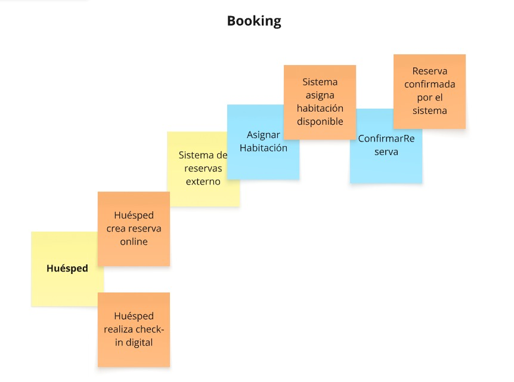

# **Capítulo II: Requirements Elicitation & Analysis**

## 2.1. Competidores.

El mercado de soluciones para gestión hotelera en Lima y a nivel global presenta diversos actores que ofrecen herramientas digitales, sistemas tracionales de gestión y, en menor medida, plataformas integradas con IoT. Se identificaron los principales competidores:

#### 2.1.1 Análisis Competitivo.

El análisis competitivo permite identificar las fortalezas y debilidades de los principales actores del mercado frente a la propuesta de **Smart Stay**.  

| Competidor              | Fortalezas                                                                 | Debilidades                                                                 | Diferenciación de Smart Stay |
|--------------------------|----------------------------------------------------------------------------|----------------------------------------------------------------------------|-------------------------------|
| **Oracle Hospitality**  | Reconocimiento global, soluciones completas de gestión hotelera.           | Alto costo, complejidad de implementación, poco flexible para hoteles pequeños. | Plataforma más accesible y enfocada en hoteles boutique. |
| **Amadeus Hospitality** | Escalabilidad, fuerte presencia en cadenas hoteleras internacionales.      | Costos elevados, lenta implementación, baja personalización.               | Enfoque ágil y flexible para hoteles independientes. |
| **RoomRaccoon**         | SaaS en la nube, interfaz intuitiva, diseñado para hoteles pequeños.       | Limitada presencia en LATAM, soporte técnico remoto.                       | Presencia local y soporte técnico en español para Lima. |
| **Smartpricing**        | IA para revenue management y optimización de precios.                      | No cubre operaciones completas ni personalización del huésped.             | Gestión integral + IoT con personalización de la experiencia. |
| **Startups locales**    | Precios accesibles, soporte en español, integración con canales de reservas. | Funcionalidades limitadas, sin IoT, poco enfoque en experiencia del huésped. | Plataforma integral que combina PMS + IoT + personalización. |
| **Sistemas manuales**   | Bajo costo inicial, fáciles de usar sin capacitación avanzada.             | Ineficiencia, errores frecuentes, cero automatización.                     | Digitalización total y reducción de costos operativos. |

#### 2.1.2  Estrategias y Tácticas frente a Competidores.

Para posicionarse de manera efectiva frente a los competidores,  **Smart Stay** implementará las siguientes estrategias: 

#### Estrategias

1. **Diferenciación Tecnológica**: Integrar gestión hotelera con IoT, algo que los competidores actuales no ofrecen de manera completa.
2. **Enfoque en nicho**: Dirigirse a hoteles boutique y pequeños (20-100 habitaciones), un segmento poco atendido por gigantes como Oracle o Amadeus.
3. **Modelo de suscripción accesible**: Precios escalables según número de habitaciones, permitiendo competir contra soluciones costosas sin sacrificar funcionalidad.
4. **Soporte local y en español**: Acompañamiento cercano que mejora la adopción frente a competidores extranjeros.
5. **Valor medible**: Promesa clara de reducción de costos operativos (10-20%)

#### Tácticas

- **Programa píloto** con hoteles boutique de lima para generar casos de éxito y testimonios.
- **Alianzas estratégicas** con gremios turísticos (ej. FEDECATUR) para acelerar la adopción.
- **Capacitación continua** para el personal hotelero, disminuyendo resistencia al cambio.
- **Marketing digital enfocado en ROI**: Mostrar comparativas de costos y beneficios frente a sistemas tracicionales
- **Integraciones rápidas** con PMS existentes para facilitar la migración y reduccir fricciones.
- **Atencion postventa 24/7** como ventaja competitiva sobre startups con soporte limitado. 

## 2.1. Entrevistas.
Con el objetivo de profundizar en las necesidades y expectativas de los segmentos objetivos, se realizaron entrevistas semiestructuradas a administradores de hoteles boutique y a huéspedes. Esta información cualitativa sirvió como base para identificar problemáticas actuales y orientar la definición de requisitos del sistema.

#### 2.1.2  Diseño de entrevistas

### Entrevista – Segmento 1: Administradores de Hoteles Boutique y Pequeños

1. ¿Cómo te llamas y qué cargo ocupas en el hotel?  
2. ¿En qué distrito o ciudad se encuentra el hotel?  
3. ¿Cuántas habitaciones y personal gestionan aproximadamente?  
4. ¿Podrías contarme cómo es un día típico de trabajo administrando el hotel?  
5. ¿Qué tan seguido deben gestionar procesos como reservas, check-in/check-out o facturación?  
6. ¿Cómo suelen organizar actualmente la gestión de reservas y pagos?  
7. ¿Han tenido dificultades con sobrerreservas, disponibilidad de habitaciones o errores de facturación?  
8. ¿Qué dispositivos usas con mayor frecuencia para gestionar el hotel?  
9. ¿Qué aplicaciones o sistemas usas actualmente en tu día a día para el manejo del hotel?  
10. ¿Has tenido alguna dificultad o experiencia negativa al usarlas?  
11. ¿Qué te motivaría a adoptar una nueva herramienta digital para centralizar reservas, pagos y tareas del personal?  
12. Si una herramienta digital lograra optimizar tus operaciones y reducir tus costos, ¿cómo valorarías invertir en una suscripción mensual para acceder a ella?  
13. ¿Cuáles son tus principales preocupaciones respecto a la gestión del hotel?

### Entrevista – Segmento 2: Huéspedes de Hoteles

1. ¿Cómo te llamas y con qué frecuencia viajas por turismo o trabajo?
2. ¿Qué tipo de hotel sueles elegir (boutique, cadena internacional, Airbnb, etc.) y por qué?
3. ¿Qué valoras más en un hotel: ubicación, precio, comodidad o servicios digitales?
4. ¿Cómo fue tu última experiencia de check-in y check-out? ¿Qué mejorarías?
5. ¿Qué tan importante es para ti poder personalizar tu habitación (temperatura, luz, limpieza, room service) desde tu celular u otro dispositivo tecnológico?
6. ¿Qué servicios digitales utilizas más durante tu estadía en un hotel (WiFi, app del hotel, WhatsApp, smart TV, llaves digitales)?
7. ¿Has tenido experiencias negativas con la gestión del hotel (esperas largas, problemas con el servicio, falta de personalización)?
8. ¿Qué opinas de un sistema que te permita hacer check-in sin pasar por recepción y controlar tu habitación desde una app?
9. ¿Estarías dispuesto a pagar un poco más por un hotel que ofrezca experiencias digitales y personalización avanzada? ¿Cuánto aproximadamente?
10. ¿Qué tanto influyen las reseñas digitales y la reputación online en tu decisión de reservar un hotel?
11. Si un hotel ofreciera un servicio totalmente digitalizado, ¿qué expectativa tendrías respecto al trato humano? ¿Lo consideras un valor agregado o no es necesario?
12. ¿Qué recomendarías para que la experiencia digital en un hotel sea cómoda y no complicada para los huéspedes?

### 2.2.2. Registro de entrevistas

### Entrevista – Segmento 1: Administradores de Hoteles Boutique y Pequeños

#### Entrevista 1

---

#### Entrevista 2

---

#### Entrevista 3

---

### Entrevista – Segmento 2: Huéspedes de Hoteles Boutique

---

#### Entrevista 1

Datos del entrevistado:

**Nombre completo:** Diego Michael Segura Martínez

**Edad:** 25 años

**Distrito:** Santa Anita – Lima Metropolitana

**Duración:** 5:34 minutos

**Evidencia:** 

**URL del video:** [https://shorturl.at/7UPcY](https://upcedupe-my.sharepoint.com/:v:/g/personal/u202019498_upc_edu_pe/Ecu4CtT8NWxKgN-Lk8cgX0MB0LMVwWwuwQo6Bmx0fNUlCg?e=tbxK6m&nav=eyJyZWZlcnJhbEluZm8iOnsicmVmZXJyYWxBcHAiOiJTdHJlYW1XZWJBcHAiLCJyZWZlcnJhbFZpZXciOiJTaGFyZURpYWxvZy1MaW5rIiwicmVmZXJyYWxBcHBQbGF0Zm9ybSI6IldlYiIsInJlZmVycmFsTW9kZSI6InZpZXcifX0%3D)

**Resumen de la entrevista**

Diego suele hospedarse en hoteles cuando viaja, principalmente con su pareja y en menor medida con su familia. Prefiere hoteles cómodos, con privacidad y buena experiencia. Valora la comodidad y los servicios digitales que simplifiquen su estadía.
Su principal frustración son las esperas en recepción y la falta de personalización. Le atrae la idea de un sistema digital que permita check-in/check-out sin filas y control de la habitación desde el celular (luz, temperatura, room service).
Utiliza principalmente WiFi y Smart TV, pero estaría dispuesto a usar una app centralizada. Confía en las reseñas digitales para tomar decisiones y estaría dispuesto a pagar entre 10% y 15% más por un hotel con experiencias digitales avanzadas.
Considera que el trato humano sigue siendo un valor agregado, aunque la digitalización es clave. Recomienda que los sistemas sean fáciles de usar y que cada hotel cuente con una página clara con descripción completa y disponibilidad de habitaciones en tiempo real.

---

#### Entrevista 2

Datos del entrevistado:

**Nombre completo:** Juan Salcedo  

**Edad:** 44 años

**Distrito:** San Borja – Lima Metropolitana

**Duración:** 6:11 minutos

**Nombre:** Juan Salcedo  
**Edad:** 44 años  
**Distrito:** San Borja

**Evidencia:** 

**URL del video:** [https://shorturl.at/7UPcY](https://upcedupe-my.sharepoint.com/:v:/g/personal/u20221e617_upc_edu_pe/ERPriyAe3RlMlJHW2WouYN8BTLnggzX4JPIaQq2eElKZXQ?nav=eyJyZWZlcnJhbEluZm8iOnsicmVmZXJyYWxBcHAiOiJPbmVEcml2ZUZvckJ1c2luZXNzIiwicmVmZXJyYWxBcHBQbGF0Zm9ybSI6IldlYiIsInJlZmVycmFsTW9kZSI6InZpZXciLCJyZWZlcnJhbFZpZXciOiJNeUZpbGVzTGlua0NvcHkifX0&e=wfbeZY)  

**Resumen de la entrevista**

Juan viaja por trabajo cada 1-2 meses y prefiere alojamientos cómodos, autónomos y con buena conectividad, optando principalmente por Airbnb y, en menor medida, por hoteles. Valora especialmente la ubicación céntrica, el Wi-Fi de calidad y la facilidad tecnológica. Considera que los horarios estrictos de check-in y check-out son una gran limitación, y aunque nunca ha usado una habitación totalmente “smart”, le interesa la idea, aunque cree que aún no está bien implementada en Perú. No pagaría más por funciones digitales avanzadas, ya que las asocia con un público más joven. Usa Wi-Fi como servicio indispensable, junto con laptop y smartphone, y ha tenido experiencias negativas relacionadas con demoras en la atención y falta de limpieza, además de percibir una falta de personalización en el servicio. Recomienda priorizar la mejora del Wi-Fi (fibra óptica) y mantener una atención eficiente, considerando que la digitalización debe complementar, pero no reemplazar, el buen trato humano.

---

#### Entrevista 3

Datos del entrevistado:

**Nombre completo:** Tadeo Loja Beloglio 

**Edad:** 22 años

**Distrito:** Santiago de Surco – Lima Metropolitana

**Duración:** 7:21 minutos

**Evidencia:** 

**URL del video:** [Entrevista-3](https://upcedupe-my.sharepoint.com/:v:/g/personal/u20201f051_upc_edu_pe/EX5Eq-XT8MdGnWsqsTcHL7MBqeTy6xG91s4YoE9WcsRY_w?nav=eyJyZWZlcnJhbEluZm8iOnsicmVmZXJyYWxBcHAiOiJTdHJlYW1XZWJBcHAiLCJyZWZlcnJhbFZpZXciOiJTaGFyZURpYWxvZy1MaW5rIiwicmVmZXJyYWxBcHBQbGF0Zm9ybSI6IldlYiIsInJlZmVycmFsTW9kZSI6InZpZXcifX0%3D&e=0XZvvA)

**Resumen de la entrevista**

Tadeo viaja por turismo una vez al año y suele elegir hoteles de cadenas internacionales porque le ofrecen mayor confianza y calidad de servicio, aunque también considera opciones boutique si el precio es conveniente. Lo que más valora es el precio y la comodidad, seguido de la ubicación. Su última experiencia de check-in fue lenta, mientras que el check-out resultó rápido, por lo que cree que ambos procesos deberían digitalizarse.

No considera esencial la personalización de la habitación, pero sí cómodo poder controlar luz y temperatura desde el celular. Durante sus estadías utiliza principalmente el WiFi y la smart TV, y le gustaría contar con llaves digitales.

Entre los problemas que ha tenido destacan las largas esperas en recepción y la falta de coordinación en la limpieza. Considera muy práctico un sistema de check-in digital y control de la habitación mediante una app, y estaría dispuesto a pagar hasta un 5% más por ello siempre que mejore la experiencia.

Las reseñas digitales influyen en un 70% en su decisión de reserva. Para él, el trato humano sigue siendo un valor agregado incluso en un hotel digitalizado, y recomienda que la experiencia digital se concentre en una app única, sencilla y con asistencia rápida.

---
## Entrevista 4

Datos del entrevistado:

**Nombre completo:** Joaquin Fernandez

**Edad:** 21 años

**Distrito:** Santiago de Surco – Lima Metropolitana

**Duración:** 4:44 minutos

**Evidencia:** 

**Enlace al video en Microsoft Stream:** [Entrevista-4](https://upcedupe-my.sharepoint.com/:v:/g/personal/u20201f051_upc_edu_pe/EfHhd4ZVeqNEuji_fhRH2HABSjkFsOZnYobTIIqx-BN9nw?nav=eyJyZWZlcnJhbEluZm8iOnsicmVmZXJyYWxBcHAiOiJTdHJlYW1XZWJBcHAiLCJyZWZlcnJhbFZpZXciOiJTaGFyZURpYWxvZy1MaW5rIiwicmVmZXJyYWxBcHBQbGF0Zm9ybSI6IldlYiIsInJlZmVycmFsTW9kZSI6InZpZXcifX0%3D&e=eCsesR)  

**Resumen de la entrevista**

Joaquín viaja por turismo una vez al año y suele elegir hoteles sencillos o Airbnb por ser accesibles y prácticos, aunque también considera los boutique si el precio es conveniente. Lo que más valora es el precio y la comodidad, seguido de la ubicación.
Su última experiencia de check-in fue lenta, mientras que el check-out resultó rápido, por lo que cree que ambos procesos deberían digitalizarse. No considera esencial la personalización de la habitación, pero sí cómodo poder controlar luz
y temperatura desde el celular. Durante sus estadías utiliza principalmente el WiFi y la smart TV, y le gustaría contar con llaves digitales. Entre los problemas que ha tenido destacan las largas esperas en recepción y la falta de coordinación
en la limpieza. Considera muy práctico un sistema de check-in digital y control de la habitación mediante una app, y estaría dispuesto a pagar entre 5% y 10% más por ello siempre que mejore la experiencia. Las reseñas digitales influyen en un 70% en su decisión de reserva. Para él, el trato humano sigue siendo un valor agregado incluso en un hotel digitalizado, y recomienda que la experiencia digital se concentre en una app única, sencilla y con asistenciarápida.

---

### 2.2.2. Análisis de entrevistas

**Segmento 1 – Administradores de Hoteles Boutique y Pequeños en Lima**

| Entrevistado   | Hotel               | Herramientas actuales                   | Dolor principal                                  | Motivación                                                 | Pago por suscripción           |
| -------------- | ------------------- | --------------------------------------- | ------------------------------------------------ | ---------------------------------------------------------- | ------------------------------ |
| Adrián (34)    | 12 hab., 6 personas | Sistema propio no sincroniza            | **Sobreventa, errores por actualización manual** | Centralizar gestión + integraciones externas               | Sí, si el costo es razonable   |
| Mónica (33)    | 12 hab., 4 personas | Sistema web propio + laptops + WhatsApp | **Dificultad de uso, poco flexible**             | Herramienta que centralice operaciones adaptada a su hotel | Sí, si mejora servicios        |
| Alejandra (23) | 19 hab., 5 personas | WhatsApp + Excel                        | **Reservas perdidas, falta de control**          | Notificaciones automáticas + simplificación                | Sí, si realmente ahorra tiempo |

**Hallazgos clave segmento 1:**

- Problemas principales: Los entrevistados enfrentan dificultades recurrentes con la gestión de reservas debido a la ausencia de un sistema centralizado. Entre los problemas más destacados se encuentran la sobreventa de habitaciones, la duplicación de tareas administrativas y la pérdida de información en los registros. Estas situaciones generan ineficiencia, errores en la atención y mayor carga operativa.
- Solución esperada: Los administradores expresaron la necesidad de implementar una herramienta digital que integre la gestión de reservas con otros procesos internos, tales como la coordinación de limpieza, los servicios adicionales y la generación de notificaciones automáticas. De esta manera, se busca simplificar el trabajo, reducir errores y aumentar la eficiencia operativa.
- Disposición de pago: Existe consenso en la disposición a pagar por una suscripción mensual, siempre que la solución proporcione beneficios tangibles en términos de simplicidad y mejora del control administrativo.
- Perfil digital: Aunque los establecimientos cuentan con sistemas propios, aún prevalece el uso de herramientas básicas como WhatsApp y Excel para el registro y seguimiento de reservas. Esto revela un nivel bajo de madurez tecnológica, pero acompañado de apertura hacia la adopción de soluciones digitales más sofisticadas.

---

**Segmento 2 – Huéspedes de Hoteles**

| Entrevistado | Perfil                   | Frustraciones                                                         | Valor esperado                                             | Pago adicional |
| ------------ | ------------------------ | --------------------------------------------------------------------- | ---------------------------------------------------------- | -------------- |
| Diego (25)   | Viaja con pareja/familia | Esperas en recepción, falta de personalización                        | Check-in/out digital, control desde celular, app unificada | Sí, +10%-15%   |
| Juan (44)    | Viaja por trabajo        | Horarios rígidos, Wi-Fi deficiente, falta de limpieza/personalización | Mejor Wi-Fi, atención rápida, flexibilidad                 | No pagaría más |

**Hallazgos clave segmento 2:**

- Problemas principales: Los participantes señalaron como principales frustraciones las demoras en los procesos de check-in y check-out, la falta de personalización en el servicio, la escasa flexibilidad de horarios y, en algunos casos, deficiencias en la conectividad Wi-Fi y en la limpieza.
- Solución esperada: Se valora la posibilidad de contar con herramientas digitales que permitan realizar check-in y check-out sin esperas, controlar funciones de la habitación desde el dispositivo móvil (iluminación, temperatura, room service), así como garantizar la disponibilidad de información en tiempo real sobre los servicios. En este sentido, la digitalización es vista como un facilitador de la experiencia, siempre que no elimine el valor del trato humano.
- Disposición de pago: El segmento presenta posiciones diferenciadas. Algunos usuarios jóvenes se mostraron dispuestos a pagar entre un 10% y 15% más por hoteles que ofrezcan experiencias digitales avanzadas, mientras que los viajeros de mayor edad no consideran prioritario este tipo de servicios y prefieren mantener costos contenidos.
- Perfil digital: Los entrevistados confían en herramientas digitales como el Wi-Fi, la Smart TV y las reseñas en línea para tomar decisiones de hospedaje. Su nivel de madurez tecnológica puede clasificarse como intermedio, con apertura hacia soluciones innovadoras, aunque condicionado por la facilidad de uso y la percepción de valor añadido

**Conclusión Integradora**

El análisis de ambos segmentos revela que, aunque sus necesidades se orientan a aspectos distintos del servicio, existe un punto común en la demanda de mayor digitalización y centralización de procesos. Para el segmento 1  el reto principal radica en mejorar la gestión operativa mediante sistemas integrados. Para el segmento 2 la prioridad se centra en optimizar la experiencia del usuario a través de herramientas digitales que reduzcan tiempos de espera, ofrezcan personalización y garanticen conectividad.

Ambos segmentos muestran apertura a soluciones tecnológicas, aunque con diferentes expectativas y niveles de disposición de pago. Este hallazgo subraya la oportunidad de diseñar una plataforma integral que atienda simultáneamente la eficiencia operativa del hotel y la satisfacción del huésped, alineando la modernización de los procesos internos con la mejora de la experiencia de los clientes.

---

## 2.3. Needfinding.

### 2.3.1. User Personas.

**Segmento 1 – Administradores de Hoteles Boutique y Pequeños en Lima**

 

**Segmento 2 – Huéspedes de Hoteles**

 

---
 
### 2.3.2. User Task Matrix

La siguiente matriz cruza a nuestros **User Personas** con las tareas clave que realizan en el hotel, considerando **frecuencia** e **importancia** para priorizar funcionalidades del sistema.

**Adrián Ramírez (Administrador de hotel boutique)**

| **Tarea**                           | **Frecuencia** | **Importancia** |
|-------------------------------------|----------------|-----------------|
| Gestionar reservas y disponibilidad | Alta           | Alta            |
| Evitar sobreventas y duplicados     | Alta           | Alta            |
| Coordinar limpieza y personal       | Media          | Alta            |
| Revisar y responder solicitudes     | Alta           | Media           |
| Centralizar operaciones en un sistema único | Media | Alta |

---

**Valeria Ríos (Huésped)**

| **Tarea**                                  | **Frecuencia** | **Importancia** |
|--------------------------------------------|----------------|-----------------|
| Hacer check-in/check-out                   | Alta           | Alta            |
| Acceder a wifi rápido y confiable          | Alta           | Alta            |
| Personalizar su estadía con servicios digitales | Media      | Alta            |
| Ahorrar tiempo en procesos                 | Alta           | Alta            |

### 2.3.3. User Journey Mapping.

El User Journey Mapping permite visualizar las etapas que recorren los usuarios desde el descubrimiento de la solución hasta la evaluación final de su experiencia. A través de este recurso se identifican los objetivos de los usuarios, los puntos de contacto con el servicio, sus pensamientos, percepciones y oportunidades de mejora en cada fase del proceso.

En el caso de Smart Stay, se elaboraron dos mapas diferenciados según los segmentos objetivos:

- **Segmento 1** : enfocado en la gestión operativa y la centralización de reservas.
- **Segmento 2** : centrado en la experiencia de estadía y la digitalización de servicios.

Estos recorridos permiten detectar fricciones, validar expectativas y proponer mejoras orientadas a optimizar tanto la gestión hotelera como la satisfacción de los huéspedes.

**Segmento 1 – Administradores de Hoteles Boutique y Pequeños en Lima**

 

**Segmento 2 – Huéspedes de Hoteles**

 

---

### 2.3.4. Empathy Mapping.

**Adrián Ramírez (Administrador de hotel boutique):**

**Valeria Ríos (Huésped / Viajera):**

## 2.4. Big Picture EventStorming.

---

## 2.5. Ubiquitous Language.

| **Término en Inglés**        | **Término en Español**             | **Definición**                                                                                                                                      |
| ---------------------------- | ---------------------------------- | --------------------------------------------------------------------------------------------------------------------------------------------------- |
| Hotel Administrator          | Administrador del hotel            | Usuario encargado de la gestión operativa del hotel. Supervisa reservas, limpieza, facturación y coordinación con el personal.                      |
| Reservation Management       | Gestión de reservas                | Proceso centralizado de registro, confirmación, modificación y cancelación de reservas en tiempo real.                                              |
| Overbooking                  | Sobreventa                         | Situación en la que el hotel vende más habitaciones de las disponibles debido a la falta de sincronización en los sistemas de reserva.              |
| Housekeeping Schedule        | Programación de limpieza           | Organización de tareas de limpieza y mantenimiento de habitaciones, coordinadas desde el sistema de gestión.                                        |
| Digital Check-In / Check-Out | Registro digital de entrada/salida | Funcionalidad que permite al huésped ingresar o salir del hotel sin necesidad de hacer filas en recepción, a través de una aplicación o portal web. |
| Guest Profile                | Perfil del huésped                 | Información digital del cliente que incluye preferencias, historial de estadías y solicitudes especiales.                                           |
| Smart Room Control           | Control inteligente de habitación  | Función que permite al huésped manejar servicios como iluminación, temperatura o room service desde su dispositivo móvil.                           |
| Real-Time Notification       | Notificación en tiempo real        | Alerta automática que informa sobre nuevas reservas, cambios en disponibilidad o solicitudes de huéspedes.                                          |
| Financial Report             | Reporte financiero                 | Documento digital generado por el sistema que resume ingresos, gastos y métricas clave para evaluar la rentabilidad del hotel.                      |
| Guest Feedback               | Retroalimentación del huésped      | Opiniones y calificaciones que los huéspedes comparten sobre su estadía, utilizadas para mejorar los servicios.                                     |

---

