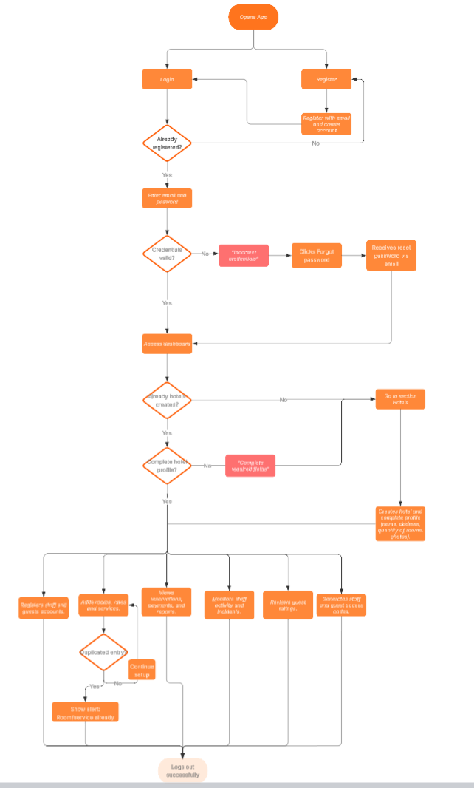
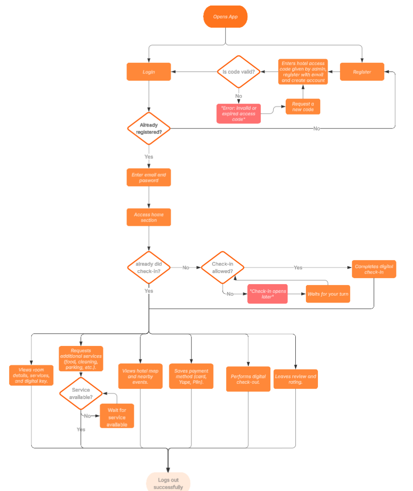
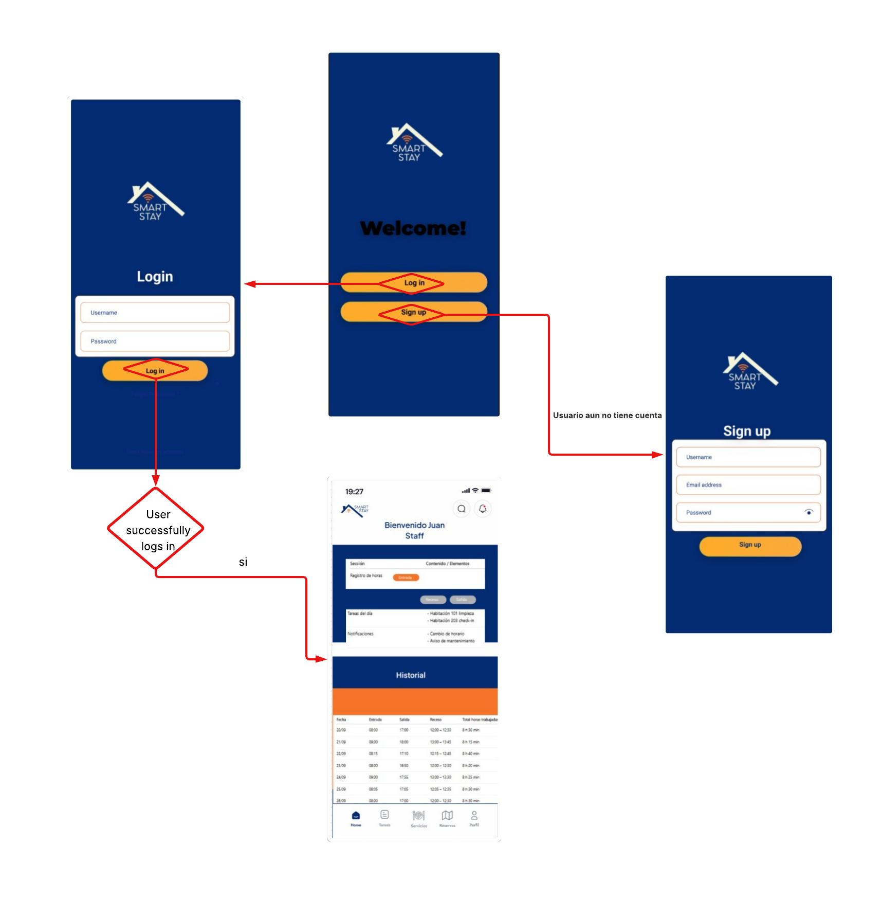
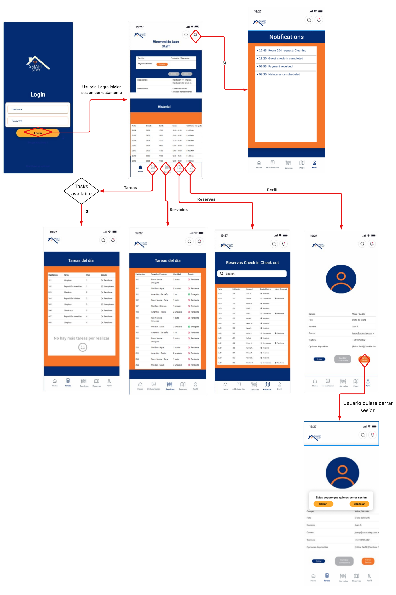
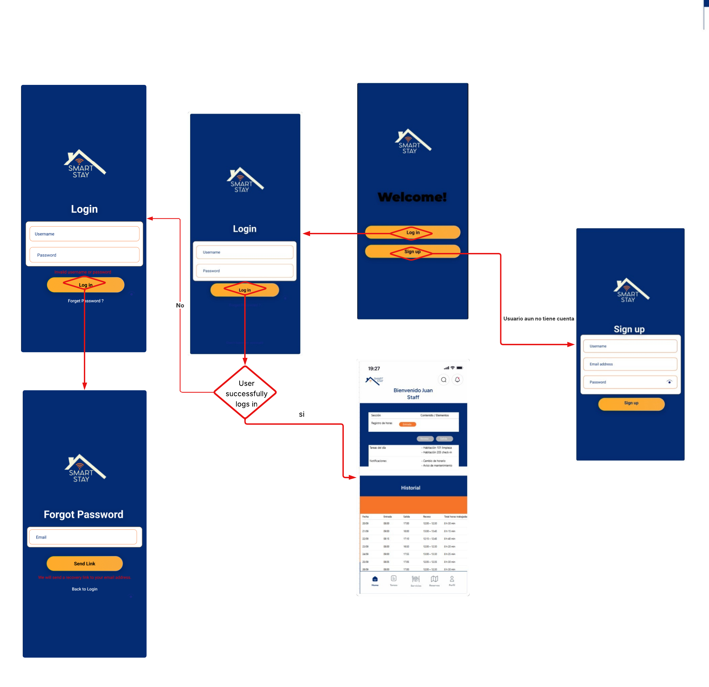
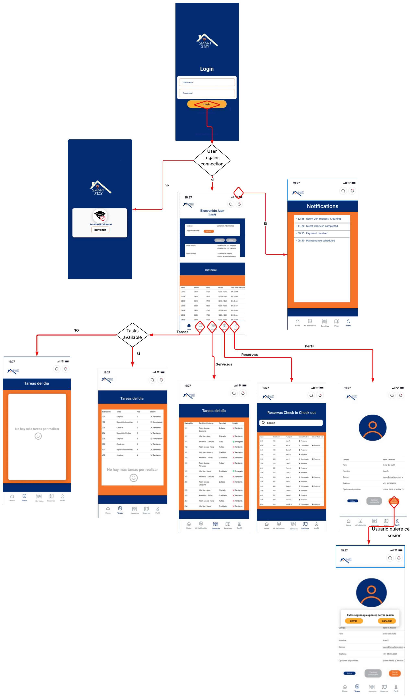
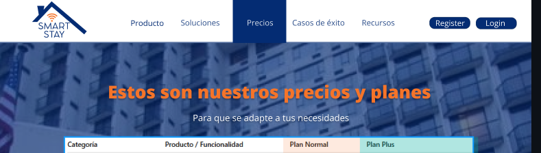
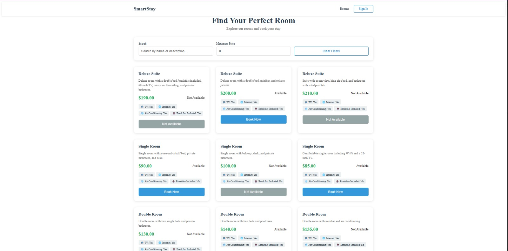
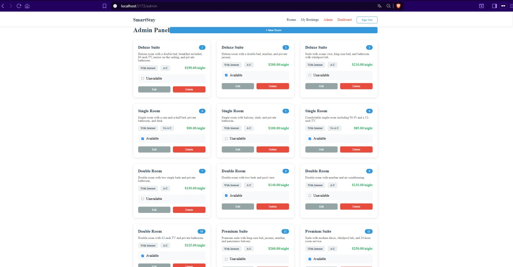

<div align="center">


# Universidad Peruana de Ciencias Aplicadas
## Carrera: Ingeniería de Software
## Ciclo: 2025 - 2


## Curso: 1ASI0730 - Aplicaciones Web
## NRC: 7454
## Profesor: Angel Augusto Velasquez Nuñez

# Informe de Trabajo Final
## Startup: Edgerunners
## Producto: Smart Stay

</div>

<div align="center">

|   Código   |   Apellidos      |     Nombres     |
|:----------:|:----------------:|:---------------:|
| U20221E617 | Verona Flores    | Italo Sebastian |
| U20231A816 | Valverde Portuguez| Natalia Ximena |
| U202019498 | Fernandez Garfias | Alexander Piero |
| u20191c464 | Saavedra Angulo   | Jose Jhonatan  |
| U20201F051 | Ramos Aguirre    | Aldair Joaquin |


**Mes y Año:** Septiembre 2025

</div>

## Registro de Versiones del Informe

El objetivo de esta sección es resumir las modificaciones relevantes que se realizan al informe durante el ciclo de vida del proyecto.  
Esta sección inicia en una página nueva e incluye un cuadro con la siguiente estructura:


| Versión |   Fecha    |                 Autor                 |                 Descripción de los Cambios                  |
|:-------:|:----------:|:-------------------------------------:|:-----------------------------------------------------------:|
|   1.0   | 01/09/2025 | Jose Jhonatan Saavedra Angulo (Líder) | Estructuración inicial del proyecto y coordinación del equipo |
|   1.0   | 01/09/2025 |     Italo Sebastian Verona Flores     | Creación del documento inicial del Informe de Trabajo Final |
|   1.1   | 15/09/2025 |    Natalia Ximena Valverde Portuguez  | Desarrollo de wireframes, mockups y guías de estilo visual |
|   1.2   | 20/09/2025 |   Alexander Piero Fernandez Garfias   | Implementación de landing page y desarrollo front-end |
|   1.3   | 25/09/2025 |     Aldair Joaquin Ramos Aguirre      | Elaboración de EventStorming e Impact Mapping |
|   2.0   | 30/09/2025 |  Equipo Edgerunners (Todos los miembros) | Finalización y revisión integral del Informe de Trabajo Final |


## Project Report Collaboration Insights

- **URL de la organización del proyecto:** https://github.com/Edgerunners-Aplicaciones-Web/report
- **URL del repositorio para el Project Report:** https://github.com/Edgerunners-Aplicaciones-Web/report
- **URL del repositorio de la landing page del proyecto:** https://github.com/Edgerunners-Aplicaciones-Web/report

### Colaboración y Evidencia de Trabajo en Equipo

El desarrollo del presente informe de trabajo final se realizó de manera colaborativa utilizando las herramientas de control de versiones de GitHub. A continuación se presenta la evidencia de la participación y contribuciones de cada miembro del equipo:

#### Análisis de Commits por Colaborador

El trabajo en el repositorio del informe demuestra la participación activa de todos los miembros del equipo:


#### Distribución de Contribuciones

La colaboración se distribuyó de la siguiente manera:

- **Gestión del repositorio y estructura inicial:** Configuración de la estructura base del documento
- **Desarrollo de contenido por capítulos:** Cada miembro contribuyó con secciones específicas según su área de especialización
- **Revisión y refinamiento:** Proceso iterativo de mejora del contenido mediante pull requests y revisiones colaborativas
- **Integración final:** Consolidación de todas las contribuciones en el documento final

#### Metodología de Trabajo Colaborativo

- **Control de versiones:** Uso de Git para el seguimiento de cambios y colaboración
- **Revisiones de contenido:** Implementación de pull requests para la validación del contenido
- **Documentación continua:** Actualización incremental del informe durante todo el ciclo del proyecto
- **Coordinación de equipo:** Reuniones regulares para alinear el progreso y resolver conflictos

## Contenido

- [Capítulo I: Introducción](#capítulo-i-introducción)
  - [1.1. Startup Profile](#11-startup-profile)
    - [1.1.1. Descripción de la Startup](#111-descripción-de-la-startup)
    - [1.1.2. Perfiles de integrantes del equipo](#112-perfiles-de-integrantes-del-equipo)
  - [1.2. Solution Profile](#12-solution-profile)
    - [1.2.1. Antecedentes y problemática](#121-antecedentes-y-problemática)
    - [1.2.2. Lean UX Process](#122-lean-ux-process)
      - [1.2.2.1. Lean UX Problem Statements](#1221-lean-ux-problem-statements)
      - [1.2.2.2. Lean UX Assumptions](#1222-lean-ux-assumptions)
      - [1.2.2.3. Lean UX Hypothesis Statements](#1223-lean-ux-hypothesis-statements)
      - [1.2.2.4. Lean UX Canvas](#1224-lean-ux-canvas)
  - [1.3. Segmentos objetivo](#13-segmentos-objetivo)

- [Capítulo II: Requirements Elicitation & Analysis](#capítulo-ii-requirements-elicitation--analysis)
  - [2.1. Competidores](#21-competidores)
    - [2.1.1. Análisis competitivo](#211-análisis-competitivo)
    - [2.1.2. Estrategias y tácticas frente a competidores](#212-estrategias-y-tácticas-frente-a-competidores)
  - [2.2. Entrevistas](#22-entrevistas)
    - [2.2.1. Diseño de entrevistas](#221-diseño-de-entrevistas)
    - [2.2.2. Registro de entrevistas](#222-registro-de-entrevistas)
    - [2.2.3. Análisis de entrevistas](#223-análisis-de-entrevistas)
  - [2.3. Needfinding](#23-needfinding)
    - [2.3.1. User Personas](#231-user-personas)
    - [2.3.2. User Task Matrix](#232-user-task-matrix)
    - [2.3.3. User Journey Mapping](#233-user-journey-mapping)
    - [2.3.4. Empathy Mapping](#234-empathy-mapping)
  - [2.4. Big Picture EventStorming](#24-big-picture-eventstorming)
  - [2.5. Ubiquitous Language](#25-ubiquitous-language)

- [Capítulo III: Requirements Specification](#capítulo-iii-requirements-specification)
  - [3.1. User Stories](#31-user-stories)
  - [3.2. Impact Mapping](#32-impact-mapping)
  - [3.3. Product Backlog](#33-product-backlog)

- [Capítulo IV: Product Design](#capítulo-iv-product-design)
  - [4.1. Style Guidelines](#41-style-guidelines)
    - [4.1.1. General Style Guidelines](#411-general-style-guidelines)
    - [4.1.2. Web Style Guidelines](#412-web-style-guidelines)
  - [4.2. Information Architecture](#42-information-architecture)
    - [4.2.1. Organization Systems](#421-organization-systems)
    - [4.2.2. Labeling Systems](#422-labeling-systems)
    - [4.2.3. SEO Tags and Meta Tags](#423-seo-tags-and-meta-tags)
    - [4.2.4. Searching Systems](#424-searching-systems)
    - [4.2.5. Navigation Systems](#425-navigation-systems)
  - [4.3. Landing Page UI Design](#43-landing-page-ui-design)
    - [4.3.1. Landing Page Wireframe](#431-landing-page-wireframe)
    - [4.3.2. Landing Page Mock-up](#432-landing-page-mock-up)
  - [4.4. Web Applications UX/UI Design](#44-web-applications-uxui-design)
    - [4.4.1. Web Applications Wireframes](#441-web-applications-wireframes)
    - [4.4.2. Web Applications Wireflow Diagrams](#442-web-applications-wireflow-diagrams)
    - [4.4.3. Web Applications Mock-ups](#443-web-applications-mock-ups)
    - [4.4.4. Web Applications User Flow Diagrams](#444-web-applications-user-flow-diagrams)
  - [4.5. Web Applications Prototyping](#45-web-applications-prototyping)
  - [4.6. Domain-Driven Software Architecture](#46-domain-driven-software-architecture)
    - [4.6.1. Design-Level EventStorming](#461-design-level-eventstorming)
    - [4.6.2. Software Architecture Context Diagram](#462-software-architecture-context-diagram)
    - [4.6.3. Software Architecture Container Diagrams](#463-software-architecture-container-diagrams)
    - [4.6.4. Software Architecture Components Diagrams](#464-software-architecture-components-diagrams)
  - [4.7. Software Object-Oriented Design](#47-software-object-oriented-design)
    - [4.7.1. Class Diagrams](#471-class-diagrams)
  - [4.8. Database Design](#48-database-design)
    - [4.8.1. Database Diagrams](#481-database-diagrams)

- [Capítulo V: Product Implementation, Validation & Deployment](#capítulo-v-product-implementation-validation--deployment)
  - [5.1. Software Configuration Management](#51-software-configuration-management)
    - [5.1.1. Software Development Environment Configuration](#511-software-development-environment-configuration)
    - [5.1.2. Source Code Management](#512-source-code-management)
    - [5.1.3. Source Code Style Guide & Conventions](#513-source-code-style-guide--conventions)
    - [5.1.4. Software Deployment Configuration](#514-software-deployment-configuration)
  - [5.2. Landing Page, Services & Applications Implementation](#52-landing-page-services--applications-implementation)
    - [5.2.1. Sprint n](#521-sprint-n)
      - [5.2.1. Sprint Planning n](#5211-sprint-planning-n)
      - [5.2.1.2. Aspect Leaders and Collaborators](#5212-aspect-leaders-and-collaborators)
      - [5.2.1.3. Sprint Backlog n](#5213-sprint-backlog-n)
      - [5.2.1.4. Development Evidence for Sprint Review](#5214-development-evidence-for-sprint-review)
      - [5.2.1.5. Execution Evidence for Sprint Review](#5215-execution-evidence-for-sprint-review)
      - [5.2.1.6. Services Documentation Evidence for Sprint Review](#5216-services-documentation-evidence-for-sprint-review)
      - [5.2.1.7. Software Deployment Evidence for Sprint Review](#5217-software-deployment-evidence-for-sprint-review)
      - [5.2.1.8. Team Collaboration Insights during Sprint](#5218-team-collaboration-insights-during-sprint)

- [Conclusiones y Recomendaciones](#conclusiones-y-recomendaciones)
- [Bibliografía y Referencias](#bibliografía-y-referencias)

## Student Outcome

El curso contribuye al cumplimiento del Student Outcome ABET:

### ABET – EAC - Student Outcome 5

Criterio: La capacidad de funcionar efectivamente en un equipo cuyos miembros juntos proporcionan liderazgo, crean un entorno de colaboración e inclusivo, establecen objetivos, planifican tareas y cumplen objetivos. 

En el siguiente cuadro se describe las acciones realizadas y enunciados de conclusiones por parte del grupo, que permiten sustentar el haber alcanzado el logro del ABET – EAC - Student Outcome 5

| Criterio específico                                                                                | Acciones realizadas                                                                                                                                                                                                                                                                                                                                                                                                                                                                                                                                                                                                                                                                                                                                                                                                                                                                                                                                                                                                                                                                                                                                                                                                                                                                                                                                                                                                                                                                                                                                                                                                                                                                                                                                            | Conclusiones                                                                                                                                                                                                                                                                                                                                                                                                                                                                                                                                                                                                                                                                                                                                                                                                                                                                                                                                              |
|----------------------------------------------------------------------------------------------------|----------------------------------------------------------------------------------------------------------------------------------------------------------------------------------------------------------------------------------------------------------------------------------------------------------------------------------------------------------------------------------------------------------------------------------------------------------------------------------------------------------------------------------------------------------------------------------------------------------------------------------------------------------------------------------------------------------------------------------------------------------------------------------------------------------------------------------------------------------------------------------------------------------------------------------------------------------------------------------------------------------------------------------------------------------------------------------------------------------------------------------------------------------------------------------------------------------------------------------------------------------------------------------------------------------------------------------------------------------------------------------------------------------------------------------------------------------------------------------------------------------------------------------------------------------------------------------------------------------------------------------------------------------------------------------------------------------------------------------------------------------------|-----------------------------------------------------------------------------------------------------------------------------------------------------------------------------------------------------------------------------------------------------------------------------------------------------------------------------------------------------------------------------------------------------------------------------------------------------------------------------------------------------------------------------------------------------------------------------------------------------------------------------------------------------------------------------------------------------------------------------------------------------------------------------------------------------------------------------------------------------------------------------------------------------------------------------------------------------------|
| **Trabaja en equipo para proporcionar liderazgo en forma conjunta**                                | Italo Sebastian Verona Flores TB1 <ul><li>Lideré la definición de la arquitectura de software del proyecto 'Smart Stay', utilizando el modelo C4 para establecer los diagramas de Contexto, Contenedores y Componentes.</li><li>Dirigí el diseño de la base de datos, solicitando y validando los esquemas en SQL y DBML para asegurar la correcta persistencia de los datos según los Bounded Contexts definidos.</li></ul> Natalia Ximena Valverde Portuguez TB1 <ul><li>Lideré el área de diseño de experiencia de usuario (UX), elaborando los wireframes y mockups de alta fidelidad que sirvieron como guía visual para todo el proyecto.</li><li>Dirigí la creación de la guía de estilos visuales de "Smart Stay", definiendo la paleta de colores, tipografía y branding para asegurar una identidad de marca coherente y profesional.</li></ul> Alexander Piero Fernandez Garfias TB1 <ul><li>Tomé el liderazgo en el desarrollo front-end, traduciendo los mockups y guías de estilo en un prototipo funcional utilizando HTML, Tailwind CSS y JavaScript.</li><li>Dirigí la implementación técnica de la arquitectura de página única estática (SPA), asegurando que la navegación entre vistas fuera fluida y eficiente.</li></ul> Jose Jhonatan Saavedra Angulo TB1 <ul><li>Lideré la fase de análisis de requerimientos del proyecto, siendo responsable de la creación y redacción del Product Backlog, incluyendo todas las Épicas y User Stories.</li><li>Guié la alineación del producto con las necesidades del negocio mediante la elaboración del Lean UX Canvas, asegurando que cada funcionalidad tuviera un propósito claro.</li></ul> Aldair Joaquin Ramos Aguirre TB1  <ul><li> Dirigí la definición Big Picture EventStorming para descubrir eventos de negocio y flujos principales. </li> <li>  Dirigí la definición mediante Impact Mapping para identificar objetivos, actores, impactos y entregables clave, estableciendo así una base estratégica que respaldó el diseño de la arquitectura de software del proyecto 'Smart Stay'.                          | *TB1*<br> <li>El liderazgo del equipo se manifestó de forma conjunta al distribuir responsabilidades clave (arquitectura, diseño de base de datos, UI/UX) entre los miembros, permitiendo que cada uno guiara su área de especialización y contribuyera a una visión técnica coherente y unificada del producto.</li><li>Las decisiones de diseño cruciales, como la adopción del modelo C4 para la arquitectura y la separación funcional de roles de usuario, se tomaron de manera consensuada, discutiendo y evaluando colectivamente las mejores alternativas para la robustez y escalabilidad del sistema.</li><li>El equipo demostró un liderazgo proactivo al guiar el proyecto a través de un proceso iterativo de refinamiento, transformando los conceptos iniciales en un conjunto de artefactos de diseño detallados y un prototipo funcional.</li>                                                                                           |
| **Crea un entorno colaborativo e inclusivo, establece metas, planifica tareas y cumple objetivos** | Italo Sebastian Verona Flores TB1 <ul><li>Establecí los objetivos para cada artefacto de diseño, planificando la secuencia de trabajo desde los diagramas de alto nivel (C4) hasta la implementación del front-end.</li><li>Fomenté un entorno de colaboración al proporcionar retroalimentación específica y constructiva sobre cada entregable, permitiendo la mejora continua del producto final.</li></ul> Natalia Ximena Valverde Portuguez TB1 <ul><li>Creé un entorno colaborativo al proporcionar los artefactos visuales (mockups) que sirvieron como un "lenguaje común" para alinear el trabajo de arquitectura y desarrollo.</li><li>Establecí las metas de diseño visual y de usabilidad, planificando las tareas de creación de componentes gráficos y asegurando el cumplimiento de los objetivos estéticos del proyecto.</li></ul> Alexander Piero Fernandez Garfias TB1 <ul><li>Colaboré estrechamente con el área de diseño para planificar las tareas de maquetación, asegurando que la implementación técnica fuera fiel a la visión UX/UI.</li><li>Cumplí el objetivo de entregar una landing page interactiva y funcional, implementando características complejas como el selector de idioma y la navegación entre vistas.</li></ul> Jose Jhonatan Saavedra Angulo TB1 <ul><li>Establecí las metas funcionales del producto a través de User Stories claras y bien definidas, lo que permitió al equipo planificar sus tareas de desarrollo de manera efectiva.</li><li>Creé un puente de colaboración entre la visión de negocio y el equipo técnico, asegurando que los entregables cumplieran con los objetivos planteados en la fase de análisis.</li></ul> Aldair Joaquin Ramos Aguirre TB1 <ul><li>Conduje una sesión de Big Picture EventStorming, mapeando eventos de negocio y flujos esenciales para obtener una visión integral de los procesos del proyecto.</li><li>Lideré el uso de Impact Mapping para definir metas, actores, resultados esperados y entregables, sentando las bases estratégicas.</li></ul>    | *TB1*<br> <li>Se fomentó un entorno altamente colaborativo utilizando los artefactos de diseño (diagramas C4, mockups, guías de estilo) como un lenguaje común, lo que facilitó la integración del trabajo individual y aseguró que todos los miembros compartieran la misma visión del producto final.</li><li>El equipo estableció y siguió un plan de trabajo estructurado, definiendo metas claras para cada fase del proyecto: desde el análisis de requerimientos y el diseño arquitectónico de alto nivel, hasta el modelado detallado de la base de datos y la implementación del prototipo.</li><li>Se cumplió con el objetivo principal del TB1 al entregar un producto cohesivo y funcional, que incluye una arquitectura de software documentada, un esquema de base de datos normalizado y una landing page estática e interactiva, demostrando la capacidad del equipo para planificar y ejecutar tareas complejas de manera efectiva.</li> |

# **Capítulo I: Introducción**

## 1.1. Startup Profile

### 1.1.2. Perfiles de integrantes del equipo

## 1.2. Solution Profile

### 1.2.1. Antecedentes y problemática

### 1.2.2 Lean UX Process

#### 1.2.1.1 Lean UX Problem Statements.

#### 1.2.2.2. Lean UX Assumptions

#### 1.2.2.3. Lean UX Hypothesis Statements

#### 1.2.2.4. Lean UX Canvass

## 1.3. Segmentos objetivos.

# **Capítulo II: Requirements Elicitation & Analysis**

## 2.1. Competidores.

#### 2.1.1 Análisis Competitivo.

#### 2.1.2  Estrategias y Tácticas frente a Competidores.

## 2.1. Entrevistas.

#### 2.2.1. Diseño de entrevistas

### 2.2.2. Registro de entrevistas

### 2.2.2. Análisis de entrevistas

## 2.3. Needfinding.

### 2.3.1. User Personas.
 
### 2.3.2. User Task Matrix

### 2.3.3. User Journey Mapping.

### 2.3.4. Empathy Mapping.

## 2.4. Big Picture EventStorming.

## 2.5. Ubiquitous Language.

# **Capítulo III: Requirements Specification**

## 3.1. User Stories.

## 3.2. Impact Mapping.

## 3.3. Product Backlog.

# Capítulo IV: Product Design

## 4.1. Style Guidelines

Nuestra base es establecer la identidad visual y de diseño de Smart Stay, asegurando coherencia, claridad y usabilidad en todos los puntos de contacto de la marca, tanto en medios digitales como en experiencias del usuario.

Objetivo:
- Alinear la comunicación visual y de producto con la misión de la startup.
-	Garantizar una experiencia de usuario clara, accesible y atractiva.
-	Facilitar la integración de diseño en web y aplicaciones móviles con un lenguaje unificado.

### 4.1.1. General Style Guidelines

**Branding**

- Logo Smart Stay: El logo principal de la startup con el que se muestra ante el público.


  
- Logo Modo Oscuro: Este logo es creado para contrastar en fondos oscuros, lo cual permite la protección de la vista del usuario y favorece el rendimiento de la batería de su dispositivo.


- Logo Plus: Es una versión del logo con un color que resalta más elegancia, el cual se usa para los usuarios que opten por usar la suscripción plus del servicio.


- Logo Plus Modo Oscuro: Tiene la misma función que el logo modo oscuro con la diferencia de que sirve para la suscripción plus.


  
- Logos Monocromáticos: Logos con paleta de colores blanco y negro, cuyo uso es exclusivo para impresiones y documentos.


**Tipografía**

- Fuente principal (Brand & Títulos):
  Cocomat Pro
  Uso: Logo, headers, títulos principales en la app/web.
  Razón: Da un aire moderno y premium, con un estilo limpio que refuerza la identidad de la marca.
  
- Fuente secundaria (Texto y párrafos)
  Open Sans o Lato
  Uso: Textos descriptivos, botones, menús, correos y cualquier contenido largo.
  Razón: Son altamente legibles en pantallas, versátiles y complementan la elegancia de Cocomat Pro sin competir con ella.
  
- Jerarquía de uso
1. Títulos (H1, H2): Cocomat Pro Bold.
2. Subtítulos / énfasis: Cocomat Pro Medium.
3. Texto general / párrafos: Open Sans Regular.
4. Botones y menús: Open Sans SemiBold.

- Sistema Tipográfico 
H1 (Títulos principales):
Cocomat Pro Bold – 32px

H2 (Subtítulos / secciones):
Cocomat Pro Medium – 24px

H3 (Bloques / cards):
Cocomat Pro Medium – 20px

Texto cuerpo (párrafos):
Open Sans Regular – 16px

Texto secundario / notas:
Open Sans Regular – 14px

Botones primarios:
Open Sans SemiBold – 16px (MAYÚSCULAS)


**Paleta de colores**
Espaciado de líneas: 1.5x en párrafos para mayor legibilidad.
Uso de color:
- Primario: Azul Marino (#2C3E91) → solidez, profesionalismo.
- Secundario: Dorado/Naranja Suave (#E67E22) → lujo, calidez.
- Neutros: Beige (#F5F5DC), Gris medio (#BDC3C7), Blanco (#FFFFFF).
- Apoyos: Verde agua (#1ABC9C) → frescura, sostenibilidad.


**Dimensiones**
- Cercano y humano: Hablar como si fueras un amigo confiable, sin tecnicismos innecesarios.
- Claro y directo: Frases cortas, fáciles de entender, sin rodeos.
- Inspirador: Transmitir seguridad y motivación para que el usuario sienta que tomó la mejor decisión.
- Profesional pero cálido: Ni demasiado rígido ni demasiado informal.
  
### 4.1.2. Web Style Guidelines

**Páginas principales**

- Home: enfoque en storytelling + CTA (“Probar demo”).
- Productos: módulos claros (cards azules) con descripciones cortas.
- Soluciones: bloques con imágenes + botones de acción (descargar brochure).
- Precios:  tabla comparativa clara (Plan Normal vs Plan Plus).


**Encabezados Hero (Landing)**

- Imagen grande en 16:9 con overlay oscuro: refuerza contraste con texto.
- Texto principal: H1 32px, Cocomat Pro Bold en blanco.
- Botón destacado (CTA): Naranja Suave (#E67E22) en mayúsculas.


**Cards y Bloques de Contenido**

- Fondo azul marino (#2C3E91), texto blanco.
- Iconografía minimalista y consistente.
- Bordes redondeados 12px + sombra suave.
- Espaciado interno: 24px padding.
- Uso de grillas para mantener equilibrio visual.


**Tablas Comparativas (Precios)**

- Fondo alternado con colores que definen los planes para mejorar lectura.
- Encabezados fijos con H2 Medium 24px.
- Marca de “incluido” en check.
- Elementos no incluidos  sin check.
- Botón “Mejorar plan” en naranja como llamada a la acción final.


**Footer**

- Fondo azul marino sólido.
- Texto en blanco y gris claro.
- Columnas organizadas con links en Open Sans 14px.
- Inclusión de iconos sociales en fila inferior.


**Uso de Color en Web**

- Azul Marino (#2C3E91) → fondos de bloques, navegación, footer.
- Naranja Suave (#E67E22) → CTAs principales.
-Verde Agua (#1ABC9C) → énfasis positivo (checks, beneficios, “incluido”).
- Beige (#F5F5DC) → fondos neutros para separar secciones.

**Comportamiento UX**

- Hover Cards → elevación (sombra) + cambio leve en tono de fondo.
- Hover Botones → transición 0.3s de azul → naranja.
- Scroll suave en anclas de página.
- Menú sticky superior para navegación rápida.

  
## 4.2. Information Architecture

**UX Heuristics & Principles Evaluation**

**Usability – Inclusive Design – Information Architecture**

- CARRERA: Ingeniería de Software  
- CURSO: Aplicaciones Web  
- SECCIÓN: 7454  
- PROFESOR: Angel Augusto Velasquez Nuñez  
- AUDITOR: Equipo Smart Stay  
- CLIENTE(S): Administradores de Hoteles Boutique y Huéspedes de Hoteles  
- SITE o APP A EVALUAR: Smart Stay

**TAREAS A EVALUAR**

**Segmento Objetivo #1: Administradores de Hoteles Boutique y Pequeños en Lima**  
- Gestionar reservas: claridad en el calendario y sincronización con canales externos.  
- Notificaciones automáticas: facilidad para configurar alertas de check-in/check-out y limpieza.  
- Reportes: acceso rápido a reportes de ocupación y facturación.  
- Seguridad: control de accesos internos para el personal.  

**Segmento Objetivo #2: Huéspedes de Hoteles**  
- Realizar check-in/out digital: facilidad, rapidez y disponibilidad desde la app.  
- Control desde el celular: acceso a funciones de la habitación (llaves digitales, temperatura, Wi-Fi).  
- Personalización de la estadía: opciones visibles de preferencias (horarios, limpieza, amenities).  
- Comunicación con el hotel: claridad y rapidez en canales de contacto digital.  

**No incluidas en esta versión de la evaluación:**  
- Procesos de facturación avanzada.  
- Integración con marketplaces globales.  
- Funcionalidades de marketing interno del hotel.  

**ESCALA DE SEVERIDAD** 

| Nivel | Descripción |
|-------|-------------|
| **1** | Problema superficial: puede ser superado fácilmente. No requiere arreglo inmediato. |
| **2** | Problema menor: afecta ocasionalmente la experiencia. Resolución de baja prioridad. |
| **3** | Problema mayor: ocurre frecuentemente y afecta la experiencia de forma significativa. Requiere corrección prioritaria. |
| **4** | Problema muy grave: impide continuar con la tarea. Requiere corrección inmediata antes del lanzamiento. |


**TABLA RESUMEN**  

| # | Problema | Escala de severidad | Heurística/Principio violado |
|---|----------|---------------------|-------------------------------|
| 1 | Reservas no muestran disponibilidad en tiempo real (riesgo de sobreventa). | 3 | Usabilidad: Visibilidad del estado del sistema. |
| 2 | Notificaciones poco configurables y sin opciones personalizadas. | 2 | Flexibilidad y eficiencia de uso. |
| 3 | Reportes de ocupación y facturación poco visibles en el dashboard. | 2 | Visibilidad y reconocimiento antes que recuerdo. |
| 4 | Botón de check-in digital en la app es poco visible en la pantalla de inicio. | 3 | Usabilidad: Visibilidad del estado del sistema. |
| 5 | El control desde la app (llaves digitales, limpieza) no está claramente explicado. | 2 | Coincidencia entre el sistema y el mundo real. |


**DESCRIPCIÓN DE PROBLEMAS**

**SEGMENTO: Administradores de Hoteles**
- **Severidad: 3 – Visibilidad del estado del sistema**  
  - Problema: El calendario de reservas no refleja actualizaciones en tiempo real con plataformas externas.  
  - Recomendación: Implementar sincronización inmediata con canales externos (Booking, Airbnb, etc.) y estados visuales claros de disponibilidad.  

- **Severidad: 2 – Flexibilidad y eficiencia de uso**  
  - Problema: Las notificaciones automáticas no permiten personalizar mensajes ni frecuencia.  
  - Recomendación: Añadir un panel de configuración flexible con plantillas y horarios definidos por el administrador.  

- **Severidad: 2 – Reconocimiento antes que recuerdo**  
  - Problema: Los reportes se encuentran en un submenú poco visible.  
  - Recomendación: Colocar accesos rápidos en el dashboard inicial y usar iconografía clara.  


**SEGMENTO: Huéspedes de Hoteles**  

- **Severidad: 2 – Coincidencia entre el sistema y el mundo real**  
  - Problema: El control de la habitación desde la app (llaves digitales, limpieza, Wi-Fi) no cuenta con guías visuales.  
  - Recomendación: Incluir íconos representativos y tutoriales cortos dentro de la app.  

- **Severidad: 3 – Ayuda y documentación**  
  - Problema: No existe chat directo con la recepción del hotel; solo un formulario genérico.  
  - Recomendación: Incorporar mensajería en tiempo real con la recepción.  

- **Severidad: 2 – Accesibilidad universal**  
  - Problema: Algunos botones presentan bajo contraste en modo claro (ejemplo: naranja sobre beige).  
  - Recomendación: Ajustar colores con ratio de contraste mínimo 4.5:1 siguiendo WCAG 2.1.  

### 4.2.1. Organization Systems

En el diseño de interfaces digitales centradas en el usuario, el Sistema de Organización es el componente de la arquitectura de información encargado de definir cómo se   agrupan, clasifican y presentan los contenidos dentro de la plataforma. Su objetivo principal es que los usuarios puedan explorar, comprender y acceder a la información de manera rápida e intuitiva, reduciendo la carga cognitiva y mejorando la usabilidad en sus interacciones con el producto.

Para Smart Stay, se ha implementado un sistema de organización híbrido que combina estructuras jerárquicas y funcionales. En la Landing Page, el contenido se distribuye en bloques según su prioridad: primero se destacan las llamadas a la acción principales, como “Probar Demo” y seguidas de la propuesta de valor de la plataforma . El encabezado (header) y pie de página (footer) refuerzan esta jerarquía al agrupar accesos principales y secundarios, permitiendo que los usuarios comprendan rápidamente qué ofrece Smart Stay y cómo navegar por ella, incluso desde dispositivos móviles, aplicando principios de progressive disclosure y adaptabilidad responsiva.


**Link para visualizar mejor:** [https://shorturl.at/7UPcY](https://lucid.app/lucidchart/c2895e86-0754-454b-9efb-d0f274918a3b/edit?viewport_loc=-1463%2C-581%2C3504%2C1441%2C0_0&invitationId=inv_f4b1886d-203a-4341-a7aa-50cbe423a0ad)

En Application Wen, el contenido se distribuye en bloques según su prioridad: primero se accede a través de Login y si aún no se tiene cuenta pasas por Register, en el Login se selecciona el modo de usuario y una vez ingresas te deriva al modo de aplicación según el modo seleccionado. En cada modo se desglosa a través del menú y los botones de herramientas ubicados en la esquina superior.


**Link para visualizar mejor:** [https://shorturl.at/7UPcY](https://lucid.app/lucidchart/83b0dc0e-542a-4bc9-8ac8-a1b59abaa464/edit?viewport_loc=-4786%2C-1265%2C7941%2C3266%2C0_0&invitationId=inv_6f1b4e45-f319-4624-a925-3bb6a7ec89a3)

### 4.2.2. Labeling Systems

| Etiqueta | Ubicación / Componente | Función |
|----------|----------------------|---------|
| Home | Header | Enlace a la Landing Page. Claro y universal. |
| Services | Header | Información sobre los servicios disponibles (alojamiento, limpieza, extras). Directo y comprensible. |
| Bookings | Header | Acceso a la sección de reservas. Término estándar y reconocido. |
| Contact | Header | Formulario de contacto o enlace de correo. Directa y orientada a la acción. |
| Sign Up | Header (botón) | Registro de nuevos usuarios. Corto, amigable y visualmente destacado. |
| Login | Header (botón) | Inicio de sesión de usuarios. Palabra ampliamente reconocida. |
| Try Demo | Hero Section (CTA principal) | Llamada a la acción principal para probar la demo. Imperativo que motiva la interacción. |
| Benefits | Hero Section / Sección de valor | Destaca las ventajas de la plataforma. Claro y enfocado al usuario. |
| Testimonials | Sección de valor | Muestra opiniones de usuarios. Genera confianza y credibilidad. |
| About | Footer / Company | Información institucional sobre Smart Stay. Claro y directo. |
| Privacy Policy | Footer / Legal | Obligatorio por normativa. Etiqueta reconocida internacionalmente. |
| Terms & Conditions | Footer / Legal | Complementa la política de privacidad. Estándar legal indispensable. |
| Social Media | Footer / Navigation | Agrupa enlaces a redes oficiales. Convencional y reconocible globalmente. |
| Smart Stay | Marca | Nombre distintivo de la plataforma. Funciona como ancla visual y semántica. |

### 4.2.3. SEO Tags and Meta Tags

Los SEO tags y meta tags son elementos clave dentro de la Landing Page y cualquier página web, porque permiten que los motores de búsqueda comprendan el contenido, mejoren la visibilidad y aumenten la tasa de clics desde resultados de búsqueda. Además, algunas etiquetas influyen directamente en cómo se muestra la página en redes sociales y en navegadores móviles.
La landing page de SmartStay incluye los siguientes SEO/meta tags: charset, viewport, title, description, keywords y favicon. Estos permiten definir la codificación, hacer la página responsive, dar un título y descripción para los buscadores, y mostrar un ícono en la pestaña del navegador.

**Meta charset**

```html
<meta charset="UTF-8">
```

- Define la codificación de caracteres de la página.
- Importante para que los navegadores interpreten correctamente acentos y caracteres especiales.

**Meta viewport**

```html
<meta name="viewport" content="width=device-width, initial-scale=1.0">
```

- Hace que la página sea responsive, ajustando la visualización a distintos dispositivos.

**Tittle**

```html
<title>SmartStay</title>
```

**1. Meta Tags principales**

- charset: Define la codificación de caracteres de la página. UTF-8 es estándar internacional.
- viewport: Hace que la página sea responsive, adaptándose a diferentes tamaños de pantalla.
- description: Breve resumen de la página; es lo que aparece debajo del título en los resultados de búsqueda (SERPs). Muy importante para mejorar el CTR.
- keywords: Lista de palabras clave relevantes para el contenido. Aunque Google ya no las usa directamente, ayudan en SEO interno y organización.
- author: Indica el autor o equipo responsable del sitio.
- robots: Controla cómo los motores de búsqueda indexan la página (index, follow permite que la página sea indexada y los enlaces seguidos).

```html
<meta name="description" content="Smart Stay integra tecnología IoT e inteligencia artificial para optimizar la gestión hotelera. Descubre la revolución en hospitalidad inteligente.">
```

- Ayuda a los buscadores a mostrar un resumen en los resultados de búsqueda.
- Clave para mejorar CTR (click-through rate).

**Meta keywords**

```html
<meta name="keywords" content="Smart Stay, hotel management, IoT, AI, hospitality, smart hotels">
```

- Open Graph (og:): Permiten que la página se vea atractiva al compartirse en Facebook, LinkedIn, WhatsApp y otras plataformas.
- Twitter Cards: Similar a Open Graph, pero optimizado para Twitter. Muestra título, descripción e imagen.

**Author y Favicon**

```html
<meta name="author" content="Smart Stay Team">
```
```html
<link rel="icon" href="images/favicon.ico" type="image/x-icon">
```

- Title: Encabezado principal visible en resultados de búsqueda. Fundamental para atraer clics.
- H1, H2, H3: Encabezados dentro de la página que estructuran el contenido. Mejoran la lectura y el SEO on-page.
- Alt Text: Texto alternativo para imágenes, necesario para accesibilidad y SEO de imágenes.
-Canonical URL: Indica la URL principal para evitar contenido duplicado y penalizaciones SEO.
-Schema.org / JSON-LD: Datos estructurados que ayudan a los motores de búsqueda a mostrar rich snippets (calificaciones, eventos, precios).
-Language: Define el idioma de la página, útil para SEO internacional.
-Theme-color: Ajusta el color principal en navegadores móviles, mejorando la experiencia del usuario.

### 4.2.4. Searching Systems

El Searching System de Smart Stay permite a los usuarios localizar información, reservas, servicios o productos de manera rápida y eficiente.
En la Landing Page, la búsqueda está orientada a descubrir información general sobre la plataforma, con barra de búsqueda, autocompletado y enlaces directos a secciones clave como “Try Demo” o “Benefits”.
En la Web App, la búsqueda es más funcional y permite filtrar y ordenar datos concretos como huéspedes, reservas y servicios, aplicando autocompletado, filtros dinámicos y persistencia de resultados para mejorar la experiencia del usuario.
El sistema se diseña siguiendo principios de intuitividad, consistencia, visibilidad y escalabilidad, asegurando que los usuarios siempre encuentren lo que buscan de manera rápida y clara.

| Search Type | Location / Component | Function |
|------------|--------------------|---------|
| General Search | Landing Page / Header | Permite buscar información general sobre la plataforma y sus servicios (ej. "services", "demo", "benefits"). Incluye autocompletado y filtros básicos. |
| Try Demo / Benefits Links | Landing Page / Hero & Value Sections | Funciona como búsqueda indirecta, guiando al usuario hacia contenido relevante sin necesidad de escribir. |
| Guest / Customer Search | Web App / Guests Section | Permite filtrar por nombre, ID, tipo de habitación o fecha de reserva. Facilita gestión de usuarios. |
| Bookings Search | Web App / Bookings Section | Filtrado por fechas, estado de reserva (pendiente, confirmada, cancelada) y tipo de servicio. |
| Services & Products Search | Web App / Services & Products Section | Filtrado por categoría (limpieza, comida, amenities), disponibilidad y precios. |
| Autocomplete | Web App / All Search Fields | Sugerencias dinámicas mientras se escribe para acelerar la búsqueda y mejorar experiencia de usuario. |
| Dynamic Filters | Web App / All Search Results | Ajusta los resultados en tiempo real según criterios seleccionados. |
| Sorting | Web App / All Search Results | Permite ordenar resultados por fecha, nombre, prioridad o relevancia. |
| Search Persistence | Web App / All Sections | Mantiene los filtros y resultados de búsqueda mientras el usuario navega dentro de la misma sección. |

### 4.2.5. Navigation Systems

**Landing Page Navigation**

| Navigation Item | Location / Component | Function |
|-----------------|--------------------|---------|
| Home | Header | Enlace a la Landing Page. Permite regresar al inicio desde cualquier sección. |
| Services | Header | Acceso rápido a la sección de servicios disponibles. |
| Bookings | Header | Permite al usuario gestionar reservas desde cualquier lugar. |
| Contact | Header | Enlace al formulario de contacto o correo de soporte. |
| Sign Up | Header (button) | Registro de nuevos usuarios. Destacado visualmente. |
| Login | Header (button) | Acceso a la sesión del usuario. Fácil de localizar. |
| Try Demo | Hero Section (CTA principal) | Llamada a la acción principal para probar la demo de Smart Stay. |
| Benefits | Hero Section / Value Section | Navegación indirecta hacia los beneficios de la plataforma. |
| About | Footer / Company | Información institucional sobre Smart Stay. Acceso desde cualquier sección. |
| Privacy Policy | Footer / Legal | Enlace obligatorio por normativa legal. |
| Terms & Conditions | Footer / Legal | Complementa la política de privacidad. |
| Social Media | Footer / Navigation | Acceso a redes oficiales, visibilidad global. |

**Web App Navigation**

| Navigation Item | Location / Component | Function |
|-----------------|--------------------|---------|
| Guests | Sidebar | Sección principal para gestionar huéspedes o clientes. |
| Bookings | Sidebar | Sección principal para gestionar reservas y su estado. |
| Services | Sidebar | Sección principal para gestionar servicios disponibles. |
| Products | Sidebar | Sección para visualizar y administrar productos asociados. |
| Profile | Top Bar | Acceso a perfil de usuario, configuración y notificaciones. |
| Notifications | Top Bar | Acceso rápido a alertas y mensajes importantes. |
| Breadcrumbs | Optional | Indica la ruta de navegación y permite regresar a secciones previas. |

## 4.3. Landing Page UI Design
### 4.3.1. Landing Page Wireframe

Los wireframes representan la primera aproximación al diseño de la interfaz de Smart Stay.  
Se han desarrollado en formato blanco y negro, sin imágenes ni estilos gráficos, para enfocarse únicamente en la estructura, disposición de los elementos y flujo de navegación.  

El objetivo de estos wireframes es:
- Establecer la arquitectura de información de la plataforma.  
- Definir la jerarquía de contenidos en cada sección.  
- Validar la navegación y experiencia de usuario antes de pasar al diseño visual (mockups).  

A continuación, se presenta un resumen de cada una de las secciones.

**1. Home**
- **Propósito:** Página principal de presentación de Smart Stay.  
- **Elementos clave:**  
  - Encabezado con menú de navegación.  
  - Hero con nombre de la plataforma y botón de llamada a la acción (*CTA: Probar demo*).  
  - Sección "¿Quiénes somos?" con breve descripción.  
  - Bloques de beneficios y características principales.  
  - Footer con enlaces de contacto, políticas y redes sociales.


**2. Products**
- **Propósito:** Mostrar los productos y módulos de la plataforma.  
- **Elementos clave:**  
  - Lista de funcionalidades divididas en áreas: gestión hotelera, experiencia del huésped, reportes, seguridad.  
  - Descripción breve de cada módulo.  
  - Botón de descarga de brochure.
  

**3. Solutions**
- **Propósito:** Explicar cómo Smart Stay se adapta a diferentes tipos de hoteles.  
- **Elementos clave:**  
  - Sección para hoteles boutique.  
  - Sección para alojamientos alternativos.  
  - Sección para cadenas hoteleras.  
  - Botón para descargar información detallada.
  


**4. Prices**
- **Propósito:** Detallar planes y costos de la plataforma.  
- **Elementos clave:**  
  - Tabla comparativa de funcionalidades entre Plan Normal y Plan Plus.  
  - Categorías claras: gestión hotelera, experiencia huésped, seguridad, soporte.


**5. Success Stories**
- **Propósito:** Mostrar testimonios y ejemplos de hoteles que ya usan Smart Stay.  
- **Elementos clave:**  
  - Bloques con testimonios de clientes.  
  - Descripción breve de resultados obtenidos (ahorro de tiempo, mejora de experiencia, reducción de costos).
    

**6. Resources**
- **Propósito:** Repositorio de materiales de apoyo y aprendizaje.  
- **Elementos clave:**  
  - Documentos descargables (guías, whitepapers, brochures).  
  - Links de blogs.  


**7. Register**
- **Propósito:** Permitir que un nuevo usuario cree su cuenta.  
- **Elementos clave:**  
  - Formulario de registro con campos básicos (nombre, correo, contraseña, tipo de empresa).  
  - Botón de registro.  


**8. Login**
- **Propósito:** Acceso de usuarios ya registrados.  
- **Elementos clave:**  
  - Formulario de inicio de sesión con correo y contraseña.  
  - Botón de acceso.  
  - Enlace a recuperación de contraseña y a registro.  


Los wireframes definen la base de navegación de Smart Stay, asegurando que cada sección tenga un propósito claro:  
- **Home:** captar atención y presentar la plataforma.  
- **Productos, Soluciones, Precios:** comunicar valor y opciones.  
- **Casos de Éxito, Recursos:** generar confianza y soporte.  
- **Registro y Login:** habilitar el acceso a la app.  


### 4.3.2. Landing Page Mock-up

Tras la validación de los wireframes, se desarrollaron los mockups de alta fidelidad de Smart Stay.  
Estos mockups ya incorporan la identidad visual definida (colores, tipografía, logotipo e imágenes), con el objetivo de reflejar la experiencia final que tendrán los usuarios en la plataforma.  

Su propósito es:
- Validar la usabilidad con un diseño más realista.  
- Asegurar la coherencia con la guía de estilos definida.  
- Proyectar cómo se verá cada sección en un entorno final.  

**1. Landing Page**
- **Cambios respecto al wireframe:**  
  - Se añadió el logotipo de Smart Stay en el header.  
  - Paleta de colores aplicada (azul corporativo + tonos complementarios).  
  - Imagen de fondo en el Hero con llamada a la acción resaltada (“Probar demo”).  
  - Iconografía personalizada para los beneficios.  


**2. Product**
-**Cambios respecto al wireframe:**  
  - Uso de íconos y colores diferenciados por módulo (gestión, experiencia huésped, seguridad, reportes).  
  - Inclusión de imágenes ilustrativas.  
  - Botón de descarga estilizado con colores de la marca.  


**3. Solutions**
- **Cambios respecto al wireframe:**  
  - Bloques visuales para cada tipo de cliente (hoteles boutique, alojamientos alternativos, cadenas).  
  - Uso de fotografías representativas de hoteles.  
  - CTA destacado.


**4. Prices**
- **Cambios respecto al wireframe:**  
  - Tabla de precios con colores diferenciadores por plan.  
  - Plan recomendado resaltado con un fondo destacado.  
  

**5. Success Stories**
- **Cambios respecto al wireframe:**  
  - Testimonios acompañados de logos reales de hoteles.  


**6. Resources**
- **Cambios respecto al wireframe:**  
  - Secciones de miniaturas de documentos descargables.  
  - Secciones de blog con botón de visitar página externa.


**7. Register**
- **Cambios respecto al wireframe:**  
  - Formulario minimalista con campos estilizados.  
  - Botón de “Enviar y registrar” resaltado en color primario.  
  - Fondo con imagen ligera para dar contexto al servicio.
  

**8. Login**
- **Cambios respecto al wireframe:**  
  - Formulario ubicado a lateral izquierdo en pantalla con diseño limpio.  
  - Logo al lado derecho de la pantalla.  
  - Enlaces secundarios estilizados para “¿Olvidaste tu contraseña?”.  


Los mockups consolidan el diseño visual final de Smart Stay, transformando la estructura básica de los wireframes en interfaces listas para evaluación estética y funcional.  


## 4.4. Web Applications UX/UI Design
En esta sección de Web Applications UX/UI Design ya nos enfocamos en el diseño de la interfaz y la experiencia de usuario de nuestro explicativo el cual se menciona e informa en el landing page, cabe resaltar que el el aplicativo es difernte según el rol que forman parte de la solución digital: administrador, staff y huéspedpor lo que su funcionamiento es distinto. Aquí se visualizará el prototipo de cada app y a su vez se presentará en la forma más práctica según su rol, formato desktop para administrados y formato móvil para staff y huésped, aunque los tres cuentan con diseño responsive por lo que se puede usar de cualquier dispositivo móvil.

### 4.4.1. Web Applications Wireframes

**Wireframes – Modo Administrador**


Los wireframes del **modo Administrador** representan la primera aproximación al diseño de la interfaz de esta vista de la aplicación.  
Se han elaborado en formato blanco y negro, sin imágenes ni estilos gráficos, con el objetivo de centrarse en la estructura, navegación y jerarquía de la información que manejará el administrador.  

A continuación, se presenta un resumen de cada una de las secciones principales del modo Administrador.  

**1. Dashboard**

**Propósito:** Vista general del estado de la plataforma.  
**Elementos clave:**  
- Panel con métricas principales (usuarios activos, reportes recientes, accesos).  
- Gráficas de estadísticas generales.  
- Acceso rápido a notificaciones.  

**2. Guests**

**Propósito:** Control y administración de los perfiles que usan la plataforma.  
**Elementos clave:**  
- Lista de usuarios con buscador y filtros.  
- Botón para agregar, editar o eliminar usuarios.  
- Tabla con información básica (nombre, correo, rol, estado).  


**3. Staff**  

**Propósito:** Definir los niveles de acceso de cada tipo de usuario.  
**Elementos clave:**  
- Tabla de roles existentes.  
- Información y datos del staff con el que trabaja.  

**4. Hotels and rooms**  
**Propósito:** Gestión de la cadena hotelera administrada en la plataforma.  
**Elementos clave:**  
- Lista de hoteles con buscador y filtros (ciudad, estado, categoría).  
- Detalle del hotel seleccionado (información general, servicios, estadísticas).  
- Campo para ingresar número de habitación y botón *Ver detalle*.  
- Vista de detalle de habitación con estado, tipo, huésped actual, check-in/out y acciones rápidas.   


**5. Booking** 

**Propósito:** Control y gestión de todas las reservas realizadas en los hoteles.  
**Elementos clave:**  
- Calendario interactivo para visualizar y administrar reservas por día, semana o mes.  
- Lista de reservas con buscador y filtros (hotel, fecha, estado).  
- Detalle de la reserva (huésped, habitación, fechas, monto).  
- Botones para modificar, confirmar o cancelar reservas.  
- Indicadores de ocupación y disponibilidad directamente desde el calendario. 

**6. Payments**  

**Propósito:** Administración de ingresos y egresos financieros en la plataforma.  
**Elementos clave:**  
- Registro de pagos recibidos de huéspedes y clientes.  
- Registro de egresos: pagos a staff, proveedores y compras de stock.  
- Tablas y filtros por fecha, hotel, método de pago y categoría.  
- Reportes de gastos, ingresos y ganancias.  
- Gráficos comparativos y dashboard financiero.
  


**7. Sevices and Products** 

**Propósito:** Gestión integral de servicios y dispositivos tecnológicos de Smart Stay.  
**Elementos clave:**  
- Tabla general con categorías: limpieza, alimentos, tecnología, amenities.  
- Columnas: nombre, categoría, estado, stock, ubicación, proveedor.  
- Filtros por hotel, piso, habitación y categoría.  
- Vista de detalle de cada producto con historial, estado y mantenimiento.  

**8. Reviews**  

**Propósito:** Seguimiento de la experiencia de los huéspedes y tickets de soporte.  
**Elementos clave:**  
- Lista de comentarios y calificaciones por hotel y servicio.  
- Filtros por fecha, hotel, tipo de reseña o ticket.  
- Vista de detalle con respuesta del staff.  
- Estadísticas de satisfacción y gráficos de tendencias.  
- Panel de tickets: abiertos, en proceso, cerrados.  


**9. Support**  

**Propósito:** Gestión de los tickets creados por los hoteles y usuarios hacia Smart Stay.  
**Elementos clave:**  
- Lista de tickets recibidos desde los hoteles o usuarios.  
- Clasificación por prioridad (alta, media, baja) y estado (pendiente, en proceso, resuelto).  
- Filtros por hotel, tipo de problema y fecha.  
- Vista de detalle del ticket con historial de comunicación.  
- Historial de ticket.


**Wireframes – Modo Huésped**

Los wireframes del modo Huésped representan la primera aproximación al diseño de la interfaz de esta vista de la aplicación huesped, el cual ellos ingresanpor un codigo qr que el hotel les brinda para de frente acceder al app huesped.  
Se han elaborado en formato blanco y negro, sin imágenes ni estilos gráficos, con el objetivo de centrarse en la estructura, navegación y jerarquía de la información que manejará el huésped.  

**1. Welcome View**

- Solo es una introducción por lo que aparece el logo y un saludo.
  
**2. Home**
**Propósito:** Pantalla principal con acceso a las funciones más utilizadas.  
**Elementos clave:**  
- Barra superior con logo y buscador.  
- Banner de bienvenida.  
- Acceso rápido a habitaciones, servicios y notificaciones.  
- Sección de ofertas o promociones destacadas.
  
**3. Rooms**
**Propósito:** Explorar y seleccionar opciones de hospedaje.  
**Elementos clave:**  
- Información básica (número y estado de habitación).  
- Controles de ambiente: temperatura, luces, cortinas, TV, música.  
- Servicios rápidos: limpieza inmediata o programada, amenities, minibar digital.  
- Botón de asistencia y emergencia.  


**4. Services**
**Propósito:** Acceder a servicios adicionales ofrecidos por el hotel.  
**Elementos clave:**  
- Categorías de servicios (gimnasio, parking, restaurante, eventos).
  
**5. Map**
**Propósito:** Orientar al huésped dentro del hotel y ofrecer rutas y descubrimientos locales.  
**Elementos clave:**  
- Mapa interactivo del hotel con puntos de interés (piscina, gimnasio, restaurantes, lobby, salones).  
- Indicación de la ubicación de la habitación del huésped y rutas internas (wayfinding) hacia cualquier punto.  
- Opciones de búsqueda y filtros (por tipo de servicio, accesibilidad, horarios).  
  
**6. Profile**
**Propósito:** Gestionar los datos del huésped.  
**Elementos clave:**  
- Información personal (nombre, correo, teléfono).  
- Preferencias de pago y métodos guardados.  

**7. Notifications**
**Propósito:** Informar al huésped sobre novedades y recordatorios.  
**Elementos clave:**  
- Lista de notificaciones recientes (confirmaciones de reserva, promociones, mensajes del hotel).  
- Botón para marcar como leídas o eliminar notificaciones.  


**Wireframes – Modo Staff**

Los wireframes del modo Staff representan la primera aproximación al diseño de la interfaz de esta vista de la aplicación.  
Se han elaborado en formato blanco y negro, sin imágenes ni estilos gráficos, con el objetivo de centrarse en la estructura, navegación y jerarquía de la información que manejará el personal del hotel.

**1. Introduction**
**Propósito:** Pantalla inicial de bienvenida y presentación de la app Staff.  
**Elementos clave:**  
- Logo.  
- Breve mensaje de bienvenida.

**2. Login**
**Propósito:** Autenticar al personal del hotel para acceder a la app.  
**Elementos clave:**  
- Campos de correo electrónico y contraseña.  
- Botón de Iniciar Sesión.  
- Opción de Recuperar contraseña.  

**3. Home / Dashboard**
**Propósito:** Pantalla principal con resumen de tareas y registro de horas.  
**Elementos clave:**  
- Registro de horas: botones para marcar Entrada, Receso y Salida.  
- Tabla de historial diario de horas trabajadas.  
- Lista resumida de tareas del día con estado (pendiente/completado).  

**4. Tasks**
**Propósito:** Gestionar todas las tareas asignadas al staff.  
**Elementos clave:**  
- Lista completa de tareas diarias con habitación, tipo de tarea, piso.  
- Estado de tarea con emoticonos: ✅ Completado / ❌ Pendiente.     


**5. Services / Products**
**Propósito:** Registrar entrega de servicios y productos a habitaciones.  
**Elementos clave:**  
- Lista de servicios/productos por entregar (Room Service, Mini Bar, Amenities, etc.).  
- Cantidad y habitación correspondiente.  
- Estado de entrega con emoticonos: ✅ Entregado / ❌ Pendiente.  

**6. Booking**
**Propósito:** Consultar y gestionar reservas asignadas al staff.  
**Elementos clave:**  
- Sección de búsqueda de cliente.  
- Lista de reservas con habitación, huésped, fecha, estado de check-in/check-out.  
- Semáforo de estados: 🔴 Pendiente / 🟢 Completado.  

**7. Profile**
**Propósito:** Gestionar la información personal del staff y las preferencias de la app.  
**Elementos clave:**  
- Foto y datos personales (nombre, correo, teléfono).  
- Cambiar contraseña, editar y cerrar sesión.  

**8. Notifications**
**Propósito:** Informar al staff sobre novedades, cambios de tareas o alertas importantes.  
**Elementos clave:**  
- Lista de notificaciones recientes (cambios de turno, emergencias, avisos de tareas).  
- Botón para marcar como leído o eliminar notificaciones.  
.

### 4.4.2. Web Applications Wireflow Diagrams

**Web Applications Wireflow Diagrams – Modo Administrador**

**Propósito:**  
Mostrar cómo cada sección del administrador se conecta a través del menú principal.


**Menú Principal (Administrador)**

Desde cualquier sección, el menú permite acceder a:

1.**Intro** - Pantalla de inicio a app Adminstrator luego de iniciar sesión.
2. **Dashboard** – Resumen general de actividad, métricas y gráficos.
3. **Guests** – Gestión de perfiles de usuarios; agregar, editar o eliminar.
4. **Staff** – Gestión del personal; roles, turnos y contacto.
5. **Hotels / Rooms** – Administración de hoteles, habitaciones y disponibilidad.
6. **Booking** – Calendario de reservas; agregar, modificar o cancelar reservas.
7. **Payments** – Visualización y gestión de transacciones y estados de pago.
8. **Services / Productos** – Gestión de servicios del hotel y productos adicionales.
9. **Reviews** – Panel de comentarios de huéspedes con gráficos de satisfacción.
10. **Support / Tickets** – Crear tickets de ayuda y consultar su estado.

**Flujo General (Wireflow)**

- **Dashboard**: centro de información y acceso rápido a secciones principales por botones. En los gráficos de ganancia y pérdidas el botón "See Reviews" te deriva **Reviews** y en los gráficos porcentual de habitaciones ocupadas el botón "check Booking" te deriva a **Booking**.
- **Menú Bar**: conecta directamente a las 9 secciones.  
- Secciones interrelacionadas:  
  - **Staff, Guests, Hotels** se conecta con **Reviews** ya que allí se derivan los comentarios sobre el staff huésped y el hotel.
  - **Booking** se relaciona con **Guests** para ver los clientes de cada reserva hecha.  

**Web Applications Wireflow Diagrams – Modo Huésped**

**Propósito:**  
Mostrar cómo cada sección de la app para huéspedes se conecta a través del menú principal y elementos persistentes (como el icono de notificaciones).


**Secciones Principales**

1. **Intro** – Pantalla inicial, solo se conecta a **Home**.
2. **Home** – Vista principal; acceso a todas las secciones mediante el menú.
3. **Rooms** – Detalles de la habitación asignada o disponible; acceso desde el menú.
4. **Services** – Servicios del hotel disponibles para el huésped; acceso desde el menú.
5. **Map** – Ubicación del hotel, puntos de interés; acceso desde el menú.
6. **Profile** – Datos del huésped, preferencias y configuración; acceso desde el menú.
7. **Notifications** – Alertas y mensajes importantes; acceso mediante un icono persistente arriba, visible desde todas las secciones.

**Flujo General (Wireflow)**

- **Intro** → **Home**  
- **Home** → conecta a **Rooms**, **Services**, **Map**, **Profile** mediante el menú principal.  
- **Notifications** → accesibles desde cualquier sección a través del icono superior.  

**Web Applications Wireflow Diagrams – Modo Staff**

**Propósito:**  
Mostrar cómo cada sección de la app para staff se conecta a través del menú principal y elementos persistentes (como el icono de notificaciones).


**Secciones Principales**

1. **Intro** – Pantalla inicial, conecta al **Login**.  
2. **Login** – Pantalla de acceso; una vez autenticado, va a **Home**. Para ellos siempre es necesario que hagan login por el uso continuo del app a diferencia del huésped que solo tienen acceso durante su estadía.
3. **Home** – Vista principal; acceso a todas las secciones mediante el menú.  
4. **Tasks** – Lista y gestión de tareas asignadas; acceso desde el menú.  
5. **Services** – Gestión de servicios ofrecidos por el staff; acceso desde el menú.  
6. **Booking** – Visualización de reservas relacionadas con el staff; acceso desde el menú.  
7. **Profile** – Datos del staff y configuración personal; acceso desde el menú.  
8. **Notifications** – Alertas y mensajes importantes; accesibles mediante un icono persistente que aparece en todas las secciones.

**Flujo General (Wireflow)**

- **Intro** → **Login** → **Home**  
- Desde **Home** se puede acceder mediante el menú a: **Tasks**, **Services**, **Booking**, **Profile**  
- **Notifications** → accesibles desde cualquier sección a través del icono superior.

### 4.4.3. Web Applications Mock-ups

**Mockups – Modo Administrador**

Los mockups muestran la interfaz final del administrador de SmartStay, incluyendo **colores, tipografía, iconos, imágenes y logos**, reflejando la identidad visual de la plataforma.

**1. Dashboard**
- Paleta de colores corporativa aplicada a gráficos y métricas.  
- Gráficos circulares y de barras con animaciones.  
- Iconos para alertas, reservas y notificaciones.  
- Ilustraciones o imágenes para resaltar métricas clave.

**2. Huéspedes**
- Tarjetas visuales para cada huésped con foto, nombre y estado.  
- Botones coloreados según función (agregar: verde, eliminar: rojo).  
- Filtros y buscador estilizados con iconos.

**3. Staff**
- Tabla con fotos de perfil, roles y horarios.  
- Indicadores de estado con colores o iconos.  
- Botones consistentes con la paleta de SmartStay.

**4. Hoteles**
- Cards con imagen del hotel o miniaturas.  
- Indicadores visuales de ocupación y disponibilidad.  
- Botones de acción con efectos hover.

**5. Reservas**
- Calendario visual con colores según estado (confirmada, pendiente, cancelada).  
- Tarjetas de reserva con foto del huésped y detalles.  
- Botones destacados para aprobar, modificar o cancelar.

**6. Pagos**
- Tabla con iconos de métodos de pago (tarjeta, Yape, Plin).  
- Resaltado de pagos pendientes con color.  
- Botones para generar facturas con efectos visuales.

**7. Servicios y Productos**
- Cards o listas con imágenes de productos y servicios.  
- Indicadores de disponibilidad con colores y símbolos.  
- Botones con iconos para editar, eliminar o agregar.

**8. Reseñas**
- Panel con estrellas de puntuación y colores según valoración.  
- Tarjetas de comentarios con avatar del huésped y fecha.  
- Gráficos visuales de satisfacción general.

**9. Soporte**
- Tabla de tickets con colores según estado (pendiente, en proceso, finalizado).  
- Formulario visual con iconos y campos destacados.  
- Botones de acción consistentes con la paleta.

**Elementos generales**
- Logo de SmartStay visible en header o menú lateral.  
- Paleta de colores corporativa aplicada a fondos, botones y textos.  
- Tipografía uniforme que diferencia títulos, subtítulos y contenido.  
- Iconografía consistente para acciones, estados y navegación.  
- Feedback visual en botones e interacciones (hover, clic, activo).


**Mockups – Modo Huésped**

Los mockups muestran la interfaz final del usuario huésped en SmartStay, incluyendo **colores, tipografía, iconos, imágenes y logos**, reflejando la identidad visual y la experiencia de usuario.

**1. Introducción**
- Pantalla de bienvenida con **logo y colores corporativos**.  
- **Imágenes o ilustraciones atractivas** para la experiencia inicial.  
- Botón destacado para comenzar y acceder a Home.

**2. Home**
- Panel con **resumen de reservas y notificaciones recientes**.  
- Cards visuales para acceder a habitaciones, servicios y mapa.  
- **Botones e iconos claros** para navegación rápida.

**3. Habitación**
- Tarjetas con fotos de la habitación y detalles (tipo, servicios incluidos, disponibilidad).  
- Indicadores visuales de estado de limpieza o check-in/check-out.  
- Botones para solicitar servicio o hacer reservas adicionales.

**4. Servicios**
- Lista o cards de servicios disponibles (spa, lavandería, comida, etc.) con imágenes.  
- Indicadores de disponibilidad y precios.  
- Botones para solicitar o reservar servicios fácilmente.

**5. Mapa**
- Mapa interactivo con **ubicación del hotel, habitaciones y servicios cercanos**.  
- Iconos para puntos de interés y rutas dentro del hotel.  
- Colores y estilo consistente con la identidad visual.


**6. Perfil**
- Información personal del huésped con **foto y datos básicos**.  
- Botones para editar información o preferencias.  
- Indicadores de estado de membresía o historial de reservas.

**7. Notificaciones**
- Lista de notificaciones recientes con **iconos y colores según tipo** (alerta, mensaje, promoción).  
- Botones para marcar como leído o eliminar.  
- Diseño consistente con la paleta y tipografía de la app.

**Elementos generales**
- Logo de SmartStay visible en header o menú.  
- Paleta de colores corporativa aplicada a fondos, botones y textos.  
- Tipografía uniforme que diferencia títulos, subtítulos y contenido.  
- Iconografía consistente para acciones, estados y navegación.  
- Feedback visual en botones e interacciones (hover, clic, activo).


**Mockups – Modo Staff**

Los mockups muestran la interfaz final del personal de SmartStay, incluyendo **colores, tipografía, iconos, imágenes y logos**, reflejando la identidad visual y la experiencia de usuario para el staff.

**1. Introducción**
- Pantalla de bienvenida con **logo y colores corporativos**.  
- **Ilustraciones o imágenes** que reflejan la experiencia inicial.  
- Botón destacado para avanzar al login.

**2. Login**
- Formulario con **campos destacados** para correo y contraseña.  
- Botón principal con **color corporativo** para iniciar sesión.  
- Iconos de seguridad y feedback visual al ingresar datos incorrectos.

**3. Home**
- Panel con **resumen de tareas, reservas y notificaciones recientes**.  
- Cards visuales para acceder a tareas, servicios, reservas y perfil.  
- Botones e iconos claros para navegación rápida.

**4. Tareas**
- Lista o cards de tareas asignadas con **estado visual** (pendiente, en proceso, finalizado).  
- Botones para marcar tareas completadas o reasignar.  
- Indicadores de prioridad con colores y símbolos.

**5. Servicios**
- Lista de servicios a realizar o supervisar, con **imágenes o iconos representativos**.  
- Indicadores de estado y disponibilidad.  
- Botones para actualizar estado o registrar finalización.

**6. Reservas**
- Calendario visual mostrando reservas asignadas al staff.  
- Tarjetas de reserva con detalles resumidos y foto del huésped.  
- Botones para confirmar asistencia o marcar tareas relacionadas a la reserva.

**7. Perfil**
- Información personal del staff con **foto, rol y datos de contacto**.  
- Botones para editar información y configurar preferencias.  
- Indicadores de estado activo/inactivo.

**8. Notificaciones**
- Lista de notificaciones recientes con **iconos y colores según tipo** (alerta, mensaje, aviso).  
- Botones para marcar como leído o eliminar.  
- Diseño consistente con la paleta y tipografía de la app.

**Elementos generales**
- Logo de SmartStay visible en header o menú.  
- Paleta de colores corporativa aplicada a fondos, botones y textos.  
- Tipografía uniforme que diferencia títulos, subtítulos y contenido.  
- Iconografía consistente para acciones, estados y navegación.  
- Feedback visual en botones e interacciones (hover, clic, activo).


### 4.4.4. Web Applications User Flow Diagrams

**Rol 1:** Administrador del hotel

**Objetivo:** Gestionar todas las áreas del hotel de manera eficiente desde un panel centralizado, incluyendo huéspedes, staff, reservas, pagos, servicios, reseñas y soporte.

**Cómo ayuda el diagrama:** Permite identificar los pasos necesarios para realizar tareas frecuentes y optimizar la navegación para máxima eficiencia.

**Happy Paths:**

**Link para visualizar mejor:** [https://shorturl.at/7UPcY](https://lucid.app/lucidchart/dc345c68-b9ba-4b68-ba59-d33a107cd547/edit?viewport_loc=-2020%2C-505%2C6554%2C2712%2C0_0&invitationId=inv_f306e465-ed6b-4d99-9d15-d416cfe5ca03)

**Unhappy Paths:**

**Link para visualizar mejor:** [https://shorturl.at/7UPcY](https://lucid.app/lucidchart/5b49d2f9-1e2c-495a-bb48-a86af3f68d15/edit?viewport_loc=-805%2C345%2C3936%2C1628%2C0_0&invitationId=inv_3de7ece2-dc86-4690-95d5-4ab9db028e9a)

**Rol 2:** Huésped del hotel

**Objetivo:** Permitir al huésped consultar y gestionar su estadía, incluyendo habitaciones, servicios, mapa, perfil y notificaciones.
**Cómo ayuda el diagrama:** Visualiza los pasos más rápidos e intuitivos para que el huésped acceda a la información que necesita y realice solicitudes con facilidad.

**Happy Paths:**

**Link para visualizar mejor:** [https://shorturl.at/7UPcY](https://lucid.app/lucidchart/7b89dd53-b257-4f78-97e3-1b599d6b85e5/edit?viewport_loc=-1918%2C-477%2C5700%2C2358%2C0_0&invitationId=inv_9502d876-be63-41c8-acb4-1d8e2ca1de0d)

**Unhappy Paths:**

**Link para visualizar mejor:** [https://shorturl.at/7UPcY](https://lucid.app/lucidchart/18fbfec8-9c89-4794-8f4b-a9242e4db649/edit?viewport_loc=-930%2C-4%2C3511%2C1453%2C0_0&invitationId=inv_bbc495e4-6bb4-418f-a0ac-65c431096cd6)


**Rol 3:** Personal del hotel (staff)

**Objetivo:** Permitir al staff gestionar tareas, servicios, reservas y comunicaciones con eficiencia.
**Cómo ayuda el diagrama:** Identifica pasos clave para que el personal cumpla sus responsabilidades sin confusión y con mínima navegación.

**Happy Paths:**





**Link para visualizar mejor:** [https://shorturl.at/7UPcY](https://lucid.app/lucidchart/451a14e9-2d76-476c-8bd9-d26804387cdf/edit?beaconFlowId=80F8A199B434901F&invitationId=inv_d50dd7bc-2d9b-4aaa-8537-5cc8b57655ab&page=0_0#)

**Unhappy Paths:**



**Link para visualizar mejor:** [https://shorturl.at/7UPcY](https://lucid.app/lucidchart/451a14e9-2d76-476c-8bd9-d26804387cdf/edit?beaconFlowId=80F8A199B434901F&invitationId=inv_d50dd7bc-2d9b-4aaa-8537-5cc8b57655ab&page=0_0#)

## 4.5. Web Applications Prototyping

El prototipo permite simular la navegación entre todas las secciones principales mediante **carga dinámica de contenido**, mostrando cómo el administrador se moverá a través de los caminos definidos en los **User Flow Diagrams**, asegurando fluidez y coherencia en la experiencia de usuario.
En este caso presentaremos el prototipo del app principal que es del modo administrador:
[https://shorturl.at/7UPcY](https://www.figma.com/proto/RqI67mkRZ1AwuQNTcuGBvA/Sin-t%C3%ADtulo?node-id=48-3793&p=f&t=4u5X36WGvtb7jWe4-1&scaling=min-zoom&content-scaling=fixed&page-id=0%3A1)

## 4.6. Domain-Driven Software Architecture

### 4.6.1. Design-Level EventStorming
**Legend of terminologies:**

 

**Step 1: Unstructured Exploration:**

 

**Step 2: Timelines:**

 

**Step 3: Paint Points:**

 

**Step 4: Pivotal Points:**

 

**Step 5: Commands:**

 

**Step 6: Policies:**

 

**Step 7: Read models:**

 

**Step 8: External Systems:**

 

**Step 9: Aggregates:**

 

**Step 10: Bounded Contexts:**

 

**Link para visualizar mejor:** [https://shorturl.at/7UPcY](https://miro.com/app/board/uXjVJ9iB8iU=/?share_link_id=650007847940)


### 4.6.2. Software Architecture Context Diagram
**System Context**


### 4.6.3. Software Architecture Container Diagrams
**Containers**

### 4.6.4. Software Architecture Components Diagrams

**Api Components**


**IoT Gateway Components**


## 4.7. Software Object-Oriented Design

### 4.7.1. Class Diagrams
Diagrama de Clases: Componente de Autenticación


Este diagrama detalla las clases responsables de la gestión de la identidad y el acceso en el sistema. Incluye la jerarquía de User con sus roles especializados (Guest, Host, HotelStaff), el AuthService que contiene la lógica de negocio para el registro y la autenticación, y la interfaz IUserRepository para la persistencia de datos de usuario.

Diagrama de Clases: Componente de Gestión de Propiedades y Operaciones


Este diagrama muestra el diseño de clases para la gestión del inventario y las operaciones del hotel. Incluye las entidades Property y Room, que representan los activos físicos, y el PropertyService que maneja su estado y disponibilidad. Es importante destacar que este componente también actúa como el origen de los comandos de IoT, utilizando la interfaz IIoTCommandPublisher para iniciar acciones en el mundo físico.

Diagrama de Clases: Componente de Gestión de Reservas


Este diagrama presenta el diseño de clases para el componente central de reservas. Muestra las entidades de dominio Booking y Review, y el BookingService que actúa como orquestador. Este servicio interactúa con otros componentes a través de adaptadores (IPropertyServiceAdapter, IBillingServiceAdapter) para verificar disponibilidad y procesar pagos, gestionando así el flujo completo de una reserva.

Diagrama de Clases: Componente de Facturación


Este diagrama ilustra la estructura interna del componente de facturación. Se definen las entidades Payment e Invoice, el servicio BillingService que orquesta el proceso de pago, y los adaptadores (IPaymentGatewayAdapter, IAuthServiceAdapter) que se comunican con sistemas externos y otros componentes internos para garantizar transacciones seguras y autorizadas.

Diagrama de Clases: Componente Gateway IoT


Este diagrama detalla la arquitectura interna del componente técnico Gateway IoT. Su diseño se basa en un flujo de procesamiento de mensajes para desacoplar la lógica de negocio del hardware: un MessageListener recibe órdenes, un RulesEngine las interpreta, IDeviceController las especializa, y un ICloudApiClient se comunica con la plataforma externa del fabricante. Este patrón abstrae la complejidad de la integración con dispositivos físicos.

## 4.8. Database Design

Las decisiones clave tomadas, basadas directamente en nuestros diagramas de clases:

Traducción de Clases a Tablas: Cada clase de entidad (aquellas que guardan datos, como User, Property, Booking) se convierte en una tabla. Las clases de servicio e interfaces (AuthService, IUserRepository, etc.) no se convierten en tablas porque representan comportamiento, no datos.

Componentes sin Persistencia: Los componentes puramente técnicos como el Gateway IoT (MessageListener, RulesEngine, etc.) manejan datos en tránsito (mensajes, comandos) y no requieren persistencia en la base de datos relacional. Por lo tanto, no tienen tablas asociadas.

Nomenclatura: Se utiliza snake_case (ej: check_in_date) para nombres de tablas y columnas, una convención estándar en bases de datos.

Manejo de Herencia: La jerarquía de User se implementa con la estrategia "Tabla por Subclase" para máxima claridad y normalización.

Tipos de Datos ENUM: Los diferentes estados (BookingStatus, RoomStatus, etc.) se definen como tipos ENUM para garantizar la integridad de los datos.

Relaciones: Todas las asociaciones y composiciones en los diagramas de clases se implementan usando claves foráneas (FOREIGN KEY) con sus respectivas restricciones de multiplicidad (ej: UNIQUE para relaciones uno a uno).

### 4.8.1. Database Diagrams


# **Capítulo V: Product Implementation, Validation & Deployment**

# 5.1. Software Configuration Management

## 5.1.1. Software Development Environment Configuration  

### Project Management
Para la gestión del proyecto se emplearon diversas herramientas de comunicación, planificación y control de versiones. Se creó una organización en GitHub para centralizar el repositorio del código fuente y coordinar el trabajo colaborativo del equipo. La comunicación interna se realizó mediante Discord y WhatsApp, mientras que la planificación ágil de tareas se gestionó a través de Trello.

- **Organización del trabajo:** GitHub  
- **Reuniones:** Discord  
- **Comunicación:** WhatsApp  
- **Planificación y asignación de tareas:** Trello  

**Enlaces**  
-**GitHub:** [GitHub](https://github.com/)  
-**Discord:** [Discord](https://discord.com/)  
-**Trello:** [Trello](https://trello.com/)


### Requirement Management
Para la fase de levantamiento y priorización de requisitos, se implementaron herramientas que facilitaron la recolección, análisis y documentación de información. Trello fue empleado para la gestión visual de tareas mediante tableros personalizados.  
Además, se utilizó **UXPressia** para el desarrollo de *User Personas*, *Empathy Maps*, *Journey Maps* y *Lean UX Canvas*, mientras que **Miro** sirvió para construir los escenarios *As-Is* y *To-Be* de los procesos del sistema.

**Enlaces**  
-**Trello:** [Trello](https://trello.com/)  
-**UXPressia:** [UXPressia](https://uxpressia.com/)  
-**Miro:** [Miro](https://miro.com/es/)


### Product UX/UI Design
Durante el diseño de la experiencia e interfaz de usuario, el equipo utilizó **Figma** para crear *wireframes*, *mockups* y *prototipos interactivos*, lo cual permitió validar las propuestas de diseño antes de su implementación final.  
Asimismo, se aplicaron principios de usabilidad y diseño centrado en el usuario para garantizar una navegación fluida y consistente.

**Enlaces**  
-**Figma:** [Figma](https://www.figma.com/)


### Software Development
Para el desarrollo de la aplicación se utilizaron distintas herramientas y entornos de programación.  
El *backend* fue implementado con **ASP.NET Core (C#)** empleando el IDE **JetBrains Rider**, mientras que el *frontend* se desarrolló con **Vue.js** en **JetBrains WebStorm**, apoyándose en **Node.js** y **NPM** para la gestión de dependencias.  
Adicionalmente, se emplearon **HTML**, **CSS** y **JavaScript** para la construcción de la *Landing Page*.  
La instalación y mantenimiento de las IDEs se realizó mediante **JetBrains ToolBox**.

**Enlaces**  
-**JetBrains ToolBox:** [JetBrains ToolBox](https://www.jetbrains.com/toolbox-app/)  
-**Rider:** [JetBrains Rider](https://www.jetbrains.com/rider/)  
-**Webstorm:** [JetBrains WebStorm](https://www.jetbrains.com/webstorm/)  
-**Node.js:** [Node.js](https://nodejs.org/)  
-**Vue.js:** [Vue.js](https://vuejs.org/)  
-**PrimeVue:** [PrimeVue](https://primevue.org/)  
-**Visual Studio Code:** [Visual Studio Code](https://code.visualstudio.com/)


### Software Documentation
Para la documentación técnica y la gestión del repositorio, se utilizó **GitHub** siguiendo la metodología de trabajo **GitHub Flow**.  
Esta estrategia permitió un control de versiones eficiente mediante el uso de ramas específicas para cada funcionalidad o corrección.  
Toda la documentación se redactó en formato **Markdown (.md)**, debido a su legibilidad, simplicidad y compatibilidad con GitHub.

**Enlaces**  
-**GitHub:** [GitHub](https://github.com/)

### Software Deployment
El despliegue de la *Landing Page* se realizó mediante **GitHub Pages**, una herramienta ideal para la publicación de sitios web estáticos directamente desde el repositorio del proyecto.

**Enlaces**  
-**GitHub Pages:**  [GitHub Pages](https://pages.github.com/)

-----
## 5.1.2. Source Code Management  

El sistema de control de versiones utilizado para el desarrollo del proyecto es **GitHub**, implementando un flujo de trabajo basado en **GitFlow**, el cual permite mantener un proceso de desarrollo estructurado, ordenado y colaborativo.

### Modelo de ramas Git Flow
El modelo de ramas adoptado se basa en **GitFlow**, estableciendo una organización clara del código fuente para facilitar la integración de nuevas funcionalidades y el control de versiones.

- **main:** rama principal donde se encuentra el código estable y listo para despliegue.  
- **develop:** rama base para la integración y prueba de nuevas funcionalidades antes de su paso a producción.  
- **feature/:** ramas destinadas al desarrollo de nuevas características o capítulos del proyecto.

**Ramas de características existentes:**
- `feature/chapter-01`  
- `feature/chapter-02`  
- `feature/chapter-03`  
- `feature/chapter-04`  
- `feature/chapter-05`
  
Cada funcionalidad o capítulo se desarrolla en una rama independiente y, una vez completada, se fusiona con la rama *develop*.

### Convenciones de nomenclatura
Para mantener coherencia en la gestión del código, se emplean las siguientes convenciones de nombres de ramas:

- `feature/<nombre>`: nuevas funcionalidades o módulos.  
- `release/<versión>`: preparación de entregas o versiones estables.  
- `hotfix/<incidencia>`: correcciones críticas en producción.

### Versionado semántico (Semantic Versioning)
El proyecto aplica **Semantic Versioning 2.0.0**, un estándar que define un esquema de control de versiones mediante el formato **MAJOR.MINOR.PATCH**, asegurando claridad en los cambios de versión.

**Ejemplos:**
- `v1.0.0`: versión estable inicial.  
- `v1.1.0`: incorporación de nuevas funcionalidades.  
- `v2.0.0`: cambios mayores o incompatibles con versiones anteriores.

### Convención de mensajes de commits
Se siguen las reglas de **Conventional Commits**, garantizando mensajes de confirmación legibles, consistentes y estandarizados.  
Esto permite mantener una trazabilidad clara de los cambios realizados en el repositorio.

**Ejemplos de commits:**
- `feat: agregar nuevo sistema de login`  
- `fix: corregir validación en formulario de registro`  
- `docs: actualizar README con instrucciones de despliegue`

### Repositorios del proyecto
El proyecto está organizado dentro de una **organización en GitHub**, donde cada módulo cuenta con su propio repositorio según su propósito y tecnología.

- **Landing Page:** desarrollada con *HTML*, *CSS* y *JavaScript*.  
- **Web Services:** implementado con *ASP.NET Core (C#)*.  
- **Frontend Web Application:** construida con *Vue.js* y *PrimeVue*.


### Flujo de trabajo de GitFlow
El flujo de trabajo del proyecto se basa en el modelo **“A Successful Git Branching Model”**, el cual organiza el proceso de desarrollo mediante ramas específicas para cada funcionalidad o corrección.  
Este enfoque permite un control de versiones ordenado y un desarrollo paralelo seguro.

### Estructura de branches (Ramas)

**Master branch (Rama principal):**  
Es la rama principal del proyecto, donde se almacena el código estable y listo para producción.  
Solo se integran cambios que hayan sido probados y validados previamente en las ramas de desarrollo (*develop*) y funcionalidad (*feature/*).  
Esta rama representa el estado más confiable del proyecto.

**Develop branch (Rama de desarrollo):**  
Actúa como un espacio de integración para el trabajo en equipo.  
Aquí se combinan, prueban y ajustan las nuevas funcionalidades antes de ser fusionadas con la rama principal (*main*).  
Su propósito es garantizar que el código integrado sea funcional y estable antes del despliegue.

**Feature branches (Ramas de funcionalidad):**  
Cada nueva funcionalidad o tarea específica se desarrolla en su propia rama independiente.  
Una vez completada y verificada, se integra nuevamente en la rama de desarrollo (*develop*).  
Las ramas de funcionalidad siguen un esquema de nombres descriptivos, como por ejemplo:  
- `feature/chapter-01`  
- `feature/chapter-02`  
- `feature/chapter-03`  
- `feature/chapter-04`  
- `feature/chapter-05`


---

## 5.1.3. Source Code Style Guide & Conventions  

El equipo adopta **convenciones de nomenclatura y guías de estilo estandarizadas** para mantener la coherencia, legibilidad y escalabilidad del código fuente a lo largo del proyecto.  
Todas las variables, funciones, clases y archivos se nombran en **inglés**, siguiendo las convenciones propias de cada lenguaje y marco de trabajo.


### HTML / CSS
Se siguen las recomendaciones de las guías de estilo oficiales:

- [HTML Style Guide and Coding Conventions](https://www.w3schools.com/html/html5_syntax.asp)  
- [Google HTML/CSS Style Guide](https://google.github.io/styleguide/htmlcssguide.html)

**Convenciones aplicadas:**
- Uso de etiquetas **semánticas** para mejorar la estructura, accesibilidad y SEO del sitio.  
- Clases CSS escritas en **kebab-case**, por ejemplo: `.main-header`, `.card-title`.  
- Identificadores claros, descriptivos y consistentes.  
- Organización modular del código mediante hojas de estilo separadas por componente o sección.

**Etiquetas utilizadas en la estructura de la Landing Page:**
- `<header>`: Contiene el contenido introductorio del sitio y el logotipo principal.  
- `<nav>`: Define las secciones dedicadas a la navegación dentro del sitio.  
- `<div>`: Permite agrupar elementos y aplicar estilos específicos por secciones.  
- ``: Inserta imágenes optimizadas para mejorar la presentación visual.  
- `<ul>`: Define listas desordenadas, empleadas en el menú de navegación.  
- `<li>`: Representa los elementos de cada lista, utilizados en menús y secciones del blog.  
- `<a>`: Crea hipervínculos que permiten desplazarse por las secciones del sitio.  
- `<p>`: Define párrafos de texto para el contenido informativo.  
- `<button>`: Declara botones interactivos que permiten ejecutar acciones específicas.  
- `<h1>` – `<h4>`: Representan los distintos niveles de encabezados del sitio, donde `<h1>` es el nivel principal.

### JavaScript (Vue.js)

Se aplican las siguientes guías y herramientas de estilo:

- [Google JavaScript Style Guide](https://google.github.io/styleguide/jsguide.html)  
- [W3C JavaScript Best Practices](https://www.w3.org/wiki/JavaScript_best_practices)  
- [MDN JavaScript Guidelines](https://developer.mozilla.org/en-US/docs/Web/JavaScript)  
- [Vue Style Guide](https://vuejs.org/style-guide/)  

**Prácticas adoptadas:**
- Código escrito en **ES6+**, priorizando claridad y modularidad.  
- Uso de **CamelCase** para variables y funciones.  
- Componentes de Vue nombrados en **PascalCase**.  
- Implementación de **ESLint** y **Prettier** para análisis estático y formateo automático del código.  
- Uso del principio **DRY (Don’t Repeat Yourself)** para evitar duplicaciones.


### C# y ASP.NET Core
Las convenciones del código backend siguen los lineamientos de Microsoft:

- [C# Coding Conventions](https://learn.microsoft.com/en-us/dotnet/csharp/fundamentals/coding-style/coding-conventions)  
- [Microsoft ASP.NET Core Coding Guidelines](https://learn.microsoft.com/en-us/aspnet/core/fundamentals/?view=aspnetcore-7.0)

**Convenciones aplicadas:**
- Uso de **PascalCase** para clases, interfaces y métodos públicos.  
- Uso de **camelCase** para variables locales y parámetros.  
- Organización del código en **namespaces** coherentes con la arquitectura del proyecto.  
- Comentarios XML para documentación interna de métodos y controladores.  
- Pruebas unitarias y escenarios escritos siguiendo la convención **Gherkin (Given-When-Then)**.

### Buenas prácticas comunes
En todo el código del proyecto se aplican principios de ingeniería de software orientados a la calidad y mantenibilidad:

- Nomenclatura en inglés.  
- Principio **DRY (Don’t Repeat Yourself)**: evitar duplicación de código.  
- Principio **KISS (Keep It Simple, Stupid)**: priorizar soluciones simples y claras.  
- Código documentado y con convenciones homogéneas entre frontend y backend.  
- Control de formato automatizado mediante *linters* y *formatters* en cada entorno de desarrollo.
---

## 5.1.4. Software Deployment Configuration

El despliegue de la solución considera los siguientes aspectos generales, los cuales garantizan la disponibilidad y correcta operación de los distintos componentes del sistema:


### Landing Page Deployment
La **Landing Page** fue desarrollada utilizando **HTML**, **CSS** y **JavaScript**, y se encuentra desplegada públicamente a través de **GitHub Pages**.  
Para su publicación, se cumplieron los siguientes pasos:

1. **Preparación del entorno:**  
   Se creó un repositorio dentro de la organización en **GitHub**, destinado a alojar los archivos de la Landing Page.

2. **Estructura de archivos:**  
   Los archivos principales se encuentran en la raíz del repositorio, siguiendo las convenciones de nombres:  
   - `index.html` → página principal.  
   - `styles.css` → hoja de estilos principal.  
   - `script.js` → scripts principales.  
   - `languages.js` → archivo para gestionar los textos en distintos idiomas (español e inglés).  
   - Carpeta `assets/images/` → para las imágenes utilizadas en el sitio.  

3. **Configuración en GitHub Pages:**  
   - Se accedió a **Settings > Pages** dentro del repositorio.  
   - Se seleccionó la rama **main** como fuente de publicación.  
   - Se configuró la carpeta raíz (`/`) como directorio base.  
   - Una vez completado el proceso, GitHub generó automáticamente la URL pública de la Landing Page.

Además, se implementó un archivo `languages.js` que contiene los textos en español e inglés.  
Este archivo es consumido por el script `main.js`, permitiendo el cambio de idioma dinámico en la interfaz.


### Backend (Web Services)
El **backend** fue desarrollado en **ASP.NET Core con C#**, siguiendo el estilo arquitectónico **RESTful**.  
Su despliegue se realizó en la plataforma **Render**, configurada como un servicio *cloud* para ejecutar la API de forma continua.  
Esto permite mantener el servicio activo, escalable y sincronizado con el repositorio de GitHub.


### Frontend Web Application
La **aplicación web frontend** fue construida con **Vue.js** y **PrimeVue**, integrando una interfaz moderna e interactiva.  
El despliegue se llevó a cabo en **Render**, aprovechando su integración con GitHub para habilitar un flujo de despliegue automático.  
Cada actualización en la rama `main` desencadena una nueva versión publicada en producción.


### Integración Continua / Despliegue Continuo (CI/CD)
El proyecto implementa un flujo automatizado de **Integración Continua y Despliegue Continuo (CI/CD)**, con el objetivo de mantener la coherencia entre los entornos de desarrollo y producción.

- Todos los repositorios están conectados directamente a **GitHub**.  
- **Render** ejecuta el despliegue automático al detectarse *merges* en la rama `main`.  
- Este proceso garantiza una actualización constante de los servicios y minimiza la intervención manual en las publicaciones.

### Github Pages: 


**La URL que nos entrega Github Pages para acceder a la landing page es la siguiente:**  
[https://edgerunners-aplicaciones-web.github.io/landing-page/](https://edgerunners-aplicaciones-web.github.io/landing-page/)

---

## 5.2. Landing Page, Services & Applications Implementation.


---

## 5.2.1. Sprint 1

## 5.2.1.1. Sprint Planning 1  


| **Sprint #** | Sprint 1 |
|------------|-----------------|
| **Sprint Planning Background** | Reunión inicial de planificación del proyecto **SmartStay**, orientada a establecer los objetivos del primer sprint y asignar las tareas relacionadas con el diseño, desarrollo y despliegue de la Landing Page. |
| **Date** | 2025-09-16 |
| **Time** | 05:00 PM (GMT -5) |
| **Location** | Modalidad remota mediante **Discord** |
| **Prepared By** | Equipo **SmartStay** |
| **Attendees (to planning meeting)** | Verona Flores, Italo Sebastián / Valverde Portuguez, Natalia Ximena / Fernandez Garfias, Alexander Piero / Saavedra Angulo, Jose Jhonatan |
| **Sprint n – 1 Review Summary** | Este es el primer sprint del proyecto, por lo tanto, no existe una revisión de sprint anterior. |
| **Sprint n – 1 Retrospective Summary** | Al ser la primera iteración, no se registran retrospectivas previas. No obstante, se acordó la importancia de establecer lineamientos claros de trabajo colaborativo, mantener una comunicación efectiva y un uso disciplinado de las herramientas definidas. |
| **Sprint Goal & User Stories** | — |
| **Sprint n Goal** | Publicar una **Landing Page funcional** para SmartStay, con diseño responsive, estructura clara y accesible desde GitHub Pages, sirviendo como punto inicial de la solución. |
| **Sprint n Velocity** | 2 |
| **Sum of Story Points** | 2 |


## 5.2.1.2. Deployment Evidence for Sprint Review

| **Team Member (Last Name, First Name)** | **GitHub Username** | **Diseño visual y maquetación web (Landing Page)** | **Implementación técnica del cambio de idioma (Multilenguaje funcional)** | **Responsividad y pruebas en distintos dispositivos** | **Despliegue de la aplicación web** |
|------------------------------------------|----------------------|------------------------------------------------------|------------------------------------------------------------------------------|---------------------------------------------------------|---------------------------------------|
| **Verona Flores, Italo Sebastián** | [@atomdragon1318](https://github.com/atomdragon1318) | L | C | C | C |
| **Valverde Portuguez, Natalia Ximena** | [@NatValverde15](https://github.com/NatValverde15) | C | L | C | C |
| **Fernandez Garfias, Alexander Piero** | [@FernandezAlexander](https://github.com/FernandezAlexander) | C | C | L | C |
| **Saavedra Angulo, Jose Jhonatan** | [@ElrichMasNa](https://github.com/ElrichMasNa) | C | C | C | L |
| **Ramos Aguirre, Aldair Joaquin** | [@AldairRamos13](https://github.com/AldairRamos13) | C | C | C | L |

---

## 5.2.1.3. Sprint Backlog 1

### Introducción
El objetivo principal del Sprint 1 es implementar la **Landing Page (EP08)** que permita a los visitantes explorar las funcionalidades básicas de SmartStay, conocer sus beneficios y acceder fácilmente al registro o login.  
Este Sprint está enfocado en **atraer visitantes y convertirlos en usuarios registrados** a través de una experiencia inicial clara e intuitiva.

**Evidencia en del avance en trello**


Este Sprint permitió entregar la **Landing Page inicial de Smart Stay**, proporcionando a los visitantes un primer acercamiento a las **funcionalidades**, **beneficios**, **testimonios** y **información general** de la aplicación.

### Sprint #1 – Sprint Backlog


| **Sprint #** | **User Story** | **Work-Item/Task** | **Id** | **Title** | **Description** | **Estimation (Hours)** | **Assigned To** | **Status** |
|--------------|----------------|--------------------|--------|------------|-----------------|------------------------|-----------------|------------|
| Sprint 1 | US-24 – Segmented landing page | UT-01 | Diseñar estructura visual | Crear la estructura general de la Landing Page con secciones diferenciadas para administradores y huéspedes. | 6 | Alexander | Done |
| Sprint 1 | US-24 – Segmented landing page | UT-02 | Maquetar Landing Page | Implementar el diseño HTML y CSS del prototipo base. | 5 | Italo | In Process |
| Sprint 1 | US-24 – Segmented landing page | UT-03 | Navegación y enlaces internos | Configurar navegación entre secciones con enlaces y smooth scroll. | 3 | Jose | Done |
| Sprint 1 | US-26 – Success stories and testimonials | UT-04 | Crear sección de testimonios | Diseñar carrusel con testimonios de usuarios y animaciones simples. | 4 | Aldair | To Review |
| Sprint 1 | US-27 – Demo request and contact | UT-05 | Formulario de contacto | Implementar formulario con validación y diseño responsive. | 4 | Natalia | Done |
| Sprint 1 | US-28 – Corporate information | UT-06 | Redactar misión, visión y valores | Escribir texto institucional coherente con la marca Smart Stay. | 3 | Natalia | Done |
| Sprint 1 | US-28 – Corporate information | UT-07 | Implementar sección “About Us” | Maquetar la sección con texto e imagen representativa. | 4 | Alexander | To Do |
| Sprint 1 | US-24 – Segmented landing page | UT-08 | Añadir botones CTA (Login, Registro, Demo) | Colocar botones visibles con enlaces a las rutas de autenticación. | 3 | Jose | Done |
| Sprint 1 | US-26 – Success stories and testimonials | UT-09 | Ajustar animaciones y transiciones | Aplicar efectos de entrada y desplazamiento fluido en los testimonios. | 4 | Aldair | In Process |


## 5.2.1.4. Development Evidence for Sprint Review

### Introducción
Durante este Sprint se avanzó en la **implementación de la Landing Page**. Se desarrollaron las secciones de información general, beneficios de la plataforma y botones de acceso a login/registro. La mayor parte del trabajo se centró en la **estructura base, navegación y maquetación inicial**.

### Commits realizados

| Repository | Branch | Commit Id | Commit Message | Commit Message Body | Committed on (Date) |
|------------|--------|-----------|----------------|---------------------|---------------------|
| Edgerunners-Aplicaciones-Web/report | feature/landing-page | `14ca4e3` | `feat: add initial landing page structure` | Se implementa la estructura base de la landing con secciones vacías. | 13/09/2025 |
| Edgerunners-Aplicaciones-Web/report | feature/landing-page | `27bd9f1` | `feat: add SmartStay introduction section` | Contenido informativo agregado a la landing. | 13/09/2025 |
| Edgerunners-Aplicaciones-Web/report | feature/landing-page | `38cf0d2` | `feat: add benefits section with icons` | Sección de beneficios agregada con maquetado inicial. | 14/09/2025 |
| Edgerunners-Aplicaciones-Web/report | feature/landing-page | `42af2e9` | `feat: add login/register buttons` | Se agregan botones que redirigen a formularios de login y registro. | 14/09/2025 |
| Edgerunners-Aplicaciones-Web/report | feature/landing-page | `59ff1d8` | `chore: fix navigation and styles` | Ajustes en navegación y estilos de la landing. | 15/09/2025 |
| Edgerunners-Aplicaciones-Web/report | develop | `6af1bc3` | `merge: feature/landing-page into develop` | Se integran cambios de la landing en la rama de desarrollo. | 16/09/2025 |

**Evidencia de los commits del landing page**


## 5.2.1.5. Deployment Evidence for Sprint Review

Durante este Sprint se realizó el despliegue inicial de la **Landing Page** del proyecto.  

- **Repositorio en GitHub**: se creó y configuró el repositorio oficial  [Landing Page – GitHub Repository](https://github.com/Edgerunners-Aplicaciones-Web/landing-page).  
- **GitHub Pages**: se habilitó como servicio de despliegue gratuito, configurando la rama `main` como fuente de publicación.  
- **Integración automática**: cada *commit* en la rama principal actualiza de manera automática la página desplegada.  

### Evidencia  

- **Repositorio en GitHub**  
  
 

- **Landing Page publicada**  
  


### 5.2.1.6. Execution Evidence for Sprint Review.

En este **Sprint 1**, el entregable principal fue la **Landing Page inicial de SmartStay**, desarrollada e implementada en GitHub Pages.  

La ejecución se centró en:  
- Implementar la **estructura básica** de la landing page.  
- Incluir una **barra de navegación**, sección principal (*Hero*) y enlaces de acceso hacia registro y login.  
- Aplicar una **paleta de colores sencilla** y un diseño **responsive básico** para visualización en dispositivos móviles y escritorio.  
- Publicar el proyecto en GitHub Pages, asegurando que esté disponible de manera pública.  

### Evidencia visual  
A continuación, se adjuntan capturas de pantalla que evidencian la ejecución realizada en este Sprint:  

- Vista principal de la landing page:  
   

- Barra de navegación y sección principal (*Hero*):  
    


### 5.2.1.7. Services Documentation Evidence for Sprint Review  

En este **Sprint 1**, los miembros del equipo lograron completar las tareas asociadas al desarrollo de la **Landing Page de SmartStay**.  

El trabajo incluyó la definición de la estructura visual básica, la aplicación de colores corporativos y la integración de secciones clave como la barra de navegación y la sección principal (*Hero*).  

La landing page cumple el rol de **página de presentación inicial** de la plataforma SmartStay, ofreciendo a los usuarios una visión general del proyecto y accesos rápidos al registro o login.  

Una landing page es esencial en proyectos digitales, pues está diseñada estratégicamente para guiar al visitante hacia acciones específicas, optimizando la experiencia del usuario. En este caso, la acción principal es conocer SmartStay y dar el primer paso hacia el registro.  


### 5.2.1.8. Software Deployment Evidence for Sprint Review  

Durante este Sprint, se realizaron los siguientes procesos de despliegue:  

- **Git**: Se utilizó para el control de versiones, registrando cada cambio en el código fuente.  
- **GitHub**: Se creó un repositorio específico para la Landing Page, facilitando la colaboración del equipo.  
- **GitHub Pages**: Se configuró como servicio de hosting gratuito para publicar la página y permitir su acceso en línea de manera pública.  

Este flujo aseguró que el trabajo desarrollado estuviera disponible para todo el equipo y los revisores, permitiendo validar en tiempo real los avances.  


### 5.2.1.9. Team Collaboration Insights during Sprint  

Las actividades de desarrollo de este Sprint se llevaron a cabo de manera colaborativa, distribuyendo las tareas entre los miembros del equipo.  

**Acciones de colaboración destacadas:**  
- Se utilizó **GitHub** como herramienta central de coordinación y control de versiones.  
- Uno de los integrantes configuró el repositorio inicial y las ramas de trabajo.  
- Cada miembro realizó **commits documentados** con los cambios implementados.  
- Se llevaron a cabo **pull requests** para integrar las contribuciones al repositorio principal.  
- Se realizaron revisiones de código en equipo para mantener la coherencia visual y funcional de la landing.  

Gracias a este flujo de trabajo, el equipo pudo avanzar de forma paralela y ordenada, evitando conflictos en el código y asegurando un resultado consistente.  

  

---

# **Conclusiones y Recomendaciones**

## Conclusiones del Proyecto

El desarrollo del proyecto Smart Stay ha demostrado ser una solución integral y viable para la optimización de la gestión hotelera mediante tecnologías web modernas. Las principales conclusiones obtenidas son:

### Aspectos Técnicos
- **Arquitectura robusta**: La implementación del modelo C4 proporcionó una base sólida para el diseño arquitectónico, facilitando la comprensión y el desarrollo del sistema.
- **Diseño centrado en el usuario**: Los wireframes, mockups y prototipos desarrollados garantizan una experiencia de usuario intuitiva y eficiente.
- **Tecnologías apropiadas**: La selección de tecnologías (HTML, CSS, JavaScript, bases de datos relacionales) resulta adecuada para los objetivos del proyecto.

### Aspectos Metodológicos
- **Lean UX efectivo**: La aplicación del proceso Lean UX permitió validar hipótesis y enfocar el desarrollo en las necesidades reales de los usuarios.
- **Trabajo colaborativo exitoso**: La distribución de responsabilidades y el uso de herramientas de control de versiones facilitó un desarrollo ordenado y eficiente.
- **Documentación completa**: El informe generado proporciona una base sólida para futuras iteraciones y mantenimiento del sistema.

### Impacto del Producto
- **Solución de problemas reales**: Smart Stay aborda necesidades identificadas en el sector hotelero, desde la gestión administrativa hasta la experiencia del huésped.
- **Escalabilidad**: El diseño permite futuras expansiones y mejoras funcionales.
- **Viabilidad comercial**: El análisis competitivo y de mercado confirma el potencial comercial de la solución.

## Recomendaciones para Futuras Iteraciones

### Desarrollo Técnico
1. **Implementación del backend**: Desarrollar la API REST y los servicios necesarios para soportar todas las funcionalidades planificadas.
2. **Seguridad**: Implementar mecanismos robustos de autenticación y autorización.
3. **Optimización**: Realizar pruebas de rendimiento y optimizar la experiencia de usuario en diferentes dispositivos.

### Aspectos de Negocio
1. **Validación con usuarios reales**: Realizar pruebas con hoteles piloto para validar la propuesta de valor.
2. **Modelo de negocio**: Definir estrategias de monetización y planes de precios competitivos.
3. **Marketing digital**: Desarrollar estrategias de posicionamiento y captación de clientes.

### Mejoras Funcionales
1. **Funcionalidades avanzadas**: Implementar características como análisis predictivo, integración con IoT y automatización inteligente.
2. **Aplicación móvil**: Desarrollar versiones nativas para iOS y Android.
3. **Integraciones**: Conectar con sistemas externos como PMS, canales de distribución y pasarelas de pago.

---

# **Bibliografía y Referencias**

## Referencias Técnicas
- Fowler, M. (2018). *Patterns of Enterprise Application Architecture*. Addison-Wesley Professional.
- Brown, S. (2018). *Software Architecture for Developers - Volume 1: Technical leadership and the balance with agility*. Leanpub.
- Nielsen, J. (2020). *Usability Engineering*. Morgan Kaufmann.

## Metodologías y Frameworks
- Gothelf, J., & Seiden, J. (2021). *Lean UX: Designing Great Products with Agile Teams*. O'Reilly Media.
- Cohn, M. (2020). *User Stories Applied: For Agile Software Development*. Addison-Wesley Professional.
- Vernon, V. (2016). *Domain-Driven Design Distilled*. Addison-Wesley Professional.

## Fuentes de Investigación
- Encuestas y entrevistas realizadas a potenciales usuarios del sistema hotelero
- Análisis competitivo de plataformas similares en el mercado
- Documentación técnica de tecnologías web modernas
- Estadísticas del sector hotelero y turístico

## Herramientas Utilizadas
- **Diseño**: Figma, Miro, Lucidchart
- **Desarrollo**: Visual Studio Code, Git, GitHub
- **Documentación**: Markdown, GitHub Pages
- **Análisis**: Herramientas de mapeo de usuarios y procesos de negocio


## 5.2.2 Sprint 2

---


## 5.2.2.1 Sprint Planning 2


| **Sprint #** | Sprint 1 |
|------------|-----------------|
| **Sprint Planning Background** | Reunión inicial de planificación del proyecto **SmartStay**, orientada a establecer los objetivos del primer sprint y asignar las tareas relacionadas con el diseño, desarrollo y despliegue de la Landing Page. |
| **Date** | 2025-10-01 |
| **Time** | 07:00 PM |
| **Location** | Modalidad remota mediante **Discord** |
| **Prepared By** | Equipo **SmartStay** |
| **Attendees (to planning meeting)** | Verona Flores, Italo Sebastián / Valverde Portuguez, Natalia Ximena / Fernandez Garfias, Alexander Piero / Saavedra Angulo, Jose Jhonatan |
| **Sprint n – 1 Review Summary** | Durante el primer Sprint desarrollamos la estructura base de **Smart Stay** y logramos poner en marcha una versión funcional inicial. El progreso fue positivo, aunque se detectó un problema con la configuración del idioma, que será corregido en el siguiente Sprint. |
| **Sprint n – 1 Retrospective Summary** | Durante el primer Sprint trabajamos de manera colaborativa en el desarrollo de **Smart Stay** y completamos la mayoría de las tareas planificadas con éxito. Sin embargo, surgieron algunos errores técnicos durante la integración. Identificamos como oportunidades de mejora la necesidad de una validación más rigurosa antes del despliegue y una mejor coordinación en la documentación del proyecto. |
| **Sprint Goal & User Stories** | — |
| **Sprint n Goal** | Nuestro objetivo es entregar una versión completamente funcional y visualmente mejorada de **Smart Stay** como una aplicación web de una sola página (SPA). Incluiremos la optimización de la experiencia en la landing page para ofrecer una navegación más clara y atractiva. Esperamos que estos avances mejoren la usabilidad y la percepción de los usuarios que están explorando nuestra plataforma. El cumplimiento se confirmará cuando la landing page refleje los nuevos ajustes de diseño, la navegación sea fluida y la aplicación esté desplegada de forma pública y estable. |
| **Sprint n Velocity** | 15 |
| **Sum of Story Points** | 18 |


---

## 5.2.2.2. Aspect Leaders and Collaborators

Durante este primer Sprint, el equipo se enfocó en el **diseño visual, maquetación y despliegue de la Landing Page** de **Smart Stay**, junto con la implementación inicial del soporte multilenguaje y la adaptación responsiva del sitio web.  
Para optimizar el trabajo colaborativo, se elaboró la **Matriz de Liderazgo y Colaboración (LACX)**, donde se asignan los roles de **Líder (L)** y **Colaborador (C)** en los principales aspectos del Sprint.

| **Team Member (Last Name, First Name)** | **GitHub Username** | **Diseño visual y maquetación web (Landing Page)** | **Implementación técnica del cambio de idioma (Multilenguaje funcional)** | **Responsividad y pruebas en distintos dispositivos** | **Despliegue de la aplicación web** |
|-----------------------------------------|---------------------|-----------------------------------------------------|-----------------------------------------------------------------------------|--------------------------------------------------------|--------------------------------------|
| **Verona Flores, Italo Sebastián**      | [@atomdragon1318](https://github.com/atomdragon1318) | L | C | C | C |
| **Valverde Portuguez, Natalia Ximena**  | [@NatValverde15](https://github.com/NatValverde15) | C | L | C | C |
| **Fernandez Garfias, Alexander Piero**  | [@FernandezAlexander](https://github.com/FernandezAlexander) | C | C | L | C |
| **Saavedra Angulo, Jose Jhonatan**      | [@ElrichMasNa](https://github.com/ElrichMasNa)| C | C | C | L |
| **Ramos Aguirre, Aldair Joaquin**      | [@AldairRamos13](https://github.com/AldairRamos13)| C | C | C | L |

---

## 5.2.2.3. Sprint Backlog 2. 


| **Sprint #** | **User Story** | **Work-Item/Task** | **Id** | **Title** | **Description** | **Estimation (Hours)** | **Assigned To** | **Status** |
|--------------|----------------|--------------------|--------|------------|-----------------|------------------------|-----------------|------------|
| Sprint 2 | US-24 – Segmented landing page | UT-10 | Optimizar diseño visual | Mejorar la coherencia de colores, tipografía y elementos gráficos. | 5 | Natalia | Done |
| Sprint 2 | US-24 – Segmented landing page | UT-11 | Optimizar SEO y rendimiento | Implementar buenas prácticas de SEO y reducir tiempos de carga. | 6 | Italo | In Process |
| Sprint 2 | US-25 – ROI simulator for hotels | UT-12 | Diseñar interfaz del simulador ROI | Crear mockup y estructura del simulador con campos interactivos. | 6 | Alexander | To Do |
| Sprint 2 | US-25 – ROI simulator for hotels | UT-13 | Implementar lógica de cálculo | Programar la función que calcula el ROI dinámicamente. | 7 | Jose | In Process |
| Sprint 2 | US-27 – Demo request and contact | UT-14 | Integrar formulario con backend | Conectar formulario de contacto con API simulada de registro de leads. | 5 | Aldair | To Review |
| Sprint 2 | US-24 – Segmented landing page | UT-15 | Implementar sistema multilenguaje | Agregar soporte para inglés/español y detección automática. | 6 | Italo | In Process |
| Sprint 2 | US-24 – Segmented landing page | UT-16 | Pruebas de responsividad | Realizar pruebas en diferentes navegadores y dispositivos. | 5 | Natalia | Done |
| Sprint 2 | US-26 – Success stories and testimonials | UT-17 | Agregar métricas en testimonios | Mostrar porcentajes de mejora o impacto en casos de éxito. | 4 | Jose | To Do |
| Sprint 2 | US-28 – Corporate information | UT-18 | Sección de equipo y liderazgo | Agregar datos e imágenes de los integrantes principales. | 4 | Aldair | To Review |
| Sprint 2 | US-24 – Segmented landing page | UT-19 | Desplegar nueva versión pública | Publicar versión optimizada y completamente funcional del sitio. | 3 | Italo | Done |

---
## 5.2.2.4. Development Evidence for Sprint Review 

En este segundo Sprint hemos realizado la implementación de nuestra Single Page Aplication. En la siguiente tabla se muestran los commits realizados.

---
## 5.2.2.5. Execution Evidence for Sprint Review

landing Page 

Esta es la sección inicial, donde está el header.


Aquí se puede observar la sección donde se presenta a los productos que ofrecemos.


Esta sección describe las soluciones de acorde al tipo de propiedad.


Tenemos en esta sección acerca de precios por el servicio.


Aquí se puede observar la sección de reseñas.


Frontend

En esta sección se puede ver las habitaciones disponibles.




En esta sección se puede ver las habitaciones disponibles desde el punto de vista de un administrador.


En esta sección se puede ver el panel del administrador.



En esta sección se puede ver el panel del administrador se puede ver un dashboard con las habitaciones.


---
## 5.2.2.6. Execution Evidence for Sprint Review

No se emplearon servicios adicionales, ya que este segundo sprint se centró exclusivamente en la implementación de la primera versión del web application.
---
## 5.2.2.7. Software Deployment Evidence for Sprint Review

Durante este Sprint hemos desplegado el frontend.


Usaremos Firebase, el cuál es una plataforma de desarrollo de Google que ofrece servicios backend listos.


---
## 5.2.2.8. Team Collaboration Insights during Sprint

Durante este Sprint, el equipo colaboró en la mejora del frontend de Smart Stay, corrigiendo aspectos de diseño, idioma y navegación. Se trabajó mediante GitHub, lo que permitió una buena organización y seguimiento de los aportes de cada integrante. Aunque la colaboración fue efectiva, se presentaron algunas limitaciones por tiempo y experiencia, pero el resultado final mostró una versión más sólida y funcional del producto.

## LandingPage 

## Frontend
