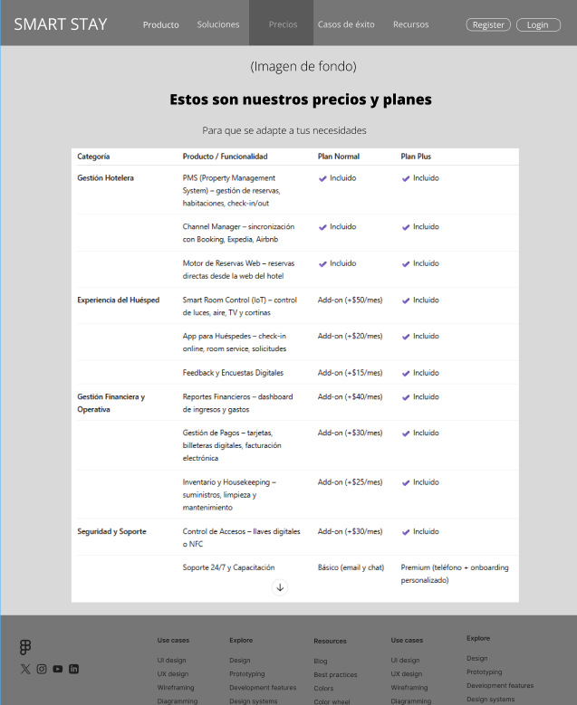
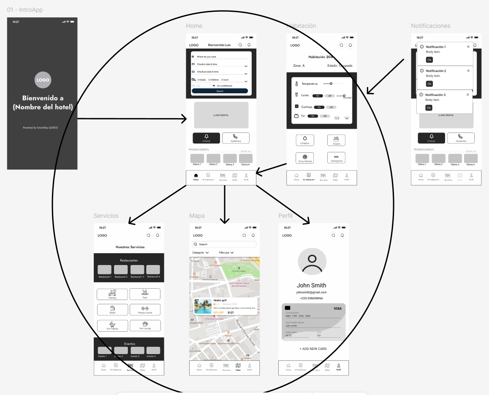

# Universidad Peruana de Ciencias Aplicadas
## Carrera: Ingeniería de Software
## Ciclo: 2025 - 2

## Curso: 1ASI0730 - Aplicaciones Web
## NRC: 7454
## Profesor: Angel Augusto Velasquez Nuñez

# Informe de Trabajo Final
## Startup: Edgerunners
## Producto: Smart Stay

|   Código   |   Apellidos      |     Nombres     |
|:----------:|:----------------:|:---------------:|
| U20221E617 | Verona Flores    | Italo Sebastian |
| U20231A816 |Valverde Portuguez|  Natalia Ximena |
| U202019498 |Fernandez Garfias |  Alexander Piero|
| u20191c464 |Saavedra Angulo   |  Jose Jhonatan  |
|            |                  |                 |

**Mes y Año:** Septiembre 2025

## Registro de Versiones del Informe

El objetivo de esta sección es resumir las modificaciones relevantes que se realizan al informe durante el ciclo de vida del proyecto.  
Esta sección inicia en una página nueva e incluye un cuadro con la siguiente estructura:

| Versión |   Fecha    |                 Autor                 |                 Descripción de los Cambios                  |
|:-------:|:----------:|:-------------------------------------:|:-----------------------------------------------------------:|
|   1.0   | 01/09/2025 | Jose Jhonatan Saavedra Angulo (Líder) |                                                             |
|   1.0   | 01/09/2025 |     Italo Sebastian Verona Flores     | Creación del documento inicial del Informe de Trabajo Final |

## Project Report Collaboration Insights

- URL del repositorio para el Project Report:

<!-- \-\- Enlace pendiente de agregar por el equipo y capturas sobre el avance en el git hub. \-\- -->

## Contenido

- [Capítulo I: Introducción](#capítulo-i-introducción)
  - [1.1. Startup Profile](#11-startup-profile)
    - [1.1.1. Descripción de la Startup](#111-descripción-de-la-startup)
    - [1.1.2. Perfiles de integrantes del equipo](#112-perfiles-de-integrantes-del-equipo)
  - [1.2. Solution Profile](#12-solution-profile)
    - [1.2.1. Antecedentes y problemática](#121-antecedentes-y-problemática)
    - [1.2.2. Lean UX Process](#122-lean-ux-process)
      - [1.2.2.1. Lean UX Problem Statements](#1221-lean-ux-problem-statements)
      - [1.2.2.2. Lean UX Assumptions](#1222-lean-ux-assumptions)
      - [1.2.2.3. Lean UX Hypothesis Statements](#1223-lean-ux-hypothesis-statements)
      - [1.2.2.4. Lean UX Canvas](#1224-lean-ux-canvas)
  - [1.3. Segmentos objetivo](#13-segmentos-objetivo)

- [Capítulo II: Requirements Elicitation & Analysis](#capítulo-ii-requirements-elicitation--analysis)
  - [2.1. Competidores](#21-competidores)
    - [2.1.1. Análisis competitivo](#211-análisis-competitivo)
    - [2.1.2. Estrategias y tácticas frente a competidores](#212-estrategias-y-tácticas-frente-a-competidores)
  - [2.2. Entrevistas](#22-entrevistas)
    - [2.2.1. Diseño de entrevistas](#221-diseño-de-entrevistas)
    - [2.2.2. Registro de entrevistas](#222-registro-de-entrevistas)
    - [2.2.3. Análisis de entrevistas](#223-análisis-de-entrevistas)
  - [2.3. Needfinding](#23-needfinding)
    - [2.3.1. User Personas](#231-user-personas)
    - [2.3.2. User Task Matrix](#232-user-task-matrix)
    - [2.3.3. User Journey Mapping](#233-user-journey-mapping)
    - [2.3.4. Empathy Mapping](#234-empathy-mapping)
  - [2.4. Big Picture EventStorming](#24-big-picture-eventstorming)
  - [2.5. Ubiquitous Language](#25-ubiquitous-language)

- [Capítulo III: Requirements Specification](#capítulo-iii-requirements-specification)
  - [3.1. User Stories](#31-user-stories)
  - [3.2. Impact Mapping](#32-impact-mapping)
  - [3.3. Product Backlog](#33-product-backlog)

- [Capítulo IV: Product Design](#capítulo-iv-product-design)
  - [4.1. Style Guidelines](#41-style-guidelines)
    - [4.1.1. General Style Guidelines](#411-general-style-guidelines)
    - [4.1.2. Web Style Guidelines](#412-web-style-guidelines)
  - [4.2. Information Architecture](#42-information-architecture)
    - [4.2.1. Organization Systems](#421-organization-systems)
    - [4.2.2. Labeling Systems](#422-labeling-systems)
    - [4.2.3. SEO Tags and Meta Tags](#423-seo-tags-and-meta-tags)
    - [4.2.4. Searching Systems](#424-searching-systems)
    - [4.2.5. Navigation Systems](#425-navigation-systems)
  - [4.3. Landing Page UI Design](#43-landing-page-ui-design)
    - [4.3.1. Landing Page Wireframe](#431-landing-page-wireframe)
    - [4.3.2. Landing Page Mock-up](#432-landing-page-mock-up)
  - [4.4. Web Applications UX/UI Design](#44-web-applications-uxui-design)
    - [4.4.1. Web Applications Wireframes](#441-web-applications-wireframes)
    - [4.4.2. Web Applications Wireflow Diagrams](#442-web-applications-wireflow-diagrams)
    - [4.4.3. Web Applications Mock-ups](#443-web-applications-mock-ups)
    - [4.4.4. Web Applications User Flow Diagrams](#444-web-applications-user-flow-diagrams)
  - [4.5. Web Applications Prototyping](#45-web-applications-prototyping)
  - [4.6. Domain-Driven Software Architecture](#46-domain-driven-software-architecture)
    - [4.6.1. Design-Level EventStorming](#461-design-level-eventstorming)
    - [4.6.2. Software Architecture Context Diagram](#462-software-architecture-context-diagram)
    - [4.6.3. Software Architecture Container Diagrams](#463-software-architecture-container-diagrams)
    - [4.6.4. Software Architecture Components Diagrams](#464-software-architecture-components-diagrams)
  - [4.7. Software Object-Oriented Design](#47-software-object-oriented-design)
    - [4.7.1. Class Diagrams](#471-class-diagrams)
  - [4.8. Database Design](#48-database-design)
    - [4.8.1. Database Diagrams](#481-database-diagrams)

- [Capítulo V: Product Implementation, Validation & Deployment](#capítulo-v-product-implementation-validation--deployment)
  - [5.1. Software Configuration Management](#51-software-configuration-management)
    - [5.1.1. Software Development Environment Configuration](#511-software-development-environment-configuration)
    - [5.1.2. Source Code Management](#512-source-code-management)
    - [5.1.3. Source Code Style Guide & Conventions](#513-source-code-style-guide--conventions)
    - [5.1.4. Software Deployment Configuration](#514-software-deployment-configuration)
  - [5.2. Landing Page, Services & Applications Implementation](#52-landing-page-services--applications-implementation)
    - [5.2.1. Sprint n](#521-sprint-n)
      - [5.2.1. Sprint Planning n](#5211-sprint-planning-n)
      - [5.2.1.2. Aspect Leaders and Collaborators](#5212-aspect-leaders-and-collaborators)
      - [5.2.1.3. Sprint Backlog n](#5213-sprint-backlog-n)
      - [5.2.1.4. Development Evidence for Sprint Review](#5214-development-evidence-for-sprint-review)
      - [5.2.1.5. Execution Evidence for Sprint Review](#5215-execution-evidence-for-sprint-review)
      - [5.2.1.6. Services Documentation Evidence for Sprint Review](#5216-services-documentation-evidence-for-sprint-review)
      - [5.2.1.7. Software Deployment Evidence for Sprint Review](#5217-software-deployment-evidence-for-sprint-review)
      - [5.2.1.8. Team Collaboration Insights during Sprint](#5218-team-collaboration-insights-during-sprint)

## Student Outcome

El curso contribuye al cumplimiento del Student Outcome ABET:

### ABET – EAC - Student Outcome 5

Criterio: La capacidad de funcionar efectivamente en un equipo cuyos miembros juntos proporcionan liderazgo, crean un entorno de colaboración e inclusivo, establecen objetivos, planifican tareas y cumplen objetivos. 

En el siguiente cuadro se describe las acciones realizadas y enunciados de conclusiones por parte del grupo, que permiten sustentar el haber alcanzado el logro del ABET – EAC - Student Outcome 5

| Criterio específico                                                                                | Acciones realizadas                                                                                                                                                                                                                                                                                                                                                                                                                                               | Conclusiones                                                                                                                                          |
|----------------------------------------------------------------------------------------------------|-------------------------------------------------------------------------------------------------------------------------------------------------------------------------------------------------------------------------------------------------------------------------------------------------------------------------------------------------------------------------------------------------------------------------------------------------------------------|-------------------------------------------------------------------------------------------------------------------------------------------------------|
| **Trabaja en equipo para proporcionar liderazgo en forma conjunta**                                | **Italo Sebastian Verona Flores** *TB1* Colocar que hiciste en la TB1 (Acciones realizadas)  **Integrante 2** *TB1* Colocar que hiciste en la TB1 (Acciones realizadas)  **Integrante 3** *TB1* Colocar que hiciste en la TB1 (Acciones realizadas)  **Integrante 4** *TB1* Colocar que hiciste en la TB1 (Acciones realizadas)  **Integrante 5** *TB1* Colocar que hiciste en la TB1 (Acciones realizadas) | *TB1* • [Colocar conclusiones del equipo para TB1] • [Colocar conclusiones del equipo para TB1] • [Colocar conclusiones del equipo para TB1] |
| **Crea un entorno colaborativo e inclusivo, establece metas, planifica tareas y cumple objetivos** | **Italo Sebastian Verona Flores** *TB1* Colocar que hiciste en la TB1 (Acciones realizadas)  **Integrante 2** *TB1* Colocar que hiciste en la TB1 (Acciones realizadas)  **Integrante 3** *TB1* Colocar que hiciste en la TB1 (Acciones realizadas)  **Integrante 4** *TB1* Colocar que hiciste en la TB1 (Acciones realizadas)  **Integrante 5** *TB1* Colocar que hiciste en la TB1 (Acciones realizadas) | *TB1* • [Colocar conclusiones del equipo para TB1] • [Colocar conclusiones del equipo para TB1] • [Colocar conclusiones del equipo para TB1] |
# **Capítulo I: Introducción**

## 1.1. Startup Profile

La startup **Smart Stay** surge con el objetivo de transformar la gestión hotelera mediante el uso de tecnologías digitales e Internet of Things (IoT). Su propuesta busca integrar en una sola plataforma la administración de huéspedes, habitaciones y servicios, permitiendo al hotel optimizar recursos y, al mismo tiempo, ofrecer experiencias personalizadas a los clientes.

Entre sus principales características destacan:

- Registro automático de huéspedes mediante sistemas digitales.
- Identificación de habitaciones ocupadas, libres o en mantenimiento.
- Monitoreo de temperatura, iluminación y consumo energético.
- Integración con dispositivos IoT para controlar persianas, temperatura del agua y otros aspectos del confort del huésped.
- Personalización de servicios, como programación de limpieza, room service o entrega de comidas en horarios flexibles.

### 1.1.2. Perfiles de integrantes del equipo

|   Código   |   Apellidos   |     Nombres     |                                                                                                                                                                    Perfil Académico y Profesional                                                                                                                                                                     | Perfil                                       |
|:----------:|:-------------:|:---------------:|:---------------------------------------------------------------------------------------------------------------------------------------------------------------------------------------------------------------------------------------------------------------------------------------------------------------------------------------------------------------------:|----------------------------------------------|
| U20221E617 | Verona Flores | Italo Sebastian | Estudiante de Ingeniería de Software en la Universidad Peruana de Ciencias Aplicadas (UPC). Apasionado por la tecnología y el desarrollo de software, con habilidades en programación web, bases de datos y diseño de interfaces. Experiencia en proyectos académicos y personales que demuestran su capacidad para trabajar en equipo y resolver problemas técnicos. |  |
| U202019498 | Fernández Garfias | Alexander Piero | Estudiante de Ingeniería de Software en la Universidad Peruana de Ciencias Aplicadas (UPC). Interesado en el desarrollo de aplicaciones móviles y web, con conocimientos en Java para Android, Flutter y HTML básico. Participa en proyectos académicos donde aplica sus habilidades técnicas y fortalece su capacidad de trabajo en equipo. | |                                                                                                                                                                  |                                              |            |               |                 |                    |
|            |               |                 |                                                                                                                                                                                                                                                                                                                                                                       |                                              |            |               |                 |                    |
|            |               |                 |                                                                                                                                                                                                                                                                                                                                                                       |                                              |            |               |                 |                    |
|            |               |                 |                                                                                                                                                                                                                                                                                                                                                                       |                                              |            |               |                 |                    |

---

## 1.2. Solution Profile

### 1.2.1. Antecedentes y problemática

### **Who? (¿Quiénes?)**
El problema afecta principalmente a los administradores y personal operativo de hoteles, así como a los huéspedes que buscan una experiencia personalizada y eficiente. El personal del hotel debe gestionar manualmente múltiples aspectos como registro de huéspedes, control de habitaciones, servicios de limpieza y gestión de inventarios.

### **What? (¿Qué?)**
El problema central es la falta de automatización y digitalización en la gestión hotelera integral. Esto incluye la gestión manual de reservas, control ineficiente de habitaciones, falta de personalización en la experiencia del huésped, y monitoreo deficiente de recursos y servicios del hotel.

### **Where? (¿Dónde?)**
La problemática se presenta en todas las áreas del hotel: recepción, habitaciones, áreas de servicio, cocina, limpieza, y en la gestión administrativa. También afecta la experiencia del huésped dentro de su habitación y en su interacción con los servicios del hotel.

### **When? (¿Cuándo?)**
Ocurre durante las 24 horas del día, los 7 días de la semana, especialmente durante las horas pico de check-in/check-out, temporadas altas, y cuando hay múltiples solicitudes simultáneas de servicios por parte de los huéspedes.

### **Why? (¿Por qué?)**
El problema existe debido a la dependencia de sistemas tradicionales de gestión hotelera que no están integrados, la falta de automatización en el control de habitaciones y servicios, y la ausencia de tecnología IoT que permita el monitoreo en tiempo real y la personalización de la experiencia del huésped.

### **How? (¿Cómo?)**
El personal debe realizar múltiples tareas manuales como verificar disponibilidad de habitaciones, coordinar servicios de limpieza, gestionar pedidos de room service, controlar inventarios, y atender solicitudes de huéspedes sin un sistema centralizado. Los huéspedes no pueden personalizar su estancia de manera autónoma y deben depender del personal para ajustes básicos.

### **How Much? (¿Cuánto?)**
La ineficiencia operativa puede representar pérdidas de 15-20% en productividad del personal, incremento en costos operativos por uso ineficiente de recursos (energía, agua, suministros), y una disminución en la satisfacción del cliente que puede afectar las reseñas y la ocupación futura. El costo de oportunidad incluye la pérdida de huéspedes que buscan experiencias más modernas y personalizadas.

### 1.2.2 Lean UX Process

#### 1.2.1.1 Lean UX Problem Statements.

**Problem Statement: Gestión Manual de Habitaciones**

Nuestro servicio de gestión hotelera busca optimizar la experiencia tanto del personal del hotel como de los huéspedes a través de una plataforma integrada que conecte todos los aspectos operativos del hotel. A través de nuestro servicio, los administradores hoteleros pueden gestionar eficientemente las habitaciones, servicios y recursos del hotel mientras los huéspedes pueden personalizar su experiencia de estancia.

Hemos observado un factor crítico que afecta la eficiencia operativa: la gestión manual de habitaciones y servicios que genera ineficiencias, errores en la disponibilidad y falta de personalización en tiempo real. Actualmente, el personal debe verificar manualmente el estado de las habitaciones, coordinar servicios de limpieza y atender solicitudes de huéspedes sin un sistema centralizado que permita automatización y monitoreo en tiempo real.

**Business Outcome:**

Objective (O): Mejorar la eficiencia operativa del hotel en el primer ciclo de 4 meses.
Key Results (KR):

Reducir en 15% el tiempo promedio de check-in y check-out.

Disminuir en 10% los costos de operación relacionados con procesos manuales.

Alcanzar al menos 80% de adopción del sistema por parte del personal administrativo en tareas diarias.

**User Outcome:**

Objective (O): Brindar una experiencia de gestión más rápida y clara para huéspedes y personal.
Key Results (KR):

Lograr que los huéspedes completen su check-in digital en menos de 3 minutos.

Obtener una calificación de satisfacción de usuarios (NPS o encuesta) de al menos 8/10 en la nueva experiencia de registro.

Asegurar que el 70% de los usuarios recurrentes utilicen la funcionalidad digital sin necesidad de asistencia del personal.

#### 1.2.2.2. Lean UX Assumptions

1. Creo que mis clientes necesitan
Una solución integral de gestión hotelera que automatice procesos operativos, optimice el uso de recursos y proporcione una experiencia personalizada a los huéspedes mediante tecnología IoT.

2. Estas necesidades se pueden resolver con
Una plataforma web SaaS integrada con dispositivos IoT que permita el monitoreo en tiempo real de habitaciones, automatización de servicios hoteleros y control personalizado del ambiente por parte de los huéspedes.

3. Mis clientes iniciales son (o serán)
Hoteles boutique y de lujo (3-5 estrellas) de 50-200 habitaciones ubicados en zonas turísticas de Lima Metropolitana, seguidos por cadenas hoteleras medianas y hoteles de negocios.

4. El valor #1 que un cliente quiere de mi servicio es
Optimización operativa que reduzca costos y mejore la eficiencia del personal, junto con una experiencia diferenciada para huéspedes que aumente la satisfacción y calificaciones del hotel.

5. El cliente también puede obtener estos beneficios adicionales
   - Reducción del 20-30% en costos de servicios públicos
   - Dashboards analíticos para toma de decisiones basada en datos
   - Integración con sistemas de gestión hotelera existentes
   - Reportes automatizados de ocupación y rendimiento
   - Marketing personalizado basado en preferencias de huéspedes
 
6. Voy a adquirir la mayoría de mis clientes a través de
Marketing directo a hoteles, participación en ferias de turismo y hospitalidad, partnerships con proveedores de sistemas hoteleros existentes, y referencias de clientes satisfechos.

7. Haré dinero a través de
Modelo de suscripción mensual escalonado según el número de habitaciones del hotel, más tarifas de instalación inicial de dispositivos IoT y servicios de consultoría para implementación.

8. Mi competencia principal en el mercado será
Sistemas de gestión hotelera tradicionales como Oracle Hospitality, Amadeus, y startups de hoteltech como Smartpricing y RoomRaccoon, así como proveedores de soluciones IoT para hospitalidad.

9. Los venceremos debido a
Nuestra integración completa entre gestión hotelera y tecnología IoT, enfoque específico en personalización del huésped, interface intuitiva, y capacidad de generar ROI medible a través de optimización de recursos.

10. Mi mayor riesgo de producto es
La resistencia de los hoteles a adoptar nueva tecnología, problemas de conectividad o confiabilidad de dispositivos IoT, y los altos costos iniciales de implementación que pueden desalentar a hoteles pequeños.

11. Resolveremos esto a través de
    - Programa piloto con descuentos para early adopters
    - Soporte técnico 24/7 durante implementación
    - Garantías de tiempo de actividad y planes de contingencia
    - Modelos de financiamiento flexibles
    - Capacitación integral para personal hotelero

12. ¿Qué otras suposiciones tenemos que, si se prueba que es falso, causará que nuestro negocio/proyecto no funcione?

    - Los hoteles tienen infraestructura WiFi suficiente para soportar dispositivos IoT
    - Los huéspedes están dispuestos a interactuar con tecnología durante su estancia
    - El personal hotelero puede adaptarse a herramientas digitales sin resistencia significativa
    - Los dispositivos IoT tendrán una vida útil de al menos 3-5 años
    - Las regulaciones de privacidad y seguridad no impedirán la recolección de datos de habitaciones
    - El retorno de inversión será visible en los primeros 6-12 meses de implementación

#### 1.2.2.3. Lean UX Hypothesis Statements

**Hypothesis 1: Check-in/Check-out Digital**
**Creemos que** implementar un sistema de check-in y check-out digital automatizado para huéspedes y personal de recepción reducirá en 15% el tiempo promedio de estos procesos.
**Sabremos que hemos tenido éxito**
**Cuando veamos** que los huéspedes completan su registro en menos de 3 minutos y el 70% utiliza el sistema digital sin necesidad de asistencia del personal.

**Hypothesis 2: Adopción del Personal Administrativo**
**Creemos que** proporcionar una plataforma intuitiva de gestión hotelera con capacitación integral para personal administrativo logrará al menos 80% de adopción del sistema en tareas diarias.
**Sabremos que esto es cierto**
**Cuando veamos** un uso diario constante del sistema por parte del personal y una reducción del 10% en costos operativos manuales después de 4 meses de implementación.

**Hypothesis 3: Satisfacción del Usuario**
**Creemos que** ofrecer una experiencia de gestión digital más rápida y clara para huéspedes y personal del hotel mejorará significativamente la satisfacción general.
**Sabremos que hemos tenido éxito**
**Cuando veamos** una calificación de satisfacción de al menos 8/10 en encuestas NPS y que el 70% de usuarios recurrentes utilicen las funcionalidades sin asistencia.

**Hypothesis 4: Optimización de Recursos IoT**
**Creemos que** integrar dispositivos IoT para monitoreo de temperatura, luz y consumo energético para administradores hoteleros optimizará el uso de recursos del hotel.
**Sabremos que esto es cierto**
**Cuando veamos** una reducción del 20% en gastos de servicios públicos y reportes detallados de consumo que permitan mejor control de recursos durante el período de 4 meses.

**Hypothesis 5: Personalización de la Experiencia**
**Creemos que** permitir a los huéspedes controlar directamente el ambiente de su habitación y programar servicios aumentará su satisfacción y consumo de servicios adicionales.
**Sabremos que hemos tenido éxito**
**Cuando veamos** un aumento del 25% en la satisfacción del cliente en encuestas post-estadía y un incremento del 15% en pedidos de room service y servicios opcionales.

**Hypothesis 6: Adopción de Hoteles Piloto**
**Creemos que** ofrecer un modelo de suscripción escalable con implementación gradual para hoteles boutique y pequeños en Lima generará interés y participación en nuestro programa piloto.
**Sabremos que esto es cierto**
**Cuando veamos** la participación de al menos 3 hoteles en nuestro piloto universitario con acuerdos firmados de colaboración y confirmación de implementación post-desarrollo.

**Hypothesis 7: Ventaja Competitiva**
**Creemos que** nuestra integración completa entre gestión hotelera tradicional y tecnología IoT para hoteles que buscan modernización nos dará ventaja sobre sistemas tradicionales.
**Sabremos que hemos tenido éxito**
**Cuando veamos** que los hoteles piloto reporten mejoras operativas específicas y expresen preferencia por nuestra solución versus alternativas como Oracle Hospitality o gestión manual.

#### 1.2.2.4. Lean UX Canvass

## 1.3. Segmentos objetivos.

Esta sección incluye la descripción de los segmentos asociados al dominio del problema de gestión hotelera manual e ineficiente, incluyendo características demográficas e información estadística de sustento.

**Segmento Primario: Administradores de Hoteles Boutique y Pequeños en Lima**

**Características Demográficas:**

- **Edad**: Entre 35 y 50 años (basado en estudios regionales)
- **Nivel educativo**: Técnico o universitario en administración hotelera, turismo o áreas afines
- **Experiencia profesional**: 5-15 años en el sector hotelero, especialmente en hoteles de 3-4 estrellas
- **Cargo**: Gerentes generales, administradores, directores de operaciones

**Información del Sector:**

- **Número de hoteles**: Más de 300 hoteles pequeños (20-100 habitaciones) en Lima Metropolitana
- **Categorías**: Principalmente 3-4 estrellas
- **Ubicación**: Concentrados en Miraflores, San Isidro, Barranco y Centro Histórico
- **Tipo**: Hoteles boutique e independientes

**Inversión en Tecnología**
- **Presupuesto anual**: Entre $1,000 y $5,000 USD para sistemas de gestión y automatización
- **Adopción**: Transición lenta pero creciente hacia sistemas digitales
- **Apoyo**: Capacitaciones y subsidios tecnológicos disponibles a través de FEDECATUR

**Desafíos Operativos Identificados**
- Falta de acceso a financiamiento para modernización tecnológica
- Altos costos operativos por procesos manuales y baja eficiencia
- Tiempo excesivo dedicado a tareas administrativas (reduce atención al cliente)
- Impacto del tipo de cambio y estacionalidad que limita inversiones
- Muchos hoteles pequeños aún operan con procesos manuales en contabilidad, reservas y atención al cliente

---

**Segmento Secundario: Huéspedes de Hoteles**

**Perfil Demográfico**
- **Edad**: Entre 25 y 45 años (alta presencia de millennials y jóvenes profesionales)
- **Nivel socioeconómico**: Medio-alto a alto, con capacidad de gasto superior al promedio
- **Procedencia**:
    - **Internacional**: 40% - turistas de EE.UU., Europa, Chile y Colombia
    - **Nacional**: 60% - limeños y viajeros de Arequipa y Cusco que buscan experiencias urbanas modernas

**Comportamiento de Viaje**
- **Frecuencia**: 2-4 viajes al año, combinando ocio y trabajo (bleisure)
- **Duración promedio**: 2-5 noches en hoteles boutique
- **Gasto promedio**: $90-180 USD por noche (dependiendo del distrito y categoría)

**Preferencias Tecnológicas**
- **68%** elige hoteles con buena reputación digital (reseñas, presencia en redes, apps de reserva)
- **Dispuestos a pagar más** por experiencias digitales como:
    - Check-in sin contacto
    - Control de habitación vía app
    - WiFi de alta velocidad
    - Smart TV y asistentes virtuales

**Uso de Tecnología Durante la Estadía**
- **Dispositivo principal**: Smartphones para gestionar toda la estadía
- **Servicios esperados**:
    - WiFi gratuito y rápido
    - Apps del hotel para servicios internos
    - Integración con WhatsApp o Booking Pulse para atención al cliente
- **Gestión digital**: Reservas, pagos, mapas, recomendaciones

**Mercado Hotelero Boutique en Lima**
- **Total de hoteles**: Más de 2,000 hoteles registrados en Lima, con una parte significativa siendo boutique o pequeños
- **Hoteles destacados**: Pullman Lima Miraflores y Vignette Collection SOUMA (integran tecnología y diseño moderno)
- **Crecimiento**: Sostenido en el segmento boutique, impulsado por viajeros que valoran experiencias personalizadas y digitales
- **Ingresos adicionales**: 10-20% del total provienen de servicios digitales (upgrades, experiencias virtuales, tours online) en hoteles bien posicionados

**Datos de Sustento Estadístico**

**Oportunidad de Mercado**
- Lima cuenta con más de 300 hoteles pequeños objetivo para Smart Stay
- El 68% de huéspedes valora la reputación digital del hotel
- Los ingresos por servicios digitales representan hasta 20% del total en hoteles tecnológicamente avanzados
- Crecimiento sostenido del segmento boutique impulsado por demanda de experiencias digitales personalizadas

**Validación del Mercado Objetivo**

Esta información proporciona una base sólida para validar que existe un mercado objetivo claro y definido para la solución Smart Stay, con necesidades específicas tanto del lado de la oferta (administradores) como de la demanda (huéspedes tech-savvy).

# **Capítulo II: Requirements Elicitation & Analysis**

## 2.1. Competidores.

El mercado de soluciones para gestión hotelera en Lima y a nivel global presenta diversos actores que ofrecen herramientas digitales, sistemas tracionales de gestión y, en menor medida, plataformas integradas con IoT. Se identificaron los principales competidores:

#### 2.1.1 Análisis Competitivo.

El análisis competitivo permite identificar las fortalezas, debilidades y estrategias de los principales actores del mercado en comparación con la propuesta de **Smart Stay**.  

---

### Matriz comparativa de competidores

| **Perfil** | **Smart Stay** | **Oracle Hospitality** | **Amadeus Hospitality** | **Mapache de la Habitación** | **Precios Inteligentes** | **Locales de Startups** | **Manuales de sistemas** |
|------------|----------------|-------------------------|--------------------------|------------------------------|--------------------------|--------------------------|---------------------------|
| **Overview** | Plataforma integral de gestión hotelera con enfoque en hoteles boutique y medianos, incorporando IoT y personalización del huésped. | Soluciones globales y completas para gestión de grandes cadenas hoteleras. | Amplia escalabilidad y fuerte presencia internacional en hoteles de cadena. | SaaS en la nube, intuitivo, orientado a hoteles pequeños. | Especializado en revenue management mediante IA. | Plataformas económicas de gestión con soporte en español. | Sistemas tradicionales manuales o básicos de baja tecnología. |
| **Ventaja competitiva / Valor al cliente** | Accesibilidad, personalización de la experiencia, integración IoT. | Reconocimiento global, soluciones integrales para grandes cadenas. | Escalabilidad para cadenas internacionales. | Facilidad de uso y simplicidad para hoteles pequeños. | Optimización avanzada de precios con IA. | Precios bajos, integración básica con canales de reserva. | Costo bajo y simplicidad. |
| **Mercado objetivo** | Hoteles boutique, medianos y en crecimiento en LATAM. | Grandes cadenas hoteleras globales. | Cadenas internacionales y corporativos. | Hoteles pequeños y en crecimiento. | Cadenas y hoteles con enfoque en maximizar ingresos. | Pequeños hoteles y emprendimientos locales. | Hoteles pequeños con recursos limitados. |
| **Estrategias de marketing** | Enfoque local (LATAM), diferenciación por IoT y experiencia del huésped. | Branding global y posicionamiento corporativo. | Alianzas estratégicas con cadenas internacionales. | Estrategia digital enfocada en facilidad de uso. | Marketing basado en innovación tecnológica (IA). | Propuesta de accesibilidad y soporte local. | Costos bajos y adopción por necesidad. |

---

### Perfil de negocio  

| **Dimensión** | **Smart Stay** | **Competidores** |
|---------------|----------------|------------------|
| **Productos & Servicios** | PMS + IoT + personalización de huésped. | Gestión hotelera tradicional, revenue management, SaaS simples o manuales. |
| **Precios & Costos** | Accesibles y escalables. | Desde muy elevados (Oracle, Amadeus) hasta muy bajos (manuales/startups). |
| **Canales de distribución** | Web, móvil, soporte local en español. | Globales (Oracle/Amadeus), digitales limitados (otros SaaS), presenciales (manuales). |

---

### Análisis SWOT comparativo  

| | **Smart Stay** | **Competidores** |
|---|---------------|------------------|
| **Fortalezas** | Enfoque local, personalización, IoT, integración completa. | Reconocimiento global (Oracle, Amadeus), IA especializada (Precios Inteligentes), simplicidad (Mapache). |
| **Debilidades** | Menor reconocimiento global, menor penetración inicial. | Altos costos, baja personalización, falta de soporte local o limitaciones funcionales. |
| **Oportunidades** | Creciente digitalización en LATAM, demanda de soluciones accesibles. | Expansión en mercados emergentes. |
| **Amenazas** | Entrada de grandes jugadores al mercado LATAM, cambios tecnológicos rápidos. | Innovación constante de startups locales. |

#### 2.1.2  Estrategias y Tácticas frente a Competidores.

Para posicionarse de manera efectiva frente a los competidores,  **Smart Stay** implementará las siguientes estrategias: 

#### Estrategias

1. **Diferenciación Tecnológica**: Integrar gestión hotelera con IoT, algo que los competidores actuales no ofrecen de manera completa.
2. **Enfoque en nicho**: Dirigirse a hoteles boutique y pequeños (20-100 habitaciones), un segmento poco atendido por gigantes como Oracle o Amadeus.
3. **Modelo de suscripción accesible**: Precios escalables según número de habitaciones, permitiendo competir contra soluciones costosas sin sacrificar funcionalidad.
4. **Soporte local y en español**: Acompañamiento cercano que mejora la adopción frente a competidores extranjeros.
5. **Valor medible**: Promesa clara de reducción de costos operativos (10-20%)

#### Tácticas

- **Programa píloto** con hoteles boutique de lima para generar casos de éxito y testimonios.
- **Alianzas estratégicas** con gremios turísticos (ej. FEDECATUR) para acelerar la adopción.
- **Capacitación continua** para el personal hotelero, disminuyendo resistencia al cambio.
- **Marketing digital enfocado en ROI**: Mostrar comparativas de costos y beneficios frente a sistemas tracicionales
- **Integraciones rápidas** con PMS existentes para facilitar la migración y reduccir fricciones.
- **Atencion postventa 24/7** como ventaja competitiva sobre startups con soporte limitado. 

## 2.1. Entrevistas.
Con el objetivo de profundizar en las necesidades y expectativas de los segmentos objetivos, se realizaron entrevistas semiestructuradas a administradores de hoteles boutique y a huéspedes. Esta información cualitativa sirvió como base para identificar problemáticas actuales y orientar la definición de requisitos del sistema.

#### 2.1.2  Diseño de entrevistas

### Entrevista – Segmento 1: Administradores de Hoteles Boutique y Pequeños

1. ¿Cómo te llamas y qué cargo ocupas en el hotel?  
2. ¿En qué distrito o ciudad se encuentra el hotel?  
3. ¿Cuántas habitaciones y personal gestionan aproximadamente?  
4. ¿Podrías contarme cómo es un día típico de trabajo administrando el hotel?  
5. ¿Qué tan seguido deben gestionar procesos como reservas, check-in/check-out o facturación?  
6. ¿Cómo suelen organizar actualmente la gestión de reservas y pagos?  
7. ¿Han tenido dificultades con sobrerreservas, disponibilidad de habitaciones o errores de facturación?  
8. ¿Qué dispositivos usas con mayor frecuencia para gestionar el hotel?  
9. ¿Qué aplicaciones o sistemas usas actualmente en tu día a día para el manejo del hotel?  
10. ¿Has tenido alguna dificultad o experiencia negativa al usarlas?  
11. ¿Qué te motivaría a adoptar una nueva herramienta digital para centralizar reservas, pagos y tareas del personal?  
12. Si una herramienta digital lograra optimizar tus operaciones y reducir tus costos, ¿cómo valorarías invertir en una suscripción mensual para acceder a ella?  
13. ¿Cuáles son tus principales preocupaciones respecto a la gestión del hotel?

### Entrevista – Segmento 2: Huéspedes de Hoteles

1. ¿Cómo te llamas y con qué frecuencia viajas por turismo o trabajo?
2. ¿Qué tipo de hotel sueles elegir (boutique, cadena internacional, Airbnb, etc.) y por qué?
3. ¿Qué valoras más en un hotel: ubicación, precio, comodidad o servicios digitales?
4. ¿Cómo fue tu última experiencia de check-in y check-out? ¿Qué mejorarías?
5. ¿Qué tan importante es para ti poder personalizar tu habitación (temperatura, luz, limpieza, room service) desde tu celular u otro dispositivo tecnológico?
6. ¿Qué servicios digitales utilizas más durante tu estadía en un hotel (WiFi, app del hotel, WhatsApp, smart TV, llaves digitales)?
7. ¿Has tenido experiencias negativas con la gestión del hotel (esperas largas, problemas con el servicio, falta de personalización)?
8. ¿Qué opinas de un sistema que te permita hacer check-in sin pasar por recepción y controlar tu habitación desde una app?
9. ¿Estarías dispuesto a pagar un poco más por un hotel que ofrezca experiencias digitales y personalización avanzada? ¿Cuánto aproximadamente?
10. ¿Qué tanto influyen las reseñas digitales y la reputación online en tu decisión de reservar un hotel?
11. Si un hotel ofreciera un servicio totalmente digitalizado, ¿qué expectativa tendrías respecto al trato humano? ¿Lo consideras un valor agregado o no es necesario?
12. ¿Qué recomendarías para que la experiencia digital en un hotel sea cómoda y no complicada para los huéspedes?

### 2.2.2. Registro de entrevistas

### Entrevista – Segmento 1: Administradores de Hoteles Boutique y Pequeños

#### Entrevista 1

Datos del entrevistado:

**Nombre completo:** Adrian Saavedra Angulo 

**Edad:** 34 años

**Ciudad:** Tarapoto 

**Duración:** 8:07 minutos

**Evidencia:** 

**Resumen de la entrevista**

Adrián administra un hotel de 12 habitaciones en Tarapoto con un equipo de 6 personas. Su rutina diaria incluye revisar reservas, coordinar limpieza, organizar recojos y responder a nuevas solicitudes. Los procesos de reservas y facturación son constantes por el alto movimiento del negocio.
Aunque cuentan con un sistema propio, han tenido problemas de sobreventa porque no se sincroniza con todas las plataformas, lo que obliga a actualizaciones manuales y genera errores. Adrián estaría motivado a usar una herramienta que centralice la gestión y se integre con plataformas externas, siempre que el costo de suscripción sea razonable.

**URL del video:** [https://shorturl.at/7UPcY](https://upcedupe-my.sharepoint.com/:v:/g/personal/u20191c464_upc_edu_pe/ESyVWXpzLu5BntGjGocrfCQBzbC6LcTyvE1fJR1lpZgD7g?nav=eyJyZWZlcnJhbEluZm8iOnsicmVmZXJyYWxBcHAiOiJTdHJlYW1XZWJBcHAiLCJyZWZlcnJhbFZpZXciOiJTaGFyZURpYWxvZy1MaW5rIiwicmVmZXJyYWxBcHBQbGF0Zm9ybSI6IldlYiIsInJlZmVycmFsTW9kZSI6InZpZXcifX0%3D&e=croANB)

---

#### Entrevista 2

Datos del entrevistado:

**Nombre completo:** Monica Hernandez Vela 

**Edad:** 33 años

**Ciudad:** Tarapoto 

**Duración:** 5:53 minutos

**Evidencia:** 

**URL del video:** [https://shorturl.at/7UPcY](https://upcedupe-my.sharepoint.com/:v:/g/personal/u20191c464_upc_edu_pe/EdqJPIq2kS1Jv-WFlDlGmQsBrYHjn4HfJhkJQcrdY9D9BQ?e=NfHBpW&nav=eyJyZWZlcnJhbEluZm8iOnsicmVmZXJyYWxBcHAiOiJTdHJlYW1XZWJBcHAiLCJyZWZlcnJhbFZpZXciOiJTaGFyZURpYWxvZy1MaW5rIiwicmVmZXJyYWxBcHBQbGF0Zm9ybSI6IldlYiIsInJlZmVycmFsTW9kZSI6InZpZXcifX0%3D)

**Resumen de la entrevista**

Mónica administra un hotel de 12 habitaciones en Tarapoto con un equipo de 4 personas. Su rutina diaria incluye organizar los desayunos, coordinar la limpieza, asignar habitaciones, atender a los turistas y revisar constantemente las reservas. Utiliza un sistema propio a través de la página web del hotel, gestionado principalmente desde laptops y computadoras, y se comunica con su personal mediante WhatsApp.
Ha tenido dificultades con el uso del sistema actual y señala que le motivaría adoptar una herramienta digital que centralice la gestión de reservas y operaciones, siempre que pueda adaptarse a las características de su hotel. Considera razonable pagar una suscripción mensual si contribuye a mejorar los servicios del establecimiento.

---

#### Entrevista 3

Datos del entrevistado:
**Nombre completo:** Alejandra Beltrán Diaz

**Edad:** 23 años

**Ciudad:** Tarapoto 

**Duración:** 4:11 minutos

**Evidencia:** 

**URL del video:** [https://shorturl.at/7UPcY](https://upcedupe-my.sharepoint.com/:v:/g/personal/u20191c464_upc_edu_pe/EafROYDObWhKpbd2D1HKOVYBNtkLrBMdElD0yQFrdCl0ZA?e=1qSp39&nav=eyJyZWZlcnJhbEluZm8iOnsicmVmZXJyYWxBcHAiOiJTdHJlYW1XZWJBcHAiLCJyZWZlcnJhbFZpZXciOiJTaGFyZURpYWxvZy1MaW5rIiwicmVmZXJyYWxBcHBQbGF0Zm9ybSI6IldlYiIsInJlZmVycmFsTW9kZSI6InZpZXcifX0%3D)

**Resumen de la entrevista**

Valeria Alejandra administra un hotel de 19 habitaciones junto a un equipo de 5 personas. Su día típico comienza organizando al personal de limpieza, revisando las reservas recibidas por WhatsApp y luego trasladándolas a un archivo Excel para llevar el control. Su principal herramienta es este archivo, aunque reconoce que no siempre guarda correctamente la información, lo que ha ocasionado problemas con reservas perdidas.
También ha tenido experiencias negativas con WhatsApp, ya que a veces resulta difícil ubicar las reservas registradas en la aplicación. Para ella, un sistema ideal de gestión debería incluir notificaciones automáticas que recuerden las reservas del día. Valeria considera que pagar una suscripción mensual sería una buena opción si la herramienta realmente simplifica las labores administrativas del hotel.

---

### Entrevista – Segmento 2: Huéspedes de Hoteles Boutique

---

#### Entrevista 1

Datos del entrevistado:

**Nombre completo:** Diego Michael Segura Martínez

**Edad:** 25 años

**Distrito:** Santa Anita – Lima Metropolitana

**Duración:** 5:34 minutos

**Evidencia:** 

**URL del video:** [https://shorturl.at/7UPcY](https://upcedupe-my.sharepoint.com/:v:/g/personal/u202019498_upc_edu_pe/Ecu4CtT8NWxKgN-Lk8cgX0MB0LMVwWwuwQo6Bmx0fNUlCg?e=tbxK6m&nav=eyJyZWZlcnJhbEluZm8iOnsicmVmZXJyYWxBcHAiOiJTdHJlYW1XZWJBcHAiLCJyZWZlcnJhbFZpZXciOiJTaGFyZURpYWxvZy1MaW5rIiwicmVmZXJyYWxBcHBQbGF0Zm9ybSI6IldlYiIsInJlZmVycmFsTW9kZSI6InZpZXcifX0%3D)

**Resumen de la entrevista**

Diego suele hospedarse en hoteles cuando viaja, principalmente con su pareja y en menor medida con su familia. Prefiere hoteles cómodos, con privacidad y buena experiencia. Valora la comodidad y los servicios digitales que simplifiquen su estadía.
Su principal frustración son las esperas en recepción y la falta de personalización. Le atrae la idea de un sistema digital que permita check-in/check-out sin filas y control de la habitación desde el celular (luz, temperatura, room service).
Utiliza principalmente WiFi y Smart TV, pero estaría dispuesto a usar una app centralizada. Confía en las reseñas digitales para tomar decisiones y estaría dispuesto a pagar entre 10% y 15% más por un hotel con experiencias digitales avanzadas.
Considera que el trato humano sigue siendo un valor agregado, aunque la digitalización es clave. Recomienda que los sistemas sean fáciles de usar y que cada hotel cuente con una página clara con descripción completa y disponibilidad de habitaciones en tiempo real.

---

#### Entrevista 2

Datos del entrevistado:

**Nombre completo:** Juan Salcedo  

**Edad:** 44 años

**Distrito:** San Borja – Lima Metropolitana

**Duración:** 6:11 minutos

**Nombre:** Juan Salcedo  
**Edad:** 44 años  
**Distrito:** San Borja

**Evidencia:** 

**URL del video:** [https://shorturl.at/7UPcY](https://upcedupe-my.sharepoint.com/:v:/g/personal/u20221e617_upc_edu_pe/ERPriyAe3RlMlJHW2WouYN8BTLnggzX4JPIaQq2eElKZXQ?nav=eyJyZWZlcnJhbEluZm8iOnsicmVmZXJyYWxBcHAiOiJPbmVEcml2ZUZvckJ1c2luZXNzIiwicmVmZXJyYWxBcHBQbGF0Zm9ybSI6IldlYiIsInJlZmVycmFsTW9kZSI6InZpZXciLCJyZWZlcnJhbFZpZXciOiJNeUZpbGVzTGlua0NvcHkifX0&e=wfbeZY)  

**Resumen de la entrevista**

Juan viaja por trabajo cada 1-2 meses y prefiere alojamientos cómodos, autónomos y con buena conectividad, optando principalmente por Airbnb y, en menor medida, por hoteles. Valora especialmente la ubicación céntrica, el Wi-Fi de calidad y la facilidad tecnológica. Considera que los horarios estrictos de check-in y check-out son una gran limitación, y aunque nunca ha usado una habitación totalmente “smart”, le interesa la idea, aunque cree que aún no está bien implementada en Perú. No pagaría más por funciones digitales avanzadas, ya que las asocia con un público más joven. Usa Wi-Fi como servicio indispensable, junto con laptop y smartphone, y ha tenido experiencias negativas relacionadas con demoras en la atención y falta de limpieza, además de percibir una falta de personalización en el servicio. Recomienda priorizar la mejora del Wi-Fi (fibra óptica) y mantener una atención eficiente, considerando que la digitalización debe complementar, pero no reemplazar, el buen trato humano.

---

#### Entrevista 3

Datos del entrevistado:

**Nombre completo:** Tadeo Loja Beloglio 

**Edad:** 22 años

**Distrito:** Santiago de Surco – Lima Metropolitana

**Duración:** 7:21 minutos

**Evidencia:** 

**URL del video:** [Entrevista-3](https://upcedupe-my.sharepoint.com/:v:/g/personal/u20201f051_upc_edu_pe/EX5Eq-XT8MdGnWsqsTcHL7MBqeTy6xG91s4YoE9WcsRY_w?nav=eyJyZWZlcnJhbEluZm8iOnsicmVmZXJyYWxBcHAiOiJTdHJlYW1XZWJBcHAiLCJyZWZlcnJhbFZpZXciOiJTaGFyZURpYWxvZy1MaW5rIiwicmVmZXJyYWxBcHBQbGF0Zm9ybSI6IldlYiIsInJlZmVycmFsTW9kZSI6InZpZXcifX0%3D&e=0XZvvA)

**Resumen de la entrevista**

Tadeo viaja por turismo una vez al año y suele elegir hoteles de cadenas internacionales porque le ofrecen mayor confianza y calidad de servicio, aunque también considera opciones boutique si el precio es conveniente. Lo que más valora es el precio y la comodidad, seguido de la ubicación. Su última experiencia de check-in fue lenta, mientras que el check-out resultó rápido, por lo que cree que ambos procesos deberían digitalizarse.

No considera esencial la personalización de la habitación, pero sí cómodo poder controlar luz y temperatura desde el celular. Durante sus estadías utiliza principalmente el WiFi y la smart TV, y le gustaría contar con llaves digitales.

Entre los problemas que ha tenido destacan las largas esperas en recepción y la falta de coordinación en la limpieza. Considera muy práctico un sistema de check-in digital y control de la habitación mediante una app, y estaría dispuesto a pagar hasta un 5% más por ello siempre que mejore la experiencia.

Las reseñas digitales influyen en un 70% en su decisión de reserva. Para él, el trato humano sigue siendo un valor agregado incluso en un hotel digitalizado, y recomienda que la experiencia digital se concentre en una app única, sencilla y con asistencia rápida.

---
## Entrevista 4

Datos del entrevistado:

**Nombre completo:** Joaquin Fernandez

**Edad:** 21 años

**Distrito:** Santiago de Surco – Lima Metropolitana

**Duración:** 4:44 minutos

**Evidencia:** 

**Enlace al video en Microsoft Stream:** [Entrevista-4](https://upcedupe-my.sharepoint.com/:v:/g/personal/u20201f051_upc_edu_pe/EfHhd4ZVeqNEuji_fhRH2HABSjkFsOZnYobTIIqx-BN9nw?nav=eyJyZWZlcnJhbEluZm8iOnsicmVmZXJyYWxBcHAiOiJTdHJlYW1XZWJBcHAiLCJyZWZlcnJhbFZpZXciOiJTaGFyZURpYWxvZy1MaW5rIiwicmVmZXJyYWxBcHBQbGF0Zm9ybSI6IldlYiIsInJlZmVycmFsTW9kZSI6InZpZXcifX0%3D&e=eCsesR)  

**Resumen de la entrevista**

Joaquín viaja por turismo una vez al año y suele elegir hoteles sencillos o Airbnb por ser accesibles y prácticos, aunque también considera los boutique si el precio es conveniente. Lo que más valora es el precio y la comodidad, seguido de la ubicación.
Su última experiencia de check-in fue lenta, mientras que el check-out resultó rápido, por lo que cree que ambos procesos deberían digitalizarse. No considera esencial la personalización de la habitación, pero sí cómodo poder controlar luz
y temperatura desde el celular. Durante sus estadías utiliza principalmente el WiFi y la smart TV, y le gustaría contar con llaves digitales. Entre los problemas que ha tenido destacan las largas esperas en recepción y la falta de coordinación
en la limpieza. Considera muy práctico un sistema de check-in digital y control de la habitación mediante una app, y estaría dispuesto a pagar entre 5% y 10% más por ello siempre que mejore la experiencia. Las reseñas digitales influyen en un 70% en su decisión de reserva. Para él, el trato humano sigue siendo un valor agregado incluso en un hotel digitalizado, y recomienda que la experiencia digital se concentre en una app única, sencilla y con asistenciarápida.

---

### 2.2.2. Análisis de entrevistas

**Segmento 1 – Administradores de Hoteles Boutique y Pequeños en Lima**

| Entrevistado   | Hotel               | Herramientas actuales                   | Dolor principal                                  | Motivación                                                 | Pago por suscripción           |
| -------------- | ------------------- | --------------------------------------- | ------------------------------------------------ | ---------------------------------------------------------- | ------------------------------ |
| Adrián (34)    | 12 hab., 6 personas | Sistema propio no sincroniza            | **Sobreventa, errores por actualización manual** | Centralizar gestión + integraciones externas               | Sí, si el costo es razonable   |
| Mónica (33)    | 12 hab., 4 personas | Sistema web propio + laptops + WhatsApp | **Dificultad de uso, poco flexible**             | Herramienta que centralice operaciones adaptada a su hotel | Sí, si mejora servicios        |
| Alejandra (23) | 19 hab., 5 personas | WhatsApp + Excel                        | **Reservas perdidas, falta de control**          | Notificaciones automáticas + simplificación                | Sí, si realmente ahorra tiempo |

**Hallazgos clave segmento 1:**

- Problemas principales: Los entrevistados enfrentan dificultades recurrentes con la gestión de reservas debido a la ausencia de un sistema centralizado. Entre los problemas más destacados se encuentran la sobreventa de habitaciones, la duplicación de tareas administrativas y la pérdida de información en los registros. Estas situaciones generan ineficiencia, errores en la atención y mayor carga operativa.
- Solución esperada: Los administradores expresaron la necesidad de implementar una herramienta digital que integre la gestión de reservas con otros procesos internos, tales como la coordinación de limpieza, los servicios adicionales y la generación de notificaciones automáticas. De esta manera, se busca simplificar el trabajo, reducir errores y aumentar la eficiencia operativa.
- Disposición de pago: Existe consenso en la disposición a pagar por una suscripción mensual, siempre que la solución proporcione beneficios tangibles en términos de simplicidad y mejora del control administrativo.
- Perfil digital: Aunque los establecimientos cuentan con sistemas propios, aún prevalece el uso de herramientas básicas como WhatsApp y Excel para el registro y seguimiento de reservas. Esto revela un nivel bajo de madurez tecnológica, pero acompañado de apertura hacia la adopción de soluciones digitales más sofisticadas.

---

**Segmento 2 – Huéspedes de Hoteles**

| Entrevistado | Perfil                   | Frustraciones                                                         | Valor esperado                                             | Pago adicional |
| ------------ | ------------------------ | --------------------------------------------------------------------- | ---------------------------------------------------------- | -------------- |
| Diego (25)   | Viaja con pareja/familia | Esperas en recepción, falta de personalización                        | Check-in/out digital, control desde celular, app unificada | Sí, +10%-15%   |
| Juan (44)    | Viaja por trabajo        | Horarios rígidos, Wi-Fi deficiente, falta de limpieza/personalización | Mejor Wi-Fi, atención rápida, flexibilidad                 | No pagaría más |
| Tadeo (22)   | Viaja por turismo anual  | Esperas en recepción, falta de coordinación en limpieza               | Check-in digital, control desde app, llaves digitales      | Sí, hasta +5%  |
| Joaquín (21) | Viaja por turismo anual  | Largas esperas, limpieza deficiente                                   | Check-in digital, control desde app, llaves digitales      | Sí, +5% a +10% |

**Hallazgos clave segmento 2:**

- Problemas principales: Los participantes identifican como principales frustraciones las demoras en los procesos de check-in y check-out, la falta de personalización en el servicio, los horarios inflexibles, problemas de limpieza y deficiencias en la conectividad Wi-Fi. Estas situaciones afectan tanto a viajeros frecuentes como a los que viajan por turismo ocasional.
- Solución esperada: Existe una fuerte preferencia por herramientas digitales que faciliten el check-in/check-out sin contacto, el control de funciones de la habitación desde el celular (como iluminación, temperatura y llaves digitales), y la disponibilidad de una app única para centralizar todos los servicios. Aunque la personalización total no es vista como esencial por todos, sí se espera comodidad y eficiencia.
- Disposición de pago: Los usuarios más jóvenes muestran disposición a pagar entre un 5% y 15% más por experiencias digitales que realmente mejoren su estadía. Por otro lado, los viajeros mayores, como profesionales en viaje de trabajo, priorizan la funcionalidad y el costo, y no están dispuestos a pagar más por servicios digitales avanzados.
- Perfil digital: El nivel de madurez tecnológica del segmento puede clasificarse como intermedio a alto. Todos los entrevistados utilizan Wi-Fi, Smart TV y reseñas digitales como parte clave de su experiencia de hospedaje. Existe apertura hacia la innovación, siempre que esta sea fácil de usar y aporte valor real a la experiencia del huésped.

**Conclusión Integradora**

El análisis de ambos segmentos revela que, aunque sus necesidades se orientan a aspectos distintos del servicio, existe un punto común en la demanda de mayor digitalización y centralización de procesos. Para el segmento 1  el reto principal radica en mejorar la gestión operativa mediante sistemas integrados. Para el segmento 2 la prioridad se centra en optimizar la experiencia del usuario a través de herramientas digitales que reduzcan tiempos de espera, ofrezcan personalización y garanticen conectividad.

Ambos segmentos muestran apertura a soluciones tecnológicas, aunque con diferentes expectativas y niveles de disposición de pago. Este hallazgo subraya la oportunidad de diseñar una plataforma integral que atienda simultáneamente la eficiencia operativa del hotel y la satisfacción del huésped, alineando la modernización de los procesos internos con la mejora de la experiencia de los clientes.

---

## 2.3. Needfinding.

### 2.3.1. User Personas.

**Segmento 1 – Administradores de Hoteles Boutique y Pequeños en Lima**

 

**Segmento 2 – Huéspedes de Hoteles**

 

---
 
### 2.3.2. User Task Matrix

---

### 2.3.3. User Journey Mapping.

El User Journey Mapping permite visualizar las etapas que recorren los usuarios desde el descubrimiento de la solución hasta la evaluación final de su experiencia. A través de este recurso se identifican los objetivos de los usuarios, los puntos de contacto con el servicio, sus pensamientos, percepciones y oportunidades de mejora en cada fase del proceso.

En el caso de Smart Stay, se elaboraron dos mapas diferenciados según los segmentos objetivos:

- **Segmento 1** : enfocado en la gestión operativa y la centralización de reservas.
- **Segmento 2** : centrado en la experiencia de estadía y la digitalización de servicios.

Estos recorridos permiten detectar fricciones, validar expectativas y proponer mejoras orientadas a optimizar tanto la gestión hotelera como la satisfacción de los huéspedes.

**Segmento 1 – Administradores de Hoteles Boutique y Pequeños en Lima**

 

**Segmento 2 – Huéspedes de Hoteles**

 

---

### 2.3.4. Empathy Mapping.

---

## 2.4. Big Picture EventStorming.

---

## 2.5. Ubiquitous Language.

| **Término en Inglés**        | **Término en Español**             | **Definición**                                                                                                                                      |
| ---------------------------- | ---------------------------------- | --------------------------------------------------------------------------------------------------------------------------------------------------- |
| Hotel Administrator          | Administrador del hotel            | Usuario encargado de la gestión operativa del hotel. Supervisa reservas, limpieza, facturación y coordinación con el personal.                      |
| Reservation Management       | Gestión de reservas                | Proceso centralizado de registro, confirmación, modificación y cancelación de reservas en tiempo real.                                              |
| Overbooking                  | Sobreventa                         | Situación en la que el hotel vende más habitaciones de las disponibles debido a la falta de sincronización en los sistemas de reserva.              |
| Housekeeping Schedule        | Programación de limpieza           | Organización de tareas de limpieza y mantenimiento de habitaciones, coordinadas desde el sistema de gestión.                                        |
| Digital Check-In / Check-Out | Registro digital de entrada/salida | Funcionalidad que permite al huésped ingresar o salir del hotel sin necesidad de hacer filas en recepción, a través de una aplicación o portal web. |
| Guest Profile                | Perfil del huésped                 | Información digital del cliente que incluye preferencias, historial de estadías y solicitudes especiales.                                           |
| Smart Room Control           | Control inteligente de habitación  | Función que permite al huésped manejar servicios como iluminación, temperatura o room service desde su dispositivo móvil.                           |
| Real-Time Notification       | Notificación en tiempo real        | Alerta automática que informa sobre nuevas reservas, cambios en disponibilidad o solicitudes de huéspedes.                                          |
| Financial Report             | Reporte financiero                 | Documento digital generado por el sistema que resume ingresos, gastos y métricas clave para evaluar la rentabilidad del hotel.                      |
| Guest Feedback               | Retroalimentación del huésped      | Opiniones y calificaciones que los huéspedes comparten sobre su estadía, utilizadas para mejorar los servicios.                                     |

---

# **Capítulo III: Requirements Specification**

## 3.1. User Stories.

**Epics**

| EPIC ID | Nombre del Epic                           | Descripción                                                                                                         |
| ------- | ----------------------------------------- | ------------------------------------------------------------------------------------------------------------------- |
| EP01    | Registro y Gestión de Perfil de Huésped   | Como huésped, quiero registrarme, iniciar sesión y gestionar mi perfil de forma segura para acceder a mis reservas. |
| EP02    | Registro y Gestión de Perfil de Anfitrión | Como anfitrión, quiero registrarme y administrar mi perfil para publicar propiedades y gestionar reservas.          |
| EP03    | Gestión de Propiedades                    | Como anfitrión, quiero registrar, editar y eliminar propiedades con fotos, precios y descripciones.                 |
| EP04    | Búsqueda y Reserva de Estancias           | Como huésped, quiero buscar propiedades y realizar reservas fácilmente.                                             |
| EP05    | Pagos y Facturación                       | Como usuario, quiero pagar de manera segura y consultar mis comprobantes de pago.                                   |
| EP06    | Reseñas y Calificaciones                  | Como usuario, quiero dejar reseñas y calificaciones después de una estancia.                                        |
| EP07    | Soporte y Ayuda                           | Como usuario, quiero acceder a soporte técnico y resolver mis dudas.                                                |
| EP08    | Exploración como Visitante                | Como visitante, quiero conocer las funcionalidades de SmartStay desde la landing page antes de registrarme.         |

**Desarrollo de Epics**

**EP01 – Registro y Gestión de Perfil de Huésped**

| User Story ID | Título                     |
| ------------- | -------------------------- |
| US01          | Registro de huésped        |
| US02          | Inicio de sesión seguro    |
| US03          | Recuperación de contraseña |
| US04          | Edición de perfil personal |

| Technical Story ID | Título                                               |
| ------------------ | ---------------------------------------------------- |
| TS01               |Conectar formularios de registro/login con validaciones en frontend |

**EP02 – Registro y Gestión de Perfil de Anfitrión**

| User Story ID | Título                             |
| ------------- | ---------------------------------- |
| US05          | Registro de anfitrión              |
| US06          | Verificación de identidad básica   |
| US07          | Configuración de datos de contacto |
| US08          | Edición de perfil de anfitrión     |

| Technical Story ID | Título                                              |
| ------------------ | --------------------------------------------------- |
| TS02               | Validar campos de formulario en frontend (correo, contraseña, documento)|

**EP03 – Gestión de Propiedades**

| User Story ID | Título                             |
| ------------- | ---------------------------------- |
| US09          | Registrar nueva propiedad          |
| US10          | Subir fotos de la propiedad        |
| US11          | Editar información de la propiedad |
| US12          | Eliminar propiedad                 |

**EP04 – Búsqueda y Reserva de Estancias**

| User Story ID | Título                           |
| ------------- | -------------------------------- |
| US13          | Buscar propiedades por ubicación |
| US14          | Filtrar por precio y fechas      |
| US15          | Reservar una propiedad           |
| US16          | Ver historial de reservas        |

| Technical Story ID | Título                                      |
| ------------------ | ------------------------------------------- |
| TS03              | Crear buscador y filtros en frontend.     |
| TS04               | Simular reservas con estado guardado en frontend |

**EP05 – Pagos y Facturación**

| User Story ID | Título                        |
| ------------- | ----------------------------- |
| US17          | Realizar pago en línea        |
| US18          | Consultar historial de pagos  |
| US19          | Descargar comprobante de pago |

| Technical Story ID | Título                                                |
| ------------------ | ----------------------------------------------------- |
| TS05               | Simular integración de pago |

**EP06 – Reseñas y Calificaciones**

| User Story ID | Título                        |
| ------------- | ----------------------------- |
| US20          | Dejar reseña de una estancia  |
| US21          | Calificar anfitrión o huésped |
| US22          | Ver reseñas de una propiedad  |

| Technical Story ID | Título                                              |
| ------------------ | --------------------------------------------------- |
| TS06               | Formulario de reseñas conectado a la UI, guardado simulado en frontendFormulario de reseñas conectado a la UI, guardado simulado en frontend  |

**EP07 – Soporte y Ayuda**

| User Story ID | Título                         |
| ------------- | ------------------------------ |
| US23          | Acceder a preguntas frecuentes |
| US24          | Enviar reporte de problema     |
| US25          | Contactar con soporte técnico  |

| Technical Story ID | Título                                      |
| ------------------ | ------------------------------------------- |
| TS07               | Implementar formulario de contacto y sección de preguntas frecuentes |

**EP08 – Exploración como Visitante**

| User Story ID | Título                                   |
| ------------- | ---------------------------------------- |
| US26          | Ver información general sobre SmartStay  |
| US27          | Conocer beneficios de usar la plataforma |
| US28          | Acceder fácilmente al registro o login   |

| Technical Story ID | Título                             |
| ------------------ | ---------------------------------- |
| TS08               | Implementar landing page con botones hacia login/registro |

---

**EP01 – Registro y Autenticación**

| ID Épica | Épica                                   | ID   | Título                               | Descripción                                                                      | Criterios de Aceptación                                                                                                                                                                                                                                                                                                                                                    |
| -------- | --------------------------------------- | ---- | ------------------------------------ | -------------------------------------------------------------------------------- | -------------------------------------------------------------------------------------------------------------------------------------------------------------------------------------------------------------------------------------------------------------------------------------------------------------------------------------------------------------------------- |
| EP01     | Registro y Gestión de Perfil de Huésped | US01 | Registro de huésped                  | Como huésped, quiero registrarme en la plataforma para crear mi cuenta.          | - Escenario 1: Registro exitoso   **Dado** que el usuario accede al formulario de registro,   **Cuando** completa los campos requeridos y presiona “Crear cuenta”,   **Entonces** el sistema registra al usuario y muestra un mensaje de bienvenida.                                                                                                              |
| EP01     | Registro y Gestión de Perfil de Huésped | US02 | Inicio de sesión seguro              | Como huésped registrado, quiero iniciar sesión para acceder a mis funciones.     | - Escenario 1: Inicio exitoso   **Dado** que el usuario ya está registrado,   **Cuando** ingresa credenciales válidas,   **Entonces** accede al panel.    - Escenario 2: Inicio fallido   **Dado** que el usuario ingresa credenciales incorrectas,   **Cuando** presiona “Iniciar sesión”,   **Entonces** el sistema muestra un mensaje de error. |
| EP01     | Registro y Gestión de Perfil de Huésped | US03 | Recuperación de contraseña           | Como huésped, quiero recuperar mi contraseña para poder acceder si la olvido.    | - Escenario 1: Recuperación exitosa   **Dado** que el usuario olvidó su contraseña,   **Cuando** solicita la recuperación ingresando su correo,   **Entonces** el sistema envía un enlace de restablecimiento.                                                                                                                                                    |
| EP01     | Registro y Gestión de Perfil de Huésped | US04 | Edición de perfil personal           | Como huésped, quiero editar mi información personal para mantenerla actualizada. | - Escenario 1: Edición de perfil   **Dado** que el usuario está logueado,   **Cuando** modifica sus datos personales y guarda,   **Entonces** el sistema actualiza la información correctamente.                                                                                                                                                                  |
| EP01     | Registro y Gestión de Perfil de Huésped | TS01 | Validaciones frontend registro/login | Como desarrollador, quiero validar formularios en frontend para evitar errores.  | - Escenario 1: Validación de campos vacíos   **Dado** que el usuario deja campos en blanco,   **Cuando** intenta registrarse,   **Entonces** el sistema muestra mensajes de validación.   | |

**EP02 – Búsqueda y Reserva de Propiedades**

| ID Épica | Épica                                     | ID   | Título                                   | Descripción                                                                                             | Criterios de Aceptación                                                                                                                                                                                                                                                                                                                                                                                          |
| -------- | ----------------------------------------- | ---- | ---------------------------------------- | ------------------------------------------------------------------------------------------------------- | ---------------------------------------------------------------------------------------------------------------------------------------------------------------------------------------------------------------------------------------------------------------------------------------------------------------------------------------------------------------------------------------------------------------- |
| EP02     | Registro y Gestión de Perfil de Anfitrión | US05 | Registro de anfitrión                    | Como anfitrión, quiero registrarme en la plataforma para publicar mis propiedades.                      | - Escenario 1: Registro exitoso   **Dado** que el usuario accede al formulario de registro de anfitrión,   **Cuando** completa los campos requeridos y presiona “Crear cuenta”,   **Entonces** el sistema registra al anfitrión y muestra un mensaje de bienvenida.                                                                                                                                     |
| EP02     | Registro y Gestión de Perfil de Anfitrión | US06 | Verificación de identidad básica         | Como anfitrión, quiero verificar mi identidad de manera sencilla para dar confianza a los huéspedes.    | - Escenario 1: Verificación cargada   **Dado** que el anfitrión accede a su perfil,   **Cuando** sube un documento válido de identificación,   **Entonces** el sistema guarda el estado de verificación como “En revisión”.                                                                                                                                                                             |
| EP02     | Registro y Gestión de Perfil de Anfitrión | US07 | Configuración de datos de contacto       | Como anfitrión, quiero configurar mis datos de contacto para que los huéspedes puedan comunicarse.      | - Escenario 1: Configuración exitosa   **Dado** que el anfitrión edita su sección de contacto,   **Cuando** guarda número de teléfono o correo,   **Entonces** el sistema actualiza los datos correctamente.                                                                                                                                                                                            |
| EP02     | Registro y Gestión de Perfil de Anfitrión | US08 | Edición de perfil de anfitrión           | Como anfitrión, quiero editar mi información personal y de negocio para mantenerla actualizada.         | - Escenario 1: Edición correcta   **Dado** que el anfitrión accede a su perfil,   **Cuando** modifica su información y guarda,   **Entonces** el sistema actualiza los cambios exitosamente.                                                                                                                                                                                                            |
| EP02     | Registro y Gestión de Perfil de Anfitrión | TS02 | Validar campos de formulario en frontend | Como desarrollador, quiero validar campos de formulario (correo, contraseña, documento) en el frontend. | - Escenario 1: Validación de correo   **Dado** que el usuario ingresa un correo inválido,   **Cuando** intenta guardar,   **Entonces** el sistema muestra un mensaje de error.    - Escenario 2: Validación de documento   **Dado** que el anfitrión sube un archivo no permitido,   **Cuando** intenta verificar identidad,   **Entonces** el sistema muestra un mensaje de validación. |

## 3.2. Impact Mapping.

---

## 3.3. Product Backlog.

---

# Capítulo IV: Product Design

## 4.1. Style Guidelines

Nuestra base es establecer la identidad visual y de diseño de Smart Stay, asegurando coherencia, claridad y usabilidad en todos los puntos de contacto de la marca, tanto en medios digitales como en experiencias del usuario.

Objetivo:
- Alinear la comunicación visual y de producto con la misión de la startup.
-	Garantizar una experiencia de usuario clara, accesible y atractiva.
-	Facilitar la integración de diseño en web y aplicaciones móviles con un lenguaje unificado.

### 4.1.1. General Style Guidelines

**Branding**

- Logo Rewind: El logo principal de la startup con el que se muestra ante el público.

  
- Logo Modo Oscuro: Este logo es creado para contrastar en fondos oscuros, lo cual permite la protección de la vista del usuario y favorece el rendimiento de la batería de su dispositivo.

- Logo Plus: Es una versión del logo con un color que resalta más elegancia, el cual se usa para los usuarios que opten por usar la suscripción plus del servicio.

- Logo Plus Modo Oscuro: Tiene la misma función que el logo modo oscuro con la diferencia de que sirve para la suscripción plus.

  
- Logos Monocromáticos: Logos con paleta de colores blanco y negro, cuyo uso es exclusivo para impresiones y documentos.

**Tipografia**

- Fuente principal (Brand & Títulos):
  Cocomat Pro
  Uso: Logo, headers, títulos principales en la app/web.
  Razón: Da un aire moderno y premium, con un estilo limpio que refuerza la identidad de la marca.
  
- Fuente secundaria (Texto y párrafos)
  Open Sans o Lato
  Uso: Textos descriptivos, botones, menús, correos y cualquier contenido largo.
  Razón: Son altamente legibles en pantallas, versátiles y complementan la elegancia de Cocomat Pro sin competir con ella.
  
-Jerarquía de uso
1. Títulos (H1, H2): Cocomat Pro Bold.
2. Subtítulos / énfasis: Cocomat Pro Medium.
Texto general / párrafos: Open Sans Regular.
Botones y menús: Open Sans SemiBold.

- Sistema Tipográfico 
H1 (Títulos principales):
Cocomat Pro Bold – 32px

H2 (Subtítulos / secciones):
Cocomat Pro Medium – 24px

H3 (Bloques / cards):
Cocomat Pro Medium – 20px

Texto cuerpo (párrafos):
Open Sans Regular – 16px

Texto secundario / notas:
Open Sans Regular – 14px

Botones primarios:
Open Sans SemiBold – 16px (MAYÚSCULAS)

**Paleta de colores**
Espaciado de líneas: 1.5x en párrafos para mayor legibilidad.
Uso de color:
- Primario: Azul Marino (#2C3E91) → solidez, profesionalismo.
- Secundario: Dorado/Naranja Suave (#E67E22) → lujo, calidez.
- Neutros: Beige (#F5F5DC), Gris medio (#BDC3C7), Blanco (#FFFFFF).
- Apoyos: Verde agua (#1ABC9C) → frescura, sostenibilidad.

**Dimensiones**
- Cercano y humano: Hablar como si fueras un amigo confiable, sin tecnicismos innecesarios.
- Claro y directo: Frases cortas, fáciles de entender, sin rodeos.
- Inspirador: Transmitir seguridad y motivación para que el usuario sienta que tomó la mejor decisión.
- Profesional pero cálido: Ni demasiado rígido ni demasiado informal.
  
### 4.1.2. Web Style Guidelines

**Páginas principales**

- Home: enfoque en storytelling + CTA (“Probar demo”).
- Productos: módulos claros (cards azules) con descripciones cortas.
- Soluciones: bloques con imágenes + botones de acción (descargar brochure).
- Precios:  tabla comparativa clara (Plan Normal vs Plan Plus).

**Encabezados Hero (Landing)**

- Imagen grande en 16:9 con overlay oscuro: refuerza contraste con texto.
- Texto principal: H1 32px, Cocomat Pro Bold en blanco.
- Botón destacado (CTA): Naranja Suave (#E67E22) en mayúsculas.

**Cards y Bloques de Contenido**

- Fondo azul marino (#2C3E91), texto blanco.
- Iconografía minimalista y consistente.
- Bordes redondeados 12px + sombra suave.
- Espaciado interno: 24px padding.
- Uso de grillas para mantener equilibrio visual.

**Tablas Comparativas (Precios)**

- Fondo alternado con colores que definen los planes para mejorar lectura.
- Encabezados fijos con H2 Medium 24px.
- Marca de “incluido” en check.
- Elementos no incluidos  sin check.
- Botón “Mejorar plan” en naranja como llamada a la acción final.

**Footer**

- Fondo azul marino sólido.
- Texto en blanco y gris claro.
- Columnas organizadas con links en Open Sans 14px.
- Inclusión de iconos sociales en fila inferior.

**Uso de Color en Web**

-Azul Marino (#2C3E91) → fondos de bloques, navegación, footer.
-Naranja Suave (#E67E22) → CTAs principales.
-Verde Agua (#1ABC9C) → énfasis positivo (checks, beneficios, “incluido”).
-Beige (#F5F5DC) → fondos neutros para separar secciones.

**Comportamiento UX**

- Hover Cards → elevación (sombra) + cambio leve en tono de fondo.
- Hover Botones → transición 0.3s de azul → naranja.
- Scroll suave en anclas de página.
- Menú sticky superior para navegación rápida.

  
## 4.2. Information Architecture

**UX Heuristics & Principles Evaluation**

**Usability – Inclusive Design – Information Architecture**

-CARRERA: Ingeniería de Software  
-CURSO: Desarrollo de Aplicaciones Open Source  
-SECCIÓN: 7454  
-PROFESORES: Todos  
-AUDITOR: Nombre del Grupo el cual está encargado de evaluar 
-CLIENTE(S): Administradores de Hoteles Boutique y Huéspedes de Hoteles  
-SITE o APP A EVALUAR: Smart Stay

**TAREAS A EVALUAR**

**Segmento Objetivo #1: Administradores de Hoteles Boutique y Pequeños en Lima**  
- Gestionar reservas: claridad en el calendario y sincronización con canales externos.  
- Notificaciones automáticas: facilidad para configurar alertas de check-in/check-out y limpieza.  
- Reportes: acceso rápido a reportes de ocupación y facturación.  
- Seguridad: control de accesos internos para el personal.  

**Segmento Objetivo #2: Huéspedes de Hoteles**  
- Realizar check-in/out digital: facilidad, rapidez y disponibilidad desde la app.  
- Control desde el celular: acceso a funciones de la habitación (llaves digitales, temperatura, Wi-Fi).  
- Personalización de la estadía: opciones visibles de preferencias (horarios, limpieza, amenities).  
- Comunicación con el hotel: claridad y rapidez en canales de contacto digital.  

**No incluidas en esta versión de la evaluación:**  
- Procesos de facturación avanzada.  
- Integración con marketplaces globales.  
- Funcionalidades de marketing interno del hotel.  

**ESCALA DE SEVERIDAD** 

| Nivel | Descripción |
|-------|-------------|
| **1** | Problema superficial: puede ser superado fácilmente. No requiere arreglo inmediato. |
| **2** | Problema menor: afecta ocasionalmente la experiencia. Resolución de baja prioridad. |
| **3** | Problema mayor: ocurre frecuentemente y afecta la experiencia de forma significativa. Requiere corrección prioritaria. |
| **4** | Problema muy grave: impide continuar con la tarea. Requiere corrección inmediata antes del lanzamiento. |

**TABLA RESUMEN**  

| # | Problema | Escala de severidad | Heurística/Principio violado |
|---|----------|---------------------|-------------------------------|
| 1 | Reservas no muestran disponibilidad en tiempo real (riesgo de sobreventa). | 3 | Usabilidad: Visibilidad del estado del sistema. |
| 2 | Notificaciones poco configurables y sin opciones personalizadas. | 2 | Flexibilidad y eficiencia de uso. |
| 3 | Reportes de ocupación y facturación poco visibles en el dashboard. | 2 | Visibilidad y reconocimiento antes que recuerdo. |
| 4 | Botón de check-in digital en la app es poco visible en la pantalla de inicio. | 3 | Usabilidad: Visibilidad del estado del sistema. |
| 5 | El control desde la app (llaves digitales, limpieza) no está claramente explicado. | 2 | Coincidencia entre el sistema y el mundo real. |

**DESCRIPCIÓN DE PROBLEMAS**

**SEGMENTO: Administradores de Hoteles**
- **Severidad: 3 – Visibilidad del estado del sistema**  
  - Problema: El calendario de reservas no refleja actualizaciones en tiempo real con plataformas externas.  
  - Recomendación: Implementar sincronización inmediata con canales externos (Booking, Airbnb, etc.) y estados visuales claros de disponibilidad.  

- **Severidad: 2 – Flexibilidad y eficiencia de uso**  
  - Problema: Las notificaciones automáticas no permiten personalizar mensajes ni frecuencia.  
  - Recomendación: Añadir un panel de configuración flexible con plantillas y horarios definidos por el administrador.  

- **Severidad: 2 – Reconocimiento antes que recuerdo**  
  - Problema: Los reportes se encuentran en un submenú poco visible.  
  - Recomendación: Colocar accesos rápidos en el dashboard inicial y usar iconografía clara.  

**SEGMENTO: Huéspedes de Hoteles**  

- **Severidad: 2 – Coincidencia entre el sistema y el mundo real**  
  - Problema: El control de la habitación desde la app (llaves digitales, limpieza, Wi-Fi) no cuenta con guías visuales.  
  - Recomendación: Incluir íconos representativos y tutoriales cortos dentro de la app.  

- **Severidad: 3 – Ayuda y documentación**  
  - Problema: No existe chat directo con la recepción del hotel; solo un formulario genérico.  
  - Recomendación: Incorporar mensajería en tiempo real con la recepción.  

- **Severidad: 2 – Accesibilidad universal**  
  - Problema: Algunos botones presentan bajo contraste en modo claro (ejemplo: naranja sobre beige).  
  - Recomendación: Ajustar colores con ratio de contraste mínimo 4.5:1 siguiendo WCAG 2.1.  

### 4.2.1. Organization Systems
### 4.2.2. Labeling Systems
### 4.2.3. SEO Tags and Meta Tags
### 4.2.4. Searching Systems
### 4.2.5. Navigation Systems
## 4.3. Landing Page UI Design

### 4.3.1. Landing Page Wireframe

Los wireframes representan la primera aproximación al diseño de la interfaz de Smart Stay.  
Se han desarrollado en formato blanco y negro, sin imágenes ni estilos gráficos, para enfocarse únicamente en la estructura, disposición de los elementos y flujo de navegación.  

El objetivo de estos wireframes es:
- Establecer la arquitectura de información de la plataforma.  
- Definir la jerarquía de contenidos en cada sección.  
- Validar la navegación y experiencia de usuario antes de pasar al diseño visual (mockups).  

A continuación, se presenta un resumen de cada una de las secciones.

**1. Home**
- **Propósito:** Página principal de presentación de Smart Stay.  
- **Elementos clave:**  
  - Encabezado con menú de navegación.  
  - Hero con nombre de la plataforma y botón de llamada a la acción (*CTA: Probar demo*).  
  - Sección "¿Quiénes somos?" con breve descripción.  
  - Bloques de beneficios y características principales.  
  - Footer con enlaces de contacto, políticas y redes sociales.

**2. Productos**
- **Propósito:** Mostrar los productos y módulos de la plataforma.  
- **Elementos clave:**  
  - Lista de funcionalidades divididas en áreas: gestión hotelera, experiencia del huésped, reportes, seguridad.  
  - Descripción breve de cada módulo.  
  - Botón de descarga de brochure.
  

**3. Soluciones**
- **Propósito:** Explicar cómo Smart Stay se adapta a diferentes tipos de hoteles.  
- **Elementos clave:**  
  - Sección para hoteles boutique.  
  - Sección para alojamientos alternativos.  
  - Sección para cadenas hoteleras.  
  - Botón para descargar información detallada.
  

**4. Precios**
- **Propósito:** Detallar planes y costos de la plataforma.  
- **Elementos clave:**  
  - Tabla comparativa de funcionalidades entre Plan Normal y Plan Plus.  
  - Categorías claras: gestión hotelera, experiencia huésped, seguridad, soporte.

**5. Casos de Éxito**
- **Propósito:** Mostrar testimonios y ejemplos de hoteles que ya usan Smart Stay.  
- **Elementos clave:**  
  - Bloques con testimonios de clientes.  
  - Descripción breve de resultados obtenidos (ahorro de tiempo, mejora de experiencia, reducción de costos).
    

**6. Recursos**
- **Propósito:** Repositorio de materiales de apoyo y aprendizaje.  
- **Elementos clave:**  
  - Documentos descargables (guías, whitepapers, brochures).  
  - Links de blogs.  

**7. Registro**
- **Propósito:** Permitir que un nuevo usuario cree su cuenta.  
- **Elementos clave:**  
  - Formulario de registro con campos básicos (nombre, correo, contraseña, tipo de empresa).  
  - Botón de registro.  

**8. Login**
- **Propósito:** Acceso de usuarios ya registrados.  
- **Elementos clave:**  
  - Formulario de inicio de sesión con correo y contraseña.  
  - Botón de acceso.  
  - Enlace a recuperación de contraseña y a registro.  

Los wireframes definen la base de navegación de Smart Stay, asegurando que cada sección tenga un propósito claro:  
- **Home:** captar atención y presentar la plataforma.  
- **Productos, Soluciones, Precios:** comunicar valor y opciones.  
- **Casos de Éxito, Recursos:** generar confianza y soporte.  
- **Registro y Login:** habilitar el acceso a la app.  

### 4.3.2. Landing Page Mock-up

Tras la validación de los wireframes, se desarrollaron los mockups de alta fidelidad de Smart Stay.  
Estos mockups ya incorporan la identidad visual definida (colores, tipografía, logotipo e imágenes), con el objetivo de reflejar la experiencia final que tendrán los usuarios en la plataforma.  

Su propósito es:
- Validar la usabilidad con un diseño más realista.  
- Asegurar la coherencia con la guía de estilos definida.  
- Proyectar cómo se verá cada sección en un entorno final.  

**1. Landing Page**
- **Cambios respecto al wireframe:**  
  - Se añadió el logotipo de Smart Stay en el header.  
  - Paleta de colores aplicada (azul corporativo + tonos complementarios).  
  - Imagen de fondo en el Hero con llamada a la acción resaltada (“Probar demo”).  
  - Iconografía personalizada para los beneficios.  

**2. Productos**
-**Cambios respecto al wireframe:**  
  - Uso de íconos y colores diferenciados por módulo (gestión, experiencia huésped, seguridad, reportes).  
  - Inclusión de imágenes ilustrativas.  
  - Botón de descarga estilizado con colores de la marca.  

**3. Soluciones**
- **Cambios respecto al wireframe:**  
  - Bloques visuales para cada tipo de cliente (hoteles boutique, alojamientos alternativos, cadenas).  
  - Uso de fotografías representativas de hoteles.  
  - CTA destacado.

**4. Precios**
- **Cambios respecto al wireframe:**  
  - Tabla de precios con colores diferenciadores por plan.  
  - Plan recomendado resaltado con un fondo destacado.  
  

**5. Casos de Éxito**
- **Cambios respecto al wireframe:**  
  - Testimonios acompañados de logos reales de hoteles.  

**6. Recursos**
- **Cambios respecto al wireframe:**  
  - Secciones de miniaturas de documentos descargables.  
  - Secciones de blog con botón de visitar página externa.

**7. Registro**
- **Cambios respecto al wireframe:**  
  - Formulario minimalista con campos estilizados.  
  - Botón de “Enviar y registrar” resaltado en color primario.  
  - Fondo con imagen ligera para dar contexto al servicio.
  

**8. Login**
- **Cambios respecto al wireframe:**  
  - Formulario ubicado a lateral izquierdo en pantalla con diseño limpio.  
  - Logo al lado derecho de la pantalla.  
  - Enlaces secundarios estilizados para “¿Olvidaste tu contraseña?”.  

Los mockups consolidan el diseño visual final de Smart Stay, transformando la estructura básica de los wireframes en interfaces listas para evaluación estética y funcional.  

## 4.4. Web Applications UX/UI Design
En esta sección de Web Applications UX/UI Design ya nos enfocamos en el diseño de la interfaz y la experiencia de usuario de nuestro explicativo el cual se menciona e informa en el landing page, cabe resaltar que el el aplicativo es difernte según el rol que forman parte de la solución digital: administrador, staff y huéspedpor lo que su funcionamiento es distinto. Aquí se visualizará el prototipo de cada app y a su vez se presentará en la forma más práctica según su rol, formato desktop para administrados y formato móvil para staff y huésped, aunque los tres cuentan con diseño responsive por lo que se puede usar de cualquier dispositivo móvil.

### 4.4.1. Web Applications Wireframes

**Wireframes – Modo Administrador**

Los wireframes del **modo Administrador** representan la primera aproximación al diseño de la interfaz de esta vista de la aplicación.  
Se han elaborado en formato blanco y negro, sin imágenes ni estilos gráficos, con el objetivo de centrarse en la estructura, navegación y jerarquía de la información que manejará el administrador.  

A continuación, se presenta un resumen de cada una de las secciones principales del modo Administrador.  

**1. Dashboard**
**Propósito:** Vista general del estado de la plataforma.  
**Elementos clave:**  
- Panel con métricas principales (usuarios activos, reportes recientes, accesos).  
- Gráficas de estadísticas generales.  
- Acceso rápido a notificaciones.  

**2. Huéspedes**
**Propósito:** Control y administración de los perfiles que usan la plataforma.  
**Elementos clave:**  
- Lista de usuarios con buscador y filtros.  
- Botón para agregar, editar o eliminar usuarios.  
- Tabla con información básica (nombre, correo, rol, estado).  

**3. Staff**  
**Propósito:** Definir los niveles de acceso de cada tipo de usuario.  
**Elementos clave:**  
- Tabla de roles existentes.  
- Información y datos del staff con el que trabaja.  

**4. Hoteles y habitaciones**  
**Propósito:** Gestión de la cadena hotelera administrada en la plataforma.  
**Elementos clave:**  
- Lista de hoteles con buscador y filtros (ciudad, estado, categoría).  
- Detalle del hotel seleccionado (información general, servicios, estadísticas).  
- Campo para ingresar número de habitación y botón *Ver detalle*.  
- Vista de detalle de habitación con estado, tipo, huésped actual, check-in/out y acciones rápidas.   

**5. Reservas** 
**Propósito:** Control y gestión de todas las reservas realizadas en los hoteles.  
**Elementos clave:**  
- Calendario interactivo para visualizar y administrar reservas por día, semana o mes.  
- Lista de reservas con buscador y filtros (hotel, fecha, estado).  
- Detalle de la reserva (huésped, habitación, fechas, monto).  
- Botones para modificar, confirmar o cancelar reservas.  
- Indicadores de ocupación y disponibilidad directamente desde el calendario. 

**6. Pagos**  
**Propósito:** Administración de ingresos y egresos financieros en la plataforma.  
**Elementos clave:**  
- Registro de pagos recibidos de huéspedes y clientes.  
- Registro de egresos: pagos a staff, proveedores y compras de stock.  
- Tablas y filtros por fecha, hotel, método de pago y categoría.  
- Reportes de gastos, ingresos y ganancias.  
- Gráficos comparativos y dashboard financiero.
  

**7. Servicios y Productos**  
**Propósito:** Gestión integral de servicios y dispositivos tecnológicos de Smart Stay.  
**Elementos clave:**  
- Tabla general con categorías: limpieza, alimentos, tecnología, amenities.  
- Columnas: nombre, categoría, estado, stock, ubicación, proveedor.  
- Filtros por hotel, piso, habitación y categoría.  
- Vista de detalle de cada producto con historial, estado y mantenimiento.  

**8. Reseñas**  
**Propósito:** Seguimiento de la experiencia de los huéspedes y tickets de soporte.  
**Elementos clave:**  
- Lista de comentarios y calificaciones por hotel y servicio.  
- Filtros por fecha, hotel, tipo de reseña o ticket.  
- Vista de detalle con respuesta del staff.  
- Estadísticas de satisfacción y gráficos de tendencias.  
- Panel de tickets: abiertos, en proceso, cerrados.  

**9. Soporte**  
**Propósito:** Gestión de los tickets creados por los hoteles y usuarios hacia Smart Stay.  
**Elementos clave:**  
- Lista de tickets recibidos desde los hoteles o usuarios.  
- Clasificación por prioridad (alta, media, baja) y estado (pendiente, en proceso, resuelto).  
- Filtros por hotel, tipo de problema y fecha.  
- Vista de detalle del ticket con historial de comunicación.  
- Historial de ticket.

**Wireframes – Modo Huésped**

Los wireframes del modo Huésped representan la primera aproximación al diseño de la interfaz de esta vista de la aplicación huesped, el cual ellos ingresanpor un codigo qr que el hotel les brinda para de frente acceder al app huesped.  
Se han elaborado en formato blanco y negro, sin imágenes ni estilos gráficos, con el objetivo de centrarse en la estructura, navegación y jerarquía de la información que manejará el huésped.  

**1. Pantalla de Bienvenida**
- Solo es una introducción por lo que aparece el logo y un saludo.
  
**2. Inicio**
**Propósito:** Pantalla principal con acceso a las funciones más utilizadas.  
**Elementos clave:**  
- Barra superior con logo y buscador.  
- Banner de bienvenida.  
- Acceso rápido a habitaciones, servicios y notificaciones.  
- Sección de ofertas o promociones destacadas.
  
**3. Habitaciones**
**Propósito:** Explorar y seleccionar opciones de hospedaje.  
**Elementos clave:**  
- Información básica (número y estado de habitación).  
- Controles de ambiente: temperatura, luces, cortinas, TV, música.  
- Servicios rápidos: limpieza inmediata o programada, amenities, minibar digital.  
- Botón de asistencia y emergencia.  

**4. Servicios**
**Propósito:** Acceder a servicios adicionales ofrecidos por el hotel.  
**Elementos clave:**  
- Categorías de servicios (gimnasio, parking, restaurante, eventos).
  
**5. Mapa & Explorar**
**Propósito:** Orientar al huésped dentro del hotel y ofrecer rutas y descubrimientos locales.  
**Elementos clave:**  
- Mapa interactivo del hotel con puntos de interés (piscina, gimnasio, restaurantes, lobby, salones).  
- Indicación de la ubicación de la habitación del huésped y rutas internas (wayfinding) hacia cualquier punto.  
- Opciones de búsqueda y filtros (por tipo de servicio, accesibilidad, horarios).  
  
**6. Perfil**
**Propósito:** Gestionar los datos del huésped.  
**Elementos clave:**  
- Información personal (nombre, correo, teléfono).  
- Preferencias de pago y métodos guardados.  

**7. Notificaciones**
**Propósito:** Informar al huésped sobre novedades y recordatorios.  
**Elementos clave:**  
- Lista de notificaciones recientes (confirmaciones de reserva, promociones, mensajes del hotel).  
- Botón para marcar como leídas o eliminar notificaciones.  

**Wireframes – Modo Staff**

Los wireframes del modo Staff representan la primera aproximación al diseño de la interfaz de esta vista de la aplicación.  
Se han elaborado en formato blanco y negro, sin imágenes ni estilos gráficos, con el objetivo de centrarse en la estructura, navegación y jerarquía de la información que manejará el personal del hotel.

**1. Introducción**
**Propósito:** Pantalla inicial de bienvenida y presentación de la app Staff.  
**Elementos clave:**  
- Logo.  
- Breve mensaje de bienvenida.

**2. Login**
**Propósito:** Autenticar al personal del hotel para acceder a la app.  
**Elementos clave:**  
- Campos de correo electrónico y contraseña.  
- Botón de Iniciar Sesión.  
- Opción de Recuperar contraseña.  

**3. Home / Dashboard**
**Propósito:** Pantalla principal con resumen de tareas y registro de horas.  
**Elementos clave:**  
- Registro de horas: botones para marcar Entrada, Receso y Salida.  
- Tabla de historial diario de horas trabajadas.  
- Lista resumida de tareas del día con estado (pendiente/completado).  

**4. Tareas**
**Propósito:** Gestionar todas las tareas asignadas al staff.  
**Elementos clave:**  
- Lista completa de tareas diarias con habitación, tipo de tarea, piso.  
- Estado de tarea con emoticonos: ✅ Completado / ❌ Pendiente.     

**5. Servicios / Productos**
**Propósito:** Registrar entrega de servicios y productos a habitaciones.  
**Elementos clave:**  
- Lista de servicios/productos por entregar (Room Service, Mini Bar, Amenities, etc.).  
- Cantidad y habitación correspondiente.  
- Estado de entrega con emoticonos: ✅ Entregado / ❌ Pendiente.  

**6. Reservas**
**Propósito:** Consultar y gestionar reservas asignadas al staff.  
**Elementos clave:**  
- Sección de búsqueda de cliente.  
- Lista de reservas con habitación, huésped, fecha, estado de check-in/check-out.  
- Semáforo de estados: 🔴 Pendiente / 🟢 Completado.  

**7. Perfil**
**Propósito:** Gestionar la información personal del staff y las preferencias de la app.  
**Elementos clave:**  
- Foto y datos personales (nombre, correo, teléfono).  
- Cambiar contraseña, editar y cerrar sesión.  

**8. Notificaciones**
**Propósito:** Informar al staff sobre novedades, cambios de tareas o alertas importantes.  
**Elementos clave:**  
- Lista de notificaciones recientes (cambios de turno, emergencias, avisos de tareas).  
- Botón para marcar como leído o eliminar notificaciones.  
.

### 4.4.2. Web Applications Wireflow Diagrams

**Web Applications Wireflow Diagrams – Modo Administrador**

**Propósito:**  
Mostrar cómo cada sección del administrador se conecta a través del menú principal.

**Menú Principal (Administrador)**

Desde cualquier sección, el menú permite acceder a:

1. **Dashboard** – Resumen general de actividad, métricas y gráficos.
2. **Huéspedes** – Gestión de perfiles de usuarios; agregar, editar o eliminar.
3. **Staff** – Gestión del personal; roles, turnos y contacto.
4. **Hoteles / Habitaciones** – Administración de hoteles, habitaciones y disponibilidad.
5. **Reservas** – Calendario de reservas; agregar, modificar o cancelar reservas.
6. **Pagos** – Visualización y gestión de transacciones y estados de pago.
7. **Servicios / Productos** – Gestión de servicios del hotel y productos adicionales.
8. **Reseñas** – Panel de comentarios de huéspedes con gráficos de satisfacción.
9. **Soporte / Tickets** – Crear tickets de ayuda y consultar su estado.

**Flujo General (Wireflow)**

- **Dashboard**: centro de información y acceso rápido a todas las secciones.  
- **Menú Principal**: conecta directamente a las 9 secciones.  
- Secciones interrelacionadas:  
  - **Reservas ↔ Pagos ↔ Servicios / Productos**  
  - **Huéspedes ↔ Reservas ↔ Reseñas**  
  - **Staff ↔ Hoteles / Habitaciones**  
- **Soporte / Tickets**: siempre accesible desde cualquier sección para resolver inconveniencias.

**Web Applications Wireflow Diagrams – Modo Huésped**

**Propósito:**  
Mostrar cómo cada sección de la app para huéspedes se conecta a través del menú principal y elementos persistentes (como el icono de notificaciones).

**Secciones Principales**

1. **Introducción** – Pantalla inicial, solo se conecta a **Home**.
2. **Home** – Vista principal; acceso a todas las secciones mediante el menú.
3. **Habitación** – Detalles de la habitación asignada o disponible; acceso desde el menú.
4. **Servicios** – Servicios del hotel disponibles para el huésped; acceso desde el menú.
5. **Mapa** – Ubicación del hotel, puntos de interés; acceso desde el menú.
6. **Perfil** – Datos del huésped, preferencias y configuración; acceso desde el menú.
7. **Notificaciones** – Alertas y mensajes importantes; acceso mediante un icono persistente arriba, visible desde todas las secciones.

**Flujo General (Wireflow)**

- **Introducción** → **Home**  
- **Home** → conecta a **Habitación**, **Servicios**, **Mapa**, **Perfil** mediante el menú principal.  
- **Notificaciones** → accesibles desde cualquier sección a través del icono superior.  

**Web Applications Wireflow Diagrams – Modo Staff**

**Propósito:**  
Mostrar cómo cada sección de la app para staff se conecta a través del menú principal y elementos persistentes (como el icono de notificaciones).

**Secciones Principales**

1. **Introducción** – Pantalla inicial, conecta al **Login**.  
2. **Login** – Pantalla de acceso; una vez autenticado, va a **Home**.  
3. **Home** – Vista principal; acceso a todas las secciones mediante el menú.  
4. **Tareas** – Lista y gestión de tareas asignadas; acceso desde el menú.  
5. **Servicios** – Gestión de servicios ofrecidos por el staff; acceso desde el menú.  
6. **Reservas** – Visualización de reservas relacionadas con el staff; acceso desde el menú.  
7. **Perfil** – Datos del staff y configuración personal; acceso desde el menú.  
8. **Notificaciones** – Alertas y mensajes importantes; accesibles mediante un icono persistente que aparece en todas las secciones.

**Flujo General (Wireflow)**

- **Introducción** → **Login** → **Home**  
- Desde **Home** se puede acceder mediante el menú a: **Tareas**, **Servicios**, **Reservas**, **Perfil**  
- **Notificaciones** → accesibles desde cualquier sección a través del icono superior.

### 4.4.3. Web Applications Mock-ups

**Mockups – Modo Administrador**

Los mockups muestran la interfaz final del administrador de SmartStay, incluyendo **colores, tipografía, iconos, imágenes y logos**, reflejando la identidad visual de la plataforma.

**1. Dashboard**
- Paleta de colores corporativa aplicada a gráficos y métricas.  
- Gráficos circulares y de barras con animaciones.  
- Iconos para alertas, reservas y notificaciones.  
- Ilustraciones o imágenes para resaltar métricas clave.

**2. Huéspedes**
- Tarjetas visuales para cada huésped con foto, nombre y estado.  
- Botones coloreados según función (agregar: verde, eliminar: rojo).  
- Filtros y buscador estilizados con iconos.

**3. Staff**
- Tabla con fotos de perfil, roles y horarios.  
- Indicadores de estado con colores o iconos.  
- Botones consistentes con la paleta de SmartStay.

**4. Hoteles**
- Cards con imagen del hotel o miniaturas.  
- Indicadores visuales de ocupación y disponibilidad.  
- Botones de acción con efectos hover.

**5. Reservas**
- Calendario visual con colores según estado (confirmada, pendiente, cancelada).  
- Tarjetas de reserva con foto del huésped y detalles.  
- Botones destacados para aprobar, modificar o cancelar.

**6. Pagos**
- Tabla con iconos de métodos de pago (tarjeta, Yape, Plin).  
- Resaltado de pagos pendientes con color.  
- Botones para generar facturas con efectos visuales.

**7. Servicios y Productos**
- Cards o listas con imágenes de productos y servicios.  
- Indicadores de disponibilidad con colores y símbolos.  
- Botones con iconos para editar, eliminar o agregar.

**8. Reseñas**
- Panel con estrellas de puntuación y colores según valoración.  
- Tarjetas de comentarios con avatar del huésped y fecha.  
- Gráficos visuales de satisfacción general.

**9. Soporte**
- Tabla de tickets con colores según estado (pendiente, en proceso, finalizado).  
- Formulario visual con iconos y campos destacados.  
- Botones de acción consistentes con la paleta.

**Elementos generales**
- Logo de SmartStay visible en header o menú lateral.  
- Paleta de colores corporativa aplicada a fondos, botones y textos.  
- Tipografía uniforme que diferencia títulos, subtítulos y contenido.  
- Iconografía consistente para acciones, estados y navegación.  
- Feedback visual en botones e interacciones (hover, clic, activo).

### 4.4.4. Web Applications User Flow Diagrams
## 4.5. Web Applications Prototyping
## 4.6. Domain-Driven Software Architecture

### 4.6.1. Design-Level EventStorming
### 4.6.2. Software Architecture Context Diagram

### 4.6.3. Software Architecture Container Diagrams

### 4.6.4. Software Architecture Components Diagrams

## 4.7. Software Object-Oriented Design

### 4.7.1. Class Diagrams
Diagrama de Clases: Componente de Autenticación

Este diagrama detalla las clases responsables de la gestión de la identidad y el acceso en el sistema. Incluye la jerarquía de User con sus roles especializados (Guest, Host, HotelStaff), el AuthService que contiene la lógica de negocio para el registro y la autenticación, y la interfaz IUserRepository para la persistencia de datos de usuario.

Diagrama de Clases: Componente de Gestión de Propiedades y Operaciones

Este diagrama muestra el diseño de clases para la gestión del inventario y las operaciones del hotel. Incluye las entidades Property y Room, que representan los activos físicos, y el PropertyService que maneja su estado y disponibilidad. Es importante destacar que este componente también actúa como el origen de los comandos de IoT, utilizando la interfaz IIoTCommandPublisher para iniciar acciones en el mundo físico.

Diagrama de Clases: Componente de Gestión de Reservas

Este diagrama presenta el diseño de clases para el componente central de reservas. Muestra las entidades de dominio Booking y Review, y el BookingService que actúa como orquestador. Este servicio interactúa con otros componentes a través de adaptadores (IPropertyServiceAdapter, IBillingServiceAdapter) para verificar disponibilidad y procesar pagos, gestionando así el flujo completo de una reserva.

Diagrama de Clases: Componente de Facturación

Este diagrama ilustra la estructura interna del componente de facturación. Se definen las entidades Payment e Invoice, el servicio BillingService que orquesta el proceso de pago, y los adaptadores (IPaymentGatewayAdapter, IAuthServiceAdapter) que se comunican con sistemas externos y otros componentes internos para garantizar transacciones seguras y autorizadas.

Diagrama de Clases: Componente Gateway IoT

Este diagrama detalla la arquitectura interna del componente técnico Gateway IoT. Su diseño se basa en un flujo de procesamiento de mensajes para desacoplar la lógica de negocio del hardware: un MessageListener recibe órdenes, un RulesEngine las interpreta, IDeviceController las especializa, y un ICloudApiClient se comunica con la plataforma externa del fabricante. Este patrón abstrae la complejidad de la integración con dispositivos físicos.

## 4.8. Database Design

Las decisiones clave tomadas, basadas directamente en nuestros diagramas de clases:

Traducción de Clases a Tablas: Cada clase de entidad (aquellas que guardan datos, como User, Property, Booking) se convierte en una tabla. Las clases de servicio e interfaces (AuthService, IUserRepository, etc.) no se convierten en tablas porque representan comportamiento, no datos.

Componentes sin Persistencia: Los componentes puramente técnicos como el Gateway IoT (MessageListener, RulesEngine, etc.) manejan datos en tránsito (mensajes, comandos) y no requieren persistencia en la base de datos relacional. Por lo tanto, no tienen tablas asociadas.

Nomenclatura: Se utiliza snake_case (ej: check_in_date) para nombres de tablas y columnas, una convención estándar en bases de datos.

Manejo de Herencia: La jerarquía de User se implementa con la estrategia "Tabla por Subclase" para máxima claridad y normalización.

Tipos de Datos ENUM: Los diferentes estados (BookingStatus, RoomStatus, etc.) se definen como tipos ENUM para garantizar la integridad de los datos.

Relaciones: Todas las asociaciones y composiciones en los diagramas de clases se implementan usando claves foráneas (FOREIGN KEY) con sus respectivas restricciones de multiplicidad (ej: UNIQUE para relaciones uno a uno).

### 4.8.1. Database Diagrams

