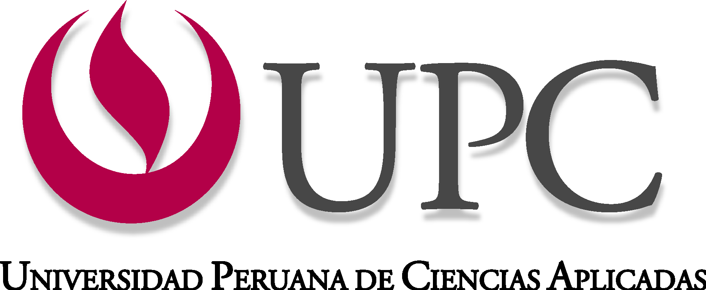

# Universidad Peruana de Ciencias Aplicadas
## Carrera: Ingeniería de Software
## Ciclo: 2025 - 2

## Curso: 1ASI0730 - Aplicaciones Web
## NRC: 7454
## Profesor: Angel Augusto Velasquez Nuñez

# Informe de Trabajo Final
## Startup: Edgerunners
## Producto: Smart Stay

|   Código   |   Apellidos   |     Nombres     |
|:----------:|:-------------:|:---------------:|
| U20221E617 | Verona Flores | Italo Sebastian |
|            |               |                 |
|            |               |                 |
|            |               |                 |
|            |               |                 |

**Mes y Año:** Septiembre 2025

## 📑 Registro de Versiones del Informe

El objetivo de esta sección es resumir las modificaciones relevantes que se realizan al informe durante el ciclo de vida del proyecto.  
Esta sección inicia en una página nueva e incluye un cuadro con la siguiente estructura:

| Versión |   Fecha    |                 Autor                 |                 Descripción de los Cambios                  |
|:-------:|:----------:|:-------------------------------------:|:-----------------------------------------------------------:|
|   1.0   | 01/09/2025 | Jose Jhonatan Saavedra Angulo (Líder) |                                                             |
|   1.0   | 01/09/2025 |     Italo Sebastian Verona Flores     | Creación del documento inicial del Informe de Trabajo Final |

## Project Report Collaboration Insights

- URL del repositorio para el Project Report:

<!-- \-\- Enlace pendiente de agregar por el equipo y capturas sobre el avance en el git hub. \-\- -->

## Contenido

- [Capítulo I: Introducción](#capítulo-i-introducción)
  - [1.1. Startup Profile](#11-startup-profile)
    - [1.1.1. Descripción de la Startup](#111-descripción-de-la-startup)
    - [1.1.2. Perfiles de integrantes del equipo](#112-perfiles-de-integrantes-del-equipo)
  - [1.2. Solution Profile](#12-solution-profile)
    - [1.2.1. Antecedentes y problemática](#121-antecedentes-y-problemática)

# **Capítulo I: Introducción**

## 1.1. Startup Profile

La startup **Smart Stay** surge con el objetivo de transformar la gestión hotelera mediante el uso de tecnologías digitales e Internet of Things (IoT). Su propuesta busca integrar en una sola plataforma la administración de huéspedes, habitaciones y servicios, permitiendo al hotel optimizar recursos y, al mismo tiempo, ofrecer experiencias personalizadas a los clientes.

Entre sus principales características destacan:

- Registro automático de huéspedes mediante sistemas digitales.
- Identificación de habitaciones ocupadas, libres o en mantenimiento.
- Monitoreo de temperatura, iluminación y consumo energético.
- Integración con dispositivos IoT para controlar persianas, temperatura del agua y otros aspectos del confort del huésped.
- Personalización de servicios, como programación de limpieza, room service o entrega de comidas en horarios flexibles.

### 1.1.2. Perfiles de integrantes del equipo

|   Código   |   Apellidos   |     Nombres     |                                                                                                                                                                    Perfil Académico y Profesional                                                                                                                                                                     | Perfil                                       |
|:----------:|:-------------:|:---------------:|:---------------------------------------------------------------------------------------------------------------------------------------------------------------------------------------------------------------------------------------------------------------------------------------------------------------------------------------------------------------------:|----------------------------------------------|
| U20221E617 | Verona Flores | Italo Sebastian | Estudiante de Ingeniería de Software en la Universidad Peruana de Ciencias Aplicadas (UPC). Apasionado por la tecnología y el desarrollo de software, con habilidades en programación web, bases de datos y diseño de interfaces. Experiencia en proyectos académicos y personales que demuestran su capacidad para trabajar en equipo y resolver problemas técnicos. |  |
|            |               |                 |                                                                                                                                                                                                                                                                                                                                                                       |                                              |            |               |                 |                    |
|            |               |                 |                                                                                                                                                                                                                                                                                                                                                                       |                                              |            |               |                 |                    |
|            |               |                 |                                                                                                                                                                                                                                                                                                                                                                       |                                              |            |               |                 |                    |
|            |               |                 |                                                                                                                                                                                                                                                                                                                                                                       |                                              |            |               |                 |                    |

---

## 1.2. Solution Profile

### 1.2.1. Antecedentes y problemática

En la actualidad, la industria hotelera enfrenta diversos desafíos relacionados con la **eficiencia operativa** y la **satisfacción del cliente**. Entre los problemas más frecuentes se identifican:

- **Procesos manuales** en el registro de huéspedes (check-in y check-out), lo que ocasiona demoras y errores.
- **Falta de control en la ocupación de habitaciones**, generando sobrecostos o pérdida de ingresos.
- **Consumo excesivo de recursos** (energía eléctrica, agua, climatización), debido a la ausencia de sistemas inteligentes de monitoreo.
- **Dificultades en la personalización del servicio**, ya que los hoteles suelen ofrecer experiencias estandarizadas sin tomar en cuenta las preferencias de cada huésped.
- **Deficiente comunicación interna** en la gestión de limpieza, mantenimiento y room service.

Estos problemas generan una disminución en la **eficiencia administrativa** del hotel, aumentan los **costos operativos** y reducen la **satisfacción del cliente**, un factor clave en la competitividad dentro del sector turístico y hotelero.

La solución propuesta por **Smart Stay** responde directamente a estas limitaciones, integrando tecnología IoT y una plataforma web centralizada para brindar un servicio hotelero más moderno, eficiente y enfocado en el confort del huésped.  